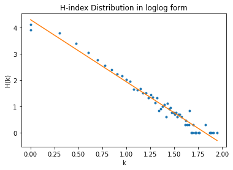

```python
from google.colab import drive
drive.mount("gdrive")
```

    Mounted at gdrive
    


```python
import pandas as pd 
import matplotlib.pyplot as plt
import numpy as np

import networkx as nx

import requests
from bs4 import BeautifulSoup  
import json

import gc
```

# Token Transfers Dataset

In this dataset, we have token transfers done between SALE contract and users for a certain time range. 


```python
df = pd.read_csv("/content/gdrive/MyDrive/project-kittybang/df.csv",index_col=['Unnamed: 0'])
df.head(-1) # lets look 5 from top and 5 from bottom
```

    /usr/local/lib/python3.7/dist-packages/IPython/core/interactiveshell.py:2718: DtypeWarning: Columns (4) have mixed types.Specify dtype option on import or set low_memory=False.
      interactivity=interactivity, compiler=compiler, result=result)
    /usr/local/lib/python3.7/dist-packages/numpy/lib/arraysetops.py:580: FutureWarning: elementwise comparison failed; returning scalar instead, but in the future will perform elementwise comparison
      mask |= (ar1 == a)
    


<div>
<style scoped>
    .dataframe tbody tr th:only-of-type {
        vertical-align: middle;
    }

    .dataframe tbody tr th {
        vertical-align: top;
    }

    .dataframe thead th {
        text-align: right;
    }
</style>
<table border="1" class="dataframe">
  <thead>
    <tr style="text-align: right;">
      <th></th>
      <th>token_address</th>
      <th>from_address</th>
      <th>to_address</th>
      <th>value</th>
      <th>transaction_hash</th>
      <th>log_index</th>
      <th>block_timestamp</th>
      <th>block_number</th>
      <th>block_hash</th>
    </tr>
  </thead>
  <tbody>
    <tr>
      <th>0</th>
      <td>0x06012c8cf97bead5deae237070f9587f8e7a266d</td>
      <td>0xba52c75764d6f594735dc735be7f1830cdf58ddf</td>
      <td>0xb1690c08e213a35ed9bab7b318de14420fb57d8c</td>
      <td>1001</td>
      <td>0x14952600083dbec76c08fb7b4473704642aa3ff626b53f83cd261259eb2c4a82</td>
      <td>49</td>
      <td>2017-11-23 18:44:21+00:00</td>
      <td>4608519</td>
      <td>0x7aa12edf18340af4055a9ed77c230b00579b811387a02c0ffdd4267a67ee050d</td>
    </tr>
    <tr>
      <th>1</th>
      <td>0x06012c8cf97bead5deae237070f9587f8e7a266d</td>
      <td>0xba52c75764d6f594735dc735be7f1830cdf58ddf</td>
      <td>0xb1690c08e213a35ed9bab7b318de14420fb57d8c</td>
      <td>1004</td>
      <td>0x06ee06ee12893fbd6fc853f192a068322fe57152fbb269a1ee90b4a2582de031</td>
      <td>71</td>
      <td>2017-11-23 18:44:21+00:00</td>
      <td>4608519</td>
      <td>0x7aa12edf18340af4055a9ed77c230b00579b811387a02c0ffdd4267a67ee050d</td>
    </tr>
    <tr>
      <th>2</th>
      <td>0x06012c8cf97bead5deae237070f9587f8e7a266d</td>
      <td>0xba52c75764d6f594735dc735be7f1830cdf58ddf</td>
      <td>0xb1690c08e213a35ed9bab7b318de14420fb57d8c</td>
      <td>1008</td>
      <td>0xf9f572e702ede9adeb3dcb73c817a7837abe7cbbddc4150f1272e6c8e176cf60</td>
      <td>79</td>
      <td>2017-11-23 18:44:21+00:00</td>
      <td>4608519</td>
      <td>0x7aa12edf18340af4055a9ed77c230b00579b811387a02c0ffdd4267a67ee050d</td>
    </tr>
    <tr>
      <th>3</th>
      <td>0x06012c8cf97bead5deae237070f9587f8e7a266d</td>
      <td>0xba52c75764d6f594735dc735be7f1830cdf58ddf</td>
      <td>0xb1690c08e213a35ed9bab7b318de14420fb57d8c</td>
      <td>1006</td>
      <td>0xa71a76052a2ac8e231967d5714ddc977215729d13cdc9088c7e9133dbbebf893</td>
      <td>75</td>
      <td>2017-11-23 18:44:21+00:00</td>
      <td>4608519</td>
      <td>0x7aa12edf18340af4055a9ed77c230b00579b811387a02c0ffdd4267a67ee050d</td>
    </tr>
    <tr>
      <th>4</th>
      <td>0x06012c8cf97bead5deae237070f9587f8e7a266d</td>
      <td>0xba52c75764d6f594735dc735be7f1830cdf58ddf</td>
      <td>0xb1690c08e213a35ed9bab7b318de14420fb57d8c</td>
      <td>1010</td>
      <td>0x09c5fdb73577367cd5e2079f4b2c65d744933bb4f819b326ff93d1c0f30c903c</td>
      <td>83</td>
      <td>2017-11-23 18:44:21+00:00</td>
      <td>4608519</td>
      <td>0x7aa12edf18340af4055a9ed77c230b00579b811387a02c0ffdd4267a67ee050d</td>
    </tr>
    <tr>
      <th>...</th>
      <td>...</td>
      <td>...</td>
      <td>...</td>
      <td>...</td>
      <td>...</td>
      <td>...</td>
      <td>...</td>
      <td>...</td>
      <td>...</td>
    </tr>
    <tr>
      <th>2143115</th>
      <td>0x06012c8cf97bead5deae237070f9587f8e7a266d</td>
      <td>0xb1690c08e213a35ed9bab7b318de14420fb57d8c</td>
      <td>0x92e75270032c1ef9ba6842e8978a9c99adc2a365</td>
      <td>1275954</td>
      <td>0x0001084c0088dff4e1368340b0e52b2ca88a5c3bb79091a0dc96d60942859798</td>
      <td>134</td>
      <td>2021-05-06 22:37:27+00:00</td>
      <td>12383505</td>
      <td>0x941ebd4400c159d273bead4c57a2f0b72b43cebe6eefd90f8318099e83d41471</td>
    </tr>
    <tr>
      <th>2143116</th>
      <td>0x06012c8cf97bead5deae237070f9587f8e7a266d</td>
      <td>0xb1690c08e213a35ed9bab7b318de14420fb57d8c</td>
      <td>0x6b8d51a3adbc5ff208e64d4bb6ceb324149a1003</td>
      <td>1892664</td>
      <td>0x8bbefdef5c62bc4e1a9e109c095f792507da50aef395cf9d03ead8acfb340973</td>
      <td>275</td>
      <td>2021-05-06 22:52:11+00:00</td>
      <td>12383568</td>
      <td>0x300262d2b879ed1129a7c990076d5c134181b243280399b9529efd24a2bb9f3e</td>
    </tr>
    <tr>
      <th>2143117</th>
      <td>0x06012c8cf97bead5deae237070f9587f8e7a266d</td>
      <td>0xb1690c08e213a35ed9bab7b318de14420fb57d8c</td>
      <td>0xe784a7e2189cede2556cc103481c121102e968f4</td>
      <td>375163</td>
      <td>0x2cc016025cd7bfa1b0d72d0c2cc3fbb325179845238c22fd692a607988f18ec0</td>
      <td>336</td>
      <td>2021-05-06 23:07:51+00:00</td>
      <td>12383632</td>
      <td>0xee2eefd188a5776574b8c472deef883757ea9868fd309bddb817d2a160108e71</td>
    </tr>
    <tr>
      <th>2143118</th>
      <td>0x06012c8cf97bead5deae237070f9587f8e7a266d</td>
      <td>0xb1690c08e213a35ed9bab7b318de14420fb57d8c</td>
      <td>0x3cdf4b1b07775b8bd249009bbf211a4c87adb566</td>
      <td>1090976</td>
      <td>0x6919f2eb1ad7fede17f0f7871dca4232c6545ea39d6681af97a7dd85184d1ee3</td>
      <td>311</td>
      <td>2021-05-06 23:32:45+00:00</td>
      <td>12383739</td>
      <td>0x6a0dd54f91b2a6394c078ae232b7d6d3a426cf177d85cde37074e1b7edfcd3ba</td>
    </tr>
    <tr>
      <th>2143119</th>
      <td>0x06012c8cf97bead5deae237070f9587f8e7a266d</td>
      <td>0xb1690c08e213a35ed9bab7b318de14420fb57d8c</td>
      <td>0xb99d3369d98ab9c00fb6a48735763a64a1a13599</td>
      <td>1110582</td>
      <td>0x4fdc5a80a9a779e2fa464e96ed068905c76039878c62e96ea96cb50b6e059000</td>
      <td>200</td>
      <td>2021-05-06 23:56:28+00:00</td>
      <td>12383829</td>
      <td>0x89171b6e1fce0114150474fdfad1aca85050fed38c590bb3977689698634dab4</td>
    </tr>
  </tbody>
</table>
<p>2143120 rows × 9 columns</p>
</div>


```python
print(f"Total # of transfers done by SALE contract is {len(df)}")
```

    Total # of transfers done by SALE contract is 2143121
    


```python
## Lets get a simple transaction hash to examine
for row in df.iterrows():
  print(row[1]["transaction_hash"], row[1]["value"])
  break
```

    0x14952600083dbec76c08fb7b4473704642aa3ff626b53f83cd261259eb2c4a82 1001
    

This was an auction starting transaction where user basically puts the kitty to an auction. In order to check for a sale success transaction, lets check transactions where from_address equals to SALE contract address. 


```python
pd.set_option('display.max_colwidth', None)
tx = df.iloc[[2143115]]["transaction_hash"]
tx
```


    2143115    0x0001084c0088dff4e1368340b0e52b2ca88a5c3bb79091a0dc96d60942859798
    Name: transaction_hash, dtype: object


After a brief examination, we have observed that "value" column is actually id of the CryptoKitty. 

Example: https://www.cryptokitties.co/kitty/1275954


## Cattributes Extracted


```python
len(df.value.unique())
```


    989024


This is a very big data hence it would be very hard to maintain every one of them from the server but we can still give it a try


Parsing can be done locally since it crashes the current runtime.


```python
import json
errConsecutive = 0
with open("cats.json","a") as f:
  for id in df.value.unique()[0:10]:
    r = requests.get(f"https://api.cryptokitties.co/v3/kitties/{id}")
    if(r.status_code==200):
      print(r.text)
```

    {"id":1001,"name":"TheFirst","generation":0,"created_at":"2017-11-23T09:18:57.000Z","birthday":"2017-11-23T00:00:00.000Z","image_url":"https://img.cryptokitties.co/0x06012c8cf97bead5deae237070f9587f8e7a266d/1001.svg","image_url_cdn":"https://img.cn.cryptokitties.co/0x06012c8cf97bead5deae237070f9587f8e7a266d/1001.svg","color":"mintgreen","bio":"Hey cutie! I'm TheFirst. In high school, I was voted most likely to work at NASA. When my owner isn't watching, I steal their oversized sweaters and use them for litter paper. I'm not sorry. I think you'll love me beclaws I have cattitude.","kitty_type":null,"is_fancy":false,"is_exclusive":false,"is_special_edition":false,"fancy_type":null,"language":"en","is_prestige":false,"prestige_type":null,"prestige_ranking":null,"prestige_time_limit":null,"status":{"is_ready":true,"is_gestating":false,"cooldown":1519819626755,"dynamic_cooldown":1521108340267,"cooldown_index":9,"cooldown_end_block":4650045,"pending_tx_type":null,"pending_tx_since":null},"purrs":{"count":8,"is_purred":false},"watchlist":{"count":0,"is_watchlisted":false},"hatcher":{"address":"0xba52c75764d6f594735dc735be7f1830cdf58ddf","image":"2","nickname":"COO","hasDapper":false,"twitter_id":null,"twitter_image_url":null,"twitter_handle":null},"auction":{},"offer":{},"owner":{"address":"0x672ec49f7f7eac25c3a2e651f67f579bb5da8936","hasDapper":false,"twitter_id":null,"twitter_image_url":null,"twitter_handle":null,"image":"7","nickname":"Kickycat"},"matron":{},"sire":{},"children":[{"id":3043,"name":"Yasla Love Child | Gen1","generation":1,"enhanced_cattributes":[{"type":"body","kittyId":3043,"position":-1,"description":"ragamuffin"},{"type":"coloreyes","kittyId":3043,"position":-1,"description":"mintgreen"},{"type":"eyes","kittyId":3043,"position":-1,"description":"thicccbrowz"},{"type":"pattern","kittyId":3043,"position":-1,"description":"luckystripe"},{"type":"mouth","kittyId":3043,"position":-1,"description":"happygokitty"},{"type":"colorprimary","kittyId":3043,"position":-1,"description":"orangesoda"},{"type":"colorsecondary","kittyId":3043,"position":-1,"description":"chocolate"},{"type":"colortertiary","kittyId":3043,"position":-1,"description":"kittencream"}],"owner_wallet_address":"0xc7af99fe5513eb6710e6d5f44f9989da40f27f26","owner":{"address":"0xc7af99fe5513eb6710e6d5f44f9989da40f27f26"},"created_at":"2017-11-23T20:15:04.000Z","image_url":"https://img.cryptokitties.co/0x06012c8cf97bead5deae237070f9587f8e7a266d/3043.svg","image_url_cdn":"https://img.cn.cryptokitties.co/0x06012c8cf97bead5deae237070f9587f8e7a266d/3043.svg","color":"mintgreen","is_fancy":false,"is_exclusive":false,"is_special_edition":false,"kitty_type":null,"fancy_type":null,"status":{"is_ready":true,"is_gestating":false,"cooldown":1520423687635},"hatched":true,"wrapped":false,"image_url_png":"https://img.cryptokitties.co/0x06012c8cf97bead5deae237070f9587f8e7a266d/3043.png","image_url_kitty_items":"https://img.cryptokitties.cohttps://storage.googleapis.com/ck-kitty-image/0x06012c8cf97bead5deae237070f9587f8e7a266d/3043.items.svg"},{"id":3153,"name":"Silver (Gen 1)","generation":1,"enhanced_cattributes":[{"type":"body","kittyId":3153,"position":-1,"description":"sphynx"},{"type":"coloreyes","kittyId":3153,"position":-1,"description":"mintgreen"},{"type":"eyes","kittyId":3153,"position":-1,"description":"crazy"},{"type":"pattern","kittyId":3153,"position":-1,"description":"luckystripe"},{"type":"mouth","kittyId":3153,"position":-1,"description":"happygokitty"},{"type":"colorprimary","kittyId":3153,"position":-1,"description":"shadowgrey"},{"type":"colorsecondary","kittyId":3153,"position":-1,"description":"chocolate"},{"type":"colortertiary","kittyId":3153,"position":-1,"description":"granitegrey"}],"owner_wallet_address":"0x6b1a6500f1c358468a72f9b726b0818aa212999d","owner":{"address":"0x6b1a6500f1c358468a72f9b726b0818aa212999d"},"created_at":"2017-11-23T22:35:11.000Z","image_url":"https://img.cryptokitties.co/0x06012c8cf97bead5deae237070f9587f8e7a266d/3153.svg","image_url_cdn":"https://img.cn.cryptokitties.co/0x06012c8cf97bead5deae237070f9587f8e7a266d/3153.svg","color":"mintgreen","is_fancy":false,"is_exclusive":false,"is_special_edition":false,"kitty_type":null,"fancy_type":null,"status":{"is_ready":true,"is_gestating":false,"cooldown":1520591397023},"hatched":true,"wrapped":false,"image_url_png":"https://img.cryptokitties.co/0x06012c8cf97bead5deae237070f9587f8e7a266d/3153.png","image_url_kitty_items":"https://img.cryptokitties.cohttps://storage.googleapis.com/ck-kitty-image/0x06012c8cf97bead5deae237070f9587f8e7a266d/3153.items.svg"},{"id":3239,"name":"Original","generation":6,"enhanced_cattributes":[{"type":"body","kittyId":3239,"position":-1,"description":"munchkin"},{"type":"coloreyes","kittyId":3239,"position":-1,"description":"topaz"},{"type":"eyes","kittyId":3239,"position":-1,"description":"simple"},{"type":"pattern","kittyId":3239,"position":-1,"description":"totesbasic"},{"type":"mouth","kittyId":3239,"position":-1,"description":"happygokitty"},{"type":"colorprimary","kittyId":3239,"position":-1,"description":"orangesoda"},{"type":"colorsecondary","kittyId":3239,"position":-1,"description":"swampgreen"},{"type":"colortertiary","kittyId":3239,"position":-1,"description":"granitegrey"}],"owner_wallet_address":"0x9c4b1564355a702b17f6c9e2f829c19147fb76a2","owner":{"address":"0x9c4b1564355a702b17f6c9e2f829c19147fb76a2"},"created_at":"2017-11-23T23:11:30.000Z","image_url":"https://img.cryptokitties.co/0x06012c8cf97bead5deae237070f9587f8e7a266d/3239.svg","image_url_cdn":"https://img.cn.cryptokitties.co/0x06012c8cf97bead5deae237070f9587f8e7a266d/3239.svg","color":"topaz","is_fancy":false,"is_exclusive":false,"is_special_edition":false,"kitty_type":null,"fancy_type":null,"status":{"is_ready":true,"is_gestating":false,"cooldown":1520097880150},"hatched":true,"wrapped":false,"image_url_png":"https://img.cryptokitties.co/0x06012c8cf97bead5deae237070f9587f8e7a266d/3239.png","image_url_kitty_items":"https://img.cryptokitties.cohttps://storage.googleapis.com/ck-kitty-image/0x06012c8cf97bead5deae237070f9587f8e7a266d/3239.items.svg"},{"id":3567,"name":"Son of The First","generation":6,"enhanced_cattributes":[{"type":"body","kittyId":3567,"position":-1,"description":"himalayan"},{"type":"coloreyes","kittyId":3567,"position":-1,"description":"sizzurp"},{"type":"eyes","kittyId":3567,"position":-1,"description":"simple"},{"type":"pattern","kittyId":3567,"position":-1,"description":"luckystripe"},{"type":"mouth","kittyId":3567,"position":-1,"description":"soserious"},{"type":"colorprimary","kittyId":3298,"position":7,"description":"cloudwhite"},{"type":"colorsecondary","kittyId":3567,"position":-1,"description":"royalpurple"},{"type":"colortertiary","kittyId":3567,"position":-1,"description":"granitegrey"}],"owner_wallet_address":"0xb1690c08e213a35ed9bab7b318de14420fb57d8c","owner":{"address":"0xb1690c08e213a35ed9bab7b318de14420fb57d8c"},"created_at":"2017-11-24T01:22:16.000Z","image_url":"https://img.cryptokitties.co/0x06012c8cf97bead5deae237070f9587f8e7a266d/3567.svg","image_url_cdn":"https://img.cn.cryptokitties.co/0x06012c8cf97bead5deae237070f9587f8e7a266d/3567.svg","color":"sizzurp","is_fancy":false,"is_exclusive":false,"is_special_edition":false,"kitty_type":null,"fancy_type":null,"status":{"is_ready":true,"is_gestating":false,"cooldown":1519797365355},"hatched":true,"wrapped":false,"image_url_png":"https://img.cryptokitties.co/0x06012c8cf97bead5deae237070f9587f8e7a266d/3567.png","image_url_kitty_items":"https://img.cryptokitties.cohttps://storage.googleapis.com/ck-kitty-image/0x06012c8cf97bead5deae237070f9587f8e7a266d/3567.items.svg"},{"id":5438,"name":"Purrpull","generation":9,"enhanced_cattributes":[{"type":"body","kittyId":5438,"position":-1,"description":"himalayan"},{"type":"coloreyes","kittyId":5438,"position":-1,"description":"chestnut"},{"type":"eyes","kittyId":5438,"position":-1,"description":"simple"},{"type":"pattern","kittyId":5438,"position":-1,"description":"totesbasic"},{"type":"mouth","kittyId":5438,"position":-1,"description":"happygokitty"},{"type":"colorprimary","kittyId":5438,"position":-1,"description":"greymatter"},{"type":"colorsecondary","kittyId":5438,"position":-1,"description":"swampgreen"},{"type":"colortertiary","kittyId":5438,"position":-1,"description":"granitegrey"}],"owner_wallet_address":"0x9b1ba150e7ef6b7195b1c1c7eb109fd905e6deed","owner":{"address":"0x9b1ba150e7ef6b7195b1c1c7eb109fd905e6deed"},"created_at":"2017-11-24T20:28:58.000Z","image_url":"https://img.cryptokitties.co/0x06012c8cf97bead5deae237070f9587f8e7a266d/5438.svg","image_url_cdn":"https://img.cn.cryptokitties.co/0x06012c8cf97bead5deae237070f9587f8e7a266d/5438.svg","color":"chestnut","is_fancy":false,"is_exclusive":false,"is_special_edition":false,"kitty_type":null,"fancy_type":null,"status":{"is_ready":true,"is_gestating":false,"cooldown":1459187940458},"hatched":true,"wrapped":false,"image_url_png":"https://img.cryptokitties.co/0x06012c8cf97bead5deae237070f9587f8e7a266d/5438.png","image_url_kitty_items":"https://img.cryptokitties.cohttps://storage.googleapis.com/ck-kitty-image/0x06012c8cf97bead5deae237070f9587f8e7a266d/5438.items.svg"},{"id":10219,"name":"Tintin G14V","generation":14,"enhanced_cattributes":[{"type":"body","kittyId":3006,"position":1,"description":"laperm"},{"type":"coloreyes","kittyId":10219,"position":-1,"description":"mintgreen"},{"type":"eyes","kittyId":10219,"position":-1,"description":"simple"},{"type":"pattern","kittyId":10219,"position":-1,"description":"luckystripe"},{"type":"mouth","kittyId":3020,"position":1,"description":"tongue"},{"type":"colorprimary","kittyId":10219,"position":-1,"description":"shadowgrey"},{"type":"colorsecondary","kittyId":10219,"position":-1,"description":"coffee"},{"type":"colortertiary","kittyId":10219,"position":-1,"description":"kittencream"}],"owner_wallet_address":"0xccb77cda5c2351b41ea74bb2a5d9ef107308f5b1","owner":{"address":"0xccb77cda5c2351b41ea74bb2a5d9ef107308f5b1"},"created_at":"2017-11-28T20:45:07.000Z","image_url":"https://img.cryptokitties.co/0x06012c8cf97bead5deae237070f9587f8e7a266d/10219.svg","image_url_cdn":"https://img.cn.cryptokitties.co/0x06012c8cf97bead5deae237070f9587f8e7a266d/10219.svg","color":"mintgreen","is_fancy":false,"is_exclusive":false,"is_special_edition":false,"kitty_type":null,"fancy_type":null,"status":{"is_ready":true,"is_gestating":false,"cooldown":1458668582277},"hatched":true,"wrapped":false,"image_url_png":"https://img.cryptokitties.co/0x06012c8cf97bead5deae237070f9587f8e7a266d/10219.png","image_url_kitty_items":"https://img.cryptokitties.cohttps://storage.googleapis.com/ck-kitty-image/0x06012c8cf97bead5deae237070f9587f8e7a266d/10219.items.svg"},{"id":10423,"name":"Gen 2 Lemonade Thicc","generation":2,"enhanced_cattributes":[{"type":"body","kittyId":10423,"position":-1,"description":"himalayan"},{"type":"coloreyes","kittyId":10423,"position":-1,"description":"strawberry"},{"type":"eyes","kittyId":10423,"position":-1,"description":"thicccbrowz"},{"type":"pattern","kittyId":10423,"position":-1,"description":"totesbasic"},{"type":"mouth","kittyId":10423,"position":-1,"description":"happygokitty"},{"type":"colorprimary","kittyId":10423,"position":-1,"description":"orangesoda"},{"type":"colorsecondary","kittyId":10423,"position":-1,"description":"lemonade"},{"type":"colortertiary","kittyId":10423,"position":-1,"description":"granitegrey"}],"owner_wallet_address":"0xb6ad61b7558c718269a9129bd9ed9839d88a126a","owner":{"address":"0xb6ad61b7558c718269a9129bd9ed9839d88a126a"},"created_at":"2017-11-28T23:43:41.000Z","image_url":"https://img.cryptokitties.co/0x06012c8cf97bead5deae237070f9587f8e7a266d/10423.svg","image_url_cdn":"https://img.cn.cryptokitties.co/0x06012c8cf97bead5deae237070f9587f8e7a266d/10423.svg","color":"strawberry","is_fancy":false,"is_exclusive":false,"is_special_edition":false,"kitty_type":null,"fancy_type":null,"status":{"is_ready":true,"is_gestating":false,"cooldown":1519688761081},"hatched":true,"wrapped":false,"image_url_png":"https://img.cryptokitties.co/0x06012c8cf97bead5deae237070f9587f8e7a266d/10423.png","image_url_kitty_items":"https://img.cryptokitties.cohttps://storage.googleapis.com/ck-kitty-image/0x06012c8cf97bead5deae237070f9587f8e7a266d/10423.items.svg"},{"id":14066,"name":"Fast Gen 1 Virgin","generation":1,"enhanced_cattributes":[{"type":"body","kittyId":14066,"position":-1,"description":"munchkin"},{"type":"coloreyes","kittyId":14066,"position":-1,"description":"sizzurp"},{"type":"eyes","kittyId":14066,"position":194,"description":"raisedbrow"},{"type":"pattern","kittyId":14066,"position":-1,"description":"luckystripe"},{"type":"mouth","kittyId":14066,"position":146,"description":"tongue"},{"type":"colorprimary","kittyId":14066,"position":-1,"description":"shadowgrey"},{"type":"colorsecondary","kittyId":14066,"position":-1,"description":"coffee"},{"type":"colortertiary","kittyId":14066,"position":-1,"description":"granitegrey"}],"owner_wallet_address":"0xb1690c08e213a35ed9bab7b318de14420fb57d8c","owner":{"address":"0xb1690c08e213a35ed9bab7b318de14420fb57d8c"},"created_at":"2017-11-30T00:48:10.000Z","image_url":"https://img.cryptokitties.co/0x06012c8cf97bead5deae237070f9587f8e7a266d/14066.svg","image_url_cdn":"https://img.cn.cryptokitties.co/0x06012c8cf97bead5deae237070f9587f8e7a266d/14066.svg","color":"sizzurp","is_fancy":false,"is_exclusive":false,"is_special_edition":false,"kitty_type":null,"fancy_type":null,"status":{"is_ready":true,"is_gestating":false,"cooldown":1458899490578},"hatched":true,"wrapped":false,"image_url_png":"https://img.cryptokitties.co/0x06012c8cf97bead5deae237070f9587f8e7a266d/14066.png","image_url_kitty_items":"https://img.cryptokitties.cohttps://storage.googleapis.com/ck-kitty-image/0x06012c8cf97bead5deae237070f9587f8e7a266d/14066.items.svg"},{"id":15116,"name":"twitch.tv/bitcoin_louie","generation":1,"enhanced_cattributes":[{"type":"body","kittyId":15116,"position":-1,"description":"ragamuffin"},{"type":"coloreyes","kittyId":15116,"position":-1,"description":"chestnut"},{"type":"eyes","kittyId":15116,"position":-1,"description":"crazy"},{"type":"pattern","kittyId":15116,"position":-1,"description":"totesbasic"},{"type":"mouth","kittyId":15116,"position":-1,"description":"pouty"},{"type":"colorprimary","kittyId":15116,"position":-1,"description":"shadowgrey"},{"type":"colorsecondary","kittyId":15116,"position":-1,"description":"royalpurple"},{"type":"colortertiary","kittyId":15116,"position":-1,"description":"granitegrey"}],"owner_wallet_address":"0x678e2da2e8be98c58dc54df92c6b88b5b52eabc8","owner":{"address":"0x678e2da2e8be98c58dc54df92c6b88b5b52eabc8"},"created_at":"2017-11-30T05:16:34.000Z","image_url":"https://img.cryptokitties.co/0x06012c8cf97bead5deae237070f9587f8e7a266d/15116.svg","image_url_cdn":"https://img.cn.cryptokitties.co/0x06012c8cf97bead5deae237070f9587f8e7a266d/15116.svg","color":"chestnut","is_fancy":false,"is_exclusive":false,"is_special_edition":false,"kitty_type":null,"fancy_type":null,"status":{"is_ready":true,"is_gestating":false,"cooldown":1526195990650},"hatched":true,"wrapped":false,"image_url_png":"https://img.cryptokitties.co/0x06012c8cf97bead5deae237070f9587f8e7a266d/15116.png","image_url_kitty_items":"https://img.cryptokitties.cohttps://storage.googleapis.com/ck-kitty-image/0x06012c8cf97bead5deae237070f9587f8e7a266d/15116.items.svg"}],"hatched":true,"wrapped":false,"enhanced_cattributes":[{"type":"colorprimary","description":"shadowgrey","position":null,"kittyId":1001},{"type":"coloreyes","description":"mintgreen","position":null,"kittyId":1001},{"type":"body","description":"ragamuffin","position":null,"kittyId":1001},{"type":"colorsecondary","description":"swampgreen","position":null,"kittyId":1001},{"type":"mouth","description":"happygokitty","position":null,"kittyId":1001},{"type":"pattern","description":"luckystripe","position":null,"kittyId":1001},{"type":"eyes","description":"crazy","position":null,"kittyId":1001},{"type":"colortertiary","description":"granitegrey","position":null,"kittyId":1001},{"type":"secret","description":"se4","position":-1,"kittyId":1001},{"type":"purrstige","description":"pu9","position":-1,"kittyId":1001}],"variation":null,"variation_ranking":null,"image_url_png":"https://img.cryptokitties.co/0x06012c8cf97bead5deae237070f9587f8e7a266d/1001.png","image_url_kitty_items":"https://img.cryptokitties.co/0x06012c8cf97bead5deae237070f9587f8e7a266d/1001.items.svg"}
    {"id":1004,"name":"SeaFoam","generation":0,"created_at":"2017-11-23T09:19:32.000Z","birthday":"2017-11-23T00:00:00.000Z","image_url":"https://img.cryptokitties.co/0x06012c8cf97bead5deae237070f9587f8e7a266d/1004.svg","image_url_cdn":"https://img.cn.cryptokitties.co/0x06012c8cf97bead5deae237070f9587f8e7a266d/1004.svg","color":"mintgreen","bio":"Ugh! I'm SeaFoam. I've never told anyone this, but I once kissed a dog. I once dreamed of being a Train Conductor. Now I can be found summoning ghosts all day. Our friendship will be vegan, brilliant, and full of apple pie.","kitty_type":null,"is_fancy":false,"is_exclusive":false,"is_special_edition":false,"fancy_type":null,"language":"en","is_prestige":false,"prestige_type":null,"prestige_ranking":null,"prestige_time_limit":null,"status":{"is_ready":true,"is_gestating":false,"cooldown":1520004114793,"dynamic_cooldown":1521291020919,"cooldown_index":6,"cooldown_end_block":4664278,"pending_tx_type":null,"pending_tx_since":null},"purrs":{"count":3,"is_purred":false},"watchlist":{"count":0,"is_watchlisted":false},"hatcher":{"address":"0xba52c75764d6f594735dc735be7f1830cdf58ddf","image":"2","nickname":"COO","hasDapper":false,"twitter_id":null,"twitter_image_url":null,"twitter_handle":null},"auction":{},"offer":{},"owner":{"address":"0xb12720e2b3e4b53ece38009a0b64fc87c56da8d6","hasDapper":false,"twitter_id":null,"twitter_image_url":null,"twitter_handle":null,"image":"9","nickname":"miezekatze"},"matron":{},"sire":{},"children":[{"id":3032,"name":"Salmon","generation":1,"enhanced_cattributes":[{"type":"body","kittyId":3032,"position":-1,"description":"himalayan"},{"type":"coloreyes","kittyId":3032,"position":-1,"description":"mintgreen"},{"type":"eyes","kittyId":3032,"position":-1,"description":"thicccbrowz"},{"type":"pattern","kittyId":3032,"position":-1,"description":"luckystripe"},{"type":"mouth","kittyId":3032,"position":-1,"description":"pouty"},{"type":"colorprimary","kittyId":3032,"position":-1,"description":"salmon"},{"type":"colorsecondary","kittyId":3032,"position":-1,"description":"coffee"},{"type":"colortertiary","kittyId":3032,"position":-1,"description":"kittencream"}],"owner_wallet_address":"0xb669b9e2613d7c3df3f7e05521dc9721a9a92d10","owner":{"address":"0xb669b9e2613d7c3df3f7e05521dc9721a9a92d10"},"created_at":"2017-11-23T20:08:38.000Z","image_url":"https://img.cryptokitties.co/0x06012c8cf97bead5deae237070f9587f8e7a266d/3032.svg","image_url_cdn":"https://img.cn.cryptokitties.co/0x06012c8cf97bead5deae237070f9587f8e7a266d/3032.svg","color":"mintgreen","is_fancy":false,"is_exclusive":false,"is_special_edition":false,"kitty_type":null,"fancy_type":null,"status":{"is_ready":true,"is_gestating":false,"cooldown":1520023087856},"hatched":true,"wrapped":false,"image_url_png":"https://img.cryptokitties.co/0x06012c8cf97bead5deae237070f9587f8e7a266d/3032.png","image_url_kitty_items":"https://img.cryptokitties.cohttps://storage.googleapis.com/ck-kitty-image/0x06012c8cf97bead5deae237070f9587f8e7a266d/3032.items.svg"},{"id":3042,"name":null,"generation":1,"enhanced_cattributes":[{"type":"body","kittyId":3042,"position":-1,"description":"himalayan"},{"type":"coloreyes","kittyId":3042,"position":-1,"description":"mintgreen"},{"type":"eyes","kittyId":3042,"position":-1,"description":"crazy"},{"type":"pattern","kittyId":3042,"position":-1,"description":"luckystripe"},{"type":"mouth","kittyId":3042,"position":-1,"description":"pouty"},{"type":"colorprimary","kittyId":3042,"position":-1,"description":"shadowgrey"},{"type":"colorsecondary","kittyId":3042,"position":3,"description":"barkbrown"},{"type":"colortertiary","kittyId":3042,"position":-1,"description":"kittencream"}],"owner_wallet_address":"0x3849082eff243a825a82baea2a7c6f20a1134fd0","owner":{"address":"0x3849082eff243a825a82baea2a7c6f20a1134fd0"},"created_at":"2017-11-23T20:14:41.000Z","image_url":"https://img.cryptokitties.co/0x06012c8cf97bead5deae237070f9587f8e7a266d/3042.svg","image_url_cdn":"https://img.cn.cryptokitties.co/0x06012c8cf97bead5deae237070f9587f8e7a266d/3042.svg","color":"mintgreen","is_fancy":false,"is_exclusive":false,"is_special_edition":false,"kitty_type":null,"fancy_type":null,"status":{"is_ready":true,"is_gestating":false,"cooldown":1519685802255},"hatched":true,"wrapped":false,"image_url_png":"https://img.cryptokitties.co/0x06012c8cf97bead5deae237070f9587f8e7a266d/3042.png","image_url_kitty_items":"https://img.cryptokitties.cohttps://storage.googleapis.com/ck-kitty-image/0x06012c8cf97bead5deae237070f9587f8e7a266d/3042.items.svg"},{"id":13102,"name":"Crop 1","generation":5,"enhanced_cattributes":[{"type":"body","kittyId":13102,"position":-1,"description":"himalayan"},{"type":"coloreyes","kittyId":13102,"position":-1,"description":"mintgreen"},{"type":"eyes","kittyId":13102,"position":-1,"description":"thicccbrowz"},{"type":"pattern","kittyId":13102,"position":-1,"description":"luckystripe"},{"type":"mouth","kittyId":13102,"position":-1,"description":"pouty"},{"type":"colorprimary","kittyId":13102,"position":-1,"description":"shadowgrey"},{"type":"colorsecondary","kittyId":13102,"position":-1,"description":"coffee"},{"type":"colortertiary","kittyId":13102,"position":-1,"description":"kittencream"}],"owner_wallet_address":"0xb12720e2b3e4b53ece38009a0b64fc87c56da8d6","owner":{"address":"0xb12720e2b3e4b53ece38009a0b64fc87c56da8d6"},"created_at":"2017-11-29T20:39:06.000Z","image_url":"https://img.cryptokitties.co/0x06012c8cf97bead5deae237070f9587f8e7a266d/13102.svg","image_url_cdn":"https://img.cn.cryptokitties.co/0x06012c8cf97bead5deae237070f9587f8e7a266d/13102.svg","color":"mintgreen","is_fancy":false,"is_exclusive":false,"is_special_edition":false,"kitty_type":null,"fancy_type":null,"status":{"is_ready":true,"is_gestating":false,"cooldown":1519498928227},"hatched":true,"wrapped":false,"image_url_png":"https://img.cryptokitties.co/0x06012c8cf97bead5deae237070f9587f8e7a266d/13102.png","image_url_kitty_items":"https://img.cryptokitties.cohttps://storage.googleapis.com/ck-kitty-image/0x06012c8cf97bead5deae237070f9587f8e7a266d/13102.items.svg"},{"id":23343,"name":"Crop 3","generation":17,"enhanced_cattributes":[{"type":"body","kittyId":23343,"position":-1,"description":"munchkin"},{"type":"coloreyes","kittyId":23343,"position":-1,"description":"mintgreen"},{"type":"eyes","kittyId":23343,"position":-1,"description":"simple"},{"type":"pattern","kittyId":3493,"position":3,"description":"tigerpunk"},{"type":"mouth","kittyId":23343,"position":-1,"description":"soserious"},{"type":"colorprimary","kittyId":23343,"position":-1,"description":"orangesoda"},{"type":"colorsecondary","kittyId":23343,"position":-1,"description":"coffee"},{"type":"colortertiary","kittyId":23343,"position":-1,"description":"granitegrey"}],"owner_wallet_address":"0xb12720e2b3e4b53ece38009a0b64fc87c56da8d6","owner":{"address":"0xb12720e2b3e4b53ece38009a0b64fc87c56da8d6"},"created_at":"2017-12-01T17:53:27.000Z","image_url":"https://img.cryptokitties.co/0x06012c8cf97bead5deae237070f9587f8e7a266d/23343.svg","image_url_cdn":"https://img.cn.cryptokitties.co/0x06012c8cf97bead5deae237070f9587f8e7a266d/23343.svg","color":"mintgreen","is_fancy":false,"is_exclusive":false,"is_special_edition":false,"kitty_type":null,"fancy_type":null,"status":{"is_ready":true,"is_gestating":false,"cooldown":1518919424240},"hatched":true,"wrapped":false,"image_url_png":"https://img.cryptokitties.co/0x06012c8cf97bead5deae237070f9587f8e7a266d/23343.png","image_url_kitty_items":"https://img.cryptokitties.cohttps://storage.googleapis.com/ck-kitty-image/0x06012c8cf97bead5deae237070f9587f8e7a266d/23343.items.svg"},{"id":25121,"name":"Crop 4","generation":5,"enhanced_cattributes":[{"type":"body","kittyId":25121,"position":-1,"description":"ragamuffin"},{"type":"coloreyes","kittyId":25121,"position":-1,"description":"strawberry"},{"type":"eyes","kittyId":25121,"position":-1,"description":"thicccbrowz"},{"type":"pattern","kittyId":25121,"position":-1,"description":"luckystripe"},{"type":"mouth","kittyId":25121,"position":-1,"description":"pouty"},{"type":"colorprimary","kittyId":25121,"position":-1,"description":"aquamarine"},{"type":"colorsecondary","kittyId":25121,"position":-1,"description":"coffee"},{"type":"colortertiary","kittyId":25121,"position":-1,"description":"kittencream"}],"owner_wallet_address":"0xb12720e2b3e4b53ece38009a0b64fc87c56da8d6","owner":{"address":"0xb12720e2b3e4b53ece38009a0b64fc87c56da8d6"},"created_at":"2017-12-01T23:11:25.000Z","image_url":"https://img.cryptokitties.co/0x06012c8cf97bead5deae237070f9587f8e7a266d/25121.svg","image_url_cdn":"https://img.cn.cryptokitties.co/0x06012c8cf97bead5deae237070f9587f8e7a266d/25121.svg","color":"strawberry","is_fancy":false,"is_exclusive":false,"is_special_edition":false,"kitty_type":null,"fancy_type":null,"status":{"is_ready":true,"is_gestating":false,"cooldown":1518732234520},"hatched":true,"wrapped":false,"image_url_png":"https://img.cryptokitties.co/0x06012c8cf97bead5deae237070f9587f8e7a266d/25121.png","image_url_kitty_items":"https://img.cryptokitties.cohttps://storage.googleapis.com/ck-kitty-image/0x06012c8cf97bead5deae237070f9587f8e7a266d/25121.items.svg"},{"id":31884,"name":"Crop 5","generation":10,"enhanced_cattributes":[{"type":"body","kittyId":31884,"position":-1,"description":"munchkin"},{"type":"coloreyes","kittyId":31884,"position":-1,"description":"sizzurp"},{"type":"eyes","kittyId":31884,"position":-1,"description":"thicccbrowz"},{"type":"pattern","kittyId":31884,"position":-1,"description":"totesbasic"},{"type":"mouth","kittyId":31884,"position":-1,"description":"pouty"},{"type":"colorprimary","kittyId":31884,"position":-1,"description":"aquamarine"},{"type":"colorsecondary","kittyId":31884,"position":-1,"description":"coffee"},{"type":"colortertiary","kittyId":31884,"position":-1,"description":"granitegrey"}],"owner_wallet_address":"0xb12720e2b3e4b53ece38009a0b64fc87c56da8d6","owner":{"address":"0xb12720e2b3e4b53ece38009a0b64fc87c56da8d6"},"created_at":"2017-12-02T20:09:44.000Z","image_url":"https://img.cryptokitties.co/0x06012c8cf97bead5deae237070f9587f8e7a266d/31884.svg","image_url_cdn":"https://img.cn.cryptokitties.co/0x06012c8cf97bead5deae237070f9587f8e7a266d/31884.svg","color":"sizzurp","is_fancy":false,"is_exclusive":false,"is_special_edition":false,"kitty_type":null,"fancy_type":null,"status":{"is_ready":true,"is_gestating":false,"cooldown":1454998725380},"hatched":true,"wrapped":false,"image_url_png":"https://img.cryptokitties.co/0x06012c8cf97bead5deae237070f9587f8e7a266d/31884.png","image_url_kitty_items":"https://img.cryptokitties.cohttps://storage.googleapis.com/ck-kitty-image/0x06012c8cf97bead5deae237070f9587f8e7a266d/31884.items.svg"}],"hatched":true,"wrapped":false,"enhanced_cattributes":[{"type":"colorprimary","description":"aquamarine","position":null,"kittyId":1004},{"type":"coloreyes","description":"mintgreen","position":null,"kittyId":1004},{"type":"body","description":"himalayan","position":null,"kittyId":1004},{"type":"colorsecondary","description":"coffee","position":null,"kittyId":1004},{"type":"mouth","description":"pouty","position":null,"kittyId":1004},{"type":"pattern","description":"luckystripe","position":null,"kittyId":1004},{"type":"eyes","description":"crazy","position":null,"kittyId":1004},{"type":"colortertiary","description":"kittencream","position":null,"kittyId":1004},{"type":"secret","description":"se6","position":-1,"kittyId":1004},{"type":"purrstige","description":"pu8","position":-1,"kittyId":1004}],"variation":null,"variation_ranking":null,"image_url_png":"https://img.cryptokitties.co/0x06012c8cf97bead5deae237070f9587f8e7a266d/1004.png","image_url_kitty_items":"https://img.cryptokitties.co/0x06012c8cf97bead5deae237070f9587f8e7a266d/1004.items.svg"}
    {"id":1008,"name":"Kimchi","generation":0,"created_at":"2017-11-23T09:20:44.000Z","birthday":"2017-11-23T00:00:00.000Z","image_url":"https://img.cryptokitties.co/0x06012c8cf97bead5deae237070f9587f8e7a266d/1008.svg","image_url_cdn":"https://img.cn.cryptokitties.co/0x06012c8cf97bead5deae237070f9587f8e7a266d/1008.svg","color":"mintgreen","bio":"*waves*! I'm Kimchi. I want to live in a world where people believe the world is flat. When no one's home, I invite my pals over and we listen to Ace of Base. In time you'll learn how purrfect I am.","kitty_type":null,"is_fancy":false,"is_exclusive":false,"is_special_edition":false,"fancy_type":null,"language":"en","is_prestige":false,"prestige_type":null,"prestige_ranking":null,"prestige_time_limit":null,"status":{"is_ready":true,"is_gestating":false,"cooldown":1519304724022,"dynamic_cooldown":1520598482938,"cooldown_index":2,"cooldown_end_block":4610321,"pending_tx_type":null,"pending_tx_since":null},"purrs":{"count":2,"is_purred":false},"watchlist":{"count":0,"is_watchlisted":false},"hatcher":{"address":"0xba52c75764d6f594735dc735be7f1830cdf58ddf","image":"2","nickname":"COO","hasDapper":false,"twitter_id":null,"twitter_image_url":null,"twitter_handle":null},"auction":{},"offer":{},"owner":{"address":"0x76df4c63c28d462d5064add17f51e2ad55c9d5a2","hasDapper":false,"twitter_id":null,"twitter_image_url":null,"twitter_handle":null,"image":"19","nickname":"kimchi"},"matron":{},"sire":{},"children":[{"id":3585,"name":"Carlos","generation":1,"enhanced_cattributes":[{"type":"body","kittyId":3585,"position":-1,"description":"ragamuffin"},{"type":"coloreyes","kittyId":3585,"position":-1,"description":"strawberry"},{"type":"eyes","kittyId":3585,"position":-1,"description":"thicccbrowz"},{"type":"pattern","kittyId":3585,"position":-1,"description":"totesbasic"},{"type":"mouth","kittyId":3585,"position":2,"description":"dali"},{"type":"colorprimary","kittyId":3585,"position":-1,"description":"orangesoda"},{"type":"colorsecondary","kittyId":3585,"position":-1,"description":"coffee"},{"type":"colortertiary","kittyId":3585,"position":-1,"description":"granitegrey"}],"owner_wallet_address":"0x76df4c63c28d462d5064add17f51e2ad55c9d5a2","owner":{"address":"0x76df4c63c28d462d5064add17f51e2ad55c9d5a2"},"created_at":"2017-11-24T01:30:48.000Z","image_url":"https://img.cryptokitties.co/0x06012c8cf97bead5deae237070f9587f8e7a266d/3585.svg","image_url_cdn":"https://img.cn.cryptokitties.co/0x06012c8cf97bead5deae237070f9587f8e7a266d/3585.svg","color":"strawberry","is_fancy":false,"is_exclusive":false,"is_special_edition":false,"kitty_type":null,"fancy_type":null,"status":{"is_ready":true,"is_gestating":false,"cooldown":1528876860061},"hatched":true,"wrapped":false,"image_url_png":"https://img.cryptokitties.co/0x06012c8cf97bead5deae237070f9587f8e7a266d/3585.png","image_url_kitty_items":"https://img.cryptokitties.cohttps://storage.googleapis.com/ck-kitty-image/0x06012c8cf97bead5deae237070f9587f8e7a266d/3585.items.svg"},{"id":3595,"name":null,"generation":1,"enhanced_cattributes":[{"type":"body","kittyId":3595,"position":-1,"description":"ragamuffin"},{"type":"coloreyes","kittyId":3595,"position":-1,"description":"strawberry"},{"type":"eyes","kittyId":3595,"position":-1,"description":"crazy"},{"type":"pattern","kittyId":3595,"position":-1,"description":"totesbasic"},{"type":"mouth","kittyId":3595,"position":-1,"description":"pouty"},{"type":"colorprimary","kittyId":3595,"position":-1,"description":"shadowgrey"},{"type":"colorsecondary","kittyId":3595,"position":-1,"description":"swampgreen"},{"type":"colortertiary","kittyId":3595,"position":-1,"description":"granitegrey"}],"owner_wallet_address":"0x76df4c63c28d462d5064add17f51e2ad55c9d5a2","owner":{"address":"0x76df4c63c28d462d5064add17f51e2ad55c9d5a2"},"created_at":"2017-11-24T01:36:39.000Z","image_url":"https://img.cryptokitties.co/0x06012c8cf97bead5deae237070f9587f8e7a266d/3595.svg","image_url_cdn":"https://img.cn.cryptokitties.co/0x06012c8cf97bead5deae237070f9587f8e7a266d/3595.svg","color":"strawberry","is_fancy":false,"is_exclusive":false,"is_special_edition":false,"kitty_type":null,"fancy_type":null,"status":{"is_ready":true,"is_gestating":false,"cooldown":1519855105185},"hatched":true,"wrapped":false,"image_url_png":"https://img.cryptokitties.co/0x06012c8cf97bead5deae237070f9587f8e7a266d/3595.png","image_url_kitty_items":"https://img.cryptokitties.cohttps://storage.googleapis.com/ck-kitty-image/0x06012c8cf97bead5deae237070f9587f8e7a266d/3595.items.svg"}],"hatched":true,"wrapped":false,"enhanced_cattributes":[{"type":"colorprimary","description":"orangesoda","position":null,"kittyId":1008},{"type":"coloreyes","description":"mintgreen","position":null,"kittyId":1008},{"type":"body","description":"ragamuffin","position":null,"kittyId":1008},{"type":"colorsecondary","description":"royalpurple","position":null,"kittyId":1008},{"type":"mouth","description":"pouty","position":null,"kittyId":1008},{"type":"pattern","description":"luckystripe","position":null,"kittyId":1008},{"type":"eyes","description":"thicccbrowz","position":null,"kittyId":1008},{"type":"colortertiary","description":"granitegrey","position":null,"kittyId":1008},{"type":"secret","description":"se5","position":-1,"kittyId":1008},{"type":"purrstige","description":"pu9","position":-1,"kittyId":1008}],"variation":null,"variation_ranking":null,"image_url_png":"https://img.cryptokitties.co/0x06012c8cf97bead5deae237070f9587f8e7a266d/1008.png","image_url_kitty_items":"https://img.cryptokitties.co/0x06012c8cf97bead5deae237070f9587f8e7a266d/1008.items.svg"}
    {"id":1006,"name":"🐯#1 Starter Kitty | G0","generation":0,"created_at":"2017-11-23T09:19:32.000Z","birthday":"2017-11-23T00:00:00.000Z","image_url":"https://img.cryptokitties.co/0x06012c8cf97bead5deae237070f9587f8e7a266d/1006.svg","image_url_cdn":"https://img.cn.cryptokitties.co/0x06012c8cf97bead5deae237070f9587f8e7a266d/1006.svg","color":"mintgreen","bio":"Mahalo! I'm 🐯#1 Starter Kitty | G0. All you need to know about me is I hate steak with a passion. In my free time, I can usually be found hairy or siring for status. Can't wait to eat ice cream with you!","kitty_type":null,"is_fancy":false,"is_exclusive":false,"is_special_edition":false,"fancy_type":null,"language":"en","is_prestige":false,"prestige_type":null,"prestige_ranking":null,"prestige_time_limit":null,"status":{"is_ready":true,"is_gestating":false,"cooldown":1520757673540,"dynamic_cooldown":1522037196715,"cooldown_index":13,"cooldown_end_block":4722414,"pending_tx_type":null,"pending_tx_since":null},"purrs":{"count":2,"is_purred":false},"watchlist":{"count":0,"is_watchlisted":false},"hatcher":{"address":"0xba52c75764d6f594735dc735be7f1830cdf58ddf","image":"2","nickname":"COO","hasDapper":false,"twitter_id":null,"twitter_image_url":null,"twitter_handle":null},"auction":{},"offer":{},"owner":{"address":"0x77efe0036a742b8c3f31fa87dc28e277f3c21d4b","hasDapper":false,"twitter_id":null,"twitter_image_url":null,"twitter_handle":null,"image":"1","nickname":"M"},"matron":{},"sire":{},"children":[{"id":3001,"name":"Cain - First Parented Asset 🗿","generation":1,"enhanced_cattributes":[{"type":"body","kittyId":3001,"position":-1,"description":"himalayan"},{"type":"coloreyes","kittyId":3001,"position":-1,"description":"mintgreen"},{"type":"eyes","kittyId":3001,"position":-1,"description":"crazy"},{"type":"pattern","kittyId":3001,"position":-1,"description":"totesbasic"},{"type":"mouth","kittyId":3001,"position":-1,"description":"soserious"},{"type":"colorprimary","kittyId":3001,"position":-1,"description":"aquamarine"},{"type":"colorsecondary","kittyId":3001,"position":-1,"description":"royalpurple"},{"type":"colortertiary","kittyId":3001,"position":-1,"description":"kittencream"}],"owner_wallet_address":"0xdaaa85ad8ab06818821a4d71755aec1c40822c0a","owner":{"address":"0xdaaa85ad8ab06818821a4d71755aec1c40822c0a"},"created_at":"2017-11-23T18:59:03.000Z","image_url":"https://img.cryptokitties.co/0x06012c8cf97bead5deae237070f9587f8e7a266d/3001.svg","image_url_cdn":"https://img.cn.cryptokitties.co/0x06012c8cf97bead5deae237070f9587f8e7a266d/3001.svg","color":"mintgreen","is_fancy":false,"is_exclusive":false,"is_special_edition":false,"kitty_type":null,"fancy_type":null,"status":{"is_ready":true,"is_gestating":false,"cooldown":1520144352804},"hatched":true,"wrapped":false,"image_url_png":"https://img.cryptokitties.co/0x06012c8cf97bead5deae237070f9587f8e7a266d/3001.png","image_url_kitty_items":"https://img.cryptokitties.cohttps://storage.googleapis.com/ck-kitty-image/0x06012c8cf97bead5deae237070f9587f8e7a266d/3001.items.svg"},{"id":3007,"name":"#3007 Gen 1 | Early Kitty","generation":1,"enhanced_cattributes":[{"type":"body","kittyId":3007,"position":-1,"description":"sphynx"},{"type":"coloreyes","kittyId":3007,"position":-1,"description":"sizzurp"},{"type":"eyes","kittyId":3007,"position":-1,"description":"crazy"},{"type":"pattern","kittyId":3007,"position":-1,"description":"luckystripe"},{"type":"mouth","kittyId":3007,"position":-1,"description":"pouty"},{"type":"colorprimary","kittyId":3007,"position":-1,"description":"salmon"},{"type":"colorsecondary","kittyId":3007,"position":-1,"description":"royalpurple"},{"type":"colortertiary","kittyId":3007,"position":-1,"description":"granitegrey"}],"owner_wallet_address":"0x522e5eb34d4bd9b6d3ce30f29c60ca88cafe557d","owner":{"address":"0x522e5eb34d4bd9b6d3ce30f29c60ca88cafe557d"},"created_at":"2017-11-23T19:55:18.000Z","image_url":"https://img.cryptokitties.co/0x06012c8cf97bead5deae237070f9587f8e7a266d/3007.svg","image_url_cdn":"https://img.cn.cryptokitties.co/0x06012c8cf97bead5deae237070f9587f8e7a266d/3007.svg","color":"sizzurp","is_fancy":false,"is_exclusive":false,"is_special_edition":false,"kitty_type":null,"fancy_type":null,"status":{"is_ready":true,"is_gestating":false,"cooldown":1519876034179},"hatched":true,"wrapped":false,"image_url_png":"https://img.cryptokitties.co/0x06012c8cf97bead5deae237070f9587f8e7a266d/3007.png","image_url_kitty_items":"https://img.cryptokitties.cohttps://storage.googleapis.com/ck-kitty-image/0x06012c8cf97bead5deae237070f9587f8e7a266d/3007.items.svg"},{"id":3026,"name":null,"generation":1,"enhanced_cattributes":[{"type":"body","kittyId":3026,"position":-1,"description":"ragamuffin"},{"type":"coloreyes","kittyId":3026,"position":-1,"description":"mintgreen"},{"type":"eyes","kittyId":3026,"position":-1,"description":"crazy"},{"type":"pattern","kittyId":3026,"position":-1,"description":"luckystripe"},{"type":"mouth","kittyId":3026,"position":-1,"description":"pouty"},{"type":"colorprimary","kittyId":3026,"position":-1,"description":"greymatter"},{"type":"colorsecondary","kittyId":3026,"position":-1,"description":"royalpurple"},{"type":"colortertiary","kittyId":3026,"position":-1,"description":"kittencream"}],"owner_wallet_address":"0xc7af99fe5513eb6710e6d5f44f9989da40f27f26","owner":{"address":"0xc7af99fe5513eb6710e6d5f44f9989da40f27f26"},"created_at":"2017-11-23T20:07:22.000Z","image_url":"https://img.cryptokitties.co/0x06012c8cf97bead5deae237070f9587f8e7a266d/3026.svg","image_url_cdn":"https://img.cn.cryptokitties.co/0x06012c8cf97bead5deae237070f9587f8e7a266d/3026.svg","color":"mintgreen","is_fancy":false,"is_exclusive":false,"is_special_edition":false,"kitty_type":null,"fancy_type":null,"status":{"is_ready":true,"is_gestating":false,"cooldown":1519810158820},"hatched":true,"wrapped":false,"image_url_png":"https://img.cryptokitties.co/0x06012c8cf97bead5deae237070f9587f8e7a266d/3026.png","image_url_kitty_items":"https://img.cryptokitties.cohttps://storage.googleapis.com/ck-kitty-image/0x06012c8cf97bead5deae237070f9587f8e7a266d/3026.items.svg"},{"id":3061,"name":"Prima | Gen 1 | Fast","generation":1,"enhanced_cattributes":[{"type":"body","kittyId":3061,"position":-1,"description":"sphynx"},{"type":"coloreyes","kittyId":3061,"position":-1,"description":"mintgreen"},{"type":"eyes","kittyId":3061,"position":-1,"description":"crazy"},{"type":"pattern","kittyId":3061,"position":-1,"description":"luckystripe"},{"type":"mouth","kittyId":3061,"position":-1,"description":"soserious"},{"type":"colorprimary","kittyId":3061,"position":-1,"description":"salmon"},{"type":"colorsecondary","kittyId":3061,"position":-1,"description":"royalpurple"},{"type":"colortertiary","kittyId":3061,"position":-1,"description":"kittencream"}],"owner_wallet_address":"0xc7af99fe5513eb6710e6d5f44f9989da40f27f26","owner":{"address":"0xc7af99fe5513eb6710e6d5f44f9989da40f27f26"},"created_at":"2017-11-23T20:27:20.000Z","image_url":"https://img.cryptokitties.co/0x06012c8cf97bead5deae237070f9587f8e7a266d/3061.svg","image_url_cdn":"https://img.cn.cryptokitties.co/0x06012c8cf97bead5deae237070f9587f8e7a266d/3061.svg","color":"mintgreen","is_fancy":false,"is_exclusive":false,"is_special_edition":false,"kitty_type":null,"fancy_type":null,"status":{"is_ready":true,"is_gestating":false,"cooldown":1519856464635},"hatched":true,"wrapped":false,"image_url_png":"https://img.cryptokitties.co/0x06012c8cf97bead5deae237070f9587f8e7a266d/3061.png","image_url_kitty_items":"https://img.cryptokitties.cohttps://storage.googleapis.com/ck-kitty-image/0x06012c8cf97bead5deae237070f9587f8e7a266d/3061.items.svg"},{"id":3113,"name":"🐯#1 Starter Kitty | G2!!!","generation":2,"enhanced_cattributes":[{"type":"body","kittyId":3113,"position":-1,"description":"sphynx"},{"type":"coloreyes","kittyId":3113,"position":-1,"description":"mintgreen"},{"type":"eyes","kittyId":3113,"position":-1,"description":"simple"},{"type":"pattern","kittyId":3113,"position":-1,"description":"luckystripe"},{"type":"mouth","kittyId":3113,"position":-1,"description":"pouty"},{"type":"colorprimary","kittyId":3113,"position":-1,"description":"greymatter"},{"type":"colorsecondary","kittyId":3113,"position":-1,"description":"swampgreen"},{"type":"colortertiary","kittyId":3113,"position":-1,"description":"granitegrey"}],"owner_wallet_address":"0x77efe0036a742b8c3f31fa87dc28e277f3c21d4b","owner":{"address":"0x77efe0036a742b8c3f31fa87dc28e277f3c21d4b"},"created_at":"2017-11-23T21:49:03.000Z","image_url":"https://img.cryptokitties.co/0x06012c8cf97bead5deae237070f9587f8e7a266d/3113.svg","image_url_cdn":"https://img.cn.cryptokitties.co/0x06012c8cf97bead5deae237070f9587f8e7a266d/3113.svg","color":"mintgreen","is_fancy":false,"is_exclusive":false,"is_special_edition":false,"kitty_type":null,"fancy_type":null,"status":{"is_ready":true,"is_gestating":false,"cooldown":1519810428409},"hatched":true,"wrapped":false,"image_url_png":"https://img.cryptokitties.co/0x06012c8cf97bead5deae237070f9587f8e7a266d/3113.png","image_url_kitty_items":"https://img.cryptokitties.cohttps://storage.googleapis.com/ck-kitty-image/0x06012c8cf97bead5deae237070f9587f8e7a266d/3113.items.svg"},{"id":3247,"name":"ad","generation":1,"enhanced_cattributes":[{"type":"body","kittyId":3247,"position":-1,"description":"ragamuffin"},{"type":"coloreyes","kittyId":3247,"position":-1,"description":"topaz"},{"type":"eyes","kittyId":3247,"position":-1,"description":"thicccbrowz"},{"type":"pattern","kittyId":3247,"position":-1,"description":"totesbasic"},{"type":"mouth","kittyId":3247,"position":-1,"description":"soserious"},{"type":"colorprimary","kittyId":3247,"position":-1,"description":"greymatter"},{"type":"colorsecondary","kittyId":3247,"position":-1,"description":"royalpurple"},{"type":"colortertiary","kittyId":3247,"position":-1,"description":"kittencream"}],"owner_wallet_address":"0x77efe0036a742b8c3f31fa87dc28e277f3c21d4b","owner":{"address":"0x77efe0036a742b8c3f31fa87dc28e277f3c21d4b"},"created_at":"2017-11-23T23:14:24.000Z","image_url":"https://img.cryptokitties.co/0x06012c8cf97bead5deae237070f9587f8e7a266d/3247.svg","image_url_cdn":"https://img.cn.cryptokitties.co/0x06012c8cf97bead5deae237070f9587f8e7a266d/3247.svg","color":"topaz","is_fancy":false,"is_exclusive":false,"is_special_edition":false,"kitty_type":null,"fancy_type":null,"status":{"is_ready":true,"is_gestating":false,"cooldown":1519817893843},"hatched":true,"wrapped":false,"image_url_png":"https://img.cryptokitties.co/0x06012c8cf97bead5deae237070f9587f8e7a266d/3247.png","image_url_kitty_items":"https://img.cryptokitties.cohttps://storage.googleapis.com/ck-kitty-image/0x06012c8cf97bead5deae237070f9587f8e7a266d/3247.items.svg"},{"id":3576,"name":"你瞅啥，找削呢","generation":4,"enhanced_cattributes":[{"type":"body","kittyId":3576,"position":-1,"description":"ragamuffin"},{"type":"coloreyes","kittyId":3576,"position":-1,"description":"mintgreen"},{"type":"eyes","kittyId":3576,"position":38,"description":"raisedbrow"},{"type":"pattern","kittyId":3576,"position":-1,"description":"totesbasic"},{"type":"mouth","kittyId":3576,"position":-1,"description":"pouty"},{"type":"colorprimary","kittyId":3576,"position":-1,"description":"aquamarine"},{"type":"colorsecondary","kittyId":3576,"position":-1,"description":"royalpurple"},{"type":"colortertiary","kittyId":3576,"position":-1,"description":"kittencream"}],"owner_wallet_address":"0x77efe0036a742b8c3f31fa87dc28e277f3c21d4b","owner":{"address":"0x77efe0036a742b8c3f31fa87dc28e277f3c21d4b"},"created_at":"2017-11-24T01:28:11.000Z","image_url":"https://img.cryptokitties.co/0x06012c8cf97bead5deae237070f9587f8e7a266d/3576.svg","image_url_cdn":"https://img.cn.cryptokitties.co/0x06012c8cf97bead5deae237070f9587f8e7a266d/3576.svg","color":"mintgreen","is_fancy":false,"is_exclusive":false,"is_special_edition":false,"kitty_type":null,"fancy_type":null,"status":{"is_ready":true,"is_gestating":false,"cooldown":1519858484088},"hatched":true,"wrapped":false,"image_url_png":"https://img.cryptokitties.co/0x06012c8cf97bead5deae237070f9587f8e7a266d/3576.png","image_url_kitty_items":"https://img.cryptokitties.cohttps://storage.googleapis.com/ck-kitty-image/0x06012c8cf97bead5deae237070f9587f8e7a266d/3576.items.svg"},{"id":3623,"name":"大眼泡","generation":5,"enhanced_cattributes":[{"type":"body","kittyId":3623,"position":-1,"description":"sphynx"},{"type":"coloreyes","kittyId":3623,"position":-1,"description":"topaz"},{"type":"eyes","kittyId":3623,"position":-1,"description":"crazy"},{"type":"pattern","kittyId":3623,"position":-1,"description":"totesbasic"},{"type":"mouth","kittyId":3623,"position":-1,"description":"pouty"},{"type":"colorprimary","kittyId":3623,"position":-1,"description":"aquamarine"},{"type":"colorsecondary","kittyId":3623,"position":-1,"description":"coffee"},{"type":"colortertiary","kittyId":3623,"position":-1,"description":"granitegrey"}],"owner_wallet_address":"0x77efe0036a742b8c3f31fa87dc28e277f3c21d4b","owner":{"address":"0x77efe0036a742b8c3f31fa87dc28e277f3c21d4b"},"created_at":"2017-11-24T01:45:51.000Z","image_url":"https://img.cryptokitties.co/0x06012c8cf97bead5deae237070f9587f8e7a266d/3623.svg","image_url_cdn":"https://img.cn.cryptokitties.co/0x06012c8cf97bead5deae237070f9587f8e7a266d/3623.svg","color":"topaz","is_fancy":false,"is_exclusive":false,"is_special_edition":false,"kitty_type":null,"fancy_type":null,"status":{"is_ready":true,"is_gestating":false,"cooldown":1519900917448},"hatched":true,"wrapped":false,"image_url_png":"https://img.cryptokitties.co/0x06012c8cf97bead5deae237070f9587f8e7a266d/3623.png","image_url_kitty_items":"https://img.cryptokitties.cohttps://storage.googleapis.com/ck-kitty-image/0x06012c8cf97bead5deae237070f9587f8e7a266d/3623.items.svg"},{"id":4898,"name":"dog sitter","generation":5,"enhanced_cattributes":[{"type":"body","kittyId":4898,"position":-1,"description":"ragamuffin"},{"type":"coloreyes","kittyId":4898,"position":-1,"description":"topaz"},{"type":"eyes","kittyId":4898,"position":-1,"description":"thicccbrowz"},{"type":"pattern","kittyId":4898,"position":-1,"description":"totesbasic"},{"type":"mouth","kittyId":4898,"position":-1,"description":"pouty"},{"type":"colorprimary","kittyId":4898,"position":-1,"description":"aquamarine"},{"type":"colorsecondary","kittyId":4898,"position":-1,"description":"royalpurple"},{"type":"colortertiary","kittyId":4898,"position":-1,"description":"kittencream"}],"owner_wallet_address":"0xa9a6a8a1520582b93a6225e02842b9c2e7ccacce","owner":{"address":"0xa9a6a8a1520582b93a6225e02842b9c2e7ccacce"},"created_at":"2017-11-24T13:15:22.000Z","image_url":"https://img.cryptokitties.co/0x06012c8cf97bead5deae237070f9587f8e7a266d/4898.svg","image_url_cdn":"https://img.cn.cryptokitties.co/0x06012c8cf97bead5deae237070f9587f8e7a266d/4898.svg","color":"topaz","is_fancy":false,"is_exclusive":false,"is_special_edition":false,"kitty_type":null,"fancy_type":null,"status":{"is_ready":true,"is_gestating":false,"cooldown":1520470783020},"hatched":true,"wrapped":false,"image_url_png":"https://img.cryptokitties.co/0x06012c8cf97bead5deae237070f9587f8e7a266d/4898.png","image_url_kitty_items":"https://img.cryptokitties.cohttps://storage.googleapis.com/ck-kitty-image/0x06012c8cf97bead5deae237070f9587f8e7a266d/4898.items.svg"},{"id":5917,"name":"G12 | Stock","generation":12,"enhanced_cattributes":[{"type":"body","kittyId":5917,"position":-1,"description":"ragamuffin"},{"type":"coloreyes","kittyId":5917,"position":-1,"description":"mintgreen"},{"type":"eyes","kittyId":5917,"position":-1,"description":"thicccbrowz"},{"type":"pattern","kittyId":5917,"position":-1,"description":"totesbasic"},{"type":"mouth","kittyId":3460,"position":21,"description":"tongue"},{"type":"colorprimary","kittyId":5917,"position":-1,"description":"aquamarine"},{"type":"colorsecondary","kittyId":5917,"position":-1,"description":"royalpurple"},{"type":"colortertiary","kittyId":5917,"position":-1,"description":"kittencream"}],"owner_wallet_address":"0x4886404ecfb86b759b27867afb0f64172eea1c53","owner":{"address":"0x4886404ecfb86b759b27867afb0f64172eea1c53"},"created_at":"2017-11-25T00:43:25.000Z","image_url":"https://img.cryptokitties.co/0x06012c8cf97bead5deae237070f9587f8e7a266d/5917.svg","image_url_cdn":"https://img.cn.cryptokitties.co/0x06012c8cf97bead5deae237070f9587f8e7a266d/5917.svg","color":"mintgreen","is_fancy":false,"is_exclusive":false,"is_special_edition":false,"kitty_type":null,"fancy_type":null,"status":{"is_ready":true,"is_gestating":false,"cooldown":1519940263856},"hatched":true,"wrapped":false,"image_url_png":"https://img.cryptokitties.co/0x06012c8cf97bead5deae237070f9587f8e7a266d/5917.png","image_url_kitty_items":"https://img.cryptokitties.cohttps://storage.googleapis.com/ck-kitty-image/0x06012c8cf97bead5deae237070f9587f8e7a266d/5917.items.svg"},{"id":21781,"name":"Gen1 Fast PurpleSpock","generation":1,"enhanced_cattributes":[{"type":"body","kittyId":21781,"position":-1,"description":"sphynx"},{"type":"coloreyes","kittyId":21781,"position":-1,"description":"mintgreen"},{"type":"eyes","kittyId":21781,"position":-1,"description":"crazy"},{"type":"pattern","kittyId":21781,"position":48,"description":"spock"},{"type":"mouth","kittyId":21781,"position":-1,"description":"soserious"},{"type":"colorprimary","kittyId":21781,"position":-1,"description":"orangesoda"},{"type":"colorsecondary","kittyId":21781,"position":-1,"description":"royalpurple"},{"type":"colortertiary","kittyId":21781,"position":-1,"description":"kittencream"}],"owner_wallet_address":"0x8de003a17ec9b684f1f8daefa277c3a78a27f242","owner":{"address":"0x8de003a17ec9b684f1f8daefa277c3a78a27f242"},"created_at":"2017-12-01T07:56:06.000Z","image_url":"https://img.cryptokitties.co/0x06012c8cf97bead5deae237070f9587f8e7a266d/21781.svg","image_url_cdn":"https://img.cn.cryptokitties.co/0x06012c8cf97bead5deae237070f9587f8e7a266d/21781.svg","color":"mintgreen","is_fancy":false,"is_exclusive":false,"is_special_edition":false,"kitty_type":null,"fancy_type":null,"status":{"is_ready":true,"is_gestating":false,"cooldown":1554848649530},"hatched":true,"wrapped":false,"image_url_png":"https://img.cryptokitties.co/0x06012c8cf97bead5deae237070f9587f8e7a266d/21781.png","image_url_kitty_items":"https://img.cryptokitties.cohttps://storage.googleapis.com/ck-kitty-image/0x06012c8cf97bead5deae237070f9587f8e7a266d/21781.items.svg"},{"id":53069,"name":"Robert","generation":13,"enhanced_cattributes":[{"type":"body","kittyId":53069,"position":-1,"description":"sphynx"},{"type":"coloreyes","kittyId":53069,"position":-1,"description":"mintgreen"},{"type":"eyes","kittyId":53069,"position":-1,"description":"thicccbrowz"},{"type":"pattern","kittyId":53069,"position":-1,"description":"totesbasic"},{"type":"mouth","kittyId":53069,"position":-1,"description":"pouty"},{"type":"colorprimary","kittyId":53069,"position":-1,"description":"aquamarine"},{"type":"colorsecondary","kittyId":53069,"position":-1,"description":"lemonade"},{"type":"colortertiary","kittyId":53069,"position":-1,"description":"kittencream"}],"owner_wallet_address":"0xc7af99fe5513eb6710e6d5f44f9989da40f27f26","owner":{"address":"0xc7af99fe5513eb6710e6d5f44f9989da40f27f26"},"created_at":"2017-12-04T03:20:55.000Z","image_url":"https://img.cryptokitties.co/0x06012c8cf97bead5deae237070f9587f8e7a266d/53069.svg","image_url_cdn":"https://img.cn.cryptokitties.co/0x06012c8cf97bead5deae237070f9587f8e7a266d/53069.svg","color":"mintgreen","is_fancy":false,"is_exclusive":false,"is_special_edition":false,"kitty_type":null,"fancy_type":null,"status":{"is_ready":true,"is_gestating":false,"cooldown":1517728563134},"hatched":true,"wrapped":false,"image_url_png":"https://img.cryptokitties.co/0x06012c8cf97bead5deae237070f9587f8e7a266d/53069.png","image_url_kitty_items":"https://img.cryptokitties.cohttps://storage.googleapis.com/ck-kitty-image/0x06012c8cf97bead5deae237070f9587f8e7a266d/53069.items.svg"},{"id":195564,"name":null,"generation":1,"enhanced_cattributes":[{"type":"body","kittyId":195564,"position":-1,"description":"sphynx"},{"type":"coloreyes","kittyId":195564,"position":-1,"description":"mintgreen"},{"type":"eyes","kittyId":195564,"position":-1,"description":"crazy"},{"type":"pattern","kittyId":195564,"position":-1,"description":"totesbasic"},{"type":"mouth","kittyId":195564,"position":-1,"description":"beard"},{"type":"colorprimary","kittyId":195564,"position":-1,"description":"aquamarine"},{"type":"colorsecondary","kittyId":195564,"position":-1,"description":"coffee"},{"type":"colortertiary","kittyId":195564,"position":-1,"description":"granitegrey"}],"owner_wallet_address":"0x837b2228d266727643b4f0ff6727bba97843bff2","owner":{"address":"0x837b2228d266727643b4f0ff6727bba97843bff2"},"created_at":"2017-12-09T23:22:28.000Z","image_url":"https://img.cryptokitties.co/0x06012c8cf97bead5deae237070f9587f8e7a266d/195564.svg","image_url_cdn":"https://img.cn.cryptokitties.co/0x06012c8cf97bead5deae237070f9587f8e7a266d/195564.svg","color":"mintgreen","is_fancy":false,"is_exclusive":false,"is_special_edition":false,"kitty_type":null,"fancy_type":null,"status":{"is_ready":true,"is_gestating":false,"cooldown":1520109069801},"hatched":true,"wrapped":false,"image_url_png":"https://img.cryptokitties.co/0x06012c8cf97bead5deae237070f9587f8e7a266d/195564.png","image_url_kitty_items":"https://img.cryptokitties.cohttps://storage.googleapis.com/ck-kitty-image/0x06012c8cf97bead5deae237070f9587f8e7a266d/195564.items.svg"}],"hatched":true,"wrapped":false,"enhanced_cattributes":[{"type":"colorprimary","description":"aquamarine","position":null,"kittyId":1006},{"type":"coloreyes","description":"mintgreen","position":null,"kittyId":1006},{"type":"body","description":"sphynx","position":null,"kittyId":1006},{"type":"colorsecondary","description":"royalpurple","position":null,"kittyId":1006},{"type":"mouth","description":"soserious","position":null,"kittyId":1006},{"type":"pattern","description":"totesbasic","position":null,"kittyId":1006},{"type":"eyes","description":"crazy","position":null,"kittyId":1006},{"type":"colortertiary","description":"kittencream","position":null,"kittyId":1006},{"type":"secret","description":"se7","position":-1,"kittyId":1006},{"type":"purrstige","description":"pu9","position":-1,"kittyId":1006}],"variation":null,"variation_ranking":null,"image_url_png":"https://img.cryptokitties.co/0x06012c8cf97bead5deae237070f9587f8e7a266d/1006.png","image_url_kitty_items":"https://img.cryptokitties.co/0x06012c8cf97bead5deae237070f9587f8e7a266d/1006.items.svg"}
    {"id":1010,"name":"Meowster Redwhiskers","generation":0,"created_at":"2017-11-23T09:20:44.000Z","birthday":"2017-11-23T00:00:00.000Z","image_url":"https://img.cryptokitties.co/0x06012c8cf97bead5deae237070f9587f8e7a266d/1010.svg","image_url_cdn":"https://img.cn.cryptokitties.co/0x06012c8cf97bead5deae237070f9587f8e7a266d/1010.svg","color":"topaz","bio":"Hi-ya! I'm Meowster Redwhiskers. I'm a professional Dispensary Clerk and I love wet food. I put ranch dressing on everything. Like, everything: hot dogs, steak—everything! We're so fur-tunate to have found each other!","kitty_type":null,"is_fancy":false,"is_exclusive":false,"is_special_edition":false,"fancy_type":null,"language":"en","is_prestige":false,"prestige_type":null,"prestige_ranking":null,"prestige_time_limit":null,"status":{"is_ready":true,"is_gestating":false,"cooldown":1519372217075,"dynamic_cooldown":1520665315006,"cooldown_index":8,"cooldown_end_block":4615528,"pending_tx_type":null,"pending_tx_since":null},"purrs":{"count":2,"is_purred":false},"watchlist":{"count":0,"is_watchlisted":false},"hatcher":{"address":"0xba52c75764d6f594735dc735be7f1830cdf58ddf","image":"2","nickname":"COO","hasDapper":false,"twitter_id":null,"twitter_image_url":null,"twitter_handle":null},"auction":{},"offer":{},"owner":{"address":"0xb0145ae156d201d6e371d07265fe3c045071c967","hasDapper":false,"twitter_id":null,"twitter_image_url":null,"twitter_handle":null,"image":"3","nickname":"maraoz"},"matron":{},"sire":{},"children":[{"id":3029,"name":"Gen 1 Broodypaws","generation":1,"enhanced_cattributes":[{"type":"body","kittyId":3029,"position":-1,"description":"munchkin"},{"type":"coloreyes","kittyId":3029,"position":-1,"description":"topaz"},{"type":"eyes","kittyId":3029,"position":-1,"description":"crazy"},{"type":"pattern","kittyId":3029,"position":-1,"description":"totesbasic"},{"type":"mouth","kittyId":3029,"position":-1,"description":"pouty"},{"type":"colorprimary","kittyId":3029,"position":-1,"description":"salmon"},{"type":"colorsecondary","kittyId":3029,"position":-1,"description":"swampgreen"},{"type":"colortertiary","kittyId":3029,"position":-1,"description":"kittencream"}],"owner_wallet_address":"0x35a7e40871a621d138e6e7e565ea23b90e333494","owner":{"address":"0x35a7e40871a621d138e6e7e565ea23b90e333494"},"created_at":"2017-11-23T20:08:38.000Z","image_url":"https://img.cryptokitties.co/0x06012c8cf97bead5deae237070f9587f8e7a266d/3029.svg","image_url_cdn":"https://img.cn.cryptokitties.co/0x06012c8cf97bead5deae237070f9587f8e7a266d/3029.svg","color":"topaz","is_fancy":false,"is_exclusive":false,"is_special_edition":false,"kitty_type":null,"fancy_type":null,"status":{"is_ready":true,"is_gestating":false,"cooldown":1608034603625},"hatched":true,"wrapped":false,"image_url_png":"https://img.cryptokitties.co/0x06012c8cf97bead5deae237070f9587f8e7a266d/3029.png","image_url_kitty_items":"https://img.cryptokitties.cohttps://storage.googleapis.com/ck-kitty-image/0x06012c8cf97bead5deae237070f9587f8e7a266d/3029.items.svg"},{"id":3054,"name":"Ultima | G1 | Snappy","generation":1,"enhanced_cattributes":[{"type":"body","kittyId":3054,"position":-1,"description":"himalayan"},{"type":"coloreyes","kittyId":3054,"position":-1,"description":"topaz"},{"type":"eyes","kittyId":3054,"position":-1,"description":"thicccbrowz"},{"type":"pattern","kittyId":3054,"position":-1,"description":"totesbasic"},{"type":"mouth","kittyId":3054,"position":-1,"description":"happygokitty"},{"type":"colorprimary","kittyId":3054,"position":-1,"description":"greymatter"},{"type":"colorsecondary","kittyId":3054,"position":-1,"description":"swampgreen"},{"type":"colortertiary","kittyId":3054,"position":-1,"description":"kittencream"}],"owner_wallet_address":"0xc7af99fe5513eb6710e6d5f44f9989da40f27f26","owner":{"address":"0xc7af99fe5513eb6710e6d5f44f9989da40f27f26"},"created_at":"2017-11-23T20:25:42.000Z","image_url":"https://img.cryptokitties.co/0x06012c8cf97bead5deae237070f9587f8e7a266d/3054.svg","image_url_cdn":"https://img.cn.cryptokitties.co/0x06012c8cf97bead5deae237070f9587f8e7a266d/3054.svg","color":"topaz","is_fancy":false,"is_exclusive":false,"is_special_edition":false,"kitty_type":null,"fancy_type":null,"status":{"is_ready":true,"is_gestating":false,"cooldown":1519861142334},"hatched":true,"wrapped":false,"image_url_png":"https://img.cryptokitties.co/0x06012c8cf97bead5deae237070f9587f8e7a266d/3054.png","image_url_kitty_items":"https://img.cryptokitties.cohttps://storage.googleapis.com/ck-kitty-image/0x06012c8cf97bead5deae237070f9587f8e7a266d/3054.items.svg"},{"id":3116,"name":"DoubleGilded | Sub4 | Rare","generation":2,"enhanced_cattributes":[{"type":"body","kittyId":3116,"position":-1,"description":"himalayan"},{"type":"coloreyes","kittyId":3116,"position":6,"description":"limegreen"},{"type":"eyes","kittyId":3116,"position":8,"description":"raisedbrow"},{"type":"pattern","kittyId":3116,"position":-1,"description":"totesbasic"},{"type":"mouth","kittyId":3116,"position":-1,"description":"happygokitty"},{"type":"colorprimary","kittyId":3116,"position":-1,"description":"orangesoda"},{"type":"colorsecondary","kittyId":3116,"position":-1,"description":"swampgreen"},{"type":"colortertiary","kittyId":3116,"position":-1,"description":"granitegrey"}],"owner_wallet_address":"0xb1690c08e213a35ed9bab7b318de14420fb57d8c","owner":{"address":"0xb1690c08e213a35ed9bab7b318de14420fb57d8c"},"created_at":"2017-11-23T21:54:16.000Z","image_url":"https://img.cryptokitties.co/0x06012c8cf97bead5deae237070f9587f8e7a266d/3116.svg","image_url_cdn":"https://img.cn.cryptokitties.co/0x06012c8cf97bead5deae237070f9587f8e7a266d/3116.svg","color":"limegreen","is_fancy":false,"is_exclusive":false,"is_special_edition":false,"kitty_type":null,"fancy_type":null,"status":{"is_ready":true,"is_gestating":false,"cooldown":1520332668885},"hatched":true,"wrapped":false,"image_url_png":"https://img.cryptokitties.co/0x06012c8cf97bead5deae237070f9587f8e7a266d/3116.png","image_url_kitty_items":"https://img.cryptokitties.cohttps://storage.googleapis.com/ck-kitty-image/0x06012c8cf97bead5deae237070f9587f8e7a266d/3116.items.svg"},{"id":3128,"name":"Myron Bubbles","generation":3,"enhanced_cattributes":[{"type":"body","kittyId":3128,"position":-1,"description":"himalayan"},{"type":"coloreyes","kittyId":3118,"position":7,"description":"limegreen"},{"type":"eyes","kittyId":3128,"position":-1,"description":"simple"},{"type":"pattern","kittyId":3128,"position":-1,"description":"totesbasic"},{"type":"mouth","kittyId":3128,"position":-1,"description":"happygokitty"},{"type":"colorprimary","kittyId":3128,"position":-1,"description":"salmon"},{"type":"colorsecondary","kittyId":3128,"position":-1,"description":"lemonade"},{"type":"colortertiary","kittyId":3128,"position":-1,"description":"kittencream"}],"owner_wallet_address":"0x481a92f2c9d5e88932dcc731deb1e6d376b3a07c","owner":{"address":"0x481a92f2c9d5e88932dcc731deb1e6d376b3a07c"},"created_at":"2017-11-23T22:17:27.000Z","image_url":"https://img.cryptokitties.co/0x06012c8cf97bead5deae237070f9587f8e7a266d/3128.svg","image_url_cdn":"https://img.cn.cryptokitties.co/0x06012c8cf97bead5deae237070f9587f8e7a266d/3128.svg","color":"limegreen","is_fancy":false,"is_exclusive":false,"is_special_edition":false,"kitty_type":null,"fancy_type":null,"status":{"is_ready":true,"is_gestating":false,"cooldown":1519174927046},"hatched":true,"wrapped":false,"image_url_png":"https://img.cryptokitties.co/0x06012c8cf97bead5deae237070f9587f8e7a266d/3128.png","image_url_kitty_items":"https://img.cryptokitties.cohttps://storage.googleapis.com/ck-kitty-image/0x06012c8cf97bead5deae237070f9587f8e7a266d/3128.items.svg"},{"id":3204,"name":"Froo Froo","generation":1,"enhanced_cattributes":[{"type":"body","kittyId":3204,"position":-1,"description":"himalayan"},{"type":"coloreyes","kittyId":3204,"position":-1,"description":"topaz"},{"type":"eyes","kittyId":3204,"position":-1,"description":"thicccbrowz"},{"type":"pattern","kittyId":3204,"position":-1,"description":"luckystripe"},{"type":"mouth","kittyId":3204,"position":-1,"description":"happygokitty"},{"type":"colorprimary","kittyId":3204,"position":-1,"description":"greymatter"},{"type":"colorsecondary","kittyId":3204,"position":-1,"description":"lemonade"},{"type":"colortertiary","kittyId":3204,"position":-1,"description":"granitegrey"}],"owner_wallet_address":"0x90044e32b6cf6ddf8cc0b245b04324627cfb4864","owner":{"address":"0x90044e32b6cf6ddf8cc0b245b04324627cfb4864"},"created_at":"2017-11-23T22:57:55.000Z","image_url":"https://img.cryptokitties.co/0x06012c8cf97bead5deae237070f9587f8e7a266d/3204.svg","image_url_cdn":"https://img.cn.cryptokitties.co/0x06012c8cf97bead5deae237070f9587f8e7a266d/3204.svg","color":"topaz","is_fancy":false,"is_exclusive":false,"is_special_edition":false,"kitty_type":null,"fancy_type":null,"status":{"is_ready":true,"is_gestating":false,"cooldown":1519824599905},"hatched":true,"wrapped":false,"image_url_png":"https://img.cryptokitties.co/0x06012c8cf97bead5deae237070f9587f8e7a266d/3204.png","image_url_kitty_items":"https://img.cryptokitties.cohttps://storage.googleapis.com/ck-kitty-image/0x06012c8cf97bead5deae237070f9587f8e7a266d/3204.items.svg"},{"id":3308,"name":"Bill Furray | G3","generation":3,"enhanced_cattributes":[{"type":"body","kittyId":3308,"position":-1,"description":"himalayan"},{"type":"coloreyes","kittyId":3118,"position":7,"description":"limegreen"},{"type":"eyes","kittyId":3308,"position":-1,"description":"crazy"},{"type":"pattern","kittyId":3308,"position":-1,"description":"totesbasic"},{"type":"mouth","kittyId":3308,"position":-1,"description":"happygokitty"},{"type":"colorprimary","kittyId":3308,"position":-1,"description":"greymatter"},{"type":"colorsecondary","kittyId":3308,"position":-1,"description":"swampgreen"},{"type":"colortertiary","kittyId":3308,"position":-1,"description":"granitegrey"}],"owner_wallet_address":"0x40dbf0a418f63e45afcd4e839e3582d1f6dc476e","owner":{"address":"0x40dbf0a418f63e45afcd4e839e3582d1f6dc476e"},"created_at":"2017-11-23T23:38:12.000Z","image_url":"https://img.cryptokitties.co/0x06012c8cf97bead5deae237070f9587f8e7a266d/3308.svg","image_url_cdn":"https://img.cn.cryptokitties.co/0x06012c8cf97bead5deae237070f9587f8e7a266d/3308.svg","color":"limegreen","is_fancy":false,"is_exclusive":false,"is_special_edition":false,"kitty_type":null,"fancy_type":null,"status":{"is_ready":true,"is_gestating":false,"cooldown":1519784850126},"hatched":true,"wrapped":false,"image_url_png":"https://img.cryptokitties.co/0x06012c8cf97bead5deae237070f9587f8e7a266d/3308.png","image_url_kitty_items":"https://img.cryptokitties.cohttps://storage.googleapis.com/ck-kitty-image/0x06012c8cf97bead5deae237070f9587f8e7a266d/3308.items.svg"},{"id":4522,"name":"🐯#1 Starter Kitty | G9","generation":9,"enhanced_cattributes":[{"type":"body","kittyId":4522,"position":-1,"description":"himalayan"},{"type":"coloreyes","kittyId":4522,"position":-1,"description":"topaz"},{"type":"eyes","kittyId":4522,"position":-1,"description":"thicccbrowz"},{"type":"pattern","kittyId":4522,"position":-1,"description":"totesbasic"},{"type":"mouth","kittyId":4522,"position":-1,"description":"happygokitty"},{"type":"colorprimary","kittyId":4522,"position":-1,"description":"salmon"},{"type":"colorsecondary","kittyId":4522,"position":-1,"description":"swampgreen"},{"type":"colortertiary","kittyId":4522,"position":-1,"description":"granitegrey"}],"owner_wallet_address":"0x77efe0036a742b8c3f31fa87dc28e277f3c21d4b","owner":{"address":"0x77efe0036a742b8c3f31fa87dc28e277f3c21d4b"},"created_at":"2017-11-24T08:23:03.000Z","image_url":"https://img.cryptokitties.co/0x06012c8cf97bead5deae237070f9587f8e7a266d/4522.svg","image_url_cdn":"https://img.cn.cryptokitties.co/0x06012c8cf97bead5deae237070f9587f8e7a266d/4522.svg","color":"topaz","is_fancy":false,"is_exclusive":false,"is_special_edition":false,"kitty_type":null,"fancy_type":null,"status":{"is_ready":true,"is_gestating":false,"cooldown":1519879926572},"hatched":true,"wrapped":false,"image_url_png":"https://img.cryptokitties.co/0x06012c8cf97bead5deae237070f9587f8e7a266d/4522.png","image_url_kitty_items":"https://img.cryptokitties.cohttps://storage.googleapis.com/ck-kitty-image/0x06012c8cf97bead5deae237070f9587f8e7a266d/4522.items.svg"},{"id":5293,"name":"Top 6000 Kitty","generation":12,"enhanced_cattributes":[{"type":"body","kittyId":5293,"position":-1,"description":"himalayan"},{"type":"coloreyes","kittyId":5293,"position":-1,"description":"topaz"},{"type":"eyes","kittyId":5293,"position":-1,"description":"crazy"},{"type":"pattern","kittyId":5293,"position":-1,"description":"totesbasic"},{"type":"mouth","kittyId":5293,"position":-1,"description":"happygokitty"},{"type":"colorprimary","kittyId":5293,"position":-1,"description":"shadowgrey"},{"type":"colorsecondary","kittyId":5293,"position":-1,"description":"lemonade"},{"type":"colortertiary","kittyId":5293,"position":-1,"description":"kittencream"}],"owner_wallet_address":"0xe5c4c41194901047523108bb47eb109781a1a86a","owner":{"address":"0xe5c4c41194901047523108bb47eb109781a1a86a"},"created_at":"2017-11-24T19:16:50.000Z","image_url":"https://img.cryptokitties.co/0x06012c8cf97bead5deae237070f9587f8e7a266d/5293.svg","image_url_cdn":"https://img.cn.cryptokitties.co/0x06012c8cf97bead5deae237070f9587f8e7a266d/5293.svg","color":"topaz","is_fancy":false,"is_exclusive":false,"is_special_edition":false,"kitty_type":null,"fancy_type":null,"status":{"is_ready":true,"is_gestating":false,"cooldown":1519930272737},"hatched":true,"wrapped":false,"image_url_png":"https://img.cryptokitties.co/0x06012c8cf97bead5deae237070f9587f8e7a266d/5293.png","image_url_kitty_items":"https://img.cryptokitties.cohttps://storage.googleapis.com/ck-kitty-image/0x06012c8cf97bead5deae237070f9587f8e7a266d/5293.items.svg"}],"hatched":true,"wrapped":false,"enhanced_cattributes":[{"type":"colorprimary","description":"salmon","position":null,"kittyId":1010},{"type":"coloreyes","description":"topaz","position":null,"kittyId":1010},{"type":"body","description":"himalayan","position":null,"kittyId":1010},{"type":"colorsecondary","description":"swampgreen","position":null,"kittyId":1010},{"type":"mouth","description":"happygokitty","position":null,"kittyId":1010},{"type":"pattern","description":"totesbasic","position":null,"kittyId":1010},{"type":"eyes","description":"crazy","position":null,"kittyId":1010},{"type":"colortertiary","description":"kittencream","position":null,"kittyId":1010},{"type":"secret","description":"se7","position":-1,"kittyId":1010},{"type":"purrstige","description":"pu9","position":-1,"kittyId":1010}],"variation":null,"variation_ranking":null,"image_url_png":"https://img.cryptokitties.co/0x06012c8cf97bead5deae237070f9587f8e7a266d/1010.png","image_url_kitty_items":"https://img.cryptokitties.co/0x06012c8cf97bead5deae237070f9587f8e7a266d/1010.items.svg"}
    {"id":1002,"name":"7th Kitty Sold Ever","generation":0,"created_at":"2017-11-23T09:18:57.000Z","birthday":"2017-11-23T00:00:00.000Z","image_url":"https://img.cryptokitties.co/0x06012c8cf97bead5deae237070f9587f8e7a266d/1002.svg","image_url_cdn":"https://img.cn.cryptokitties.co/0x06012c8cf97bead5deae237070f9587f8e7a266d/1002.svg","color":"mintgreen","bio":"Ciao! I'm 7th Kitty Sold Ever. I want to live in a world where people believe that one day cats will rule this planet. When my owner isn't watching, I steal their clutches and use them for litter paper. I'm not sorry. I hope we can be pawmates.","kitty_type":null,"is_fancy":false,"is_exclusive":false,"is_special_edition":false,"fancy_type":null,"language":"en","is_prestige":false,"prestige_type":null,"prestige_ranking":null,"prestige_time_limit":null,"status":{"is_ready":true,"is_gestating":false,"cooldown":1521062825098,"dynamic_cooldown":1522339358460,"cooldown_index":13,"cooldown_end_block":4745956,"pending_tx_type":null,"pending_tx_since":null},"purrs":{"count":2,"is_purred":false},"watchlist":{"count":0,"is_watchlisted":false},"hatcher":{"address":"0xba52c75764d6f594735dc735be7f1830cdf58ddf","image":"2","nickname":"COO","hasDapper":false,"twitter_id":null,"twitter_image_url":null,"twitter_handle":null},"auction":{},"offer":{},"owner":{"address":"0x316c55d1895a085c4b39a98ecb563f509301aaf7","hasDapper":false,"twitter_id":null,"twitter_image_url":null,"twitter_handle":null,"image":"19","nickname":"IttyBittyKitty"},"matron":{},"sire":{},"children":[{"id":3002,"name":"2nd Gen1 Ever","generation":1,"enhanced_cattributes":[{"type":"body","kittyId":3002,"position":-1,"description":"ragamuffin"},{"type":"coloreyes","kittyId":3002,"position":-1,"description":"sizzurp"},{"type":"eyes","kittyId":3002,"position":1,"description":"raisedbrow"},{"type":"pattern","kittyId":3002,"position":-1,"description":"luckystripe"},{"type":"mouth","kittyId":3002,"position":-1,"description":"soserious"},{"type":"colorprimary","kittyId":3002,"position":-1,"description":"greymatter"},{"type":"colorsecondary","kittyId":3002,"position":-1,"description":"royalpurple"},{"type":"colortertiary","kittyId":3002,"position":-1,"description":"granitegrey"}],"owner_wallet_address":"0x316c55d1895a085c4b39a98ecb563f509301aaf7","owner":{"address":"0x316c55d1895a085c4b39a98ecb563f509301aaf7"},"created_at":"2017-11-23T19:49:19.000Z","image_url":"https://img.cryptokitties.co/0x06012c8cf97bead5deae237070f9587f8e7a266d/3002.svg","image_url_cdn":"https://img.cn.cryptokitties.co/0x06012c8cf97bead5deae237070f9587f8e7a266d/3002.svg","color":"sizzurp","is_fancy":false,"is_exclusive":false,"is_special_edition":false,"kitty_type":null,"fancy_type":null,"status":{"is_ready":true,"is_gestating":false,"cooldown":1519359263769},"hatched":true,"wrapped":false,"image_url_png":"https://img.cryptokitties.co/0x06012c8cf97bead5deae237070f9587f8e7a266d/3002.png","image_url_kitty_items":"https://img.cryptokitties.cohttps://storage.googleapis.com/ck-kitty-image/0x06012c8cf97bead5deae237070f9587f8e7a266d/3002.items.svg"},{"id":3024,"name":"Miesergadser #3024","generation":1,"enhanced_cattributes":[{"type":"body","kittyId":3024,"position":-1,"description":"munchkin"},{"type":"coloreyes","kittyId":3024,"position":-1,"description":"mintgreen"},{"type":"eyes","kittyId":3024,"position":2,"description":"raisedbrow"},{"type":"pattern","kittyId":3024,"position":-1,"description":"totesbasic"},{"type":"mouth","kittyId":3024,"position":-1,"description":"pouty"},{"type":"colorprimary","kittyId":3024,"position":-1,"description":"greymatter"},{"type":"colorsecondary","kittyId":3024,"position":-1,"description":"swampgreen"},{"type":"colortertiary","kittyId":3024,"position":-1,"description":"kittencream"}],"owner_wallet_address":"0x9a2dbf24348b5000e5bbd51047b39a4cb7b613e0","owner":{"address":"0x9a2dbf24348b5000e5bbd51047b39a4cb7b613e0"},"created_at":"2017-11-23T20:07:22.000Z","image_url":"https://img.cryptokitties.co/0x06012c8cf97bead5deae237070f9587f8e7a266d/3024.svg","image_url_cdn":"https://img.cn.cryptokitties.co/0x06012c8cf97bead5deae237070f9587f8e7a266d/3024.svg","color":"mintgreen","is_fancy":false,"is_exclusive":false,"is_special_edition":false,"kitty_type":null,"fancy_type":null,"status":{"is_ready":true,"is_gestating":false,"cooldown":1520522526093},"hatched":true,"wrapped":false,"image_url_png":"https://img.cryptokitties.co/0x06012c8cf97bead5deae237070f9587f8e7a266d/3024.png","image_url_kitty_items":"https://img.cryptokitties.cohttps://storage.googleapis.com/ck-kitty-image/0x06012c8cf97bead5deae237070f9587f8e7a266d/3024.items.svg"},{"id":3062,"name":"Green Eyed Bandit","generation":4,"enhanced_cattributes":[{"type":"body","kittyId":3062,"position":-1,"description":"munchkin"},{"type":"coloreyes","kittyId":3062,"position":-1,"description":"mintgreen"},{"type":"eyes","kittyId":3062,"position":-1,"description":"simple"},{"type":"pattern","kittyId":3062,"position":-1,"description":"luckystripe"},{"type":"mouth","kittyId":3062,"position":-1,"description":"happygokitty"},{"type":"colorprimary","kittyId":3062,"position":-1,"description":"aquamarine"},{"type":"colorsecondary","kittyId":3062,"position":-1,"description":"coffee"},{"type":"colortertiary","kittyId":3062,"position":-1,"description":"kittencream"}],"owner_wallet_address":"0xc7af99fe5513eb6710e6d5f44f9989da40f27f26","owner":{"address":"0xc7af99fe5513eb6710e6d5f44f9989da40f27f26"},"created_at":"2017-11-23T20:27:56.000Z","image_url":"https://img.cryptokitties.co/0x06012c8cf97bead5deae237070f9587f8e7a266d/3062.svg","image_url_cdn":"https://img.cn.cryptokitties.co/0x06012c8cf97bead5deae237070f9587f8e7a266d/3062.svg","color":"mintgreen","is_fancy":false,"is_exclusive":false,"is_special_edition":false,"kitty_type":null,"fancy_type":null,"status":{"is_ready":true,"is_gestating":false,"cooldown":1520034377726},"hatched":true,"wrapped":false,"image_url_png":"https://img.cryptokitties.co/0x06012c8cf97bead5deae237070f9587f8e7a266d/3062.png","image_url_kitty_items":"https://img.cryptokitties.cohttps://storage.googleapis.com/ck-kitty-image/0x06012c8cf97bead5deae237070f9587f8e7a266d/3062.items.svg"},{"id":3075,"name":"👑SkyBlue No.2","generation":1,"enhanced_cattributes":[{"type":"body","kittyId":3075,"position":-1,"description":"sphynx"},{"type":"coloreyes","kittyId":3075,"position":-1,"description":"sizzurp"},{"type":"eyes","kittyId":3075,"position":-1,"description":"thicccbrowz"},{"type":"pattern","kittyId":3075,"position":-1,"description":"totesbasic"},{"type":"mouth","kittyId":3075,"position":-1,"description":"soserious"},{"type":"colorprimary","kittyId":3075,"position":-1,"description":"aquamarine"},{"type":"colorsecondary","kittyId":3075,"position":2,"description":"skyblue"},{"type":"colortertiary","kittyId":3075,"position":-1,"description":"kittencream"}],"owner_wallet_address":"0x2f261a227480b7d1802433d05a92a27bab645032","owner":{"address":"0x2f261a227480b7d1802433d05a92a27bab645032"},"created_at":"2017-11-23T20:52:02.000Z","image_url":"https://img.cryptokitties.co/0x06012c8cf97bead5deae237070f9587f8e7a266d/3075.svg","image_url_cdn":"https://img.cn.cryptokitties.co/0x06012c8cf97bead5deae237070f9587f8e7a266d/3075.svg","color":"sizzurp","is_fancy":false,"is_exclusive":false,"is_special_edition":false,"kitty_type":null,"fancy_type":null,"status":{"is_ready":true,"is_gestating":false,"cooldown":1526268795464},"hatched":true,"wrapped":false,"image_url_png":"https://img.cryptokitties.co/0x06012c8cf97bead5deae237070f9587f8e7a266d/3075.png","image_url_kitty_items":"https://img.cryptokitties.cohttps://storage.googleapis.com/ck-kitty-image/0x06012c8cf97bead5deae237070f9587f8e7a266d/3075.items.svg"},{"id":3085,"name":"8th Gen3 Ever","generation":3,"enhanced_cattributes":[{"type":"body","kittyId":3085,"position":-1,"description":"sphynx"},{"type":"coloreyes","kittyId":3085,"position":-1,"description":"mintgreen"},{"type":"eyes","kittyId":3085,"position":-1,"description":"simple"},{"type":"pattern","kittyId":3085,"position":-1,"description":"totesbasic"},{"type":"mouth","kittyId":3085,"position":-1,"description":"pouty"},{"type":"colorprimary","kittyId":3085,"position":-1,"description":"aquamarine"},{"type":"colorsecondary","kittyId":3085,"position":-1,"description":"lemonade"},{"type":"colortertiary","kittyId":3085,"position":-1,"description":"granitegrey"}],"owner_wallet_address":"0x316c55d1895a085c4b39a98ecb563f509301aaf7","owner":{"address":"0x316c55d1895a085c4b39a98ecb563f509301aaf7"},"created_at":"2017-11-23T21:07:17.000Z","image_url":"https://img.cryptokitties.co/0x06012c8cf97bead5deae237070f9587f8e7a266d/3085.svg","image_url_cdn":"https://img.cn.cryptokitties.co/0x06012c8cf97bead5deae237070f9587f8e7a266d/3085.svg","color":"mintgreen","is_fancy":false,"is_exclusive":false,"is_special_edition":false,"kitty_type":null,"fancy_type":null,"status":{"is_ready":true,"is_gestating":false,"cooldown":1519119890566},"hatched":true,"wrapped":false,"image_url_png":"https://img.cryptokitties.co/0x06012c8cf97bead5deae237070f9587f8e7a266d/3085.png","image_url_kitty_items":"https://img.cryptokitties.cohttps://storage.googleapis.com/ck-kitty-image/0x06012c8cf97bead5deae237070f9587f8e7a266d/3085.items.svg"},{"id":3385,"name":null,"generation":7,"enhanced_cattributes":[{"type":"body","kittyId":3081,"position":3,"description":"laperm"},{"type":"coloreyes","kittyId":3385,"position":-1,"description":"sizzurp"},{"type":"eyes","kittyId":3385,"position":-1,"description":"thicccbrowz"},{"type":"pattern","kittyId":3385,"position":-1,"description":"totesbasic"},{"type":"mouth","kittyId":3385,"position":-1,"description":"soserious"},{"type":"colorprimary","kittyId":3385,"position":-1,"description":"greymatter"},{"type":"colorsecondary","kittyId":3385,"position":-1,"description":"lemonade"},{"type":"colortertiary","kittyId":3385,"position":-1,"description":"kittencream"}],"owner_wallet_address":"0x316c55d1895a085c4b39a98ecb563f509301aaf7","owner":{"address":"0x316c55d1895a085c4b39a98ecb563f509301aaf7"},"created_at":"2017-11-24T00:05:42.000Z","image_url":"https://img.cryptokitties.co/0x06012c8cf97bead5deae237070f9587f8e7a266d/3385.svg","image_url_cdn":"https://img.cn.cryptokitties.co/0x06012c8cf97bead5deae237070f9587f8e7a266d/3385.svg","color":"sizzurp","is_fancy":false,"is_exclusive":false,"is_special_edition":false,"kitty_type":null,"fancy_type":null,"status":{"is_ready":true,"is_gestating":false,"cooldown":1519088955184},"hatched":true,"wrapped":false,"image_url_png":"https://img.cryptokitties.co/0x06012c8cf97bead5deae237070f9587f8e7a266d/3385.png","image_url_kitty_items":"https://img.cryptokitties.cohttps://storage.googleapis.com/ck-kitty-image/0x06012c8cf97bead5deae237070f9587f8e7a266d/3385.items.svg"},{"id":3801,"name":null,"generation":7,"enhanced_cattributes":[{"type":"body","kittyId":3801,"position":-1,"description":"munchkin"},{"type":"coloreyes","kittyId":3801,"position":-1,"description":"mintgreen"},{"type":"eyes","kittyId":3002,"position":1,"description":"raisedbrow"},{"type":"pattern","kittyId":3801,"position":-1,"description":"totesbasic"},{"type":"mouth","kittyId":3801,"position":-1,"description":"soserious"},{"type":"colorprimary","kittyId":3801,"position":-1,"description":"aquamarine"},{"type":"colorsecondary","kittyId":3801,"position":-1,"description":"coffee"},{"type":"colortertiary","kittyId":3801,"position":-1,"description":"kittencream"}],"owner_wallet_address":"0x316c55d1895a085c4b39a98ecb563f509301aaf7","owner":{"address":"0x316c55d1895a085c4b39a98ecb563f509301aaf7"},"created_at":"2017-11-24T03:11:51.000Z","image_url":"https://img.cryptokitties.co/0x06012c8cf97bead5deae237070f9587f8e7a266d/3801.svg","image_url_cdn":"https://img.cn.cryptokitties.co/0x06012c8cf97bead5deae237070f9587f8e7a266d/3801.svg","color":"mintgreen","is_fancy":false,"is_exclusive":false,"is_special_edition":false,"kitty_type":null,"fancy_type":null,"status":{"is_ready":true,"is_gestating":false,"cooldown":1519121213828},"hatched":true,"wrapped":false,"image_url_png":"https://img.cryptokitties.co/0x06012c8cf97bead5deae237070f9587f8e7a266d/3801.png","image_url_kitty_items":"https://img.cryptokitties.cohttps://storage.googleapis.com/ck-kitty-image/0x06012c8cf97bead5deae237070f9587f8e7a266d/3801.items.svg"},{"id":4829,"name":"4829","generation":10,"enhanced_cattributes":[{"type":"body","kittyId":4829,"position":-1,"description":"sphynx"},{"type":"coloreyes","kittyId":4829,"position":-1,"description":"mintgreen"},{"type":"eyes","kittyId":4829,"position":-1,"description":"thicccbrowz"},{"type":"pattern","kittyId":4829,"position":-1,"description":"totesbasic"},{"type":"mouth","kittyId":4829,"position":-1,"description":"soserious"},{"type":"colorprimary","kittyId":4829,"position":-1,"description":"salmon"},{"type":"colorsecondary","kittyId":4829,"position":-1,"description":"coffee"},{"type":"colortertiary","kittyId":4829,"position":-1,"description":"granitegrey"}],"owner_wallet_address":"0x1cf682fa852995099759c91bc8ba23bf74360e0e","owner":{"address":"0x1cf682fa852995099759c91bc8ba23bf74360e0e"},"created_at":"2017-11-24T11:39:48.000Z","image_url":"https://img.cryptokitties.co/0x06012c8cf97bead5deae237070f9587f8e7a266d/4829.svg","image_url_cdn":"https://img.cn.cryptokitties.co/0x06012c8cf97bead5deae237070f9587f8e7a266d/4829.svg","color":"mintgreen","is_fancy":false,"is_exclusive":false,"is_special_edition":false,"kitty_type":null,"fancy_type":null,"status":{"is_ready":true,"is_gestating":false,"cooldown":1519884476295},"hatched":true,"wrapped":false,"image_url_png":"https://img.cryptokitties.co/0x06012c8cf97bead5deae237070f9587f8e7a266d/4829.png","image_url_kitty_items":"https://img.cryptokitties.cohttps://storage.googleapis.com/ck-kitty-image/0x06012c8cf97bead5deae237070f9587f8e7a266d/4829.items.svg"},{"id":5926,"name":"Simple Rick | Gen1","generation":1,"enhanced_cattributes":[{"type":"body","kittyId":5926,"position":-1,"description":"munchkin"},{"type":"coloreyes","kittyId":5926,"position":-1,"description":"sizzurp"},{"type":"eyes","kittyId":5926,"position":-1,"description":"thicccbrowz"},{"type":"pattern","kittyId":5926,"position":-1,"description":"totesbasic"},{"type":"mouth","kittyId":5926,"position":-1,"description":"soserious"},{"type":"colorprimary","kittyId":5926,"position":-1,"description":"salmon"},{"type":"colorsecondary","kittyId":5926,"position":-1,"description":"coffee"},{"type":"colortertiary","kittyId":5926,"position":-1,"description":"kittencream"}],"owner_wallet_address":"0xc7af99fe5513eb6710e6d5f44f9989da40f27f26","owner":{"address":"0xc7af99fe5513eb6710e6d5f44f9989da40f27f26"},"created_at":"2017-11-25T00:47:11.000Z","image_url":"https://img.cryptokitties.co/0x06012c8cf97bead5deae237070f9587f8e7a266d/5926.svg","image_url_cdn":"https://img.cn.cryptokitties.co/0x06012c8cf97bead5deae237070f9587f8e7a266d/5926.svg","color":"sizzurp","is_fancy":false,"is_exclusive":false,"is_special_edition":false,"kitty_type":null,"fancy_type":null,"status":{"is_ready":true,"is_gestating":false,"cooldown":1520071394682},"hatched":true,"wrapped":false,"image_url_png":"https://img.cryptokitties.co/0x06012c8cf97bead5deae237070f9587f8e7a266d/5926.png","image_url_kitty_items":"https://img.cryptokitties.cohttps://storage.googleapis.com/ck-kitty-image/0x06012c8cf97bead5deae237070f9587f8e7a266d/5926.items.svg"},{"id":6224,"name":null,"generation":10,"enhanced_cattributes":[{"type":"body","kittyId":6224,"position":-1,"description":"munchkin"},{"type":"coloreyes","kittyId":6224,"position":-1,"description":"mintgreen"},{"type":"eyes","kittyId":6224,"position":-1,"description":"thicccbrowz"},{"type":"pattern","kittyId":6224,"position":-1,"description":"totesbasic"},{"type":"mouth","kittyId":3020,"position":1,"description":"tongue"},{"type":"colorprimary","kittyId":6224,"position":-1,"description":"salmon"},{"type":"colorsecondary","kittyId":6224,"position":-1,"description":"chocolate"},{"type":"colortertiary","kittyId":6224,"position":-1,"description":"kittencream"}],"owner_wallet_address":"0x316c55d1895a085c4b39a98ecb563f509301aaf7","owner":{"address":"0x316c55d1895a085c4b39a98ecb563f509301aaf7"},"created_at":"2017-11-25T03:04:14.000Z","image_url":"https://img.cryptokitties.co/0x06012c8cf97bead5deae237070f9587f8e7a266d/6224.svg","image_url_cdn":"https://img.cn.cryptokitties.co/0x06012c8cf97bead5deae237070f9587f8e7a266d/6224.svg","color":"mintgreen","is_fancy":false,"is_exclusive":false,"is_special_edition":false,"kitty_type":null,"fancy_type":null,"status":{"is_ready":true,"is_gestating":false,"cooldown":1519827361372},"hatched":true,"wrapped":false,"image_url_png":"https://img.cryptokitties.co/0x06012c8cf97bead5deae237070f9587f8e7a266d/6224.png","image_url_kitty_items":"https://img.cryptokitties.cohttps://storage.googleapis.com/ck-kitty-image/0x06012c8cf97bead5deae237070f9587f8e7a266d/6224.items.svg"},{"id":8759,"name":"Snowball - Gen 1","generation":1,"enhanced_cattributes":[{"type":"body","kittyId":8759,"position":-1,"description":"sphynx"},{"type":"coloreyes","kittyId":8759,"position":-1,"description":"mintgreen"},{"type":"eyes","kittyId":8759,"position":-1,"description":"thicccbrowz"},{"type":"pattern","kittyId":8759,"position":-1,"description":"totesbasic"},{"type":"mouth","kittyId":8759,"position":-1,"description":"happygokitty"},{"type":"colorprimary","kittyId":8759,"position":44,"description":"cloudwhite"},{"type":"colorsecondary","kittyId":8759,"position":-1,"description":"royalpurple"},{"type":"colortertiary","kittyId":8759,"position":-1,"description":"granitegrey"}],"owner_wallet_address":"0x04d60f421289662416627363769b598e4ccbaaba","owner":{"address":"0x04d60f421289662416627363769b598e4ccbaaba"},"created_at":"2017-11-27T01:44:23.000Z","image_url":"https://img.cryptokitties.co/0x06012c8cf97bead5deae237070f9587f8e7a266d/8759.svg","image_url_cdn":"https://img.cn.cryptokitties.co/0x06012c8cf97bead5deae237070f9587f8e7a266d/8759.svg","color":"mintgreen","is_fancy":false,"is_exclusive":false,"is_special_edition":false,"kitty_type":null,"fancy_type":null,"status":{"is_ready":true,"is_gestating":false,"cooldown":1520207714182},"hatched":true,"wrapped":false,"image_url_png":"https://img.cryptokitties.co/0x06012c8cf97bead5deae237070f9587f8e7a266d/8759.png","image_url_kitty_items":"https://img.cryptokitties.cohttps://storage.googleapis.com/ck-kitty-image/0x06012c8cf97bead5deae237070f9587f8e7a266d/8759.items.svg"},{"id":9084,"name":null,"generation":11,"enhanced_cattributes":[{"type":"body","kittyId":9084,"position":-1,"description":"ragamuffin"},{"type":"coloreyes","kittyId":9084,"position":-1,"description":"mintgreen"},{"type":"eyes","kittyId":9084,"position":-1,"description":"thicccbrowz"},{"type":"pattern","kittyId":9084,"position":-1,"description":"totesbasic"},{"type":"mouth","kittyId":9084,"position":-1,"description":"soserious"},{"type":"colorprimary","kittyId":9084,"position":-1,"description":"shadowgrey"},{"type":"colorsecondary","kittyId":9084,"position":-1,"description":"coffee"},{"type":"colortertiary","kittyId":9084,"position":-1,"description":"granitegrey"}],"owner_wallet_address":"0x316c55d1895a085c4b39a98ecb563f509301aaf7","owner":{"address":"0x316c55d1895a085c4b39a98ecb563f509301aaf7"},"created_at":"2017-11-27T10:09:56.000Z","image_url":"https://img.cryptokitties.co/0x06012c8cf97bead5deae237070f9587f8e7a266d/9084.svg","image_url_cdn":"https://img.cn.cryptokitties.co/0x06012c8cf97bead5deae237070f9587f8e7a266d/9084.svg","color":"mintgreen","is_fancy":false,"is_exclusive":false,"is_special_edition":false,"kitty_type":null,"fancy_type":null,"status":{"is_ready":true,"is_gestating":false,"cooldown":1458668596563},"hatched":true,"wrapped":false,"image_url_png":"https://img.cryptokitties.co/0x06012c8cf97bead5deae237070f9587f8e7a266d/9084.png","image_url_kitty_items":"https://img.cryptokitties.cohttps://storage.googleapis.com/ck-kitty-image/0x06012c8cf97bead5deae237070f9587f8e7a266d/9084.items.svg"},{"id":177078,"name":"Uno","generation":1,"enhanced_cattributes":[{"type":"body","kittyId":177078,"position":-1,"description":"ragamuffin"},{"type":"coloreyes","kittyId":177078,"position":-1,"description":"mintgreen"},{"type":"eyes","kittyId":177078,"position":1655,"description":"raisedbrow"},{"type":"pattern","kittyId":177078,"position":-1,"description":"luckystripe"},{"type":"mouth","kittyId":177078,"position":-1,"description":"soserious"},{"type":"colorprimary","kittyId":177078,"position":-1,"description":"greymatter"},{"type":"colorsecondary","kittyId":177078,"position":-1,"description":"swampgreen"},{"type":"colortertiary","kittyId":177078,"position":-1,"description":"kittencream"}],"owner_wallet_address":"0x04d60f421289662416627363769b598e4ccbaaba","owner":{"address":"0x04d60f421289662416627363769b598e4ccbaaba"},"created_at":"2017-12-09T08:16:30.000Z","image_url":"https://img.cryptokitties.co/0x06012c8cf97bead5deae237070f9587f8e7a266d/177078.svg","image_url_cdn":"https://img.cn.cryptokitties.co/0x06012c8cf97bead5deae237070f9587f8e7a266d/177078.svg","color":"mintgreen","is_fancy":false,"is_exclusive":false,"is_special_edition":false,"kitty_type":null,"fancy_type":null,"status":{"is_ready":true,"is_gestating":false,"cooldown":1458339907719},"hatched":true,"wrapped":false,"image_url_png":"https://img.cryptokitties.co/0x06012c8cf97bead5deae237070f9587f8e7a266d/177078.png","image_url_kitty_items":"https://img.cryptokitties.cohttps://storage.googleapis.com/ck-kitty-image/0x06012c8cf97bead5deae237070f9587f8e7a266d/177078.items.svg"},{"id":199662,"name":null,"generation":1,"enhanced_cattributes":[{"type":"body","kittyId":199662,"position":-1,"description":"himalayan"},{"type":"coloreyes","kittyId":199662,"position":-1,"description":"mintgreen"},{"type":"eyes","kittyId":199662,"position":-1,"description":"crazy"},{"type":"pattern","kittyId":199662,"position":-1,"description":"totesbasic"},{"type":"mouth","kittyId":199662,"position":1133,"description":"tongue"},{"type":"colorprimary","kittyId":199662,"position":-1,"description":"orangesoda"},{"type":"colorsecondary","kittyId":199662,"position":977,"description":"skyblue"},{"type":"colortertiary","kittyId":199662,"position":-1,"description":"granitegrey"}],"owner_wallet_address":"0xdb2cbf88f09bd9641f171b72d557797af143de42","owner":{"address":"0xdb2cbf88f09bd9641f171b72d557797af143de42"},"created_at":"2017-12-10T01:57:04.000Z","image_url":"https://img.cryptokitties.co/0x06012c8cf97bead5deae237070f9587f8e7a266d/199662.svg","image_url_cdn":"https://img.cn.cryptokitties.co/0x06012c8cf97bead5deae237070f9587f8e7a266d/199662.svg","color":"mintgreen","is_fancy":false,"is_exclusive":false,"is_special_edition":false,"kitty_type":null,"fancy_type":null,"status":{"is_ready":true,"is_gestating":false,"cooldown":1520245878587},"hatched":true,"wrapped":false,"image_url_png":"https://img.cryptokitties.co/0x06012c8cf97bead5deae237070f9587f8e7a266d/199662.png","image_url_kitty_items":"https://img.cryptokitties.cohttps://storage.googleapis.com/ck-kitty-image/0x06012c8cf97bead5deae237070f9587f8e7a266d/199662.items.svg"}],"hatched":true,"wrapped":false,"enhanced_cattributes":[{"type":"colorprimary","description":"orangesoda","position":null,"kittyId":1002},{"type":"coloreyes","description":"mintgreen","position":null,"kittyId":1002},{"type":"body","description":"munchkin","position":null,"kittyId":1002},{"type":"colorsecondary","description":"coffee","position":null,"kittyId":1002},{"type":"mouth","description":"soserious","position":null,"kittyId":1002},{"type":"pattern","description":"totesbasic","position":null,"kittyId":1002},{"type":"eyes","description":"thicccbrowz","position":null,"kittyId":1002},{"type":"colortertiary","description":"kittencream","position":null,"kittyId":1002},{"type":"secret","description":"se5","position":-1,"kittyId":1002},{"type":"purrstige","description":"pu9","position":-1,"kittyId":1002}],"variation":null,"variation_ranking":null,"image_url_png":"https://img.cryptokitties.co/0x06012c8cf97bead5deae237070f9587f8e7a266d/1002.png","image_url_kitty_items":"https://img.cryptokitties.co/0x06012c8cf97bead5deae237070f9587f8e7a266d/1002.items.svg"}
    {"id":1009,"name":"Ninetales - 9th Kitty Sold","generation":0,"created_at":"2017-11-23T09:20:44.000Z","birthday":"2017-11-23T00:00:00.000Z","image_url":"https://img.cryptokitties.co/0x06012c8cf97bead5deae237070f9587f8e7a266d/1009.svg","image_url_cdn":"https://img.cn.cryptokitties.co/0x06012c8cf97bead5deae237070f9587f8e7a266d/1009.svg","color":"topaz","bio":"*waves*! I'm Ninetales - 9th Kitty Sold. My friends describe me as seductive and hairy. It wasn't heavily publicized, but I once had a brief relationship with Cheshire Cat. I hope you like kitten around as much as I do!","kitty_type":null,"is_fancy":false,"is_exclusive":false,"is_special_edition":false,"fancy_type":null,"language":"en","is_prestige":false,"prestige_type":null,"prestige_ranking":null,"prestige_time_limit":null,"status":{"is_ready":true,"is_gestating":false,"cooldown":1526904927858,"dynamic_cooldown":1528124221384,"cooldown_index":8,"cooldown_end_block":5196666,"pending_tx_type":null,"pending_tx_since":null},"purrs":{"count":6,"is_purred":false},"watchlist":{"count":0,"is_watchlisted":false},"hatcher":{"address":"0xba52c75764d6f594735dc735be7f1830cdf58ddf","image":"2","nickname":"COO","hasDapper":false,"twitter_id":null,"twitter_image_url":null,"twitter_handle":null},"auction":{"id":9,"type":"sale","start_price":"5000000000000000000","end_price":"5000000000000000000","start_time":"1616264132000","end_time":"1616436932000","current_price":"5000000000000000000","duration":"172800000","status":"open","seller":{"address":"0xfe1c51aac830c476dece5580c74abbfd013ef126","hasDapper":false,"nickname":"a1991","image":"6"}},"offer":{},"owner":{"address":"0xb1690c08e213a35ed9bab7b318de14420fb57d8c","hasDapper":false,"twitter_id":null,"twitter_image_url":null,"twitter_handle":null,"image":"16","nickname":"CK Auction Contract 🌻"},"matron":{},"sire":{},"children":[{"id":3092,"name":"Cloudwhite Diamond","generation":4,"enhanced_cattributes":[{"type":"body","kittyId":3092,"position":-1,"description":"munchkin"},{"type":"coloreyes","kittyId":3092,"position":-1,"description":"topaz"},{"type":"eyes","kittyId":3092,"position":-1,"description":"thicccbrowz"},{"type":"pattern","kittyId":3092,"position":-1,"description":"totesbasic"},{"type":"mouth","kittyId":3092,"position":-1,"description":"happygokitty"},{"type":"colorprimary","kittyId":3092,"position":-1,"description":"orangesoda"},{"type":"colorsecondary","kittyId":3092,"position":-1,"description":"lemonade"},{"type":"colortertiary","kittyId":3092,"position":-1,"description":"kittencream"}],"owner_wallet_address":"0x1cf682fa852995099759c91bc8ba23bf74360e0e","owner":{"address":"0x1cf682fa852995099759c91bc8ba23bf74360e0e"},"created_at":"2017-11-23T21:17:22.000Z","image_url":"https://img.cryptokitties.co/0x06012c8cf97bead5deae237070f9587f8e7a266d/3092.svg","image_url_cdn":"https://img.cn.cryptokitties.co/0x06012c8cf97bead5deae237070f9587f8e7a266d/3092.svg","color":"topaz","is_fancy":false,"is_exclusive":false,"is_special_edition":false,"kitty_type":null,"fancy_type":null,"status":{"is_ready":true,"is_gestating":false,"cooldown":1527774917439},"hatched":true,"wrapped":false,"image_url_png":"https://img.cryptokitties.co/0x06012c8cf97bead5deae237070f9587f8e7a266d/3092.png","image_url_kitty_items":"https://img.cryptokitties.cohttps://storage.googleapis.com/ck-kitty-image/0x06012c8cf97bead5deae237070f9587f8e7a266d/3092.items.svg"},{"id":3204,"name":"Froo Froo","generation":1,"enhanced_cattributes":[{"type":"body","kittyId":3204,"position":-1,"description":"himalayan"},{"type":"coloreyes","kittyId":3204,"position":-1,"description":"topaz"},{"type":"eyes","kittyId":3204,"position":-1,"description":"thicccbrowz"},{"type":"pattern","kittyId":3204,"position":-1,"description":"luckystripe"},{"type":"mouth","kittyId":3204,"position":-1,"description":"happygokitty"},{"type":"colorprimary","kittyId":3204,"position":-1,"description":"greymatter"},{"type":"colorsecondary","kittyId":3204,"position":-1,"description":"lemonade"},{"type":"colortertiary","kittyId":3204,"position":-1,"description":"granitegrey"}],"owner_wallet_address":"0x90044e32b6cf6ddf8cc0b245b04324627cfb4864","owner":{"address":"0x90044e32b6cf6ddf8cc0b245b04324627cfb4864"},"created_at":"2017-11-23T22:57:55.000Z","image_url":"https://img.cryptokitties.co/0x06012c8cf97bead5deae237070f9587f8e7a266d/3204.svg","image_url_cdn":"https://img.cn.cryptokitties.co/0x06012c8cf97bead5deae237070f9587f8e7a266d/3204.svg","color":"topaz","is_fancy":false,"is_exclusive":false,"is_special_edition":false,"kitty_type":null,"fancy_type":null,"status":{"is_ready":true,"is_gestating":false,"cooldown":1519824599905},"hatched":true,"wrapped":false,"image_url_png":"https://img.cryptokitties.co/0x06012c8cf97bead5deae237070f9587f8e7a266d/3204.png","image_url_kitty_items":"https://img.cryptokitties.cohttps://storage.googleapis.com/ck-kitty-image/0x06012c8cf97bead5deae237070f9587f8e7a266d/3204.items.svg"},{"id":4221,"name":"Kitty #4221","generation":2,"enhanced_cattributes":[{"type":"body","kittyId":4221,"position":-1,"description":"munchkin"},{"type":"coloreyes","kittyId":4221,"position":-1,"description":"topaz"},{"type":"eyes","kittyId":4221,"position":-1,"description":"thicccbrowz"},{"type":"pattern","kittyId":4221,"position":-1,"description":"luckystripe"},{"type":"mouth","kittyId":4221,"position":-1,"description":"pouty"},{"type":"colorprimary","kittyId":4221,"position":-1,"description":"orangesoda"},{"type":"colorsecondary","kittyId":4221,"position":-1,"description":"royalpurple"},{"type":"colortertiary","kittyId":4221,"position":-1,"description":"kittencream"}],"owner_wallet_address":"0x00fcdfafa25210f30e715c8e0e86c2ed54e45911","owner":{"address":"0x00fcdfafa25210f30e715c8e0e86c2ed54e45911"},"created_at":"2017-11-24T06:18:35.000Z","image_url":"https://img.cryptokitties.co/0x06012c8cf97bead5deae237070f9587f8e7a266d/4221.svg","image_url_cdn":"https://img.cn.cryptokitties.co/0x06012c8cf97bead5deae237070f9587f8e7a266d/4221.svg","color":"topaz","is_fancy":false,"is_exclusive":false,"is_special_edition":false,"kitty_type":null,"fancy_type":null,"status":{"is_ready":true,"is_gestating":false,"cooldown":1520404023476},"hatched":true,"wrapped":false,"image_url_png":"https://img.cryptokitties.co/0x06012c8cf97bead5deae237070f9587f8e7a266d/4221.png","image_url_kitty_items":"https://img.cryptokitties.cohttps://storage.googleapis.com/ck-kitty-image/0x06012c8cf97bead5deae237070f9587f8e7a266d/4221.items.svg"},{"id":4282,"name":"Myriah Carey (Lime, Low#)","generation":3,"enhanced_cattributes":[{"type":"body","kittyId":4282,"position":-1,"description":"sphynx"},{"type":"coloreyes","kittyId":4282,"position":34,"description":"limegreen"},{"type":"eyes","kittyId":4282,"position":-1,"description":"thicccbrowz"},{"type":"pattern","kittyId":4282,"position":-1,"description":"luckystripe"},{"type":"mouth","kittyId":4282,"position":-1,"description":"happygokitty"},{"type":"colorprimary","kittyId":4282,"position":-1,"description":"greymatter"},{"type":"colorsecondary","kittyId":4282,"position":-1,"description":"lemonade"},{"type":"colortertiary","kittyId":4282,"position":-1,"description":"kittencream"}],"owner_wallet_address":"0x856aa3cfd8f63aa0ed64e89a7e82b2f79d820379","owner":{"address":"0x856aa3cfd8f63aa0ed64e89a7e82b2f79d820379"},"created_at":"2017-11-24T06:39:06.000Z","image_url":"https://img.cryptokitties.co/0x06012c8cf97bead5deae237070f9587f8e7a266d/4282.svg","image_url_cdn":"https://img.cn.cryptokitties.co/0x06012c8cf97bead5deae237070f9587f8e7a266d/4282.svg","color":"limegreen","is_fancy":false,"is_exclusive":false,"is_special_edition":false,"kitty_type":null,"fancy_type":null,"status":{"is_ready":true,"is_gestating":false,"cooldown":1519848076840},"hatched":true,"wrapped":false,"image_url_png":"https://img.cryptokitties.co/0x06012c8cf97bead5deae237070f9587f8e7a266d/4282.png","image_url_kitty_items":"https://img.cryptokitties.cohttps://storage.googleapis.com/ck-kitty-image/0x06012c8cf97bead5deae237070f9587f8e7a266d/4282.items.svg"},{"id":8414,"name":"Nîm","generation":2,"enhanced_cattributes":[{"type":"body","kittyId":8414,"position":-1,"description":"himalayan"},{"type":"coloreyes","kittyId":8414,"position":-1,"description":"topaz"},{"type":"eyes","kittyId":8414,"position":-1,"description":"crazy"},{"type":"pattern","kittyId":8414,"position":-1,"description":"luckystripe"},{"type":"mouth","kittyId":8414,"position":-1,"description":"pouty"},{"type":"colorprimary","kittyId":8414,"position":-1,"description":"orangesoda"},{"type":"colorsecondary","kittyId":8414,"position":-1,"description":"lemonade"},{"type":"colortertiary","kittyId":8414,"position":-1,"description":"granitegrey"}],"owner_wallet_address":"0xaa58ab83970c1910de92385146404273a6d28a09","owner":{"address":"0xaa58ab83970c1910de92385146404273a6d28a09"},"created_at":"2017-11-26T15:53:26.000Z","image_url":"https://img.cryptokitties.co/0x06012c8cf97bead5deae237070f9587f8e7a266d/8414.svg","image_url_cdn":"https://img.cn.cryptokitties.co/0x06012c8cf97bead5deae237070f9587f8e7a266d/8414.svg","color":"topaz","is_fancy":false,"is_exclusive":false,"is_special_edition":false,"kitty_type":null,"fancy_type":null,"status":{"is_ready":true,"is_gestating":false,"cooldown":1520002519000},"hatched":true,"wrapped":false,"image_url_png":"https://img.cryptokitties.co/0x06012c8cf97bead5deae237070f9587f8e7a266d/8414.png","image_url_kitty_items":"https://img.cryptokitties.cohttps://storage.googleapis.com/ck-kitty-image/0x06012c8cf97bead5deae237070f9587f8e7a266d/8414.items.svg"},{"id":582859,"name":null,"generation":1,"enhanced_cattributes":[{"type":"body","kittyId":503191,"position":1709,"description":"selkirk"},{"type":"coloreyes","kittyId":582859,"position":-1,"description":"chestnut"},{"type":"mouth","kittyId":582859,"position":-1,"description":"pouty"},{"type":"pattern","kittyId":503191,"position":2376,"description":"amur"},{"type":"eyes","kittyId":503191,"position":786,"description":"slyboots"},{"type":"colorprimary","kittyId":582859,"position":-1,"description":"salmon"},{"type":"colorsecondary","kittyId":582859,"position":-1,"description":"swampgreen"},{"type":"colortertiary","kittyId":582859,"position":-1,"description":"kittencream"}],"owner_wallet_address":"0xfe1c51aac830c476dece5580c74abbfd013ef126","owner":{"address":"0xfe1c51aac830c476dece5580c74abbfd013ef126"},"created_at":"2018-03-04T04:54:30.000Z","image_url":"https://img.cryptokitties.co/0x06012c8cf97bead5deae237070f9587f8e7a266d/582859.svg","image_url_cdn":"https://img.cn.cryptokitties.co/0x06012c8cf97bead5deae237070f9587f8e7a266d/582859.svg","color":"chestnut","is_fancy":false,"is_exclusive":false,"is_special_edition":false,"kitty_type":null,"fancy_type":null,"status":{"is_ready":true,"is_gestating":false,"cooldown":1522830192292},"hatched":true,"wrapped":false,"image_url_png":"https://img.cryptokitties.co/0x06012c8cf97bead5deae237070f9587f8e7a266d/582859.png","image_url_kitty_items":"https://img.cryptokitties.cohttps://storage.googleapis.com/ck-kitty-image/0x06012c8cf97bead5deae237070f9587f8e7a266d/582859.items.svg"},{"id":583295,"name":null,"generation":1,"enhanced_cattributes":[{"type":"body","kittyId":583295,"position":-1,"description":"munchkin"},{"type":"coloreyes","kittyId":583295,"position":-1,"description":"topaz"},{"type":"pattern","kittyId":583295,"position":-1,"description":"luckystripe"},{"type":"mouth","kittyId":583295,"position":3882,"description":"whixtensions"},{"type":"eyes","kittyId":521109,"position":1606,"description":"wonky"},{"type":"colorprimary","kittyId":583295,"position":-1,"description":"salmon"},{"type":"colortertiary","kittyId":583295,"position":-1,"description":"kittencream"},{"type":"colorsecondary","kittyId":521109,"position":266,"description":"egyptiankohl"}],"owner_wallet_address":"0xfe1c51aac830c476dece5580c74abbfd013ef126","owner":{"address":"0xfe1c51aac830c476dece5580c74abbfd013ef126"},"created_at":"2018-03-04T08:10:05.000Z","image_url":"https://img.cryptokitties.co/0x06012c8cf97bead5deae237070f9587f8e7a266d/583295.svg","image_url_cdn":"https://img.cn.cryptokitties.co/0x06012c8cf97bead5deae237070f9587f8e7a266d/583295.svg","color":"topaz","is_fancy":false,"is_exclusive":false,"is_special_edition":false,"kitty_type":null,"fancy_type":null,"status":{"is_ready":true,"is_gestating":false,"cooldown":1522861507048},"hatched":true,"wrapped":false,"image_url_png":"https://img.cryptokitties.co/0x06012c8cf97bead5deae237070f9587f8e7a266d/583295.png","image_url_kitty_items":"https://img.cryptokitties.cohttps://storage.googleapis.com/ck-kitty-image/0x06012c8cf97bead5deae237070f9587f8e7a266d/583295.items.svg"},{"id":584494,"name":null,"generation":1,"enhanced_cattributes":[{"type":"body","kittyId":584494,"position":-1,"description":"munchkin"},{"type":"coloreyes","kittyId":584494,"position":2858,"description":"limegreen"},{"type":"mouth","kittyId":584494,"position":-1,"description":"pouty"},{"type":"eyes","kittyId":503191,"position":786,"description":"slyboots"},{"type":"colorprimary","kittyId":584494,"position":-1,"description":"salmon"},{"type":"colorsecondary","kittyId":584494,"position":3080,"description":"skyblue"},{"type":"colortertiary","kittyId":584494,"position":-1,"description":"kittencream"},{"type":"pattern","kittyId":584494,"position":1174,"description":"tiger"}],"owner_wallet_address":"0xfe1c51aac830c476dece5580c74abbfd013ef126","owner":{"address":"0xfe1c51aac830c476dece5580c74abbfd013ef126"},"created_at":"2018-03-04T19:42:53.000Z","image_url":"https://img.cryptokitties.co/0x06012c8cf97bead5deae237070f9587f8e7a266d/584494.svg","image_url_cdn":"https://img.cn.cryptokitties.co/0x06012c8cf97bead5deae237070f9587f8e7a266d/584494.svg","color":"limegreen","is_fancy":false,"is_exclusive":false,"is_special_edition":false,"kitty_type":null,"fancy_type":null,"status":{"is_ready":true,"is_gestating":false,"cooldown":1452236010948},"hatched":true,"wrapped":false,"image_url_png":"https://img.cryptokitties.co/0x06012c8cf97bead5deae237070f9587f8e7a266d/584494.png","image_url_kitty_items":"https://img.cryptokitties.cohttps://storage.googleapis.com/ck-kitty-image/0x06012c8cf97bead5deae237070f9587f8e7a266d/584494.items.svg"}],"hatched":true,"wrapped":false,"enhanced_cattributes":[{"type":"colorprimary","description":"salmon","position":null,"kittyId":1009},{"type":"coloreyes","description":"topaz","position":null,"kittyId":1009},{"type":"body","description":"munchkin","position":null,"kittyId":1009},{"type":"colorsecondary","description":"lemonade","position":null,"kittyId":1009},{"type":"mouth","description":"pouty","position":null,"kittyId":1009},{"type":"pattern","description":"luckystripe","position":null,"kittyId":1009},{"type":"eyes","description":"thicccbrowz","position":null,"kittyId":1009},{"type":"colortertiary","description":"kittencream","position":null,"kittyId":1009},{"type":"secret","description":"se6","position":-1,"kittyId":1009},{"type":"purrstige","description":"pu9","position":-1,"kittyId":1009}],"variation":null,"variation_ranking":null,"image_url_png":"https://img.cryptokitties.co/0x06012c8cf97bead5deae237070f9587f8e7a266d/1009.png","image_url_kitty_items":"https://img.cryptokitties.co/0x06012c8cf97bead5deae237070f9587f8e7a266d/1009.items.svg"}
    {"id":1003,"name":"Boots","generation":0,"created_at":"2017-11-23T09:19:05.000Z","birthday":"2017-11-23T00:00:00.000Z","image_url":"https://img.cryptokitties.co/0x06012c8cf97bead5deae237070f9587f8e7a266d/1003.svg","image_url_cdn":"https://img.cn.cryptokitties.co/0x06012c8cf97bead5deae237070f9587f8e7a266d/1003.svg","color":"topaz","bio":"Hey cutie! I'm Boots. In high school, I was voted school jock. I once dreamed of being a Culinary Sanitation Specialist. Now I can be found reading Danielle Steele all day. Our friendship will be hairy, annoying, and full of apple pie.","kitty_type":null,"is_fancy":false,"is_exclusive":false,"is_special_edition":false,"fancy_type":null,"language":"en","is_prestige":false,"prestige_type":null,"prestige_ranking":null,"prestige_time_limit":null,"status":{"is_ready":true,"is_gestating":false,"cooldown":1524968690495,"dynamic_cooldown":1526206954844,"cooldown_index":13,"cooldown_end_block":5047288,"pending_tx_type":null,"pending_tx_since":null},"purrs":{"count":3,"is_purred":false},"watchlist":{"count":0,"is_watchlisted":false},"hatcher":{"address":"0xba52c75764d6f594735dc735be7f1830cdf58ddf","image":"2","nickname":"COO","hasDapper":false,"twitter_id":null,"twitter_image_url":null,"twitter_handle":null},"auction":{},"offer":{},"owner":{"address":"0x730fafe1108f507b454b6eb59f0eec1f1ba31935","hasDapper":false,"twitter_id":null,"twitter_image_url":null,"twitter_handle":null,"image":"8","nickname":"quotientplease"},"matron":{},"sire":{},"children":[{"id":3005,"name":null,"generation":1,"enhanced_cattributes":[{"type":"body","kittyId":3005,"position":-1,"description":"ragamuffin"},{"type":"coloreyes","kittyId":3005,"position":-1,"description":"mintgreen"},{"type":"eyes","kittyId":3005,"position":-1,"description":"thicccbrowz"},{"type":"pattern","kittyId":3005,"position":-1,"description":"luckystripe"},{"type":"mouth","kittyId":3005,"position":-1,"description":"soserious"},{"type":"colorprimary","kittyId":3005,"position":-1,"description":"aquamarine"},{"type":"colorsecondary","kittyId":3005,"position":-1,"description":"coffee"},{"type":"colortertiary","kittyId":3005,"position":-1,"description":"granitegrey"}],"owner_wallet_address":"0xc7af99fe5513eb6710e6d5f44f9989da40f27f26","owner":{"address":"0xc7af99fe5513eb6710e6d5f44f9989da40f27f26"},"created_at":"2017-11-23T19:55:11.000Z","image_url":"https://img.cryptokitties.co/0x06012c8cf97bead5deae237070f9587f8e7a266d/3005.svg","image_url_cdn":"https://img.cn.cryptokitties.co/0x06012c8cf97bead5deae237070f9587f8e7a266d/3005.svg","color":"mintgreen","is_fancy":false,"is_exclusive":false,"is_special_edition":false,"kitty_type":null,"fancy_type":null,"status":{"is_ready":true,"is_gestating":false,"cooldown":1521284293585},"hatched":true,"wrapped":false,"image_url_png":"https://img.cryptokitties.co/0x06012c8cf97bead5deae237070f9587f8e7a266d/3005.png","image_url_kitty_items":"https://img.cryptokitties.cohttps://storage.googleapis.com/ck-kitty-image/0x06012c8cf97bead5deae237070f9587f8e7a266d/3005.items.svg"},{"id":3038,"name":null,"generation":1,"enhanced_cattributes":[{"type":"body","kittyId":3038,"position":-1,"description":"sphynx"},{"type":"coloreyes","kittyId":3038,"position":-1,"description":"mintgreen"},{"type":"eyes","kittyId":3038,"position":-1,"description":"thicccbrowz"},{"type":"pattern","kittyId":3038,"position":-1,"description":"totesbasic"},{"type":"mouth","kittyId":3038,"position":-1,"description":"pouty"},{"type":"colorprimary","kittyId":3038,"position":-1,"description":"shadowgrey"},{"type":"colorsecondary","kittyId":3038,"position":-1,"description":"chocolate"},{"type":"colortertiary","kittyId":3038,"position":-1,"description":"granitegrey"}],"owner_wallet_address":"0xda45198b4b55476c4ac0ce9de7a60c2f47e0eaae","owner":{"address":"0xda45198b4b55476c4ac0ce9de7a60c2f47e0eaae"},"created_at":"2017-11-23T20:11:50.000Z","image_url":"https://img.cryptokitties.co/0x06012c8cf97bead5deae237070f9587f8e7a266d/3038.svg","image_url_cdn":"https://img.cn.cryptokitties.co/0x06012c8cf97bead5deae237070f9587f8e7a266d/3038.svg","color":"mintgreen","is_fancy":false,"is_exclusive":false,"is_special_edition":false,"kitty_type":null,"fancy_type":null,"status":{"is_ready":true,"is_gestating":false,"cooldown":1459187938658},"hatched":true,"wrapped":false,"image_url_png":"https://img.cryptokitties.co/0x06012c8cf97bead5deae237070f9587f8e7a266d/3038.png","image_url_kitty_items":"https://img.cryptokitties.cohttps://storage.googleapis.com/ck-kitty-image/0x06012c8cf97bead5deae237070f9587f8e7a266d/3038.items.svg"},{"id":3830,"name":null,"generation":7,"enhanced_cattributes":[{"type":"body","kittyId":3830,"position":-1,"description":"munchkin"},{"type":"coloreyes","kittyId":3830,"position":-1,"description":"sizzurp"},{"type":"eyes","kittyId":3830,"position":-1,"description":"crazy"},{"type":"pattern","kittyId":3830,"position":-1,"description":"totesbasic"},{"type":"mouth","kittyId":3020,"position":1,"description":"tongue"},{"type":"colorprimary","kittyId":3830,"position":-1,"description":"orangesoda"},{"type":"colorsecondary","kittyId":3830,"position":-1,"description":"chocolate"},{"type":"colortertiary","kittyId":3830,"position":-1,"description":"kittencream"}],"owner_wallet_address":"0x778f6cebfa992c8e3123aab8cc099f487781f035","owner":{"address":"0x778f6cebfa992c8e3123aab8cc099f487781f035"},"created_at":"2017-11-24T03:28:35.000Z","image_url":"https://img.cryptokitties.co/0x06012c8cf97bead5deae237070f9587f8e7a266d/3830.svg","image_url_cdn":"https://img.cn.cryptokitties.co/0x06012c8cf97bead5deae237070f9587f8e7a266d/3830.svg","color":"sizzurp","is_fancy":false,"is_exclusive":false,"is_special_edition":false,"kitty_type":null,"fancy_type":null,"status":{"is_ready":true,"is_gestating":false,"cooldown":1519749827150},"hatched":true,"wrapped":false,"image_url_png":"https://img.cryptokitties.co/0x06012c8cf97bead5deae237070f9587f8e7a266d/3830.png","image_url_kitty_items":"https://img.cryptokitties.cohttps://storage.googleapis.com/ck-kitty-image/0x06012c8cf97bead5deae237070f9587f8e7a266d/3830.items.svg"},{"id":26628,"name":"G1 #26628","generation":1,"enhanced_cattributes":[{"type":"body","kittyId":26628,"position":-1,"description":"ragamuffin"},{"type":"coloreyes","kittyId":26628,"position":-1,"description":"sizzurp"},{"type":"eyes","kittyId":26628,"position":315,"description":"raisedbrow"},{"type":"pattern","kittyId":26628,"position":-1,"description":"luckystripe"},{"type":"mouth","kittyId":26628,"position":-1,"description":"soserious"},{"type":"colorprimary","kittyId":26628,"position":-1,"description":"aquamarine"},{"type":"colorsecondary","kittyId":26628,"position":-1,"description":"coffee"},{"type":"colortertiary","kittyId":26628,"position":-1,"description":"granitegrey"}],"owner_wallet_address":"0x1e5dcd153df08d4d990b0942b598dc6d897a381e","owner":{"address":"0x1e5dcd153df08d4d990b0942b598dc6d897a381e"},"created_at":"2017-12-02T04:15:55.000Z","image_url":"https://img.cryptokitties.co/0x06012c8cf97bead5deae237070f9587f8e7a266d/26628.svg","image_url_cdn":"https://img.cn.cryptokitties.co/0x06012c8cf97bead5deae237070f9587f8e7a266d/26628.svg","color":"sizzurp","is_fancy":false,"is_exclusive":false,"is_special_edition":false,"kitty_type":null,"fancy_type":null,"status":{"is_ready":true,"is_gestating":false,"cooldown":1519514900224},"hatched":true,"wrapped":false,"image_url_png":"https://img.cryptokitties.co/0x06012c8cf97bead5deae237070f9587f8e7a266d/26628.png","image_url_kitty_items":"https://img.cryptokitties.cohttps://storage.googleapis.com/ck-kitty-image/0x06012c8cf97bead5deae237070f9587f8e7a266d/26628.items.svg"},{"id":31031,"name":"Cheese","generation":1,"enhanced_cattributes":[{"type":"body","kittyId":31031,"position":-1,"description":"himalayan"},{"type":"coloreyes","kittyId":31031,"position":-1,"description":"sizzurp"},{"type":"eyes","kittyId":31031,"position":-1,"description":"thicccbrowz"},{"type":"pattern","kittyId":31031,"position":-1,"description":"totesbasic"},{"type":"mouth","kittyId":31031,"position":-1,"description":"happygokitty"},{"type":"colorprimary","kittyId":31031,"position":-1,"description":"orangesoda"},{"type":"colorsecondary","kittyId":31031,"position":-1,"description":"coffee"},{"type":"colortertiary","kittyId":31031,"position":-1,"description":"kittencream"}],"owner_wallet_address":"0x74f24ecda8a2d4fb3bfe5beeb1a1bdd87f9131d5","owner":{"address":"0x74f24ecda8a2d4fb3bfe5beeb1a1bdd87f9131d5"},"created_at":"2017-12-02T18:15:17.000Z","image_url":"https://img.cryptokitties.co/0x06012c8cf97bead5deae237070f9587f8e7a266d/31031.svg","image_url_cdn":"https://img.cn.cryptokitties.co/0x06012c8cf97bead5deae237070f9587f8e7a266d/31031.svg","color":"sizzurp","is_fancy":false,"is_exclusive":false,"is_special_edition":false,"kitty_type":null,"fancy_type":null,"status":{"is_ready":true,"is_gestating":false,"cooldown":1518179008157},"hatched":true,"wrapped":false,"image_url_png":"https://img.cryptokitties.co/0x06012c8cf97bead5deae237070f9587f8e7a266d/31031.png","image_url_kitty_items":"https://img.cryptokitties.cohttps://storage.googleapis.com/ck-kitty-image/0x06012c8cf97bead5deae237070f9587f8e7a266d/31031.items.svg"},{"id":34432,"name":"Lucky - Gen1 Fast (virgin)","generation":1,"enhanced_cattributes":[{"type":"body","kittyId":34432,"position":-1,"description":"sphynx"},{"type":"coloreyes","kittyId":34432,"position":-1,"description":"sizzurp"},{"type":"eyes","kittyId":34432,"position":-1,"description":"crazy"},{"type":"pattern","kittyId":34432,"position":229,"description":"calicool"},{"type":"mouth","kittyId":34432,"position":-1,"description":"pouty"},{"type":"colorprimary","kittyId":34432,"position":-1,"description":"aquamarine"},{"type":"colorsecondary","kittyId":34432,"position":-1,"description":"chocolate"},{"type":"colortertiary","kittyId":34432,"position":-1,"description":"granitegrey"}],"owner_wallet_address":"0xbc53e057d9fcff5e62b6e71f351ac5cb886f111f","owner":{"address":"0xbc53e057d9fcff5e62b6e71f351ac5cb886f111f"},"created_at":"2017-12-03T00:51:37.000Z","image_url":"https://img.cryptokitties.co/0x06012c8cf97bead5deae237070f9587f8e7a266d/34432.svg","image_url_cdn":"https://img.cn.cryptokitties.co/0x06012c8cf97bead5deae237070f9587f8e7a266d/34432.svg","color":"sizzurp","is_fancy":false,"is_exclusive":false,"is_special_edition":false,"kitty_type":null,"fancy_type":null,"status":{"is_ready":true,"is_gestating":false,"cooldown":1517382210541},"hatched":true,"wrapped":false,"image_url_png":"https://img.cryptokitties.co/0x06012c8cf97bead5deae237070f9587f8e7a266d/34432.png","image_url_kitty_items":"https://img.cryptokitties.cohttps://storage.googleapis.com/ck-kitty-image/0x06012c8cf97bead5deae237070f9587f8e7a266d/34432.items.svg"},{"id":36237,"name":"4SC1","generation":1,"enhanced_cattributes":[{"type":"body","kittyId":36237,"position":-1,"description":"sphynx"},{"type":"coloreyes","kittyId":36237,"position":-1,"description":"mintgreen"},{"type":"eyes","kittyId":36237,"position":-1,"description":"thicccbrowz"},{"type":"pattern","kittyId":36237,"position":-1,"description":"luckystripe"},{"type":"mouth","kittyId":36237,"position":-1,"description":"pouty"},{"type":"colorprimary","kittyId":36237,"position":-1,"description":"orangesoda"},{"type":"colorsecondary","kittyId":36237,"position":-1,"description":"chocolate"},{"type":"colortertiary","kittyId":36237,"position":-1,"description":"granitegrey"}],"owner_wallet_address":"0x0d41f957181e584db82d2e316837b2de1738c477","owner":{"address":"0x0d41f957181e584db82d2e316837b2de1738c477"},"created_at":"2017-12-03T03:49:44.000Z","image_url":"https://img.cryptokitties.co/0x06012c8cf97bead5deae237070f9587f8e7a266d/36237.svg","image_url_cdn":"https://img.cn.cryptokitties.co/0x06012c8cf97bead5deae237070f9587f8e7a266d/36237.svg","color":"mintgreen","is_fancy":false,"is_exclusive":false,"is_special_edition":false,"kitty_type":null,"fancy_type":null,"status":{"is_ready":true,"is_gestating":false,"cooldown":1519767396342},"hatched":true,"wrapped":false,"image_url_png":"https://img.cryptokitties.co/0x06012c8cf97bead5deae237070f9587f8e7a266d/36237.png","image_url_kitty_items":"https://img.cryptokitties.cohttps://storage.googleapis.com/ck-kitty-image/0x06012c8cf97bead5deae237070f9587f8e7a266d/36237.items.svg"},{"id":39713,"name":"Kitty Dash","generation":1,"enhanced_cattributes":[{"type":"body","kittyId":39713,"position":-1,"description":"sphynx"},{"type":"coloreyes","kittyId":39713,"position":-1,"description":"sizzurp"},{"type":"eyes","kittyId":39713,"position":-1,"description":"thicccbrowz"},{"type":"pattern","kittyId":39713,"position":-1,"description":"totesbasic"},{"type":"mouth","kittyId":39713,"position":-1,"description":"pouty"},{"type":"colorprimary","kittyId":39713,"position":-1,"description":"shadowgrey"},{"type":"colorsecondary","kittyId":39713,"position":-1,"description":"chocolate"},{"type":"colortertiary","kittyId":39713,"position":-1,"description":"granitegrey"}],"owner_wallet_address":"0xb4b7c10aba4dce0552fa9449f72eb73f1d69311d","owner":{"address":"0xb4b7c10aba4dce0552fa9449f72eb73f1d69311d"},"created_at":"2017-12-03T09:00:24.000Z","image_url":"https://img.cryptokitties.co/0x06012c8cf97bead5deae237070f9587f8e7a266d/39713.svg","image_url_cdn":"https://img.cn.cryptokitties.co/0x06012c8cf97bead5deae237070f9587f8e7a266d/39713.svg","color":"sizzurp","is_fancy":false,"is_exclusive":false,"is_special_edition":false,"kitty_type":null,"fancy_type":null,"status":{"is_ready":true,"is_gestating":false,"cooldown":1517121020195},"hatched":true,"wrapped":false,"image_url_png":"https://img.cryptokitties.co/0x06012c8cf97bead5deae237070f9587f8e7a266d/39713.png","image_url_kitty_items":"https://img.cryptokitties.cohttps://storage.googleapis.com/ck-kitty-image/0x06012c8cf97bead5deae237070f9587f8e7a266d/39713.items.svg"},{"id":53308,"name":"GEN 1 RARE 🛒🛒🛒","generation":1,"enhanced_cattributes":[{"type":"body","kittyId":53308,"position":-1,"description":"ragamuffin"},{"type":"coloreyes","kittyId":53308,"position":-1,"description":"mintgreen"},{"type":"eyes","kittyId":53308,"position":-1,"description":"thicccbrowz"},{"type":"pattern","kittyId":53308,"position":-1,"description":"totesbasic"},{"type":"mouth","kittyId":53308,"position":-1,"description":"pouty"},{"type":"colorprimary","kittyId":53308,"position":-1,"description":"aquamarine"},{"type":"colorsecondary","kittyId":53308,"position":-1,"description":"chocolate"},{"type":"colortertiary","kittyId":53308,"position":-1,"description":"kittencream"}],"owner_wallet_address":"0xdddb660012d096856626fcee2e1c1b53da57f55d","owner":{"address":"0xdddb660012d096856626fcee2e1c1b53da57f55d"},"created_at":"2017-12-04T03:29:59.000Z","image_url":"https://img.cryptokitties.co/0x06012c8cf97bead5deae237070f9587f8e7a266d/53308.svg","image_url_cdn":"https://img.cn.cryptokitties.co/0x06012c8cf97bead5deae237070f9587f8e7a266d/53308.svg","color":"mintgreen","is_fancy":false,"is_exclusive":false,"is_special_edition":false,"kitty_type":null,"fancy_type":null,"status":{"is_ready":true,"is_gestating":false,"cooldown":1519562438008},"hatched":true,"wrapped":false,"image_url_png":"https://img.cryptokitties.co/0x06012c8cf97bead5deae237070f9587f8e7a266d/53308.png","image_url_kitty_items":"https://img.cryptokitties.cohttps://storage.googleapis.com/ck-kitty-image/0x06012c8cf97bead5deae237070f9587f8e7a266d/53308.items.svg"},{"id":74408,"name":"Rupert - Gen 1 virgin","generation":1,"enhanced_cattributes":[{"type":"body","kittyId":74408,"position":-1,"description":"ragamuffin"},{"type":"coloreyes","kittyId":74408,"position":-1,"description":"sizzurp"},{"type":"eyes","kittyId":74408,"position":724,"description":"raisedbrow"},{"type":"pattern","kittyId":74408,"position":-1,"description":"totesbasic"},{"type":"mouth","kittyId":74408,"position":-1,"description":"happygokitty"},{"type":"colorprimary","kittyId":74408,"position":-1,"description":"shadowgrey"},{"type":"colorsecondary","kittyId":74408,"position":-1,"description":"chocolate"},{"type":"colortertiary","kittyId":74408,"position":-1,"description":"granitegrey"}],"owner_wallet_address":"0x2a1d810466f900b1fa28bb6a61612a8244818a6b","owner":{"address":"0x2a1d810466f900b1fa28bb6a61612a8244818a6b"},"created_at":"2017-12-05T01:06:35.000Z","image_url":"https://img.cryptokitties.co/0x06012c8cf97bead5deae237070f9587f8e7a266d/74408.svg","image_url_cdn":"https://img.cn.cryptokitties.co/0x06012c8cf97bead5deae237070f9587f8e7a266d/74408.svg","color":"sizzurp","is_fancy":false,"is_exclusive":false,"is_special_edition":false,"kitty_type":null,"fancy_type":null,"status":{"is_ready":true,"is_gestating":false,"cooldown":1516859749819},"hatched":true,"wrapped":false,"image_url_png":"https://img.cryptokitties.co/0x06012c8cf97bead5deae237070f9587f8e7a266d/74408.png","image_url_kitty_items":"https://img.cryptokitties.cohttps://storage.googleapis.com/ck-kitty-image/0x06012c8cf97bead5deae237070f9587f8e7a266d/74408.items.svg"},{"id":82957,"name":null,"generation":1,"enhanced_cattributes":[{"type":"body","kittyId":82957,"position":-1,"description":"ragamuffin"},{"type":"coloreyes","kittyId":82957,"position":-1,"description":"topaz"},{"type":"eyes","kittyId":82957,"position":-1,"description":"crazy"},{"type":"pattern","kittyId":82957,"position":-1,"description":"luckystripe"},{"type":"mouth","kittyId":82957,"position":-1,"description":"soserious"},{"type":"colorprimary","kittyId":82957,"position":-1,"description":"salmon"},{"type":"colorsecondary","kittyId":82957,"position":415,"description":"skyblue"},{"type":"colortertiary","kittyId":82957,"position":-1,"description":"granitegrey"}],"owner_wallet_address":"0xe97c9fd7eb06fae12b69661a1d6379cefad16268","owner":{"address":"0xe97c9fd7eb06fae12b69661a1d6379cefad16268"},"created_at":"2017-12-05T07:23:40.000Z","image_url":"https://img.cryptokitties.co/0x06012c8cf97bead5deae237070f9587f8e7a266d/82957.svg","image_url_cdn":"https://img.cn.cryptokitties.co/0x06012c8cf97bead5deae237070f9587f8e7a266d/82957.svg","color":"topaz","is_fancy":false,"is_exclusive":false,"is_special_edition":false,"kitty_type":null,"fancy_type":null,"status":{"is_ready":true,"is_gestating":false,"cooldown":1453717872286},"hatched":true,"wrapped":false,"image_url_png":"https://img.cryptokitties.co/0x06012c8cf97bead5deae237070f9587f8e7a266d/82957.png","image_url_kitty_items":"https://img.cryptokitties.cohttps://storage.googleapis.com/ck-kitty-image/0x06012c8cf97bead5deae237070f9587f8e7a266d/82957.items.svg"},{"id":146094,"name":null,"generation":1,"enhanced_cattributes":[{"type":"body","kittyId":146094,"position":-1,"description":"sphynx"},{"type":"coloreyes","kittyId":146094,"position":-1,"description":"topaz"},{"type":"eyes","kittyId":146094,"position":-1,"description":"thicccbrowz"},{"type":"pattern","kittyId":146094,"position":856,"description":"calicool"},{"type":"mouth","kittyId":146094,"position":-1,"description":"pouty"},{"type":"colorprimary","kittyId":146094,"position":-1,"description":"aquamarine"},{"type":"colorsecondary","kittyId":146094,"position":-1,"description":"coffee"},{"type":"colortertiary","kittyId":146094,"position":-1,"description":"granitegrey"}],"owner_wallet_address":"0x730fafe1108f507b454b6eb59f0eec1f1ba31935","owner":{"address":"0x730fafe1108f507b454b6eb59f0eec1f1ba31935"},"created_at":"2017-12-08T06:56:01.000Z","image_url":"https://img.cryptokitties.co/0x06012c8cf97bead5deae237070f9587f8e7a266d/146094.svg","image_url_cdn":"https://img.cn.cryptokitties.co/0x06012c8cf97bead5deae237070f9587f8e7a266d/146094.svg","color":"topaz","is_fancy":false,"is_exclusive":false,"is_special_edition":false,"kitty_type":null,"fancy_type":null,"status":{"is_ready":true,"is_gestating":false,"cooldown":1455379582069},"hatched":true,"wrapped":false,"image_url_png":"https://img.cryptokitties.co/0x06012c8cf97bead5deae237070f9587f8e7a266d/146094.png","image_url_kitty_items":"https://img.cryptokitties.cohttps://storage.googleapis.com/ck-kitty-image/0x06012c8cf97bead5deae237070f9587f8e7a266d/146094.items.svg"},{"id":348502,"name":null,"generation":1,"enhanced_cattributes":[{"type":"body","kittyId":348502,"position":-1,"description":"sphynx"},{"type":"coloreyes","kittyId":348502,"position":1679,"description":"limegreen"},{"type":"eyes","kittyId":348502,"position":2891,"description":"raisedbrow"},{"type":"pattern","kittyId":348502,"position":-1,"description":"totesbasic"},{"type":"mouth","kittyId":348502,"position":-1,"description":"happygokitty"},{"type":"colorprimary","kittyId":348502,"position":-1,"description":"orangesoda"},{"type":"colorsecondary","kittyId":348502,"position":-1,"description":"coffee"},{"type":"colortertiary","kittyId":348502,"position":-1,"description":"kittencream"}],"owner_wallet_address":"0x730fafe1108f507b454b6eb59f0eec1f1ba31935","owner":{"address":"0x730fafe1108f507b454b6eb59f0eec1f1ba31935"},"created_at":"2017-12-17T06:21:53.000Z","image_url":"https://img.cryptokitties.co/0x06012c8cf97bead5deae237070f9587f8e7a266d/348502.svg","image_url_cdn":"https://img.cn.cryptokitties.co/0x06012c8cf97bead5deae237070f9587f8e7a266d/348502.svg","color":"limegreen","is_fancy":false,"is_exclusive":false,"is_special_edition":false,"kitty_type":null,"fancy_type":null,"status":{"is_ready":true,"is_gestating":false,"cooldown":1454223724066},"hatched":true,"wrapped":false,"image_url_png":"https://img.cryptokitties.co/0x06012c8cf97bead5deae237070f9587f8e7a266d/348502.png","image_url_kitty_items":"https://img.cryptokitties.cohttps://storage.googleapis.com/ck-kitty-image/0x06012c8cf97bead5deae237070f9587f8e7a266d/348502.items.svg"},{"id":403486,"name":null,"generation":1,"enhanced_cattributes":[{"type":"body","kittyId":403486,"position":-1,"description":"ragamuffin"},{"type":"coloreyes","kittyId":403486,"position":1961,"description":"limegreen"},{"type":"eyes","kittyId":403486,"position":-1,"description":"thicccbrowz"},{"type":"pattern","kittyId":403486,"position":-1,"description":"totesbasic"},{"type":"mouth","kittyId":403486,"position":-1,"description":"soserious"},{"type":"colorprimary","kittyId":403486,"position":-1,"description":"orangesoda"},{"type":"colorsecondary","kittyId":403486,"position":-1,"description":"chocolate"},{"type":"colortertiary","kittyId":403486,"position":-1,"description":"kittencream"}],"owner_wallet_address":"0x730fafe1108f507b454b6eb59f0eec1f1ba31935","owner":{"address":"0x730fafe1108f507b454b6eb59f0eec1f1ba31935"},"created_at":"2017-12-24T19:04:52.000Z","image_url":"https://img.cryptokitties.co/0x06012c8cf97bead5deae237070f9587f8e7a266d/403486.svg","image_url_cdn":"https://img.cn.cryptokitties.co/0x06012c8cf97bead5deae237070f9587f8e7a266d/403486.svg","color":"limegreen","is_fancy":false,"is_exclusive":false,"is_special_edition":false,"kitty_type":null,"fancy_type":null,"status":{"is_ready":true,"is_gestating":false,"cooldown":1453258821133},"hatched":true,"wrapped":false,"image_url_png":"https://img.cryptokitties.co/0x06012c8cf97bead5deae237070f9587f8e7a266d/403486.png","image_url_kitty_items":"https://img.cryptokitties.cohttps://storage.googleapis.com/ck-kitty-image/0x06012c8cf97bead5deae237070f9587f8e7a266d/403486.items.svg"},{"id":443009,"name":"Orangesoda Gen 1","generation":1,"enhanced_cattributes":[{"type":"body","kittyId":443009,"position":-1,"description":"sphynx"},{"type":"coloreyes","kittyId":443009,"position":-1,"description":"topaz"},{"type":"eyes","kittyId":443009,"position":3981,"description":"raisedbrow"},{"type":"pattern","kittyId":443009,"position":-1,"description":"totesbasic"},{"type":"mouth","kittyId":443009,"position":-1,"description":"soserious"},{"type":"colorprimary","kittyId":443009,"position":-1,"description":"orangesoda"},{"type":"colorsecondary","kittyId":443009,"position":-1,"description":"chocolate"},{"type":"colortertiary","kittyId":443009,"position":-1,"description":"granitegrey"}],"owner_wallet_address":"0xb1690c08e213a35ed9bab7b318de14420fb57d8c","owner":{"address":"0xb1690c08e213a35ed9bab7b318de14420fb57d8c"},"created_at":"2018-01-02T00:26:44.000Z","image_url":"https://img.cryptokitties.co/0x06012c8cf97bead5deae237070f9587f8e7a266d/443009.svg","image_url_cdn":"https://img.cn.cryptokitties.co/0x06012c8cf97bead5deae237070f9587f8e7a266d/443009.svg","color":"topaz","is_fancy":false,"is_exclusive":false,"is_special_edition":false,"kitty_type":null,"fancy_type":null,"status":{"is_ready":true,"is_gestating":false,"cooldown":1454281624794},"hatched":true,"wrapped":false,"image_url_png":"https://img.cryptokitties.co/0x06012c8cf97bead5deae237070f9587f8e7a266d/443009.png","image_url_kitty_items":"https://img.cryptokitties.cohttps://storage.googleapis.com/ck-kitty-image/0x06012c8cf97bead5deae237070f9587f8e7a266d/443009.items.svg"},{"id":466626,"name":null,"generation":1,"enhanced_cattributes":[{"type":"body","kittyId":466626,"position":-1,"description":"sphynx"},{"type":"coloreyes","kittyId":466626,"position":-1,"description":"topaz"},{"type":"eyes","kittyId":466626,"position":-1,"description":"crazy"},{"type":"pattern","kittyId":466626,"position":-1,"description":"totesbasic"},{"type":"mouth","kittyId":466626,"position":-1,"description":"happygokitty"},{"type":"colorprimary","kittyId":466626,"position":-1,"description":"orangesoda"},{"type":"colorsecondary","kittyId":466626,"position":-1,"description":"coffee"},{"type":"colortertiary","kittyId":466626,"position":-1,"description":"kittencream"}],"owner_wallet_address":"0xe4cae742a9d9368905c6e3c983b6f56755575b4e","owner":{"address":"0xe4cae742a9d9368905c6e3c983b6f56755575b4e"},"created_at":"2018-01-16T17:51:30.000Z","image_url":"https://img.cryptokitties.co/0x06012c8cf97bead5deae237070f9587f8e7a266d/466626.svg","image_url_cdn":"https://img.cn.cryptokitties.co/0x06012c8cf97bead5deae237070f9587f8e7a266d/466626.svg","color":"topaz","is_fancy":false,"is_exclusive":false,"is_special_edition":false,"kitty_type":null,"fancy_type":null,"status":{"is_ready":true,"is_gestating":false,"cooldown":1453200631225},"hatched":true,"wrapped":false,"image_url_png":"https://img.cryptokitties.co/0x06012c8cf97bead5deae237070f9587f8e7a266d/466626.png","image_url_kitty_items":"https://img.cryptokitties.cohttps://storage.googleapis.com/ck-kitty-image/0x06012c8cf97bead5deae237070f9587f8e7a266d/466626.items.svg"},{"id":501923,"name":null,"generation":1,"enhanced_cattributes":[{"type":"body","kittyId":501923,"position":-1,"description":"ragamuffin"},{"type":"coloreyes","kittyId":501923,"position":-1,"description":"mintgreen"},{"type":"eyes","kittyId":501923,"position":-1,"description":"thicccbrowz"},{"type":"pattern","kittyId":501923,"position":-1,"description":"totesbasic"},{"type":"mouth","kittyId":501923,"position":-1,"description":"pouty"},{"type":"colorprimary","kittyId":501923,"position":-1,"description":"orangesoda"},{"type":"colorsecondary","kittyId":501923,"position":-1,"description":"chocolate"},{"type":"colortertiary","kittyId":501923,"position":-1,"description":"granitegrey"}],"owner_wallet_address":"0x730fafe1108f507b454b6eb59f0eec1f1ba31935","owner":{"address":"0x730fafe1108f507b454b6eb59f0eec1f1ba31935"},"created_at":"2018-02-07T13:33:05.000Z","image_url":"https://img.cryptokitties.co/0x06012c8cf97bead5deae237070f9587f8e7a266d/501923.svg","image_url_cdn":"https://img.cn.cryptokitties.co/0x06012c8cf97bead5deae237070f9587f8e7a266d/501923.svg","color":"mintgreen","is_fancy":false,"is_exclusive":false,"is_special_edition":false,"kitty_type":null,"fancy_type":null,"status":{"is_ready":true,"is_gestating":false,"cooldown":1453200629187},"hatched":true,"wrapped":false,"image_url_png":"https://img.cryptokitties.co/0x06012c8cf97bead5deae237070f9587f8e7a266d/501923.png","image_url_kitty_items":"https://img.cryptokitties.cohttps://storage.googleapis.com/ck-kitty-image/0x06012c8cf97bead5deae237070f9587f8e7a266d/501923.items.svg"}],"hatched":true,"wrapped":false,"enhanced_cattributes":[{"type":"colorprimary","description":"orangesoda","position":null,"kittyId":1003},{"type":"coloreyes","description":"topaz","position":null,"kittyId":1003},{"type":"body","description":"sphynx","position":null,"kittyId":1003},{"type":"colorsecondary","description":"coffee","position":null,"kittyId":1003},{"type":"mouth","description":"pouty","position":null,"kittyId":1003},{"type":"pattern","description":"totesbasic","position":null,"kittyId":1003},{"type":"eyes","description":"crazy","position":null,"kittyId":1003},{"type":"colortertiary","description":"granitegrey","position":null,"kittyId":1003},{"type":"secret","description":"se4","position":-1,"kittyId":1003},{"type":"purrstige","description":"pu11","position":-1,"kittyId":1003}],"variation":null,"variation_ranking":null,"image_url_png":"https://img.cryptokitties.co/0x06012c8cf97bead5deae237070f9587f8e7a266d/1003.png","image_url_kitty_items":"https://img.cryptokitties.co/0x06012c8cf97bead5deae237070f9587f8e7a266d/1003.items.svg"}
    {"id":1005,"name":"Simon","generation":0,"created_at":"2017-11-23T09:19:32.000Z","birthday":"2017-11-23T00:00:00.000Z","image_url":"https://img.cryptokitties.co/0x06012c8cf97bead5deae237070f9587f8e7a266d/1005.svg","image_url_cdn":"https://img.cn.cryptokitties.co/0x06012c8cf97bead5deae237070f9587f8e7a266d/1005.svg","color":"topaz","bio":"Mahalo! I'm Simon. I'm a professional Skydiving Instructor and I love steak. It's not common knowledge, but my ancestry connects me to Cleopatra. This will be an amewsing friendship.","kitty_type":null,"is_fancy":false,"is_exclusive":false,"is_special_edition":false,"fancy_type":null,"language":"en","is_prestige":false,"prestige_type":null,"prestige_ranking":null,"prestige_time_limit":null,"status":{"is_ready":true,"is_gestating":false,"cooldown":1519715334361,"dynamic_cooldown":1521005070625,"cooldown_index":3,"cooldown_end_block":4641999,"pending_tx_type":null,"pending_tx_since":null},"purrs":{"count":1,"is_purred":false},"watchlist":{"count":0,"is_watchlisted":false},"hatcher":{"address":"0xba52c75764d6f594735dc735be7f1830cdf58ddf","image":"2","nickname":"COO","hasDapper":false,"twitter_id":null,"twitter_image_url":null,"twitter_handle":null},"auction":{},"offer":{},"owner":{"address":"0x30ad9c33809f33b599f1b9e6b69958e1c22b3ae0","hasDapper":false,"twitter_id":null,"twitter_image_url":null,"twitter_handle":null,"image":"18","nickname":"Firestorm"},"matron":{},"sire":{},"children":[{"id":3022,"name":"kascade","generation":1,"enhanced_cattributes":[{"type":"body","kittyId":3022,"position":-1,"description":"ragamuffin"},{"type":"coloreyes","kittyId":3022,"position":-1,"description":"mintgreen"},{"type":"eyes","kittyId":3022,"position":-1,"description":"thicccbrowz"},{"type":"pattern","kittyId":3022,"position":-1,"description":"totesbasic"},{"type":"mouth","kittyId":3022,"position":-1,"description":"soserious"},{"type":"colorprimary","kittyId":3022,"position":-1,"description":"greymatter"},{"type":"colorsecondary","kittyId":3022,"position":-1,"description":"royalpurple"},{"type":"colortertiary","kittyId":3022,"position":-1,"description":"granitegrey"}],"owner_wallet_address":"0x364c9cedaf6ebd7e247c600c7daeb1ff3e43681a","owner":{"address":"0x364c9cedaf6ebd7e247c600c7daeb1ff3e43681a"},"created_at":"2017-11-23T20:05:49.000Z","image_url":"https://img.cryptokitties.co/0x06012c8cf97bead5deae237070f9587f8e7a266d/3022.svg","image_url_cdn":"https://img.cn.cryptokitties.co/0x06012c8cf97bead5deae237070f9587f8e7a266d/3022.svg","color":"mintgreen","is_fancy":false,"is_exclusive":false,"is_special_edition":false,"kitty_type":null,"fancy_type":null,"status":{"is_ready":true,"is_gestating":false,"cooldown":1520120236847},"hatched":true,"wrapped":false,"image_url_png":"https://img.cryptokitties.co/0x06012c8cf97bead5deae237070f9587f8e7a266d/3022.png","image_url_kitty_items":"https://img.cryptokitties.cohttps://storage.googleapis.com/ck-kitty-image/0x06012c8cf97bead5deae237070f9587f8e7a266d/3022.items.svg"},{"id":3110,"name":"Bertrude swift","generation":1,"enhanced_cattributes":[{"type":"body","kittyId":3110,"position":-1,"description":"sphynx"},{"type":"coloreyes","kittyId":3110,"position":5,"description":"limegreen"},{"type":"eyes","kittyId":3110,"position":-1,"description":"thicccbrowz"},{"type":"pattern","kittyId":3110,"position":-1,"description":"totesbasic"},{"type":"mouth","kittyId":3110,"position":-1,"description":"happygokitty"},{"type":"colorprimary","kittyId":3110,"position":-1,"description":"orangesoda"},{"type":"colorsecondary","kittyId":3110,"position":-1,"description":"coffee"},{"type":"colortertiary","kittyId":3110,"position":-1,"description":"granitegrey"}],"owner_wallet_address":"0x30ad9c33809f33b599f1b9e6b69958e1c22b3ae0","owner":{"address":"0x30ad9c33809f33b599f1b9e6b69958e1c22b3ae0"},"created_at":"2017-11-23T21:45:16.000Z","image_url":"https://img.cryptokitties.co/0x06012c8cf97bead5deae237070f9587f8e7a266d/3110.svg","image_url_cdn":"https://img.cn.cryptokitties.co/0x06012c8cf97bead5deae237070f9587f8e7a266d/3110.svg","color":"limegreen","is_fancy":false,"is_exclusive":false,"is_special_edition":false,"kitty_type":null,"fancy_type":null,"status":{"is_ready":true,"is_gestating":false,"cooldown":1519082547657},"hatched":true,"wrapped":false,"image_url_png":"https://img.cryptokitties.co/0x06012c8cf97bead5deae237070f9587f8e7a266d/3110.png","image_url_kitty_items":"https://img.cryptokitties.cohttps://storage.googleapis.com/ck-kitty-image/0x06012c8cf97bead5deae237070f9587f8e7a266d/3110.items.svg"},{"id":11081,"name":"gen8 snappy","generation":8,"enhanced_cattributes":[{"type":"body","kittyId":11081,"position":-1,"description":"sphynx"},{"type":"coloreyes","kittyId":11081,"position":-1,"description":"topaz"},{"type":"eyes","kittyId":11081,"position":-1,"description":"thicccbrowz"},{"type":"pattern","kittyId":11081,"position":-1,"description":"totesbasic"},{"type":"mouth","kittyId":11081,"position":-1,"description":"happygokitty"},{"type":"colorprimary","kittyId":11081,"position":-1,"description":"shadowgrey"},{"type":"colorsecondary","kittyId":11081,"position":-1,"description":"chocolate"},{"type":"colortertiary","kittyId":11081,"position":-1,"description":"kittencream"}],"owner_wallet_address":"0x30ad9c33809f33b599f1b9e6b69958e1c22b3ae0","owner":{"address":"0x30ad9c33809f33b599f1b9e6b69958e1c22b3ae0"},"created_at":"2017-11-29T05:24:21.000Z","image_url":"https://img.cryptokitties.co/0x06012c8cf97bead5deae237070f9587f8e7a266d/11081.svg","image_url_cdn":"https://img.cn.cryptokitties.co/0x06012c8cf97bead5deae237070f9587f8e7a266d/11081.svg","color":"topaz","is_fancy":false,"is_exclusive":false,"is_special_edition":false,"kitty_type":null,"fancy_type":null,"status":{"is_ready":true,"is_gestating":false,"cooldown":1458668627745},"hatched":true,"wrapped":false,"image_url_png":"https://img.cryptokitties.co/0x06012c8cf97bead5deae237070f9587f8e7a266d/11081.png","image_url_kitty_items":"https://img.cryptokitties.cohttps://storage.googleapis.com/ck-kitty-image/0x06012c8cf97bead5deae237070f9587f8e7a266d/11081.items.svg"}],"hatched":true,"wrapped":false,"enhanced_cattributes":[{"type":"colorprimary","description":"orangesoda","position":null,"kittyId":1005},{"type":"coloreyes","description":"topaz","position":null,"kittyId":1005},{"type":"body","description":"sphynx","position":null,"kittyId":1005},{"type":"colorsecondary","description":"royalpurple","position":null,"kittyId":1005},{"type":"mouth","description":"soserious","position":null,"kittyId":1005},{"type":"pattern","description":"totesbasic","position":null,"kittyId":1005},{"type":"eyes","description":"thicccbrowz","position":null,"kittyId":1005},{"type":"colortertiary","description":"granitegrey","position":null,"kittyId":1005},{"type":"secret","description":"se5","position":-1,"kittyId":1005},{"type":"purrstige","description":"pu8","position":-1,"kittyId":1005}],"variation":null,"variation_ranking":null,"image_url_png":"https://img.cryptokitties.co/0x06012c8cf97bead5deae237070f9587f8e7a266d/1005.png","image_url_kitty_items":"https://img.cryptokitties.co/0x06012c8cf97bead5deae237070f9587f8e7a266d/1005.items.svg"}
    {"id":1007,"name":null,"generation":0,"created_at":"2017-11-23T09:20:42.000Z","birthday":"2017-11-23T00:00:00.000Z","image_url":"https://img.cryptokitties.co/0x06012c8cf97bead5deae237070f9587f8e7a266d/1007.svg","image_url_cdn":"https://img.cn.cryptokitties.co/0x06012c8cf97bead5deae237070f9587f8e7a266d/1007.svg","color":"mintgreen","bio":"Aloha! I'm Kitty #1007. In high school, I was voted biggest teacher's pet. Sometimes I daydream of a life full of sweating through my feet, hamburgers, and running a podcast. Can't wait to eat cereal with you!","kitty_type":null,"is_fancy":false,"is_exclusive":false,"is_special_edition":false,"fancy_type":null,"language":"en","is_prestige":false,"prestige_type":null,"prestige_ranking":null,"prestige_time_limit":null,"status":{"is_ready":true,"is_gestating":false,"cooldown":1520148239182,"dynamic_cooldown":1521433734015,"cooldown_index":6,"cooldown_end_block":4675397,"pending_tx_type":null,"pending_tx_since":null},"purrs":{"count":0,"is_purred":false},"watchlist":{"count":0,"is_watchlisted":false},"hatcher":{"address":"0xba52c75764d6f594735dc735be7f1830cdf58ddf","image":"2","nickname":"COO","hasDapper":false,"twitter_id":null,"twitter_image_url":null,"twitter_handle":null},"auction":{},"offer":{},"owner":{"address":"0x24a8f5f8ce4499408cc63dbcc87808c6141233d4","hasDapper":true,"twitter_id":null,"twitter_image_url":null,"twitter_handle":null,"image":"2"},"matron":{},"sire":{},"children":[{"id":3060,"name":"Limegreen #4","generation":3,"enhanced_cattributes":[{"type":"body","kittyId":3060,"position":-1,"description":"munchkin"},{"type":"coloreyes","kittyId":3060,"position":4,"description":"limegreen"},{"type":"eyes","kittyId":3060,"position":-1,"description":"crazy"},{"type":"pattern","kittyId":3060,"position":-1,"description":"totesbasic"},{"type":"mouth","kittyId":3060,"position":-1,"description":"happygokitty"},{"type":"colorprimary","kittyId":3060,"position":-1,"description":"orangesoda"},{"type":"colorsecondary","kittyId":3060,"position":-1,"description":"chocolate"},{"type":"colortertiary","kittyId":3060,"position":-1,"description":"granitegrey"}],"owner_wallet_address":"0xc35a5fec6be6957899e15559be252db882220b37","owner":{"address":"0xc35a5fec6be6957899e15559be252db882220b37"},"created_at":"2017-11-23T20:27:20.000Z","image_url":"https://img.cryptokitties.co/0x06012c8cf97bead5deae237070f9587f8e7a266d/3060.svg","image_url_cdn":"https://img.cn.cryptokitties.co/0x06012c8cf97bead5deae237070f9587f8e7a266d/3060.svg","color":"limegreen","is_fancy":false,"is_exclusive":false,"is_special_edition":false,"kitty_type":null,"fancy_type":null,"status":{"is_ready":true,"is_gestating":false,"cooldown":1520397220334},"hatched":true,"wrapped":false,"image_url_png":"https://img.cryptokitties.co/0x06012c8cf97bead5deae237070f9587f8e7a266d/3060.png","image_url_kitty_items":"https://img.cryptokitties.cohttps://storage.googleapis.com/ck-kitty-image/0x06012c8cf97bead5deae237070f9587f8e7a266d/3060.items.svg"},{"id":3107,"name":null,"generation":3,"enhanced_cattributes":[{"type":"body","kittyId":3107,"position":-1,"description":"ragamuffin"},{"type":"coloreyes","kittyId":3107,"position":-1,"description":"topaz"},{"type":"eyes","kittyId":3107,"position":-1,"description":"thicccbrowz"},{"type":"pattern","kittyId":3107,"position":-1,"description":"luckystripe"},{"type":"mouth","kittyId":3107,"position":-1,"description":"pouty"},{"type":"colorprimary","kittyId":3107,"position":-1,"description":"aquamarine"},{"type":"colorsecondary","kittyId":3107,"position":-1,"description":"chocolate"},{"type":"colortertiary","kittyId":3107,"position":-1,"description":"kittencream"}],"owner_wallet_address":"0xe97c9fd7eb06fae12b69661a1d6379cefad16268","owner":{"address":"0xe97c9fd7eb06fae12b69661a1d6379cefad16268"},"created_at":"2017-11-23T21:38:30.000Z","image_url":"https://img.cryptokitties.co/0x06012c8cf97bead5deae237070f9587f8e7a266d/3107.svg","image_url_cdn":"https://img.cn.cryptokitties.co/0x06012c8cf97bead5deae237070f9587f8e7a266d/3107.svg","color":"topaz","is_fancy":false,"is_exclusive":false,"is_special_edition":false,"kitty_type":null,"fancy_type":null,"status":{"is_ready":true,"is_gestating":false,"cooldown":1519635205036},"hatched":true,"wrapped":false,"image_url_png":"https://img.cryptokitties.co/0x06012c8cf97bead5deae237070f9587f8e7a266d/3107.png","image_url_kitty_items":"https://img.cryptokitties.cohttps://storage.googleapis.com/ck-kitty-image/0x06012c8cf97bead5deae237070f9587f8e7a266d/3107.items.svg"},{"id":9509,"name":null,"generation":12,"enhanced_cattributes":[{"type":"body","kittyId":9509,"position":-1,"description":"munchkin"},{"type":"coloreyes","kittyId":9509,"position":-1,"description":"topaz"},{"type":"eyes","kittyId":9509,"position":-1,"description":"crazy"},{"type":"pattern","kittyId":3160,"position":1,"description":"tigerpunk"},{"type":"mouth","kittyId":9509,"position":-1,"description":"pouty"},{"type":"colorprimary","kittyId":9509,"position":-1,"description":"greymatter"},{"type":"colorsecondary","kittyId":9509,"position":-1,"description":"swampgreen"},{"type":"colortertiary","kittyId":9509,"position":-1,"description":"granitegrey"}],"owner_wallet_address":"0x24a8f5f8ce4499408cc63dbcc87808c6141233d4","owner":{"address":"0x24a8f5f8ce4499408cc63dbcc87808c6141233d4"},"created_at":"2017-11-28T01:13:28.000Z","image_url":"https://img.cryptokitties.co/0x06012c8cf97bead5deae237070f9587f8e7a266d/9509.svg","image_url_cdn":"https://img.cn.cryptokitties.co/0x06012c8cf97bead5deae237070f9587f8e7a266d/9509.svg","color":"topaz","is_fancy":false,"is_exclusive":false,"is_special_edition":false,"kitty_type":null,"fancy_type":null,"status":{"is_ready":true,"is_gestating":false,"cooldown":1519108459722},"hatched":true,"wrapped":true,"image_url_png":"https://img.cryptokitties.co/0x06012c8cf97bead5deae237070f9587f8e7a266d/9509.png","image_url_kitty_items":"https://img.cryptokitties.cohttps://storage.googleapis.com/ck-kitty-image/0x06012c8cf97bead5deae237070f9587f8e7a266d/9509.items.svg"},{"id":10285,"name":null,"generation":12,"enhanced_cattributes":[{"type":"body","kittyId":10285,"position":-1,"description":"munchkin"},{"type":"coloreyes","kittyId":10285,"position":-1,"description":"sizzurp"},{"type":"eyes","kittyId":3160,"position":13,"description":"raisedbrow"},{"type":"pattern","kittyId":10285,"position":-1,"description":"luckystripe"},{"type":"mouth","kittyId":10285,"position":-1,"description":"pouty"},{"type":"colorprimary","kittyId":10285,"position":-1,"description":"salmon"},{"type":"colorsecondary","kittyId":10285,"position":-1,"description":"royalpurple"},{"type":"colortertiary","kittyId":10285,"position":-1,"description":"granitegrey"}],"owner_wallet_address":"0x9d653fd624d46c10da748ff9f665e28b61ebd5ff","owner":{"address":"0x9d653fd624d46c10da748ff9f665e28b61ebd5ff"},"created_at":"2017-11-28T22:26:35.000Z","image_url":"https://img.cryptokitties.co/0x06012c8cf97bead5deae237070f9587f8e7a266d/10285.svg","image_url_cdn":"https://img.cn.cryptokitties.co/0x06012c8cf97bead5deae237070f9587f8e7a266d/10285.svg","color":"sizzurp","is_fancy":false,"is_exclusive":false,"is_special_edition":false,"kitty_type":null,"fancy_type":null,"status":{"is_ready":true,"is_gestating":false,"cooldown":1519651269147},"hatched":true,"wrapped":false,"image_url_png":"https://img.cryptokitties.co/0x06012c8cf97bead5deae237070f9587f8e7a266d/10285.png","image_url_kitty_items":"https://img.cryptokitties.cohttps://storage.googleapis.com/ck-kitty-image/0x06012c8cf97bead5deae237070f9587f8e7a266d/10285.items.svg"},{"id":15478,"name":null,"generation":17,"enhanced_cattributes":[{"type":"body","kittyId":15478,"position":-1,"description":"munchkin"},{"type":"coloreyes","kittyId":15478,"position":-1,"description":"mintgreen"},{"type":"eyes","kittyId":15478,"position":-1,"description":"thicccbrowz"},{"type":"pattern","kittyId":3160,"position":1,"description":"tigerpunk"},{"type":"mouth","kittyId":15478,"position":-1,"description":"pouty"},{"type":"colorprimary","kittyId":15478,"position":-1,"description":"aquamarine"},{"type":"colorsecondary","kittyId":15478,"position":-1,"description":"royalpurple"},{"type":"colortertiary","kittyId":15478,"position":-1,"description":"kittencream"}],"owner_wallet_address":"0x24a8f5f8ce4499408cc63dbcc87808c6141233d4","owner":{"address":"0x24a8f5f8ce4499408cc63dbcc87808c6141233d4"},"created_at":"2017-11-30T06:49:32.000Z","image_url":"https://img.cryptokitties.co/0x06012c8cf97bead5deae237070f9587f8e7a266d/15478.svg","image_url_cdn":"https://img.cn.cryptokitties.co/0x06012c8cf97bead5deae237070f9587f8e7a266d/15478.svg","color":"mintgreen","is_fancy":false,"is_exclusive":false,"is_special_edition":false,"kitty_type":null,"fancy_type":null,"status":{"is_ready":true,"is_gestating":false,"cooldown":1457329893672},"hatched":true,"wrapped":true,"image_url_png":"https://img.cryptokitties.co/0x06012c8cf97bead5deae237070f9587f8e7a266d/15478.png","image_url_kitty_items":"https://img.cryptokitties.cohttps://storage.googleapis.com/ck-kitty-image/0x06012c8cf97bead5deae237070f9587f8e7a266d/15478.items.svg"},{"id":69761,"name":null,"generation":1,"enhanced_cattributes":[{"type":"body","kittyId":69761,"position":-1,"description":"ragamuffin"},{"type":"coloreyes","kittyId":69761,"position":-1,"description":"strawberry"},{"type":"eyes","kittyId":69761,"position":-1,"description":"simple"},{"type":"pattern","kittyId":69761,"position":-1,"description":"totesbasic"},{"type":"mouth","kittyId":69761,"position":-1,"description":"happygokitty"},{"type":"colorprimary","kittyId":69761,"position":-1,"description":"greymatter"},{"type":"colorsecondary","kittyId":69761,"position":408,"description":"barkbrown"},{"type":"colortertiary","kittyId":69761,"position":-1,"description":"granitegrey"}],"owner_wallet_address":"0x24a8f5f8ce4499408cc63dbcc87808c6141233d4","owner":{"address":"0x24a8f5f8ce4499408cc63dbcc87808c6141233d4"},"created_at":"2017-12-04T22:15:50.000Z","image_url":"https://img.cryptokitties.co/0x06012c8cf97bead5deae237070f9587f8e7a266d/69761.svg","image_url_cdn":"https://img.cn.cryptokitties.co/0x06012c8cf97bead5deae237070f9587f8e7a266d/69761.svg","color":"strawberry","is_fancy":false,"is_exclusive":false,"is_special_edition":false,"kitty_type":null,"fancy_type":null,"status":{"is_ready":true,"is_gestating":false,"cooldown":1453717803893},"hatched":true,"wrapped":true,"image_url_png":"https://img.cryptokitties.co/0x06012c8cf97bead5deae237070f9587f8e7a266d/69761.png","image_url_kitty_items":"https://img.cryptokitties.cohttps://storage.googleapis.com/ck-kitty-image/0x06012c8cf97bead5deae237070f9587f8e7a266d/69761.items.svg"}],"hatched":true,"wrapped":true,"enhanced_cattributes":[{"type":"colorprimary","description":"aquamarine","position":null,"kittyId":1007},{"type":"coloreyes","description":"mintgreen","position":null,"kittyId":1007},{"type":"body","description":"munchkin","position":null,"kittyId":1007},{"type":"colorsecondary","description":"chocolate","position":null,"kittyId":1007},{"type":"mouth","description":"pouty","position":null,"kittyId":1007},{"type":"pattern","description":"luckystripe","position":null,"kittyId":1007},{"type":"eyes","description":"crazy","position":null,"kittyId":1007},{"type":"colortertiary","description":"granitegrey","position":null,"kittyId":1007},{"type":"secret","description":"se7","position":-1,"kittyId":1007},{"type":"purrstige","description":"pu11","position":-1,"kittyId":1007}],"variation":null,"variation_ranking":null,"image_url_png":"https://img.cryptokitties.co/0x06012c8cf97bead5deae237070f9587f8e7a266d/1007.png","image_url_kitty_items":"https://img.cryptokitties.co/0x06012c8cf97bead5deae237070f9587f8e7a266d/1007.items.svg"}
    

This part should be done faster. 

In order to inspect whether the network shows tendency to be a BB model we must first model it in a temporal manner and inspect whether we can simulate transactions. First we will query dataframe by a date range and then sort the obtained data. Followingly, we will check if we can observe referential attachment. Referential attachment corresponds to a fact that nodes with more links tends to have more links. And there is also a term called fitness where there is a parameter which allows users to get more connections. In order analysis, we are defending that users with more money tends to make more transactions (buy and sell) which also makes them to be more fitted to obtain more links in the network.

### Filter by time


```python
df.dtypes
```


    token_address       object
    from_address        object
    to_address          object
    value               object
    transaction_hash    object
    log_index            int64
    block_timestamp     object
    block_number         int64
    block_hash          object
    dtype: object


```python
df['block_timestamp'] = pd.to_datetime(df['block_timestamp'], format='%Y-%m-%d %H:%M:%S').dt.tz_localize(None)
df['date'] = pd.to_datetime(df['block_timestamp'], format='%Y-%m-%d %H:%M:%S').dt.date
df['time'] = pd.to_datetime(df['block_timestamp'], format='%Y-%m-%d %H:%M:%S').dt.time
```

##Sort by datetime


```python
df = df.sort_values(by="block_timestamp",ascending=True)
```


```python
df.head()
```


<div>
<style scoped>
    .dataframe tbody tr th:only-of-type {
        vertical-align: middle;
    }

    .dataframe tbody tr th {
        vertical-align: top;
    }

    .dataframe thead th {
        text-align: right;
    }
</style>
<table border="1" class="dataframe">
  <thead>
    <tr style="text-align: right;">
      <th></th>
      <th>token_address</th>
      <th>from_address</th>
      <th>to_address</th>
      <th>value</th>
      <th>transaction_hash</th>
      <th>log_index</th>
      <th>block_timestamp</th>
      <th>block_number</th>
      <th>block_hash</th>
      <th>date</th>
      <th>time</th>
    </tr>
  </thead>
  <tbody>
    <tr>
      <th>0</th>
      <td>0x06012c8cf97bead5deae237070f9587f8e7a266d</td>
      <td>0xba52c75764d6f594735dc735be7f1830cdf58ddf</td>
      <td>0xb1690c08e213a35ed9bab7b318de14420fb57d8c</td>
      <td>1001</td>
      <td>0x14952600083dbec76c08fb7b4473704642aa3ff626b5...</td>
      <td>49</td>
      <td>2017-11-23 18:44:21</td>
      <td>4608519</td>
      <td>0x7aa12edf18340af4055a9ed77c230b00579b811387a0...</td>
      <td>2017-11-23</td>
      <td>18:44:21</td>
    </tr>
    <tr>
      <th>9</th>
      <td>0x06012c8cf97bead5deae237070f9587f8e7a266d</td>
      <td>0xba52c75764d6f594735dc735be7f1830cdf58ddf</td>
      <td>0xb1690c08e213a35ed9bab7b318de14420fb57d8c</td>
      <td>1007</td>
      <td>0xe0fa7d9556342571697f82d676f82fcec694939f4511...</td>
      <td>77</td>
      <td>2017-11-23 18:44:21</td>
      <td>4608519</td>
      <td>0x7aa12edf18340af4055a9ed77c230b00579b811387a0...</td>
      <td>2017-11-23</td>
      <td>18:44:21</td>
    </tr>
    <tr>
      <th>7</th>
      <td>0x06012c8cf97bead5deae237070f9587f8e7a266d</td>
      <td>0xba52c75764d6f594735dc735be7f1830cdf58ddf</td>
      <td>0xb1690c08e213a35ed9bab7b318de14420fb57d8c</td>
      <td>1003</td>
      <td>0xab3204ad1b1293908b62b4052a2380da80035e64ffab...</td>
      <td>69</td>
      <td>2017-11-23 18:44:21</td>
      <td>4608519</td>
      <td>0x7aa12edf18340af4055a9ed77c230b00579b811387a0...</td>
      <td>2017-11-23</td>
      <td>18:44:21</td>
    </tr>
    <tr>
      <th>6</th>
      <td>0x06012c8cf97bead5deae237070f9587f8e7a266d</td>
      <td>0xba52c75764d6f594735dc735be7f1830cdf58ddf</td>
      <td>0xb1690c08e213a35ed9bab7b318de14420fb57d8c</td>
      <td>1009</td>
      <td>0xc3cf0ccf1716a38fbf155d5b27d9f18431fa802e6fc9...</td>
      <td>81</td>
      <td>2017-11-23 18:44:21</td>
      <td>4608519</td>
      <td>0x7aa12edf18340af4055a9ed77c230b00579b811387a0...</td>
      <td>2017-11-23</td>
      <td>18:44:21</td>
    </tr>
    <tr>
      <th>5</th>
      <td>0x06012c8cf97bead5deae237070f9587f8e7a266d</td>
      <td>0xba52c75764d6f594735dc735be7f1830cdf58ddf</td>
      <td>0xb1690c08e213a35ed9bab7b318de14420fb57d8c</td>
      <td>1002</td>
      <td>0xb66af526b991e930f7fd9c0adab43e75deda32f604b8...</td>
      <td>65</td>
      <td>2017-11-23 18:44:21</td>
      <td>4608519</td>
      <td>0x7aa12edf18340af4055a9ed77c230b00579b811387a0...</td>
      <td>2017-11-23</td>
      <td>18:44:21</td>
    </tr>
  </tbody>
</table>
</div>


###Bin by day
'2017-11-23' to '2018-02-23'


```python
import datetime
import pytz 
temp = datetime.datetime(2017,11,23)
temporal_networks = []
while(temp<=datetime.datetime(2018,2,23)):
  #get respective information regarding on date
  mask = pd.Timestamp(temp.year, temp.month, temp.day)
  temp_df = df[df["date"]==mask]
  #sort by datetime
  sorted_df = temp_df.sort_values(by="block_timestamp",ascending=True)
  temp_network = nx.MultiDiGraph()
  for index,instance in enumerate(sorted_df.iterrows()):
    temp_network.add_edge(instance[1]["from_address"],instance[1]["to_address"],token=instance[1]["value"])
  temporal_networks.append(temp_network)
  temp += datetime.timedelta(days=1)
  print(temp, f"Total number of transactions done via:{len(temp_network.edges)}")
```

    2017-11-24 00:00:00 Total number of transactions done via:973
    2017-11-25 00:00:00 Total number of transactions done via:851
    2017-11-26 00:00:00 Total number of transactions done via:645
    2017-11-27 00:00:00 Total number of transactions done via:263
    2017-11-28 00:00:00 Total number of transactions done via:361
    2017-11-29 00:00:00 Total number of transactions done via:1407
    2017-11-30 00:00:00 Total number of transactions done via:3277
    2017-12-01 00:00:00 Total number of transactions done via:5319
    2017-12-02 00:00:00 Total number of transactions done via:5238
    2017-12-03 00:00:00 Total number of transactions done via:8964
    2017-12-04 00:00:00 Total number of transactions done via:21851
    2017-12-05 00:00:00 Total number of transactions done via:29639
    2017-12-06 00:00:00 Total number of transactions done via:37290
    2017-12-07 00:00:00 Total number of transactions done via:30637
    2017-12-08 00:00:00 Total number of transactions done via:37352
    2017-12-09 00:00:00 Total number of transactions done via:44130
    2017-12-10 00:00:00 Total number of transactions done via:52038
    2017-12-11 00:00:00 Total number of transactions done via:56271
    2017-12-12 00:00:00 Total number of transactions done via:52707
    2017-12-13 00:00:00 Total number of transactions done via:40574
    2017-12-14 00:00:00 Total number of transactions done via:30715
    2017-12-15 00:00:00 Total number of transactions done via:29831
    2017-12-16 00:00:00 Total number of transactions done via:23262
    2017-12-17 00:00:00 Total number of transactions done via:23727
    2017-12-18 00:00:00 Total number of transactions done via:21094
    2017-12-19 00:00:00 Total number of transactions done via:19108
    2017-12-20 00:00:00 Total number of transactions done via:13632
    2017-12-21 00:00:00 Total number of transactions done via:15464
    2017-12-22 00:00:00 Total number of transactions done via:11314
    2017-12-23 00:00:00 Total number of transactions done via:10118
    2017-12-24 00:00:00 Total number of transactions done via:12257
    2017-12-25 00:00:00 Total number of transactions done via:10562
    2017-12-26 00:00:00 Total number of transactions done via:9714
    2017-12-27 00:00:00 Total number of transactions done via:8851
    2017-12-28 00:00:00 Total number of transactions done via:9651
    2017-12-29 00:00:00 Total number of transactions done via:10297
    2017-12-30 00:00:00 Total number of transactions done via:9094
    2017-12-31 00:00:00 Total number of transactions done via:7595
    2018-01-01 00:00:00 Total number of transactions done via:8093
    2018-01-02 00:00:00 Total number of transactions done via:7957
    2018-01-03 00:00:00 Total number of transactions done via:7880
    2018-01-04 00:00:00 Total number of transactions done via:3627
    2018-01-05 00:00:00 Total number of transactions done via:2312
    2018-01-06 00:00:00 Total number of transactions done via:2075
    2018-01-07 00:00:00 Total number of transactions done via:2759
    2018-01-08 00:00:00 Total number of transactions done via:3695
    2018-01-09 00:00:00 Total number of transactions done via:2786
    2018-01-10 00:00:00 Total number of transactions done via:1685
    2018-01-11 00:00:00 Total number of transactions done via:1257
    2018-01-12 00:00:00 Total number of transactions done via:1969
    2018-01-13 00:00:00 Total number of transactions done via:2820
    2018-01-14 00:00:00 Total number of transactions done via:2793
    2018-01-15 00:00:00 Total number of transactions done via:3336
    2018-01-16 00:00:00 Total number of transactions done via:1818
    2018-01-17 00:00:00 Total number of transactions done via:2021
    2018-01-18 00:00:00 Total number of transactions done via:2451
    2018-01-19 00:00:00 Total number of transactions done via:3162
    2018-01-20 00:00:00 Total number of transactions done via:3714
    2018-01-21 00:00:00 Total number of transactions done via:4025
    2018-01-22 00:00:00 Total number of transactions done via:3665
    2018-01-23 00:00:00 Total number of transactions done via:3532
    2018-01-24 00:00:00 Total number of transactions done via:3243
    2018-01-25 00:00:00 Total number of transactions done via:3194
    2018-01-26 00:00:00 Total number of transactions done via:2893
    2018-01-27 00:00:00 Total number of transactions done via:3154
    2018-01-28 00:00:00 Total number of transactions done via:3841
    2018-01-29 00:00:00 Total number of transactions done via:3276
    2018-01-30 00:00:00 Total number of transactions done via:3109
    2018-01-31 00:00:00 Total number of transactions done via:3054
    2018-02-01 00:00:00 Total number of transactions done via:2659
    2018-02-02 00:00:00 Total number of transactions done via:1897
    2018-02-03 00:00:00 Total number of transactions done via:2737
    2018-02-04 00:00:00 Total number of transactions done via:2626
    2018-02-05 00:00:00 Total number of transactions done via:2453
    2018-02-06 00:00:00 Total number of transactions done via:2491
    2018-02-07 00:00:00 Total number of transactions done via:2868
    2018-02-08 00:00:00 Total number of transactions done via:3185
    2018-02-09 00:00:00 Total number of transactions done via:3246
    2018-02-10 00:00:00 Total number of transactions done via:2775
    2018-02-11 00:00:00 Total number of transactions done via:2161
    2018-02-12 00:00:00 Total number of transactions done via:3582
    2018-02-13 00:00:00 Total number of transactions done via:2989
    2018-02-14 00:00:00 Total number of transactions done via:3527
    2018-02-15 00:00:00 Total number of transactions done via:6752
    2018-02-16 00:00:00 Total number of transactions done via:8125
    2018-02-17 00:00:00 Total number of transactions done via:5479
    2018-02-18 00:00:00 Total number of transactions done via:4558
    2018-02-19 00:00:00 Total number of transactions done via:4162
    2018-02-20 00:00:00 Total number of transactions done via:4219
    2018-02-21 00:00:00 Total number of transactions done via:4097
    2018-02-22 00:00:00 Total number of transactions done via:3450
    2018-02-23 00:00:00 Total number of transactions done via:3544
    2018-02-24 00:00:00 Total number of transactions done via:3820
    


```python
masked = sorted_df.from_address.unique()
print(len(masked))
print(masked)
totals = set(masked)
masked = sorted_df.to_address.unique()
print(len(masked))
print(masked)
for m in masked:
  if(m not in totals):
    totals.add(m)
print(len(sorted_df))
```

    23
    ['0xba52c75764d6f594735dc735be7f1830cdf58ddf'
     '0xb1690c08e213a35ed9bab7b318de14420fb57d8c'
     '0x5bbd03cee5d26734611cf357b76b538afdd2bf9a'
     '0x0b2bdfcfa98567b7fc1d86a64a4a19bd91a6b9d9'
     '0x177900f0126850525d42dbe3995bf586d0c0e456'
     '0xaa71f3669de789d88aeb8df7e52403792c4aa2bf'
     '0x82d0785a810cb6436a71621ff6dcf2bcbea3cf35'
     '0xcca5859e65518124a7d0452d4338a61953629448'
     '0x316c55d1895a085c4b39a98ecb563f509301aaf7'
     '0xe2ab57fd065376ab10a232694dfe17cc350f78ba'
     '0xab7e97c3f00d23ed3d0b15bad55539f1163a1be8'
     '0x0b8546f4d2f324aba30168dc8acf113c301d3cfe'
     '0x730fafe1108f507b454b6eb59f0eec1f1ba31935'
     '0x77efe0036a742b8c3f31fa87dc28e277f3c21d4b'
     '0xe262021a78e238ed9d70492a2c1204fe2b83152b'
     '0xef42cf85be6adf3081ada73af87e27996046fe63'
     '0x9fce702b9bd1af98b0668c12f5fe92cf3e9bff85'
     '0x6e129c4bef43eb234a10b969f15bc564511bec6c'
     '0x07c9ceeee50cfc50f4283e8f0b18a207c2bc4a0d'
     '0xba45fd17869d163ecfe971f40fa22a820d1c4bb3'
     '0x1fd9277f03bd18f740bffbf9f160f10bd8fa9f11'
     '0x51c3016d6699480ec6becdf2155079c27ebae040'
     '0x98139e00121ce58f35221f6e78aacf67dbefd822']
    81
    ['0xb1690c08e213a35ed9bab7b318de14420fb57d8c'
     '0x672ec49f7f7eac25c3a2e651f67f579bb5da8936'
     '0x76df4c63c28d462d5064add17f51e2ad55c9d5a2'
     '0x730fafe1108f507b454b6eb59f0eec1f1ba31935'
     '0x316c55d1895a085c4b39a98ecb563f509301aaf7'
     '0x0b8546f4d2f324aba30168dc8acf113c301d3cfe'
     '0x3849082eff243a825a82baea2a7c6f20a1134fd0'
     '0x40dbf0a418f63e45afcd4e839e3582d1f6dc476e'
     '0x30ad9c33809f33b599f1b9e6b69958e1c22b3ae0'
     '0xcca5859e65518124a7d0452d4338a61953629448'
     '0xc8e4b2cee16afcb60912e0bda109e7989e5a6755'
     '0x82d0785a810cb6436a71621ff6dcf2bcbea3cf35'
     '0x0b2bdfcfa98567b7fc1d86a64a4a19bd91a6b9d9'
     '0x44cd75d0eccac283c62184ef87626d639e047441'
     '0xab7e97c3f00d23ed3d0b15bad55539f1163a1be8'
     '0x77efe0036a742b8c3f31fa87dc28e277f3c21d4b'
     '0x177900f0126850525d42dbe3995bf586d0c0e456'
     '0xe2ab57fd065376ab10a232694dfe17cc350f78ba'
     '0xba45fd17869d163ecfe971f40fa22a820d1c4bb3'
     '0x5bbd03cee5d26734611cf357b76b538afdd2bf9a'
     '0xccf948a112727b4c0defc6c657b4364573b41dd3'
     '0x68767833f3e4a9547c9bdf737b67ef48ab626f65'
     '0xe262021a78e238ed9d70492a2c1204fe2b83152b'
     '0xeaa9c0b9b295e9580721532d28cc2a68d7365be9'
     '0x4236acd13e9ce90c3103bb8ed7c7ce3e374323d7'
     '0xaa71f3669de789d88aeb8df7e52403792c4aa2bf'
     '0x98139e00121ce58f35221f6e78aacf67dbefd822'
     '0xd50db15c1d9e96c4aa675d7959026c02d9667755'
     '0x80f892c4783892c9caa72c616ceeb9a40333b963'
     '0x9fce702b9bd1af98b0668c12f5fe92cf3e9bff85'
     '0xba52c75764d6f594735dc735be7f1830cdf58ddf'
     '0x51c1c43ebcebfa10b378eae4dce1d976a7e70fa9'
     '0x74c1a2c30a1fcdad9dc4345302e4da696d4ca4a2'
     '0x191cce7ebf71d0a8feaba9c4e7a270d93ee4961b'
     '0x2bd7ee2e2055288f82f1b9f51905aed671b04a18'
     '0x8b104344f397afc33ee55c743a0fbd7d956201cd'
     '0x79bd592415ff6c91cfe69a7f9cd091354fc65a18'
     '0x214e0807b739259e432c6d6842fb6c4bc8eae4da'
     '0x4a72a6f841ea30f088c99ff9856859bc38962c3a'
     '0x479c388aa97638e6e2efeb62cb3924fcb00a5285'
     '0x08cbf077180d45868cc04d8c053ec37025545933'
     '0x6e129c4bef43eb234a10b969f15bc564511bec6c'
     '0x0441ba4e3ffc47b2ff5c5f8a47d11d5d64b3ffeb'
     '0xdf56b7800d8065260507644a4332256a5d66b09f'
     '0xda45198b4b55476c4ac0ce9de7a60c2f47e0eaae'
     '0x30306c44c10cdaff1056f91695ee05b43756ae4f'
     '0x9a4d5aa3d95e2ff3cf9baac5be82cd4126042aa4'
     '0x9fcfe63108f0957aad1c6f2ed30270e8d35c6491'
     '0xd046b3c521c0f5513c8a47eb3c2011684ea80b27'
     '0xbd1b456e0f29d061eadd3d168dd93d9e2dc7e5ff'
     '0x7bbd940ebe9114d909e4797270286336e593b2d5'
     '0xeb53365cf3fdab44aa568c2736697e41b15e300e'
     '0x4db2dadce262866c924ce32a008c8d9ad8de86a2'
     '0xc9351545c105a7048a41501fc2a255ff19f9bd65'
     '0x4d4fc2b1d694d3d7647443b79a7efd3bf4efdb41'
     '0x1fd9277f03bd18f740bffbf9f160f10bd8fa9f11'
     '0x9c2ce25922dc592ffdf7f2c6b0a8678b21682116'
     '0x51c3016d6699480ec6becdf2155079c27ebae040'
     '0x7c069b7c5e2700616588f7599dd497124e784689'
     '0x682a4c54f9c9ce3a66700ae6f3b67f5984d85c21'
     '0x40d7c5fbc89c0ca3880d79e38e5099d786f4ab65'
     '0x05222d011ddf8eb7c8d9f5a36ec784068a7a25e5'
     '0xb89465f04caf9334d3d116637ac2a9c4aa8dcff6'
     '0x831f0aa1b671cade0078eee53b4408059047439d'
     '0x63687e06503d72aa8921c04248035abba47378dc'
     '0x01b24d8631caf2ed9385e440534fcbddc9cf962e'
     '0xef42cf85be6adf3081ada73af87e27996046fe63'
     '0x61f4c2bf662755e92fb68a99508cdbb37a7bf839'
     '0x0904dac3347ea47d208f3fd67402d039a3b99859'
     '0x07c9ceeee50cfc50f4283e8f0b18a207c2bc4a0d'
     '0x4db6e79514d777702815db6d028e4dda5eb7cc01'
     '0xd5bfcb58f900b31c8155057616482a9d4ad70170'
     '0xef0265a157fe4d27d9eba922a8ed9086d0055d8f'
     '0x1a40ca0774518d8f7f41df7da070a4aae08184f1'
     '0x9f7e9b98519c486c6739db1bcd27a2fcc996e242'
     '0xf50376fc03b7fbcfcc5cd6c134f8c59818db7e01'
     '0x6f5096a3f9746d9deaca0afa4a3d96c418221e24'
     '0x303c16271bd4c2f689d329523af34e891324eb5c'
     '0xdc2cf5cbfa31958ed32c3ace696ee6bf1a6a19f4'
     '0xf745f479a7da0b538ee5bbc35d719c7c481e1b7e'
     '0xfb8b5922f50b1522446ddc9f5a4a89113c77978d']
    973
    

Edge and Node Count of Network


```python
len(temporal_networks[0].edges)
```


    973


```python
len(temporal_networks[0].nodes)
```


    81


```python
len(totals)
```


    81


Lets combine them properly.

Evaluation


```python
import datetime
import pytz 
temp = datetime.datetime(2017,11,23)
#get respective information regarding on date
mask = pd.Timestamp(temp.year, temp.month, temp.day)
temp_df = df[df["date"]==mask]

```


```python
len(temp_df[temp_df["from_address"]=="0xb1690c08e213a35ed9bab7b318de14420fb57d8c"])
```


    425


```python
len(temp_df[temp_df["to_address"]=="0xb1690c08e213a35ed9bab7b318de14420fb57d8c"])
```


    548


```python
temp_df[temp_df["from_address"]=="0xb1690c08e213a35ed9bab7b318de14420fb57d8c"]
```


<div>
<style scoped>
    .dataframe tbody tr th:only-of-type {
        vertical-align: middle;
    }

    .dataframe tbody tr th {
        vertical-align: top;
    }

    .dataframe thead th {
        text-align: right;
    }
</style>
<table border="1" class="dataframe">
  <thead>
    <tr style="text-align: right;">
      <th></th>
      <th>token_address</th>
      <th>from_address</th>
      <th>to_address</th>
      <th>value</th>
      <th>transaction_hash</th>
      <th>log_index</th>
      <th>block_timestamp</th>
      <th>block_number</th>
      <th>block_hash</th>
      <th>date</th>
      <th>time</th>
    </tr>
  </thead>
  <tbody>
    <tr>
      <th>11</th>
      <td>0x06012c8cf97bead5deae237070f9587f8e7a266d</td>
      <td>0xb1690c08e213a35ed9bab7b318de14420fb57d8c</td>
      <td>0x672ec49f7f7eac25c3a2e651f67f579bb5da8936</td>
      <td>1001</td>
      <td>0x5c8a04e3174fed51f8cbe8f8ec77b6d5714343c3ebc6...</td>
      <td>62</td>
      <td>2017-11-23 18:46:13</td>
      <td>4608529</td>
      <td>0x3105f33b84168256ce37bf8bd8629a60ff08b71fc6d1...</td>
      <td>2017-11-23</td>
      <td>18:46:13</td>
    </tr>
    <tr>
      <th>12</th>
      <td>0x06012c8cf97bead5deae237070f9587f8e7a266d</td>
      <td>0xb1690c08e213a35ed9bab7b318de14420fb57d8c</td>
      <td>0x76df4c63c28d462d5064add17f51e2ad55c9d5a2</td>
      <td>1008</td>
      <td>0x621c58ab6adc225f021cc66cc94003c4cf921f277375...</td>
      <td>8</td>
      <td>2017-11-23 18:46:58</td>
      <td>4608531</td>
      <td>0x1ce7af3b7ff7f93844e57100d275a4d48bb4a87c2ab7...</td>
      <td>2017-11-23</td>
      <td>18:46:58</td>
    </tr>
    <tr>
      <th>22</th>
      <td>0x06012c8cf97bead5deae237070f9587f8e7a266d</td>
      <td>0xb1690c08e213a35ed9bab7b318de14420fb57d8c</td>
      <td>0x730fafe1108f507b454b6eb59f0eec1f1ba31935</td>
      <td>1003</td>
      <td>0xc9812b823ddd7b32184525598aafeae78e3b4544a471...</td>
      <td>50</td>
      <td>2017-11-23 18:48:44</td>
      <td>4608537</td>
      <td>0x51a60adf64941cec197040d68d162d24b964111dbf5a...</td>
      <td>2017-11-23</td>
      <td>18:48:44</td>
    </tr>
    <tr>
      <th>30</th>
      <td>0x06012c8cf97bead5deae237070f9587f8e7a266d</td>
      <td>0xb1690c08e213a35ed9bab7b318de14420fb57d8c</td>
      <td>0x3849082eff243a825a82baea2a7c6f20a1134fd0</td>
      <td>1004</td>
      <td>0xa218fc480601f5810b51138ce92365deb00e9e0107d1...</td>
      <td>57</td>
      <td>2017-11-23 18:50:19</td>
      <td>4608542</td>
      <td>0x60a989e7e8cd4530f54c66c9dde5b08ebff70848df13...</td>
      <td>2017-11-23</td>
      <td>18:50:19</td>
    </tr>
    <tr>
      <th>34</th>
      <td>0x06012c8cf97bead5deae237070f9587f8e7a266d</td>
      <td>0xb1690c08e213a35ed9bab7b318de14420fb57d8c</td>
      <td>0x0b8546f4d2f324aba30168dc8acf113c301d3cfe</td>
      <td>1009</td>
      <td>0x55350380f679b0ee3f44bb4beff9a9f2394fb0dd7433...</td>
      <td>59</td>
      <td>2017-11-23 18:50:19</td>
      <td>4608542</td>
      <td>0x60a989e7e8cd4530f54c66c9dde5b08ebff70848df13...</td>
      <td>2017-11-23</td>
      <td>18:50:19</td>
    </tr>
    <tr>
      <th>...</th>
      <td>...</td>
      <td>...</td>
      <td>...</td>
      <td>...</td>
      <td>...</td>
      <td>...</td>
      <td>...</td>
      <td>...</td>
      <td>...</td>
      <td>...</td>
      <td>...</td>
    </tr>
    <tr>
      <th>961</th>
      <td>0x06012c8cf97bead5deae237070f9587f8e7a266d</td>
      <td>0xb1690c08e213a35ed9bab7b318de14420fb57d8c</td>
      <td>0xeaa9c0b9b295e9580721532d28cc2a68d7365be9</td>
      <td>1385</td>
      <td>0x47818bd6c6c2255a16ee7e266d3f7f359a1bec56ffd2...</td>
      <td>80</td>
      <td>2017-11-23 23:42:06</td>
      <td>4609802</td>
      <td>0x640aa1e0adefb9cafd71c29a22a72df29fff64d2905c...</td>
      <td>2017-11-23</td>
      <td>23:42:06</td>
    </tr>
    <tr>
      <th>962</th>
      <td>0x06012c8cf97bead5deae237070f9587f8e7a266d</td>
      <td>0xb1690c08e213a35ed9bab7b318de14420fb57d8c</td>
      <td>0x79bd592415ff6c91cfe69a7f9cd091354fc65a18</td>
      <td>1403</td>
      <td>0x2f4b3772b109f360e814257b988d92c97882ca9c0f98...</td>
      <td>18</td>
      <td>2017-11-23 23:42:09</td>
      <td>4609803</td>
      <td>0x6e5ef6a46adea1d34c1c34658201d64c604aa128965b...</td>
      <td>2017-11-23</td>
      <td>23:42:09</td>
    </tr>
    <tr>
      <th>965</th>
      <td>0x06012c8cf97bead5deae237070f9587f8e7a266d</td>
      <td>0xb1690c08e213a35ed9bab7b318de14420fb57d8c</td>
      <td>0xfb8b5922f50b1522446ddc9f5a4a89113c77978d</td>
      <td>1423</td>
      <td>0x83baca798126a4b1dc38473b08baf8e6bbff35b5a5b6...</td>
      <td>4</td>
      <td>2017-11-23 23:48:39</td>
      <td>4609830</td>
      <td>0x52ce5f2e09a94852a31137d8c65f4b2cb82e0cc5dd24...</td>
      <td>2017-11-23</td>
      <td>23:48:39</td>
    </tr>
    <tr>
      <th>968</th>
      <td>0x06012c8cf97bead5deae237070f9587f8e7a266d</td>
      <td>0xb1690c08e213a35ed9bab7b318de14420fb57d8c</td>
      <td>0xab7e97c3f00d23ed3d0b15bad55539f1163a1be8</td>
      <td>1389</td>
      <td>0xfdd417d260a0e227b6b523fc3e0c6df0efdd5e5197e4...</td>
      <td>60</td>
      <td>2017-11-23 23:53:56</td>
      <td>4609851</td>
      <td>0xf985a71a9bdc7b9a901b065846b0a26ad771f32abbe2...</td>
      <td>2017-11-23</td>
      <td>23:53:56</td>
    </tr>
    <tr>
      <th>970</th>
      <td>0x06012c8cf97bead5deae237070f9587f8e7a266d</td>
      <td>0xb1690c08e213a35ed9bab7b318de14420fb57d8c</td>
      <td>0x1a40ca0774518d8f7f41df7da070a4aae08184f1</td>
      <td>3319</td>
      <td>0xae0d8b8be0f73045c5b193f3d4d580bb2d712bcabb6e...</td>
      <td>17</td>
      <td>2017-11-23 23:55:55</td>
      <td>4609865</td>
      <td>0x3b99c34e680627a8e8e83a2a373c265732511847f6e3...</td>
      <td>2017-11-23</td>
      <td>23:55:55</td>
    </tr>
  </tbody>
</table>
<p>425 rows × 11 columns</p>
</div>


```python
temp = datetime.datetime(2017,11,23)
temporal_networks = []
while(temp<=datetime.datetime(2017,11,27)):#while(temp<=datetime.datetime(2018,2,23)):
  #get respective information regarding on date
  mask = pd.Timestamp(temp.year, temp.month, temp.day)
  temp_df = df[df["date"]<=mask]
  #sort by datetime - sorted data preserves order when filtered
  sorted_df = temp_df.sort_values(by="block_timestamp",ascending=True)
  temp_network = nx.MultiDiGraph()
  auctioned = sorted_df[sorted_df["to_address"]=="0xb1690c08e213a35ed9bab7b318de14420fb57d8c"]
  sold = sorted_df[sorted_df["from_address"]=="0xb1690c08e213a35ed9bab7b318de14420fb57d8c"]
  for index,instance in enumerate(auctioned.iterrows()):
      if(len(sold[sold["value"]==instance[1]["value"]])>0):
        sold_instance = sold[sold["value"]==instance[1]["value"]].iloc[[0]] #select top most and then remove top most
        sold.drop(sold_instance.index)
        temp_network.add_edge(instance[1]["from_address"],sold_instance["to_address"].values[0],token=instance[1]["value"])
      else:
        pass
        #temp_network.add_edge(instance[1]["from_address"],"0xb1690c08e213a35ed9bab7b318de14420fb57d8c",token=instance[1]["value"])
  temp += datetime.timedelta(days=1)
  temporal_networks.append(temp_network)
```


```python
nx.write_gexf(temp_network,f"{path}.gexf")
```


```python
x = temp_df[temp_df["from_address"]=="0xba52c75764d6f594735dc735be7f1830cdf58ddf"]
y = temp_df[temp_df["to_address"]=="0xba52c75764d6f594735dc735be7f1830cdf58ddf"]
```


```python
len(x)
```


    490


```python
len(y)
```


    1


```python
y
```


<div>
<style scoped>
    .dataframe tbody tr th:only-of-type {
        vertical-align: middle;
    }

    .dataframe tbody tr th {
        vertical-align: top;
    }

    .dataframe thead th {
        text-align: right;
    }
</style>
<table border="1" class="dataframe">
  <thead>
    <tr style="text-align: right;">
      <th></th>
      <th>token_address</th>
      <th>from_address</th>
      <th>to_address</th>
      <th>value</th>
      <th>transaction_hash</th>
      <th>log_index</th>
      <th>block_timestamp</th>
      <th>block_number</th>
      <th>block_hash</th>
      <th>date</th>
      <th>time</th>
    </tr>
  </thead>
  <tbody>
    <tr>
      <th>284</th>
      <td>0x06012c8cf97bead5deae237070f9587f8e7a266d</td>
      <td>0xb1690c08e213a35ed9bab7b318de14420fb57d8c</td>
      <td>0xba52c75764d6f594735dc735be7f1830cdf58ddf</td>
      <td>1150</td>
      <td>0x03c2d6249416e041947ed896b63cd556b4a66391fb11...</td>
      <td>47</td>
      <td>2017-11-23 20:28:58</td>
      <td>4608949</td>
      <td>0xbbeceb36783cb4bec32159983f744cb8f2b73087643f...</td>
      <td>2017-11-23</td>
      <td>20:28:58</td>
    </tr>
  </tbody>
</table>
</div>


```python
x[x["value"]==1150].iloc[[0]]["transaction_hash"]
```


    241    0x09aeb996a6dcf755af5417395c585180c6e2bd22804279f16fc95323876b1cbd
    Name: transaction_hash, dtype: object


```python
y.iloc[[0]]["transaction_hash"]
```


    284    0x03c2d6249416e041947ed896b63cd556b4a66391fb1114c2fb9123f4910066d2
    Name: transaction_hash, dtype: object


This self-loop is Auction Cancellation.

Lets find most active users.


```python
import operator
for temp_network in temporal_networks:
  degree_counts = dict(temp_network.degree())
  sorted_x = sorted(degree_counts.items(), key=operator.itemgetter(1),reverse=True)
  print(sorted_x[:10])
```

    [('0xba52c75764d6f594735dc735be7f1830cdf58ddf', 394), ('0x79bd592415ff6c91cfe69a7f9cd091354fc65a18', 113), ('0x30ad9c33809f33b599f1b9e6b69958e1c22b3ae0', 17), ('0x4a72a6f841ea30f088c99ff9856859bc38962c3a', 17), ('0x0b8546f4d2f324aba30168dc8acf113c301d3cfe', 14), ('0x01b24d8631caf2ed9385e440534fcbddc9cf962e', 12), ('0x0b2bdfcfa98567b7fc1d86a64a4a19bd91a6b9d9', 11), ('0x177900f0126850525d42dbe3995bf586d0c0e456', 11), ('0xcca5859e65518124a7d0452d4338a61953629448', 10), ('0x479c388aa97638e6e2efeb62cb3924fcb00a5285', 10)]
    [('0xba52c75764d6f594735dc735be7f1830cdf58ddf', 436), ('0x79bd592415ff6c91cfe69a7f9cd091354fc65a18', 114), ('0x51c3016d6699480ec6becdf2155079c27ebae040', 80), ('0x730fafe1108f507b454b6eb59f0eec1f1ba31935', 43), ('0x6e129c4bef43eb234a10b969f15bc564511bec6c', 31), ('0x0b2bdfcfa98567b7fc1d86a64a4a19bd91a6b9d9', 28), ('0xd50db15c1d9e96c4aa675d7959026c02d9667755', 24), ('0xaa71f3669de789d88aeb8df7e52403792c4aa2bf', 23), ('0xf50376fc03b7fbcfcc5cd6c134f8c59818db7e01', 22), ('0x30306c44c10cdaff1056f91695ee05b43756ae4f', 21)]
    [('0xba52c75764d6f594735dc735be7f1830cdf58ddf', 436), ('0x79bd592415ff6c91cfe69a7f9cd091354fc65a18', 114), ('0x51c3016d6699480ec6becdf2155079c27ebae040', 96), ('0xf50376fc03b7fbcfcc5cd6c134f8c59818db7e01', 67), ('0x730fafe1108f507b454b6eb59f0eec1f1ba31935', 46), ('0xc0cb8ba0e2bfeb45a7cdc40dfc95b77ce8d2bab2', 46), ('0x6e129c4bef43eb234a10b969f15bc564511bec6c', 39), ('0xd50db15c1d9e96c4aa675d7959026c02d9667755', 37), ('0xaa71f3669de789d88aeb8df7e52403792c4aa2bf', 35), ('0x0b2bdfcfa98567b7fc1d86a64a4a19bd91a6b9d9', 34)]
    [('0xba52c75764d6f594735dc735be7f1830cdf58ddf', 436), ('0x79bd592415ff6c91cfe69a7f9cd091354fc65a18', 114), ('0x51c3016d6699480ec6becdf2155079c27ebae040', 104), ('0xf50376fc03b7fbcfcc5cd6c134f8c59818db7e01', 69), ('0x764d6f045b6ab1a60c4595144c185c5ee60fa3df', 51), ('0x730fafe1108f507b454b6eb59f0eec1f1ba31935', 50), ('0xc0cb8ba0e2bfeb45a7cdc40dfc95b77ce8d2bab2', 50), ('0xd50db15c1d9e96c4aa675d7959026c02d9667755', 43), ('0x4a93c3c014da94070df96352d3e6795e0b682022', 43), ('0x6e129c4bef43eb234a10b969f15bc564511bec6c', 40)]
    [('0xba52c75764d6f594735dc735be7f1830cdf58ddf', 436), ('0x79bd592415ff6c91cfe69a7f9cd091354fc65a18', 114), ('0x51c3016d6699480ec6becdf2155079c27ebae040', 111), ('0xf50376fc03b7fbcfcc5cd6c134f8c59818db7e01', 77), ('0x730fafe1108f507b454b6eb59f0eec1f1ba31935', 57), ('0xc0cb8ba0e2bfeb45a7cdc40dfc95b77ce8d2bab2', 57), ('0x764d6f045b6ab1a60c4595144c185c5ee60fa3df', 55), ('0x4a93c3c014da94070df96352d3e6795e0b682022', 48), ('0xd50db15c1d9e96c4aa675d7959026c02d9667755', 46), ('0xc3bbf1f914ac66bf61fe120657d445a5dad13265', 43)]
    


```python
nx.draw(temp_network)
```


    

    


```python
!pip install powerlaw
```

    Collecting powerlaw
      Downloading https://files.pythonhosted.org/packages/d5/4e/3ceab890fafff8e78a5fd7f5340c232c38b21d181fcd32d7a31079db3646/powerlaw-1.4.6.tar.gz
    Requirement already satisfied: scipy in /usr/local/lib/python3.7/dist-packages (from powerlaw) (1.4.1)
    Requirement already satisfied: numpy in /usr/local/lib/python3.7/dist-packages (from powerlaw) (1.19.5)
    Requirement already satisfied: matplotlib in /usr/local/lib/python3.7/dist-packages (from powerlaw) (3.2.2)
    Requirement already satisfied: mpmath in /usr/local/lib/python3.7/dist-packages (from powerlaw) (1.2.1)
    Requirement already satisfied: python-dateutil>=2.1 in /usr/local/lib/python3.7/dist-packages (from matplotlib->powerlaw) (2.8.1)
    Requirement already satisfied: cycler>=0.10 in /usr/local/lib/python3.7/dist-packages (from matplotlib->powerlaw) (0.10.0)
    Requirement already satisfied: pyparsing!=2.0.4,!=2.1.2,!=2.1.6,>=2.0.1 in /usr/local/lib/python3.7/dist-packages (from matplotlib->powerlaw) (2.4.7)
    Requirement already satisfied: kiwisolver>=1.0.1 in /usr/local/lib/python3.7/dist-packages (from matplotlib->powerlaw) (1.3.1)
    Requirement already satisfied: six>=1.5 in /usr/local/lib/python3.7/dist-packages (from python-dateutil>=2.1->matplotlib->powerlaw) (1.15.0)
    Building wheels for collected packages: powerlaw
      Building wheel for powerlaw (setup.py) ... [?25l[?25hdone
      Created wheel for powerlaw: filename=powerlaw-1.4.6-cp37-none-any.whl size=24787 sha256=e7e68a13c25c9be87b208022eeaa84339eacc6887799c9055be660b10f3e55bc
      Stored in directory: /root/.cache/pip/wheels/e0/27/02/08d0e2865072bfd8d7c655e290521e3feca3fc22f1ac460601
    Successfully built powerlaw
    Installing collected packages: powerlaw
    Successfully installed powerlaw-1.4.6
    


```python
import pandas as pd
import numpy as np
import matplotlib.pyplot as plt
import networkx as nx
import powerlaw
import math
import operator
import os
```


```python
network = nx.read_gexf("/content/gdrive/MyDrive/project-kittybang/13_12_2017.gexf")
len(network.nodes)
```


    32812


# Degree Distribution


```python
network.to_undirected()
```


    <networkx.classes.multigraph.MultiGraph at 0x7f23860cf410>


```python
degree_sequence = sorted([d for n, d in network.degree()], reverse=True) # used for degree distribution and powerlaw test
```


```python
fit = powerlaw.Fit(degree_sequence,xmin=1) 
```

    /usr/local/lib/python3.7/dist-packages/powerlaw.py:700: RuntimeWarning: invalid value encountered in true_divide
      (Theoretical_CDF * (1 - Theoretical_CDF))
    


```python
fig2 = fit.plot_pdf(color='b', linewidth=2)
fit.power_law.plot_pdf(color='g', linestyle='--', ax=fig2)
```

    /usr/local/lib/python3.7/dist-packages/powerlaw.py:700: RuntimeWarning: invalid value encountered in true_divide
      (Theoretical_CDF * (1 - Theoretical_CDF))
    


    <matplotlib.axes._subplots.AxesSubplot at 0x7f23860d3310>


    

    


```python
R, p = fit.distribution_compare('power_law', 'exponential', normalized_ratio=True)
print (R, p)
```

    3.4211532484856524 0.0006235618463377406
    

    /usr/local/lib/python3.7/dist-packages/powerlaw.py:700: RuntimeWarning: divide by zero encountered in true_divide
      (Theoretical_CDF * (1 - Theoretical_CDF))
    /usr/local/lib/python3.7/dist-packages/powerlaw.py:700: RuntimeWarning: invalid value encountered in true_divide
      (Theoretical_CDF * (1 - Theoretical_CDF))
    


```python
plt.figure(figsize=(10, 6))
fit.distribution_compare('power_law', 'lognormal')
fig4 = fit.plot_ccdf(linewidth=3, color='black')
fit.power_law.plot_ccdf(ax=fig4, color='r', linestyle='--') #powerlaw
fit.lognormal.plot_ccdf(ax=fig4, color='g', linestyle='--') #lognormal
fit.stretched_exponential.plot_ccdf(ax=fig4, color='b', linestyle='--')
```

    /usr/local/lib/python3.7/dist-packages/powerlaw.py:700: RuntimeWarning: invalid value encountered in true_divide
      (Theoretical_CDF * (1 - Theoretical_CDF))
    /usr/local/lib/python3.7/dist-packages/powerlaw.py:700: RuntimeWarning: invalid value encountered in true_divide
      (Theoretical_CDF * (1 - Theoretical_CDF))
    


    <matplotlib.axes._subplots.AxesSubplot at 0x7f238623d8d0>


    

    


```python
graph = nx.barabasi_albert_graph(200000, 5)
k = []
Pk = []
for node in list(graph.nodes()):
    degree = graph.degree(nbunch=node)
    try:
        pos = k.index(degree)
    except ValueError as e:
        k.append(degree)
        Pk.append(1)
    else:
        Pk[pos] += 1
logk = []
logPk = []
# get a double log representation
for i in range(len(k)):
    logk.append(math.log10(k[i]))
    logPk.append(math.log10(Pk[i]))

order = np.argsort(logk)
logk_array = np.array(logk)[order]
logPk_array = np.array(logPk)[order]
plt.plot(logk_array, logPk_array, ".")
plt.xlabel("k")
plt.ylabel("P(k)")
plt.title("Degree Distribution in loglog form")
m, c = np.polyfit(logk_array, logPk_array, 1)
plt.plot(logk_array, m*logk_array + c, "-")
```


    [<matplotlib.lines.Line2D at 0x7f23c9c1f8d0>]


    

    


```python
k = []
Pk = []
graph=network
for node in list(graph.nodes()):
    degree = graph.degree(nbunch=node)
    try:
        pos = k.index(degree)
    except ValueError as e:
        k.append(degree)
        Pk.append(1)
    else:
        Pk[pos] += 1
logk = []
logPk = []
# get a double log representation
for i in range(len(k)):
    logk.append(math.log10(k[i]))
    logPk.append(math.log10(Pk[i]))

order = np.argsort(logk)
logk_array = np.array(logk)[order][:len(np.array(logk)[order])-1]
logPk_array = np.array(logPk)[order][:len(np.array(logPk)[order])-1]
plt.plot(logk_array, logPk_array, ".")
plt.xlabel("k")
plt.ylabel("P(k)")
plt.title("Degree Distribution in loglog form")
m, c = np.polyfit(logk_array, logPk_array, 1)
plt.plot(logk_array, m*logk_array + c, "-")
```


    [<matplotlib.lines.Line2D at 0x7f23865a0990>]


    

    


#H-index Distribution


```python
def _h_index_helper(iterable, sorted=False):
    if not isinstance(iterable, list):
        iterable = list(iterable)
    if not sorted:
        iterable.sort()

    value_count = len(iterable)
    for index, value in enumerate(iterable):
        result = value_count - index
        if result <= value:
            return result

    return 0
```


```python
def h_index(G, node):
    """
    The Hirsch Index
    Parameters
    ----------
    G: graph
        A networkx Graph
    node: object
        A node in the networkx graph

    Returns
    -------
    int:  the H-index of the given node
    """
    neighbors = list(G.neighbors(node))
    degrees = list(degree for n, degree in G.degree(neighbors))
    return _h_index_helper(degrees)
```


```python
graph = nx.barabasi_albert_graph(200000, 5)
k = []
Hk = []
for node in list(graph.nodes()):
    hindex_ = h_index(graph,node)
    try:
        pos = k.index(hindex_)
    except ValueError as e:
        k.append(hindex_)
        Hk.append(1)
    else:
        Hk[pos] += 1
logk = []
logPk = []
# get a double log representation
for i in range(len(k)):
  if(k[i]!=0):
    logk.append(math.log10(k[i]))
    logPk.append(math.log10(Hk[i]))
  else:
    logk.append(0.00000001)
    logPk.append(math.log10(Hk[i]))
order = np.argsort(logk)
logk_array = np.array(logk)[order]
logPk_array = np.array(logPk)[order]
plt.plot(logk_array, logPk_array, ".")
plt.xlabel("k")
plt.ylabel("H(k)")
plt.title("H-index Distribution in loglog form")
m, c = np.polyfit(logk_array, logPk_array, 1)
plt.plot(logk_array, m*logk_array + c, "-")
```


    [<matplotlib.lines.Line2D at 0x7f2386582dd0>]


    

    


```python
graph = network 
k = []
Hk = []
for node in list(graph.nodes()):
    hindex_ = h_index(graph,node)
    try:
        pos = k.index(hindex_)
    except ValueError as e:
        k.append(hindex_)
        Hk.append(1)
    else:
        Hk[pos] += 1
logk = []
logPk = []
# get a double log representation
for i in range(len(k)):
  if(k[i]!=0):
    logk.append(math.log10(k[i]))
    logPk.append(math.log10(Hk[i]))
  else:
    logk.append(0.00000001)
    logPk.append(math.log10(Hk[i]))
order = np.argsort(logk)
logk_array = np.array(logk)[order]
logPk_array = np.array(logPk)[order]
plt.plot(logk_array, logPk_array, ".")
plt.xlabel("k")
plt.ylabel("H(k)")
plt.title("H-index Distribution in loglog form")
m, c = np.polyfit(logk_array, logPk_array, 1)
plt.plot(logk_array, m*logk_array + c, "-")
```


    [<matplotlib.lines.Line2D at 0x7f23861e1e90>]


    

    


```python
max_ = 0
for node in network.nodes:
  if(max_<network.degree(node)):
    max_=network.degree(node)
print(f"Contract Address has {max_} connections")
```

    Contract Address has 167740 connections
    


```python
degrees = [(node,val) for (node, val) in network.degree()]
sorted(degrees, key=lambda x: x[1], reverse=True)[:20]
```


    [('0xb1690c08e213a35ed9bab7b318de14420fb57d8c', 167740),
     ('0x3462177d5137e02d233a0ac00189e598a639c5f8', 1919),
     ('0x7e64b04ad39aef0751a16ac3fae6f499c1a87677', 1416),
     ('0x79bd592415ff6c91cfe69a7f9cd091354fc65a18', 1364),
     ('0xf1fa9a38914e853de933fbf7df2f278701e873df', 1346),
     ('0x06012c8cf97bead5deae237070f9587f8e7a266d', 1304),
     ('0x8081ecb6f3350fe5ed46f1bd74d5ada62c62e740', 1261),
     ('0x74f24ecda8a2d4fb3bfe5beeb1a1bdd87f9131d5', 1159),
     ('0x00ce0cea39ffeb12a89824266689df9a96b28870', 1044),
     ('0x3e5386fc13c123da53523f6b11417e83433c4fca', 1035),
     ('0x39e1262c564db2050a73b16f23f0112b2ad34a27', 978),
     ('0x88ba6d5a7abe727d73b0f4c7965775b959646f7e', 934),
     ('0x87fd2bb8e0a0069e645ec17b429b805696946afb', 894),
     ('0x491677edd34020bf644fd63b5d65113fb3b74b10', 869),
     ('0xacbba937a57ece1298b5d350f40c0eb16ec5fa4b', 848),
     ('0x5c035bb4cb7dacbfee076a5e61aa39a10da2e956', 828),
     ('0x00000062eb9388ce580151552d1eb0eb16457464', 804),
     ('0x6e129c4bef43eb234a10b969f15bc564511bec6c', 786),
     ('0xd387a6e4e84a6c86bd90c158c6028a58cc8ac459', 769),
     ('0x0065df99477370bf434a02734cc43477cce39d51', 764)]


# Average Path Length


```python
undinetwork = network.to_undirected()
```


```python
length = []
avg = []
S = [undinetwork.subgraph(c).copy() for c in nx.connected_components(undinetwork)]
for s in S:
  temp = nx.average_shortest_path_length(s)
  if(temp!=0):
    avg.append(temp)
    length.append(len(s.edges()))
```


```python
sum=0
lensum=0
for index,len_ in enumerate(length):
  sum+=avg[index]*len_
  lensum+=len_
print(lensum)
print(sum/lensum)
print(math.log(math.log(len(undinetwork.nodes))))
```

    263400
    2.6494942852528154
    2.341666333067817
    

According to Albert-Barabasi average distance is lnln(N) for degree exponent 2<y<3

#Percolation


```python
graph = nx.barabasi_albert_graph(200000, 5)
nx.set_node_attributes(graph, 0.1, 'percolation')
nx.percolation_centrality(graph,attribute='percolation')
```

This computation takes a very long time to calculate the respective results so this property is neglected for large graph.

#Clustering Coefficient 

Multigraph Clustering Coefficients For Nodes


```python
G = nx.DiGraph()
for u,v in network.edges():
    if G.has_edge(u,v):
        G[u][v]['weight'] += 1
    else:
        G.add_edge(u, v, weight=1)

clustering = nx.clustering(G,weight='weight')
```


```python
degree_seq = {}
for node,cc in clustering.items():
  print(node , cc)
  degree = G.degree(node)
  if (degree in degree_seq):
    degree_seq[degree].append(cc)
  else:
    degree_seq[degree] = [cc]

```

    Görüntülenen çıkış son 5000 satıra kısaltıldı.
    0xcf2ca3d10826270a6886cac367cf40026c780576 0
    0xbc23b7852208f39bd96a3f76956f922c917c394f 0
    0x30df383fe16e7ee33ac1caff8c6208d62c7e27d7 0
    0x6067bee3f3574aa9ad8a913362e736c28758fef0 0.002163779324308406
    0xf712d3db628fd3777d4fec5329a49c66af731505 0
    0xa14fa9f5fa7ef500a8a12f999b076731e40abe6d 0
    0x42823ea9da217347eee1bc7d78a2a7edfcf5b1c2 0
    0xaf2868b5014782b804269537fded2ef5d2e8daa7 0
    0x45b4c3eeb8022243c3bc7a1c550ae342b570aca0 0
    0x73624c1de87140587207039ce412d21a26a72a58 0
    0x89d3b08677b3fd784bffb7c515c6109ad5322bb1 0
    0xd0c65df988bddcbbc849eee28e68fc3c3fd3e4ad 0
    0x9418163fa1b65f47b3667fac4ae7c59a4d44fb0d 0.0007798586288626546
    0xb31700a906d20b53e1a05e9af6d1b8429839b12d 0.0027512034428626535
    0x95668b64c8588e589abf6b90fdf5ef0b1436ff7b 0.001592305039906992
    0x01e96dc21be4315f0ef3649893fd93b66e8ac1e4 0
    0x55572da25eab762c27d481c8f423c7fb03d439b0 0
    0x8399f016ab472603a1bd0ecd3486160008536c01 0
    0x87feaf58885a276693630f1830b4417b7397a62d 0.003965488490306518
    0x741ae88798495882331bd525549d294cc4e7002d 0
    0xd445230989bd498498e2214b74b16c0498a1bb5c 0
    0x2ad3582d9f5bfff4e15b1411a7e745bc392200a1 0
    0x94fa097e547f0199a3da24a812b64d02479b1733 0.0065856828720357325
    0x027d2bb35e864d6392a58be397d322eebfdd772c 0
    0x3aefaf3746a30a5ecec88a55424cfeaddb7c2ae5 0
    0xca4e1b4c093dc4662bfccf705b06c7df27a1ede9 0
    0xeb21907dd18aed52555fab4eb6cddd9072caeb2d 0.0066353831528191435
    0x6f938eae324c3ebd2987c38c4971723fb27c8c30 0
    0x7f3be164fb5b448342dfca14f476bbf4f0cc6f4c 0
    0x3c7c3841a1053fc818e9f2a76052af1c41f595e9 0
    0xd17ac76b16d0ceb2af74790bf42ac5efdc88a327 0
    0xb69c696745aaedb5e408b970395575d5f99d0003 0
    0xde6ed39d37b75b11cafe25e2da9ae84aa486e5f3 0
    0x03510fbdd086c42949b6bdcd181c75d10e78b741 0
    0x4f665571b949bcb3e0352b343b2b5aaee9a7a481 0
    0xaf4caccc27fa9cd756b44e5e6337d1120a467986 0
    0x6629f773d82f000dd3583eec7cd799835948b9e2 0
    0xe5bd5c946c2c74dcca6ef011bccbf32114b5ae0e 0
    0xe5a54c4509ed5ca7562de89430f707db1bf33df0 0.002687788944759075
    0x8cdeead171fffd36cdda767c4cb39a589e22f855 0.002687788944759075
    0xf7a4d96eddb735b3df4abdd2723239b5e37db91f 0.001194091784879504
    0x7608a6fecda486795a55e56d26412e9dbcebe7c5 0
    0xddcb0f0f0f0ecbfb58602d9dc4b4199e539ac332 0
    0xdaf75146adf3bf72135a0e517caca99871930ba0 0
    0xee4a26f16934526722795872c6004b48b6009af7 0
    0xd856b6103eb0d16730f7466e1e2526101ae4efc5 0
    0x2ea2bcff1ed87c514e7e2f35790bd0885e710a4a 0
    0x3e0efc0e513183447e3ba2ee9f4a81c65c842def 0
    0xa21c1e4e68be4ce0b42162dfd4a4300ac4056478 0
    0x4874ad62b454377c69b96a1a6f26e33cafae8cd9 0
    0x179709b2f295a0faf41f8f46cf3c27685c2db432 0.001411818276560868
    0x9e56ee70876ddea87417d86ad7d0cbef2b19ac1c 0
    0xe6ffdfc04631d81cf2c05bd2485cae93aab7e8c8 0.0009451176738580661
    0xb225dd961c98a4d7be1ae09c0a04976123e06d0a 0.001989901030062689
    0x163877be80e0bbad475ae532a6e4da86905b159f 0
    0x67846e00f50ca25fb4cc071e2e3bfa9f6017d16c 0
    0xe0eb75bf81acacb736af8988dd55106ff361e785 0.001989901030062689
    0xed0d6a6a43c9944cd255d600e63a3636ecc7bb4b 0
    0x59676382f89d9d887efebceed66ffef04f9b45f9 0
    0x9561e6299493a03313a36face524431a2ae5d199 0
    0xa3a122691d4fca9a194116b1ac3bf86666861197 0
    0x304af91545c05a021582f9816b078f6493467321 0.0008256363367594191
    0x916c056202015f8c8623aef49ecb1f370782f6fd 0.002787890475173661
    0x6c24dc0330ccd0eecb325f8eea5c78ffa08e1876 0
    0xe8d09a9c0cdb290d15f34cad73105719877d4f4a 0.0007584909891657849
    0xb9f6f9ebee721b435341d234710cae234fca5342 0
    0x260cf4852d433b1813db3615707bc64f5fbafcb6 0.0013106159895150725
    0x1c223ce54b5c2c59834653cb5fa43fcf8a3476c0 0
    0xdf614ec2d8a7c5720cd690d87783c06abee1b1df 0.005575780950347322
    0xf25974cb85bca9d4ac05e555905178f0071b5db7 0
    0x1bbc6f02c260497dbb820bd545e886735a473b4f 0
    0xb3a1f8df4b4f8f1891f9c957c8ae4f10e4e5e55a 0
    0x642fce7695258743c1017fc126572d44bc0507d8 0
    0x15b5fe730672c34e2981643387843b6957577df0 0
    0xf625619f2d27a917eb86c38103d01df308fbf461 0
    0xb53a7eb825f757f1a3751f1177b6fdc21d79fa5d 0
    0x221ac5ff14ca6d9e86ec9025fc99939d1fb14261 0
    0xfa6023f9c140c6ec5c78d19b91d4bdece8de107d 0
    0xcfa2a7607a4de8fa6ddc1b164bfdb84c1051d347 0.0008256363367594191
    0xefc193e2cbbad2db71e4eb4616977f5e3e209f6a 0
    0x83279bca5f2b6ab0a5490d266c7b4bce76c2af2e 0.0004857973111772207
    0x16920b3fbb4e63044b9af72a3b304966d9818230 0
    0x375ee9bd52dd2044bf9a421a0271d84d3ea13dd0 0
    0xa775c5728a60e0d5df71ec95f6aaad93db548ee6 0
    0x481c535535c54370e6d25ca68e1845c84ca09c24 0
    0xe5e04721092dc52b3c09cfa24fa42cb94d9e0587 0
    0x2b36f6e9b5cf1d7989856fb8bfb43c562be36430 0.001030514194040309
    0xcc3fd94dabbe236d4aa6621a6b62fb46018bf1e3 0.003725888761798859
    0x818e9b2afd7d85861541777cca0363cbe83ce4c7 0.0010669504457437348
    0x6d2e90b0d8e2bed34af2e79030308b65bd1b6f06 0
    0x8a96b41cc40d8e3e72a02ad6c0695af709cc224b 0
    0x1f043e4c7317ad36704535e86d2fe78d3f30c367 0
    0x8d410247f2f83f418f0315a2b9c8d5a25ffd3a40 0
    0x508f3b264a229c04e66ddbc28b98a4e204f810a1 0
    0x8aa9729e8399647d0e913d7fcb1985adac5b168f 0
    0xf9f8077e7eebbb6386c461e425cfb635f20f13cf 0
    0xc3f819cc548226038d8a5969111a8c3972722e51 0
    0x059f7161bd178dcc703c85a15e487a78cab48db2 0
    0x52027d3abcf950e20f92808907732d1b5e14831d 0
    0x3af2f73e92d0977e4667423c54c005a1cf4fd63e 0.0015408484192141274
    0x11061185c202db46173fa4cee79a48050186d6a0 0
    0xd43fd58e2accc233e4401e16b74275e03213af3f 0
    0xcb2f91eba3211afae8563e75f1851b9e53fae740 0
    0xe4e8633a55cdd24d8bbe9a7426ae9e1b543459d3 0
    0xbd4a47f3d4e4599842b4dd51455b54cd7c39ef2b 0
    0xe09701e60197a9469064b9cf276f8b1d535013d2 0
    0x25a0826b9a8ebe1d342e4519187646ec35519f08 0
    0x5f6b75e9635c2fea3be8d17388ca6464fb6fc07b 0
    0x6bd39e3eda8f5ab3a1360156b70b3e9ec23963c5 0.0012535590974917365
    0x7cc65279e3f255a922a26e340b2e727886184f5d 0
    0x3ac509175e4db0117353a944ebc759fde3532d32 0.0018079450697123995
    0xa888710f40e5734de979d59f4a25e0a3ff82b134 0.0006553079947575363
    0x522d54224491fa4f4a2c01c8fa9113deac22e295 0
    0x27aca270a6f6fdccc40d5ebc293e93dc1edef4d3 0
    0x8224cbf2f4c6c736c40df74239e9ef6867ef8dee 0
    0xb4d5e39e6208157c55eef5c2fb9131fb54cd9ced 0
    0x2c4c6c6026c3cb7112db36c7f77332674ccab721 0
    0x4bd120e887cc82285aff8408dc208ed32b132bb3 0.0013591635388463994
    0x157425492a4a69a46c2688ded266dedb35c58029 0
    0xa46b07cb8c63aeb02142056b31c27fb42df9c3ce 0
    0xb8a8bdc32bc1dfdf88e3aac59e620ec2345cfd4d 0
    0x802b9fda7506d5fbfb11d11cccc0f6649ca90668 0
    0xd5cc60520589f308198767fbbb6ff88b363aee9b 0
    0x839bd48cb32c0a5e4f94a8876fa79c21a1c533e2 0.001190773651921455
    0xbba2292b9aefdbfb5cf101270f46e3d8dfa2c3ec 0
    0x7883834e975dc5db755fb47d253708c7bfb68640 0
    0x526920ba38170358111793f6513b064a5d6913a1 0
    0x4a2db1209cf89d30201540fbe26bdd7d571c7005 0
    0xc82db235221277081e0e681cb98bdf5a67371ac2 0
    0xb86f2730577667b51009baf4c84ef414de6239fd 0.0010402366002412843
    0x56a45aa22b7f1af524e80d1cb8ced12f9f06236c 0
    0x24139abd5a5b521fb649aba3a5bf6d21dda91240 0
    0xfa0ad23deb68bf572294a99267273012e7dd71a9 0
    0x53c02e9df97074b8a241a4fb7000fb3a01e180fc 0
    0xbfff4271ac6dbf8e3a79365809be803d09e1c28e 0.0005387094963587748
    0x77600e28d98c935834b5865981a10baf6f1be0ff 0
    0x6e9dfe92f4be679f4e9e1d649126218a88fb6214 0
    0x5f053fee5aa286b850e31236e793600cba79b00d 0.0006387107335545799
    0x2948fc5292eff83c4fa0883705bbc37b132a77fa 0
    0x31d63eb120876903d468c97cdc17641cdb15c3ca 0
    0x273af37b1c35b35843d5e58a18c028014dc97db2 0
    0x834932507e1819db60f1f00dabbfea598eb2ae3d 0
    0x65e1e1a989e9900e64f8795ac5c96cf191a766c5 0
    0xdac2849a22f449a99fafd1a9088fa20ea8d32fda 0
    0x48a591f904d0266d32d3ae188504e2a7910b703e 0
    0x000eac70bbf7a12a86b1c4f6794660fc7a7f8721 0.0024459444015840427
    0xdd802468f6f7f7a42703bfe041a692941097b21f 0
    0x22c70c971656702383bde0e9152f4bca15ee5877 0
    0xab15076043584c67687b3674c15dbcccaab69eff 0
    0xbd3b68f1b9d482e91acb84d397c170a85d336dbc 0
    0x69bc39921875a950ada8fd4ce243cf57738f0cb2 0
    0x22187b5570fededaaada267741dfff8dfd0ed57e 0
    0x60f25ebb833029c48e5ede4fc68240a58df0fc34 0
    0x1c4d3a36ab2f9c31a8fbba4de8ca27ac8645faea 0.0034584745005924494
    0x822248c6141553f4265c081368b67c8b9dd11ec1 0
    0x4f84165016be508ae9ce7da7a26625b688956090 0
    0xe092facc69a91d3d85f8d1db55de2a0d43702644 0
    0xf46e5d104d8d69416117825031423822bfbce993 0
    0x515b797fa4dc1b54cea3701916522f8d37a213d5 0
    0x02351bd607e7597b0ab464bb547f55b6d40657a6 0
    0xaef0c2003f2c8353395f611ee06a5eb29f232db8 0
    0xaa210a4c5a6c48d9faf4f8d0a13e42816e9fd120 0
    0x641220d9bf27afb1f676bfd5a24a0ebe24bab1ae 0
    0x99fb9976a7c010f5cfa11997e03b00f325c4ef57 0
    0x4539862468cb7c09320920a6c1d745b0442c867b 0
    0x4f186c0d70988212a6f1c08284f05a70f88b828c 0.00233086061893189
    0xf8abd79b4516a0f6f8f9b1fc2e24627e04dc1271 0.001457391933531662
    0xabb7525931c911814182767f6ae347ffdd29b890 0
    0xd45184f5ddff14fd15b47d6f263e39967416d1e3 0
    0x257cff66945e96e7b3f5692437c2a9c215d55738 0
    0x84d2de6e9d29fc1f38a2dac9de8767fe01b1510f 0
    0xf6306ce1008cb4967293220c87863b80fe412941 0
    0x2b2ae81fe6efb42dc6ef22aac360092fef665b5c 0
    0x3196b6f1ad20812852319f42e78666114a4498a5 0
    0x7600ab0eb62108f2ecb2c7cc5226efec0e00f788 0
    0x93ba1618a5cb1f40091dc0644d353cd6c6b935fc 0
    0x1bd2dd3ad8250a81fef05d348b1348f15da196e4 0
    0x0f5d7ffcdf7bec3bed66420d5c9bdbff3265c836 0.0039559703386616565
    0x297503b57fa1b4259e208ffa77aeb3cc9a03005f 0
    0x9116db49f66e96ae30ae2d7ddbb6a37199a6065b 0
    0xb7811db2013f72ee1c4e8e485dcb77f3616da969 0.0013106159895150725
    0xed7ab3838516f537b1465cd9a3eff322059546d2 0.0029582945186592416
    0xe4c50e655e5162afc1d32dba663917cadee33a5c 0
    0xcd49e46f49b48bf89eb4fa0604d48b5f2cdc9a75 0
    0x47033aebee8fd9b45c453ff663fab22c0dccb774 0
    0xdbf676437fd610a7ca4cf8be1da57ba15a7e7896 0.0010270029998791957
    0x794b98735205df1dcdbc0e5ed10a1d1cebc9ccf5 0
    0x90212fad9941272fcb89311082554c2e9e3ffff7 0
    0x9afa436a3639007aa0db226127fd93de0e5cfad0 0.0009451176738580661
    0x47f74355d1173f09fb3f9970a9e8befc3450fe53 0
    0x65100802e85eb730c6e388eac988a31efd719d2a 0
    0xce07d27b667179a313d8028e7626884e5b615ca9 0
    0x0eab1bc0cc030292280de2f69597d9e07d961c24 0
    0x29235860dbc2a672e6dbbccc013ec993d02ea6d2 0
    0x0cf4dd50fea00f7fe401da758610c96310f91553 0
    0xc9cf4ffdc06d70475415f21a12ebbcfa82eb7ba3 0
    0x1d8c32cdaa0f6fffdde7c9c765741d7a0dfab02e 0
    0xae86171f12c8cd8eb0064fb7100be0afe312dca6 0.003000561579432063
    0x775936d6a12b596b1337fc7257810f3009e16530 0
    0xfe8ea0b9a2d209c56c5556cb0f37f565cbdf2b6f 0
    0x693ee889984d66c691315dd666a5eb45fd3d2fb0 0.0006553079947575363
    0xa76730361a12e36c9245f63cff888a9394838512 0
    0x541e83cdca52dcb8e66c1a6260449b2c0c0d3248 0.0016512726735188382
    0xba9e0fc37f47eaf5d14842bfba3310f2c1ab6251 0
    0x61583d82d536d260833005bec684522ca4246707 0
    0xe0c8fd2989103c4d94d2aea1c79308bffc422ac3 0.0006870958287922871
    0xcf1575f787cde0d48a9c2823904e72b486259313 0
    0x6e473bc80af4629ed2f7dc3d9722ddf9ea7b3a7b 0
    0xc7731ea0d38d6078aaa033831700dbf2c1dc0a31 0
    0xb5696b64a951905b3e80667b0cfc408a35cebd60 0
    0x9406fa53d787e1ca24fc7da8dd5ed96870175a1b 0
    0x3af6bc10da00c15d7e5da73148ef37d0e21830df 0.0015002807897160318
    0xd13e9c323491f3865e05774319096def2807da85 0
    0x2783070c61e4e7c8a1c1582088119843acd3f77f 0.0030212557615061915
    0x0e47667e9753b7e611d647053da166c00e4826b4 0
    0x0a7cb526f06e362239645909ba49dffc6cc84a7e 0
    0x145532563492522095d723f1e3d1463a8f779e64 0
    0x9ffd63fe0d933e91047d5ded630df95e345652ed 0.001890235347716132
    0x60508e85ff79a4222f68b8f775408f4a9b6206c5 0
    0x6d271a3c7796b3bd772ccb3c9761f0a36b71b93a 0
    0x7417ce9e5b9236f8b6b691da7ae8eb73635fffd4 0.0008256363367594191
    0x6193d35060971db80fae26a7091948027a700fc6 0.0012822506755745973
    0xf269295d900d907587dbb740319a513ccb1e2902 0
    0x622092995e04372858ec23505842408b9198fb8a 0.0010402366002412843
    0xe3b713c6ec226bf218c63bbd864ef469f596808d 0
    0x694d065065bf1e4be0687f253b4264fe11d88c50 0
    0xe73284ed76c8859445cb12b6ac41c46f89f3d8db 0.001001229843315597
    0x5bc0a6ea418a0c585e452104c7e70a109b02099d 0.000846839129985772
    0x68fdba5c11ed3a4e683af3089aea59e33be04d36 0
    0xfc1330ec0044ffdc20c22b8456adda65032522c4 0
    0x7143bf0a00c831f6601e21693947e9448048ea21 0
    0xdebc3ac1baee3abb93119901fa3bfd9618ffdfa0 0.0013536816152776602
    0x1fa4d369d4f5b148a7a77890f5b7efc8ce173b76 0
    0x3a795d9175d84a13a5343d262888018926c4ea1e 0
    0x4711d3174f59b58aa1081ea382e17e2b7b122c12 0
    0x92cee1a3f7575ae2863251586e6c77fa2e453a79 0
    0x6237bded197eaf52a0b2e5312ab5340f0318ecdd 0.0017173927878171018
    0xf823d16251a570d16293715bc30161c1ace4e091 0.0020804732004825687
    0x9b848ba357d9b7ad06655e72b2311cf0c533b242 0
    0x8dc39a0a375e45cb557ee4b17f8640e02a3f1356 0
    0xc87eaff8278bbaf251ab9cb4e62e9fca34921e9e 0
    0xedc13b0e6112a47e140f703ebf95a1f6f4ce9197 0
    0x0d68d968bc89625e91d27f4b69eba3e29fbd678b 0.005505503344952701
    0x515bfdc0d6c1abc73d967b2e9b93cb91601ad373 0
    0x56d233a2c691a6767a5ff9fc634862aaccad694c 0
    0xe0ec51715004e3be93349a1cf43a13f2d8ae9f13 0
    0x222de5bb7859bb77a296646460902dd6b40d989b 0
    0xf771b79dfe321b439790d72cf467a72af566e6f4 0.0009872282058413086
    0xcd72b7ba1dd2c2185bed8d633ce69a54c394d3e3 0.0028236365531217355
    0x2ffdcf980f9834b30b8c35fe7cca628da95be032 0.005505503344952701
    0xa3fe1b5ad0c8d671f7d96c80311a7a774536d709 0
    0x386a7fc1e05587e346729e9bb0d723acd0c0060f 0.001190773651921455
    0x600db0b853c1b52052d1798a92974f502a3cbc42 0.000158769820256194
    0x36705a25e5805a1a417a854a28ff00230c05d407 0
    0x6eee93b8f6bd75fd4af4fa22b6f7bed550c4b21e 0
    0x210d4f8a86bf8dfb22dc6ff812a43ed541a5c9a9 0.001585160686250882
    0xe83a612e57b10d66c8bbc19ae3c4639e0b66cb12 0
    0x094e6781a6e68503b15c6e78367af11f432c160d 0
    0xf666ea128bb2a30ec848897d8d316307307aef83 0
    0xf2f36ced7639ecc2e8be17fe1d6030fbb2a8a09e 0
    0xa4b5022e1f0898f71cde6bacd589bbeaf821d4c1 0
    0xa9b5a724adf14cbe989add1ed55ed30d09157e4b 0
    0x5e40401b16c5cd7940d9cd97a02253e5a55f5902 0
    0xf527dc0c135cf93d0cf36fd0a092f936fe16993e 0.0015793854942170581
    0x10d59c52ea27c68a2df3bcc952a90b34e45e0cf0 0.0012535590974917365
    0xafb54fc9f07ecd6ad89e71c8997a8a075f28fb37 0
    0x8ac8fe33280a98fb2253e5b543ef7b66ddb5853f 0
    0xd8406267a94f412f940955ceabd406eab0817615 0.0007212597747694687
    0x0253cdc202b5e1bcbea03e4d571366a5c1f203f5 0
    0x609ead508231bf58a47bd352e36a2f6a0f310b1b 0
    0x68702b1999a0c60a250821858e2e215b717bcde1 0
    0x6fde002eef97dcc90d2595c3fb6cead6e2e2b213 0.0006553079947575363
    0xfbbd45706f802bb4aada339a540c83cf62b33310 0.0022031293622535807
    0x3351310325d2bd135d7eaa2f6cb0e6b2714ecfd0 0
    0x3a34e9b10ea8bf2e265dbc4a5884c094eb6dc3b6 0.0038000589761788984
    0xd7c1f1ef83a63e019e843df7b3eb25cd6d003b27 0
    0xb0d988ffaca5702b02ce5cb86db4db8989af9eb2 0.0021055838672230953
    0x8b7b83c9c1bad77be8a26aa4454faec662bb1ae1 0
    0x3243ba7f1d19644f56c65e79eccda9357a93f7f2 0
    0x37fb80dbe4136f6bab4b1f860a83836810473f5f 0
    0x06e4cb905ad1696b570ed7e6e41f6c01578cf8d3 0
    0x8c7ec0fd39450a00fbbd64c45637c82f6bbe1536 0
    0x2b3979f6ef41e82c6b6e31f03eb2d50836e704bb 0.006183085164241854
    0x15f07e73e678f192961bca66da6fbf69d14233e7 0
    0x5f39262b9cada9985dd8150fa78df3a922babb88 0.0070250437889454315
    0x08c04af36199a915b5e805ea2921a3b566758ee8 0
    0x371e37eb98ea9fb5c79409b0b23aef3a286be5d5 0
    0x749b264bd59a269ac4e3ae7a9e71b9112287be33 0
    0x4c64c5734e894e36e037ccf6271aa7e63db19072 0
    0xeac15dcd1c24db4811fe0ef04ce5296174ff0ec8 0
    0xac40454e36d5bc7b711ee4bffb748a26b87b5b9f 0
    0x7fb81850f058b7324d176e74025cd2be3e74d6d7 0.002914783867063324
    0x0c8314652b502e7f3214ba2208750fba45a4b2da 0
    0x7f0b0bc152fd6979e1bc095c73aa42f9d50e62e8 0
    0x30a30c0b570f98d2039501dd00748ff5805d68cd 0.0007809229796134682
    0xfc33e44b3457510ea03d0fea511ec9e40f62674a 0
    0xd8d2474d54e9f4dc43e9b69159bd71eff6ee0e7a 0.0005342100779884072
    0x114a747e283eb03a7f90cc6caca9f071b459cfee 0.002914783867063324
    0x5265dc70a52310208d79e65a810cb37cc7ada71c 0.0015883418755800527
    0x5e298d886e7e9941fafec892f7f5e32d5ded08b6 0
    0xfa8bbb1c150a66caa3a62bcaa4b71625c7bcdd60 0
    0xe48e2d20e725f7ca66b8755b930ff480e092573a 0
    0x38cbb8192593a81e5c8fe97a8cb6a9c177e33695 0.002914783867063324
    0x949cb50b0edc87e7e2b92853866066418c394a37 0.001320651724773376
    0x59a85d3ea046c273dda7299d1adff1045d3158b8 0
    0x296ba5a52a19dd9b5e4065d4932a5a43c2793e32 0
    0x8a86360094570fb6da6189a3380962f29de3acdc 0.003361682726100978
    0xf4d413f4841eca4615a3e189a128be8091982512 0
    0x1fdc0cf47ac1e95c49af2eb617da90e9ee62a250 0
    0x796f280ae0a17d8bbcadc027e3e2cd0a91a720e3 0
    0xb69e56e191a1a41a9ade9b421fd83bf4b5df7851 0
    0x9b3e1fcfed562e18fa88c9100b9d645404c5d12a 0
    0x8ae8bf8f5fffdc5ab242d1c4cf1fb7a9cd7b7d86 0
    0x361c5ba9a9e09e25a65c44883e7366e4aa92598e 0
    0xcb59db511a5922303cc867e2853d5cad72698deb 0
    0x68d68f30f38d67f5b36d65ed29d8f2667ff16796 0
    0x674a378f73bef19dd70643fb3e4ab47d69a9b475 0
    0x74a482a5f0200f3e96b0c6865141692bf5e4b753 0
    0x42c928ff03ec8aba23904bae72a3646669508bb9 0
    0xe72cbfada0fd1f028f36d49d52ea9711a8b6272f 0
    0xa34f9d5afaaafa57de9d625a267978303142c320 0
    0xc5d67ba04089d88814db3eb7cbdeb34f412eea15 0
    0x2535ec66219f8daf98a6133836b5f89a829ae432 0.0024921051512197855
    0xe887590fd5db8b5eb9710ab232fc4fa8468bbc33 0.006517942114375612
    0x0d06340e5424ea2de37e5a1d2f410f6a0b40d58a 0
    0x973eb263a8d9995ce6a42e5822014be1b13ccd94 0
    0xf0e7954ce9fd35658fb706f8847fcccc1d57c130 0
    0x7bff2c407bf0049c3f6c7be68ed218c2746bf772 0
    0x432db58316d883f8c3eb0e0c26ab047cba0e32fa 0
    0x28e76672803f7f976d1e51495b9cfdcdffa5e80f 0
    0xa47b17369bc1d7c17ce0f19a29f65069f3392a0f 0.004273052017770688
    0x9961a1fb602ffaed4d5e105a18102196ba7cdada 0
    0x04179c5457205e8ae7198fb1c17231fe0e1b30b6 0
    0x6b2e74d81e6cea850cbc0bf525d15e4ec1a593a5 0.002726191118023466
    0x957d6e9efac23bb3dbbfa03d541ffccda8a5fe7e 0.0021637793243084063
    0xaebcf198bcde22e9871d49a3c672e9474ca75ca2 0
    0x86558daf3b0bf89a946eb243eabce119bc81d4b1 0.0021637793243084063
    0xd914bdeb694dfc982bb35525a646fe4833db92c2 0
    0x0bf6c240a4bec9093bcdcd1e5acafce370057437 0
    0xbfea3d3ae3869e7a8b1599b909c892f7ac4a475f 0
    0xc7345a75c15f206378829dc87094fb31cc6233f4 0
    0x2dd6334c004116725de858d9df02478ec931ff07 0
    0xa549ff34aee6526dddbb1bbb3d00436b764a1f8f 0
    0x71fa79a915f9bf6b5f8998abbb78a27d7890343c 0.0013106159895150725
    0xe7013716822f2d0f1ccb1eba1f2b394022350a76 0
    0x47d3f69b11611aff6733ed586e8f61d8413369d3 0
    0xfaba7de0023b1ec305c2961f6984281bf617f46d 0
    0xdd5c388243f6a18aad397ae6b0f31c1b7ce7f245 0.0023134654884181287
    0x05ba1e5811a4fbb8287d3da07a2f0134c3c166fc 0
    0xc2c714bdf3ae4385907a4fdf9cd19b6f2ac8f2e2 0
    0x164cd9c27f03b78cd46aa317923c03eb5adc73eb 0
    0x7324badc8bac8f6da65f42cd9e444a7ba581ce94 0
    0xd77538a131542a1e10592d75b02cec1964dbc244 0
    0x14294413a4c7f05e0a435aa31d4fc545da9c3f6e 0
    0x3bad9d98c0c95ccb116a7d986859a864d5c19661 0.001457391933531662
    0x51d338c0dbabcf4286f820198cf51d0832f1e8c0 0
    0xd10becc3594c2a325ddb494cdfc1680d0e9a1a00 0
    0xbc91f9587a4aa03a5e4b1f490344ed2cd36173c0 0
    0x823b9335fd888209e474eaeee267a46cbe421807 0
    0x5e04dc5e7290cc6a09237781e6d744af4c64d171 0
    0xc0eac44a0a6853bc697db5e14e5cb4d0f780db79 0
    0xc32e7b69051e12be9bf47108aaf7b825888c6564 0.0016161284890763242
    0xb1cbbbfd8317007585cf74c4026e0ce60ad54798 0.001989901030062689
    0xb28b0bb12e8bd42942475d84b56f5b2073d722ef 0
    0xf250cb2f1156836c94735043a8173c416b77a126 0
    0x39f8ad61fe589f1b08028aeaaaf9f5b307925017 0
    0x2dd2baad8dd19b039a02c965772ff4dc7ca39470 0.0024921051512197855
    0x468579a61ea1d9518a7aa4579953b8333f5f292d 0.002277868050384306
    0xe26b1addb870d42f6bf4ac859b553c387c7a82f0 0.0012018935546389395
    0x33bd88e695b22e7d37e7dacc1664ddfd4ad10b3b 0
    0x417d437953b428c220125aeaf37c175f1f754e9d 0
    0x8594d7ca1fe689264519324fb443ef44ee46ac9e 0.0009451176738580661
    0xbe38f04e4edf7b3abebb5280c2fedf76de9fa343 0
    0x3ef632e76a1b4f5e8e5b2d3dae0f6e54f94daaad 0
    0x9e1023ad4cce1d1ea69fcac25fc6df1edd6a3c9b 0
    0xdc2d9013713ed10cd61714a21d085721acd6d1f8 0
    0xbf887ec463783572e4c2ac907176d6401db893f1 0
    0x98df4635f0ea730e62f6f8924c268f77f834709f 0
    0x3aa5b5f5905a792413d550f1899020c8edf0e63d 0
    0x6fd4692d6def000dfeaa9dae8b8bb1c9cedea9b6 0
    0x673f99762434d8d1ee7004df608fb7310e2d73e8 0
    0x3c7134b938af79541bd25074d551ccb0ab48e831 0
    0xc231593658224ceb4242667f7fff04b579aedb98 0
    0xb0ac5d8fed7891191249beb3f78f3bc3f1e3b7b3 0
    0xff0cd2faacf35dcbd6729fcfb35422e618c71342 0.0006553079947575363
    0x9fd3dda5fae317ff533ad626ffcfd3271d354c49 0.0006553079947575363
    0xc7da66fa0ee4cff83121ccb32a0fe493d195c41e 0
    0x31f6e76c79f6a0bc4fa6b8d9f91934756880bb69 0
    0xc59bf666912506347e7155591724c1a9f9253c3a 0.001989901030062689
    0xdff4337152b7f1af550e436030d494a97c5b7faf 0
    0x5b2f2f506134b4b921cb88d4b5ffb0b04a15d743 0
    0x480c379579c51af0599d868109adb82c81faee80 0.0016083353904386797
    0xb994ad1798100098b6ea9963d4f6d41061854585 0.0015002807897160316
    0xa3f73cfa38d685c555c4295fac064c393fdc1334 0
    0x45375505452d3cdebd5f0fc4a4c5d0a6d036a1ee 0
    0xe7aae24979f4715bb85e2956768e4f19ac677260 0
    0xaf0df9b34ae0dbfa5053a911282faa670fb6b0bb 0.0012535590974917365
    0x9cee04042a40e110bc6628a1c8edcd716b13a364 0
    0xb3424262db0bd737a5846bbabf60917ac8b7ab38 0
    0x2f7ef9d30bb97009c0a0b9b639c8dbc6b52a840a 0
    0x14a7c9d33a820f792437a4754cb2a815a950314c 0
    0x090dea934203d624d462a850944b9f3cdb26e7a3 0.001989901030062689
    0x4089734ac51e850537404e60654aa528282dd928 0
    0x4944e0f1b393cf50d73e537ed67ccc99a6f4d6a1 0
    0x3bb864052a8b84e1d6ed19fbcc04418507cc5a80 0
    0x36d0827e684f42d5ffa42de1e49ea8d7fa7f48db 0
    0xc8959dec4219f05d31883391fcb3c2fd65976869 0
    0xe812a332eee4f70268062bb28e19ccdf5a649b4a 0
    0x13ff74ef25e4262974ff6c6ff66aab76150e444a 0
    0xcdfa354afb403bedab3a2ee3623d3bf0cf4d8190 0.002169648772146952
    0x33d8e5c6c41bb56444989d1b9838cd1d80a35f02 0
    0xe1b4ee1826c13cf222185844ae4ab5847d68a315 0
    0xa778370e0349c939582634203844c756c371cb1a 0
    0x70f61a66ff1463a272034b3f18b36958afc8b7bb 0
    0x0f2f096cd4ca4ad5762902b57617f735db96f64c 0
    0x2c381bf89e3087756ef64dc19470ac8cf457ccb8 0
    0x3d7dc38c0ff08bc80852fbc986c66199c3c9078e 0
    0x97fd576d446b52852b54bf5393dcc7711df38232 0
    0xd1a989d30f993e85d02f22c4fcbd629a5bdde2d3 0
    0xbe3bd6eacdafae47c65852b163c261370f971d9d 0
    0x095c48025ff7e9b4bdbd4ebc61bab2a0b92e8f9a 0
    0xa5826da9671a190ffb4d43670d977261e8f984d7 0
    0xda47ad87594e6ed0d6595f6314269f73257bc80e 0
    0x8de3b562584cf88086de34502fb2a9b737039484 0.0021637793243084063
    0x08438dc57af31083f1fac4f524643acf1c7c9dc4 0
    0xedaa03c1314f823c415371fb90be25747c713a71 0
    0x0a7147c296e34511e75d8000ed34f5bcdb9b4db9 0
    0x386f05fa26a69e2519df4516d1c36106cc0ff6c5 0
    0x4d7fb72fae7d954f48332451ffd8a9c2e3cf929a 0
    0x893082284ba42109244f54609a14f40035240a18 0.0002184359982525121
    0x14e0c25b35a0fe5c62bb8eb0c8064e6fae290f8e 0
    0x104f90ae532d5fb1ec2a7e69689f02e0e2dfa8a0 0
    0x105e9a940772f6d3c0ff809264bf27d8169788e9 0
    0xf838f16a3002fa697b8878f6812752ff69ebaae0 0
    0x96718c189c398ea6617dd13f32d63f9b842335cc 0
    0x4779c1bdb6bb94ede1285de938a7289e21338da2 0
    0x82945dba7068cdfe78892cec151c516954efd357 0.0007337073408822245
    0x7532e94e8e88642027bb2079ecd8668f10e74baf 0
    0x64f88a3337fd6d14959aacbce224701312588ed7 0
    0x9193206837347d1a9e5b0f6faf845cb44fa6a5fc 0
    0x7a9ac4fe0782882142294b3435f2e7cb0b44a838 0
    0xfe2ae443aa9b0d4f8133780ec25b8d49e6b1eb64 0.0033365946065920644
    0x22835a7f923dbcc15929c9056bb8fa1f5ae290e4 0
    0x1c9573b5aa9f297259e35b8208fefd3ffcea204c 0
    0x4fdaed6b92b0b4f7527f399433e829b2db9768ff 0.0009451176738580661
    0x1d8eb0772d8845d466507c43ef15115c4ba227a1 0.0009451176738580661
    0xcae687969d3a6c4649d114b1c768d5b1deae547b 0.0013648248611895534
    0xc68f31c83b28b109158e05cd43400a6285db25b5 0
    0x068f1777159a880154d32d0ab56279d82ea27f19 0.0003150392246193554
    0x3f0c6892ccfb69850500f8d019f9411da9014eb6 0.0009451176738580661
    0x5e19384b4b5dd3c24255dd5bceb52bbdede742da 0
    0x4811607df9cded8ada03e78ca020a6959eb57cdf 0
    0xf39c6731717e8e465c5f6264c68f6888ffd955a2 0
    0x762ca8fb892282322fa80863a3588f8486498ddc 0
    0x467b6aa43904ee7084f75f6d1ceff0bb80768683 0.0015793854942170581
    0xbfb4bf2e6c8bb9f734b96ac3721926c34739c329 0
    0x6d570ad6521778a36d0f7ba011b6c8cb416f2e50 0
    0xfb3b9b7061100693e5f306b21f2b264fee13408f 0
    0xcda845224a5af9725a37cf64c11d73a57c7faeda 0.001363095559011733
    0x8b83f7d7996ac1cc8d1e58050c2ab8952e219571 0.0021637793243084063
    0xdeba860b577839520c8a3a47bffb12c685d5b4e0 0
    0x8aaf9108c0aa37ef557632aed572214861514355 0.0008737439930100484
    0xe08845232ed4fc4d6524277dfdfbe0636a391e14 0
    0xddee83c4145dd892b507c4ba646e8bf27f36ab14 0
    0x578a365f403dcafa6c276e63c39f45f8ad000e20 0
    0x1378c038cb8aad27a456d73a611da1fa03d3a7e1 0
    0xcdaf08ed3465f25c73d60da8495bad382393d8a4 0.0016161284890763242
    0x8ed48509c119cd24972a54319660b981f909fb92 0
    0x350bf2b52006e2ec6a7f997458f956ea20dec209 0
    0x9059f5c322094ea985f905df2e8521ef55a85e70 0
    0xaba1ddcb10ffa052d8d094a515a6f1935bd6d069 0
    0x5e73fdee64e4214b620458ef18a6583725fe9c8b 0
    0xc60eaec71c12ee7d3b11f394bf27ccccec529d0d 0
    0x45cf899244b8c85d1bc11fffb85e616a7ac43c35 0
    0x1d9ab202864f02a1e690dc86073bfef0d526bd01 0.0018361987750035308
    0xb22e06d928c495edf10a4c69b8cbdb7c675bdf50 0.0012417612549929988
    0x6271e882b2e0bfebb6319a7fe0918171fa010ef2 0.0018361987750035308
    0x980ee0895349fbc4e15f308862e359f495ee956e 0
    0xdd191ff6111702bc2fd1a78478c2b4841764145b 0
    0x137d9174d3bd00f2153dcc0fe7af712d3876a71e 0.0017173927878171018
    0xaa28a256950da86e45787cf21b405fa412c5ce9c 0
    0x7265fcdd208757ecd1118f4cc5a69939f4057ab9 0
    0x5493362d8b7feb675e94900014ff16dba7c649ea 0
    0x3770a158e32d70c81cde5934c82f254363a6d3d0 0
    0x3be46de94cbdfcb792c579b32fe5a736748fdc6b 0
    0x94ecb112556988aea7ea761b8ab8c94cf35bbb4d 0
    0x23aef3bebfc7837315e3da286c7c65b6d93d562d 0
    0x259759d9314c9c46a6f466e0b00e4016f13b3201 0
    0xa69ae272ab3d7ac4482583acdba08eab4a6ceff8 0
    0x0cc31b90275f6dc8e9d804bbd7d41994b9f3b9c2 0
    0x3b7218521e72bba19c4323df49a78e096ddd88a1 0.0012535590974917365
    0x35725e61cb8c4658fc881bbf646f9a8b6b6c9578 0.0009451176738580661
    0x9e0bd749baf01301d107f38817b9e9a2f46d78f8 0.0002752121122531397
    0x2aac00622a9c0186bb3417b5dffdc6dc0429e30a 0
    0x7307b9ca7bb77f70bf97c1c24d4d0aca2c35d8fa 0.0008256363367594191
    0x146ca0d9b19dfc28584cac0fece37e286ef0cc11 0.0022272014469685813
    0xe787a594accd240a1bbaa2d0f0336b0269909df5 0
    0xaa9970c948ec874ef31fb4d602e6e16ff9381542 0
    0x6274abfcd793687bb4eb5b75f3d492628118a3af 0.0015002807897160316
    0xf591bb962f4d757000200f96d47e60b4201f5239 0.001890235347716132
    0x35afc37184f8d338fa9b266797e7aa8e1fceb60f 0
    0x0d50eb1d9a4aeea42e681d328f286cf4880ed0aa 0
    0xbfa266d1138914d1a0bf4a2d3bee1f7f2a8e575f 0
    0x001c16f7ed334e57e72f39b684ffd898447a743f 0.003000561579432063
    0xa50b393d6f259766f49608f63d9716232f68879a 0
    0x6eb73128d9766f2e2a1fcc50df5d84c7db41cb35 0
    0x962e938b5d19617c02024fc930d7e83e58b488c5 0.0010402366002412843
    0x609e34bc4b231cd94c23bf0dda55e4f20c9e7aba 0
    0x9f023fcb0b203c3094577556c442b07147783440 0.00036062988738473433
    0xb6fe4e697127aebb6e3c87a482636aa9ce420191 0.006255834016618639
    0xb13669380f5e483d9d89f4a47d3fa4e9c0cb1113 0.001965923984272609
    0xf7e53389e2be2c9322f225a52ceea4d7a0fe8d2d 0.0008256363367594191
    0xe7a16e2f353feda661bd4600d0367536ab148ac2 0.0013106159895150725
    0xbe059e790686fd13e105f09d23ffb490469ecfda 0
    0x835034688836e9c9716e0d2ea5e1ee74fb103823 0.004266598998379052
    0x111dc86d6c8f20eb1d55223247b998b954508faa 0.006831594858431637
    0x808967a1c5f43a1cef53e4a336eb54897cd77b4e 0
    0x6896b8dd5bc350d9551c5e09c52c90f46de6521d 0
    0xe6412412b4d44246056b4b230ab78f5c189b3bb7 0.0015626387553482023
    0x5d5bfc4fbcf4f97652dfa9555fda32e6d2866ef6 0.0018694680620972906
    0xda284040cf3539b501699ab56f26586cdb70a47b 0
    0xa0364fdab9aaca5491957a4667327bfbc44a92ef 0
    0x66e0066da60594025770a91fc84c3d58c91a4f53 0
    0xf2f0a690395d7d83be7b55ffb7755cf3a4c49d76 0
    0xb9f9d16498403cf2db53c45b5432cd24f5c6e60e 0
    0xce8e7e2d5b02452942d3aba0a923168f2a2c98f0 0.0030717877769682825
    0xcc61957879be45d2666fbb5ebeb0d309a7d00fea 0
    0x151bf4e34d89b11eed9b18fb22d10b689945137f 0.0018404942515103185
    0xe3f4101d1b8123a82a541a47885f36fa4db490d8 0
    0x114cf47af77b9edb480ea933e842ec61f7badc7b 0
    0xaea4ee84d1887aff7ec72b6678a7599fa04fb273 0
    0x6246c1b2734a7842ea1985ba07a6d71c19230725 0
    0x57b9884b7fc0c0236f0ed09194cefe3e8aebea03 0
    0x63a13ed6537720ab6ccad928c9812a04beae985f 0
    0xe97c7b55d8de10f629ad59994fa8c9496d11a6a6 0
    0xfe709321b7fee0dda95b744ab10f8f25c906e3f2 0
    0x18182043cfc1136e160c3573a8b3dff00b308182 0
    0x19f7554c7a58b56e4630811931f565df3e52cc93 0
    0x984c8a62eb5fbcc90fa0344ae807744111376e3b 0
    0xf4b2c1ce4f0c0c9d6aecb01c65951e81d39cae23 0.007677281785911735
    0x6b49c76a99b9d832e7eb41376cbb2e9b0c0082de 0
    0xcd33f78bf6cedd6f9c5640dfa42d17883cb283e7 0
    0x0f628228636c13c1525529abe3ea2cfd4a5de397 0
    0x08c357693a641b4bb1c21ffb44697532189fc25e 0
    0xf938e4cc047011cfd31e9190681712d4386576c5 0
    0x1c4e216e6b6bc78f084d35a96f4c49dc7648b82a 0.0013106159895150725
    0x8aba7cd48e8858cda5f3de6a407ed39af6bf56f8 0.0009451176738580661
    0x684e5f39168f2c1b708e9dacd98795496b452e73 0
    0x053d8f86bad24c7632e00d129ee38e7dc6f18eae 0
    0x9bf87e09ce46206537a11cd7fd5d5dc199cd6c68 0.0037406733115235014
    0x4892519fd07ded28a7924f573a6176e42fe9eb13 0
    0x7fc0ed87d16533be9f975b9f655ae1630c6a7a24 0.0009104260505800829
    0xddd3e4019b7a64fa3538213c4bc527c422faf5f0 0.0006721366628936247
    0x4f86e6a54881083028e38cc1cf48e08a47e576d7 0.001190773651921455
    0x272f7f9eefdac5b782c60485170215459cbab68f 0.0017173927878171018
    0x86cc33ba686673c41ee977a39a68e609ae132634 0.0013106159895150725
    0x8760253de9bd9975481b5ee6ad69eaece6b5126e 0
    0x7940db4112b08e6ac833f1d216bc66c5fec6e656 0
    0x8fb07b21383d331f3752a7590b0cfeac85514a1f 0
    0xbef1dd25793d1e51e78ef105fa7db1fe8a96be71 0
    0x71df048ed6b1bfaf41ac953bdaadf6c9e0d2a508 0
    0xe548641efbfbb7ba4bc79dbfff89cabcfcf4e4b5 0.0021435559044486177
    0x407e8cc6bc9dd45ae66d224e2dc9db3844dcbe8f 0
    0x28e2122ac586406c2b21a984fa4429e4ad404d28 0.0021435559044486177
    0x1e5a9456ad9ce58b729abdbfae475b7e521edb44 0
    0x6b1a178c6e5c04edb96177f726f7947b014032db 0
    0x2161c652ceefa86dfffb2217c13719562dc0fee5 0.0009604258785841373
    0xcf4d5ef6a89553e9624fc0b1a0649e4f57c69bf3 0
    0x970573ae99c7531d0268f8f5ee1f4399a62212dd 0
    0x415999c898b40e11507552d7c1645601ce0a025d 0
    0x3adcdadf533963806aded96cc4fe1ddcfd23017e 0
    0x2a0e2dee2f2920cf596142cff246a3050cf353c1 0
    0x7e88aea4b1a4c39ff8b31bf18999fcd6878f7d83 0
    0x6416c422e3988d177114139947bb8488a2c8496c 0
    0xe571de6f62fdc30df738da640c262e96637ae031 0
    0xa8076ca9cf4413d356895952b9ae5dc74258818b 0
    0xadd3b49b1c960f48954037d74aca7e3c5e798039 0.004049637356399505
    0x99589fd1daa8b5aaf6b5fc10b2b33e80f410e906 0
    0x5cc9784e4d440773a122af6ee113571656b06c00 0
    0xf5972ce49d1b2c4a0fa191b660a1e6978d66784d 0.0015002807897160316
    0xdb15e74db3bb37153dc6f0573dce31f9aaa683f8 0
    0x229e937cf3c1d5d78869b8d6b485c42d218fb2c5 0
    0x0d88958b31c5feb32d2811e2c1c83df4bf20e5d4 0
    0x6e0869df372a0dbd16746735b24deffc2de3cf9b 0
    0x8b6d0a9ba1fb8be500ea56dc3ef46af9b5525410 0
    0xd4f4ba68e75551da74cad22189087e371c3359a6 0
    0x780bb4f8ad9e4c1e6e68db03bd420b9ed2c356fe 0.001190773651921455
    0x780db77b5702871ae54b07dfeb01f95dfe93573a 0.001190773651921455
    0x2c7cf3bcdbca56c66ba7e9bddbc5e1dad2e6f6aa 0
    0xd3728854caabfeb7635cd5abfd70a48f2f2f495e 0
    0x6fb5e1577010003237f143113ff2a056c3737cdb 0
    0xd48ea7a1d15012888dd34b7f4e1a2caf108742dd 0
    0xc0cd8ca557f2c4d49c5bf4498a418b9fb53c59b5 0
    0x88e22821669d15c547448572a033c04fc10e840d 0
    0x4beec4d0c16e84f5b315d9c04b2493ed1a138b1d 0.0023134654884181287
    0x562a364647bd0305ed582664ee18c2016373fb35 0
    0xd2468e62eb7d0041559f6d3a67506e94d02a5fe5 0
    0xaf5568d6502c5245de48da0254fd60d13f5dc7dd 0.001168079713446528
    0x9116178e599b9423d9adc8a82a77692e58828faa 0
    0x7fdb2acab8d159a5323d72133ad23d070a6cf02e 0.0030816968384282544
    0xf0299993a27ec8bd216a6d82bc3dff871302305a 0
    0x12c9b5929b7e6e4d58e3b57bf343f2e5b7bbf026 0.0037048249983266117
    0xff014ed27567e5e74632f09b01fc691ab843ff63 0
    0x08bbec58cbfcb565378420d780bc9dcc358ec114 0
    0xf21b0d44e0cb92533875f9b208161caa6683fe1f 0.001836069234900904
    0x5590600e69114c28bbdc026750ad3e506154eaa1 0
    0xff0c4a34d200cb579a9ee642cd3642ca0d97a99f 0
    0x731fc15b3c5627e0334e0720b613e5cc63295167 0
    0x93963c8021a3ee03565b29fdb9657e5b8cb71221 0
    0xe4bfd7401359e2e574fefc6a4a268c4d43f71c2a 0
    0x53f73f74dc5ec84030c6c270d4a231360277fb0b 0
    0xe0261c4604903355c35931ce758a7898dc688eab 0
    0x4d787b6e8ed24794e0dc2055a298180c5ebf79a7 0
    0x31850986d9c0b0e3394301e9287531c2119284f0 0
    0xe3fce1f8d4d6e5208ef5e2a4bf1761dc5e2e63cd 0
    0x26d73c176edc6599de6e6a40fe026e8caf8a6730 0
    0xa84fbb2c27e12affef643293291a8c9f9aa3a717 0
    0xb0679ebf92c5c2c2671cab2b9f0a979dd66d026e 0
    0x6d0097599485135bb91e8f08b83db728e5d2db36 0
    0x49cfd153d2d27a45eac40ea824f2c77a8b2d865c 0
    0xc10a8310aa20710ea2a92fb83825020e716c1dc6 0.0021637793243084063
    0x0c32e1b2564fbee59d8d2175bc0ea8d009040a1c 0
    0xc6fc7297742040347e3f4577915783454f36a038 0
    0xf7b11cdfe97f56fe1ff953bd04e175a0080e4e34 0
    0x2c400dee0066ff835d3771dfd3cd84d21ef34529 0
    0x41acb8e907ce8f7a82c46f88bafb85cf89d8a6ee 0
    0x6e09a1df6299c049fc9e716a3c43735e75c63744 0
    0x517e9f034801338d89b09d64b2394b907113c286 0
    0x7fc1bb6f98f0c42ab86b2a045ce21a510a0b715c 0
    0x9c080e44e8d124bd1d3c29b3478acd9ed01dbeaa 0.0011581317712744928
    0x1a238b71f20a3707835dc73263fbc96c29a30477 0
    0x77d5483ab508ee35f09a53cf7b1b8354d598c776 0
    0x43c15225fa0279b930544a145a075ceadd7a786d 0
    0x91d871dce54aa743086a954e21878e99bf7d611f 0
    0xf660ae96306799239d3397d560804975e78e4608 0
    0x57b7b839ca4a7ad084bd9612c098a5091026ceea 0
    0x61dbbe613c57c7bf5870b0b2d4cf6a19010f9f0c 0
    0x826b3cf0aea190a11d2257e260d084520e83ea3b 0
    0x24b21b963befc4c41b363317010323ae55237672 0.0012080271593110671
    0x4bc5f198ae3b723c81ec0a3679d5ea8626c25720 0
    0x26211b3ee39c73c1d65d09e73b400b551abb76de 0.0033500192636358103
    0x7f170761f71f658da75f8cf3a14f0075b03d853a 0.00039180876495939287
    0x44bde8791848679dc893575475a126ab3dba4a80 0
    0x6ee24c817ed7f7427ea273f7b56e6562d7934cbb 0
    0xd21d9e1abaf63f99007b3c3cfa66b1e326513dce 0.001120560908700326
    0x182d5948a05e91f359289bcb33a94d185b46032b 0
    0xed237bbe7ab8608d1b992ff22fe485bb8055f956 0
    0xd9678e6ac6f60ad638b0b3a2a85f6341068c14c1 0
    0xe8623b40424813b7f9f2f93b6f71ec9b5c5d86af 0
    0x8b1216be8afb88ec7ca46133bc9c681854279f59 0
    0x6cd41d22638bd22c2a812c90cc18993a4a95c67c 0
    0xf17d6501b609eeaa234724375771464502f89f81 0
    0x2541a143c9b57206196d1e6b380372b00518a5ff 0
    0x18780296eb6482e7a9bdb2a4885cac303f05d780 0
    0x1d5e2844dabae9eab0b3f68405e65c225b8170c0 0.0006707060677302321
    0x3f793cb521f46969a309eb0d5ab233fab4e36520 0.001890235347716132
    0xe1dba927ce406a09a32654ea96bdda01c25852e4 0
    0x7df401ea18a952643cdfe8b1835bfcd22148a192 0
    0x0d26a4569c299352fc0469f7a74c4dff93d30424 0
    0x6eeb195a2e36d8daf27478e59f85868290292951 0
    0xcb498eeed0fc6ac49b9a362d51b7dce6db53cfe9 0
    0x15de1a7d8cd1101a6bdf06eb2f81ee863c99cc69 0
    0x7d353ddfd03dc762f29357a665963b01c1a47e61 0
    0x2a327be9107109550bd64a759119c916fde917fe 0
    0xece2cdb2a7f328487041fa2d3cf187297c82c4a9 0.007609849227970768
    0x5188526f4e19cbc855ca47fdad7419b3350f2f56 0
    0x7ac89eccf98c0f52ec2004a0d5d15e9c27e5bd70 0
    0x91cc9a85f9f54dbc7392ea61e51767f9b808ac22 0.0015408484192141274
    0x52d30945fde1e0e8615e92c51edb7385b91c835a 0.0010402366002412843
    0x5ef63f9b4f40e84a6b12bef275c77c11a2d10f7d 0.0009451176738580661
    0xea71216c0839366fd3c8f24c19bb4fd8432a0167 0
    0x4a8f086248ba70887d742fab4a63580f4c4a437c 0
    0x28534df587eaad527d11b7d161e8f71cd4d6ca1e 0.0055515381182895075
    0xcec49457be1db16287a45a4b19c4b52ca203e034 0.0015281203671515206
    0x5c9392cc44071a42c799f4140122f0cdca71f920 0
    0x8b6d68e903de9b139a0e27dce11a4116c4072238 0.0016512726735188382
    0xeb14e40d7d7e076c9406247d88d7a3a317e46c5d 0
    0xeb096fadf47f69bed90341fae989d5f585eebd48 0
    0x2307e302ffcef4bf1c484db0a41111482cae4633 0
    0xac6bf2917369303cc7694a2b0def211209a86497 0
    0xc78c46839ef52960c472686eaefec57c37e7a5b9 0
    0x046c7aca02364b9346c98fcb06a2678914166081 0
    0xa0c9584ec0d09677b20228bbdd5db631b8b84120 0.0022222879705204247
    0x17e9c8ec829270f0d732f04614b7fd67ec72310b 0
    0x66720513e2d2fc3248b071f830e887db94983035 0.000396924550640485
    0x00e6f93cc89ff9f0b7b7187966388a461f36950a 0.001190773651921455
    0x8ea53dbfbd01527124b76fa2359defa431ef4c71 0
    0xd74d5c693ae43788830a7b3fcc0fbeeac5521988 0
    0xc10e5372e046e63aa043ae69742e5cb0eb11f590 0.0023134654884181287
    0xc63a40e072ce0b0656c8fdab3b7ca79a7560e49c 0
    0xe46b46981a0d408a8a57df43ae0c2ebcd57648f5 0.0012660938839511868
    0x9f37d26f15b2f3611258aadb2e6c4361ec4360ab 0
    0xcb6e9737da4c938f419afc22841e2a8d175d36ba 0
    0x8845938e23d338552fa58cdd1b599c8eab1bf597 0
    0x466d05e9e50182b9f67177a6380c505e2ed361b2 0
    0xaee4f5352b5931f0b61d5f7225fd34b2ef4fd37d 0
    0x9288c68d13e0b02e24f08483ff3018b791c943d8 0
    0xea47560911dabc6f90f4bd818e454e0a78acd459 0
    0xa00549a8ff06e63e69c3c7d895e0c66058dceb1f 0
    0x09d83170a4e6eb2b5694f068df3368b8c77ac391 0
    0x72900adcdb7b21a6690414b8c7fedb0718a1ead5 0
    0x6430f5344a7ef3caa90935b1935c6f47d6f04933 0
    0xf5ba8db741c47eca403878097cd1ede25d525b8f 0
    0xbd8d02173efc1e6cc7ac634adc3533d5fe5e50f4 0
    0xae6d02c65f157c30a478635b5ea6c75c6f0d3ac3 0
    0x3aff4c5b8620541b8696fed4faa05a443d9cacdf 0
    0x4d2b4582bd55eacba9598eb1eae0e82edb823cb7 0
    0xa81b151139e964f2d55418ffdfce2dd0aebe699a 0
    0x9dad9c8a2637387b702cfeb7920f4beb2c15bb31 0
    0xcbfab9f2027dc4db5ccf5c2e7aad2740c5b14016 0.0009654766040527292
    0x34904a7b3fe183d769aa79bcd9204158dbcee13e 0
    0xe3e418d215f65e1ef7952b573db06ab6851d1550 0.0016512726735188382
    0x6d767fe3e87b6ffb762cd46138aaab48a6788d06 0
    0x62194959cb3cfbba043eb2583bc1acaf825a3e56 0
    0xa2142912bfcfb5669fe31058bf562068a8bb8cad 0.0008256363367594191
    0x2fbd1e1925a281b2b549840efaa3dac25944080c 0.0018361987750035308
    0xb2560395612feee404acd242a43703d2696b13e4 0
    0xe952a27b6c3f1f473e631df5baba2f74433d62c7 0
    0xcce97879538712bdeadcad8669c20b1b4c00268a 0
    0x98a373fcb434d1686f07c9a4cc2b763b42b5df39 0
    0x802b5db2c7f3335123b2dc9ac154195a8ed34738 0
    0xac5b2d6df99374fe5a81d93584bacf6baac563ce 0.0020361943027220573
    0xad515b9c6f59aa29e83729f07eebe90f4ae7566c 0
    0x40bfe40e9617abf573bbaac62ca37aed6d016b80 0.0017448538501930318
    0x1857e1f183650ddf9da0d2c8a6a8e7ddde7d8330 0.0029367003581632803
    0xb52b6ee28eaf9bb180bfad9c5ff10caa606fbdd9 0.00233086061893189
    0x8c4df0e747eaa81186101d980206dea6b95b4208 0.0015749260950375704
    0x0cf48c766357d50ad080812fe0369d120b5a8f04 0.0005919750360798155
    0x90c8f6e46d4b2be93786a299be9fe14021a446e2 0.0021983780948483162
    0xc60d47b35144b75b78492b3b9a56cf3dbc81c252 0
    0xdab1a6bef73af844abd58935f1c68d0d6085c9e6 0.0008256363367594191
    0x03b22eb99570edc27490ed7aa6f290fdfbbe8a81 0
    0x0feca30e61829e9a9da8b4015f4f88dff36f5063 0
    0x69ac8b9b056b029f0f26c530566b0a7b08897729 0.0009122297992588834
    0xc946d0c9a69265177965b191eb4ee81ca8e9eb55 0
    0x9f3f56662f9250029fc2b4f330b5386234c0515d 0
    0xeae4f5ffa593bff23aff113dd1de13e6bad1387a 0
    0xc69105aa79f9548efb16c8be193abd972a06d53b 0
    0xe6cf31bdf70c833aae5265793737b5bbe4cfa1e6 0
    0xeccfa9514152cd61dd21fb3ff416323fd594945d 0
    0xfb6652a93b04854f74f81028b6515b658cad0166 0
    0x10e887a4907266b350d7ebd7e140b3ae3b99d6b7 0
    0xb8bace5896dae3ccd4dd90f7f6569772226e5930 0
    0x323a946904b57f734a7e5ac7e46817b5d4a8821c 0
    0xd766b7b8bc36003524eb4780039387264657e6d8 0.0008256363367594191
    0x634c6735a231d2363e4ab2f8cf4558de516b740e 0
    0xbc469f7537a6170bd4de29b90cf4dcb23359d985 0.006748175143614268
    0xc79d5f46ad2a13f00a71aa3c633a0ab73bf1f282 0.0008256363367594191
    0xafc3094c7efaaf7d2f68f1e5f80632fe82862f81 0.0008537487209781302
    0x1c2dc9b8e4ad60ca8e4899763f8228e808fc54a0 0.0009451176738580661
    0xcbddcfc183672404b8929ef77c900488a769b30e 0
    0x3ef061351eb3d2a3790ca036bc0ff95e2904839d 0
    0x5b855b194d0d6341619e36ed520a682b9768e0c7 0
    0x7a15b62796fe43168b63780f7fc6ef4bf0407bc2 0
    0x03029b75f1fc2f62695bdfe7a2ed0346e9b949ed 0
    0x777e02e514bd216cc904edabb3100bba2185c195 0
    0x512e89ec6b0833a926e147af35694c8dba4f0e70 0.0024459444015840427
    0x70cfe42c6a9df8765388c50378f4509685df825b 0
    0x9aa64aca8740df9bde2cd8d470ba18169b11207d 0.0008256363367594191
    0xecb7a04deda072af2833e0262d9b6ea946cb0689 0
    0x30615dd56d28349f2417ebb0cb04d27d5ec6d9ad 0
    0xc832a1a40b95c15993fd7b5916d3f827fb68879a 0
    0xb02e8733730ac83e7823a0a9a36501e7b83e2044 0
    0x94d86a2c3c4af598f51d0d723b6a3bfbe38f18e0 0
    0xd5fd89c4ce93f51e12d1b30c0fa6fcd20b8b30bb 0
    0x24882e94593f6d6bed012ad00ecbdd5261f7a2c5 0
    0x9c6ce2b72b40d8d869bf798d1b7610333cf7c189 0
    0x09320af5997df58d8f62c72fef38789aef654e49 0
    0x5f947d1a5688203d52615eeb31c7798202d3a19c 0
    0x0958f4b729063f6df9d94d689d894b69ca3e50b2 0
    0xb59bba5c60c887f987ac6abed6c7ac7d9e1be405 0
    0xb386a2992087f1d17f6e370137cf6437a14eb316 0
    0xe50cb7c725b27e546f8a55943cdfdf96cc659ab9 0
    0x564af571fb83792c4098ad106b8c9db09a88bff6 0
    0x7096873169ececf8f2efae444973e966d02d9b4e 0
    0x3ba25f902accbce2b3cabec65bf371ab2a05758e 0
    0xcc694769eeb23e94eca3a34540a160e60b0ae119 0
    0x5044ec4bec33c7e1c60b44377005345754dc4352 0.0009451176738580661
    0xa2e206ce4aa37f0b6abe3083a905c03bf5957e0f 0
    0xe1d74ef688b1a49de6b531e0ce6b63c239eb83a2 0
    0x591146e8c84dabf00a605e72994aaaedfb696e33 0.0023134654884181287
    0x64ee91329279d8cb20f5c1009168a3a63ea20a52 0
    0x0f8a0568aa1766a1cf5fc86b99f7c0956bcd8c2c 0
    0x3e55655a4fdd20349085daf56785c868393531b7 0
    0x49bc961cfefcd6c49e8dcf417eb4255b35595bc6 0
    0x65f459a64d9e39780bc7aefec1a96cd443dca8f6 0
    0xb43bea461069c35100771b3e737cd0a381a3571f 0
    0x34a8cb6c352d076b28583d9a951b7b2a15b426a5 0
    0xefc525fe2f9b0a195988d4f994db03a34ce443ea 0
    0x359a7c067093c3d0a3f2eed3fcb01e7e43247d98 0
    0xf0bcba1ea0ac5399f84263b4cdb65eb223c695cf 0
    0xdfc9ce017202961a19666619cabd055d781c6fb4 0
    0xcfd69ec87bcc0f12c69c9686fcd3c81c839bff80 0
    0xc99a9b0780ef2f4438fc761170d45ee32aee760a 0
    0x708bdba56b4f544691ce984506c16bc07394facf 0.001363095559011733
    0x09cea0f7f6115bbcc8f6abc8f5339994d2811a8d 0.003031497384785546
    0x1a98e7a64951327ce19f3625007aab43bf44f9c6 0
    0x62b74ac9c57dc111884c21fb42127f19a9879f67 0.0025219535591591126
    0x7aabf30405bf4a93234869d262e9f0743fa745e9 0
    0x87e2b6e64e1702d81aa158134cb7f06981a74b5c 0
    0xa81f41432866463f389c530c364d714fba2dbe59 0
    0x729c4de728966f2b6afd3411ef1c92373bbad6a1 0.007337833204752128
    0xa1a4d8d5785c3779bb331bf459cd2029f1dec729 0
    0xd9c75b866a30f0b865c40804e3f352f96a87618e 0
    0x9367491bff4c923ef93d20c83526e3357509d89a 0.0008256363367594191
    0xb9dba2c807053b2caef3f212da0a54de43c347bb 0
    0x4d717f5dcf7372df3c433bda980ab4ab9996ec09 0
    0x3848623ae239e9d372cdaede1c3a17d3c58fd934 0
    0x31a671802c9130ac501ef4b6130330b19db2c632 0
    0x253423e6c0b320c90cf9211c0cfdaa3acdfeb304 0
    0x849151d7d0bf1f34b70d5cad5149d28cc2308bf1 0
    0xfa98bd3df1a6b2ce0c37938d7ded662515c09a2e 0
    0xd0cc03be6dc72d2cc599238af3f93c5089402991 0
    0x388ad9d6f65d3f89562d4c6a111939ee4cdc75d4 0.0009451176738580661
    0x07bdb95d7ca9f4badf416a6a1bb40c2c55216e76 0
    0x4cc755aac6c7032ad86d53e7eeb50153b50421f4 0
    0xbe509133db258657b8e30db7e48ceb54627c6138 0.00027699964384843187
    0xff1262d17f583a4a5d8c2bd16f453da3267e6ac2 0
    0x37072ed91e05775f4717915808e65a66662a132f 0
    0x2b66aff7b01000df6d988ed9c920fd8db97345cc 0.00148310646659308
    0x0f731c516ff7e04b82a05290cbbf093f95e046bf 0.0036158901394247986
    0xf3e98e9a8248e8c502f3429a6a39953330b45f0b 0.002277868050384306
    0xf771ecf03b7d62f5d10bd796d16737bc1ed315b5 0
    0xaae5cba296aca5f8aaf4204d89a68502439ddd5a 0
    0x0029277fcf017ebb1cde411fb1418525974d570d 0
    0x484ca81ab83c7aa52feb5dc99f2b5b02a250bad4 0
    0xf7db694209ce38e6f627a881ff69b1703ddfa692 0
    0x7d86388cc54b667ba8a0b80313fb34dfc0156f86 0
    0xfc5d0fba00deaa9564b44712abafa1ec0f0ee258 0
    0xf2b0c58c84d82483e6892990be44b1daaa17e707 0
    0xe869a6c0d41ce08762293ef633d6edd3233d54d0 0
    0x6a59e8e65da7e911e209616ff2d03e55d5a69980 0
    0x88c69b2461dde98147c4a7a7e3ba40f5b3ad8a3c 0
    0xf5e77f95483f6d3f58c6fb1fed526a3ba9b32ce6 0.0012318567474405339
    0x437130dd3709567cf7a8b1f3a34884ff33d7861d 0
    0x3bbcc73582a64eaee75f7ac4b8610fb324271938 0
    0x9ab11b32afddbb0d6b48b711c23002462d2843b8 0
    0xbde628e3bba854266d9388e37b4d506e6c80f983 0
    0x7ca5a9f4aac69711d375e1a4c5bd01c291d4e8aa 0
    0x5bb18b346dd7a4ddfa95e3d4cdbc9b59b2ca30e2 0
    0x4b91c8ee9d62c47d2dc08119a9eed07056c6719d 0
    0x0f6c879ea79716f4efcad53e324d655705587774 0
    0x1f355ad4ab16225c67537cbc9462d4978d850cef 0
    0xab48401cdef2c1047a6ba0e93b9977d4d2adedab 0
    0x1e8b830b4ae56217d68bc63953909b5f74ae435d 0.00038557758140302144
    0xb0dbc871385c4981a9e2e65c2af3abe8876b42f8 0
    0x8c084a2431abcd817ac9c188a7d3d4b6afb6d910 0
    0x9c413c031d6a20569cc8eef286560b414ae521dc 0
    0xc1c2fca9eff569430033c918c1867fef5d51f3f0 0
    0x9e6eda462757e5841cb2492cf094267604178c81 0
    0x25eb7da0a698a1ac7f1f2aba49dac4e94d7cc08a 0
    0x7c9f10a178fb54a1a8e4d0c0f267d52535d46d5b 0.0010402366002412843
    0xc49dca63fd9fbaa9c609933a08f5bd7ca643c4e1 0
    0x1e0342fb8448825f5bd7112b2b5dabfd84fe0af4 0
    0xdf2da25ff2cc9c4b062933fc42da95579dfbdde1 0
    0x2c1dcb387d17241e05fce2d9f07b8af7e80edb2f 0
    0x2acf3e4890cb876cc54d30a57f3fc8fffff791bd 0
    0xe83a295c145b26ec4f639bfc232539cef2944d42 0.0025366164093235896
    0x304d03f39c1aa4184de809ca8aea453d0c83f928 0
    0x9c8ca8cab0f0b5bd73ae178fd7a47a6e2d4dbe9b 0
    0x3b26ae855e677ec1dbd496719807562a8033e1a7 0
    0x3c8c98a8d3ea2a26fa87cc8f5414359f2a67b340 0.0008455388031078632
    0x2d98f0a004bf85d009feb3dab91c9915299ec878 0.0025366164093235896
    0x1483eeed60d7f9b9ac8257d2f1b328e298df4d89 0
    0x4e68c5999e31a027cf9a6cac6932d1bb0e039086 0.002060129161846927
    0xf17f57f7eeefcbbcdce8c43ac585630e9a83838e 0
    0xb3e3a2029e49d1da2bde4d6d12e713798bf2bf71 0
    0x7246c21f69fd5fb8d4a807a97f409370f88366d5 0
    0x200adc221a10ee00270e4f6ad3ed0c489d2a8d24 0
    0x74705a13a90b8c8f343eec161e4e651dc13d0c6c 0
    0x6d306af44962aae3935dbaa90748cc6e3a3ca2d6 0
    0xc66bea7ba0616a68752e4e74d074967f68e481df 0
    0xfbe8606b6bf58b863aab47b9223320db915a8849 0.0009451176738580661
    0xb99e8ed815eb2548c9a315cbcdb6bdf8bd6cf784 0
    0xeddbb091d94d4a11084a4306bb945f509fd51db4 0.0015408897070811872
    0x190e34ed19cb89534f03c5c0444e2053822e7abf 0
    0x88fbb9a177eaeb6feb2a0700103000483ab15d49 0
    0x503f2107f7c0491faeffbb86a78464febfd84af2 0
    0x581f73260a8f39601b796f2332db722668a4ef3e 0
    0x56708b94b7b8c27f6612d4ec94fb75197586e12a 0
    0xa3f14a3022c29bc7f66c50461735a61b6f165bef 0.0012920200177302021
    0x191075e1891de2095042f4738d12865f3187aa4a 0.0013106159895150725
    0x30572147d61b0584a59954b95f12a5bba1eb796a 0
    0x354d50618a67394f5b2a5a6d0c4843d22ad712e0 0
    0x53bc8593692291b1302d442094e7749ae3201cfa 0
    0xcabffd68aeb9fcacdb3f850de8ab279516359804 0
    0x5e11273f1e4f220f3a1d91b18637f5d04935ab70 0
    0xd98e75cc85ae6f7e8bb1b382ebdab27d7e44bc30 0
    0xb45ab9607ff7ad05b554c057ebf2aa5e5340ef03 0
    0x523def8af69f54e27524e3c8614aad3657d0894d 0
    0x07c7beb215562f935eb6f35332d64c36ee029974 0.0009451176738580661
    0x508f46a66c0f40b3741581a159ab10adc732bc27 0
    0xa3f6088f2962b867c7aea6e8bee66e8a869d6c94 0.001989901030062689
    0x36030cd312d78045a01a9dae1987f8add159ba28 0.0012535590974917365
    0x40a0d8345e69faf4196e8a01ebf262ba2d482fae 0
    0x99012cafeccce784771f8db09bc7a2ead8df5461 0
    0x8be6c13a81ef2800ae9d1763ff83216a84e4f0d0 0
    0x1c01c7a242c8aeba2e7d9de576b741ec42ccab06 0
    0x5a49a567f61f1e1588110f53966b547f89a15aaf 0
    0x5a757be2dfa0835162c79173c0a57dfc92c60351 0.001411818276560868
    0x2f5a1d7b5f38b8bd3c2e32897ff18dac2807525f 0
    0xaeb023c6c3ab838ac9c71af63ae0d8b0408a7165 0
    0xe1bd6cb0f65ce5f5c388e5a203c1eef1bab251a3 0.0025041574025834886
    0x89f1c79b709398e40a1a53bc0ee74451bc26f154 0.001363095559011733
    0x471a5e557425e6e41ed0bf9900d992a7170fc6b1 0
    0xdb985b03ea6f7ef1510d824b8fa4d1a45a2148d7 0
    0xb58351e332c7cc76d6864c57ee6ff5970299ece7 0
    0xac5db8479f8d611210bcfb8b4470abef3c224906 0
    0x1fee17539596b7dcee1d1ad9f3240f9c242451df 0.0005387094963587748
    0x85765c11bdfa5471a78b48c5d2d6e20147e9fc27 0
    0x2202c25e9e6fd1d6547441aba8f0c6ba83c3fb1d 0
    0xdcb50d1795f0ed27c4b5e6c093bb7fb74dc80c7f 0
    0xa8396a916d06c8d40cd618c98f2497571d1b7777 0.0013335316703160383
    0xfe60cc6e18134f78455907ef902143ee054e23e7 0.001190773651921455
    0x4f9b2dd8d798148430708ee16d965193cbcc3fe4 0.002106856892421968
    0xc8299de7736f27391ebcc3384a11718fd998faf3 0.0015002807897160316
    0x63c18b4dd54d061280c9907a8a3b86e40728cb5d 0
    0x156e29147e4c7a061b71e735c64bcb72c98e604f 0
    0x8b4041deb9a57201685988dcf67bc75392f2f1dd 0
    0x1edd558acf63c11804d76fc48884e17ca1e38d61 0.0008512897369777293
    0x04163b5addab8422dea54d5087a5d60bad39f197 0
    0x1be3d2c345bd7d3b8a257de4bdd3b0f1a510901c 0
    0x8a7994819a73d6964075d674dde40678ce3ac6ad 0
    0xa9053b7ea70f7a6aed9376aac5656b093fbaa4b6 0
    0x90d0aefc802d4b6243030b92398de53b478c5114 0.0009451176738580661
    0xda15adf3d5c70e563dcfa54b2bceb94e476d10c0 0
    0xea5339d3458b67bd3f0e1f53bc7c28101656eafe 0.0012535590974917365
    0x3e92505d07e3f648212d1c45b64c55da5e5ebcb6 0
    0xdbc2a18d111605e7356344bc3c22ca8425c41c7d 0
    0x119303adcadb340fa5fae707b6dea5369a401da5 0
    0x12181f1f0bb9ed38c05470fce6f7b3b743344eb6 0
    0x0494bce9d28d42613e5ed5d94dadeba0a8d28ead 0.003442718134005834
    0x6838bdbc8800716d13373f07230f23318c26d6bf 0
    0x34283cfc3020c045c9517d47b338f40c21c958ba 0.011121307921600845
    0x1030c4c152fdc47520a7eb527109bad668d03b91 0.0008256363367594191
    0x9738bebaed959bc4567f76f5d0a0af65a4c79050 0
    0x618ffaaaced890bdbe1b2a1047e60332814f73fe 0
    0x4b1b7c49db3b4c649ba0adfe3e25542153d36bb0 0.0010402366002412843
    0x8f2d151d753928b70455c1c092ad6de4eeb6ba09 0
    0xf6bee4d008441653e3de6bbc893442b09233f7b7 0
    0x2d921f436849351b2d79e40aa857dd5ab9420fee 0
    0x12a89e41b10c2ac680cf8adee8b7c00b0682ac81 0
    0xa34c38a4480b7dd05f220305f7f850cd2be8533d 0
    0x71a2862981cae89a021cd0fed29411287cda1e0f 0
    0x87739b480690c0d48af2f0cdbb6b2a43ac5bdf61 0
    0xdcbb5fb3fe1b6d885b0513a28ddc9877ec0ad780 0
    0xf0f997e36c8ebcfceb00159840d2a4fa733cb8bd 0
    0x2de1ad50edf3a9c1de474f92052776795493b71f 0
    0x1df25440c3778f36d779cd4add9e55e7fc8cc59b 0
    0x5e507d2edbce473b1df34ed274605cca5702f30e 0.0023845686730432493
    0x75a8926447f0b8ef971dcca37595dc29ff14abd6 0
    0xcbfc96573eabddb705170f9a7f15fa1fb71a685c 0
    0x0d2d3dcc48b8df5c1a9943185b3befa31c9c3667 0
    0xc037b0ad602ff7de438b1167a73bf2734650c973 0
    0x7b5ec7f99dfd5d933bcdb3631bcbf224e7cc3c61 0
    0x8046a171928cc164ca2f4726f2b71ce6673a2be1 0
    0x2d6786ef8f259d067a1f02aa7632d368b9d2b04a 0
    0x8920365a3b10159dd063c5d10871a7b011bba882 0
    0xbf3d4fc2d8dc9ac2d3e6f6fe23c9575b902291f2 0.006741989828376002
    0xfd5377367ae6456989a7fc4ace334125d8f8a72e 0
    0xac8e89a33cf8160c38ecfe744af791fe8a77d197 0.001457391933531662
    0xd723bc1ca15f3de3cdb5759dc506804f821e7a87 0
    0xa41ee2765f0dfcfd875164a7d6289d9b8925c175 0
    0xec7ea4f47a18b0767926c8876e25e088b9fba078 0
    0x0cf59845f9f9c92bed9d90b0b18d06da4ce2612d 0
    0xe9a44686ca17711c85bc3577c7039f60f9b717ae 0
    0x5d41bcb0ff2e3a0f5327516310bdd02a7f8d7c1e 0
    0x6e52ccbbefd8c8e34788d0c8ae7be695eb9505a5 0
    0x52a2c7558f9cfa6b859a1724f7ea61c4d42e8062 0.0005929265217551131
    0xb934ba56eab3257d678c8ab24e51940dce5e5c92 0
    0xdd536287e32aea1f97ef22446f6b7d67f9510f69 0
    0x4ed561bdb1717dfc17be411bc3a685eb6405a97a 0
    0xd4c750c628232db7cbf08f0eb826792c15b9f485 0.0027512034428626535
    0x989db11995bb999796b5c4f5dd149b2f0fa7b19d 0.0027512034428626535
    0x921a795c5e12bd9021cc2bd7e02226f2b3694362 0.0034662991302059037
    0x27b158229811c3ebe3d48c56ed9015a879c47a5c 0
    0xc4c693245c69bc1ea67913c99464b8de7868d994 0.0020858328623649465
    0xa317d395e6273eb5e179031e08340e8a30807727 0.0027512034428626535
    0xe72901a452571ad956eec4b358e237d361caa924 0
    0x2094c7506b7a97922840ff648c47c5263c927e86 0
    0xa73a8c323457effea8ab6abcd79274cc34debfa4 0
    0xbf54da1a1f5f9eb13f98cc20cface07fd3f684ae 0
    0x7fe573a6b0313dde8d3b13f7a187d29362b546ed 0
    0xdb7ec5f25b7de6ac18f360448b5d677439099fa9 0
    0xf78afd3b7e38e237a5642ca68976fa3b314d2848 0
    0x45074d9cdc0ee2375d06218b118e4d6a81b54f6b 0.001363095559011733
    0x829bf4f6d7cc7e0c7d8937e7d387b3ec77334fa1 0
    0x4c148ed8cfe1970ad4fc7219eca49be329c4f3e4 0.002565444063675534
    0xc6bffdbdaf5352760207a434b9503d65ebfb7ad8 0.002621231979030145
    0x64f20b6e4a77a2c5b37145f088a461704f7106e7 0
    0x5904a2d0c2bcb2a30b4e10e79249b4ae57022ca9 0
    0x12ae630444957fc926ed552c1139a8596343e741 0
    0x0edbfa52685a46151048a39c6aea3fd4e630324b 0
    0xa1e4d08826d25702d31477cd0059bcd88ef5fee2 0
    0x95f659c01bf3ce6bb2bc0d3cfd75de6bf13d0d30 0
    0xfc1eccb25098aea5b1781db323600a43cbc70133 0
    0xfbb11aec32f4a8128d342affd645eaeedb7bb272 0
    0xd654ec2573ed444e311feacaa43fb503994155d0 0
    0x6c278ca3241a2d3cc7bbc749edcc510bae07b25f 0
    0x67308d8dc0d57cb67c129fefe5dc7ba96ba09b46 0
    0x7055d76aa6459f8421b4a0023871f10e30a7a031 0
    0xf9f3858fb3c33aa2d735816ffa846e95f1adeab8 0
    0x99405da06ee424dacf5ac6d7c783fee108d95a47 0
    0x5f04db278c8f25bcb0b16307d3c3650a6018e462 8.256363367594191e-05
    0xbad23c8749d59115891e09bb783a61f19ea592f1 0.0008256363367594191
    0xbb4c2d981c1db99240680785da268848e76d7914 0
    0x05061d9619efa9758649690c1d9bb946bbfba66e 0
    0x6e050e10db567d3e9cd4da6c03f0a232e187c24a 0
    0x164934c2a068932b83bbf81a66ff01825f2dc5e1 0
    0xe98a62dbb7123001fc88c5185036b45c5dc4d09a 0
    0x8f7cca031b357968740aa928f8bbea374aacbc00 0.0033365946065920644
    0x20a027a0e71fa1ad0a658fd2ffb9c83f7e678bf1 0
    0xc22e03606d45997b16c286d366036b465e35f06f 0
    0xce24b82aa019600cee8156349e46596b95358688 0
    0xa78f75ce9a0ee6f8b8081236e7bfa14c057744c0 0
    0x50fe1539599cea35be33af22a5e6b9be14a7e206 0
    0x6d4e3c771c262f34c24e8ac33daaa5de9cc987ef 0
    0x6a3dd15df35c97f7156ea231844ce0173a50af86 0
    0x174d123ce1ef00eebf1026fbf061a7a58a928def 0
    0x0219f2a5dde5b7b6e9eaa4a62a737664160c66bc 0
    0x3a0258c1e2b6fd7a6e5352846d6bba306ffc44c7 0.0039012724856743466
    0xb16c8cccc6076b880ce64437d39e445f9740fead 0
    0x8e9e1953c82217ba56365e7a9c54b1ded73914bd 0
    0x37ae6b1e4fbaec2b2d7a6775232fdb931017107c 0
    0x54cc5edba874bb7232874fb1770a40d9927d2ccc 0.0017787795652653392
    0x85adfd3b1810cb6e9e92437257b13b5cc1cd719b 0
    0xca99583513d2621e32d17e59489c970000e204b6 0
    0x9de5c30df88535e2f48826b239d7619317bbf9dd 0
    0x1cfa004e502e535c88e98de6afffa37bb9eca635 0
    0x046de509b6ded76412a8e59f5c0a6c42cfdf4f77 0
    0xcaca9f92c2f09ce36363bfbfc837a8c7cdf6a6df 0
    0xfd6284ad2ec9ed047a44da43cca90333decdce07 0
    0xf16eef7d1232f2f7e651f93b13fc0be4be1e869f 0
    0xa6673714809a4c7fe72a87448cc5e14961ef2aa7 0
    0x52f9f374c6ffa165ab14be9baa73f7dd3461ef5e 0
    0x7f8059c779b03a7f14231052508a7a607beb7bcd 0
    0xdd7e163dab6e2f841bd8aa700697f59dff698973 0
    0x48900eb8a65ff7326298a387c6ac7546fcb40eb5 0.001190773651921455
    0xc867bc925214499b5454040484b13cf28f45e312 0
    0x459520d858c2cf979a58dbb2de9e02cb2602207c 0
    0xbb9affb4ff5e139997b3a006be73f29f1a1f3c7a 0
    0x11d45bea86638742d3d1f4fcaf65031682ae2460 0
    0x9e65d4a0c11893830b9052d8ac343c2272e9a89d 0
    0xe0e7349aaf2af74366af0e2f477dfe54bbcc2fec 0
    0x69936eb2a8cf848767b12300bc9e893708a31349 0
    0xf97a8e4b9de89586a836f3c5239101ff482e82be 0
    0x93b58767ad2de69b7241283a09f80e7d2339c620 0
    0x9097cdff0329382df4a17e86195cc664385656cb 0
    0x5da09287a34e4794cd9a3273209badd8f87857cd 0
    0x12b448d665923780a53f20d7df9d12268b15c47b 0
    0xee35125bf229a1511dd41bb71c17f0bd7f381ab1 0
    0x7b30e35f3cd3ced5a9367267b360bbc4363191a2 0
    0xd2c1794ddb24e10460c8a1b18d35a4be9f9837a7 0
    0x36674bd37dcf74038d550404f69d2a1228ddcc27 0
    0xf6fad783caf65ae199540c623d5683bc54ae7b00 0.0025654440636755337
    0xe1dcea64996a4398d8aa2445c9dd1e1128256d93 0
    0xa4fe4e9a4940ab78000fd8c86d5d85b8032bb47b 0
    0x4c1a1b0d556cb4803f48292dde0c0c0e56c166f5 0
    0xdfd92ed872c176d9d2022231ef16613e67938f60 0
    0x5edf9ca385a23990f64de06b71a26972788df4c7 0
    0x31d5c5c4a7e2e819f7cbd19f881e10f8b9786ab0 0
    0x36e2954e945f29fd5d9872b102d73d34a9a750ac 0
    0x2927ce5d216d984f8f8edc44bed208260e3fd553 0
    0x009863ab101a4f4b737a2cf41f648d1cc44fb763 0.001411818276560868
    0x5e616248f94b6fa65afbe71e11826cd5c790672b 0
    0xf9507674a203eb2036c5843a6026af9d98d0780b 0
    0x3659387299a766930cbf9948899690cc5336202a 0
    0xcc765b05bf615048a5df83f4d3f53ecc0eb7528a 0
    0xfb26ec03e4a70f14e13520d67687d7dc98d64e7f 0
    0x84af3924d62f495267b31c49a50a5d9dbca0957a 0
    0xfb9670cb237deaf39c0a780598d10031141de790 0.0007006168060223768
    0xe57ff3a99cf7f6dc87579a102b31e5694d6ff1c3 0.0018361987750035308
    0x956d5740b3477f0b46dae26753b07ecbd8055908 0
    0x70bf60dbde2f9281e010c127cfd14e94a43e5933 0
    0x561ca5f1a9e8cbb5ebb201cac57162819b8f6827 0
    0x295572fbb38f3308fa2e0ee8ca9f725277d0f7e7 0
    0x62acac6357f252fbaf9ac90906419a6ae22be018 0
    0xf4baf0648a0350abd288e3a8f9d6c24c8c4159b0 0
    0xb28f2e6b852f23eefff5f79e483d5c999fa9e5f3 0
    0xc147b3abfe3ba50193cc7406c6b1672ee03acceb 0.002331255848713036
    0xfa1a79eb5a757f59d240fbf144a23b65c96c1162 0
    0x491d4de0e724e7de0277ccc2da108fd9a312da04 0
    0x50b461e80f3bc19d7e7a11e51938315ac0dea471 0
    0x500210bc8d9b23c052d4d55dc389586ab8207983 0.004106046235949065
    0x94866c38cd77fb88a51fa4456126574503f69292 0
    0xd834bbd00631460a6fe100574fddb0628e463316 0
    0xefbfd37c6e139988e799da0bc89eb5686caf026c 0
    0x556bd30ae46796f68b4201cb369cff103ff1f349 0.002476909010278257
    0x9ba42580e80da102308a57d345591a0f468c95cd 0
    0xc0dd7b9e55bff798ffda84372cc33693a81951f5 0
    0xf08d91e1b0202dbbba1acc8f0ed9c82cefa56fec 0.002903700931647205
    0xe74cedadd60dd56eacba63a4e52efc01121f551c 0
    0xe0f71a56751a16767045cf49189e61b76689ead4 0.002507118194983473
    0xf12659595063d81f5392efe49cf884f8b26d7384 0
    0x769abd5eff7f0f10e6a21c7bf204c8c3f2636c0b 0.0034347855756342036
    0x9adeb62c326b540eaf807691e86c2502e188ea8c 0.004072388605444115
    0x8a7d4b7cdf0e5be2bdaf100a013ef0d24210776f 0.0034347855756342036
    0x44be23800b1438635f53b0d28be4fb2d9095fce8 0
    0x702cf8518248b65b349b715e11c86d0bab36e044 0
    0x0226f32eaab6c68ddb4c7f3e9b24464d0ae04979 0
    0xb32ff666767d523ba8e36154e08ef14ac135a1aa 0
    0xc36f4b23d45b0b63096130fdf877e446cc044eb1 0
    0x4fc9ddfc545b92e57a50231d1ea2f21870921e8c 0
    0x016760fda8ac182ab9c3a4aef580a85cb1f089a4 0
    0xe2bd9bfdf5c2ab1c160e28629ae8856734edef1a 0
    0x7730d778ac4b136ca8ca055ab009fde7c48bfee7 0
    0xa8862ecbcef66ed8f31f9a57a105b258c1fbfd1c 0
    0x6285c71aa097ecd042846196b7a7060aaf60b6e8 0.0015793854942170581
    0x5f7d176d06ddf141fad583114a7847999dc5b0b7 0
    0x39675679b51167e2e0ea8c2852ee58fe65f94e56 0
    0x2b6f9db014e3423a5205eaf0a88200963438254a 0.0021797853228257744
    0xf6f6383b37d3932824a3160f9bcd87915a092e9a 0
    0x5106f3afa0e27bdd3faffeb9158526fa678895f3 0
    0xb194879261c02ecad625ab7135a5654eabc05a20 0
    0x35c65284936822cb3556a852cb8858fa80d522de 0
    0x05ef51411a79cba37297688df30a3917e176cc44 0
    0xa379acd264250b72224b0530c9982a9cc16966e1 0
    0xd251d4ee736fbdcae4396679ed093e76a75fdf5c 0
    0x4e1b4a570f7136580fc612093cd1c5b0682e4052 0
    0x09fe5d91d31de43cc892a7f13fa926d763c8f447 0
    0xbea3b1e3b46681bba474e97fb76b215984f4352d 0
    0x4b02e66873d38cdcbc6493255ac698c3d3811ca5 0
    0x17826d50bdcf0bd2fa334912b055a90a4ad3781e 0
    0x8f8732c32c2e655f70a051e6c8ca3ed912d5e794 0
    0x3291d28e4619a7be582ff63a72435fe3dcd783ce 0
    0xff8e7b159d58afb1ffbca88771c8fafcb05a5b18 0.0028699339055621824
    0x5d28a6b909865aa207e5ec05260095033701636d 0
    0xeb81cb7913fae5a336d9f5caf45e446a4a39c7f6 0
    0x3e7dd7df9c1ffd12b8ecd94a27472bdc4d87ab7e 0
    0xa7dd578876aa600680a32a1a855d6720e1b16f1c 0
    0xbc9a3fa985f2b46e6c80e3798d47c7d3e269d5e4 0
    0xd497ec85697aab7bad559efba803097baeb5b44b 0
    0xe10652810b08f35ea3766c4570c2e51fea2f0715 0
    0x7fbafd37bffae91d4919d1d38a1cadf462c3b439 0
    0x5f3e392b98d69fd3bacd6af58d66e26415a2e012 0
    0xe3f47b2b704b8bc38d406c50d1c3845efd89c630 0
    0xcc9e46521054ab60fba32ab1eb50eb9cc67bb787 0
    0x9824bba4b43714da0a5d6960b6921f2765ecb69c 0
    0xdb2cbf88f09bd9641f171b72d557797af143de42 0
    0x11a3d822c787662fbb936aad46c96b6b3a42d5ff 0
    0xcefc7ed7cd8f7ed36887c4c87d8fca0b87eaa7a8 0.0029689743748908875
    0x2cfb5f46d7ab6a94d57a4292965213f6c6b05663 0
    0x8dc027bb5ba6e057e80fe8267bc4f9e4c879220f 0
    0x7c7e1ff13d62365fd8dab848978bd66296346a8d 0
    0x289fde658eb448813c66f5885c5c0dee7b71459f 0.006057886936681837
    0x2a1a6c9c0533de98a14388a7212e91f7bc410603 0
    0x383c0c9a991979173a5d2d9c26a77e23de1d70c6 0
    0x0d6676fd1f04042fa20fd785006a99be99f3bb4e 0
    0xb27a056edf3459eb92581c1ea42159db26e158a4 0
    0x4a2a712f752bd37488f4ebe509e290b4734d1c4c 0
    0xe94e5541d136ee4f8fea727d7d6309d94a507375 0
    0xd7c0f33289543c196f76565ffe16547dad392aac 0
    0xe978c0a21f391c2ae108e4f1b41e1453a87e5c17 0
    0x4b0ec09121d894be8cb9870cb88b40e51a8ad317 0
    0xc3228a0be929707e95c1357f37d06785b3c179dd 0
    0xec58013dfb0f97a6fcddcabcf8242c0532e7806a 0.0016512726735188382
    0xbed2fba956a8e57dfd89cd78ceea764c52079aa6 0
    0x3bde21acb3d12ebca2d52319084c5d7b576df79e 0.0015002807897160316
    0x97c410b0613adbd6a2cbcc99ad2274e5efeeab2f 0
    0x71cadeed7d64d81a5ddc5a8e4fbb745c411c4c6e 0
    0xb3cfc0542c35d762166e9b6c1d12aff7944b5c28 0
    0x77f9e6516d6f677d6e30fd165afcf3a802d33006 0
    0x30fe30d75aaebb2694eadca21ea37947873861ce 0
    0xd1dd82f4eb8ec9add281199afec6b030afddca9c 0
    0x1cfcc0bf73c993d75317de5e4272ecf647afa308 0.001890235347716132
    0xe0fdd61ae3e982da2a242219d4ae5b42bc949257 0.0005102506945340227
    0x0aa9e5d62f8a852a6baac786c43f2ea64a4ebc8d 0.0008379671309686407
    0xac149ac0edaf7ede59f799f1a29cb0f4cffc739a 0
    0xd5fe444553ef52301cb58cc4c6639cf4f5d4c423 0
    0x8433265310a1c9054aac574e9317489c86359678 0
    0x79bf8fb690e142417c0859ceab7c60635264f4fe 0.0008513250776427276
    0x3885b1b7dd4301e6fe49f091fb0fda8ce448d7d7 0
    0x59fe0750425b15eba18e9870f603f4bb5ba89418 0
    0x17cf754fb6fc8cc176fa565d22d4890a2cb6b9cb 0
    0x764b636ba0973493f63ab0bc266c34b1ad995e49 0.0010522325453980212
    0x31940d8b3edba20d400f259eea0db6d5abc8c345 0
    0x4089a2c1f53620280971792e6eea24f6f5b18845 0
    0x26e850e94b0b7b672544a5b60ac3463957a817ba 0
    0xee7c42ed9745859a27150a80f8e378445a86d732 0
    0xe6058cbc62b58b94e44c359492912e6770ad5062 0
    0x8b685864f337f4cb3e2484a111a206573dc2d806 0
    0xe31be3cebb441856ecf99e4e517a203c5e9eafed 0
    0xd880016b8d32ea206412788765d839c3ba9c90bf 0.0007436700840542464
    0x45570b9e044098eb601dcb682d4f25913bb4c33b 0
    0xe69493a5d0725a413aa8746343dbfe00616ae447 0
    0xb55eecf94699ebc89f2c99fa780a65e92279be28 0
    0xe621009f867d161c52540491c892d4b5595b8f5b 0
    0xa2438bcb35e0d13ecc0caaebe80201f7b1b97728 0.0017486249336316814
    0xb2d115a5010fd2312105d0d8284b0864dff529e1 0
    0xdc43c2682883371077cdb3c9533f703249a8d60e 0
    0xaf02f27abf8337fe8c78e9dd22ab85b4661ff50d 0
    0x3b7043414dd4e8726a21feb2f06881b6ddd16c22 0.0030416702710437614
    0xdbee403fcc04406cf96c7c49ba7ac24383bc2c2f 0.001120560908700326
    0xb75d3c6983c49bb366977743670a16f08201c1b6 0
    0x6a3749a5ac231721eb6849d4ef9d8c4261fa3890 0
    0xfefc99b413040644bae2fc9e14c93155c8ffb736 0
    0x6539f6f0a3732010aada006a5604b7e4ddb59b2f 0
    0x448910ec54494528ad9b879e38284e5279abc4a1 0
    0xa42987cfab60d02f19694beff68b8fa1c582aeb9 0
    0xbe60e809350a33540d90bcfa9466e948c17f1fd0 0
    0x7689b7010ed678adeeb54b28987c01454e187fcd 0
    0xe086d789fd7da8d67025749ef171ddcea77b81b5 0
    0x679192fb50547251c5e0d96817c4f0980f553a47 0
    0x4970806d762244c07a7d110c71b751ce8e5e8cfb 0.0001457391933531662
    0xfe1d3ba35233070c24d8717204cc60b665e56d28 0
    0x7d2826d170ba32e301033aa03c8ba3ced49cad6f 0
    0x799907658c3843a53cab5326fb7b6f9018920779 0
    0xf48950d4af7f7abaa38abdc0b4db88079302aa6a 0
    0x5bc1c6162f032646704521e6a467c66499a06641 0
    0x335c0064aadf601ece6c6d73c4991f30849e18ea 0
    0x4a58976094f364b6bc6e202361dc54b5c2b754f3 0
    0x2df63cde1401cb4f69dcbcc0b0959180d3a2e3c1 0
    0x6f90dae98ffe7b3c8e3b8660806845ca5466da88 0.0015002807897160316
    0x4735e90c2179d20500c09e42703488600589b718 0.0020361943027220573
    0x0f2a7410cb5f63a6b7d7b3063d74e3422b5e6a4e 0.0013106159895150725
    0x53a287fb4e69b971e98498758f27d3244d9bfb86 0.0010402366002412843
    0xa29bb94dbcfb304a3cf19a8aafd933bee38e6e73 0
    0x8453bf2f72ccf8ba0fe023c2ec65c5e0e253437c 0
    0x40b0da8e41fec5bf398500b080db820e2430a164 0
    0x3a2940d1b8c400379890aa540ea4becede6aada0 0
    0xb37ace43afe86191efa573a61c7cb40ea481d54a 0.001363095559011733
    0xb9fcd0a6b58d31a8116e7882073d711c6624923b 0.001363095559011733
    0xf9c1a711a73f65d1acd34ab6eb731fe1c780f6f8 0
    0x4b66b93da28ce09c5b9bd5588f9529560822ac68 0.0008256363367594191
    0x8d9b478c554f9687459f3c3255da7669afeb7115 0
    0x93110df63b0a17d74aa30fd77a4e0c7b444020f7 0
    0x51510deb0db8c5f26661071d1c3bea53a4a37a3a 0
    0xe4df2afe2766febdffcd861eb66d02bd096a6e65 0
    0xf8695ea54669fd6b5c82a943d56234419d5e9778 0
    0x6577e631c481b1c1113dacc0a32f3f85b5a66086 0
    0x6d28e4cb966a512bfa873485286ea46aa81c1783 0
    0x9954a0e428e74cf54480c1f272b931fefc128e4f 0
    0xc8185fa4f68e0c55a71d5d24fbe88ae0a0dbe86d 0
    0xb0320e365f2aa9622246dabe97ef1cd28369fd57 0
    0x5b0328f573acc85ebcd0fcdcd4a4dded10ceca08 0
    0x3c8a637e5614dd3485b6d9fcee64e1cd5d1afff4 0
    0x196762b5e00a8807e1ab9d61e97bf9766f0bdbdd 0
    0x436e06ebabbf787720cd23dc31e514b75163d895 0
    0xb6bafd55ba6f6b3114d44868de31a0e5f4a0efca 0
    0x40ce7c94273eab71600a9366c42c307b5fc85059 0
    0xbc4b39742ec0116f228d91e349cb10a096dfaf4d 0
    0xa99339d2aaf751f5c1541819a6b47071413b6fc1 0
    0x78587a1688c97e280372849575d2df1cdbda7d3d 0.001890235347716132
    0xf1a22cc2b2a17538e8f55ebccd69611e02a33484 0.001890235347716132
    0xebaf1eb2b4ecf88adf017bde0f8131fb9719fb43 0
    0x0e364ec5eff39b077ff1db72bc071b4d31410c0c 0
    0x23b93133daea9d9b7e1026d611c0d7dc38198529 0.002648256894247832
    0xa16e6bdb8891bf82d7c34372a5419a4f242870b8 0
    0x4c1b26760ef0d7a564b33208e26e21471d24e371 0.0008681386340082528
    0xc7db926284b46f3c3ed6690eb6115a3ef3e7a42c 0
    0x37075e6fd96a1ff6e446eb9594e656c9795b77b3 0
    0x4dbd2da8afea19f87f7a1e3f9cf8a52f6ade98ff 0
    0x6ed18dd3bcf00874d88c1434837ea80b8aa94544 0
    0x95ce81027b57239985d75fc2b7e2aa6f2baccbd2 0
    0x2c39121b69021e6db7b7ea70b5fc0fc3d01caf84 0
    0x2714bcdcef3ee0cd6e37fe450043ff95b83e09a9 0.006246231800425345
    0x056eaa8c2268007777dc340d3d809e62190895fd 0.0025244884952118356
    0xd8b65d8a04ae94c2f113a16ba2ed22d182e744fe 0.0015002807897160318
    0x113277849a9e06f6e2a10c5f1f43945c7aa65f5a 0
    0xc98e86927d9752586da1081c8dd9a41450232deb 0
    0xc3dffd037ddaa9758514e202806c43c349f4ac00 0
    0xc37eaf750f1b7eee2940d7b99ef549266a08022a 0
    0xdf1e11544b8a98f5dc1b6c740340e4adc7861692 0
    0x4c6d985f99fe11e6f38b69730a82d138cd5e72c7 0
    0xf670c746af4945b3f11c1cfa0c52d1fe2e1e4a16 0
    0xd6dcfa0014289d91a4ff4948b8bc78936898e2bb 0
    0xe12de8152ec2c691d04a4d6addcfee41e5222a69 0.000396924550640485
    0x9944e02a74e93be648cb02df769357b0e00ecda3 0
    0x48258ba8e6c3b53790d4161cfb37887bc4044956 0
    0x9d2386ea6ff3fe82cdc2ecceae033bba9347545a 0
    0x1a43426e573e9ee5ada4a0d5fbd04febb83ce43f 0
    0x3ed49232c1524986615b9af4e54bd503fb08ddd1 0.001965923984272609
    0x54cc3847cb230ff370fa91d2771afc587415b0bc 0.0036158901394247986
    0xe3ccf17e97dbe7547007338f23675172526bb8fb 0
    0xf8e6539f4b6d2597dc5e3734099b470d716f05e5 0
    0xa8225804acce4af0b0c58a9c62cda26037dac8aa 0.0009364789436215696
    0x4629bdeb3050526a96a93bb9743a9c0d4719b7b9 0
    0x987b353f9230ef0d9984923fd2ec7b5087123685 0.0018079450697123995
    0x6ce50fe3091d8948822bf1d926af4cc8c7c5295c 0
    0xa79b9ad063eb7e1db5b213a3ca3942a8aa64026b 0
    0xf2ad90175ef4a9729a1e638b634f3fd51bbca8e4 0
    0x279d4a00cb930dc6202c2c6153a2289a105831ec 0
    0x6c117f962f14511fef12223540ea764d3bd69cca 0
    0x3c10fd39c684c3bdda0a09ec543f1e83a9c2d550 0
    0x4979c4e8720fddf03061545f7762d6131c166f66 0
    0x9b0a30e76621c88046ef099e2addd01e36125ae9 0.001457391933531662
    0x0130328bfa16383470ce92d9cab17e2989c35adc 0
    0x36de2bd0c35472f65a38c42e10eb90c8c582b0ce 0
    0x53abe3dea1ebd02fc2aaf8840011db2e78b38e2c 0.002163779324308406
    0xd83355da22b2bfc33f61b442a6bf047ceebfdc6a 0
    0xdb3349dd6495185cebeae2cf8184d74c55729f1f 0
    0x2c643a4802129fca5cfe6866383dd311fb3177c9 0
    0x89d05c813ee967a9d409287e86a16489f7624a7e 0
    0x252ed6c47685a1220699f74b4ea1da9f6aa5041b 0.0002693547481793874
    0xb94aad27d3c5a6ac08d6f36416341d4b694af580 0
    0x700551fc50c57a5685a3eaabb192ff6395a3169f 0
    0x5ae7ba8b33621e7a64f4d9763f950659c42804ad 0
    0x95197e2ebee3f012bbe6556e4e1a936ad15e6521 0.001411818276560868
    0xb03674debf4bd8d71895f9953ef08b001f54b896 0.0009233333267263272
    0x0e2233f6e358f5393d6b36b86d7338b7a5cd36b2 0
    0x68c6d5377ade6069f094f93a50731f2e1e580bd7 0.0010402366002412843
    0xbfb3c255ad6841ca3332e8fe78e6d405421be490 0
    0x1d3f0359aac4deb9cadae021eedbc539159d67d1 0
    0x924bc23e3e7321d56335898fee5485671cc4b8de 0
    0x1cc50682e315f5a826eee2e817798127a0918e0a 0
    0x6e61b21402490343f07e2231b02a70e8c73c0c82 0
    0x10d638b0f246e25a0f924846decfa240fed3b11b 0.0010534810700641832
    0xc4d6b66a0da86bee4d9de293998692badcfa9019 0
    0xbbf798c75c8424f093ed60089199b62319677f6e 0
    0x3d7c1bc8f605e350e53d42df8b8875da2370a5aa 0.0013063121571814471
    0x99c4f2a819063c0afa4ebfc4a50ae116ac9f1def 0
    0xf9dc2e1d8a1a06ced1bb91116bf270284e442e33 0
    0xf85d4abbbbbcf254a979670ff51fad9cd6af8291 0
    0x7a51756fc08edad5cfb40138ce69aab642320727 0
    0xdb4275fb8eafe267694db8a1cf1fa21e3cc1507e 0
    0x2352af873619fe65967568884e460574a0d8dc67 0
    0x95422745b60bbcae81a747137ddf49ba30420fd3 0
    0xf02cbbef9e839a9912d62f50d3a2aec340912218 0.0012172743454903635
    0x44163e257183f1de4002c3cfe70a2c84ef3ddcd3 0.001970564965738088
    0x4bbb42bf422d2c1cfd1860cfc8409ba17ca29425 0.0052150159998642105
    0x146924f384f125fc979b92aedca702c61272dfa6 0.0052150159998642105
    0xea2087c6fd8fca74ed6edb26f991dfe232ac0e51 0.004555736100768612
    0x9addad6783d70dd602b4f3e5b0fcef2274142e9d 0.004555736100768612
    0x8dff87be391e3719f21c6c39dcd7832178d5c81f 0
    0xd8b0965ccfb1a13fd3984ae9a5287a3bb9c0e905 0
    0xa75d491bd49d1fd08a643b58baffb57c668944dd 0
    0x7a6119340252645590306eac2c661657709261b2 0
    0xb0c93ccad29d14ebc4179923f101c4b86c00fd69 0
    0x181b49ccf19080f37530f7bf6db7941c6dc67ed6 0.0036158901394247986
    0xf25bd09c9d3764d8f5d92f2193c5986962575524 0
    0xc8b47d859c30a99ea49c5c554813421dfcc44a23 0
    0x723b427ee35893baa412497b840980e9b0649b36 0
    0x9039bf522c482528a35550515baccef325330a1b 0
    0x12a27d9fa6e0fe26afa9f5925d6dfe16515ab7c1 0.0036443628876285956
    0xeccdf0978db35e7aec4270bd9c4df4d7d5694292 0
    0xf5a416cf4287959961e5e352a18e9f7e174f74d6 0
    0x823f50534af23e4a7c2e5f6a5ceda9e7ded5f9e4 0
    0x512d98cc567df8c87c82624d2974e4839c526aa4 0
    0x6f10a714f8fc12fe452b5fa93d8dbb31102823f6 0
    0xe2059588804b1089fdf13a1861792b3223d589cb 0
    0x07d85934db440ca4bcc232c1003507fc2490019e 0
    0x99646f6a40793aafb127cc9868e23eb46a5bd33f 0
    0x24f81ff050b7f438bd5e92c5a90d315bbf69ad44 0
    0x16038c967e1268c716d5e4fface26ed7034757cc 0
    0x6c0c803bdf41a7ea94a5adc4aa0c290f986c3796 0
    0x943b614a600117b3cb96f33b6ced60571e8b6c91 0
    0x4239de174ac200a2506eb39cd8cdcb2f5fba15fe 0.002241121817400652
    0x1145092169b784ee9a4c77263c4581bd2fae6401 0
    0x3a663ea594a289fc039727a7eca55ba6788632b6 0
    0x612340a82dd010f2e655ba1aa899d239895b7e97 0
    0xc2e9f10e184cb67a44fbaa54afd91b6b25174ef7 0
    0x2a4e9189b8bcec217e9c7be46dce78babe41f682 0
    0xadf1361b5c978826d72438c8da4aa52263974f09 0
    0x9deea23d92691194c447b9587e5fafc8a7a79082 0
    0x66954b3ee325f3918cff74db89969d9c83b0cf67 0
    0x349332ee7433eeb631c7ab86ed930e235eecb495 0
    0x9a187a1e3747391c7508f3fe4fbf398dc662e6e3 0
    0xbfc1680d5c2f67a5896ca6d3e5f4559314b8ef00 0.0013235695160662335
    0x70150dc906fa080e5e4298ccbdd62805921e8bf1 0.0021019228899055225
    0x932539a1dc42840e3e878ec21972ffdd02eed5d0 0
    0x54db05a3c2209d87b2eafe0d0b1cbc8339bf46e7 0.002295804757789466
    0x4ed981e815de76ea502d57a6c37f9cd89dfb2e5a 0
    0x360bc3c10b010bcb696e6731957ad3c060561b69 0
    0xa9a6a8a1520582b93a6225e02842b9c2e7ccacce 0
    0x44e089acc08e38dcdaf02e0892e217ff987d68cc 0
    0x7effb88124bbc49b951d1156d9bf45e7e127459d 0
    0x03b4fee76cdf972decde0425e9a7ae7758348606 0.0009967021920897702
    0xc5f8a06ed1cfb17d0366ef03fedf37568b0ce246 0
    0xa6c8299b0fed3ffc1ce3f068129cd911837ce727 0
    0xec310c6ca6f2ccb6790f34efa932ed132344698e 0
    0xbf702eb367c0ca6ede203f0478575345fec26c37 0
    0xfa2b6811f598a04b6d02e5fe755fe52a0e904730 0
    0x8eba8f20f625b1274eeba138b7ffea023f679d06 0
    0x017df4ee7c75bb91938be55e860f033ca99316c1 0
    0x9c638f2445a12e988bca7fef71f4d1c6837ff9db 0
    0x09da90c1077312ce929f5db06ecf0a07fd1ce12c 0
    0xeec6a0d569806dbd904ceff78c1c3b30b0eff30d 0
    0xa3e19c49a22046f9b8a1fa71ae3f3cc6872e0745 0
    0x760df7130b0346dedc30b5bf61174ca3b4f812d8 0
    0xb4f150c07a667990bd815a95c40e6bec87878dec 0
    0x734584274d9c0132463c46172457d36adfd92446 0.0015002807897160318
    0x1f726cbaa05b569d02fdf103e0be27927ac42ccd 0
    0xfaa9adeb2dfcca69f8c6a85d86eeecfb23b4ddc4 0
    0x27e493c5efcccf3798b9943e109ff1eff7143d23 0.0021637793243084063
    0x67ad12d25732cff62ff58e0f31cae09d685a5a7a 0
    0xd6784e1e42dc79fecb79bae3268f3b6c76c29c3a 0
    0x92a7a74b70ce83745d4f4fbfb76d4ecee6807658 0
    0xc6acaff58fd66c8a951ab91e4f8c1f13e068f674 0
    0xcb7911ede6f630735f7fa855747e76d0b38940d0 0
    0xb2fe7f25bfecd98a6c5e8240a2ed963cabc03253 0
    0xa5aa532efd466b5ad6f0c012d78bdfdf6608ad07 0
    0x1722f764e09c23626d42d9fae6c9238a46e02285 0
    0x98b654e1bf5ea61136b8fec696615d952288dca4 0
    0x4b90336e4152b968e0f52bea3307406a6f37e34a 0
    0xf7910b334dccca154051ed62a669ac9e2c0ccb11 0
    0x371167e1d3d13d0060ae842f8dfc0e579de25cb7 0
    0x695b5296ba352cd3e41ed40bfb3e98889ca0a76d 0
    0x80219d55df755227f2a74e37531363fa489ec9d6 0
    0x5403aa0f226fd3e38adaaec40a449baf01b2fc83 0.002507118194983473
    0x4071dafb38a399069bc61b03f34979a82c3c79a8 0
    0xf712915b82556203b35962468c3cc8eeddc9e577 0
    0x24a94c83e1896be823c3ac0f48ebdeec1c3727c2 0
    0xc9895c9030ecde0f08757ffea87b586ad90b8202 0
    0x0c406f40764f485ac03a6b7b6458f9b9b67e7cda 0
    0x9d282c9c2f6165eab79cde1f36c98972e8d3dbe5 0.004907517947063243
    0xd0bb4dc691db42f70919146f62895a4dfb419fcd 0
    0xa57d8184063273a814a63b8871037f27fbe32faf 0
    0xffb6a9023b9bdf85792eaa950a132346b96ecbfa 0
    0x4aabfe0a6a5882b1217d6f133a50a328b5674b0c 0
    0x42e7de5b4ec654e9aec823c3a15deb52cc4900d2 0
    0x6d96bb99e9ae0a088a7ddb0a4fd342078c903a68 0.004334151620525864
    0xad6e5887c0d1583a63e3b17a33bab7dedef14856 0
    0x14d4240d2dad0fb9e4decfe556e5cfd9964f587c 0
    0xf758ba6bfc10844a2859eabe61491c4f6ab4e6cc 0
    0xd84f8cc95f1c1b438634bce050f29aab482c7d89 0
    0x1d332f5acdaaa9d869b8db3fa42fe9b5fa6e4508 0
    0x23ce9aa777c8d0e4f88b5b4c9908a6a01a56ca0d 0
    0x78a083d3ffc762515dc0e168c33f186dca76e45e 0
    0x780d5dd59f6a38871d68f5bd9e0efbef70f63a72 0
    0xcd67efe6fdcb829948b4aa4a6a39b8ef81a9023d 0
    0xaa1fdb69a6fc51b6375e95dd877c6f49a4c9df29 0
    0xddda01e675842552ba0a109294a1a449f81e6235 0.0008714898143928768
    0xa4a7162baaef3525c5bdd6d6cc0dd1922ed91549 0
    0xc073328787713833c8efe5d0d0fcb7fc8f75fdf0 0
    0xe965598f49a5965641e9addf7655587d87277a48 0
    0xe7a47cc3e16e0e3cc698dffa4f8b23f72e618ba1 0
    0xbb7f9cf8498d9cf5e6599e57987e93d31bf5d0ae 0.004444575941040849
    0x238120672d09a21e6f78a020587d9a5f08577aef 0
    0x804a0ed5bbbf52863c4f14a9503983ef033f6268 0
    0x94f98d0b42b524dd284cc819f583eb2aac3fd9fe 0
    0x2e69f0fa98d259e81961be7ef5b9ee4880836df6 0
    0xaa11a575d9b80d48bb16838cea77f2960b6898c5 0
    0x71cc04e4c21f8495b112f146156b4fcfb4652754 0
    0x76b966da94686493d1b5fc21bace4f8d2a50292b 0
    0x7c8a3921482160dec96c1c645498e561097aa00f 0
    0x1c65c4ffebc92ff97bb3a3358364b89555a0350e 0
    0x9c716e9537d61e14cd7b83a3cec3a0eac876be20 0
    0x13d2ba6e489d9b006fac3f271905b634597ec9d5 0
    0x43c5f9984bbc0f96a7bd7a61eaa474cc711044bb 0
    0xb11c3fd7494ceaee6a65f9dc9f7fae69a1dc2b64 0.0017173927878171018
    0xaf9382ca033aba6e910ea0e688bf69481e502cc3 0
    0xab8009243cbd07f39799e2017c29f4dde4914512 0
    0x7adcf1dc63e59d50f37c27251f22a26ee319f282 0
    0xfef32f2dbc22bf85fcd14bd2adc93535bd9d9a69 0
    0x93b55eb92e32b91b62c7e7b8282aab6bffe2e0ff 0.0012535590974917365
    0xa321eeec4cb7bcceb1c2338b237001513c073857 0
    0x3daa4e91cfdb1d5b86a0dbf85015a6582bd3d0b0 0
    0xb9d1edc25a8a596200a3f28df2697bd33a10b412 0
    0x75e1556cffaf67717b8f9363c04672d5f6c83549 0
    0x23d8bc984e5f9bfee1cc15425b0f99268f9831ce 0
    0x5c9824d3b355f3ebfea47899f96c08ac163cdf7d 0
    0x39e49f992e5bf3cdc7b6b40fcaa7822ce074497e 0
    0x4944c4de393323b44a69a88628970a6e7a9810d6 0
    0x616f05ba4b521d639d33c581678290c45a894e0f 0
    0x66be75cfac30692ae028c9221361d7d687e8cafd 0
    0x234e302461361055e5d7e70c122b25c6e0dfd80e 0
    0x0c195843186f206f98a7bf344ff5099f67e69002 0
    0x34cd6c55ceb4cc53df4fd8246bc0b002e2642f41 0
    0x3728eea6288d555028921a60ba855f66661a065c 0
    0x9a8853dd66f3a536ab8013e06063354fd20a0386 0
    0xc6c4ac61f408da516cef41f3a8d27cc949b2ea11 0
    0x13945f618e11d6907f15ee362f0a6100b99f2750 0
    0x753e7a1777b5998bfc49799b66c5405b239567dc 0
    0x91e3590c4b56557ef1435d74a8f0ac03bb2cd4e1 0.0002752121122531397
    0x1c80f4c57e78856509650dd146124af153f29735 0.0008256363367594191
    0x2aa14541a5202cc10c702a5feea1afbd97f9aaf7 0
    0x868cad6b6aaf59f34a1697384812c302fc43daf5 0
    0x5cb2643c8634459c366ac34807a4b65751dccfcf 0
    0xbc17a7427a9aa864b9bec2fae00974d17abd92aa 0
    0xc33a778821e934ae61199a4ef579907a07586624 0
    0xd4a4d4e95765aed713db4a3bbe889308b01d90ea 0
    0x56fb89cc47951108bbe1a1a1b5a25870e526d41a 0.0009451176738580661
    0x4ec9b2749091fb4399b512880499e22daaea97f5 0
    0x13d4ba809e0ee4f439f4e157c91614c43fd58a58 0.008261863944416211
    0x9192780b62678dae1c4290835da8509b139b237d 0.003817302815198086
    0x6b0b10726c5979db0c20772ed0a88aad0f0671e8 0
    0xa6d997c95115ef2dcbc5a8248814c6ffc595d7a1 0
    0x32accaefa35620b51c061901aff1b74991e7322b 0
    0xce685ec73b7d0ef6c6407b4d333408556ad8956c 0
    0xc72a9014e54b461c447fa9d4433fe3807e2a756f 0
    0x746a0df3e566b428f2e63e5985baffd59877dd00 0
    0x58d0c941cc2c177a7f6d1e6fd44d5c966069ac7b 0
    0xf0a1c2c627246a8973a0fb3213dfd674243d3d74 0
    0x7996a69720e2b41c96a6e6619b043e79cda7c4d0 0.0010402366002412843
    0x4be8d18afc5f8ad2cddf5ad8205ea15444f9a0e8 0.003931847968545218
    0xeaaae01d520d791d1f595e3eda90b46af3b4797d 0
    0xc0b6a2d80ba5e2c7f6fc9ba0f66ece7e0632f63b 0.0020361943027220573
    0x516fa92e3a99e354bd3789644f299964cb98dafd 0.0017787795652653392
    0x48a48bcab9e0764ae14291335c5e90f29e85971a 0
    0x9a84289a6d0cea4a4f315d533036c50e27f0b97c 0
    0x1d01f1a6c066a71212c93624dcbdb493c80af5a8 0
    0x792e40d7143bc6de4f5b8574ea2c81811ed91fd1 0
    0x86e4a0c6e319d90919fb5378eff4a08c976dbace 0
    0x8afd4783292b149d48dfee8830080753cbd7b190 0
    0x3bf269503b7c6cf142b36257f8643037babe67e5 0
    0xfc22b1dbda8690a5f492aa7718471533432fdba4 0
    0x61c9b7171dd6c49b713790fb4b4d2515e4554277 0
    0x8cf07ac011d6c39fc28f6a946df192a85eb3a723 0
    0x96a3377e87077ef7a867a04413b44ba908dc3ee2 0
    0x6e1c1fa5e4c327545cc101aab87c58c2a289fe71 0
    0xd4946e82cd9c51be16d607eb094a984f112de225 0
    0xf9e7c5a47ec946ed6f3b876ebbbcee96cdbb29d8 0
    0x88b83db925d416463a424c5e777ef2b09f493361 0
    0xd56233fe8383cd4082f6c5d5ccde8b4e5a8475f5 0
    0x911a873cd262a4f5ef96db60cf2d6afe8cb58f8f 0.0038194473677925674
    0x5fc253f4e0607779d832335d6c6371654b7ef080 0.001120560908700326
    0x49c5ee6d148b9842f7c2c7b5835643c15307014f 0
    0x0d7ca8caf6ec2a4d7f3f2dae8d51832316831952 0.0013867756230360828
    0xd2d38efe0b1187547b8ec6aba807b1e9453f41a9 0
    0x8851c4a55b98264a36852b8e4d3569d88cab1042 0.00238154730384291
    0xce55c7ab392e258139585f23c7fb5a69019f324b 0
    0x8b9655404b58c02022719ad1bac0a7cfc2e3ece7 0
    0xa46f2160d7d1f87c6d76cd7ed90faa95b9628842 0.0009211802810198225
    0x2acacfa3376bca9f97670439e2658adf6cb09a86 0
    0x078ed7d2ecdd944faf1690262750b0e093bf5601 0.0012237695972938441
    0x2f0319fc4590976a760a6c0c09cb27f7f1c4840b 0.0003150392246193554
    0x1dad4382e759e90f73da33228e275db32f241fb0 0
    0x1ef5b7c7d91ada52a5f4e32085f4adfad5ec3f6a 0
    0x64d5a0d0b0e559d46202fe88d9f5c063b20acfb9 0.0005000935965720105
    0x7f7e76110017d380838c28cbcfd6e17e214a306c 0
    0xe551e5dfc91e17d3bf321135d21d7e3ea526611f 0
    0x15a7dda8aebf6ecbcda3cd7482d5c86d761313f8 0.001190773651921455
    0xf05a49b4a4a99976896efe6b373b2d7bfcd562e5 0
    0x72ec4a1f8390d6dbb18e71145328b6bfd443d666 0
    0xaed23a47aa913bc72a79e806c01d1d690dd1caff 0
    0x9cd97cdc488263111cd74368095dc88fd4a27bf6 0
    0xff0d76cbdb9b2e4749c8e027ddbb6c0f760f2f6e 0
    0xf1e6aa7b7e402d9489f5dec53bd1de5f7d4ed797 0
    0x9dedeb9a2ab8fe9bcf1c678edfd40d00d86a9c46 0
    0xecc5e6467ec748642ff0c34c0232ed1cd0abd693 0.0010743285747474574
    0xfc65e929e991ae0911cbff05cba69cf0df17fbca 0
    0x54537c4e6f60013df7a732892d465baaf6517479 0
    0x3df9d9749a65d24bc78931264d06f900fbfd6d10 0.0008256363367594191
    0xd5d91a22f6f37b4a22a070f71e8de00f61edfaa0 0.0005724642626057006
    0x5b2e6414c9cba3f7066279133d559c2cdacf40db 0
    0x79d0809887c74bda76b840bc7fa5dfa61e2bde4b 0
    0x56843619c4e5108b48279717b49f19687f1a5ce5 0
    0x08f6901f3a76740a7002e483264f5ca8d154474a 0
    0xa60eb370e21d0660ab0e61b871ae5dbb0b82bd8e 0.0021229435132879976
    0xb896c9da7807c84f548320bb553e1a0f1ffa147a 0
    0x8528ae6a329297ee1b4ed75819b473c5c62a7214 0.0016348125165856718
    0x8be162c33fb7e217a08d428d3505e56af7bae252 0
    0x8690841870737331c1df54d36a0613109a0a01d0 0
    0xd82101ad1ebb3792f1b511df778f9ed44ea01825 0.0007145186348162059
    0x00bbba771917cfd4b1ea3a67c77340a19d70fbcd 0.0021435559044486177
    0x816a0b75292de34a177ba70151705897f5537791 0
    0x2c5b30c888db0e1f940781f7d6a2bfa9634bc309 0
    0xcac5229271eb8e4b615c65d16fbcbed06163403c 0.0013106159895150725
    0x3f74995e7de342d936b0fe8f4bcf6cd3ea4f506a 0
    0xa5470d8e3b5674bf3a8afeccced8acfae48a858f 0
    0xb062e09944bccb1da932eb6efa642f84db2b3451 0
    0x7a321a6c4bc6f23ff616d81b89d9d1975eb22e73 0
    0x468a809daae4a4dd11e2f975ef2411113a905f16 0
    0xed91d52114d8a17a06c856ac7dbd07c9313bcf53 0
    0x40bf82e910ce4349160c0fcfa6895ec46d91f52a 0
    0xfca14cf1a49af22153827a1e489d0fedce4f3e0b 0
    0x1fd7297e88f14cad094b470b07efaa7bae08e03a 0.001764679841688442
    0x7b33a617deb582cccde3bd5b84ac887e8b63e34a 0.0009451176738580661
    0x43fd62ecbe734a731f8a82964e3190e414720857 0
    0x707cb14cf444b7f260193bd2ce5761ce73ace1a3 0
    0xe48769a387dd66862ee0c7b26eb61a1f2a3fb5f8 0.0003428229358012706
    0x06e70671300d33be6761139e37fa1efc410b6425 0.0008256363367594191
    0x81dcb0ba3fe84bb0cfdd0f44fd839b522d4c70cb 0
    0x76a4d09ae0ff539dd2e72fd415b45bdfded9e757 0
    0x9cb05032a4bdd2015c8d11e6b4cdbdee8fe7e445 0
    0x5ea974312fb596096fbefd4a2aaa627de80c5725 0
    0x885271a4271af876aaea5f6ef5a716d5c2c5e692 0
    0xcb5b47229e5e59ebd1267f8ca491668475dbc8a4 0
    0x6db106d362bb1a08b34ce288a9e13e3199028637 0
    0x23a5cf37053e9e94fd34567d7ef3fe1a678e2e22 0.0012052967131415996
    0x9eeecaebd6084d7abdd77a243d74cd3ae2899ac0 0
    0xfad79515e8a8d8348234b98b1d84b7211d0a9298 0
    0x5d6ccdef685023e074b72898b49df8a9754ab473 0.001411818276560868
    0x525c0b828df128c5a7ad1e23f74194322f5a075a 0
    0x906308c4cf59c98ed02eec0d0a5a05489f495f5e 0.0008256363367594191
    0xae8989341d61498949c792ef602d72908b21d7cc 0.0014101065727771997
    0x3d2b2b032cb52c140fce23c53b41ac35dd12cebf 0
    0x09e86871c098aa49fe13ce928bace961d9162b02 0
    0x6af66a42b8783e8a28cd931688357e56c31c9f05 0
    0x1185f8922275d2c5148187466e82c8301cafdfd3 0
    0x2d0ae7fa17fc363be23e2c68680fa6293e542122 0.0006553079947575363
    0x387cc275b21345db72904b46315a55b45fe05773 0
    0xfc7acf39a3c2ed5e27a30588ec89419b023ef73e 0
    0x3d21dbabd6b3525d753e4744c834d853b2655143 0
    0xe1105a19ea6d94f7b4572d1a2b9af05c7bfa06e7 0
    0x755a83f135f68559e11dfd0faf1cfd40077d8226 0
    0x26a63df7648c19f3dcf9daa2373ef7ed62eaf165 0
    0x837b2228d266727643b4f0ff6727bba97843bff2 0
    0x322ca28f7e71720847ec06e8f179f5c1a7f2c339 0
    0xe9ba1de5bffcd0f32970905ad0f3aefb5a80747b 0
    0x955d7f124c5d150f8c51960b5729bcc7b78157f8 0.0009451176738580661
    0xbdcf30623ea8ce888f4083859b5368392818d9d7 0
    0x06e10954fe832a48c6892e8ac7365023c0c1ae29 0.005452382236046932
    0xb0b5444669bf02f7d05f558047e25c7fe3708f6d 0
    0x70c6c5d1bf7217655d84a8554f0adf9c981b283c 0
    0x4c555dbbfa45aa05dc1b19965bb9b4b990e01721 0
    0xfa06485e4d6284147a34b722bf21a391719f2aa4 0.001190773651921455
    0x7a2b2fc08700f8d89bf8d3919a2c97d08c2fea88 0
    0xdeeddf7e4bff21f20340791eab2b24b98dd857d0 0
    0x4452b58d2fdb19dc757085ef6200a5ff549fbda9 0
    0x70f2be2df49e54ab7ef93fb814a20d03e7064206 0.0013106159895150725
    0x99a4e95ee0d6ab20e1bfb26acec5bbda6f007734 0
    0xd0f2a12ab52c83ffe5bc419a963ef2e3f4f25d08 0
    0x814643f92c78c097cd5959eaefd899ca7b97b824 0
    0xaffbe6f06ef8f9945592393b2b6a1ee2c9968622 0
    0x589ed1becdfdc46fc854a77686ab8b2b6bbadf65 0
    0xb7ca1539fae5d3ef948f552603dc589726d67551 0
    0x9d1c2d08db04b18bdabd62d52f2237f850c8a4bb 0
    0xd88133842bdb3b2c8438f55ef01a72ff2c9489df 0.0010950847389612464
    0xbde04f07e23bb54a360430725d3747abe5841536 0
    0x3686cb95a9e688ea3a2f72bb05cefa662b7dc573 0
    0x790e9d18eafc5012717442a80f0e1758d8a05678 0.0008970181472124955
    0x009bd3ad99eb7966f3eb2f7e8e7e0f7c9f2cc4e6 0
    0x30bc620539ca210d857b0733dc82acfffe401d84 0.0009451176738580661
    0x567784d2d9bfa713c161ce3a6c2911541ea2845d 0
    0xa22244d0da98471869500fd36d1e00405cf66d24 0
    0x9e07cf28005afbb4303cf1daaae9220f754ccf99 0
    0x0354b5686bf88da3634282f1e81ddace6567bbfb 0.001411818276560868
    0x67bfd07a8109d61da76108c8210adfba28d7f29c 0.001411818276560868
    0x5bca4d720246c85c200c843fdcf68e5d0c545d41 0
    0x00c65627f72495ce450bb0a8c1366372b3a037d2 0.0033025453470376764
    0xcacaebbf4f39be2cf035087edac82b4f6aeb72bb 0.0016512726735188382
    0x832bafbd7ac0f6c83a5405c11b802c6a19b5991a 0
    0xddca0e3eea9036021a310d55c5ace6ca1f58eb2e 0
    0x6b5bbd4aaa860705a8674e1de639c3dfff734b0f 0
    0x4a5f693705863c81edad100fd02fe8c347da686f 0
    0xe807f378ab11b7eec59362cea88c50b31b4ae4c2 0
    0x6a7bc3efab7e8582f0e53372953b37f41dd2abb8 0
    0x52c042e886ddfd461e4e86944d72af889dcaaf98 0
    0x1de251088eb6ed2767ffdcb92a9879bc4eb9595f 0
    0x7d94f403f3e20691038b2c47a2355e3c85426102 0
    0xdb9a3fe65db991902b8bf21ba798f633bfce48c4 0.0017173927878171018
    0x2a205058679f4ea617d5beb20f241e63daf95843 0.0017173927878171018
    0xba53982dc090b358ac2d20cbb1da04d03b000684 0
    0x55346bc94e684021fd35f8b859c3472bbe0d9ea2 0
    0xb0cf4a795c283d59334d477fd736fe1c5cdc6357 0
    0x5dd62b6d0160587e48044ea9ee2e6ae8022af7c1 0
    0x11a3f2846c1c2760bc347daeb7748f79c69a7cad 0
    0x32128173f94c9d26af1547bd1fcec49aa6b49a07 0
    0x86c08d7ba388c25c59218c726718b45f46419eb6 0.0015793854942170581
    0x6f2dc4e75f2c267c2b3546598f49eacaace3478b 0
    0x1d2bef81c10ce71a2c57c2c3f0f5fcd2d701661d 0
    0x00d34c0226ff069b15a824f02917bcf9799eda04 0
    0x30acbe363e9b6681054506f0f3ceab15ce4cd23d 0
    0xbef8cccea36e1877710c5a83f78b820ec07ee8c7 0
    0x8edc7348a79c476a32e1772ed7bea90dd7e65947 0
    0x3d7875ecfe285d719a5f4febdbe0f265d044a2d1 0
    0x1236f52b3257f4cbf0338450a94832b1988aeb22 0
    0x097336ed50abc775ebd1985ee25dfa15c24eb848 0
    0xeace8137ea6b65db665decdf973a28dfbb829cd1 0
    0xdc63131ba162f9ee590e571f7ff2df77d24ab8e1 0
    0x2674bb1a75c027d6f65f2ce2c69861e3e5704995 0
    0x6ae4d36f29c37646e4e62e8fddb4a41a9330f4f8 0.00025211809317582395
    0x722ecd647308b92263dfc0e9b8b3e239e11e0bb7 0.0032852542168837393
    0x7b934423e27e7b6b6012702afa5ca90c8874464e 0
    0x22692f53249feb1e4c3ab6b61393779bd15edb06 0
    0xcab71d365cfc3b927d50cfbca602f1082451a688 0
    0x419f4f58c4e1871de0c4691b6c7c080803903806 0
    0x810fc0e7d32e038abd592b899f3c46a231b919f9 0
    0x3d2ce77d9f663e711363fa106d0207fc9e3cc8ca 0
    0x28201a9de1fae860261d18acc6a2e55e3b9934c3 0
    0x8c9d269b29b0880bf58afb4d42583a652985bb5d 0
    0xcde2776c4954747a8a4a3efc0066b12e596266ff 0
    0x04195faafef58922e4aa57ed6b15bb741d47270d 0
    0x2b0da70fa806c4cfe82f976837bd1c5246850e11 0.0008256363367594191
    0x6f666a86886c21a83d1c8d98b3ab27173d52948a 0
    0xe045544e234b914aca7960a14c7c95196dab46b2 0
    0x5d41967f6349004b272a83c5b268f4b51c77fe30 0.0010402366002412843
    0xec2bb99e7027bdaa36d5d48314216d94edcfd8af 0
    0x297b55be791bb77b42edd710718375170ad98e66 0
    0x194d6e216481064210d7a838ab61f257c849200c 0
    0xe3725bba9ccd1d4f44028d2c8074d80f22b46a0e 0.004415900459243338
    0x52995d8ba002d5a0891ac59a94cdb24926b591e0 0
    0x27bbf1626eaa3e042b586ebb0ca0be8ec6c8a448 0
    0xab9f55871a6cc0756bd5a092b5198686d3331e49 0
    0xdf06c3853db80f88b353acc6457f2087be18b89d 0.0005334752228718675
    0xdfe65f47741147598b992513ef46c109056af822 0.0006553079947575363
    0xbe194ec7f9ef64123c2943ed1224fa3888ee4739 0.001941347358065119
    0x9f40e544d34991039d1faf19b281fa1465590035 0.001941347358065119
    0x04fb712247b5a1ff044b9ea0c18e19561663217d 0
    0x282252a09f6f046d2eaebc0281722487ba3be88d 0
    0xe9a659b45efeedbff7e7f4efecd7335014e0e35f 0
    0x8bc7e9ba05a8aadd2a6f0dccf3ac636625e0b26f 0
    0x9fb9c3b960194bd8d3c54c12ec92f27154362d32 0
    0x264a3190dca2d6114c2ca23f78187a8a65ecf270 0
    0x6c8e98e0314472dd7ff602a1de1bcf04a7959e65 0
    0xf46f3d9c231e3857a5b00a52d60209f9ad55ab30 0
    0x8c31fa3daa6ac0cb7d4cc12f788b813a551b65d3 0
    0x5a2ebad1182e9818cf0403a2c11ca708d53dd7f8 0.0005334752228718675
    0xafb630e77132b888fed383b048cf020ff39bf148 0.0006553079947575363
    0xcf5f846fedfc2a3fedf2b843d8b693e284359c7a 0.0019489669729157728
    0x27b781f9379ed05ae7dab6f495fa60d9201fc9e6 0
    0xd5f1ab70df103b7399b4688af44c73ae34c8b033 0
    0xa8768e05b1c50338e54ea62b1808a1009a26c616 0.0009451176738580661
    0x203f3eb497c504061e0aceea749103296b0b91bb 0
    0x5942c9eac40e8065402a371345c501b9bb31197c 0
    0xe58954c953bff464fe226a46a1f0cce134654442 0
    0xb525bfea1e7ebe7aae7bd4e4517a22b47d36b120 0
    0xa8e11e5ada3b94d4ac0441f02daa0278b0e5e7d7 0
    0xddf6708b6c851b60ba695d9995702990306f61d9 0.0015408484192141274
    0x7fcef1a9edfb20d0f784d8d6f6f252a16e60d5a8 0
    0x32eea85f2a3839d6289f5844bab093f2ec36abab 0.0006617847580331168
    0x3b00b990484d18c7cbbdd760d48dfece7d2f5391 0
    0x5400070fa24b89eea138d28c2e7a5ebf7d841a67 0
    0x34890b5d9f9f571ca9415c603332059e737dff67 0
    0x5174fada0b823c89fca774c7ae187c7dec3b702d 0.0008256363367594191
    0x7362b96f1a376d58aceebb45a3c86bf9c8d892c5 0
    0xd77004bc080a75f476c564da59f4f5fe438da7ed 0.003000561579432063
    0x967380dd19298b155ea4edcb5ce1cfbea66fb36d 0
    0xa607a6be1733bf39a1a33365beb7798f4f7edce3 0
    0x7e6609e76f81acbd9d5a97df76ad3fa1d45649bb 0
    0x467ce0980dcf834e477dc8d4dc9a960f42e2388c 0
    0x350c0c5b062f096ffc02ec5829f4fe61515aaf8c 0
    0x1c842435461abfb1064fed14b3a58688a91d8f32 0
    0xe130a9de702b6fec4f9c72e18585cef06f5876d4 0.00238154730384291
    0xfc4bbb2329bc82c876869054f3c978c18756e941 0
    0x8ea81261aa7074659be59c65bb7271352d93d39b 0
    0x7c35bb7fb3c892de0d4ff58f93683db14f6af694 0.004999268431096408
    0xa26e9ee5d1c77e9ef9c5294382771f05a4ca4fe2 0
    0xdcb3c6b92037949040289c6da342f75cb63a4031 0
    0xe1f5d61a26750b59340f04e9b51db964b4659597 0
    0x8eaa81046b2110ea4e4dd1c1bf800736b6fc31be 0.002241121817400652
    0xdfa33bcec0634a1d4d60acf795f0c3b5df20f475 0.0013106159895150725
    0xed728d7c57a6b08753393c9b344ff3066abdccd8 0
    0xc9cf89d07c8de68e2a1f13088f42734e21a454f4 0
    0x0018573bbfdedcea76f6a7fa24b4dea3fdaa0333 0
    0xe1e4451f09feee0e3bf48d79c0892ed87428594c 0
    0x52ad03512bbc48649ba6cef5dfd1e1008514e3db 0
    0x1064bfd8861b302fce9663e63412bbd7426ca973 0
    0x9827dfc7b754d7ccab307084d2d26fdce72104e8 0
    0x46aa40a834f2e654a02853c5ce43fe342dbf39d3 0
    0x1af1dc78c67de5169f787da28141d35c781b3eb6 0.0012716579559957988
    0x766329743df2462a0b4a73147e108d6e2d8644d0 0
    0xbe6f7237fbc0ae399e669cf5de8892bb62e518e4 0
    0x513f97426f47513066447c6c348c123ecffb3693 0
    0xab843e2e3ac1e7f53fb1f792211b411d7756fc5d 0
    0x59769453d50d541044db96424825a4995b64b299 0
    0x4e84167b171513ca42c4365cb0857549277078aa 0
    0x0623d6307d8a73bf92cd059210eea64007d0308c 0.0006934910668275229
    0x5cbeda5c3b21dee590f2d2629ed834555720d260 0
    0xa3f574821be25399f0078ac756974e3ff77204ad 0
    0xa37716df19e0723fa400d340afd2a2e7879931f5 0
    0xffb4c3847c14f88e27042800c18d6e3ec2d2c5df 0
    0x6c311ec326a6d22d084bcf50626c92d8c377ca6f 0
    0xf92e0820b96802780352c7e5fe8497b5876cebbe 0.0011957289246776154
    0x96ccc161ad7ad660838605e341416182a8601952 0.001411818276560868
    0xf6ecf6ceee34eef00f75225f782259d3e73389a8 0
    0x9bd8fd30890c56ad7161cd4938f79ca46a02a60a 0
    0xa92215a1afa55698d0fbe672322e181a174b2e65 0.0010597436187609708
    0xe884b475016d6374f88e7a71b2cfade2eb6b35fa 0
    0x23e2f38eb47221d041a2fd075d3c9ef93753108a 0
    0x5092ba549d174378523a0af241efb004f128a95a 0
    0x34828b0e6de14a6b6648875573716e8d90a503a6 0.0029367003581632803
    0x7d762d9a0e9e173afa99f3655ccfffdb79138cc8 0
    0x2d03f70382b35ec3e712b909f901e3c2e6763c73 0
    0x1c579aac408542f018a513da1623fde970dba6fe 0
    0x84ae4c3283cfa4ce0e28a0d96977ca09f7165580 0.006936499554572543
    0x85d488ea6fd4a4a622a8f398fb0c7f63b92042ac 0
    0xf916bfb6780249efe840a3b55eb72af9c48bfc85 0
    0x5ff1a4e90f59500800b2f4a6ceb7822b4b8f2a2d 0
    0x1337f08a897710fa3212e3c0a981cb6909a28ef9 0
    0xb1b4f856166d3604bceecf0f18893c34eb03bb25 0.0016161284890763242
    0xbc02815c87d2cc3c181cb6dfce17d075a863c8d1 0
    0xff3fd2433399a8dd98cd7bf92e21127148293e8a 0
    0x58f1daa8d1a2cd276d5164894deffe44dd434bd2 0
    0x8c9b6084cf4e7a7897725f3a4d899b705c4ff254 0.0006553079947575363
    0x40cbabcb54bb8022e7cd11b4bdd457c5eca1da51 0
    0x5b98152d4bcb332aacc02af1112f2e9940f11426 0
    0xcdf2d91344e6dbe3a8a5ecf116dd5eef06a76529 0
    0xa0e15ccd664ff4fffccf10c9aae45dd39fedf5da 0
    0x21ff640026c9afe53274ac8463fa26100e95adc6 0
    0x3ab190a6d6c3067c1df51db342eec2f2ae27381c 0
    0x3ef11ec0f5202f6ae8b228adfc1df81862f3fb2b 0.008140532928092113
    0xc7c2ecde0dddeef37013f0b08a9fe01285d347ce 0
    0x85660fddcad6085e73042df3a3810260593f0de7 0
    0x693d2e90a9bd899fb85b1830f1571017ab0a5222 0
    0xfe770cb109ced0a6ab66601c503924deaeace863 0
    0xd9d7dac1e47497e60bfee5842289977f6a272b15 0
    0xbc029840ebb5eeea209e0f59320bbf5277a40058 0
    0x274738417645bdae4409d2458d833bac35d9a904 0
    0xce34a88f7a6273900bef3a55af5779a2d82007b9 0
    0x6b242d31f38446a6e50c0918ea7f30943ddd4d5d 0
    0xffdfd3aba5d03f4624d7d904e53a8344c5a50d13 0
    0x160fc279cf86888ce5b256c52c5529ad35a74f58 0
    0xc4fc1690394caf190c4b76f7b3afbdb69932c719 0
    0xea275284755bf19bc99cb6c346af8f4d4810a4c6 0.003091542582120927
    0x410a2b322fa34b3338d7ae193f2becdb57ebf963 0.0016849813831312163
    0x7e5c6a2936c33316b583d4052ca674ef7c24cacf 0
    0x6b67120db1b46589b0cab927e02881dd579b9a63 0
    0xe7f6fba80ad462874247fc7f49d34917da122653 0
    0x8740b7c07edffa9cc91f52ab093a8e59baf9c237 0.01186124739245267
    0xedf9377812029493973875e7fe4f7a789305618d 0
    0x0f0800af8f38b914bd60fca706355dff4c88aac9 0
    0x67b85fdcf4ad0c427487ee96f1579f768f59faef 0
    0xd654969644080b1bd28510b109648bb5f5a78ef9 0
    0x360cfea170751434851328c2f60699af8e296255 0
    0xceb4a3e16db1d9e6cb231fe8d17a49c505cad884 0
    0xce4491d38c63dbc96e02a20f2ed01dcc815cf90a 0
    0x8db9f4fc4c92e9d413e6d5bc00a607d432534565 0
    0x504ec9b4d3c057509277a159d7e3c720abb47c31 0.004381967940359539
    0xbfb7a8b636f694198d141fe59f3859cf469e4e65 0
    0xc4770785a80690f535e3db362d07ddf6a3bc28e5 0
    0x63bb63978e59684cba9439bac93ee5f3d805c7be 0
    0xc209d40fad6d9415a43ca7b123e65c95ad463a4c 0
    0x59ed210886746b476bbdb258d6cc13a5f23fbb88 0
    0x83c25c01ea86a632027a46d3457a069e5e075941 0
    0x887b76b4755fdb9b923834c349b7182f426f9b81 0
    0xf256be65752e30d8a07b20d010c7d63d4b2154c3 0.0015002807897160316
    0x8abae5b82a0b94694b9349d8c97a2d5aef91cf9e 0.0009451176738580661
    0xb748d2b2047409968182bbc185cc69258a693885 0
    0x0a8d3b3d4b39948884a7e6b1f1e93911858a1db9 0
    0x5f81b8ec5b416da5f7d71b4e033dffcc3763e3ae 0
    0xb7b2889ed3457d7b9241c27df1b33ba2eeb2b36a 0
    0xe2329599ed639ec3794155a3c3eca10e2ce1d064 0
    0x519e184b69d3096e584db89183822cef5597a8e1 0
    0xfd19314835c1423d227fc92168592f0118d98d5c 0
    0x09fac217f9a9f47b50651fb8c7c641dd0d39efc8 0
    0x638ed446d555f03da3191d527e5f430a5e7fcb93 0.001411818276560868
    0x715716daba14619cab7e5ed5f752dac562940013 0.001411818276560868
    0x8b4302808dff0de5a6276c844469efd686fbf1b3 0
    0xf6409d9e7769475ed48f46959eb550450a776b82 0
    0x13c85404588c3ff860837b70141ff1b4ddfcc610 0
    0x4d945f7ad39d7754b8360be1882b1f408367aa55 0
    0xd366044e3dc4cded6d7f2cf77184aa73ef098ce7 0
    0x597879d8d2c91bab31a9563059ff3a0bb316af60 0
    0x808f75f5d45c22b1d0b6d54d7af5ee169f2afee1 0
    0x3c2705ae89b76c6cbe8088549dbcf4fbe3750f10 0
    0x5b9640a3b692cb47af6ec5633e3b214ad7035233 0
    0x3ef0b5d232db91413588ef04e9dc5f85c1b1cd3e 0
    0x7a184b5fec3d958a5f74c3ec94e51f7329f18798 0
    0x08754421389753bac7cf64a4c1c69f4009b86def 0
    0x606df9ee18b0651837c88f6034b8f1f8814c5c6c 0
    0xfafc47aff52a8d1956c9765868a40de0fb549846 0
    0x8aa5346ed3e865ad56cf583545c4c627dc03fb58 0
    0xa9ee2658e4df4d3ce5928deaa5d71b14a4d258f5 0
    0x65fcfe389945903f978ecce0e2ca13fdfa9e7a29 0
    0x7bbe0c8f08099bb188fcd3d4f811d82f3dbae37f 0
    0xae9630a233d9cca3c9c6b112d877231d427ef42c 0
    0xc283ebf055880a43c34cc1af410f2cd6f23d2380 0
    0x66c9e609aea398c17f3e6d0362bc5c5e094c3b40 0.0008551480212251779
    0xa9ba4c7b8f4d525dae04c7fc4642703e0d44e03c 0
    0x04adb806f9927ff536e45ab62ec21cac3a3c2451 0
    0x542a67ea1575100597c025dc719f9705ad2d0af1 0
    0xf639fff07e0ef4e885b9cb298cc5e25d0d7a09b6 0
    0x890cf03116fd0e4ec4b58660f88bedc3c188b217 0.0006553079947575363
    0xc02a84fffbff44df849b5e65974262170f2f31aa 0
    0x0313c662b11615d0c3a10f913ecfcab7f9103f6f 0
    0x358b667018ae4dab54596ff4fd15858eae4867da 0
    0x1d220f3d9d13f6221684760ffed90dda97738622 0.002579618075427375
    0xcc1257309d01c111507bc05a4951d8d92d3f3cc1 0
    0x3c5d4f9b4f4a43070eba409d5a155df16a92f5fa 0
    0x905e48a870b9f2c2fbd872e703b7534f38329011 0.0005724642626057006
    0x558f72bb1e5e297a1efed0e6f6996b7e0c902bfe 0
    0x9f67f2e47c01e42f7de33fdef69d8ad3601a04da 0
    0x6c7cfa02cb227493eb947add25b0736d4fab1792 0
    0x5ae73e6a775b2b5b550ff227ae739ffd2be57af8 0
    0xcfa89b0037b278de51e211cb73a9e570b7e8ab95 0
    0xd37fb35ae390bcba45d8cd04544ad27c5a51a60b 0
    0x5801cb0d0b548c6d90d0ca176322848c35743b84 0
    0xd10e56547ad4431a65808d6ef1f7eceb997ef3bc 0
    0x120368e16a368d3c1e6e355883e97acb34bd1326 0
    0x83722ff616f70cc65d99d1470ff042ceb75c93c2 0.0010402366002412843
    0x19126d99f1228269cb44bb21c98f948ded4aea46 0
    0xc634c4496d93288072f3700bf6c97ebb807ca32b 0
    0x8acbde804c9b149112b5b165a068e88af1ae0ea7 0.001941347358065119
    0x6ed6d340c4b30e2bdd976df4dffae5b0d733e5c0 0
    0xfb4b546fe197ef05e3be010e69e1acc875cce313 0
    0xcbb477f1e778969c9cac20ff817d0ecc62ce8eb1 0
    0x7810e3f34aaae90a06a099feed009250685da5e9 0
    0x495d26da7279fdbc0e8a514a5d257481c349117c 0
    0x597de4e0d2b509d6e6ae2a5b6f28bdfe44ec39a7 0
    0x1046edefb27e72136c63f0f26462eeb0bb71034f 0
    0x0c8953e4b55cdce95d8c7467711a714f709116aa 0
    0x758b80e365dbf61260fe7958f853f802bf0b355e 0
    0xa8285295f4c3a5f8b18d82dc63240768a7097694 0
    0x4c54e21a3d3bcfab609f18523b8bec3be80be5e6 0.0017787795652653392
    0xd152e166e62669c209e7d80f50000bd503683ff3 0
    0xb749c81859aad0549d1befc9c9f3f72a92148c60 0
    0xc9786e77cbccbf84d6bd668bb24a874f0fde860d 0
    0x1b271f6a92349b7401e7b43e6a1b96afd695aed8 0
    0xd69629934650e7f7003af427a1ca4df290898fe0 0
    0x0c46d4de2db5ee9844124773d574f84ed03bbafc 0
    0xcb0daa2551ea3939cb35ddf17b985291d2e93c04 0
    0x0191ff2bd73107a4b732bb5dbc26e79772119132 0
    0xebcc14090fc597d9c2461c962f2c3c50f3960e1c 0
    0xec13e0c8d4e8a3fb0c338e8872c387e7475fc253 0
    0xc7b3e2f2995e7d75d2cbd2926e25f1add45fe974 0
    0x7dd0ff2f502e2dddcbdcfbbdc6bafef1ba8d55c5 0.0046093379134978145
    0x751b804b1235a3fc6adfbfc7e3ba57200f173676 0
    0xd3b5c98e198d2ad8f7c347273c8e4bdbd93743d8 0
    0x4b7f774070bee9997b27590abefc42aef4a1a6f7 0
    0xdf90faa97ef2f138a1dd51ced44f94495298c598 0
    0xe02b0a3603af37fb7728b5ec0dc5d9e64f6668dc 0
    0x5f966a58afc720642a9538f714a4df187130c448 0
    0xfb5433b29032ec69b85fe75b2adf8ad689a9a158 0.0013106159895150725
    0x8d1756e6a85f71da686751c3f9b27f142beec0b9 0
    0x20b25d97cb919aedc13c8176a268e164241da78a 0
    0x5f8ca4e92b016407d3d17d3292f89880f7e4634d 0.001363095559011733
    0x0d6a352759dfd5f50687f26f793e0de8609a9ed0 0
    0x3f48a3c8f9d4aa1771393d89f63fdd9b2713de10 0.0039379062954897565
    0xf5717e40416cdee74f31152721a8547c1535ffe9 0
    0x88c971579f874ba50e48571bd669bc7851a7f2a0 0
    0xdb6266a05ef66d6bd810d6bb7162e6fa80872874 0
    0xe96fc6388d88903edce1a3484b984c69308482b6 0
    0xeff073f9820043af33fd690219e590f2e95ad3e1 0
    0xae68b5fb785e0c03d9192d68c7af7f7cc83a5608 0
    0x45320beff89cc59c78f4044f5b0c29b16f7f793c 0
    0x374db0dc03956413accf59547564b8bcfbb6af0a 0
    0x702726475637dce983b683659605e12f665001b9 0
    0x0750db14f618e2b67bf45ba7a4f5bf031d93de5e 0.0036158901394247986
    0xa3a05ac243973acb812d59a5edddad8ab8d0aa73 0
    0xb9f0fafc3f8f9b0bfaeff69349913978faeb43d1 0
    0x41ef8f05cf20c5afce265578693d6e6324b7bec4 0
    0xf8888457bd035c22fb88444a347128dab1c73c47 0
    0xf95c49b2d4f1ca9ad7ac890c32b4e5b7d2541620 0
    0x5ec02f471dca19da19084b59574ca00819cb5498 0
    0xb14909fa440d72f193149e392e37a60dfc9339b0 0
    0x29e5ea7f30f9ef32c88c0fe7fb292156937aad8a 0
    0x6ee450d8be4e8468310423ee2cea1f1134bcc4d1 0
    0x3862ca8ebaaaab26dca2edf7b5e46217f35e8ce3 0
    0xde01a8e2f3b5f24c4c907acab50b5bad5363be07 0
    0x1e6f0374b2aab5a28768055ee2696f59c2423504 0
    0x5e5547decb454d381b26a8e5a5023d84cc5b6c4e 0
    0x0a8b7c71c88dd3ae16dd1b709b5cc8a565cfb47b 0
    0xda1c4b7687e52807aeb644efda95bb57b97227a1 0.0013106159895150725
    0xc421261263edcf7f99428932e2608875310c83fd 0
    0xc2f81dce371c447416386e8147cf55cd7e7b6f9e 0
    0x8e0e07b3f11069477170bec2eb4152cc96119d33 0
    0xe95f66771b5571de92dd247391c1b583e5722b06 0.0033449991625173424
    0x6d5e807400e4a3350f8cff80331e86588559d2aa 0
    0xa5f1e2596dc1e878a6a039f41330d9a97c771be9 0
    0x0e142184bd6a37b599ca6d68d225592305d421ac 0
    0x7d54fbbb592b36d040e60d711d67b1d1c567b7d1 0
    0x6d5252c5a1219f061387d830498c3e50913d4164 0
    0x2f7a6323d1b0ff029907e106f8b10e24bd9204ad 0
    0x10aa5ca4b81879e9855f83db8121010619c81a18 0
    0x1bb1b5820cb1dfb735bd5e4037ef4b10cc566a8b 0
    0x59be6311d62e626939ee82ecaaed9095f4873fc4 0
    0x39943b3e35585d8276d7df9011a5e1152e8e76a5 0
    0xf1a95ce79b3fc415e4476afbab16927ffafb2796 0
    0x56e6816a742c93058c78cd3559dddf4ff7b43a88 0
    0xbb5125cd0d92d9764f618a7a02ade2b366875358 0
    0x075bcdf401e06916d20c84092c7c2fc57ab90608 0
    0x16aed8ddedec2d5cdd13ba3896a81887ab49be62 0
    0x446ad1484e482ead137efde1ec5718f1eb5451e6 0.0006553079947575363
    0xc247abbbc4697ee25144c716d111728f8d02aa62 0.0006553079947575363
    0xf34f97c956884a61d45e1bca25dac1261fb78c5b 0
    0x3bf111d8414b5ecfcfad744bbaac7062489f71d0 0
    0x66fe06efccdae73d25c090beda05613d1b69e761 0
    0xde144de8c0971223f9d4bf75a53ddc8ee756760f 0.001678918627384707
    0x3b61bf2944eeb95622d184f72fc1c6b7a2672806 0.0033025453470376764
    0x8ad4e2a5cd43afd3b7efb01d39de2a9474273eaf 0.002621231979030145
    0x853df7ba706d7638b85295b382db54962f6f2a81 0.0013106159895150725
    0x2c08cdca5baf8b808d3c40b1fcb25e6bf444ceef 0
    0x8ba87c603fdd5c105ad50e5373f71a4e4d93dd16 0
    0xe0faa563b38809e13dc86526907a5fbd060a41f9 0
    0x78b95db0c986e293e1647861fa862aaa350d9277 0
    0xb8de17fb0a8561779b4213e82008dec12c52b708 0
    0xdfb8a1be5789c81fb5a873e9d2067cbfb9386798 0
    0xd2863da35a1ad24fc42f5c805cab6a36d308afc7 0
    0x1e3502e8da818cc3efffd0c257934aad5a6b669d 0
    0x1de4133f2150e3ed4cc2f164e9e5846bfe3d6fec 0
    0xcfec6d84488a8a15956d178ee0a40f1f7ef9874e 0
    0x78113633077bbde2d7092bb18c21c9dcd8243847 0
    0x4433d552c1abe3057742627027bd429e38ef940c 0
    0x6c6f413f7dca2b9fdbccb9679f0f1fe6dab2275d 0.010004163502019778
    0x4a85aa8e310be3a1737ef32ff683fbe07e139eae 0.002539334376353728
    0xa8d45b3ab383d963b3e434cbabdbc077a93975ee 0.0020361943027220573
    0xd381b82ef8aa8271105040835835039cf1cf59b7 0.0041060462359490645
    0xb78d626227b71a03291e8a95ef70a700531ddd2d 0.001120560908700326
    0x385e3bec41b571d10f6305c34d9c11cde343d18c 0.001120560908700326
    0x5e15045a5b98371526f166ccd4f108b8c4f34a16 0
    0xdf20e6c4c0d2203b97dda96d34d3d81c046cf78a 0.0006964357074049473
    0xdff8261914a398d6f151d5ccbae59cb7c1082927 0.004214434856736321
    0x88ed718dd1d7a579dda1601a570e3dcb9178906a 0
    0xb0717dee206474195a532e9e0f508c9eb2e9fa93 0
    0x5cc05c0069dfb816397ad79b09033ef3f8a17659 0
    0x77ba881bb11e06f37011f8a869af0a29ce8184dc 0
    0x5ffe8879be92a57f3f358197d2a48eee141c2011 0
    0x704aa6c2ba0daeeb4c8c32c932f1233f003fcea2 0
    0x6806bf856cc9c1b8db49c4516996e557eca03138 0
    0x58bee266a358a846c116dc3f7118ca2aff24302c 0
    0x4699e818a2953570b588668115f06b5f3ebb70e9 0
    0x094131e8822bd489e899d3bb89fc16f6552ec385 0
    0x92d0dd56bf3840a4e7bb6b53e87535c51e6428a7 0.0012052967131415996
    0x797f9060367c49681889de77b6c57c5c205758d9 0
    0xa63e9c3d06366cab560831e767da00504d72fab9 0
    0x9c6fdde888a1dfde4023de429c5f6146f5a32145 0
    0xf408acc126c977bfc24923636edc278231a381a5 0
    0xd8b85920f1f0d252ea93c058eded04e858b28ea8 0
    0x083bcfc657f84f4159bb74f61737abb5cc85ca3e 0
    0xeb16f2665e346173e76f085d206e87713942e32b 0
    0xf4056d5a7a4337488c95d58482a63062fb3ca7b6 0
    0xf927c0bc7b6dcdad57384f38de424a7bb77f06e2 0
    0x70d5721fb7322bb3fa73f0a939d28296f6baf3c5 0
    0x39c18336dcffcad95f0d8494f44befa71ee256b7 0
    0x6f9daa45902667abd62afda5eeeded4fdd2df534 0
    0xd4f1e8ded17354ef2f2a928ba787dc8d957cf90d 0
    0x8c8409d2f7bb6c680d827b217847a1cea1cb4035 0.001120560908700326
    0xafe5a5221ad7ecc0eae7f0a12076c8de41f7713c 0
    0x6d9547dd5d6a2268ed0c00b8ad3e8259395c8ac9 0
    0xcb8447b5dc99b36193d94f554c0d6ca3105c4777 0
    0xf4196b967c14c7476b47663b91219b7f4f2a8129 0
    0x86541559fce7fb8511410821494183c04cd13a86 0.0021637793243084063
    0x1ef3ebe2b4a7e2fcd35242bb44b68fe48b536836 0.0029037009316472055
    0x8201152cdc749a0cfa364059c2459bba45a4d225 0.007155650622177761
    0x2daf72197f43e8b2bc1ceaa3f8f15c892c3bfe77 0
    0xbc1879b8c4f156fd55d97ab77db151388ff4eded 0
    0xab5ca0740e79dc9c68a1ac97b6ca2b4c21a98082 0
    0x734ba982d5038863df6ecc0746986c3dbd57ec06 0
    0x5f69a5c2243d2638e862ad7e02e5c7b825f01eaf 0
    0xd09c9bccad44b91bde5492300ef89960949ceb58 0
    0x0e0ef8094525a0eb05f9d312eb2aed7708186e9d 0.0038950995758605055
    0xbd38ce9cb8a582dddf6d9b44eaf245e4fce596e8 0
    0x7dfc4e3e5ab6fc9faa97d4d0cbb6d4789c03f583 0
    0x4a597c151fb38effefff2ddff302e60a450249ce 0
    0x254f904e72019e26eee4d2a01599db624ef61d97 0
    0xb32e93a5d21549629239f0dabe0df478c4149bb5 0
    0x2108535bfae85b3a7a46d9a292f0bb51c187ec71 0
    0x2922e3ec08ec37b018bbdd98da9fbf7a9db2d997 0
    0x7ad09c8aef4144fd7a55ffbd56a204ea6263484f 0
    0xb4a02bb40e538de89feccd54467b6ef33487868a 0
    0xcd2c30b5407fa785be475de0554b2f20811d7e68 0
    0xc4643d04f80dc1da46026f0542f9475a958cbbb9 0
    0xeb836478f584a8e5b3c4380e604cb8f3ab6eef2c 0
    0xe6d58a9fbee00ad0c790f31ab54fdc9cd5154224 0
    0xc1dfd84ab02162c36f7a257abeb381ef30ef6431 0
    0x7fbc7f32b3c497ff9d5934882ecd3ad813fb7c28 0
    0xb849cffe715491ea5398b571bb5a6cc57c7e91cd 0
    0x507e620b1246f469883957b7c21f8a4d6b7b6e93 0
    0xdf7f2eabe70b6eb5259ce709494054981dc7f03b 0
    0x5c94162f05b6b3e85d7b80be73052335f26bb2ae 0.002163779324308406
    0x0e1f0b136ac3b90a0a9c4a1efb718d1555038f85 0
    0x832f8721059adb04f427ab16cf5c594a946d8053 0.001363095559011733
    0x3455c7e65dd52e6af203d957d25e5ebdba7292ba 0
    0x5191bd43b4b72a2b9f0bf3070c6ba1dc8c608fab 0
    0x680ebdfc65152d2fae6f7117240544bd35e62eb3 0
    0xc276ff088c52ebb0e358ca54f3844e5546d45ad9 0
    0xf213ff9fba2b496c76fca340389792941fa4fe4c 0
    0xe975cf9603e7d8e5e75c302d1fa141d7b83c4e94 0.002277868050384306
    0x730ca23bcd88802da1e19766db0a98e005d8fda1 0
    0x05a4bfdac0b80f973075e4a61c7fc28f66f65cab 0
    0x299f4de7739439050a7e2738494cc0b4f4340ddc 0
    0x2523fbdeaa4eb7eb61b83e6e7fd7eddb794faccd 0
    0x37c7944284b14c78ce45dcb4db974e2a205c76db 0
    0x44f9831b7196d6b957cfe6c984fe758cb569e49c 0
    0xc570f77adb9227bd01fcd11ca9e87d329c4e14f5 0
    0xe9757aa8c5c2c3c598dc1dbd14ddc2d5cbebce36 0
    0xfa5d54437e2030a61da1578ebb09667555aeae78 0
    0xa12e7829f45229feb9f2546b7d526ac1b5611e67 0
    0x7549eb132c822ae42bec4209b28ff87168a420d5 0
    0x8309f264a204e4955ca803dc117089f61d7b53fd 0.0012991413712425673
    0x41ba0afb9c9fa96d8426f4839d7a0404326f44fe 0.0008256363367594191
    0x1b0f339b775cf65b57717e38a055a741c7b44ea0 0.0006553079947575363
    0xa0758beee124576e6906b65f269f51ba29e11799 0
    0x2c5713746efb794a435bd1b790d911051ab8d04e 0
    0x5cc8627d1066c6eb2bd15d409812910900cbc36a 0
    0x46eb1294f6ccf1f631476d53f67a82604055a2a5 0
    0xea090a26673ce973db5c43a3ccf57dd6ca915069 0
    0x9210735fcac10a59a986074205553ca13ef7b65f 0
    0xa3f4fe381cba65f70521ec8ea92d08c6996f9525 0
    0xe9a096c9ba8ed45c5fa5652f6796f365f3caccbe 0
    0x56748f625f5eaeaca1c9675fdcb461d1630e6e78 0
    0xeab746a007c8d5d65f11ca8d11754ec0d778521c 0
    0xd330db424c3a36fb5d177d9f6076006330767e1d 0
    0x12d976ddc1251716d64c06bbc967a0e02d9d2370 0
    0x50f2d7355f9edeaaf49135b1659414b4451f5aaf 0
    0x8a73a43246d284350bf4c48ce29c08353f9d5ecc 0
    0x1f0b5163fae15649ab0991034ce463160a2a653b 0
    0x228e546a6424dad9a8eb9f42e5fc39bcb935378e 0
    0x43dd187d88a046f9791dc86c1d5ba84f8cc1a51a 0
    0x3e6a80ac96d904d420e7cc67191f9536802d7866 0
    0x41f99e392e4fe849910ae8b80f9d0ffd4c300f5e 0
    0xd3907c0750ab7d902135094c0bacab337ca7b92f 0.0008256363367594191
    0xdfd37d0da27ef565c5338d3f57b38d4f1b3075a1 0.006639314572871412
    0x6eec0993c926bcf75c67226c65b93887318446ac 0
    0x7ededc8103d7843de758d1e6fcf8dbd67da56b84 0
    0x6104ceb2caf832c05705912fec7c2c71e3d30e6b 0
    0x89d5c9b0d765e73e7bd75fbf0bd3d2fe039c121b 0
    0x671bd87e9831fa90af74d82db0a7e19a6d015458 0
    0x403535770c986dccbaa71bf674c7fefe25c41ba0 0
    0x706a58fa15bd9af3f0afc522c039717da2163476 0
    0xad85add67b8b8784c7756008d5560f83e1d990ac 0.0008971697579200408
    0xa41b202dbd639cdac083ba1e02ee82e8159cbc6b 0.0010402366002412843
    0xd583dd0f116c96245bc8f0657b1236a6b711f9f0 0.0015002807897160316
    0xe08d6a6e68e95ba6e61a8205af7c54cdd98ad1f2 0
    0xa88688c8afc59e0a7c3d66bac85cbe9403353ae7 0.0012327808643257973
    0x01f09569bd2e5994483717b62e1b63d3a6054458 0.0010402366002412843
    0xa36e8cfa3c5567ca9f33d340cc0f6670f023f4e7 0.0010402366002412843
    0x5cf2bb063aaf79da3a58f03b95d0ef3e7e5d8d1b 0
    0xfe547a362319de34a0ed23143eb27351857c284d 0
    0x9cd889189d5c1e8dfb821061068c2558d79dd329 0.0030416702710437614
    0x43fff8141121bc43c2561d43e7bfde9127671050 0.0027635408430594674
    0xcc2cd1c2063ef9a8aaa2f72861b08defe3acb67b 0.0030416702710437614
    0xe491aaae2eebe03b9867405f85cc873252fc8139 0
    0xeed9f0efc2900a80ec5c510e6efea3d15dd23484 0
    0x12b92b9c0c8444650195b63936c6822036ebaf75 0
    0xdeb5a52a36f0ca8704fa50dc6ce3979f117d7d7f 0
    0xdd9bb814f88145671a1159a9fec03ce7aa31c9e2 0
    0x827d4666a01522b319b2c8e5e933e0b45e761cc1 0
    0x0b83d50581fb71d1c736e61a7013ea1d08c3e14a 0
    0x88d3114cc3d5227fc2cbfd085291b1e04e733a5e 0
    0x2a1df10e8845e8543fa46ec776d16b39bb86599f 0
    0x3be95778056922304e574b538db02830c2a76078 0
    0xc9b958d97e4b857de3c3e9fad7e0bac39f8c1065 0
    0xf020ba80395233a168f27cd20b3e2976f365f5b3 0
    0xe37e3e258420acee18821838acbf2eae363b0a35 0.0021229435132879976
    0x4fb7c25a230e43c9a11736702670d5c9655e9e1b 0
    0xc08efcc73918778f0cf86b740639f99f5cfa1fb3 0
    0xc5ebd51b3d6cbe71f2b1ba6b7f8c9a15c28e9d9f 0
    0xbabfcfa107287cc7c915d1374e1bcc5b7a500d19 0
    0x4dfbeafd2f82118d386f73c68a676bc512b3b9d8 0
    0x20895f7ee793a2f98e72c9a2d89900e0bd5de7e6 0
    0xe5c4c3ff13544acee364305f54e8349f8606629e 0
    0x2cc44221a60a74599be3d83768b8f961e33f164a 0
    0x176af74908abfeb849d19b770636d4169f60a465 0
    0x94caf07d27f507af13a6b83e8e5f1add67eb8dcd 0
    0x133079371f7db8f4ec32f59c89d322006ada7bc1 0
    0x2de29c6d1d4f5fb747eae4d70e92a6446522fb2d 0
    0x9266837521e3f589d51875081e6bcee081d6ccfd 0
    0x70e06b19d9cf92c6c35eada9a8eeab55966e5d97 0
    0xc37766dd8adf92c5b388bb5da9314f3a07c558df 0
    0x9acd556c48602b93b1137d0afd38dbc9a22a1d51 0
    0x52af7105bf0d9a12d2607a7c4b275e1437478600 0
    0x33f71dda5e8d242afb7813189f3490b94193756d 0
    0xaeb78ff1a85eccf26d7085bab20b6bbfa6d46ee4 0
    0x6e5b448a814f4a0546e780941ba8a1051644ce2c 0
    0xa1e42deb89ce81959a897a5e18ba6e3f6d87e59f 0.003557559130530678
    0x0f1a4bc87a9962041f6ffeab2f9b9f084d31eb01 0
    0xecf0cb56d27cc4981454e87d7ac096861364d889 0.0020804732004825687
    0xc2b4d449741cab75defdc8d2ff9b4686adbce731 0
    0xb06def44dc1d59ce94eff0b53ef0f16e14a18131 0
    0x6a87495900454ca700656cb6f247e2c8131b0b63 0
    0x2c304731d464b2035b5b15bd5ffcb85925f6a281 0
    0x0de3213c9236e3131067fc8f29053a1012530aca 0
    0x1419aa588b8c23024a767f8d778e71b8167345cd 0
    0x2b0a0eb149b90851d0490fbebe7492291ea05a64 0
    0xb8ed5fdab9b9ed21b7c6c7fe3df3bb81c6c85b68 0
    0x1128ef73b6bf558e24b2fd1b49fa1471be9b11cb 0
    0x7556b9991739dac64978ffc49ccf65b168250226 0
    0x256415c330ffa6cb01960ef6b28b964cffb40261 0
    0x8a871b9d09a6fd7e0750977a4dade63ec85062ae 0
    0x927165902132265f243645ef0ac3834eb10e254e 0
    0x6e2597e163398f5e4494192e80aee6c235f49f07 0.0020804732004825687
    0x41b20b0e8b011e32171f109be94d9cc7aca1180f 0
    0xd03d79f0f72442479bbdefccda3e04b6be047e13 0
    0x038115e049323350f7b141b3ca82527b2780c08a 0
    0xb10da6313085cdbcc5c63fd876fcae41d4e1f672 0
    0x58a02b1d8b57fffff2442a43a58edd796f434f5a 0
    0x557b484caabd63cc01fe22b0ea4f49ce02e9a1cb 0.0013106159895150725
    0x51f094780764bf6302f5c104f8d7af9deedbb792 0.0010402366002412843
    0xee76b4ae9b7aa6591c67611a4d00b9128b53c487 0
    0xf264a58a0f2bd83692d2c8d5e1f0b0365b65b2c5 0
    0x2a36a238a13cf133886f5685455dbdd4c854d607 0
    0x2c38d21f510ec901f39a4ac7d0f834b20ef2fa68 0.0017787795652653392
    0x78c7979161190dd12bc32ff47367d59cf3a81042 0
    0x3cae5bc8fcf49ed2af487f6128ba95f7bd7bf3f1 0
    0x095937699a7af337e9a78bf7dffa6e43c81921ac 0
    0xfc5956cc7142178599e205f687a887803977e34f 0.0020361943027220578
    0xcb3fcf36f5e88b17ab508637d83460e56cd5fd13 0
    0x3520e22ae0d9d0d1ea3cbc5c0fee8ca6b4db783d 0
    0x043dfb9802cc6bb38635241618f1ef8b5dee0646 0
    0x5a201a6f9d5dfccdbdd610006a171f2c09a715ec 0.001411818276560868
    0x3b62edae46112cb02a235b74fe9191a59446255f 0.00047060609218695597
    0x5c861945512eead0307aaf650866737ece31038d 0
    0x4e1a83ab94532c2959f8698ee3b0ed27a8ee15fe 0
    0x84a137d302bc314565dd352143d36d6b4185f737 0.001363095559011733
    0x6fee41a1170fea9a9b431df2c3693820ea9e4ba1 0
    0x153accd80741ca963a51d741e29e3e67f5cea425 0
    0x34aa3f359a9d614239015126635ce7732c18fdf3 0
    0x86e8ea5f3608286dcf238dc4726c544ea9f52500 0
    0x14dc780b91760f0ebd8df8075c56b4dd21805908 0
    0xd67abdaa0a1af19b9bf8dfa71fdee13f96d9f4c9 0
    0x1bda4c1edec92f08b678f510b7ca1b05e45dafd2 0.0028999621574331952
    0x120d5d5df5e2527893b72d946f9f492b1ff8c98e 0
    0x57a68b081922c60526065d8729377b66d8693aff 0.001010045876767991
    0x284383320333795765b7552676a1b5a03cb47575 0
    0x097dd084b1ca2e26c9607f704467df586e4afe7e 0.0012535590974917365
    0xafde2bef6246c2c120057de60e873ec59ba505dd 0
    0x85ac5c415e8f99157e4f1e66b0d7d8df40d3accb 0
    0xcd970328106b9db319fdda4d023a7323b91e3124 0.0017173927878171018
    0x96729ca78db364d5e616641101aa2ae7098182b2 0.0017173927878171018
    0x94540a32226aa7822141cb67f8c133196cbe16ee 0.0006933878115180414
    0x4c096f1ac0153206c44cab7ecca397a67d2e5ecc 0
    0xccdca46dfa801e93d4688559c5c645cfa17ffbcf 0.002476909010278257
    0x20c3abc4d3909f65475706b4cb0e82f99deb688b 0
    0xc8950ea5e602917d7a4fe4a19df7d45805e1c31f 0
    0x354fd4e52c5670189074131e506343a3089984ce 0
    0xf27a6c1792cd12a88f860869c37f4e692de6c085 0
    0x694e5550d604f176b037afd776722a79d3616d6d 0
    0xd380258ac616c54967c5c57d717ee125c6065be8 0.0029582945186592416
    0xaef8e2c8caac0e6f41817831f75d4314143df95e 0
    0x96f13a28149a761025d04708acfd7ca2297e7ddf 0
    0xd341a4ecd0175ff97f0c7ca85aa27744397d39c0 0
    0xc5e907a829204b5a22f9125cb04baf6b46db48ba 0.0007945525736822263
    0x527e367b0c3f55a57ab6b9d4b36dd0e3f2e322dd 0.0015793854942170581
    0x22b544d19ffe43c6083327271d9f39020da30c65 0
    0x6bb521b7e7cbb84b83a3a3b0e073f7e3c7c43796 0
    0x41abb398505a5b223fddb9916a2d4c5eae4d05a6 0
    0xfd11a85f52f5b5cfa18f2f554a7d16dfb2a7003a 0
    0xbb5366463654033df57abc20713d12ceb2e98ea7 0
    0xaaea965747bd35330e95e0407a0629dab07de0b4 0
    0x84709fe82219b0dd7c3140f343f9827e376841e4 0
    0x23d09fe043b53a8025c713ce71d95002d260a7c8 0
    0xe02fb060ec4c180b885e160defd7c75b72fcd6bb 0
    0xe935e618d6773570d84b7e976965b4d11a34dab4 0.0004501185342735428
    0x0902ab125ddb9362d9481a78fb9986c6cdeb9398 0
    0xe366b818aebaaba254afedd73b39b99eb0a6f071 0
    0x0248d2b21b34d4ae303974800ed7147644835b7f 0
    0x4effb8be955cb38dc1007015659437389b597406 0
    0x7e8230cba98a824b08938c98058766515ce05392 0
    0xff7b25fbfc9d8ec8ce38d8257452950e2e1318b4 0.0018163445137307152
    0x4a11c49dbf9a83ed3fc130b2a4d9f6fc72a65c72 0
    0xc9c6384c341a060d2fac207446a9fb310d17e79d 0.0009451176738580661
    0x188eb371707f3ff816816a827634469b529d1863 0
    0xbf236e69fd10af3dc1be6ce2e8ccc3a6704dc148 0
    0x05973f5967d278769fe5b4cef04ded1b7f92f934 0
    0xd58a5cf4f46f3334474c32aeca718ecb792a96fd 0
    0xd3870e6124c24b0f9ecb16af9daa42c2674fa651 0.0005000935965720105
    0x1c2496a0f85ead74acfd6c45b692adcc20f75de4 0.0006553079947575363
    0x894edfc08452a8567dce3492c459365326545b34 0
    0x964811b4f38077347e99dbbda376a11c044ed401 0
    0xe780709bdbc4912a6ca946adb533db22422f1ab9 0
    0xc6602c8ef6506acaa875d05109b3e70152de8b2c 0.0007389510996217041
    0xbc9d8670c3dbfe0740a81fa35c5843a26b8ef97f 0.0015134919615570734
    0x61fa3b58cc94ecbd77abed939dbfc7dcfc84802f 0.0006387107335545799
    0xf88a42855dadf8800ea746b33f6723cca66cb0d1 0
    0x7baaadf1c5fbe3388706e125abcd0c770a31bb7d 0
    0xf80f5e40f6b8cb2a72a8a804b40cc04ca46d72b5 0
    0xe9427c5f333b84b4c4d2ab044b04560728c73871 0
    0x1a6e88ff90dc9704d54f4687999e1f2eef79b92e 0
    0x87d4eb3bd5b8de205e767ad0d6e1c62b342819a1 0
    0xcdee32a979bc07e2c1a3798a939eca936aacba50 0
    0x7b9c86ac8711159ce951327e4f6d1a1f4e6197cb 0
    0xcaf759aa67483a38cfc695d91b3c13de797e6332 0
    0x0b67dc3028efe836788911720b6e07774333c075 0
    0x5ec18ae438066021c756fc4d4cda4b1d6ea47cd9 0
    0x74ffd1789ab6412d2b32508187a770158f729275 0
    0x3aa553e6c099dcf1b38dabc962ac339c5408e36b 0
    0x92d3660eea800d189c6383e0cdf2b54c47e45727 0
    0x64513302e42194fd657800d83a481b603a1647f2 0
    0x2b9ba866418ec9ca8b14eebe1cb00d41d8c1881a 0
    0x97fbd89de09a189dfcc33259d03939e67ca1f93e 0
    0x01817e2a9ddd255583ad98a1556ebe3237fb4ebd 0.0013106159895150725
    0x005fa79776d650de3d57ada1883cead0c2814cc0 0
    0x55377f48174db84116e421b46cbeaa7d9f51fe5c 0
    0xd460599bacd08df403c72bef95eb86ddebe8740c 0
    0x4dc75530edba702d57fde6c1b752628d98a0e70d 0.001411818276560868
    0xd32aa2379df007d10dce7e49a83d667e6bdc24e5 0
    0x1636b42e2278d77ce2911c30475dd9c081a82d64 0
    0xb5cf587b0088bc18623be5cf006edb88eb48daf2 0
    0xba06f828b6f3881227e026ab2ece904e1aa1ee61 0
    0x246877117a1e24b2c452407b2ec825cabac8f843 0
    0xb107ea282567a251aea1655fe17494dbb54a087e 0
    0xefe79ed6ca093744989e3b38938b2fd0d88d36fb 0
    0x604511b0883aa35a00939dab6c41fd31fe8a1b64 0
    0x2d175c3068b2ec81d1f6924f3c3d84a0a9a8b5f9 0
    0x7c9a81f9e99fa1956dddc47b2fecc539b200904f 0
    0xecd593b1920c23975740c8ee5b95aa6eb98a8b04 0
    0xaf7fe5619e3153e4f3bdd311c13e460010896537 0
    0xae2239d2669c2e931536cc21a4b0b18e210155a9 0
    0xb1eddfbb3f2d20bc1a32a0caf06625e2fa5d780e 0.0009451176738580661
    0xca531e4a37890c58493aad5ffca4c9604d54e528 0
    0x312a80f4c4bc13fc1d9aa2fafc5f15a9651160c4 0
    0x19e811bbf8ec10e5b7f12316f504dbd717e9c5e0 0
    0x685a79eee8512b5f7b48968ad048335f9448c3ef 0
    0x094d11446e80c364837d66c87344b9f34f7b49aa 0
    0x95baa0f249310a71ffc838238989bd4402c98f90 0.003091542582120927
    0xbe7ed70249cbabd5254ae66596b6b5c6fc0e52b8 0.0033365946065920644
    0xa26b36faa034fafc9bc36b79d91b7fb0e58fcaf8 0
    0xbed121b15ba2ff7b8c4edcee2f80106810c6e6bb 0
    0x341e73ca369e5977f04d0deea7cecf284b5ee938 0
    0xff78ae3f619ed5aab1502f6d831db621cb49f306 0
    0x6670c9f15f7ee9485afab287a56ce95d0126c32a 0
    0x8ca302eb1bf7767fd2cdf46f2abef4179cbf3189 0.0008337965471455093
    0x6f6d186c7bafce79596c1456c980f0c65b124fc4 0
    0x907a68eb3142c2ed276e2305ec16b64bc3625dea 0
    0x1aac0a8d544348789894ecc3e7471ba9484943c7 0
    0xa89f264e8b30432a653119671db480402aeb6fb8 0
    0x3d623a04f339b2b81bca8d9a84f981ef3bfaf9cd 0.001120560908700326
    0xe11e17e28749d9eb07670a954a58ab78f253075f 0.001120560908700326
    0x8a46ac037e38f0c1a8da139dbc1f51a3143e5d2f 0
    0x5bec4beeea1fb1865b4666be537cae99bba66b8c 0.0029367003581632803
    0xbb2982bf684d73a1e1fc4b76f9abce7c08cad210 0
    0xdfcf893ee5dd5d227d2be486809c07a17c713d16 0
    0xc125613a21642081ada207f65d6fc170c5e7a8d4 0
    0x43ab3db6210be6c6467fc3d9a6d676bbd039c5d4 0
    0xa286d99d2d759be31cc52ccb519fbd0564ac32cd 0
    0x83c2f5eb9120384d168c5aa1ab8687763f311e79 0
    0x68f568944ced16746e89b601b6111dc1d0c1cf27 0
    0x65d91aefcc818049534ead4339e6f914f9c43b57 0
    0x3859a03532b6a2906d2ede2bb3a694048be150af 0
    0x72f996c586ea8f428c3de3fa342f60dae44fbeda 0
    0xfc9819c0aaebeaad928186636339a98cc12d5d8a 0.001120560908700326
    0xac75e3292fa0407c75c3788cdb2eccda74e6e92c 0
    0x3eb13aadf0cc68261abb6c48952795add4083bf6 0
    0x7a0b12e2074ef2db3c14d75f25704f3181154fad 0
    0xbd28931f0c15217189a2fedc9a2858a72d82fa7a 0
    0xd0c5d2f2f26c519c7b055115d23919c674c74654 0.0012532281311749807
    0xd8a62ad8a7efa8a3267932d2e478c026566fbe34 0.0012535590974917365
    0x04b511e5ca09deadc3e572d21a94a66ab7f9f491 0.0012535590974917365
    0x94baaec6cf38095a51704f8cca0f2085c8db199f 0.0012535590974917365
    0x2f5d5b9ca23e7ab68a3a31d3fc53f0be619499df 0
    0x7071da7a9ad5515bb85993d4383beeb388c4ea88 0
    0xb6222a0dda8ac636a75434417d2834cf71470779 0
    0xbe234cb93455e5c055553ae95d06d668b1fc49f9 0
    0xa3419664e7c2545ec339267bc13c5b46c4acac2e 0
    0xebd1e76735dc822514c166d1b01dbd5db7d75da8 0
    0x44b1f5a8f8abfe3828560c4cc3d9ffe436358c5f 0
    0x8cec077bb63ddbfa5ae9939227450f30e601fd3c 0
    0x8872fe34f01826395ff2b0600730d2cf3c03277b 0
    0x4681df3d099a07751f36772b851eb43e49fa266e 0
    0x46bd7664aacb663b74277e9dc87653c2ea0914ce 0
    0x1ca69321126b5b381c56d4cd5d6a5050b0f77dd6 0
    0x78bda3affddb0974371b04ae693099817937f310 0
    0x34abf126a9f6a80e7216694de03e4e424b0e6a35 0.0026268108361177486
    0x785f7ef91126e721c0e83ee3cefbb0f42a40a5ba 0
    0x235478df8bbf55557c28fed0ef919f14cc56025f 0.0019950273622346476
    0xe2c92dc49e6e3a2d7d8ad4b3b764adc2e898ad4b 0
    0x57d921289d9af873433ee02523d95f3c6d5ef0c7 0.0005594740228780738
    0xcf59d3a5eedb58f82527d07de20d0d8ba9becac5 0
    0x56e6837d9930a9c58450d01e781666c259405a35 0
    0xe494f212642ab7cec40cdfdc55e18398601fe1d4 0
    0x87706b59a3dd101b6754e4c91bd19fb72a06dd7c 0
    0x0700def33872360bfc44709cda2e6ec841a4a02c 0
    0x1ef8c3ece629993f154bb013fe6cdc779eee8094 0
    0x5f031eb15257e3588a5f8cc87bef6bdaa1fec691 0
    0xf4002700199a7e334f9703028cf6e0713f31dba4 0
    0x16e386a7a211680b016478dc3a20f61d694d38fe 0
    0xb83edf7e458b78e9a7fc0504cd952b4c2d22e6b9 0
    0xfc377d2a4f9f7b6cd4bb430d310a2ca3bcb44878 0
    0x047c9d4d936b1d1478a3f76789957e8bc5c0138d 0
    0xd5c034ef72c22002738cfcc703c2d48f028a936c 0
    0xb87cb607d1e8ad47cab1c84cfd52b93b28973060 0
    0xc2b76a2158288b98930402b5118bdd3af83d84e2 0
    0x7f8c1fe8af4b9934c7d43f8cea1e43b650228b71 0
    0xef04b672e9f25789eba1446838f50eecb56faf34 0
    0xbc552580cfcd5330cdbd6a0aa01f3a7f09be9fae 0
    0xe43194dece55d558f9f0a01b3e8e03e331c7ed76 0.0017025794739554585
    0x69d2ca88f60e6329a1d5ab324bbb47372c3a3c01 0
    0xdf23c722e97e09e82321fe338cdd1fd53e86de21 0
    0x2b94678fb35a183868dc73a86d1c7a6d107b9c94 0
    0xb31debcb575b6e3e14b288f9156688f926155419 0
    0xc10f7dbd3ecdc6b6c685d5fc4578995240726f96 0
    0x81514002c328e2febecd8577c5556080b10c2839 0
    0x0328d69ee92385a19c17b099ad8fb1cf6baade42 0
    0x73e670f1b7a60c0bdf01899698645525a2d2e5c6 0
    0xd732c76f7a501cfd0a142630218ec70bb5789d1c 0
    0x60c87b40329ae9b44ca834443d0bf67a26d2591a 0
    0xb52f5599288c88bd2ca1d20fcf409a81da50ca66 0
    0xae6f85461f47a1553a78a37cdf9098e9a3cd598e 0
    0x20e5e72b38ea2ea2aa63fce32a250d78fb41680a 0
    0x95f7c30314b6ababd804e1a76d83f372ecb9bfef 0.0018079450697123995
    0x620f5c67ec65b3db471c8af752c6406c3ff4c7ed 0
    0xd051bbc91a0606111c3d148e390075a381cae19a 0
    0x1a748ba935162fabe59f26e779dd9aac321eed1b 0
    0x0b516142fc476f0c83362529fa7244b0ef083a97 0
    0x6cd9313a00febd185f0307f610ce4840d75f6d3b 0
    0xcdfa1809c2c63ae58f23a433f5e0026c68ecd298 0
    0xeceaa86faf63aa1a7314988de6c42a0dd12c8e70 0
    0x5c773f564b8a664f421e0bf07f1288c69fed2d21 0
    0x1574eed033fa70d064ba45bc03723267408d06ab 0
    0x40d86ee1bee7879f1a384fc244728f2a3b6929f0 0
    0xb2f5891497e5642ebc9b418f7b2d1585dcc278cc 0
    0x59f2696893ab5102de4503c1e421ec7321818432 0
    0xb37536afcbe68b641bcac1463ed5ccb0cd0f00cf 0.0009412121843739118
    0xfec80e126db699c2475839b0bcdc3aceab1278ad 0
    0xb4125af678b5805775175d687342af48b743cb93 0
    0x0f24fb299c812758533444164b83ebe7b675cffd 0
    0x0f99705a58d194ae069dc008a7417c29e168fc9c 0
    0xc721978e48b06c80b8f5750d89f30bd75128b735 0
    0x9c26cecfe64f11b4d2161fd410f80d5e5e1eecfa 0
    0xab8dee1f4f81786c7c4daf25c650ce5d89c24eef 0
    0x1b76b33a8873e645ad3df1024a82a0a32e72977d 0
    0x05550ceddebf4fd01057edc0badc5eb8c914aa29 0
    0x13236795987aadf88eb8bd6b79d2bd9180aa8671 0
    0x3ab7722020ec97074c96b38ec9ee0481ff779da3 0
    0x94533e827dede829514e0bf5492f65d772528c79 0
    0x6f95c43622185aaa4e5d0e9e1bb909afd96d6af0 0
    0x930227344bfee5310267fcf7044880c4be88dff8 0
    0x5710c1dc7f0586a45d963fad7f83753edba536f5 0
    0xfc728d7be9c16db47f8b8039d515b5a16997a3d5 0
    0x5dcb4d196ef5aee0f0a34bdfe3fb8a9203325c70 0.0015002807897160316
    0x29b576853878f3542ebe3e6a5b752c687ca3cef8 0
    0xbfa78a8f55400d34f24e3366a04885507d50443a 0
    0xd7d1b2452c24b7a61b81b163f192bde6aaf86578 0.0005929265217551131
    0x70df2e580fa9e9c2e13efeec3a7425ff9d5bd417 0
    0xde438598371d57b6f3a28dbf1fa38bed92770522 0
    0x7b788c904e6a895a61daefa235238ecdc9386d71 0
    0x22c250de6397499d176160f7bfd93d8e8c09540b 0
    0xa40d3d21c4e105c89065fe59c19a020f9c522781 0
    0xed186c09b8390758320953a12ded58e1d209466b 0
    0x6c890088547c37ad3c633010cc4dd75544897ce8 0
    0x921af8a5974a86453c21c844164ec3269e5e3da3 0
    0xc0514de0665edefa0f3b14dd61a013fa8c3d8dda 0
    0x2c68dcb830c9cf2ca7ce053d57e225c6be15f363 0
    0x932c151e7d7b74f1c58b528f14b336370bd1e643 0
    0x70aa7fe560ae2ad07016fc0ff0bbfa9769db03bf 0
    0xb170006c51a5836c6c5a5021f16b1fa1f3ffc898 0
    0xcf5f9e2eb92cd09e14daddefbb7f6452ef007558 0
    0xb7dcec97f9f09e89f4eaa976f07172501ced74e7 0
    0x775bd55be0624ec96792f9a0eb6bbf2474869ef3 0
    0xb0af47b99413d4c77dd9bcfae9d6636bb8f5cf0b 0
    0x8a7eba4b23bb860faf5f1dba0c93bc9b43fcc319 0.0010138900903479205
    0x8faa7927bde778339c2b0a9696eea6be9ed902e1 0
    0xa8732ec6cef2e9484bcc813e5039a7663dd3f978 0
    0x57aff9895fa66b2842696859c8571a5bb73e211a 0
    0xadc69b6f9632e59e9fa7088957326ff84ee0bf35 0
    0x34ef068eb8f6d8e5cd00ff648f8e28ea6666ff20 0
    0x17c699ed2a5edfeb81b1b23da904671b958dc23d 0
    0x42a2b8fca3cb41de5cdda0f548e0eaad39121387 0
    0x12d6db43c003c2054fc6e4063743c06e4a42aaf7 0
    0xd94a15464c95e99dc36c4acdcfe0c6665813ba54 0
    0x256cce0daf9e870937b31ac6e9213401cb6864c0 0
    0x9a10fc45cf5469606c74b915f88dd90d59658dab 0.0006553079947575363
    0x1fbc08335067e1b8e079f691eeb5a5c8c7896946 0.005711253837321973
    0xa819633b19f808246d6d8172677a9433877a1966 0
    0x502ee245450581c54b0815bca2de4db12d8f67ce 0.0019361829608076084
    0x3172f74965e7b4fdc146050064854527f7336895 0.0009803766922455556
    0xef5155a4d9c11261c46a3b0c83a54c8f15299aa5 0
    0x94c4e9ee48589b330fc6efec60e2cf38825194cc 0.0023134654884181287
    0x907c7423084dfdd00741d428a7af4860fe97e33d 0
    0x0445d6d27f3f89aa40cc04f2a4190290d503c3c8 0
    0x05b8195b058f066ab722facf86cdc306fe76ed8c 0
    0xec07d767c810b471bb6ea940da7c24f4e40feb51 0
    0xf37d35d1bdae9d0c7c26a7442815a7165a16865f 0
    0xd3a0104ab06ca81b2a05c86b0c5850eb22c5e762 0
    0x0da1f60545079343718c3403278b1157925b13a3 0
    0x4c6ce9b2546799d055013d6d035087f67aeec333 0
    0xf5018a45c2b7b637fbd0c17ffd8431353ea0a361 0
    0x008f37d0bafe1afb6973204de7b49761e8f9e933 0
    0xc0fc5a3a944b60741a4f31f8057cfd8a6911e41c 0
    0xac37591cc9a9c85dc6039d1740589299425efff0 0
    0x4a1f647c159082d70aa1eb6b0b77b56802311c52 0
    0x908a816c79f7842420f80b4f90457776259be26f 0
    0xdcaea122258c2d2b9204f8c189ae7367e13a509c 0
    0x310f82b75d6f3a5ab838a0afdd647a656c8d8e9f 0
    0x72a6c1548f7049c83389595fd2cf8fe9d8d500c7 0
    0x880893315c439a1b05f43469155297aa681065c3 0.0006934910668275229
    0x355d247ef208eec724813949440dd2a16c3488f5 0.0010402366002412843
    0xa581378e0d161be4f26a48d14816b5bb8299af3c 0
    0x8a617b6622763953be5d9096c1a214b5466185e8 0.0010356369355792555
    0x3d23ca73e17b054c7dceb713f9af75009c3ff773 0.0006934910668275229
    0x8e45671e8965e914cdc16404a182ece253b26630 0
    0x3b5af414009a7a39c706ba23253904051f6465ab 0.0020804732004825687
    0xee84e9f45d7f16e1215ccbac8095f9e1c6b039c9 0.002163779324308406
    0x9ebf57cf2e70b60249b9b13b2793091c45b3e31f 0
    0xdfe0231d7f9ea3c7c8083e150453a4fc4794f916 0
    0x5b61d4cbdc7cd4b80f7262a6439c992a72fd3ad3 0
    0x630c2e18177416cef7a82db286367d2b9574a61d 0.0014589437356111162
    0xb9ad902c9f0fe326d60463d84021d81233d34cb3 0
    0xdf4bb9be3603f3a8e28c373afa1809bb28686d21 0
    0xada083a3c06ee526f827b43695f2dcff5c8c892b 0
    0x26dce408b4c1023bf73f1ce6f767d6adb388a88c 0
    0x4acbed8789c0b4c9c4cf30c2b3fb4b1a7986390f 0
    0x23335ede106a676ea6bf2123dbc10a90fb9e6b06 0
    0x9e693c76bc334d8fbb8d5b43e127a68fb8384740 0
    0xdb35be7caa853567a2300b511955d20a8e344d51 0
    0x64dec340d1933f533f8180e146353ec273b0adab 0
    0xd004baeb0b32a2d43ab5fb3c59153fcbbe6f7fc1 0
    0xb02deb9a19c4bd23d886b32277d35357289dd24e 0
    0xd2e3c3828a3960e0b9c2123839edb0785f5adcd3 0.005505503344952701
    0x6e3401fd9774c16becb29c0f862d3f0cbc5ae557 0
    0x7289f6ad1c8a447852ba3d7799aa35e705f09e50 0
    0xc414c89b09a7c8736b845e969b95b8d0311a48e4 0
    0xb355f38a675338fb3c5f57bcf6751bb678f9bf48 0
    0x4a268d060b0b4f1fb7bfe9a0cf4611ba27e8447f 0
    0x7a9b4cd46db67342a6ab7dbbb1189eb679a33865 0
    0x802b867dc4f52c46ea994577471a989329a57fe8 0
    0x9236a1a03e0fd56723c67ecf70c48b37768acaf1 0
    0x980472c076af120c93384c51fff4fde52179b8c7 0
    0x1923705038dc0c16ac28620f3cbe43b7dbb1dd41 0
    0xc64acb23e8428ada9ecf7a63aef82d2c498e4c1e 0
    0x6251fb1b4eac2f2509c0ee2b6d6abf1278d28b3d 0
    0x807483dcd1cf163b18af343aec26bcd255d2ce34 0
    0xd219099911965d610a751d08147341fd543ad4a0 0.0021435559044486177
    0x2f2b7290437e48c6019b86950bd162c413a9d4ff 0
    0x1388abd0ab927d8ff5a0a1a122fbbb8a27d09829 0
    0xf914f38f53d3809e423a33ab6d72cd5f9af119d5 0
    0x0fa9263829093f97de83451b66b8176be030356a 0
    0x4ede8c4ebacec475b963d7ce18ce4940bbb2dde0 0
    0x12f28ef5aa3aa5ded8d040b1644eb06e4192ed74 0.001457391933531662
    0xe2a2339e7dd46de5b1999e86176b89aada6fbd38 0.001120560908700326
    0x979682990f4be9d40f0db1ab389db1597f1bf662 0
    0x97d7da3eceeb8099fc0aa2f78ebc7807b8402406 0
    0x5ae627b8ba69283b94be9d9ab2059ebab6ee0b2d 0
    0xa2f3606c83fa8127244d39d6babaa04db51d459a 0.012922290533635186
    0x3ac8277b872bd2896cf5fd405a50a09f84a3e7e2 0
    0x88b1ef86780cc20333895e4e89047d6ca3747753 0
    0xaad6504e7d0310bbce49a1faf17d55bf5b2f7f92 0
    0xc55ee4c75ecd9f3866a9ccdffa1e2d6f744f9aa5 0
    0x50708c3dbb01bbfe0fd82ae93b118762592c9ac5 0
    0x329098dcfdd8a81bcbb583b43115d834a1c14e7b 0
    0x308768682eaa9259b2df5327cb5dd05fc415b258 0
    0xdd44c32c02efc4c0fdb0c182ce72826f67bee235 0.007720013362391022
    0xb464f93be01bde143c92176d921c1d0d533bc3ca 0
    0xe263335a9c1361e33b566e144ce4a971e2a54a96 0
    0xc6e3eef18f2c000e51968d4320a07d0397863393 0
    0x49b23b1b0e20ed11e610752dcfcb7db2762e5ab7 0
    0x4664e2cfbaaa05abe92790a7b96e513e2e926e87 0.0016512726735188382
    0xbc8d80adfb8131eec9bd76cce494f58bbb72b31f 0
    0x0c4558ddefcd968506d214c0a91d3d7d08654915 0
    0x8a9aecb126b8afac9bdca66d9e6dbd505a261ca6 0
    0x5b0befc4faeb8f42e3d3ce958b85fde6cddeabaa 0
    0x10a68c1b7dbe61605de2dce37a113d9d6791b4a2 0
    0x2eaa4d5237ea2f384acf677c25e3d0b06decbf51 0.0016040120728520793
    0x2b26ce65872f607371e4f30cf9cdd321c9b01405 0
    0xe6fbdd9921fcfcad866c241e779005ab3a795cd5 0
    0x997344fab5568ae46eb3a7692e6ebb63c7bdb8cd 0
    0x9cd3c2ca9e68753291bddfbe61397d39cb0c1f8f 0
    0x06ab8e288d9b9cfd257635aca0797c917e4b3b82 0
    0x5232d97b668f5324c190099e06f6d352f96a5b21 0
    0xed8e7561d79a9405d33c318fa2f78bbed1a7f3c5 0
    0x8cce239aca884e0b79d05cba97e45a0e966d0447 0
    0xf88e78aab664f283b398d60eab5868b7786f4b56 0
    0x5aaefad7e30e262aff4588f1996c4f921c6fcecf 0
    0x9a884d18ec4d9ac65d6fc843513eed11f497c166 0
    0x158250e239b0d1be8f42948f609b7d5be3e57f75 0
    0xde674c74473983219cc400c6acd87ca04fb49b1c 0.0006553079947575363
    0x0c2877767b6092b87b91620e2e9c23f0d27f37c8 0
    0x17bbbb57c114e18706c93fe7c77dc9845bb0498a 0
    0x549306766a752c003fc6a828758f1be704e0fcf2 0
    0x999ebf8f7833b07e93b707910a5b6725cd221986 0
    0xab1be81cb3e29df449d9c98b6127f609d3b9c6bb 0
    0xe7b93f9dbedab308da239481d96d0429a9a0d08f 0
    0xc68f5a65c66a27f21366b62d4267a5b670daf589 0
    0x85511f4f7276367e32ed211582826e6bf6919451 0
    0x183506bfc7c705204687b832c6665a6438c4db4a 0.0015408484192141274
    0xc410b0ec655e70d9f42c3fed49f43c7ff173f884 0
    0xb5413336a074c7ab2019f9b8398d949abce5f0a1 0
    0xcc5c37e7158d58cdf2aba485331a554004541b1d 0
    0xd11d65cc489fd6c6bdedcfdef7599bd2c08f17af 0
    0xfe1eed1b7f0a9d87aea5fc22916e99985e3fa25d 0
    0x2498a8b1feebc5deef2898c80dcd851d9a29e938 0
    0x5f7599f50f822451a15640a38f06a3dfc603d0c8 0.0028236365531217355
    0xa2b83529c720ebe39785186d5a0039e724d1f5af 0
    0x4ff3bca60a4db2d9a44eb13fe4ac747c58282bef 0.003302077939285547
    0x159c570a11314d47387e386746e74b83395d74f5 0
    0xaaff0cdc413f3b7985904345539f4ce40d07ac4d 0
    0xa050cb37923ac65543f6ae78348d3dc4f7bf35b9 0
    0xeb4b985e0486145991cd61491f2e335f06053cd9 0.001363095559011733
    0x13ab5601a125108fd8196954195f16ac5423e9b9 0
    0x6148454bdcb260f3c05c5b1522467a229c00df54 0
    0x3c48a0f9d7be3b12e2ae24c845f5ad6888d8fb1b 0
    0x9bf9e37bc30a7b957db7dfd6ae85a6e6604313d6 0
    0x5c50a03058f0f26931c6a12f8e336e2fe56eef6d 0
    0x0856c17417875ba92677fa5a219942260813c5fa 0
    0x81a245cc0796500c9a5df29d33816dcbfea610b5 0
    0x632b8f8b43705cad716f2bef9f50f0e05a951266 0
    0xc334fdcf9b0800b5caeec85e868ef0590d9bee5b 0
    0xc6004eb34349df25b3f8a33a9e4d499f486f3e88 0
    0x3df33b3a98859184fd1cd6cd4dc6ae3f13d8bdf0 0
    0x93759dff6609425985c64af80162843dda96d2e1 0.0029901065762693107
    0x75c94a4fce58e49a82b3e6686d65a99929e78ca6 0
    0x916a627c37e5a2fbadea94baeda4d9e24fb352a7 0.0031466261365360316
    0xc26bbfad62be253696290542912748f056a58240 0
    0x8cb6f32309b3fa1b934a7044a55caa6829b6d937 0.0005253777019267902
    0xe218b98f6a7fb0d4e936a7535c009a61206ac3cd 0
    0x6b62245cdbbb42a5ecf618481561fad33e57b523 0
    0xb060ad90977dd8bbcbe4eda3aae5aa5a50280dd0 0
    0xcc0f981b0af6015d692627377db8756bea93f8ac 0
    0xd5a6715af23bea0f4295402854d6ad1cfbc1f76f 0
    0x6d5651f3fa5c3d34aca1f8f4d9b33dec8fec4a23 0.000396924550640485
    0x7ea3babacc98ee17b95fa8b5711e1af13566ee41 0
    0x78e711a1414a2f1475e268ecb212e105a847d520 0.001190773651921455
    0x24ddbf2b09a86cc05dcdd81cf7379e2db648959c 0
    0x077904eb39fdfee17679356987beb89c7b26e5b8 0
    0x943590a42c27d08e3744202c4ae5ed55c2de240d 0
    0x760022ef5df4c879248270c63a54ab6b442e1072 0
    0xf33ed7342d02ad427a868f833c19dd3f648fa22b 0
    0xa1410c5378500ad72f8affcb044f5b85c37b566f 0
    0x64d1a1293d190129053424d4fdfa703c5164c796 0
    0x3806a6de812f1710bcedb451aab274bd7133b356 0
    0xbc80a6035ca2712cfb603cc49651e41b32241ca4 0
    0x7cac98948167af76eefa07e6e0d01e27c636ef26 0
    0x3445154206f7c22c296427ee336138fbaa4d9086 0.0008256363367594191
    0x95f2cc4249b779533fae0cb40aa3e9efc742292e 0.0012950163727236152
    0xe9a3a37caafce5389e004a8fa5360a0bebfbe7f4 0
    0xa625080ced95d4494f5c26c4f1980407e090b732 0.0005828749778772272
    0x79f67ee004f47c17a5fb5362801449282470e9c7 0
    0x7cf4ccca8fe627809962201a5872149c3dedcd98 0
    0x9264a08bf37c74f5e2b4ae0f733f17f6fc947bbb 0
    0x38ba0371740a8f20e4f09805616899d9d51a9cb1 0
    0x20a3085116f52080074387c6a8d08c1cd4c4efe6 0
    0x8e8cc16c72c6e4ae81b902a71ded65cf0013214e 0
    0xe2fbdeb56f4aae245dcfdc0b5cd3598979c904b4 0
    0x00508e16847592efa3232007b87641bb645dcd40 0.000396924550640485
    0x56607294d8c80ef87f81f861c61388d2f15091d1 0.001190773651921455
    0x919c24790ecf2a0a894fd3543e41f2132811662f 0
    0xe412549a3ffdd32369e6c44e827aa92a8fd8ad79 0
    0xa02b9ecfe6da9e68eeaa1bbae47824757eeae9eb 0
    0xacf7a954ce0722f05d9b3e944244d6cc7f45ef1b 0
    0x4bcd53623251106abe7ac77eda395248fd73e128 0
    0xb394dd25c81ad6cff82dc04eab5c7ce30b4a4bf9 0
    0x6a32fb715644f3a326857cc0669a0d33dad2f3b4 0
    0x98b5cbdee2c44bd0543fa1c85851b92a09905c8c 0
    0xdcc0af5eaaa943891bdd974202baaa0ee076868b 0
    0x703c3a76dc3ebe4188b16e4d40a62af6dcd93384 0
    0xd82e526d8813f4b737abaae9f76a210e8e4cc744 0
    0xd79b211f84a06b44649bf37d9bf4b84c9107bf52 0
    0x9cbc4fa47e7f6387fca34e93fe00d3bbb38044cc 0
    0xe4c5d2126ca875d617757302d8bb1477ea64baf2 0
    0xbb7fd1cffe265391aae462b1d1c5aa78e998c6c9 0
    0xe6bcef18aa6542549f8668edacaa0d8f4f05588f 0
    0x56b401639ac502e68323260d7788585612336ad2 0
    0xc097c73f56cffb89eb9e2536f209e47ae9b1fbbf 0.004687477126501095
    0x313a9a892e64f5c28b4ee4bc822449f7c9c7cee5 0
    0x6c8d716b8a91681d2973207ecf8687b6dcb2e0f0 0.0019161322006637398
    0xf883a8ea63d21155807f1b948993659375c33413 0
    0x6bebe0ea0db2e43a27fdb4b997f463032b1fb450 0
    0x12a351d847af676036ae5e6506f85af13526d19f 0
    0x72c206084de93511e38fa30339d4d87b361e2f96 0
    0x5c0aed56a2e43512ae4678ea58124dd3f70a6e9a 0
    0x4c24dae5c01a876edfa7b0419be63c36ceae391f 0
    0x46f0f83eceb5e69d249da836c63e75c2a1c4b5ba 0
    0x50a5802db5a9850f626e49583644a601e94c999a 0
    0x2550bb5eadb064619f372f53e15c96e20fd94dee 0
    0x3d27088fe7c5eb46ad7e8bf726275e1098f956bb 0
    0x1f679c09783ead0b86c8f89d4ab88c52ed673cc7 0
    0x204b8ab94966dc4545ed15fe62da27065e2aba7d 0
    0x62a2c18feef5ad02f9c695825f587b8d7d67c76f 0
    0xbb8275e75a227cbb9c57b46fd5897d46d2d2959a 0
    0x56918790e9081259657b89aee2fffd1daa4b0160 0.0018636087679237
    0xaa467815d82e1a6d7f6d0b232ca15e6cd33a3bf3 0.0018636087679237
    0x692fb81739214dcc11401d40ea95ff4d6352756d 0
    0x92ec48fcf560863e1f4a2cfe09e336daa6440bcb 0
    0x076223053b1ffe696f303ac4fead3f942461dec5 0
    0x602990e8ed0e4453e2fc5f84457664eee6e0cc5c 0
    0xb88f44f7de3f95b10202f8bb2a46cc925bc5c8db 0
    0xf82f79a29df29ae937d5057110bfe059324c58b0 0.0015793854942170581
    0x40822a89a886ef6c85c1f990ff74c6fcf196c67b 0
    0x7bb17dcda82870e2150a899dbce6fe5078463dd1 0.001890235347716132
    0x68c5efbfbf91164430af7d7d38eba94a8b161833 0
    0x8295004defdbaf0c6a251d4a29579820fae41e4c 0
    0xd2320a96d806c3893d878e7376cf1a2a263015e1 0
    0x0400dff7f40f10b23494687dbbb82104a788c979 0
    0x44d475199b34f2b6a4836737cd2a305c4f425937 0
    0x32a4df28b6efac112c3440dcffeeb654c0084cb5 0
    0x3f42067ebbd85e89c99b380c74d8faa350eeb4f8 0.0013106159895150725
    0x6f2f121d4ddeb50dfe60187fecb26d4457559190 0
    0x39201c0e410019d317fa37ef196dbf19fa7b5a4c 0
    0x4bc96461b8c64744d44bc5a5021b50f7201f8248 0
    0x10ebb1831bd1e5742723e0a55138eb9897126ac4 0
    0x6b8a902414095c0454bd9c84fbc4cde8e5c98cd4 0
    0xf7e1444ddbc48df2465647e5600a00ad6886304f 0
    0x6cfce98a281c5117350b3939d30747e8c5cb4b87 0.00300785282652275
    0x5a04f3a41a103cd64ddb7116fc213f93f9f4f71d 0
    0x2aa44bf5edb73fce72d14081c76e65f2fa5f9933 0
    0x9ac8717fd239f5969cddcf13d9cb8df67228c412 0.005505503344952701
    0x1d0142e45547cdfd01e5a261dba2ce02e0dc3547 0
    0xa61067598a46d311a6600fb61c23669035898861 0.006121126234781111
    0x5c730a5ff926fb3eb930245ca2fd4ad4eb18046d 0
    0x0ac7097120d4abcd2f5ec82f9a907552e0bc02e1 0.0009451176738580661
    0x56505095f8e4e5f83eb22f1d73d80da8b5ea559b 0
    0x952a91e19a664bbb60a37b37ba4aa9cbfe2279dc 0
    0xc3cc8d6f6bc69f16e2c8b60ea093b04e21437d06 0.001411818276560868
    0x486c77034da35c59840b66d448387a6f76e35edb 0.001411818276560868
    0xe9cf9a0ead2115dcc46384375aa2a3cd40d7d844 0
    0xb8dabb8eb89b4c41ebce629f32d3daf400e0aebe 0.0016512726735188382
    0xee1505397ff110d99e91299ceecd0c08521db783 0
    0xd2c7778084e970c8048923aa36c568d7870e2e0d 0
    0xa0391e2eea7afed28f8af7250003bc9c7536db0a 0.005647273106243471
    0x1d54736ef13f06e0d74d2971048dc110de8807d3 0
    0xb9ef0ce5c7aff5a6fcc8e585d7060013fdf94dbb 0.0013434345943579857
    0x0f06f70f5084e573fc7ed8c78ce812b88dcb1928 0.0016161284890763242
    0x06174c6b694dd92d5bfb4a0e0b7c6252f3e42aad 0
    0x6daa6376a0d935d8a32cfb2b59261ae189afadfb 0
    0xbb5b38813213e6d038069ebff51a52dac938c423 0
    0x0286793495936e230f09318a1edba995fbcdf3a6 0.005505503344952701
    0xc912e55e813753f91f96054eacf4e342a6061f1a 0
    0xb15ac49dff0e7f2a170d46173988d907036f05cd 0
    0xf22e1bb0a907e18fcf9a20d8088d82c65f8ec95e 0
    0x0406efc07473d191ceab6fd50b6e3c4e7fe534a2 0
    0x86db1015b9fa66764fa2bd216f3c8d00bda10e82 0
    0x449e371cdbd6bc1aec96da612fe60ba1665ffcd1 0
    0x441593f8f7f17925b841a3ceff86c6d91e488a6c 0
    0xea2662c65fb6de5d292f303c86e593273255929b 0.0006553079947575363
    0x38b650a34ca5c90086b03771c2e4840738892c7d 0
    0x0088423d95f2ba2e9f5396c5bd8c64871e378bb5 0
    0x41d2d6a6c8790fd4162fb5fd97c601d683204877 0
    0xc7db300fadb618b8ba58a5f7f60350a88c3b0c09 0
    0x6a94b0dab461754507daa5991daa913204db28c4 0
    0x35932dc0b7010a38cde43aebc2c55eba434ebb70 0
    0xdb4b130bcbef78e59e711461d5d7c3aaa552fb5f 0
    0x03914a1d88973e09bb3c2af8078ed8e507edd511 0
    0x534fa3ee450aa701c1569401e6f4de6e46386f3d 0
    0xb4cfe87141b0bc5de120400c05401101ab337dfe 0
    0x28c3c9d029a17b1fd1d288ee366f5fbc3765a22f 0.001190773651921455
    0xeb0f6d7902bf44ca48a4aec64ae317841e48075b 0
    0x8ce4569ac7138ecd2d64d6f4afceb383629a1c08 0
    0xb5075c0a490e0dfe9eea28029cb102c0677f9ae9 0
    0x9a66c589079a6c014545dab261b5dde4fefa3b18 0
    0xe662605604020144560860e61b21b78fcbc5d369 0
    0x15ae61d16398b260e8f238dec420e5af2cbe43e4 0
    0xab929b61830240dd9514c03b6f7c4489cb769981 0
    0x7ed5f7e560afc1d9e101c05a624f8c8ec353d0bb 0.001411818276560868
    0xb09c322019460194050a97dac8cd49cc95cafe1c 0
    0x76de3ded7a43081feb715c0ab590739e0fa540c6 0
    0x343347c7c9131e040e71012c4fdfc8c2324e00f3 0
    0x76a5c4734e13b5060f908c06bf6822281e10bb5f 0
    0xa6fb9a662e3a97a47cd2ad20cf12f173634f56ed 0
    0x7be8c87794dede6da70d8d40eea2cb18a447cf96 0
    0xc7b0ad1d13086db6b42df0c4a54f198873fa5362 0
    0xbb9e51f8dbeba5b7cb748bda4d33a970ce5c17e7 0
    0xe2e6776bb61729ac365d328d7816b5901b27be81 0
    0x9daef7d5c50afd342da28123b7c6affc5495eed7 0.0032050938705824048
    0xc2bfc9683379980bb86e575ee51e3e8d3b21fcfd 0
    0xa6badb067de1967ae68e5b5dcb7e3b701fca2b1b 0
    0xb9a7248d24d9641cf624dd4c051118e21fd44851 0.006936499554572543
    0x2683cffe4ad3116de3094df5c541d836b20c3857 0
    0x1311fbe3deea2f4de90903585202335931d6b0bb 0
    0xb67b5db99a5e53d2a81f8dd861ce88e72333c3a7 0
    0x92e5b7620c8123e425f649c340548529278803a5 0.0015408484192141274
    0xab1262c131dfb6ad012c02af1ae6adcce7885bbd 0
    0xdebdb242addc4d32a0db23192b755bd7a34a87f6 0
    0x18ff36a90ee311176854828a86b379e0adf14e8a 0
    0xbecdcd1c9b587fa912365cdf20c7904a6dae1ce5 0
    0x4f35b929176b416e3c2891471de5ee321897c0ee 0
    0x6f835f60a8fc332cffa1f93e44f3038758190d22 0
    0xc447f4532f6ca0185bff204e83d8d7f8984b9aa3 0
    0xd5a109e0c7dc092e5b81166da892647c9c5de3cb 0
    0xd48e447794be1a6d0541a170955b124d664cf5b7 0.002648256894247832
    0xe52ecc30a93d73387449eca0f29d33d643f88708 0.002648256894247832
    0xb4149344db2c3bc08f46adda7eeac3a92d74d437 0.0007006409633018408
    0x8813e44ee4ff40edf042a625f9618f380cf7c75d 0
    0x129e009691af0059b418d5ec012398c2c7fc65d2 0.0003503204816509204
    0x70e1ce25b66895a4df4c0e04fc42d7db4bac21b1 0.002648256894247832
    0xc467cb17033595a9723a28b859a88db714ad6625 0
    0x6cb51288337fece0bfc9663c708b30496930d381 0
    0x82dc19f6c5ad4fa552b332a4c0a88ecc29cfe92d 0
    0x81ab1530baf398626aca5e57c24ff289d8ed551f 0
    0x3e1f4f4de69e7e2cec0f45153a542d6108ef81bb 0
    0xc6b2e2af9d531f9999d920f8b4e85f1c46e1bc0a 0
    0x716d3acdc6fef1ef886834693ecc3f92d9b2bddd 0
    0x4de0b9d5a968e6122a118d2251ca3da0fb411e90 0
    0xddae828be6971032a2b66bd7667230d26882da9f 0
    0x2325310152c961534b117d356e3c3635472709cd 0
    0xc54cea7d49dcb307f6fde466e923562dc5d3f1cd 0
    0xb676728a67e459baa493592cb95a2a5d26fa5958 0
    0x448bd46d9b369322f7f88f5aa83f2857819ea8c8 0.0016512726735188382
    0xda999d4c788c1c1eeb613e0ccff3dbb20ff4fe77 0
    0xe9f961c0e54f67e1bb5d1acacf3d2b3707f8538c 0.0001190773651921455
    0x4518e8757d0a84eb9657bbda5bbbe9952fce7dd9 0
    0x7816384cf90ae3de6e53af57c952dbccf3c1caba 0
    0x34e6d6de1f95de72777ee696b1678c42337f032c 0.004683204127663844
    0x69daba2221fee7c899035d658ef211e314f45735 0
    0xa1e8b2143352316c5a0a846d0d1f77c4370daca9 0
    0x451487d725400417cfca491e7e83f04b71ee038b 0
    0x25d64ec04e671a513025466529a6754e772657a6 0
    0x7d28d31ba92a983ca4dce973b0b94d2cc25602ae 0
    0x56f1ce6cdb2e53a12aa41b6d7e608f072db00fa1 0.0002500467982860053
    0x6862d78c0ca102872461054ce5d293d3fb4754ce 0
    0xba2335aec4f49ab645978d80e45fb6386dc07619 0
    0x85cf16390fac702414de69f68616f73f73d35c08 0.0015002807897160316
    0xcec5d21599b586543bd1bb69bb1df68773331066 0
    0x22d90fcea75dbf16f2c49a0ca04385808a77a2fc 0.007940309833584031
    0xd8efc5e63fc73998c910faea8d47ba7551e7b4c4 0
    0xe1ee931986b705a80f6700bae6187d45e0494e61 0
    0x00ae6dd0af6f7f5bfd252e3fd2f8043c8849a303 0
    0x277599adeb4cbe2956a51176c92a0414e1caf33a 0
    0x0236a3d24e05fa82ac18b790887bb80904f8d2fe 0
    0x4c0be9379f15940239232f99ded4315d0cf61081 0
    0x644de2e84b3c8324bed572b130e8938beac349f1 0
    0x921e38aae461cc51683d7df261690fb2bde59e94 0.0015395210830809823
    0x6f8a47f72015d39b602c6a6618c5b9fca772d5db 0
    0x8caf019a47e5dea05fc51e5c58c6e131ccb73e81 0
    0x6ab4aebdbc7a6776668d91c8d881b19e9aa431c0 0
    0xa811caa04da956bebf7585e4235f83e27b41242b 0
    0x6508aeb16779981cfb71864b301466aee45e5795 0
    0x389ef228434ea17bc576da012b55fe5fb137ca05 0
    0xf1bce2c5ab1589de47912ce932530e3baca32bd1 0
    0x235e37ed793bcfe3a48db9253dcba1685cd74c44 0
    0xf0db83221d731bc9efcea215017620e2b2f7b7da 0.002277868050384306
    0xe6d0b6e93c51f460052a74d76dba372b33c9b9f8 0.0012535590974917365
    0xc9ad44703a1caf07082f218b64c26e8e43020b79 0
    0x7a536388147c04c5407ca6a7117141faa611bdde 0
    0xcef84e1e6ab3c726621aedac838bc3d0d1a0c4c8 0
    0x41d10a01ae02181669386bd570e3dea599692a03 0
    0xd6ce8e3350453a91b166cc22d1ba55ce1e1c0b18 0
    0x59c18f61c58e0b9eb647ec448ebab5ed49b8b479 0
    0x6d839aa64a1b1bb6e3b5e397ffb0d02ff484eda2 0
    0x10c5ef8c2f8c736d7457cb3212c16de2909094d9 0
    0x2d4faa3678ba31eae4dd925f247685879df2734d 0
    0x154dbe0452ce56b58dde51792078aa7a459e1c8b 0
    0xef46216dc2d43bc6bc166255c34ce5a0cd71f870 0
    0x7649580b3549a6dae6cf12a47cc0add75f140c60 0
    0xc5912be21a3f05a27c6238c5b9c1691cd9862f21 0.0005550082024811435
    0x690c513000e3f0e8e297b6f7499ab994691702ba 0
    0x3aa9108a21dfe8b9bb7391d65cdc192f15ae9d39 0
    0xba8211a6637e28245764e088d2e57cc6811e2701 0
    0x5f8eb4347b227403641110d2230b44a2d38c4b5a 0
    0x77045abeefbdd645b83daf36a6797cc9dccbe691 0
    0x4a99f34145acef68cf91b6113364b126bb704dff 0
    0x6085d0ddae2303fa0edfeabc11c06dc45be8e7b5 0
    0xf051283e4d84878993a1814ab6906570f5015d5e 0
    0xb0a0da9cc797db4d7a993f824403dbe0b598d12d 0
    0x09a8e426fd949cc21b8f8b117001bf5e197b2248 0.002183631619689354
    0xa5b82a32f6ce5687ca1ef73dd38d1a2b0e782396 0
    0x3c7647b5a617b818708ace32b19061c45218a804 0
    0xca77a7770dc89b8664718973ffa6002bf22a93df 0
    0x298799d88ca503d1a4124a84c9a30aaaebb3296a 0
    0xcfa6c83aa0eb06b12be8b3c28f58ea7b2498f848 0
    0xf12712b87b7611d7f974b331ee7a1719b8023673 0
    0x347191eb4bd1c64ce583f6ae510eea02c60c13e0 0
    0xff197070ed8aae343df6b20f30185161b876bced 0
    0xf20ccda9c48817cf680a2451024b4118dff9ee12 0
    0x2f13cf968616d1f402652e52166b25dcee1d7074 0
    0x7db0b0466517fd5006fa210b3b8f52dfcd3b718d 0
    0x87d32e6016cccc660976af2b8bb0c865f670c1b5 0
    0x5f2dd4906573f06173ed5130569bd424cb9e84ae 0
    0x6a5c94ccba12da1eeae97183e6c1de0db5f6fcab 0
    0xf566b74f044139c52cfabae4106bbc6daf63d0e1 0
    0x20e5da654fdc5b12a4295482aa555071a4bb6437 0
    0xaed22805e76cd6e4e8b8b42554966a52f76de25d 0
    0x33f2cdaaaaba228fc65bf638a3160f673628e8f4 0
    0x3783072bcad388a4fe76f09cfb4476fb9e0ff46b 0
    0x3b3f717d2422f612a1d51d6ac5da786a00886d38 0
    0x40e8958c27c1db4c770a8a2e8319578e62f62abc 0
    0xee0d9752b426c460582e83e8f85ae725adfa98e5 0
    0x70f582a199198b0eae5e347b149910f814fa8db3 0
    0xd8d6545551c80c643af4750944915b73d0187d77 0.0009451176738580661
    0x67cd4285998859933086c0e7a5df012ef3e040d7 0
    0x3797cf7779fe48161afe2ee1c10567bd32e6e9d5 0
    0xb265c2e0d22b4f48518c5bffdc9cacc0a99b86ea 0
    0x37ff3245da97a5de99cd4d49393b413b6f91a59a 0
    0xf0e0c810e750d545da9c867a17e3e400ea1f25e2 0
    0x353c43725785115fd05a381f15226d38f7e56743 0
    0x6c70f49bbf89998e25f02018dc2c7862bce32afc 0
    0x14abd582864db041fe8f4bf8af1948905ed78ac7 0
    0x04bc0733c5ebc455ae14242412bd167400e25f46 0
    0x316347854de2e25e2907d43e63098844be4faecf 0
    0x3c107f850e20266ba3d9fec21dd6a2aec936de95 0
    0xdb794df8efe65b98718327aad8062df5a84583de 0
    0xe51168a4187a7cb2521ffce604faec9fbb89f346 0.004635677559046538
    0x7f645630d47ebd349e0c79325b408faf3bd9016c 0
    0x12a8a39d345d8cd731dc81d38e8c3076691ba6dc 0
    0x70701642b887925d142a83bcc06eb98666bb87a7 0
    0x3fdb5d28b64b1991bad1fcb5f4611e3b7f7ae5e5 0
    0xab6872f182d44461f58b95f7ee7c7e33ca6c75f5 0
    0x7cc67fe8fa4854478bbf44f21df64ea4ac1a0b71 0
    0x3de657dc4cb4c251b82b63c05ced14742d47fda9 0
    0x3f839c3b474ec97c69db0488ad0515f897956286 0
    0x92223f7869c44312b2fefa07fc530d202ee467cc 0.0032322569781526485
    0x18f25ecf2d37dab8c7d480cbaa1450e89eaedb9e 0
    0x4effbed116b5e9d06adbde2d70f9d7cf8c6fd947 0
    0x7efb750f879fa45c3620715ed36711ae424ddea8 0.0008361781468868678
    0x422d2689bf18ef4a6bf0e41e033d17101790ff18 0
    0x9b77beb6d2121ddb394e49a651842383f1e8c1c3 0.0015002807897160318
    0xd3d5ccc557c968e0870f24775d4da67be981e6ca 0
    0x5c156e7f8ecfb73cee449012ddc5de09a21ad193 0.0008256363367594191
    0xaa9624beb581de0dcbec4911581cbd3704fd1299 0
    0xb7ec5acc0ad9524877fe74894cc2556d515712e6 0
    0xf6d500cb8c00371ee9537a574c2114e4dfc0db6b 0
    0x9a6bd93de10d0a88e5714b6d82537dc5d713534c 0
    0x08ab98f40b377cb09ced9c147911bdb2ccd31fec 0
    0x29a406dced4c83df1fa0b7fe24940759db75d296 0
    0x7a59d1af9000593f61f3eac894b5924f63841277 0
    0xf8af680f2069db13a6f372640b38afc0896139ef 0
    0x6a7c9ee46d72e7be231b4821276525f4bf7abd0c 0
    0x7b734a1e4557415f7efd3e3fad89556b3b9c8209 0
    0x4ca1e1b1f79f06cb06e223e5a8f20842b3b32362 0
    0x616a1f95a39887bc13346b6822f8f759ebfaa147 0
    0x6d5f73ce37b7e24dece0d8e2e5ab5a0a967eebc2 0
    0xd7b6b550edb8a18479d2bf0877b70b21125ba1f9 0
    0x1401558f31b0561b2f08b5705b1f26dfe52095f4 0
    0xebef35711a86cea778b82b0980040032b8e2a98d 0
    0x21173e64f97f5918138f603de1bf269ebcc02b53 0
    0x968d330a6364030e6e1cb3fd36b677885eaf7ebb 0
    0x8e32dd05db118a3307929fdb5b2be6cef7f05c74 0
    0xb266f87a4425db6cdc815f803ef18953d58993bd 0
    0xf9d1f457f95ede1db1b3162343c125a97f4b6e4f 0
    0x6b27a9b4830c3b1356303f451d8f2b50ed8b2501 0.006936499554572543
    0x5daf1e55ef58410fa79c4ab1f2c1623f740530b6 0
    0x39c974790a5cb7978f43ac834363081f2b01474d 0
    0x58650b983d965c0f18a611fea3dc8d67bfb7b837 0
    0xf063a37d13f2860c651095b2baa308dafb3a2bbb 0
    0x2bdb98692a9e7dc1d1b28ac86f1c29cfd44c3b0c 0.00371344844479453
    0xded618e0b193b0f5041541124bb407b44dd62ff7 0
    0x065b3ecf864a5d61a67e9fc074c6f157f8d84e6c 0
    0x165aa385e9adf7222b82cec4c5b0ee6b93d71ac5 0
    0xc0d8e36f9c4bf4bd7b23af6e2d62a36c06d4a572 0
    0x734903d951aa276eedf5c3bac1af02537a7fc6ee 0.001120560908700326
    0x1cb9e2766f269b785d496e1ae60320434aa7cdce 0
    0x0dcd6b0a656b6210cf6772510e77050526f48a2e 0
    0x443e4c6ed6dfca099d2d61e7e76bef86584c8a73 0
    0x6acd004beaf635a1454cf2d45be5a4cad945165c 0
    0xaa70b4960043aa8b751122943891c3cf878e232d 0
    0xa1b231299d279ed470a596c9802cacee5685943e 0
    0x688fb85ee415f2fc2dda62d6f6f261833663b76f 0
    0x736a832565c74229d6c4d16a91b7a9cad3b77440 0.0014834565322398967
    0x28ec2ba2db96ee644495396e80eefc64c06aa7df 0
    0x498ad36055cfc1589c1e238cb8926f95ce3017de 0
    0xa87376958e263a74b3e5c9541dcb1fe335e73d2d 0
    0x38dab23b8dc204c50401e327ae46d8ef364bf88a 0
    0x46ce89baadb38313c7750ad7a0e40a1ccac3438d 0
    0x7c189b734bcd3a81cb80a716fbde9a5fe38b1ce9 0
    0xaba6e4184bcd3253713e1aa389d5f468a001a195 0
    0xb61b38c52cd1ed3b8dff14978195baea894fc187 0
    0x063e1019a9e046f5a0d4392bd939c8e4733bbbc1 0.00413916094210772
    0xa9a2698aca5b5415726768ee73a1b575ac91a537 0
    0xb9e552599418c02eea996ec11a31eb384ed00f68 0
    0xe004fa10760c1557bd240eb6edf10e6d34a69584 0
    0x8308260b10916f6bb091d9b4ada631f2d79a7977 0
    0x584555bbf24e74bfc902e000aca0a336d03207d9 0
    0x86f03e0f08cb2c38e9fb9daa3e94135028e59645 0
    0x20ddbb28eb2a0a5af01c20e3770d1713f652729f 0
    0x743c5e7be4d195860d61ab6fd2e7afb4248292d6 0
    0x35e5c92d5af0b3fd01f5d6ad35a2ff3c7c2200e5 0
    0xc32c9fa79404656ed6862bd7e1e7ff883e41dc56 0
    0x66f6590cfdc030bb8a9db9f2966959da6e94c3cb 0
    0xe29777ba9c1544a7883894b061101edff32d1238 0
    0x5ae95d8868cf0eddbb068b1ff4e02962b082d03c 0
    0xd20a88c0a0a17711da93790416a761a1272a3101 0
    0x2b25a85d0418ec1daaf173354c7d123c683a7119 0
    0x4e44b3e374d7d8af6e9221c4045136955054df9f 0
    0x0c3c269f42946a51cd47ce97f690cd08e042b592 0
    0x3543836708638c129f7fefeebc511a9a17774217 0
    0xe8d58a45a423b8724b0db38eccefeaf68148e380 0.0010402366002412843
    0x94284dfd3473925df787949b14c78ac2061903db 0
    0xcb9cfad4f80246ff91bcb69a47f8406bfb5f19e2 0
    0xfd547e883940c5788e32d7cfdb9e3b52137c73b7 0
    0x11e81a664718b97ed03ddae6d917659a6e9bb626 0
    0x24e30f0991decf5ad40d887ef898f016a9c9fb62 0
    0xb85fc56c00e454cdc7a211d9240bf79ddd438cb0 0
    0x3484ebbad5c376a06d642d1f25ec9c78e9018e48 0
    0x037cfdbdd999ae6dbb095267ef539fbf81e40bb0 0
    0xb60e884d15e9239de17bbab8eb472926cf270613 0
    0x828641a45f0a26a579eb4dbcda13f7c6d8076c11 0
    0x8cfb7e5647763cd3577def754c543f6dcf6278e2 0
    0x403daf902e466ce814cbfb64eb49b4eb920417f2 0
    0x53d57a92bb6556e263e58b6bfb5c421bfb34e236 0
    0xd31a8f50dbf3e9ec5c2d06d22846ce19d00df1d7 0.001190773651921455
    0xd4845703b927ee48b93cf647330855e16912684e 0
    0xb92413a11e4736f03367ea628ad5f57cb689d9e6 0
    0x61007461dd04b2668e18da990ab8947307058f32 0
    0x70a40bcf9bad523b6c340ac373338c30ae2dd2b3 0
    0x0134c19ab84b087cda558f5b94290f610fffe5da 0.0015002807897160318
    0x4867e0ec299ecd967dc19a43cd0ccf2898e809a4 0.0015002807897160316
    0xbed0280801cb26bca9c92b6ab7de9d98b65e2001 0
    0xbd9351a0ced4d86a06d3fc8af031afe0ed72d058 0
    0x1e9ce084b2f96644e7db5e2709be343f09f8c24f 0
    0xd20a709615be53461946b2817a61eeae00805e67 0
    0xf41ce8ef96b01742e38da5747228ff8ba3444a55 0
    0x5e54acabbded51237ffead45b19cd70145af7653 0.0013106159895150725
    0xb9fb7253290e0c51fc3a2dc7a6ec428b9c9f51d8 0
    0xcb170b555d21fc6170b9e6866cbd66341c7ed042 0
    0x3f6962a9ade56bcf94951412a7974b1cd62c2737 0
    0x6c46e6549a595126399b4300645c4335f16c4a86 0
    0x0716674cc51f94a940db315de2c027c05cbb99b4 0
    0xa88f365a6adee1dc7cb90ad673877fd4eb6dc9fa 0
    0x95f78e6f64f1362bdd6b0f3f5a7da2a979190c7e 0
    0xf5f860186cb83785ae80f2c651ffcf9273e0dbb8 0
    0x9c6ff95255e28bb75223b6c1857153c44052b839 0
    0xad1ab00ea97539b1002f93c35a9f0d2873deb3d1 0
    0xd8ad92ee5f8354b815f04a64abb940b9be51aa46 0
    0x3e0a7f6ff27089e8bc04808803d5d8e40714162f 0
    0xd40a4b111baf6f2087afa637c8e946bc791fa9fa 0
    0x56d48d7d5ada6f0becdc4cdfe2b4f46f73131fa6 0
    0x9c90b71cb33699598fc3755d76b9e3f48d5c0603 0
    0x91da9490d10a348699a3e669158c52a87f058f66 0
    0xbe422ca3196eba21c17743cff42b62e1c2a38538 0
    0x53697a3465e9d1a3279ae6a1bb4fdbc99f04d892 0
    0x54aa01805bccbd1d3bae4a0728006b33e54268d8 0.0009052905614918504
    0xd791427e372186e90637caf1d6d6afb054beec7a 0
    0xb472e981bce3195a92f5d187e0bb1f2e3969a1ff 0
    0xd1479dda2c6c76335d477369236fbbc9e7b0403c 0
    0xf102b82c4123580a3f0e95ab97b28d2c53945467 0
    0xc3d56292523802a1bfb82fc93ed1486f4c6bcece 0
    0xb44bef9fd4db717f778987d583039dc6a7068c80 0
    0x78c3b55bf53b81c29d7a66d85676bcc01ddd3dd5 0
    0x02655be78adf2faebaab98724ec9f4662371bc4b 0.0038194473677925674
    0x27dccaa48b4c8718a0dddb58460b61e880294628 0
    0x37d2b2733e5ac70fc4bea3e0b25c0e9b973cd22e 0
    0xfb6d690683da36dc3a02c14a6702094c356ef45d 0
    0xb6338303a8171ef9bf03cf4d045239d410a49e43 0
    0xe91a88aa7523deb6af54aba731f743989d8898b5 0
    0xc4db0b58a09d610a3bc49e114eb7c13191478b97 0
    0x3bf9f59fb0086b3bd57799cfbabdf6a6581162c1 0.0013101575464641994
    0x06e7d3a3798ecc449ab80759adc5f9e60ea24872 0
    0x1a2118f64159b2a8e13cc9bb877798703b88102a 0.001120560908700326
    0x2c00fbea6211762e1487717976cf09c90d90655c 0
    0x95cbb9addfcdfd84081400008063ac6e6107da5b 0
    0x0a68803fdb72a0aad27c5ca11afdc15e2fd361d4 0
    0xf9a27b2f3bc24591ae282de0bfad45bf01a8acd9 0.004695999830951438
    0x3d9456ad6463a77bd77123cb4836e463030bfab4 0
    0xa019ae3e068b47a472dbe253d396fa6447f89b26 0
    0xd0263d14de51265ce549985223c5eea609c26c0a 0
    0x113efb830815d8f45b029ffe295fe8f39456d30b 0
    0x8e528a9fdd4ffd51fc3acd8239b0a2ef229289a6 0
    0x1e86933e07e320ec488c782b3bf5d5e842025df9 0.0013106159895150725
    0xd63ed6b871ef26e0e29efd0e2912a9cc7400c87e 0.001120560908700326
    0x3ab4de5ab9f40b46ca9c25fa84e18a1a361619c4 0.001120560908700326
    0x92aa9a640b8b59a8d90be9f4008af588227fc4b6 0
    0x4144653533de90c70446bf5d4bec595cb8d6d01f 0
    0x9efb9804ee6406a9caa9aa8aa1ae97cbe2d9ed8a 0
    0x6fc2133ccd694913a5bc89244c0dbf3c5cdf7a77 0
    0xa1de79a6f2e45f4a0fbaf87a50995313e0bb58e6 0.0016161284890763242
    0x8707ce8aae1b17753ace34f8bf4523b217fbe283 0
    0xdfd46423cece1811837924d7d73a3049decd3106 0
    0x90367a31e75add6704429e6b97527c3b5f5f343e 0
    0x50b5aacfa33ec051a684d2ef203ba430364b9ba8 0
    0xd17f73b9e9f9f564318843b06120e3daaf9cb795 0
    0x959545cb0094d4cd05692811451868bb851986bb 0.0009451176738580661
    0xdc7471873832c268b825c20a793bad26e06380f8 0.0003150392246193554
    0x1c5c6a2da744d5a504f316bfdd8f6f97baf90c47 0
    0xd15bca8152dc7f0e26f341c703ca22de54c98786 0
    0x07b3ef7e4b1dde45a0af88e0acb83661635c96ef 0
    0x3e84abc5820704c98807a4408165dcd898d254e2 0
    0xc883b27a128c43bab4cb4a0e33e11e60efa7bcfe 0
    0xbac5b15bdec3c0703ce89c697fd371cb48a967a3 0
    0xa4a8120c65cc9b0e4049b0f6d8508754b7f5463d 0
    0x7da7aaf82c86a3c14fe9f57e9881de1d56ba020b 0
    0xdd913831ad7dd0b441b44ad10279798b92b4c155 0
    0x8dc24f29bb67bad92a90dfb7ab58c702b4bd73f1 0
    0x91ec7bbcd213c32291984f01312b2f5a18347077 0
    0xb0f3ceae2dabc3c5637111b58931709bc5629b05 0
    0x7aec80534187cf98d06605c57ce0abc5cce4ad69 0
    0x03acce4846bfe31326051842fbfc7ab66e37c29d 0
    0x464719883fafd0bcca41bba172ffa2a9d3ffd863 0.0015002807897160318
    0x64d37721017503ff1bcd6fd50b34546c8ae29bf2 0
    0x0a2b3a08d5ab70d2091c985933eed7fab9c67022 0
    0x65659d7c2815595e77a6c98847e1c23222bb586f 0
    0xd9a8bb91ded2f80d8de139ffe6e9b2041a2b690b 0
    0x1caab519c0ba078022607b264be01e361fbace2a 0
    0xb99e863071d7e81cb29bfd95996a8eb851f5bdee 0
    0x6eb1d599ccae78bf2ff95ecd72c29c69c7d761b9 0
    0x62d7a199288f200cc6bf5c163021fb855e85e0a0 0
    0x9a463a5429060a0f35914ffe523c209e43e0309d 0
    0x0320de3378dcde180758ad2d41c0e1c6dcbb441d 0
    0xa23939bcb49615351a4cdd82c6491dea0b92bd3a 0.0017787795652653392
    0xa7009a053d1646bc533c371b851b1a3ad764f28b 0.0005929265217551131
    0x1f4ebd09cafdb466689b013fd22d4e18cdf24b61 0
    0x8331c967e607875c52892596424f08561e343bc1 0
    0x85b35d7056c289acdd8f8ecd25afed9acdaa77d8 0
    0x5a282757ee060e68dc043a2b5c10e46a0ae2702b 0
    0xb6a4bb5b566a17ce5ff24082490a12534f869540 0.001250438741635389
    0x1d58f321611aab94db93f43a1c72b353ab021d93 0.0010085699957761618
    0xd1f7ef26274992c7a32c31de47cec16d77fbebd0 0.0019659239842726084
    0x076d22cf70d1abfd181fd332817f1bdcb57baad8 0.001457391933531662
    0x17e6160944766028a83e376aa0a07df0970f95c2 0
    0x96bfac3ff4b1d79184558323aed212631589e006 0
    0x8ca68d22a1497e454f7f54abdce10b786153edcf 0.0013106159895150725
    0x220ef60818f0166cc686be47d93a6b7f518390c4 0
    0x51a7f3759fe4b61131df5abb8c224bd55e687de1 0
    0x637bcd7f572b5790ff94100eb1904d18008c9a55 0
    0x1062dae91f7a534aaffeca274d7ac3aaa2b0d954 0
    0xe68681eb21f11c609ee4c1d714080b6c75fa041c 0
    0x4318f2ac7565b54ebb104cabe3cc0e9fa2162d3e 0
    0xcbdf1cad7fdb3ac123ce2fb334027ce48cb15181 0
    0xc9ce4272ab16c503dd577999d8b3f2e3c7491015 0
    0x3f785bf2f318ca01c7f276c0aa01c9197a795a00 0
    0x263e20159873589f26e5e4fd8e1993344c2751be 0
    0xe9a39863df0b7488a242c0881fe9cc7e7912731a 0.0015793854942170581
    0x1bb7c04032fb9ea2fbd65b6edfb34568c27e603d 0
    0xe881aa92e2ab88dcb7d91e262653910890ebb743 0
    0x7cb7247448782ca337cb4054719bc0d4a19eb284 0
    0x23c21e1dbeeb62f3ea0e0bfe58d46a57999775f4 0
    0x2d72352b010307a552a7571078656b868902c668 0
    0x08b9295cdfdcf4c2c9c8f48a47c19454f3f43231 0
    0x21645a26da35ff3bf1f8232d6aa5a1c45a7d5bbc 0
    0xcb240cce7b8d3f82a4ca60532b2971780096dbb3 0
    0xd57580f577c66ff4f57c99fc35698fbca6b3c864 0
    0x51e2c1594cfe1861e0f7b144c47a6df3091f7bc4 0.001120560908700326
    0x0aaeee19d74de01fab1c542d721f45001b861aa0 0
    0x0ded02891350db03396efc2f21c02332dbcc8428 0
    0xde2f27b4d822d0f348ea13831fea73876faeaf00 0
    0x32f68dfe59bef6284ad9c76539a9390f529994d7 0
    0xc54fcbc43f36124266ccc07965d4352cf6da19e9 0
    0x43587e6a33b0af6c073e07c05e28ba1a5ffbdd87 0.0010402366002412843
    0xfb1f7e2e183848aab08d307bf885457a9524d1f6 0
    0x47347b5d3c1a205a9d4274cce1c5f9930df3c561 0
    0xd8e1f6d11cf7d44d474573f92dafd7d8f3683612 0
    0x13f6e7899476b9d78d270703f2cbaefb30199f2e 0
    0x969c61e3e92834ae3cb3c9f91deb14f717f259d3 0
    0xbcf6ceb2cca2f003e7bda3322e123787b806de11 0.0028699339055621824
    0xf0ac0ce85e7ecb18af25cedf7f907b40d52dabc3 0
    0x5c5fde8241d50579e2df04d1d2abc0a988fdd5bb 0
    0x412a0186b21dcec0ce987f0acf7e5fef7f3fd0de 0
    0xea278466354d1e16b5d6ec30a607857f929bac14 0
    0x42bd0e97a4cf8324b7cbf8439f9efac72a6f960e 0
    0x33772fbcd9784746e1d163468ae078f3039bf170 0
    0xe674734c94d01acdf016b633eca4d26cbd51605f 0
    0xfa84020240e9fa5138de42946f49acb323d2ab19 0
    0xb18c122dafba68e7d3a28c9814c0bc8423532121 0
    0x2beb6df349a9b048b671fc036975611b164ec1e8 0
    0xd5eb1d74a8e65d0a36b3900f1bf06536f9edb5fc 0.0029037009316472055
    0x7b925a3d83015a36c084ce2299e2fe6374dbd9d3 0
    0x7cc7c351d8c6ce9a21dfdbf48ab8a9db59ad18fb 0
    0x1ee3c5ee300454b2e2c28a1252ce483f4543a7cf 0
    0x47b4520fa9afb5dfb0ad7db3f7cac7feddd7dbae 0
    0xb34ac585964496866c0c27e80af893f4a9b58b07 0
    0xcfeef5c90fb3b294db4f4d58b959943939455f33 0.001457391933531662
    0x2944a5ecbc08337096a0ae58972f9b59874bcf5b 0
    0x6f72f2bea4bd4bc91e35e951cc752b2bc94a185c 0
    0xe4da5e199d642806b6108ced685017ee76f1b53d 0
    0xe927d24efd6b51b29955194965b5f6b508ef4567 0.0012535590974917365
    0x793b5f914abdf557334db003f1e5a2908d897938 0
    0x412d5403301324fe9fc41152333db9780dacb917 0
    0x5d648667349cf34e44cf6849eeb44fdf97ba5220 0
    0xddff8f2bca7f7c898a4b044ef63db1d80ee7439a 0
    0xd598bb4c38940e61fea4e1b428b9cee4bdb50bfb 0.0016512726735188382
    0xdc5b9a7cb304577b4d704e3feb3dd77c0ee2cc23 0
    0xa9ee4c72063b64d101bc4d5afea5f38db3613154 0
    0x73565f348ef4af477a310c881fd3aca31385eba3 0
    0xe6f98d9271a1abe4764cb0bd0b9b60338ce18f8e 0
    0xbedac6cb3e11097d3696cfc94b7c7865167105f1 0.002062510119437425
    0x3507ae6ad0933b5ef562fa50d4809f05bd5cbbe6 0.0013106159895150725
    0xa8bcb1fae9702858244a829384b6db4618de1c9f 0
    0xc8950b13faa177a032c41e39e88e5a91200e19ce 0
    0x062d3a310386c91b51ab0eeb3a3edba5028deac1 0
    0x45a13c93a7afea203323c8d6b2ec52768cb00763 0
    0x9a7a5f4b7e2e3d42d4b9e79316cdd5d775963a04 0
    0x9d9eb0ff8f8c16a4e23a40121dd6850f43c9484d 0
    0x5b7adc4e8f76880afd11bb94f4a10c829d8dde9e 0
    0xed1756bf8e635db1156469e1dfc7179f660afff3 0
    0x08751f9bf281a35dd0a7a4e2e5228362d77bdd20 0
    0x26d84175c2be59de8470e405c14c5e6f9234c601 0.0020361943027220578
    0x72b76a4e587aa757a6537aeca0b64e5e80d3ddb1 0.0020361943027220578
    0xf3bbec24aead7fd855a7fd180c0b86d945e932f5 0
    0xb90d6bc83fcd76210c0f73054e4a6a3e72599fc7 0
    0x25df4291ced32e529af3687358006efd75832494 0
    0x0ed211565d94b03603f58b677409428e1298afd9 0
    0xaba935f589805095a892ecefdb6eb83eff45d679 0.004089286677035199
    0xec8e0c6941ea3060ed947217e6b50ed431cf5334 0
    0x9042dbdb75836fe8f91306d60df0354f27a5ec63 0
    0x78531ce9af3ee2488da518bd896f539506629b01 0
    0x23640dc95a2e8a96e018612afb2024df4069b954 0
    0xdebb0fcb703dd2c726b45aae82e75fd98a9d88db 0
    0x4dfe2dc7ac3e5afb62b72bde7a6baba5d61ceb22 0
    0x49dc54a35b11c0ebf838b0670332f900fb2da98b 0
    0xfd71ec9a47e0adf66ec07e8fd0c446624b7af6e9 0.0010743285747474574
    0x1fa3211b9e916f63afc037df987c078f5437bfee 0
    0xe706b70c47fdc65edf0591c17975aa769427c9d3 0.001411818276560868
    0x5fe68060fb3fd0364f209d40619069404664b977 0
    0xc19adb04eb363e738e21af436067df1c3e9d4f54 0
    0x549f7880ecacc226ecf8fab23c08005b215b32b5 0
    0x74bacb8b099649ac878d5085cb2941f5337aee9d 0
    0x57333b701a2c1e7bc4c67b1d812834edab21e207 0
    0x37194e817d9cf03cc6b502c7baa6e3e9e7ce88ec 0
    0x3d0764e830edd7134880e00a70c9b70d61b58ea2 0
    0xc552c00d657726a63c5d7a562df6c53c3682f600 0
    0x330c304db033e2beca186fd30e05fc1a11fc3106 0
    0xf8a431e7e12def0ec1e9e1a3d592fcfbc5531791 0
    0xd6a971d694a4d980a2aaa4979e76ca5e398bd967 0
    0xc1351cc1d4cdcee149f46ef13dc5a3253560ee7b 0
    0x742aa7ed75e1d666438aa5620651c03e4e75bc88 0
    0x01df2771de243eecc621fde8ccba52aff9d43ca8 0
    0xb6bc98193ea2b19af73634c6beb40aac62f6ee6c 0
    0x333d94b3da076e089e5562c1e38028f9c374ab37 0
    0x7f1b9240601b3aaa3dd151cee8e9d5153ff0555f 0
    0x56fef1483362591bd781b2970b1485e736d56315 0
    0x68ccceca992080fb72cee0536e462554c4e3763d 0
    0x22e828a9331a27d3b18174066940f8635b090ec4 0
    0x39b2af25558064db049648f411c52f93040d196e 0
    0xfbc2f78bd719ae4ac8576b27d0322f39e808357d 0
    0x9a6d54e8d8ffdbf5e6fe46c5ffd51e3700599466 0
    0xfe983588144d6d82a31878f51f739a7c0b121780 0.0013106159895150725
    0x371231b8822f5cb0a087ae7670515b4b8182bb5c 0
    0x1b22bc5f3e381d2d5cc51e758af69882cce1db9d 0.001411818276560868
    0xf7e7b9606b7f2172c8fc98c3d3da6fb8e6462c8f 0
    0x894236dd3d91ca9be8fd98578f4f9229383649ff 0
    0x935394dd7af67c2b9c5a0c7ea8adfca4907a1676 0
    0xedddf95b1725acf120f4078baca494ce463319ad 0
    0x688540b3cfb48cf79aa18c82052647122f36f7a1 0
    0xfcb5065f379b7cb185b4a9445c53272d8e1d28f7 0
    0x704bb0ea8a87b1d8e33954bd0f58891f5d820c03 0.0016983355389564414
    0x6f30f16c6416567cee0ca62982798f30afd9f584 0
    0x249a95c50208001762ec2556f07521371eebe33e 0
    0x748b88e28f87f07fd447dd577d007ea242409973 0
    0x5071c5737367f04667a1dbb7c5cdbd6dc91691c8 0
    0xed9ba5f448556ca2ee5cb25326ea6062bceb74cb 0
    0x94f260a0296d4eae3efaeb8d504e20df96baa5e1 0
    0xbaf35331a068a0192bb800d6460ab7753e75881f 0
    0xfc0d8ceec72e23502345dda743d33d9d8ad2948c 0
    0xee9903c64eefa78e77d229f902c69fa35f71b2fa 0
    0x59d2cbc365424755aaa2fc921345a57950aa0920 0
    0x99581399a8756c4a2fffa71a931a5102cfc891b2 0
    0x2ff4fa7b98d1b7da443e640f20ce6deb4a68487f 0
    0x1dfcc28ef7d6b50b3e99c82485e26d63e5a7d346 0
    0x0daa6d93859338c99b5b2d473943f39ac339e5be 0
    0x962c394d9caec1ec570d7e15a25ebb68c9d15ec8 0
    0x887f62c71c0941ed6a2aed6edd4e48818e3716a4 0
    0x76b6fd646c36e4912919e048a3b47b0b67ee99c4 0
    0x6ae0228fd146b196baaebd3ac4ad34f40f14436c 0
    0x0b3510e7ac5cdf5911d0eb518b6d2cfe0a1286da 0
    0x0efe2bacf65ec084ad360f12d13635f235b67a29 0
    0xba538964a594abc7f429bd5bfa9a00c98918743c 0.001411818276560868
    0x6a6dce589cc6beb7d069f37b15560748094f202e 0
    0x35dfd08ab3f8faa00b71ab86b6c7ecc46ab9e424 0
    0x58126f86655e2e3718302a41149ff3260cac006f 0
    0x1aba417d3c37155b1290ce8945e7de5252240065 0
    0xee6a47311e27677d16748f0db77f827d1d25c2df 0
    0x4081c57eed2db505a5ede60e0fac0c2b8c1a5495 0
    0xb53cf8111733f2d2670b6a38e487d8114b77bafe 0.0019161322006637398
    0x879a0b458beabbff9fbe331f34773cac07b0e430 0
    0xdd168f0f5d73b2707804d7dc5f2af7dd4905097d 0.0026075079999321057
    0x3bec652537ebf756d9c5f471f33b28278b1dd26d 0
    0x17e8dd241b411c4c270f34d5680616f41b6894df 0
    0x522c870b0e324959c6ba5ca7eefe3f424618e22f 0
    0x7a14aaf0d022ef4c95c367d119aace9b0f784f23 0
    0x8f424d3c853900f689f592b2269e0f319a0640ee 0
    0x34b6830d4b59bd818e57d177341e10f9a6f6990f 0
    0xa4a889579a506f6b75f92c5fe993fcdbab9b2c8b 0.001411818276560868
    0xd48546cd0c3b257d84adb36ad3a2333bc065d658 0
    0x540fc4f1b92080af33dc01b01dd299ab05e234ff 0.0008256363367594191
    0x4a8a67f264cb6fe1ebfcf8d31e4227c06747c668 0
    0x771e2537c45c511249d9137dc71b730a417de6d4 0
    0xc9c3535b295bc5d27b833e14ac2d820e0198b8f5 0.000396924550640485
    0x92f7c481666723f79c103edbda689e0ea3da74b1 0
    0xa20ac659482ef52942ba759e8f0420d897df452d 0
    0x05c9b125bcf0b3629cd635207a4995897986b803 0
    0x8a681dc7a2c88325451f3a6252ffce07c234fb1f 0
    0xb75834baa7fc1bf5a7bef36c14ce3c911e2e4dd3 0
    0x6577a0051f95cd169ba4902fbe8126d6055544e8 0
    0xce4ecc8d55837f7795a24fe27086e2b58817069c 0.0007458182044400957
    0x815ef9f82a2c326f090af3aaf169cfbbd355fa7d 0
    0x5f748d16a42eba843722a396f9217e9f3c64e4fb 0.0021637793243084063
    0x50d44deaa23e60b48c9665d5d77f158308a883b4 0
    0x827520cbd3b0d4435746c14c557abde73079430b 0
    0x6efaa3e23a5b2b0eae740e31f5bab25bdb640fc2 0
    0x349bc4bce26812a3fb6680085ccef3f2043e74d9 0
    0xad141774ac3697f94dee6687090e8a17a6db2fa4 0
    0x1b110f826052422b853bf87c22f00fc6ef9321ba 0
    0xfdb87ec7abc25d16b3d8283856010079bcd54049 0
    0xd4d7ab7320f93715331a0868bd751f65279dc4d9 0
    0x6f2790a765be7058e1a1fa6f5c360087351e9dbd 0.002565444063675534
    0xbb9ad3062c536c70217a3933af33987730c52602 0
    0x22fdb72a64a199f24af65ebd906a37fe572aef01 0
    0x5aeffa39871b049c9e88b5a612b21be6c7d353ea 0
    0x4dee384e4b0455816f85f8bbec9eb637df723094 0
    0x90269f5827507652224ee3fb5e747949d8d8460c 0
    0xe9c0a46c265b65e63a25a5c0b11d284ea63b8c62 0
    0x18ac8227b6942423db193c636c4b4a0c1c64b346 0
    0x05bb7f641909441b274288be6a53b489e3d44ea1 0
    0x536329e2544095ec8215fc872a6141a51b0e7e81 0
    0x6b864e8e206b8ca3e809888328a8dc1604ef65df 0
    0x5624b11be0fbd4d83a63c6abf33b10c0c85541a5 0.0008256363367594191
    0x76f2707cf3615b4ffe4bcf209b4b0c30a488ecac 0
    0x330fd3f637c2ba223a83407e421a0ba760a32f8a 0
    0x7b3a29239097b3b10df62a034dc9a9c192ca27d5 0
    0x46e18e9e27fac93c9d24bde1516295a56c03a628 0
    0x4003d22f76266a71dd22855ee679d73a485aa140 0
    0x3a35221973f55a731d855c967d3cdb6e61e875c8 0
    0x4ca11295e141b0f7b8463d9ece66786334747e77 0
    0x2725ac37ede221dab7c79fd8208b3e37d7c621d8 0
    0xe1d2fb5666af3269989a7d1d8663ce9505f89118 0.0006633003433542296
    0xfcfc5ae82b384b4c311fe52ea65175692830fb64 0
    0x143d7b4e56cb82c544c0bfad931c0e93981b64ea 0.0012535590974917365
    0x4be70fd38678fefa584406970740fcfa5c7bf34d 0
    0x8e352f557aecb8a8f5c62ed38540ffe31fb0aee0 0
    0x05e76c87285667d21777361e7c09624a57a1187f 0
    0xa535b259dc6095ac302277957893b335ec31139d 0
    0x22a0660ec60b1a94f504c8dc4d4f399747e3b6c8 0
    0x223bd613bf70bdd461e553cf565fdbb3f3dd23f4 0
    0x8842e9819345f90cac3db0e23941dd3f511575bf 0.0009539435464938256
    0x0db7f5c61c0bb2b3ffadafd360b066681e913d1a 0
    0xb860513cf3d67a13f5915c22f6b1f98f135c1b4f 0
    0x292b0359f1b20bc9b1371757dec4f43e2e51bdeb 0
    0xf43ca95cbae4ce125533b4e92e2aa6eb9c6e7aff 0
    0xe01f7f73dbe8053a2ca840a5963a9360d34eaff3 0
    0x0d387bc32bc40a6094567557ba5cadca3fac7065 0
    0xf0a13cd8c9c8520f4b87e771b6e05eb59af834c2 0
    0x9d01dcef7bf5b800cab52a3fd9228be7e92329b6 0
    0x0270835e1fbccb1e0cd19df9a4fa09fcbb433440 0
    0xee6c285ce66ce87600a6d6663037ec3faa06422f 0
    0x548429264dacf79e7c96ac00d3d12760922d4c31 0
    0x4c8bf39ef4eca6485f37c19d08d70f9c5d7ed837 0
    0x1debb97006415d750a95ff7bc87425f55f9538ad 0
    0x24b319fe1f2517e8531bc020c4e002a592e0a0b7 0
    0x20b8e8ac26cf7430ce517b32d09f4854101a3053 0
    0x82c7d692c54cf7fc8ce1ced46e99244ac310bd5f 0
    0x917307aab82329aefeee7aa72d4c0e5d107c0453 0
    0xda51b9134a19bc522fda23b0f49fd6ea3fda47c8 0.0016512726735188382
    0x74e2517bb39c9cd549781fd46b216279d878e4e4 0
    0xf15712f9f518430c307d15a4a65fb0bd5bf0854d 0
    0x99184225ecf5f4ecf9073201b5909e5927f41122 0
    0x012317ca7ac2d35ef3402ca6c3f48a151c564ccd 0
    0x1400d4d2054bfb60684ede7e35b094fa92a8fca9 0
    0x136ef02a150b345caf4de88bcc752107094e3c44 0
    0x507cc9cbb413b19a73236d75f5d479559d9ea41a 0
    0x5631d664becfcb3b84a736aa535e631a8fec97c3 0
    0x9ee28db152264f559d771b722419843846e3fc33 0
    0x764051b6e1ae67b5c63c6918558f8e84e65f8144 0
    0xabb2f05c09e356a7c44dc57d4c2f8ccf85822c2a 0
    0x318d3bbaddfa4511577a5529d2346a3705d53405 0
    0xe03b2a574e94f44cb74634d817d36496ad3a8d91 0
    0x5d21826d22d0bd26a3e2039747c9e0a8e3129ff1 0
    0xf8db72b83a156dde43c81214cb32cbfec1dd0c84 0
    0x123055c6b46a8b0de6b177f5f741b358da70bc96 0
    0xa9b43a48e82efda16bf7ca95d8de2bb6927aeee2 0
    0x8a0fe90aad93d94453805005fc77b3c1b497fe2b 0
    0xe3431db547f052d6c907d37fb734a8ccf16c1427 0
    0x6a72ebe36b6ce755081f39986e8ebe99bfc2e488 0
    0x91e9bd9cf8e7e09b2765ca55d2aa087ded461a8b 0
    0x9f608cf3ac0335d83a219b3fef1db55b2008c1a3 0
    0x42e829ab59fd58fb9bd907d21fd29e4b518a8dd9 0
    0xf6e89a8fe332f4ed48948b6388bb79544888fffd 0
    0x2f6bc248ef9aea3c43ab8b659b5ae19f2502fd10 0
    0xf24871518a69a905d04bc1a7f1dd69ae8b97401b 0
    0x76ea8526fa65614b991f270c3820f7f3e011ae61 0.008592049497833753
    0xb4a8124446d4d4bb8bec06aaece0fb9778aa277e 0
    0x7f022f175a1274675b4f71d4c7540ea2216c2102 0
    0x75f4abe0d7bffef9af4cbd5da026758ddfb68ee1 0
    0x314d12b3a6d3bf2e7249248d1d223f8c71d560bd 0
    0xa6aa2eba62d0b6620e7b1bcc8a93450e1d630b6e 0
    0xa0b50c91f141e73ceaa07d5244cd32a61245c64a 0.0024615240853349102
    0x8742d191468f8bcaab679da217c495a36107cead 0.002846973450700271
    0xad181d857075b437b69861173adb19d8f34ba5f2 0
    0xccf0f62e663a9a872552e5096b16bc2abf105732 0
    0xbf3c6e180096c7c72ac4fa55eaa3a0d9fdd25b62 0
    0x284571ba1e96b29ef64945ba396dc5ccaa54266a 0
    0x3dd5e27b3d2f9908bc2a6af0914035666fc5fe65 0
    0xb3c1c0fdc519c9e8e3424904ec6e93c0a40ba697 0
    0xeb2be95b58d6e53c22be27a49a5acfad0220364e 0
    0xa2afdb65a1841db497c53682d789506a0776d3c2 0
    0x845dcf6d02c594003f874f5cfe556cf06f75fc32 0
    0x9cf47db8cbf1e53a694b121e27b843803a287f68 0
    0x71238da81bc96037501372688368587055f0590a 0.004266598998379052
    0x8068f97cedb5b0ce9826b2ce087746a4e0e1e658 0
    0xf4b5631cefa305fa86a79379c717fb3879f1ea85 0
    0x2eedcba1bbf9da486c9b027910e1b4e245803da2 0
    0x4ceb8171353d2330e448fa4d87867b4335353e61 0
    0x88ea9cb715f634d1f7eb03a3f33fe4239fa0b324 0
    0xd197862208e7ffcc279d420f16f6213ba32faf85 0.0018715772614954869
    0x43fcaa407d85671c51173f56d0c8ad1304730965 0
    0x329c3a05cdd5c6c464b9b4bd3ab05c6377335ec5 0.0007836175299187857
    0xe5fd459b8bf6b0d1da3d7b5380d58062bbf37d0a 0
    0x616ea5a33713e3746e5bc956a1a76f0b5293e41e 0
    0x1ef189737ece5a69174af9f1b28b16ed59fcf0c1 0
    0x7611ec1809bdc79a585ef314b29f91ea404dcfcd 0
    0x0d10030c26ba0c702ea6374f6454bde66d42d54c 0
    0xba1a63c7a682236a9c801545cffcf4f6d0634638 0.002027780180695841
    0x03b7e17b190dba35b50906d933e1c27aaedf910c 0
    0xa1c431b458963774767e41ffbc67b04ca454ef2f 0
    0xbb6c84f02ae69b78168bf9c35739eb607ab06b8f 0.0015793854942170581
    0xf210b0cbf321f6d670622d6ee9a7309b9b0f3d3d 0.004391716510732681
    0xaa5c68e0e20e8bd26f29bac62cce29e701b58dbf 0
    0x7a79ee9b8c44c85acf31f57bbfc972d26843726b 0
    0x7ee86965a28f97857a8ce915f93c5aafc191588c 0
    0x89210521d639a1ef9a33ed63a63e67407933d14b 0
    0xddc15d16227695b1b4bd5129aae38a948935e2a8 0
    0x7688cb194a349f23bf4141880554dc702eb3216c 0
    0x6f433792ce8812a0344b7237656a95508e88dee9 0
    0x0643bd6a87e525e609ed139e61ee0342a296d009 0
    0xf31c2c606b022f2137f87012655b784252ce9ce2 0
    0xca40572fad9328d4f471ee559c613e365dd29e54 0
    0x173b337167dbd5e23d925d7e1628436bb767247a 0
    0x0313a5abafa3566af6391a54a24302f5c67ea97b 0
    0xe950c2573de34d6851050ef536a52e0574ac57a3 0
    0x48a633cda01c4bbcdd9da1c70c116dea6c2a12b7 0
    0x07d5683e0da9e71496fb7e60a707d9afbf950993 0
    0x66589e1ba4c8a510b56a3bbb1f737063ef8c08df 0
    0x5c087dd50f1c419c30e8a0b184213739c327dd96 0
    0x538bd7d37d597e1814ec5eab5fa1b67c3a6a9cf3 0
    0xdbc14cb444cc664d7e0ba1ba14cb5086fc1019d6 0
    0x3b9771f03c1c5bbeb167d85521e6a3094240d006 0
    0x5761747a1ba5db9b3ea98a3e7f6503a24c606962 0
    0xd7b63e802f3f8513c0203a0170495cacb624a2c9 0
    0xae3188d223e6f4e2389ba90cfe11ba1dc1423271 0
    0xe7cd862c97b6653ec62f3d371516e0ed9287dc0e 0.005227504881981891
    0x5707d05f8dd1ad664b09b5943df5a0165f38861d 0
    0xf6cf45cce3c0b9d063290dbfff03e3ac620867d7 0.002621231979030145
    0xa0594ca597bcc938993fb04117e7843a2ffe88b9 0
    0x1d6f3eb5e86cd317622487026fe0e1642b6e7316 0
    0x564a0f358672b8868c152c5cbb5221b1aa1cb95f 0
    0xb6c8dc862564d7c59936444ed7a9b38018721eb0 0
    0x2202803efa05c00196f73eebdb225d0c8591c125 0
    0xaa1ebeb8188b440fd45ff33ff14dbea1a6cfdfb2 0
    0x461131726d5ff3aab2c9bf1d8a311ad1f00bceec 0
    0x84de9c9cc404975c3b8b77c0f1072198f2a0f116 0
    0xbe1516a570067d249dcaddc88c3d4bafc551e4fe 0
    0xbe12497890f94403be03494989810b19b78c4c53 0
    0xde157cfdae713d103fd33bf86302698c23f1f07a 0
    0x473a734077dbb8d96585a46cfbe557dabc949c0a 0
    0x8bd983933f4c0f81f71d32de01d654524ac038ac 0
    0x5bbc643ab90bd09b605b73c11c114d5c36a7e520 0
    0xc261b2b62ec8b3687cc7d2ea9bf2a86737fa8c25 0
    0xfbfb244a050f8abfba13694da1d06a32213623fa 0
    0x3fe7dfdb37eef3d250314b17cb74e702b8fa7d03 0
    0xa2734b4cd57c4cdf6feb6e9b6c1f6406618a577c 0
    0x25889bcb059fcdb1eeb399090e97368ecae3ad3b 0.001190773651921455
    0x2c4674b433f9cacbcac402b456f7c2dbd9ad81b9 0
    0xd1d39f6f91dd48a8a188c149314b79e9b88ab857 0
    0xeeabc6ba6a077bc9312abf7483e990e545439e78 0
    0xbdb58c73d0707f56fa690b5ef42d0d797ea78e3c 0
    0xd2626608d57b08cf3a45eb6677fa2a2ff61cae86 0
    0xc4d9d1a93068d311ab18e988244123430eb4f1cd 0
    0xbc5a3ca353460b19661d859221796df9b53e96e4 0
    0x63c241bd67209090e5181eb12056fdbb9bba0126 0.003186726167165322
    0x236a80e82946309edecd192b9f133da60353531d 0.0003150392246193554
    0x496d4de0bba1671d19cb9ecbbc7cf7f37b26c4a9 0
    0xff22246bd6dd775e3d73500e1412413f662d6401 0
    0xc6ccfabede89798cf932e5908f372f99dd4a3fa9 0
    0xe6c378bffa2124296e6bfce57147fee5a743cf49 0
    0x880ea9c30cebce28b55e507979710db04546a914 0
    0xa449830544b1252973cd2ba0ae9c46dae269b8c7 0
    0x08ba489a929063f3ca41d9e812a91daac4949e5a 0
    0xdb40951d116bcb61e36841ac3b40945de91798dc 0
    0x24ca5f6cfd77e6217340ce5395ed78e0328053bb 0
    0x756bba3bf5246f4de9586845127f9734f048d229 0
    0x99998f63d8a7b588e4fb5c229e7acd733cb1bd1f 0
    0x2710c20b6021c21608da86ac1e94be679f185766 0.001941347358065119
    0x26d6a42b4916f80810a86d76a507cf67e988b7fc 0
    0xcf8d1c880724a7d640820839730b5b4f2ac5dfc4 0
    0x6c92d2f5cdf0cd92bbe0528d79f988590748d824 0
    0xb7a5e6de3210564025175fdba1e8665eb34b0d41 0
    0x9d1366412ec1c8e6055dddf0acca6e641ea81262 0.001120560908700326
    0xd4c5796a8feea0e93c16f57574d97c6ef85fc851 0
    0x1df6f6fbf19b2f2ea2dc0472c77da6d406a6b731 0
    0xc7f92ce50d5b1f1db24b03a72c2595dc68b3e2c6 0
    0x6503c53b41c28ef1bae8267413aea2c6ea9ccbe7 0
    0xa1964b5fe79cd25c7518eac1abd2afd9704b276d 0
    0x704ad0624c4827e3ec326c27338ef28624f36f4a 0
    0x471b4590cb739b893268093fd86745cf2242fe0e 0
    0x253f9a1b6463c532dd637f80a1cba5e917136fe4 0.0008256363367594191
    0x7ebba74fe8332bbf486764b60241fee0f8a0b64e 0
    0x9ab654d90fa7be354064435938bec757baab6650 0
    0xdba45b645a6167c40ca87f88f1ff43c7a1e17ec5 0
    0x61d4a3c871ae1aa9a53fb74368f37ce018a052fc 0
    0x97afbe5ff7a36d8306f1d1cd95bdc0cac3251cd7 0
    0xfa5bed09d9d4baef03b10dbc8f8e9b748ffdfc99 0
    0x5a5e0276b0bdd7505476acc797ffba9e99130fa6 0
    0x2bff4b8ff130a06e5d401b4a35cdb887ffc166ed 0.0016947927554541986
    0x50faf2662a5b61950be38c274e24ce6505bf6cf1 0.0003527847321528285
    0x2206c1a1a0c976c493f831e499ff0693f95820b8 0
    0xbd99f2f5314c390974aa88563f22042943904b8f 0
    0x1a312839a14d4b452d1b599a9828ce4f5d4ea36e 0
    0x98aa28f7dbd58b26c243d3cc8a948614a5113b10 0
    0xa16699db97afa7503414bc456609d0abdcf521bf 0
    0xcd11d8aec795ca7457e4abcc90776fd39937a406 0
    0xf5a83e4ef01428a35b7c5e0148308e13c8d37806 0
    0xf0182f267eb30557e6c742f333c3845bf572cee0 0
    0x809b006736052bbe12589e4bee18acd71aa750e8 0
    0x4c036b15e78dd329cc1bd43ac01bf2d59f83c80e 0
    0x5242a1fa77bf1f66048dd1f28b407265dde14d24 0
    0x75304783e9144d71787fade11d60232cd7f2c80a 0
    0x61784748e0840b945a1c501997fde4d6ad05ae32 0
    0xf948cf0411553b3f1916a9ef804ee1f1dd90ab17 0
    0x1cbe5ad1cb5d22c7fa502974b8271f8750652bd7 0.004072388605444115
    0x2fc1711d3e4420fb7efc4ac4f425f0d5939a829f 0
    0x3e5c310a9211713f98bafc47ac9210bdae70d801 0
    0x17a42cc6e8f1f74c0b7676e337d9ad152aeb7966 0
    0xebaf0aadd4f1aa8a1b635ee8d0bc94eef81f5459 0
    0xfb02988a3d53d6a3014b39a582b52afbf47f1894 0
    0x9a161998e897895dd13e3a904a65e3734995b714 0
    0x7a423ba46329b8e104c6f6b4bec4cf26e3a781ab 0
    0x6d365bdeef00d656b19b943ea63bce29583dd0d2 0
    0xdbca72ed00c24d50661641bf42ad4be003a30b84 0
    0x9527d35e66f24e35a333920238c3caa9d4ef1150 0
    0xb705ae82de998dcf11e00d3f5bbbbe1e13ecdb42 0
    0xdf644500b00e2f0d59096b43a1e5c04d2e318dd1 0
    0xe7115a2d0defb327256cfd0d8ed2238e09c8d5ed 0
    0xafe36159c257d983f3e51e32385230a150959754 0
    0x8deed42fd2b406d501f7ab8c18012390112f234b 0
    0xcb46b20849f1d50bbf1cfb56bd6b760dcb30a1ef 0
    0xe2b927797009790ce8e2e55c55913910ed559abc 0
    0x98ff81065057063550837f3d6f38ac6d328b0b52 0
    0x1b906f4b327581d160d24acaee586ae7f8a765de 0
    0xbb863cf72ef864619d3493ca7e0847387448b394 0
    0x49ae1b434bc85f41eee38b2723f8ba10a7cc6ae9 0
    0x1b93345959c2dacfa7f27bb672f69c058de3f58a 0
    0x42e8ed06f2e7db7dc03244dc36c3691310ba86bc 0
    0x31091cf26872c114426fc9ee5308bb0dd07b8558 0
    0xab7e813eb8d5bbd9154a71337ca56dbaf9c49a0c 0.001411818276560868
    0xb4163056087c602f3f22f72a27c9f6b8fc73945d 0
    0x47b306c725fe30223663189701e1c336fec2f520 0
    0xe277d9aba1d4f064bc6a139f387ca49b637a5272 0
    0x1fbee4ac676b6799f87dd8202498027073b55c58 0.0008256363367594191
    0xc977f88cde1137d9cdc1d56aea6a654002154843 0
    0xb8b9b59a2ed7479d60dc7137532b7a2817420f69 0
    0xe2c4bd78ebc502ef119f8762e91273f1042836c0 0
    0xf749250ea647b412ade82cd1fb3f2e6f4c02fe70 0
    0xa963854257fb3b2bf82e7e027829a42eca253bdc 0
    0x4b8c59f2136bc1ddfe0f80785b96919baba2bbe2 0
    0x03e273bc4dec9a7fd317b2d07083522ceeae86fb 0
    0xf53f76c64ca6c5de145a843b5957099dc0418bbd 0
    0xb2df96072a83f36d4d717f1ef9385e438100359a 0
    0x0ad748dffade87232ad76e8fa145cdade89a77fa 0
    0x4045177bc4309cc8b33b9f5dc4c80b6317742050 0.004787774294929754
    0x7b3e44fd5da67c6d2e509e344b0d2cd5bfb3cd39 0
    0xbf16624d9b2abed774b5db439248908712f596b0 0
    0x48b281cc9238cbedc2bc12a6bb486d181f01907c 0
    0x0c9a4ea73ea5677cc2def2ebb513f02ad0aab55a 0
    0x80b6b7fed7d652357c8582fa343475b83f604ae6 0
    0x69adc1b75ba398dab9e6a2ea0a8a5a4f932f4c98 0
    0xbc36b0bd0d0fdfae09ed2e69ed908f9db0d84abc 0
    0x6d95b2ca13db2098468735d523d641dadd25d216 0
    0x1034c97a6ab07b5ba7f65f9f1d463ff6f7f026e5 0.001190773651921455
    0xfce826f7f411a983517daea04c97daf22581b9b5 0.001190773651921455
    0x325418035f8eed40bd238b2a6bcfafd21359aaf2 0
    0x2b268f28ca44526f14bcad4f4bec402e9cd2fcbd 0
    0x69385d577af10ba916b4a4116babb97ee3a4bc99 0
    0xa20ebf181fd0e691e32ea417b23131f6760b295d 0
    0xed878f6c7bca23da97c6b847081a031af59a52be 0.0017683352886730397
    0xf29eb0a0472e82d25c623f683dfa190fc4da0417 0
    0xeb8a278d9e90c5628fd87bdc5d71897cdbf0ac0c 0
    0x91473dbc4db40501bfce39dacd76b4e17e892baa 0
    0x4b75da7631bbfdb201f1d7788f661e04ebfda6b4 0
    0xeb20fa455af033ae3883521e9b5a779906c0eb7c 0.005113010323420332
    0x387469275ba48cf5361bf97e6e09bdfa06784cd4 0
    0x798efef5c0a025db1d61cce041f0f48470ac8627 0.001190773651921455
    0xc994a727b9530a515fdb99d53e4c92abfad0a9fa 0
    0xdc5bdad719532efb62d74b6ec36949c70b95498c 0
    0x30687f846a9e44052df1a3077861e25d5ee48442 0
    0x080d456cb71ca7a927a2ba442dc0591f16a24067 0
    0xd1efb1123547a8f35dc2e34fd321b0d539e53a66 0
    0xc2c2fc6ba67b25a5aca31d624c5cfb02139c2da7 0
    0x4718aadb1a332c99d1a0449104e99659aa33a208 0
    0x43f3e4da07f016b3985d492052790ea948518c0e 0.0013106159895150725
    0x57a944bfad8113f00b0e3d5e1615cde2e4ad9c13 0
    0x6d5f3eec1e6bcd27e1fd87cc7950fb68f69d8b14 0
    0xe4f85ab61deb822da80557befbd74454b86d7b99 0
    0x9d2943ffa4ceb019cf74dadd6a13b519598f11fa 0
    0xe40c8303379d8c79784ac986ce25734134998b98 0
    0x519dc5098309ad46e5bd14692e806df5a60caa41 0.0022222879705204247
    0x1530b623d2a94cfa8580a9337dd7c61f933fbec0 0
    0x54e012a6fcb0ad0e22ae23f9141745566426bb80 0
    0xd1f61ff354d97d78d647d64231f4445136387a46 0
    0xd2a561321a9c7824bf49371944f961059d3c6a4e 0.000927823556470463
    0x430ba2b140284e02cbcb554872e4900557be65be 0
    0xc58853edcccd50d29dc47cd58256846c7ff5e011 0
    0x7f41bc0adcc6380949f5f632aab7545a94bea8fc 0
    0x9b8fa889723886a6e884e0db94846a80b327b4ee 0
    0xc33a8358cda232d5c43378d7d3667fe7a4084a06 0
    0xbf7263874671d7aadcc9b4f94edd953eceff25b9 0
    0x934635457053cae737cd9727ea345e13a5000c48 0
    0x82384aad4cef59cbb32695d164ee313fff6a86fe 0
    0xc086e3a21ee396fd9c0112e77aa6cf11fefafb26 0
    0xc2d12df9c7394bc685b56f039394013375535830 0
    0x328a714cab525abf603f213fc2eb3113ca0a111f 0
    0x41b493e9062aee15ae6d3f89b9d6ae26861a8e8f 0
    0x2ba9dc74f0cb1a184b35615c8cb6de5e45969644 0
    0x7adbcc3fddcf292f9a13d23047f59817c7dd6a42 0
    0x7e8f4ed010a5a4471f0c6af6d8de495d27b562de 0
    0xf3376a5220acc0241a2e7c1bc795feb73a0b80b8 0
    0x30eb60d109dc610cb8d74275a9237426b1b1f9e3 0
    0x4d786777d8a6bb89d805da28e957d9f83ad8cea1 0
    0x4ffe2c731cddaac2d679e09601076698977c8533 0
    0xfd3faf9b937a6e6fb8d8db176bb211afb582ab4f 0
    0x2b7030116fd12a3d27b33c9c10eea2d955055c7c 0
    0xae78870270477bfb7a2c7e42ab57097809787c41 0
    0xbb4931986479039b5a98e6912d3ee5864d140b3a 0.003817302815198086
    0xac33aee226a5090f6223a9497e9cd29a50cbefc4 0
    0xcf33d157c5211eeecd50db015e4683d79f357e4f 0.0018361987750035308
    0xd6249be3d1deddb9364da5b55096c4e152523d5b 0
    0x391765d13f42b8d1fcf2ec8fda29c393230b200a 0
    0x631de6c4be20315be22754e35430d52b4d09bc61 0
    0xa13e3b2eee863966c6703fe56ca60a4221c42cd6 0
    0x9375468ad54438bdd55f5418659d857328af5e75 0
    0x4fcff8a8a11cc9b0a3d109047a9cbf0056260f91 0
    0x27e25a95b7afadb01325b7a8036a1d9a65e4fdea 0
    0xe642d276843498e13974b8a26407ae3b25e059d7 0
    0x6fa1dd1b75653612578642ecbe4b0aeaad68e078 0
    0xd4928f7cf56b865c45d997beecf8332ee775cacb 0
    0x460af54b172bcc2cfc22d95ec47e83f7035c322e 0
    0x02db47ad4957cf460d6e0e2dd705f3444386fa53 0
    0x354af19a76ec54c78a66960474205c3d60f7d756 0.0013106159895150725
    0x78ed9a93f82b5389ac20095e19a83d18039cf932 0
    0xdee04079c8ba7264ade522b698ba5ad5c9c8bb81 0
    0x80399fd2f36543d0fd39428d08e87374d1dd9d9c 0
    0xdf5a0b7ab2b2b2332106ef8bd34b2ab0e9e9cf45 0
    0x06150fd44d3f99ce48721327579f0bd0024159ca 0.003402682897674381
    0xd9e111d7fc7cbd23705ecc899b3dcf76ba7b8e65 0
    0x751695d811857300b6b6c0573ac8ad0c91f9c6ff 0.0018902353477161322
    0x6a443f7e0069f17f20f002c7e33aa033f2713db8 0
    0x1e185727d36bffbf30d9790e8432924602f4c197 0
    0xb50d23b24a8d516c50805b4c59ae4e0f1b1d623e 0
    0x504fcc6400e37a4c86d3f53fe8bdb05ca8d23c61 0
    0x83d9a6a84f5bd5ce7c10c7724d8c200fea1fd670 0
    0x2f52d42bc3deaef33d89f6e61352c93d72f5201c 0
    0xc23be98a9743f5f07e74cbb4ddb8b059a4f35fe3 0
    0x602253cbfa7ff5c3b69ffb3b11ac01535e0f311a 0
    0x06cda505511dc4d0ea0fa3f90fb7d6d93466b7d1 0
    0xce02f3f6ae6474f841c13136c9d1de5ef77930e5 0
    0x8b1d6705051daab6a68f44c9527537b454197222 0
    0xe8a548f9f11e5cc82ef1f1eb7ad5596ee489f5a7 0
    0x66a2f2e62b7742bf050a4c98a2457325d96dd545 0
    0xe4a855293583c316f9c11a78791254253451e0ea 0
    0x47e17a4d5a70c9d55d0be85f98b6151610259e3a 0
    0xae9f7716db42c403ab8839327109cfcbd0e4f0fd 0
    0x9c998f00ed5090ca54eb8bea6e92bd96b611a58f 0
    0xf3c5f7c2d98caee7556abaa7ad145b9bdd883248 0
    0x77a7276609757358a2efcaf65e74d34d4a18acd0 0
    0xe4e7f1564447b3e7f2f009b8c16159e633d31ecc 0.0008256363367594191
    0x99d0e32c564b3c248579e1bdfb4e3936d6fe20c0 0
    0x8f7ef813de31b886398ac9d745a5b6c65490d37f 0
    0x38fc82e5decc1c2e4629f3dd839452acbcf09a7b 0
    0x66ddb2034efde54dba3289f369d0b3b8ae204c14 0
    0x5453515524799551d5758c858d6bd0f4bcae3a82 0
    0x50997d1dfb025396e3bdd1cb0f8e376544517764 0
    0x774a1570cfae55d9e8c23d6d8fef51225fbdcb9e 0
    0x904192e018fe2a3e4d5acbee50589c2b9e6f9096 0
    0x6d4b3e98dee6c710061c11a4806cb91e5b13bbe1 0
    0x7ced7694eae7f46117c40895c2406e7bb31beb07 0.00039180876495939287
    0xdfc7e32640a29203d6559eaebad50fef7dccca7e 0.0006553079947575363
    0x9e19be6e162c520387c42853fc375b8f53c7e9d5 0
    0xb208904ec7e3ac5a6acd6fa11bf761793488324e 0.001190773651921455
    0xc92f4e0cbc614cd2046029b847eaff84cbc7ba24 0.000396924550640485
    0xf0418002ec1443b0e3a04de6e668afbd86f2804b 0
    0x2afaa5f8d5fa0c15c3e09fcf4b7ba34bf0de4c7b 0
    0x35b09ef27f5a401d80183b7095a198be0e201e37 0
    0x789efb2ce682602a5af0d946bff77f91f404d574 0
    0xdaee1934804b49b349f7af463c2f86577e3480f6 0
    0x6b93d120916f17cd7e1cad2ca08a85be1955cf11 0
    0xdff017d8867641af677f1a4ffef4123f91bf094f 0
    0x9cf723b9d8353cbff21ba46b0684c9e353838733 0.001989901030062689
    0x70b281170ca0025c4b12ce484fccbc7bdb99de6a 0
    0x329d9391e284c83381ad3550530a840b8c3bfd9c 0
    0x6575658afa2637eae6e1ba4dbe63224d5efb5c36 0.0021435559044486177
    0x6a4d1bdd9a9be7b5e618f18c176260de2d4f3345 0
    0x24e34d48d244992e8cfd456ee94998286952125e 0
    0x2c1df7ff048c29e579b5017e5fc28e005444fa9e 0
    0x0ec078caf807b1e2cc30fa602a446f01fb6c2f49 0
    0x74554de763330948668405d099cee6e48a210e45 0
    0xc901f2c16fb057b9e9ebe5ad79d2b7b2f9dfe5a2 0
    0xa3a67642518aa339aa0facafa3eb23b5f7ae8c8f 0
    0xc41466d1f982b774e95a59d89cdb59bedb8513aa 0
    0xe22c116a263cb05108c745e624e3ce027a500866 0
    0x60cf6a313f9dafac6bba0c9c65515924a1f4c22e 0
    0xdc457bb6f23d8e9883e610401c8dc1e87b15e66a 0
    0xa34a846e83522a7ee9de07cdbbefe0a75dac4ece 0
    0xa899df18ad8403669155581336fde3cb73a55777 0
    0x724aedb8ddf4f7aa76012bf1d5e27cb4c517f661 0
    0x458801dbc40600bc39c8d36f1c4405f8d6cd767c 0
    0xfd03ea16a656ed50cf101bbc4050d325452c0eb0 0
    0x2130b3afbdc3bb432e592de35e174fc7ca897240 0.0009451176738580661
    0xbc4f0bfecc28ed8cd1a9e15ab61d3ee42daa9ad7 0
    0x6e9caa06c94beefddfb48d32a0fbbb21e8b80ba5 0
    0x464cbfc7141aa4fb1de35d7aad021874dc9f95bc 0
    0xc009b6e166a6cb75f78395f3401d728282445d36 0
    0xec3462ee38f74f7a4e75673ebb1c09c4445eb7a6 0
    0x3c881e60f0ed60589bcb8e52eab0665e9016a789 0
    0x04e90ee98cf146060e1f8987794980ccd9e223aa 0
    0x46e7989a254aafacef545fbbd3bb998735b6ba04 0
    0x0aa41569824b97d10794f09f0b91f2e7d4c6af3d 0
    0x9e889af7167f7dcbbb5cdafe947f1392b31b2357 0.002687788944759075
    0x427b23c9c6e2478518bcc07ca01f760f2112d2d6 0
    0x9b380a4d571174c94344f22e3cbad7773eb025a3 0
    0x216c6da712e012d3247e59bd446964fef5a6295c 0
    0xda79aad81b3e84e1bb53891ebb98098be0ca7433 0
    0x8e5d66f8a4d00943b73a6705edcb3cda7a4f0eff 0
    0x622c97b071d481659f956fcaf5f7fa1867a15553 0
    0x4670e63d351c130c57de22dc0cfb550d2ef0356a 0
    0xea37da36ff0ccf298f7668361c767c87584d3bbf 0
    0x93bd71feb378a04c3c5a251c3677dca0d6ab6edb 0
    0xe3a884a216412576f85f51fdcba0831eb74e0144 0
    0xdc679898fa7c934ed6612f3a36f7b8eca1c58be4 0
    0xf53541e7cf8889012013589410906e414075d879 0
    0x2fbb6c775bc8515722b4cbc8267d8bf0064e1d95 0.003797676379669719
    0xda55cb9adb6dd29d274caec7fbb37a60c3e08e84 0
    0xbb8459d141e4c8ad58a469516d09dd0bdd77469a 0
    0xe4710e4e741ab46cb6bffd2bad92bcc1aef8d852 0
    0xd0683dd57f59cddcefe0fa67182924d796dcf57b 0
    0x22aff8600fb72f290bc920801de6ab13fbcb5ba9 0
    0x10869f56393f113ab3ab05f806aae2ae85ec65a1 0
    0x630350a2170d55847b5cae5b947ca9737fa95716 0
    0xc62785b58724d744b843e479d76d47897e61ca7e 0
    0xc2357aff031c2e5ee93cf9bc258a3ed54c33de58 0
    0x8e863a3b396c4c3e2487ae0f4aef5a7afc72d467 0
    0x33635045b2040aabb94a1cdf05b9f53e92140497 0
    0x9d146fb8c5607a00f0d20af60672c27eb95056c2 0
    0x93698eb2d172922df32694c18cd65a67db9095e2 0
    0x0bcc7915b40c822283bed5c2fb2e764b6b772299 0.0015002807897160316
    0xb1502701dd5932e76e72cab42196165d65ff4868 0
    0x82dfaf6090b8bc9452e22689041f889ae5c23a1c 0
    0xa4206a88777a57bfb5cb811eaf3b077620438644 0
    0xa3d6e9f005a736dd19e742cd9f6953a9600c61ef 0
    0x67eeca5b8c33b6bf21f34c3899cc146701e1ab80 0
    0x4b84c822da19a74c426104c0cf1c06ab914f3a37 0
    0x8dc972ed961c01e86a726bafbec9032e1d26596c 0
    0x899c64c5f833ea0dc5ac164e02a4e995d5f2bed3 0
    0x9e654c2bffcd41000ead3c810c77cbf8895a0b80 0
    0xe854de9e69aea9a8afee724eb40ab83fc8eaf768 0
    0xb2f3bee6f4fcc49629e1cb0b8bfa43743caacd12 0
    0xacb32c6707c88e9254d90f0d060e43fb25404c4b 0
    0x0d1fce46e63f4f22cb65eb47262ababb01485d9e 0
    0x704c6b591d419b9390363a9cea9c93c3c5ef2e7f 0
    0x6e05134aa3374cdc954fe7f9bd838d6b31008086 0
    0xb3815703d9c259ef3a2867d84f90f0eb43b0a456 0.0021019228899055225
    0x8251cd355513db26094bbf3e90af7995ee9fbd96 0
    0x2b6ddd53f7f80d496fd603e842e6c428b54b44ee 0
    0xd449175208274b6d9084edbf89e3a3879f9babb2 0
    0xe02d9a760bf59deb2e0b80ae2bc3579e87894cf1 0
    0xa367c263789c3d26efc9b25b79368decca33b093 0
    0x722798d0c7e81bce1a44e1ff169e1c06df04f5f2 0
    0x70021ba82699cac1c9ec2542f7eaf4d8a10f2db0 0
    0x799cb13e3f6740164fcb284fdbec1e7fcca9e5c8 0
    0xb7b623a5af1eca5fe7b246032823e853b22bd988 0
    0x01577ca8b75139f41a64ed568863b15b8ad54188 0
    0x005020469941342e682bc263dcbe07de15046323 0
    0x6e24c825b6e7ed9c86d0e78fb9d32c3c4f71ced7 0
    0x912d61ed20a31b8c899dfa25cc53678edee8968b 0
    0x4bd81706dd6775e2b0b354b81eac3c393e57e2a1 0
    0x76b0b2aadfb9cdeb6651cd612fbbe1d477b68592 0
    0xccc18163e886f671fec9cd7d3aba38fc7355b97d 0
    0xa1fce28fc26e724789e31b52eaeacfc825351c3d 0
    0xc13758e61d0692295ebb1f96d93b5b57043348bd 0
    0x06d6e06c90bc69173ac1964064a9b7aac9e3bade 0
    0x03326ead71ba62ce3373db6b13b2910e781ff3cc 0
    0xdcfa7e8a7d7bddf844190961d858094eadcf1340 0
    0x735a26ea5a6c597ebf16863d998f2a6f0ebbceeb 0
    0x441b05b25ebf2437416b349d43377f18f5d6606c 0
    0xd2a7a773d21c27e10787195d9423f745d4975e16 0
    0x34a0e8081340d93aae4af9703742f358c43ec3a0 0
    0x49387041d21e5a6c16f5d2842e26affd0fa4b652 0
    0x7d8dff26f36cbdaa14233aa667a9691fbe5946f1 0
    0xd1d8cc64c70c6eabdfbabcad69229c816d5aec21 0
    0x8a89f93bcb816690d200ba15e835b9a2d05b5f42 0
    0xacbb86ba9973abb99b7c9c92e631a80aa3c58a45 0
    0x9a84dc492b862f321c5d4ed5f90732a0103da7ce 0
    0x02bd07e059562a0eb344df479a8c4b591be44bc1 0
    0x38cfb3109b6fe7861ee9d79aa2c6900888210902 0
    0x532371c561d116666c5d3c2088d14f0bf3a62f9a 0
    0x888ee3068453a36dbf325a23ebd9690b45545f72 0.0011670896490471325
    0xc8dc18f9c63edadc54936af1757aab7abb030884 0.0015002807897160316
    0x7b4562a80ee35f8506443496a2e738933d108171 0
    0x4fef44cd6fa4284f6ce5e145d1c900cb5a54de27 0
    0x993e1ef84212f572953c631c371f2fe61c904f22 0
    0xa6edb4123e5ec243647f66fbf8f7cbb23650b4b1 0
    0xfb54835934b7fa03d51bcf160b0e7bc2980ea686 0
    0xd49bd96e1bde77b9df17d244714038fcf3bc9391 0.0025936380142073437
    0x543b6ad119e3e6a379ed15313ace815c5d08ab5f 0.001989901030062689
    0x903ba0eb9b741b001f2ec8a7f7589cfb8ad85a42 0.001457391933531662
    0x76eb4ac391ebcc5d390fc20527f020e0cfc61560 0
    0x9a85d75348a0a1db49b0ee1ea064601f4aa3a509 0
    0xc154d412046fd982327a203a5550c2d07ee3ab19 0
    0xfe553fbd50c684b915dae33d2ab3343af88d62ab 0.00279990739298684
    0xcd6b9a2a122a369e81d7b972ca9468fd0cec9b78 0
    0x01c77d623aac6949a7e6107b4ad327f2e78f9584 0
    0x7d7550cc407711face04927377b20241644e7f88 0
    0x8ef0dc0640570752b82ed85b338291593df5f048 0
    0x6c17bb8119ff195c4b248c97e0b37562c44ac488 0
    0xe732bab4d212b6f023f4c61e0093dcbdc6150510 0
    0x8620cef2d36b56d0c18d316754e368eed2061c1a 0
    0x158c6869c710070070898c875c5b3221b0bb2920 0
    0x8553492054f2202130c8cf805bd549d9a7159445 0
    0x371c54725d17dd21b93a7136023154b862117a02 0.0006553079947575363
    0x091f0287c4a55c1157ae283c7f7d95f5b78815ad 0
    0xe082a8efb569d02b5b7502951e03e774da909fe6 0
    0x3c3b8f9c301e3715b8d137e5d734b41cb8410566 0
    0x4fdcb43f19e57eaf27c243a360941675faabcc13 0
    0x6196622d1c83753951c3d9a08086038f00626822 0
    0x6bb34da228d300ee95e133a193a2307a65f5ccab 0
    0xc19d8c99920b9a15e2b05e7eaf406cf3d98febfb 0
    0x1b545679978858462409816ae561ee337fad9405 0
    0xfadc9b8660b26048da220bc678b9d0d1be54896c 0
    0x2c4282cac7bf9459032fe5a9da53fdb256b9d33b 0
    0x2a6c580293cebcca1eee60e354d669cf636e3283 0
    0x41de0ab17fac6b507c233ed1b578195d8affced8 0.0010402366002412843
    0x6730019a9979418e6246f8b84637f15aa072e81d 0
    0x22dfe8c60731fed3161af47a85b4772588ee60c9 0
    0x11974b73fa2bd6d369d7eed1c5534fb8b197b5ce 0
    0x2b70d1f64d3445097adfebb790fbcc25aeeefd7b 0
    0xb22c939c2f1244c6ccb5186b18719beef9bd5035 0
    0x69c989527a927029dcdac58e41762ed1f7752103 0
    0xbf436de8640166e8958daf04a50900505f5ed64e 0
    0xa635bd33bf6f792e15f7e81d6813e3d8ff706e23 0.002351388078726404
    0x21cca24b0548c8fbf926786d818279878af5f87a 0
    0xced9de39747273de5b49ede747d0bd98f319d010 0
    0x9d1a8697f05c9accbde3a8ba44760c6f6d0f8a98 0
    0xaf503cec50b86c71f1cf240bf8d70cad142d57b8 0
    0x24fdadb37764685c881fcead7e1e6cb13b7f3f36 0
    0x2249336ba23dd617b4db41d5c6b8074e42b816cc 0
    0xdf46f8c9102bf7526771018550def0d8a243f7de 0
    0xb690e8147806982e683ec212538649124c3721e3 0
    0x6f155e424f9b8cdce61ed8e891e76e973c43e39e 0
    0x24a78b3c102f24adf2e09e19f69623240101f6e6 0
    0x3dc5729b48bb5c95a8927c7491130bdc74f574a5 0
    0x659801561889f893bc23e89b176672c05d60cb4d 0
    0x028360a018ec712ced64052b9af87b9cfa8791d8 0
    0x65d071f4dae7ecbc50316d9f511e59af1b090a99 0
    0x3311084912718b41ddbfdb8a78cb48c3aa3093fa 0.0008256363367594191
    0x6817d78f7af516231cad56718e31f75ccf0a453a 0
    0x82c83ce3a07fbd38d1bc9e908a52175ae3259018 0
    0x861d227baf292632d8a9a25062d4b631741c5de5 0
    0xc9bf416a2c50a2983fd68ff9436d7c81ef8e43e2 0
    0x7b9978dd338d4d813b8f7ef9c7e6f21f0436fe77 0
    0x43a81badd97a6d828ee55c0a790983bda5abeba1 0
    0x4a8488fa51d3592a6730a04333dc3d290258e710 0
    0x2b9c862ca71f28547274dbd33ae5e45683df3c90 0
    0x3723cca6414a8d5090d2fa215835496e289a4942 0
    0x4005148aba845faccc47d1cb2973773d33c4d664 0
    0xa3940b3383569dab5d717679d2cef47e9698e6d9 0
    0x712ef522272864fa0e874916984c09bb90038de1 0
    0xa85cbb4c706e00fd0c7a9d53a1ff5d627d25159e 0
    0x085df239ca6a34cd154ec0c56b09d360fe88a95c 0.00279990739298684
    0x90df2f053125073cfeff7eec610dd506192b5f4a 0
    0xd9e64c259c259e1a7c44d8dba901e71138b061a9 0.001158744530812057
    0x6a4345ab835fc7233669e7e4f659c0625f5a1665 0
    0x61f579cb06d64451e5895767c0897617939e0637 0
    0x17b8919530c2e403ea42f99874bd1321eb577fd9 0
    0x6f36816519e6a52a79cccbe04410fd854c6df80e 0
    0xddba846231f87bc646ab9abb430946ee0467110c 0
    0x5b92f4a9044252fc3180b3cbe58c3d82e4076be9 0
    0xd0318e70ca395651935591b2e888917d9cbd1552 0
    0xc5f4bc1d4e0041a382d58eb5a4ab24d28ff97791 0
    0xda79d9907a534750dc94254b635a9ac8138f13ae 0.0007470406058002173
    0xc235e18f060baa8eacc41458b287c70d07a0f4e7 0
    0x9a7e67a79c1d63a9f24439add3d31f2148a7ceff 0
    0x28d3eeafe479bf88ac11b00c105e5fa09b37f18d 0
    0x2cc698ad71e7f593705b86959d8e0a75024e1688 0.001120560908700326
    0x3531cec48ff628940ca9805c7947ae4ceb02ee4d 0
    0xb15220ea3c1ab1eb2ee6a4cca0ff141a02948a4a 0
    0xeba6bbc3bd8b66ed28ece309b8dece701626111b 0
    0x6b5898ede2d29b29832f4d3d5b8f8f6813236ad7 0.002700711205641257
    0x8d1b9a49035180ecc163a66036c28ea3d2cebb0f 0.0045008423691480955
    0xd2bc60033522d4fcd5002c3e498074a3ceff875e 0
    0xe2aecc353dd919dfc5636d554c69cfa33d089d28 0
    0xc628507d261ceb9b64b42097b54aff3d440bf0ab 0
    0x33288eef45087cff5f0c65054d6ba21b9c000a65 0
    0xffae791c2f9f77561308afd2d4010d52010758b0 0
    0xddc67caa0b747ea13f5ecf9be4cc2427b008eb97 0
    0xc91ad28c7e43b3fac86df3f7b71b2ccea90d7509 0
    0x74e2fab8ece88015c63d61c5d5b073d519d19c3f 0.00382586661914417
    0x559e1772e34d4189ba0bfd0c7c5c2b15ac5e5d91 0.005661941413965721
    0xb124819687a26de1d7a79401bd9ec84767ac6ea2 0
    0xcad1acfa9151d7eae13f06ea4d90a0024cf37301 0
    0x8ec3761b9dd9d0fa06f21907b344e64e48e888e3 0
    0x6fa87c650ce0143db3e8f50b1ff354ab2bdee1f5 0
    0x0909c7fb55e0243bd787f1ac01524a8522e32cea 0
    0x0e2a0917b5c28d37451d159831adcf96902d0d9c 0
    0x897b5244548db737a211fda868aff2aa4c7617f5 0
    0x1f5d25ac8e3115115a5aa14a9e87d9bf0c255393 0
    0x8e095385832d34e9c6f95f3b5a0300c14159cc0d 0
    0x3502d5276fa5c4624669770b59975b0849a1b005 0
    0xf348af87f4f1c3e5a5156ea3c905daebdf589808 0
    0x610c814ab35a52589d2bb2fd9441e2d8424cd29a 0
    0xad5fa933c240db1f52c895516df9018fcce2a679 0.0015886936639881507
    0x4a5a080c6a2a07a05ec7773e913c25678a9cd1a9 0.0012535590974917365
    0x68d074281fa5afbac6c6224a838783f95b3b89d6 0
    0x34d993099d5bf8bff73f73df34646e557787ace7 0
    0xae242a92fb6b7aa27749584366b5623a4d9a98b5 0
    0x0076bf35f2f0e7cbf50c9f0fdb0fb80dbb3df8c4 0
    0xe0d5f8ea57530fa598d6ea5fbcb9dd0a35ecdeb1 0
    0x5cbd976947be56f33960dad6cf31d43070df8048 0
    0x49492f046226112b039ef5526c80b4f0c168f77e 0
    0xcafb612275069bd4d8c56075e487546ccd9dc9f4 0.0008256363367594191
    0xaa467643d29ca74e73e7e5708d2178baf6dc1139 0
    0xbd650dd03852175728696e4e8dc02723f9fdf1c9 0
    0xca20dc2b9ce4eddf816ada829162377a23a72343 0
    0x2b3290a0efd7532d3d2eb516fc8e946ff088a583 0
    0x1b0427f6f9c2d6dd69e0eda8b7a4d96a6553416f 0.0006553079947575363
    0x492b4860bc83e55e3fcc1fb14214bcf63c76f810 0.0006553079947575363
    0xbd8b3b06db394bd0817e1b2c7b1ba364ec6ac2b8 0.001120560908700326
    0xeb903226cdb2f7ee3a8b244233c74bb1d85efb27 0.001120560908700326
    0xc10eb5b094b69c49daebbeb975c87480443b33b0 0
    0xf0bdeab0558eb9898f8c68bfaf4f8adde6d8f413 0
    0x857d3b50f9d98402c2bedae4a3788b2e531ba26d 0
    0x7578fc91cb1fab9ea87c92a85933c6c1756e1384 0
    0x5a3a29b040c10b1ef37c3499e5da55b1e72fabda 0
    0xbe62e5ad7ba5f1f3b8c6b97b6eedb497a5e9aad6 0
    0xd006fdb61b9cd30d9c60c10be622488a7342bce8 0.001411818276560868
    0x4b7df12ee4d7dd2dd7caf368c5df7bce906b8dca 0
    0xb8aa8d6b888ebcdf90edbe8056eeeaa264585ec7 0
    0x9a3aa81cd0620237e68eeb91d0c094509cd4e0f1 0
    0x90835be8439a48ac500d63fde3397ec9a41318fe 0
    0x5695fc2984519f2ca6d8caefdb1904b51352bc72 0
    0xe3d9c53245d956f8e2fc69775f8c99975b7624f4 0
    0x288c3c8b885cbb3f7463f80808e0bb5993585b58 0
    0x794a3c92d0866b976d1d471202a34f76f1dea250 0.0016161284890763242
    0x2264b6a4e522d3dee27d0b3eddd6d8f949faf6e8 0
    0x100f37f6babec762a88a177dfad3630fb839b477 0
    0x7e618b8c4f4f3213b6eaf0f3feebebe582ca7f75 0
    0x161d985403e9433d03941f49430b072b617ce65f 0.0017787795652653392
    0x96e57ece14cddc9a11a9b5a4a9f446f9db4d812b 0
    0x8148dc0dd2f6dba7e047aa0f4cb1ebffe85d7da8 0
    0x9f20f62416c8806e523bc8435f304b51a318e3a8 0.0027928197574795728
    0x2fcebbf54251691cc8730392fdac752c019d659c 0
    0x2bfb4585d27f2722bf8b25ae219fbab71a493817 0
    0x06c0327b80956fa0730b80d2720171a1abd6d5e8 0.0018712483026907267
    0x8883e188365393f4c54328cc5b750fc33e3a4e83 0.0013106159895150725
    0x0e9f3f357be4833abbfe7834fc7438c8a6417b67 0.0013106159895150725
    0xc169a456fe114c0bceef72fe7019310fa14ad2d8 0
    0x8e742dd33b218637bac23ab45d0147ed84d240de 0
    0x3fd10788f100a72fcb729760a064b5c439d27380 0
    0xf3e3027caf4bf803598221a9d0b9ad5fc0b851fc 0
    0x6bceccd1e9f5d8609842a1ef863aefccc5ec30a7 0.004491562255460437
    0x320621462ed7de6ffc707b89fdda54b707775185 0
    0x639b63fb48fdfe9da09a5072b87f03afd35c1695 0
    0x76b31133e99560cfd440997ca007e13e88c5a5f9 0
    0x1b2dc88d1cd3adb035d9818933334882c985f79d 0
    0xfaccf3f16ca99c5c74c9746a4f57da173f58fca5 0
    0xc669b25d43d012e8ea712146bfc932bd81cf6ad8 0
    0x0837d4e7f059f0ea405def102a554a46d5f1f186 0
    0xd9d8730b31d12addfd721dd9ab8ac1570eb9da2a 0
    0xf6e3a2282e856dd9f0ee4e15b77d62b201225fd7 0.0017191267708062442
    0x7eabcc61d430a6f821eede4a660d0da14eaa8eb8 0
    0xf455078dba5e3afa798e2444a5dad585e0963a59 0
    0xf66b8a14b0cf9c83de5b14bdbe4a06c8964f7d19 0
    0x3972b0938bd4b163647c7f8449bcf7806dcef21f 0
    0xbd2142db866596b198af1ee2182f453f2dacdb2c 0
    0x1c9c3c871df29326adf8c1ab12be0588eca720a3 0
    0x1285e2d937aa0b2c2b4936abaaeb67be518d7c68 0.0008256363367594191
    0x874587a24b4df3dbcb808427ab1975fcc6238499 0
    0xcb7ce74064c67be13d7919f91dd08903d087d852 0
    0x2559f729a25eb50f6c1b2adc1cb856882756ac66 0.001411818276560868
    0x195edbdd29341cbb4a1d74ca39b3b8e7587c74e2 0
    0x3cfcb78c23ded450b9964313c6fa36232dd30854 0.0024066861102664586
    0xbe7b7475e7abd8205c09020b989c36b12c950df3 0
    0x9634fdcab83b9e268daaaf73b0f4b10351c4fdc5 0
    0x535a57c945375579d05fcd8eb315f69fbfa5df73 0
    0x9de6ceeb0cbeb0dbcf9835052271d649692af0b1 0
    0x45b64b9a23b02e99e4b76fc043fc1ac75378e5aa 0
    0x30af1c41d2280bee2b2545aa2e8bcf0d4160b703 0
    0x05a5e210116d5f2c34915df6072120d429a2bb02 0
    0x8c5fa84e3187e6d625ac7115169f9027d43e4c59 0
    0xd5e0915018b5557618ce326ca03a097ab59ea0bb 0
    0x0306e7c567bc7181ead4689bb5c8ad26eb329a23 0
    0xd1095d5ea6d0a44665b70eba18d14a930ce60256 0
    0xa0ccfdfc58da4d533ba2e8a7bb58826948791c37 0
    0x3640ebe57f951dd1516ef4c6ea48a75952724839 0
    0xc3d13e7711c1e227ba5f9a23ee5c24ba5dc62a81 0
    0x1e7d1ad7fe2372ef64bd4238d47891f675c75425 0
    0x39167494acc2f2b64293ae36e91d615214ba2724 0
    0xf205573d0799f2c474a34ba6e1f4ee97c9f9e755 0
    0x3e8bd542eae5255f369f388bfc59e57c137c99cf 0
    0x0196b0c8911767da8fd682dd71da4c94c090b942 0
    0x6a4a361ed1ba08f8394cc03820b421d142ab185e 0
    0xb1311c9407d0ebb46e6e33cc5dada641db15e9fc 0.0006553079947575363
    0xce1a8caa289217cf4ba0853e600c34407e9fb6a7 0
    0xe905b9e81d98a4253eb838e88b82ef686d58d5f5 0
    0x9d16eb57075734ec0fed7619a5cd9caeb4c78be5 0
    0x4f4c19b8d8eb61552daec3a573ac9330e898a3bd 0
    0x675248cf091a447926d31729466493efa8fc35e3 0
    0x10f82abc62ae7f70bc11192e00aa1cf4cdb9a097 0
    0x2b04cafa78cf888f3cd0ce2b2e1e62295d9ebbf9 0
    0x3e443d183c30ba68d711e5727494efe13f37a9ca 0
    0x9a63a6dd8f102c05e6f4d3ef766a8d8c0c0377df 0
    0x4eced4f3ab3be8256754e4bdf0c28038509b6fdd 0
    0x6823cfe990733d1e3ff515773cdd5087074e6a11 0
    0x480482bc8ba374aa15f045578d16348a83df6499 0.0036584339263816684
    0xe8459d4471b9abff09db0289ee1ac3270e3e260c 0
    0xf2bc9cc39bb2e56511f29d2b2ebbf22918ec6dee 0
    0xc528148e0026a503eadc6ff84c90c5ef0449a814 0
    0x165d28c2da74b112edf837b683e4691917b5075a 0
    0xb75c816e53f4f59726479446cecc557662471047 0
    0x7fb715b3b623e75ccba2dbd7f3d2d098115a8c06 0
    0xeba284131ba5ed59ea578c8170d254f53cd483bc 0
    0x8cacd47134e3a9c490a7b94461b74599df3c869b 0
    0x4fad9e123f6845098e5b94e496a9c46a77946dd1 0
    0x2a50b9e876b50430729d75455e98ce723fc3c46e 0
    0x6c2b5eaec16669a0b5eb23ed6800683e3bd9850b 0
    0xb1b7c5827b7d2c027759baa77350919c33191ec4 0
    0x2111cb7e1f033eb203de7df6795c1bd1ca495945 0
    0x97042808ed50051f7d1e7e6f57af49137a5571d3 0
    0x15b03fbb0ed3f813a0d3893b9acdad2aceb99b88 0
    0xa85abc8d5ed4cb82eaeb6491c73034abd0b08967 0
    0xb496a2f04d5ed9b3cdd81ff9893d156beff34d8f 0
    0xc29fe39e755c537b9a152e91d769652ec2d46965 0
    0xfeaec8655a7c3dc8309eee5ba8e73c033523e89e 0
    0x5f73daf1a1b6f25ed3907390a8c32060ee394a0c 0
    0x6493b3a3e89e62d6835c4994605dd273fb24cdbb 0
    0xa9a6aa2860a3474bcd82b7c087e8e219cd16d3ac 0
    0x812b5c47e22465beb02620f5604a52ea2cb1226d 0
    0x5bad4b2579d82f955474c480790a83a260c39e2f 0
    0x27ae6da41a72bfb320fb00439b34660b9596841b 0
    0x77e4bc9acf828b0b97f39a2a819ad18ed907be00 0.010034997487552027
    0x28739970210c4cf18130a2d5e278bb3518c19c56 0
    0x935cda7bee0441a8b192e69c160c916a4cfaa4df 0
    0x4d97beb01f9bc9ef74b3854a56a88fca0ccf9d8e 0
    0xff181c0f60ae372a43483e526305fb26f52f4ee3 0
    0x164966e2f5f05614c0bf3d7f64eeb1de4adf864d 0
    0x44ad382548af256d0e012269b9fd643a09f3692d 0.0031774623760418615
    0xeb1cdd16cfff3b2fe4c90ff43f29b838c9444fc4 0
    0xc1234384e826368e42b4bb3b0d2db50ab8298a65 0
    0xe0f164c916d2a6cf7408b71df7e236357f876d24 0
    0xe6207c2264b9ba3dd60b5fdd8487bea22dd4bd5c 0
    0x9c6998b27d93f6fa3ce52366e577c8b6946e21ee 0
    0x6060a6da1cc168d15ba4aee96222aa496b51b620 0
    0xcf7e786ba7ec7ddecf3b2396ac6eb624ce2b5e58 0
    0xc9a97dd1b09d7725e992232306afe1cf01d57db5 0
    0xd048017355ca72fbaa86423bd23cafff681d5009 0
    0xa139a9b3d1085ba0f9f3d80a8da3cfe3026ff77d 0
    0x0e7388bdeffbca7133e6e654e63d79203c1dd275 0.0005551957825895038
    0xfc90b9983adb6d81e35f66f7667e1dca2dc306b2 0
    0xaa7e85c2bcd323db0f116b31f1564aa97c8ea111 0
    0xa6c41ec90e5ae496a5e831c098235da3acc81e0d 0.0007436700840542464
    0x9c906fb6eab5a17e942a01f80aca7b6b1ddb2f82 0
    0xf5190b5d4c41682934af3544ab9e071865d433db 0
    0x228c4c01f62e476e8730574a5c24a0212be59ec7 0
    0xfb8ccf60d21dac2af28b11296167b20556fa4645 0.003000561579432063
    0xed081ea02ca571e61309f163226abe4a4685684d 0
    0xadba6e1700ff92eeaba956175ab2ccc8bcfd2b1a 0
    0xcbacd4a9c88f9ee1fe86b489fadab4e9df6fc9c0 0
    0x3a983fc308b75e6b848d798bf35a458e63a6c2ce 0
    0x31142e9ce37ff4285d4288c48797a3db26afa38a 0.0018361987750035308
    0x17c8198dc690da7de9c1a9519aabf4f3ee836b0e 0
    0x91c179faf000ab54fced4d686bb909bd61d91f94 0.0023648925820043878
    0xc8057ecc668b5d384f70e3f997cecd452aca2f83 0
    0x1dfbf9a929f3fd6710f42d800331c545bf34efe5 0
    0x47502105825debd3f989591942c1c4e96bac3de0 0
    0xb3a26861722630a270bacf65e70e7d4579f26857 0
    0x20cb732fd265ea73e0192b32920d91cd1de945c9 0
    0x1010b985edfd5a033c939bacedad91f69fa0b5a2 0
    0x3a5f7762308ea3744e2b8fdd46559a1a28b0b53e 0
    0x2939b4ec4daa536ce5bdefe36565987152de8998 0
    0x5058b67785a4742698d77a1d9a17deb597f3ada6 0
    0x66311d6e6fd9010d064732dadd40cf59e396a44b 0
    0x30335e069d65958422d9e4ed75b6f612c764426c 0
    0x976c2e6f1e9b1b881fc0384f5701a1426836fdcc 0
    0x395c9078e99bffd27cfb66b1c2526583172bbe83 0
    0x273c6e0fb534df0ee42effa75fc7834166355e7c 0
    0x9c36c7af3b9f717934ea9eff5604b631af0e3b00 0
    0xac28871a2884fa5220647c44b22daf1009d1d9e0 0
    0xead50473d76c10dbad65cabf588c4c5402d71f36 0
    0x1d4ace77a5aa85faba7132ec3887bf5390b16b2a 0
    0xfaa6e4a2823d2e09d08fd8191b8436f89756ded5 0
    0x79c5c86409a0ac6be842d9cff07287d3b020e6be 0
    0xc4e3a47294c87f496f24198dfb2c4e3b67efbf0d 0.0009451176738580661
    0xd77be19bd03490c15db135848d235a14d5a7efc3 0
    0x01596be87e22e06836a2669e2423499f47b18739 0
    0xcc8262db007301c7a0c791e86d57558849a8cb21 0
    0xb68354de400c6dfd1e279ed8a513202d53e78a3a 0
    0xafb203fd53d97bf222b63d78fe8d2f9df8e3be73 0
    0x22c14c8644212e2fa0138c9ab3be41d28b80f00b 0
    0xda570571f31ecee297f0924dc4f48d166297c52e 0
    0x9c7069d43e7032aeb3f5c8a86376a3c1cf69859d 0
    0xfe02aab5c9ae69bfc20e951ac0a1c80bbc87ade7 0
    0x95dcea20009baa11ee2084a78700a5d5adc483a2 0
    0xd3ddcc9ca4e97be0cc069a02bd34543f0760e398 0
    0x17e3e7b5f5da46ba1c8d013efbf155d532b58e9e 0
    0x5b5d89d3b2688309e1bf64d90f6faa2c8086a3a3 0
    0xa7f9881a54404b09626f74e8341b1577495f1882 0
    0x7d210052b5d4f790de57eb17f05f108dee60bf02 0
    0x3e3db964fd81d281fdf9ffa29641dc2e217da696 0
    0x51b1a951ab33c7e0f2155829291869e89053e56f 0
    0xf729bbe2c25db501164ef2d469e095a13e5cd4a0 0
    0xe3852b3afeb3c1d5efac3c13711c1dedac10bc2b 0
    0xb5a66d6d7bc53ed477160a58fec7c723f7c3d6c9 0
    0xe69c3c55bbc54a29b364e88fed590c1447a7735b 0
    0x81bf7c8ba8d97d1cddcb9c9f56f40731c7d795aa 0
    0x9874b0bef2c24ada52a0cdd236e17f2367e1bfa2 0
    0xcb8a6d6fda7b7b15813f68b061659c415d060006 0
    0x4bee65455c8f23b601456dfcd45091722d14f324 0
    0xed321f1bea61f6a0c7fe42630a174e24987c2727 0
    0xa362deea80ce9f51cb54bc3532b5ab266f8c623c 0
    0x146a9b5f7b40fe720823939e0f3eb878a2be55c1 0
    0x46730dd0417cca5903fe1532c2e316e60636d5de 0
    0x346471cd3cd396efd1d6c4d5cafe0782f6efec95 0
    0x8c0d4c35690e6c22f883c2f118c3a32c8d007b42 0.001120560908700326
    0xf5258af1093d13077815fc95043a4eab828674e8 0
    0xf503daa598b9c56d83b986913435dbb903dfe8f3 0
    0xb8aac838ffb3003c4793ac57c91ef5446c217859 0.0017787795652653392
    0x4098b7d0e345cfbfca7c9c28d662304056f5107d 0
    0x49db1e0d46937b9adb2596ce483ac9b456ab3977 0
    0xee6a11695a33358b08c75684805770aca89cdb95 0.001411818276560868
    0x493bde4042b643fe76ff284d35be5713bfb52e24 0
    0xa6d675edcafc0b2a788ec4fd887bf3a42cd7b78b 0
    0x9230ebf47bc419e943c8764746f3b62718d00c3c 0
    0x7d85ed6179b938133c833a5c8ec25d67e6e8b60f 0
    0x4ade0bf1ab5b5bf79cb9cbf7ff18877b07c30d5f 0
    0xb2998726eea0eb5cbca71c8fbdbd3448ebc1d1ea 0
    0x4f0b46e74b9b126e21a1ce3d4ede0005af4d1132 0.0021019228899055225
    0xd9ce1fb3f779ea4f9809ef59578209e3035d5207 0
    0x18a43ace43533278212d301f2faec8381359df83 0
    0xdd881f6840fae878018b292ecf798018956b5c1c 0
    0x89d4b50df57704b99b65b3aa1d0b5f87cf98f376 0
    0x031ffb7607aa0ec84b3632c42d99d98cb32a4de2 0
    0x20097033d505d726160ecca77cb63cd03f7c8456 0
    0x359b4fb519fa31b7f3338646480344b6656f942d 0
    0x7e38d0339e6704b22aab755ad4ae12f1d205d7f7 0
    0x3a77c352b926c95427dcee14684895e802bcea08 0
    0x2b5586528d182b876ca6111d37f1962e99419402 0.0029983674852299877
    0x9b9decbd4912694793600c4c5d5762438a78bebc 0
    0xadc614a9214440863ef164b0012307e2a06981ac 0
    0xa791262a8a1af646bb62251cb824a9b0c9ee98f8 0
    0x610dba47e295919e93d38251e3acfcd494072eaf 0
    0x617bdc375d4b0520bb6d8a4ad3f8adebf12125ed 0
    0xc1ebb1cfb3ab3d62f2cb1dcd94e66e2a21b64ab8 0.0012535590974917365
    0xaf9b1c281583750a9bf40b416862659b4a52895d 0
    0xc407bee66380555ac5a2e33f6b3737c6156decb4 0
    0x99fa1992b5f6a53053f70f21983fa4f4c911e6ea 0
    0xd077da72ace798fd32574944d3545095ba0d5c69 0
    0x8db8152f28db80a91148a069cdb49dd2ef39aa8e 0
    0x03570d81e4b31607cfa31e1a0a7320db59789bb3 0
    0x9fd4e6238b771a7913c4759bb33f22a017d81208 0
    0xa9831ec80977583680b5dea4e4b0146e21dc2bac 0
    0xd339a246c748204a3160724bbeafd4eb33504215 0
    0x1d51ed0190f0687a982effc879eb238f13ab978f 0
    0xd6a5183f289ed2498f1c047251f718c63344e60d 0
    0x916ad94bd7f9ec50a94eee1bf59cfe97aed45b9e 0
    0x53ec06f7f6fdec0bb8c73cad6775b20a90280600 0
    0xf090d8ff9bc00fe8f0f62a1537b9776cb2ee8954 0
    0x0b25f8417971287f9173a2463544bdb241f1d431 0
    0x505153bb8002f6bd20d0aa0e0fabac8287eef198 0
    0x3f5f59da55663da318136ef842aefc517da163ba 0
    0xce750267f64b9e321fe470f54f56a2bb3287f8e9 0
    0x26441492dfad00d2ebc02c90561ebe1cf551c6ee 0
    0x3eb3adb97ce1a1369b3db4d565f94b3fe34c891e 0
    0x1f568dabb61e53211c28667b57a8d4808b263f50 0
    0x38f1d59604d63f0f7d682a65d506fd1c53da4012 0
    0xf9c054ce9c8ce25efe652fa8c726788d5bb7289c 0
    0x6e567cfa66cbcf1ef0671ba57c60c2cd28b90cf1 0
    0x5cfde891e6ca95df5228ed12c3e4bb50e4b2daa7 0
    0x1f27b941f3d73d2ba2c066be9b1dfd1a0dc55239 0
    0xe03ed82a4a8826182fe5256a1d293d8c95ba6bfb 0
    0xafea2d634ba541560b23ae2a5e73d837d143b5cd 0
    0x0cc7b591f29fcd15f2ab3e9da7de3c09addcf45f 0
    0xf6036fdb4c3f1286280d8d65ba16333ef270ef8d 0
    0x2937ea66393012bfdebd6e1b9e0216241442921e 0.004209146978088054
    0x6407b0b028f8f7dbc5d9e1cc3c01df924ed52ee8 0
    0x9bf5fe782f67a6e1c80120e365887ca3e95ff6ce 0
    0xee3180c5928cd89edc06583e39c41bbfeed68dec 0
    0x43ff53366f3230b9f90c30cc9cf225490105a24a 0
    0x63659fc41a05e4185444c2de9ba3174e47d6be07 0
    0xda2957fdbef04166f95b1efb9136189c4cbf8519 0
    0x0f967f76a0b450bcff0f6b39880ab68c991e0a1c 0
    0x7c22e6ec5d8d85eb5452dee9a86eb58dc8758e23 0.0013845601181236983
    0xd414f88ff4b323f3ef2f9fa86676fecac8f5031b 0
    0xae9c005842a6a1a81669677a519fe18e6430607d 0.0006721366628936247
    0xd14380d36a03f9811b696926ede1eac680473d9e 0
    0x7e0422716ec94c26776831259c37a9e2083c0e88 0
    0x4566365ad73757ebd67ee52378b343e6f80c9334 0
    0xf9383e1613b64703f3b3fddc345145dd53add594 0
    0xdb45997d104bd03ea8554d22b2615230d6dfba4e 0
    0x767618d3f29e20e53726479f70bc39228be17def 0.004884036640708282
    0x246e47c647b8f30faafe20dcc167bfd63f44dfd0 0
    0x1cc0e549c0be9dd16f98a2ca180fa75c796e7b3e 0
    0xaef4ac9663cb68de7175d38b5536b28d1b429295 0
    0x110456b3d4abeba55e9b1e754414056174183224 0
    0x7a89decc57da5f35a15585f5200840b3318c8bb3 0
    0xcdfbb883b59561a00b48e9690bea7920741640bd 0
    0x973233a290858a9b0a09bdecf8d1d8ce3d553601 0
    0x9e375259a74b960e5effc45dabaa6d20a1acc5e0 0
    0x38588908bd1a4b1e330893eb66232cfe9002aee1 0
    0x5e676b0c30612c20b83ba22ede46b0cd5176908c 0
    0xdded45aa258a381a4f78223660e852b9e70d5469 0
    0x885dc4bc00c07833339a17f909d14e6b4de373ee 0
    0x5b4e5ab6efe6516a7c341055ec4424d914ab4c47 0
    0x4c18c5d3903d7b8613fd513b275052fb95fe9c17 0
    0x3f08ffe48633904e48ab54cbc82da9e22c0e3a38 0
    0x08ebb26047edd42e07173d7a13f80f10ea6a3719 0
    0x7da989bddb08dfece7a8562923b130016d6a1003 0
    0x24889b493882a95c1736babd01a0da0bb3aa621c 0.001386768945067265
    0x68e18ab3a3e2eb424cd86eb939fcafabc5247f35 0
    0x728be8f5e35af3e0127711cf44c709451288f8e1 0
    0x5711b0e7c7ec501f17e9b99dfbb44ccb58164643 0
    0x345a07bbcdceeac7daa034bddd79616bdf665b87 0
    0x3d785b36b75c77d4bb049a25ad3f2c9fe1079b8f 0
    0xe353bc6a82b1a6cd36354c2396bcbb437f852436 0
    0xbf0d761ffd644c063a1f73efb45f1dfb84aee1dc 0.003882694716130238
    0x604b1e67b6ec5061e29598cf8260124172d43475 0
    0x5403420d2b905d5ba9745048bc7b223a3cda274f 0
    0x41056614313b194fd7327528e325ec74e4f66d3a 0
    0xeb7fe146fc1db91c3b69416c5fba2e14129911f3 0
    0x2d912bb26ddac566f7f724f43724f6399f878ad0 0
    0x5ade268138b5e83067c52c92514913f838a21942 0
    0x69840f6944b61929054e8cbdba1320f1bbe29373 0
    0xf62e3db3fd9a6926579ec10dcbd4497c5eb9ddbd 0
    0x2e835deb2a8d87b098bdcbdf730d761035c2b87d 0
    0xd429c03d026db3d270d9b47ee75bf4ab71e7ff8e 0
    0xf40406912965f6a0d95428380b95980c8373722f 0
    0xa811acf1a89d7b13bdb4adfb3b9d768c95ca17b5 0
    0xac9933316b9ff9616cc9318ea3046219a42a07dc 0
    0x5ee722cb468f78c423ab9b3ac84661f692e438e3 0
    0xc1a3d76355d5be6331082d872c8bcf03b6c3f2ad 0
    0x3f2ec8a2cddd7c80024e070bba5aa6d24bb293a1 0
    0x2a31f62286997289d6f167ad1519fc6057d07d41 0
    0x569971bc7376e5205d32036dba3eff40e577f007 0
    0x7c89a9bd3cc1dd3acbb4ac155cdea4f35791a16c 0
    0x7c3d43e0a9ff5acadef63655c394345ea5899727 0
    0x8855967cd16d6ca542fa27890fa204082160c6d1 0.004327558648616812
    0xeb37841644c0ee453c1badff8155d06873b68c2d 0
    0xe2b8b6aa4584af6d221980681ef7fd0d870a4317 0
    0x0f7f95fe4ed5ed14b3f9232aff9aa13b043338cc 0
    0x7332aaa3256ff0f794ced32e54b416b9b6b2a641 0
    0xe301204548d60a750fb0311cd80a647202ab3f3e 0
    0x4aa19ab59dd20fa62f8412174a1445bbc5a20495 0
    0x6996949e1e587a14798efdbad737b6cb60d47efd 0
    0xf6db0576565832dc34ce99486e454f22f6f924f7 0
    0x7fc55b349bf02eb83ba6d51be23af4e2ae6c4ba9 0
    0x1625668a0bd2f82a59daf628f6f670f5c0d46da7 0
    0xae05fdc1a2aeb08205e3ffe181987e791647aa54 0
    0x348da94eee9e4cced3afe9868c3a2a920e168062 0
    0xe93396172ddcf6d13e9af5be0e661a37a0ccc69b 0.00017337276670688072
    0x75e6c70a921143e13f9a2964fadef8e974231c0b 0
    0xeca11cf4c1437a78b0ad42d58282b9e87491b877 0
    0x2e377ae477a6a04e503a2d3790a55a2c6f95c219 0
    0x08eeca1186669e3d21b4e6213986d33abeda8df5 0
    0x663193f60140817c6ccee9fede55f153689e7b71 0
    0xe4e31062716ce588aab7cfce6b929b88a7108e71 0
    0xeac159fef172a38a02d998f7170387a037ead7d0 0
    0x62003f74aae2c6f9cf8b8ab4536db1488cfa6dd0 0
    0xf6ca1693f10cb807ca077f1c18c188f53f5cab77 0
    0xaa11241043cbc08b65ff87ba2ddffd236f0bf59e 0
    0x87a230e5fa1eeac0192d93d29b182efbc644aeea 0
    0x0e4d362badbb48a27ce6ff967160a63e95f327b0 0
    0x65b5af0f0a2fa246b57339ace787db0ccb3bf53a 0
    0xc617db27f95684708bd470d5102355edfa03dcff 0
    0x0617ffb9f4bf81a6eee9cdf1051a95b2121c2e88 0
    0x5a74be55d03a9ead343283f9dd9855287695de0f 0
    0x40858aadd629f84c7481ac0e931829e3e6a75cf0 0
    0xb74aab364733bcfd4e87d6b8532443e8db2e7d9d 0
    0x3446ab6ee0753ab2bb4dce3475866221a5a262b5 0
    0x2990c2dc11c74f5b5ed36ee1b4faf51c0807b966 0
    0x012d00ee6e17a46c31c89ece2b4998bcf57a63dc 0
    0x3617945045f1179b5ea04f161cbc86c7499f3b9a 0
    0xba81ed1c5f0d6abc40e7786ab44277099190b2ea 0
    0xc0c379f2876cd5e5eabfc6ee9e5ce4b71e08cfeb 0
    0x84035d03cda6359600a57f5b8618160c9866d430 0
    0x2f362639e69043a911e8528779a270753fabddac 0
    0xe44fd88dd2deedf7895e4d5a0c34d691fdff3478 0
    0xf0b7ed3e7ec150af6b26c204e08004e43fad8b25 0
    0x7b9e91a4ada8125d22df5606335a72caa291732b 0
    0x4265a1d5971c9f58b112bb51f9d2b408e9aea7c7 0
    0x511a433206bf5eb9e526bc1facd9c15a630a4497 0
    0x3d9665d3c3b822da2f100e12670755e84a81e07f 0
    0x607ca20e6d44d2a9288f510dc7e16e46366e8641 0
    0xee544fb8b6d78438ad17ad4dad8a715811fce4b3 0
    0x2d11a19584cbb1a216b3c5d7a300154356d4ff2b 0
    0x95aabcc381fc7387eb46011f2384001a12fa8f41 0
    0x58123170aa69308a0e0f57a232daee462c759f05 0
    0x60b675adb769994958a3c2075bfb0f5617ad8d96 0
    0x50d15b7911f7bdca7433f2227dc3290b8ab72377 0
    0x234af9f88f5aeecd53b3b0a20626e0827dd0e6f1 0
    0x48043a7fc4e2f2f84aeb2eeacd7d97e27d9a976a 0
    0x4ff87746e071b6feb091197968cefa74707d8f41 0
    0x4e254a2b7b6aa4363d26fddf56e3073029246df3 0
    0x0fde350772d5d4418486797185e092124a4bdbff 0
    0x4c952c0bc93be8c654257a66d1f73f8e6417f1fc 0
    0x3b6a0b6b9b7e20a6bf2fea04b98b148e60900fdb 0
    0x85a9692a00756e89195dc4f1acdbea70c28fd478 0
    0x39ac9a6d671d3f578563f74cd710d0b66d695f7d 0.0006553079947575363
    0x18aeab43098d84939485ce36ffd2378dc20b049d 0.0006553079947575363
    0x1aeaceb23b7f623318f7220d2a70ea70ad977121 0
    0xa41bd0994af7e2cb8b2d34b2b65cd71226ae1144 0
    0xa6503f0332c7f24434dc5879ab7e6f198a201aaf 0
    0x31155c0cdf01ceeb828f9400326dc1b32266a171 0
    0xdd71ddaf1478ad69e9c8d45e337bd01936950216 0
    0xc85c190bd09642568eb253fe4084a530925e6dd3 0
    0x827983e5029b536b455532de97db757ceb9ebfc9 0
    0x540056e53278e652bdcda23601146adc4ce32eb3 0
    0x0dc298c653f491ca12b2cbd6c4334cb4fd33611e 0
    0x9699038b21e475d0dccd0bf7e7b77e18db2f5792 0
    0x6ad42f2ae925e78b8c681a6e262ae62e26cb2dbd 0
    0x185bece7514a5d0ad8ea820bb8ebd8bb10c8d848 0
    0x63fb58603d57acdc5fe96a5700e8170dc2048ccf 0
    0xa4decd8677de0ff3dcb5524ab9fe486aeb3c389c 0
    0x3bfac7564dfa0eb7447626d75662c202af2a7b69 0
    0x3618d5106fa5e1da2bafdfcd37aeaf6aff7ddf79 0
    0x70c8653e7bacb07ec58648ba6b07af695068ff00 0
    0x2a43a81396b2e26076b586bce4ef15c3afe282bc 0
    0xb1db399c0234486471c35323d0f6cc0beebe6ec1 0
    0xb4f8fedeecc56eafd96b1f0a679f2e6bf53145a8 0
    0xed1668fa9d7a41c8bbf94dcafc9804f8b4abf892 0
    0x8c6620934b8d02a6f307dbe7459685427bf66f47 0
    0x59e74c79a20d0be97eab855c30f4d85a2dc0cbc6 0
    0x1353c875177ad43839628c6be558ad177e8ba1aa 0.0010402366002412843
    0x46e861bfea422dc95f1e29765fefb6e1cf496300 0
    0x4e6a0d4296cc0e827b287a2ff05a874ea386e4fd 0
    0x421a2c404a454baec5c33972465a720696f9be34 0
    0x158d08935da54b928c7bfea1799dfd8df31a95b8 0
    0x95524e81201ceb9051811fa7abacb89d032d89f3 0
    0x7f4074b04cebe084a74544884f57a99635e5e26a 0
    0x24a499c1b83d3e6245cf556156e9e543e2197371 0
    0xb04ac9ba48333c3cbb403c7f9097e8497e47fede 0
    0xc14e1d2ab6748b957cbb50971c1ac58987495dc5 0
    0x1bb2fe4215ce87090e2b0afbd6a986d452af7434 0
    0x21ecc115e27533e82db8a691199e644dd52ea51f 0
    0xea47dfb3ca82400ffacbc85c6ba30482ba71b062 0
    0x0617122b155ed633615a8eb874cbedd68aad4e0b 0
    0xa5d850b9be450abc9ddcce3a824f4c3c8c68e149 0
    0xbef14dba888b7c0a6b548647f8a8aad6347e084f 0.003386401869176687
    0xf5e704c708c270a9d7f613e04632ce374aeac1f1 0
    0x2106e54625c371af3afa043991af0bace3333e21 0
    0x2cb04da37fa36832c6bfd2b30613d7b2d65458b6 0
    0x3e81c9be183c3d5a9caaeae303093379a7a4c4d5 0
    0x5d7fccd4566b82f1f433df42826596a821a2ee15 0
    0x9b517f414c21ba50fe54255a54b0662b00752fd4 0
    0xa6b2a58daf19c217cbcbf9d4d5f0446f555400e2 0.004842819154311027
    0x107cc8ad54f4f181aa262b72f2f631859ea5818a 0
    0xe48e1c827b5fb234e8675c657c9172012a7d77e2 0
    0x385f1a6595b141c13e5d3335277a2ab724a943b3 0
    0xbd1e38249030bf7f3ce0477e1b448b887b271c46 0.0029901065762693107
    0xc02c6bf5a90b61c7805329c2c23da81dfda59fd0 0
    0xd60b6acea0c9d79953e78323f64a45434b8afc34 0
    0xa2fd1876222e717ee185ad62785c2c602c8ac8ef 0.0034818432804148472
    0xc2bd417b6d6fb8f438a1237e66cf46c5c544ac02 0
    0xb6c89b840c96117b89da073b8fb9f71a86096f5d 0
    0x6ef0b171e3a3c839b0e8a064a56ec60af4b1ea42 0
    0xd8e8c5b79bf430d365fa2ae53e95b247e023d269 0
    0x227116123ae1d8f3b42c528802e92a4eb0c9ee09 0
    0x294129ad30039bad0a98f5d461d687456b3cecae 0.0009451176738580661
    0xe5205479508736643fdce2a2e9a079ba73ab346a 0
    0x8ef94465e9af11f6220b6e0436c0d44affc5d102 0
    0x914b0f9089387abfc6a3c6dfa3e9c69cc495dcb7 0
    0xd1d0f46a744356e8c0526b32f4088b411d4723b6 0
    0x38807ae15eb099edb6a20303629a837c8f889fa7 0
    0xdca2ed8d42541cdd759c5e8ccb7ccfa4159159df 0.004812202137647421
    0x5050d6669dbe074c3aa248ea32bab1be86d8ca8b 0
    0x393f5d9011014875257527cfc89a2c736780a1db 0
    0xe3cbe0f71da99d062dcb1a920e0c3253425bfba6 0
    0x47545c7a0707bcda777f157a5e16f9606aa8d144 0
    0x1c7172f28fc319f1b01edbfca1dec5a53bff1c8e 0
    0x55bd37844465bbdac5fc0f2faf1f3fda581a4e76 0
    0x56ee4fa6f20da12456e3ac13e3faa1c788d7a000 0
    0xce6b2c1f6b293634d4d3ce90c788cf00ef7bd523 0
    0x90b68fc1deef1909a7f7b2a3e3fdc28398d1fce2 0
    0x070ee84ad79a207ad79e3b4b591bd507fa395b0b 0
    0x1904acfdbffe60212b37efd97f85bbbcb5240f43 0
    0x90619eb610effa5e870d14810b6485bca6f6de41 0
    0x532e7df3f901a01753a3192264b7bef789966f39 0
    0xa027db76ce94e0f49f3b09f1027ac096d1ae8fd0 0
    0x0106905cc5d36157cdf6bfb75f4105217e65ecb8 0
    0x41aa54fa785d4ece443440296b0769b0c1765d3c 0
    0x595da64227551ccb18314cd233b613e456add5b4 0
    0x01c395167880a243f5cb6886de54f8ce66284010 0
    0xf0dd4eaf1a53c48ebfd3f971d8bc22b050719ad2 0
    0xd30de56ed0919bf5e33de5466f3f33b846a7d31a 0
    0x1b88d13c54b9ba93385c2ab32180ebee0abffe8c 0
    0xf37ddd53058b7c6815806e96af3d8ed881b7e596 0
    0x067694810be06c5718c26577fd4f2ef2c3f36289 0
    0xe3850244ec46d428b740fec246d6a6fa69947920 0
    0x4066c54885b1ae05799bc30a3aff7051bb7308f6 0.0021637793243084063
    0x51a0fb222a3a495a0b29197f2514f011dd3c879e 0
    0xc6bc496979a25432d51ef2a266357953e9b14a60 0
    0x7e87f3644a8c29cf8280c990fe3187526bd16ac9 0
    0xa49585a68384b72c57828b29346f85b75e0bd9b6 0
    0x422cde34f1e244def35b53d1a5c56609561d53a8 0
    0x1b207f354ea5272ad09c8726d83bcdccf7b73a4c 0
    0xcffd32e3b17f36f7a0182c66cdeb95817e1f56e5 0
    0xc6b0568580e26bf86716a47dd56c2835e7f1f73f 0
    0xdd25f1d4e8bf3703f9a5ef78fcf2d1a625c2a8c4 0
    0xeadb0141ebc03db6110d881c636ea5659a774027 0
    0x905c3ecdd02f4d16ea662be5103ec20fa6624595 0
    0x3c1927ead210f1428ab4b249ad8b816d90e15474 0
    0xb06fcc828255e7e25bd4cf05759e177a15fe45e5 0
    0x19f533969222b01560cd7e93c4bfb83643881887 0.001230721097785994
    0x679820c8efae41962f1697999f824a8b5ed3d3ff 0
    0x2718217e36793815780d7073031258f9eebf3bf4 0
    0xd14e0267d8a8852b05c802ccaa7e085da735036a 0.0017787795652653392
    0x31aea3381c770112a9208f2ab98c44e30b0f64e0 0
    0xb643062c9c7c48ff17a96bc7cf79fd0fa5ecd887 0
    0xcb59326935b0c2f22a2d3756e2ea9f608c19fd81 0
    0x4a610d421f7a1edbab2d1ad6563211b6094d7e97 0
    0x921c586b1c72bdbc5a9deabb962c7fc29cbccecd 0
    0x9fdb64f29cf8ddce3829fbe6331cf01c13e65ce8 0
    0x452bd61c6854c8e615b59fba8cdac30bbeea6540 0
    0x9202e462f4f2f039a6d3f9925ab4e7d85ba5ad3b 0
    0x55733e6a3f624b77af5f58a81a0b86099a1aa29e 0
    0x7242b9966fa43f386fec54f3696af1a473ee72b7 0
    0xd5f221b9a34f194cf5c166a2e220b95af30e1204 0
    0x823b4c1a209bced0c86f132eeac6f676229c4c1f 0.0009860981728864139
    0x247324d248a8f94102503bf91f38f6744c4b0eab 0
    0x5ac753c19194f41ae711057acabf0eb129cd7747 0
    0x406ec07e2d27e68ebd531fc77594daa58253f0a9 0
    0xd88ee3466fdefa4feb0a933ae8adbff0a6df0f4a 0
    0x6ab1574a4f45712cd5d24d85f1bb3a8fd8c35345 0
    0xfcf7c1c0f3936fb72578262536cac29cb2ac2468 0
    0x09db32ef5a3b9a78c04ff67e4f625de824cb65ec 0
    0xd02c47a817f5a2bede31a86399006f96c0654dee 0
    0x2c6e0a253eedafd281e88ac851bed7146f4c9e04 0
    0x92ebbb1467ae70e6fbc8d59c8a7fefa3b5a236f4 0
    0x08779a2165ce24f5fa938a727b36c27125ab4eb5 0
    0xdadc72cca542e99f718addee96160ab4422e7e07 0
    0x6d0a009e7c05287095f4f7aaf7bc7a60f71f0a76 0
    0x5c298d046080730b288b9ea1966e5819665e5967 0
    0xf642b169c4267b2d1a38dd631c0edfb6ac9c770d 0.0009451176738580661
    0xec07775f60e97bc5d270c085d99536e0e5b0a2e4 0
    0x0656211dd561bd1412aa1c717cf10b2daec6d19c 0
    0x8f57047cf3ed1ca50693b4d5d3554d9ddd542e2d 0
    0xa8435337c4a228d6673cc1f0f879f310db65ceb2 0
    0xaaa1ebd57d9e00663a64c71ec15a31a423078f40 0.0015408484192141274
    0xadef49d85898efcf750a2afe23d4b71df945fc07 0
    0x34214190da809195da925a6e494fbbedee39a401 0
    0x60ca6c29b5cc36eef58690de1eb0da11bb4f7876 0
    0x1e138acb3b9db2f9fa3f7c1bae4bd8ef4da4200e 0
    0x9629cab45b6043d1b593aafe06b134a6b872521d 0
    0xe101cd6a1bcdc22c45058f4f736c0692bc20cd69 0
    0xcccafe097c3302dee0abf3bcbf7909c5c3436926 0
    0x902717c461292bb2dca49576ec8884386a2c43e8 0
    0xb2eeeb3ad3941c60b06118a23abcba667acd6c20 0
    0x2a65885827d03ba9e46a77a93f536f29dd656ad4 0
    0xef0ec52df0e575824daf741604f38c2b7eb47e71 0
    0x058bc3e9a764edf45add27a3cc5ab9c9f28d31ce 0
    0x4943d0a4eca94bf7c17ce65bc6c160d41f08cf44 0
    0xb02924a2791cd9801c518aa338dc66267c34039a 0
    0xff56746fa4f251f0b8fbf26fd8e040dcdc33d747 0
    0xd2cd2a918fa7e5f0b29d6b9f58bf86de896017d6 0
    0xd50bf4d518d16b8c4d1fef42e8e9a5cf9a3ad70b 0.0015002807897160316
    0x3ebaf6bfd230d8e93eb82ea98838f157e36e3fe3 0
    0xafe6c36becb5bd1b8470e139f365205b13cb2777 0
    0x19bad7d9eb4f80933c1080b80b382ea08c13f00d 0
    0x31ad367a3779027c0e7df66c2296e56b1091e9a2 0
    0x0fc4033340dd6e3e330094ae2baff42cd2aa9bbd 0
    0x5765a262bac012e39e110bff88d03d3b6582cc58 0
    0x2efe86858952d1c5df1c5a5e7087ff4bd8d7fbdf 0
    0x8483a06789c06e532609bac5be63f9955f6df813 0
    0x4db0c01a6bfaae464e4629e8e2a5fdd595524694 0
    0xc080e7d4919be3b2f38a5debc39e41bda2dd5d52 0
    0xbecd9f41c0c95e9a3fe84febe70b973ef267619d 0
    0x68c98b9c4aac53a32402d2d7b852eaa256a7af85 0
    0x752c1b02e8b39c72eb3d5fb974e3b03571c47937 0
    0xf35bb3a0a2d147700e7a78284455d246a21a58d6 0
    0xb6509541d4b03e68e85ca535e38a694d91bc8b86 0
    0x1344fa602b2dd50a2bafbdf9781defe45505a1c5 0.001120560908700326
    0xa41e555d01fee4b4bb7760181502e53ec921c7dc 0
    0x6280c25a2fff4973bb53182c303569c6e79696ca 0
    0x6ea103b24efa970b9f0b11eb131f8e47e1674a02 0
    0x25135403ede3516307eec9591022f2488cca5b7c 0
    0xffffa2e9a4e5834eea7db603f3681d0d7a997697 0
    0xe0525e94ded8229db34a251fb9bbfaa61df91909 0
    0x37807a4266097ca80b1307e3890befbe649b169c 0
    0x1cfff8fd40321a601330e859935292aad5c1797f 0
    0x0d46ee25602f50c40c0623dc743de24d907fa030 0
    0x074862fe2760aa2e6e00955a3809ffe867520738 0
    0xdb19e7de1d7b98f3aaae1fff42fb967f17a3bdd0 0
    0x17f59c90fa117c507128b0d9ff183955ac4bcae4 0
    0x92382e319c136742de4abc3d2300c76232d0a23d 0
    0x3727220a0062dc00c08cc53186ca2d1cd3babe2f 0
    0x60e80e8110f0560d7bac5ac44c09f75844c9cd62 0
    0x78484599c467e102aa8f9d32d6cf4526e2511152 0
    0x2690e192d4bf254fa0d52d038b721ce2aca0964b 0
    0x733b598076b384b5209a67a58390456a1b3c70b9 0
    0x294f3ee42a460b9d7bb59269a77eceb06651a20e 0.0012535590974917365
    0x9ab3ce108c61c616bde546b9c0e93621fb89a7f2 0.0013106159895150725
    0x30b0e8a245e50c788b2d1c8b9a483258656a21b9 0.0033365946065920644
    0xfa642bf3535b1265f39951f739f92881cc8daa82 0
    0xdc595f826a279e4794376691a55faac0e267f8b4 0
    0x660ebbe856f19a148946efdbe4803a79e140d211 0
    0x9ae959d66c92782e68e37a9abf378c3c295a9a8b 0
    0x0aafa0701a7c13b6620ffdab0cb03f267b0c24c0 0
    0x2e23106f1084504dcc4fd83190fa1433f2087799 0.003120709800723853
    0x088ce83ef87dfccd73aeef020045c973a58756b6 0
    0x0eb1e10370007eec437a154b9fc3cb9c1a1e0ba7 0
    0x2c19fb382adbf6fbbbbc0a75e95ff4abcfd4adcd 0
    0xd29115507e3ddc67f4d4e9a8f5a14afeb86151c5 0
    0x3ee2011bbe3df45df8dbed2a93c2d931ad90b30d 0
    0xdda468658c41ab38ff5a7a88f89acf9011058071 0
    0xaf0777a8d74d20beacbeea2fa2f944fa257e6074 0
    0xe86e4cc6a01ffcc1c05093a1e4353f88616b3991 0
    0x9b1bd41a4f66a316b5eec8b43289d325a8763881 0
    0xedd31cc97c30c3861caf623e93a5a42b783738e6 0
    0xe995913c662b92ee4da84744bcddebea8e4d8453 0
    0xeb0520f4887aa341acbc33e70f5d8b116d2cc22b 0
    0x4541eabb47713d934fe82f90fc85673b20e81ff1 0
    0xc75abe5a4326bbeb34a508d70a9b1b747f9a8f54 0
    0xdd660507a9906caee16a7a718f58abf827fe3d52 0
    0x92d9692d7a44a9b569a93b7a5a029f843db49762 0
    0x025a521b8632073ce674e365f7200428c06f7a7c 0
    0xdddb660012d096856626fcee2e1c1b53da57f55d 0
    0xd8f05c7c109aa23d33451a5d49913569f7818c10 0
    0x7e1003e6d045ad15b8aab07a279cef5d15ffe73d 0
    0xa0f6575128468c55ca284ef565b451cb80830b76 0
    0xe1aeabde0aaf5421b482286ca613e0afc6804abb 0
    0x26eb7cd3e89c30ffe2a3dcb676015a932529d9d8 0
    0xb3083a388a5e71af7b0172b902b49502df48c19e 0
    0xa08f7b668309e8f75c935a16af35613dc9d9810e 0
    0x8554178b05b27711f7df52f2af0b2fa3c5e191af 0
    0xefa081f33438eadcfd11cda4cd747cac7fea4652 0
    0xa92db603b2c5789901f69910310f2465b06cd859 0
    0xdab0ece7f0b1a3716752a1310044132820370854 0
    0xdb4ca85ecf9d5d9ace64c55043a1478f3fa65008 0
    0xc63d6288936969fae6ad0b58f9b845b5c0cc6406 0
    0x03d2d18d834b0f6696ce15231b5b53e8079b38d4 0
    0x76d87e6a4069e4a463ec6a1eb7b73738282906d5 0
    0x027f406927d5cb352e878361f02ca88736f5664c 0
    0x551747c5b9bb4fd1423dee02dc16aa9bc29dc42d 0
    0xde3609975cd610ca2be75aabea13388016f9d481 0
    0x577a90793aa27e3949caaf57a23a240f0b4555b3 0
    0x9615d3bb789fea562446fde2ebfa4c65bfe48830 0
    0xce3d246b197936f92fa9edc065456f70e1fabe08 0
    0x0a87f7b1781e2beef85cb171fb53ae2a391002bc 0
    0x6b502b0a2724e43d3d251cfaa5b6830e1e1be99e 0
    0xc7266ab5e272b2180964a4d241ac7ae2736c1ae7 0
    0xbff7c20770d47733d21d14b72407189b32b4fdef 0
    0x8651d4f22cb5310036412df6d1807377ef9111cd 0
    0x11410499e9ec41fd72b853de717fbdb18d4f5c7c 0
    0xd1fdf274c409ef31e602f65b32da509e739aac96 0.0006553079947575363
    0xb59674941b243ba05306267d6b825505065c2441 0
    0xe4c5372aff9d47c58f22fa680c7adee15bdbd190 0
    0x7bfb48e473d0a69eb911f56f14524b6a3fa54f77 0
    0xb01dcee844ac0ee7e2dae4ae0e638f8ff2285597 0
    0x32ded2783b1e7f2909ffb9779da8048c7cc8a1dc 0
    0x880bd8b03a11550b1c93a2855647fda5dc6fda59 0
    0xa2864e8ba99c57b20354c831920d292e90ad1f51 0
    0x71d4b40171312e6a2dd2a9c202a82bd5dc7b9149 0
    0x0306ce207e8ea6874542961119b9f4ebb667ee33 0
    0x72decf729a8759ee3a3ef58ac9caf393de5a2745 0
    0xf046fb8380bcb973bb8f1222a43bc26f8606e760 0
    0xa64b65e94615392dee1dd80dd50703df60818c80 0
    0x6624ab195ff981c2fa0c462a07fc768b255fd61c 0
    0x8a2fe5451fb2227fe1ba2c8ed191d4c93d527c04 0
    0x944dbe7e01a9f497b0aaee5626b37fb44e09e9f4 0
    0x7e5cb578b0de201f2f601333abbd4849ad1266f3 0
    0xc99b5dabbde985c753dad37c04db490715dd9098 0
    0xf6fb161fc632ba51e596fc7869e7c07a9582b8b9 0
    0xf68f1a7a8617901c217a6ab2320f78b92e857538 0
    0xaac7f11fac055cf1145d9118c07104b72a17943b 0
    0x9c1c78f9013bba37afc9a91a7435e69df56d4da9 0
    0xd3bbc29c1e750364ceddd4b8c5e779439159ee72 0
    0x45851a834ac054dd271e5628af942f2e9c16b932 0
    0x6e3b0b16a37406dcb7361985ecd13c5629d09b25 0
    0x3413208609c50e73e6cb60c2bc48c912623669b9 0
    0x05464a01d62ab667588fae313ba29fc310eaebfc 0
    0x4df9bf2621b02a147fcde76881a8106660a9c65a 0
    0xf7fabb1f0126bb8f1fc30b526115d9c9a3f0a3e7 0
    0x5987087c1e271e4648663a45d0aa1b8b917e25bb 0.003630182343875797
    0x8f8dfc62fb2d8c437a95dbd073c9258af9b85e57 0
    0x4efc65450c9045e151489748ed2b156c61cff9ba 0
    0x153bdf2a49729c31a74dacb772c0c84ba4d1df89 0
    0x508288274c97e9bd9df04c6f9003671819d8bbfb 0
    0xf19b8cfb11677ac1a3cfc90f8d72ae3f4bffde2e 0
    0x405c5d2af1df1d35211f2c92c543ae68067fd5fc 0
    0x6946d553ed710cfcad59463298c45b93f3a70f23 0
    0x1bc7955e1a09f128e636f568363f50bfee300bd6 0
    0xb6826e61598389df7a6c8cfcceb5dcdbeb68641d 0
    0x95e8f2b54265141c5c140f75bd5d787abca1a97e 0
    0x0fa5a805b9b5b8667fbdf5ef859acfe651e958c0 0
    0xa8405567afe788991af8027e782f4c2f6791a1df 0
    0xa97963c5f2bdba4bc78066c70fe7fca6341254c0 0
    0xd757561c86228c0f1eea6eb3642a3ebf626d6518 0
    0xe0935dc45bc08d6a879cfaf2d449eebb9e1d46b2 0
    0xf9672202d8134c6836bc2c39d6cb72f8ee8404ad 0
    0x49215f628860f76d2fdd6ecb5ce4af5253ccec5b 0
    0x3c3e9a3716506d775d36ca338029f55afd24b3db 0
    0x56e8415014e93ffe3fb80aaabe974fd7d588007a 0
    0x8daa8303af816e6d3eb60cfec0066706329ecfa4 0
    0x7d4d54a0a4aca0e7174b38a5b9f5a3270bb2ff6e 0
    0x96699f26dba6715da9739e799051d3152ef1a179 0
    0xc674fa8cdfc574409598cb209a00925f9800c7a9 0
    0x2c8e7e8a16f7578c6e457f22c7e7b4f1ab6033ad 0
    0x9899cd8dc091fc477e17f44241f2c79606e7d02d 0
    0xe4a2b62775d1b72ad2bc9f986114bee12b241472 0
    0xe5b61b73163b16cac1cb443a3ba7e378a09feae2 0
    0x7eaa4d37aa4db43926158081dbd12d3ac434a940 0
    0x37ac56ee1e320750680318696ebbe83890f77b96 0
    0xaadc2d37aab6240268ccc59e5bbc2692c53480bd 0
    0x303d8641e2e7e16e08efbe067ef476f9db885dca 0
    0x184802aeea15e66b00d82258b3c95ca55e7b6a51 0
    0x4260b3b0ccad188a8e7fe3e9a03d0afbacbee8e1 0
    0x1e0a2e75e4cd6ef773efdeff39b616730dd98aa1 0
    0x48360e0f014a7ad7d81c6b914ae94ca811d1a784 0
    0x2970a26bb3cc9086cfaec434eb90defcc8f9a7d9 0
    0xa9d520b562327ab6bd9adaae0c8a391758fbd7af 0
    0x08dec3b701c92409917cd616932be7b86ffbc6cb 0
    0x0cd4779d91580912f836e5a016c88d117da07548 0
    0x7229fa2a9b6ad29c99b6b4cea884f8ac1282092f 0
    0x9196440c10694973caadbe2f27bb4633db989724 0
    0xcc4d740ff3ed74a99b91ad8f2a5949f2fbe48b25 0
    0x7ad351a812067c0309e201c22bf3a1f1cb75368f 0
    0xf3e10756139367135ab7387e7cac7a0c2a909ef2 0
    0x6e839a64fd6e8177e6c1796c827618f299c5ebe8 0.0021637793243084063
    0xae39942da49275367c77ccace85ff2486f5c18a8 0
    0x097aeab740b3ae54edc8f7d916043373eadce1f5 0
    0xa23d4dda40fc0b3168e28746a6afac07b7d4cec2 0
    0x6d68cf6d78bf7670230f661967f2be5601c9af47 0
    0x4737b3a3708056cc4bc69e9df1f43c7e158b3bfe 0
    0x6dccb9e220b127c6b6ff9c04ea039aa586d1081e 0
    0x8cca5cd683604338936f13ef04392285498fffdf 0
    0x26a675dfd56e63da84242bbde0c7e085828612b2 0
    0x6ba6832887d051e5d7bcc0ee0dc0eac21279187c 0
    0x458421ae804065a8c7f90866920b49c917c2ee45 0
    0xd835cec557bf34cec9778d4637ca63f8f73c79a7 0
    0x02108fd1250c8009dfa0a0b1666afad04921a099 0
    0x0b6a84df9b821126bf59894829ad3b7367237f0b 0
    0xf9e51aeaac6772000f13fee65627fa4f3d9fa014 0
    0xd3864264c5c1ed843420710eaaeea753e3378ccb 0
    0x6ada3e5aac6f6787575a750eda5efc68cb3f4ec8 0
    0xb04d49c6f290dc7c806ac4ffaf7aced2c6b00ea8 0
    0x9ac0569465da37859d5c42c4c1c0563f6a2699d6 0.001965923984272609
    0xc856d9e0e7cb4290ab291864abb62f40ee67e724 0
    0xee2bc3a6b0a159617de3d4cfdb847aca37b00055 0
    0x1bf027b64f6bebc2be065445f494e5748d890729 0
    0x39e64c46c23f8d0f2a6eb5711fa0cae78b6117c9 0
    0x334d135d0051ba6215c34475529f1f31f66b3384 0
    0x32b63f1dea139937374d85c312640b578cadb452 0
    0x111342ff0970743771813182e2e25a7ba0cfc874 0.0013106159895150725
    0xfeeb1e3256de9b4540c28979b801ddc940893844 0
    0xbdc683e2e406d2f528c75508bd2b6d9e771f9985 0
    0x51fcf09ff3bcd9b8b5e3e99e477ffd506a7e029e 0
    0x8c74b31c13de1202af915a8882847de9cb1db059 0
    0x282fe7a0446fb54d9baa2d2acb8fe11d9180aa9c 0
    0xd35c025400600c9a8d1aae9e4672e3a379546f9a 0
    0x6102dd3fc3a04f3e4913609fed928bbaaa5726df 0
    0x3c232d30c615bbf067d16a5fa669b6da018123e2 0
    0xd3c61353486e041b8c88072ee14e58dfc8025ff2 0
    0x9f988c08897ac96aba674f0945c8c7045c31b844 0
    0x02b9400b330f45eda048a60474850fe670bf2ceb 0.001363095559011733
    0xd4d53ebeaf2d63e24d3e85fa6e145a5f0949729f 0
    0x24b7388ad5d76731051e344bf337850bc2e4ca6e 0
    0xbdc4084e2891477114e84fc519b2bad0f53405b0 0
    0x82914e326099c4982b2869d2dd85cfee529cbfbe 0
    0xcc2e28fb921554ce835ecf3177100c1596bab045 0
    0x7ca91be79dbdd57583e645660c1aee30f617b1c4 0
    0x957c4137bb3c47f0a70b16d30529183235211358 0
    0x5fc12f109f57b92bc27c887c09e20a48e1007c2a 0
    0xf61d04b606af4b5c236708991110fc40ac779461 0
    0xb174e85f9a8f82417d8d1e601b264a30781dd276 0.0017767055922383883
    0x9a12181bd18ec7b3576d643e317555192a3c36b5 0
    0x27d17ebc67efbbd3326dc46931b6e66e4ef0d559 0
    0x7538319eb2842b9456c11e0712501b035e76fc1b 0
    0x15fe673d1a66041e314cd99f15e5a729012c9b24 0
    0x7722dd631511cf43c637ed8d5b13b69f983cd7ac 0.006920867953298787
    0x2edd9bf3250d03271479be62ce28dba69fda65a2 0
    0x9d96d7a70ca1b67a5afcb7600bd0e5a499b496eb 0
    0x3fc6a5981ae6c191b06ee7b30a467dba8a1dce1e 0
    0x07e389a2e8ffaf5422301c02479fdfa89a697ebe 0.0010337344398586845
    0x5d61405ef49cc91633956dc49effa55583c57f17 0
    0x40f53cb8333a15f6b389c975141c09c588c561b1 0.001190773651921455
    0x00aec6e482d2ec9cedf8f03072ff8bd27850e95c 0
    0x902f5cc93cb558a9c7806f0b1c780df65548225e 0
    0x6907e556e3f664169b37851508a4101c752bc0dc 0
    0x928f5e7402a054f8afc64d457e0624c9023bcfa4 0
    0x556bcc8f213d77ad902ad6fdbc08578c06419ff1 0
    0x6725182fee675352d205d7c52e57d6530679f4fb 0
    0xdcd75052607a08fb99c7ab8d9be553dcd8d4e2c8 0
    0x5201660b47009ae21db1ce30e52072c429f76477 0
    0xebce40913684fbd6a4e9ca8269fd883dda1f2e42 0
    0x3488f202a35a2873c1c46f0ade324afae59c1aff 0
    0x4c88e415648b604e1e5f7d82c9b9435c0d37e5e0 0
    0xb535f49633e7e803ae76fc317f73d15593342535 0
    0x48a2259cb1eb8ef7d762e50323410c318920a4f7 0
    0x67c064dcbd2c6f2726f769ba3a1821bc6b40ab12 0
    0x5f10efe6867add1017fc468cfe077c70e4978879 0
    0xf29b7fc84a47563101312dd1fe42f3b8eb87e227 0
    0x6f3f861dcbef9cdc293fb3342aced4b6c87772e9 0
    0xe27493b80ed43f70b8173ecda07b5e67920a20e2 0.0032322569781526485
    0xa57574d5189a43a75e725b7fea265c0b9f310697 0
    0x28a9777f68ca91829692604338ab69db467bbdbe 0
    0x16cce2e134c4630158ead849dc04a2a75498d166 0
    0x86b8cf58a53555834336bc7f9be5e4af882fa7f0 0
    0x54156dd76825f27d72c8b1c190dcdf8e4327be12 0.0036158901394247986
    0xf90f6912ab7b986f0cf3cdbc1393597cd9e27526 0
    0x105ae5b2de4743ba905104a1632872fc66d50712 0
    0x33d93d030cd7ac7c78472c9e8275f5e006821b41 0
    0x09c3c0ac3000040850199f7b32444f592e907da4 0
    0x905d2d5565db8009199c31354db77d5a6bb096a8 0
    0x998d04b9da67144dda0a555fc4e75d2deadd1d96 0
    0x85b752ae740e86b6745f26b63891cc4824cda01a 0
    0xa1a654c41861797ccc1e792a01220ddb86b90aac 0.002968974374890887
    0x497adf6388e5e25878fd1c8d11d18f539ea714e4 0
    0xe26fcf66ff9643eb49587ce7cab591861af89389 0
    0x709e01e2f5213b7ec74a5d19ac75011c0b2a745f 0
    0x9be5f5af8eabe303c049d7a8b343c6dad7e0882d 0
    0x7e08106168d8b6ccb45c559393b929956af51689 0
    0xc1207bc63a0d4e6666d9b1a27d3104f56d826ca9 0
    0xab06c071224f4be7781220781894965d44e03b3b 0
    0x3c2d0c9fbaa43e5972a47310cef63b96899907d7 0
    0x1b1f298cc4b38539cfba8f11fa5780a880b60287 0
    0x758807709a60fe50f42a79cf93ef2fd86635a92f 0
    0x06307594233cc903ea439a93c8de5b6592acbd77 0
    0x7b0349c47911503f8e76fed65dc9bc33221af19a 0
    0x915901369bbf0ab907638e738351d8aad7764f79 0
    0x1472ebf14c12cc6ffa11fdae841de21307d9b0ad 0
    0xe1e180597f959650516294e087018f06db4442f3 0
    0xafa4b53b8880fa29458105838532d522446cfc00 0
    0x431c7754a715d59fcd4875972452b5161b20209e 0
    0x131f48c03bdbd11829677242277b27dbc2e0e470 0
    0x7fba4e5f17cce27612bd56ed09eca3f914eeb9d4 0
    0xd3d4b0834d2b9cf35af91b4d522ecd50f297025f 0
    0x6b242c093eb624cafed57d9e659b1875f6df32ea 0
    0x8343b06c69eb5bc3a33e074f52c2b4410da78d33 0
    0xd9751ede7ef949630e6cf9628b4b98763d8da362 0
    0x037a45772b7901fc31b827eb6023b01e81c45751 0.0006553079947575363
    0x68854cb41ecdd4ad72c7d093b09186a4172a2a46 0
    0x5cc4f73623fa65109abd1f8a5111f0a87a567954 0
    0xab07473fd447f9db9dc813e14d402a0d3656bbb3 0.002787890475173661
    0x856c7084e5e17673ab9c961c85b33946292cc8cc 0
    0x1ed7cbebd9c73dabcc632a577e46a657767a2266 0
    0x9e2c378cd184182953a7e61b7717a237f4eb1e8a 0.0002752121122531397
    0x1949eaccf0cdfa40e9919c8c64263ebf8a73c992 0
    0xd0e501731aae15533c10f90bfabbd493e6b3d4f7 0
    0x5fd18f8872a7c36ca5377b92d98ce01652020b4a 0
    0x5acf0ca5ff43f065f35be9c6a1d3364dd49b5b19 0
    0xff37ae8ebd211f5574cee13b6b02653767350d2d 0
    0x008b2887434c4a0561a01128556279942d8ed845 0.0033533616952241482
    0x5b7db0d8bcee9f965615bf8417f2973f18ce40fc 0
    0xf1123bce30fe9aedc0620145ec6212b506905fdb 0
    0xe3e176cf5be0ce2dd92ab517a1e149a2c4ae25cd 0
    0xbd12aa424c207e90b66402c1f0aec357e8b1ded7 0
    0x912d7ed0ffe1eec7ccc63a072685b0f1e77997d4 0
    0x22620c8cd59f36ac1fe86ab8a0b52cefa4eaae75 0
    0x65f1d0bf9521af8f55a6424dc58bacc1ecf9833b 0
    0x8265088fd637e9f687af97a0870ae07b6f9bca49 0
    0x599b60eca14f732e77df0ceee87f219f4cd6e4e8 0
    0xb69419787dc9ff3df3dd36944e237961fd098e06 0
    0x10b4a446193821fa225f892d1b08d9119aa675b4 0
    0x8da6d7d33d5e7d90206e6e0e216bf561910a7f10 0
    0x2d7fcff5879f1cba1de70ffa24b92601a4683024 0
    0xc0f2c83988e2511ea6bf83366013267e7fc940bb 0
    0xd28dfb56343774a4b461aa6722870b11ef2abf58 0
    0xac0d3a42e7da6cda8d5f61e1786c0de9f5a65a24 0
    0x66a18141c9e617d3f321623c73a7d3f529988f9d 0.0020361943027220573
    0x3a6cb79d75303c43e5a87b41e1c618b8c8489ea0 0
    0xa2aa6a8126e3569867a6e86f570d682216d43a4e 0
    0x1a8dc89bb3ec1522624c6b93eda142374d52df60 0
    0x1daa41b77a5784937a3735c9b742c32714bfe046 0
    0x6fe3c195ad963ef94e4fa3c82dbae4ae00569d40 0
    0xb8f03f807b7d75bd32ba68f459edb2ea688c2613 0
    0xe0f01379de79c4a268c05981ad2f50269e2ccc81 0
    0x701c06da73005d2ee80ddfdf084ee83e83c3ce10 0
    0xf12400512672986e514c89ee5ed881ebdb06189d 0
    0x0d060a83b55029a67572e0071e9a35219da6a49d 0
    0x486be273d08af7ef8d93054dba25894767e4f4dc 0
    0x1ec6d36487fdcf344a1939a02a78e24e2a5a72b8 0
    0xc4c3478b9f9a8f09f75bad22227e8d715e04fd21 0
    0xf2d7ab85675bfb49a3d8bc61348d3d15d709afcc 0
    0xf345faabf8adf00725342d4afacacf0a1e197849 0
    0x26107713214c4df67d8e4495cf15db2d004c9b04 0
    0xcdf09fd4562e8f9d745981a0de69360977df1bfc 0
    0x4a95d8c79302b0e7ed51d6adc3198ab0f35c2b20 0
    0x8af98b72e6dd47c4d1f8e9ddcbfdbe7b403b52ba 0
    0xc45ee90ec67086b6fbf3465b62fb2905f4980864 0
    0x3753fae85302837b1b2df82ebe29900b7a85a9ee 0
    0xc26dde84d71e2df471115446a263f43663f2766e 0.0035649553246492782
    0x3b3f2fbeeac3dedb6709726825eb89527ff4f2be 0
    0x5277e0a784ef8292e6583cfe905308d8d16a2f8f 0
    0x76aafe87ad4ea51d9e788f9d243bdeb4b377a257 0
    0x97e7320814444f5f5274d78b1ba1e2df5ec8680f 0
    0x5131a30872d3c0607573bd09379039224868a7fd 0
    0x9c53f07d36c4df5ef7e9baf77aa92d15e85c8763 0
    0x2547167ba0837386a782e456bd6c08bc901203d9 0
    0x31492b6e50ed51eafefc1ef2cd15683c4d74e05d 0
    0x184b7aa22e74a6d26944776827244af453087a65 0
    0xd6e1f1665dd77cf6c8f0dd019732d72b5e3cee41 0
    0xaa2338b62c72aa76a7d3a0c9183ceb2fb1e4bbef 0
    0x4eaa973f66ad4778a50119b6945da3be8c8cc54c 0
    0x3c5356e97201f3fc736215623e7f0f3899702b97 0
    0x60149e881517b0f40648c719c9ca10f9d109f393 0
    0x5c4ca9e5dc5c45c6a5c1927e3b26355f2b132803 0
    0xaec525ff6131f07c63d946064edbf52ac44ee0eb 0
    0xc1a372a3ff50531472a8d7c91e8f66fbda744ec1 0
    0xa21fefd48928037c0b463a6dcf9d6be00307451a 0
    0x0838e9c1de8805741ae6b92b6e963436e16ac05d 0
    0x30d41a89a13aeb8c92f9c345a37d54b4715a99fd 0
    0xbc53b6b65ca1ac99ac8570a498cd15f6a8a5040b 0.0022870144570195975
    0x2239d2844a435990e0f03f31c434ad2d1af5b132 0
    0xcf23f46369efeee720db1acca4b24036d54c321d 0
    0xe0e4ffefa66b229c0361942998d4ebc71a206b7a 0
    0x7de4e565ab6296db2da8a711c14b3bd49000c3c9 0
    0x1332e169975bea3d304d901abe48a37b4e269b62 0
    0x2a1ccf09ed1f69b86d7b84cd26b247fe52e3a49b 0
    0xd97d7d0eff2b0c9eb6481f71be848e65ac62950b 0
    0x1c1ad57a2f49b6e81cf344331d409a515244df45 0
    0xb0b8aef6c8036091b10ebe13c4e54e9623a2aa47 0
    0x0760b93dbb84125d9b67ca16af3b9ce184bfbb03 0
    0xbf0cda76ddc16888a92cfbb38e3cd004f4852153 0
    0x71a10ed7bd7d88f54fd264811abe2fbd4b711ae3 0
    0xe534843796017926dcd34af42a00b2e2698ce90a 0
    0x30d72aea28c5aa91a89e2e37c3b8def94fff875d 0
    0xead88c4e1b614e15b73eb4520937da42846f1f1b 0
    0xd1e83e3fc7500adceacb9294ccbd0713213e8263 0
    0x7e8c24cbf5d406d859eaee82f405b3f9fae63234 0
    0xdfeafaa1579fe383870a95fa172eb5bf97f0cf56 0
    0x358339d479e5156786a144356ed744e6d96c0c5c 0
    0x7e9e0b3e2979f23af1c0568c008c379330716670 0
    0x1eaf8946ef3bcf306b3873014fe589646384aa2a 0
    0x8fc918e20558bff5dee59bd5e47505460098e4bd 0
    0xfe896455b10ef4ee22021cbdad68443944af1152 0
    0xd3c2f6c7ca69c3e0140adca4b77afd2faf036777 0
    0xa1dae654409bed53281f13eb5501adc90004ab4f 0
    0x5ece2f07257793af16f6e9ba694a84dedf8c5adb 0
    0xaf3bacabca1a6ed83a24aebc20c344c98d96da12 0
    0xd566c5b2c2b454d282d37c1263b67af7278f545a 0
    0x7ecd6584327f312b4130bc3c48a00afc446c2c38 0
    0x61780cb8bdfe7aa6c2c5cc390332851c8bec68de 0
    0xd504af1efa207521df43de72b4a2669549db7f2c 0
    0x621d378273271a9adc8698c235d5914b2153a868 0
    0x7195036973d441abbca70442abb366ffc07e1959 0
    0xf46b27a6ec6a81b52beb80227fba574986d518e5 0
    0xb9c82750ba13259164243042bc52600cc694d1e0 0
    0x61df7d7ed6c876250201d9ed0b3c1a345d24e11b 0
    0x03569573208b219823eb95b1e7829c0d02543f42 0
    0x794175cc030ec4a0d812daf9b2f9f3040a39bbf1 0
    0xfba6296841ec500dc49203b9267d01ecf6f96bc0 0
    0xb47119e382b77fe82a4e68079d36a601f99f1a4a 0.000923944527406388
    0xc6d84592d03eb2d35ef88c2ecaa4946eaf76914c 0
    0xd138010abc3a841e1b74d13131689932d4ff87f7 0
    0x41d01b43e48edfb00c46180b457a1de8ddb3cbb5 0
    0x836cdc2549f15c116b334829e8e276e20ac8b999 0
    0x41969d9a01369ef74a51aab5127f2761f2917025 0
    0x01e9323b4fa9916293f747e68f00324318753351 0
    0x04d6b30992439f7502b477fc6afc66f0ea4d131c 0
    0x4588186e0a25c50796209a53ae07369d53334606 0
    0x85ff54aea98a87da610701cc4ea848a357ae2c90 0
    0x8f67d8bfe5d4611d29828a9334c88b35328b23f0 0
    0x7a4c98b60a0632ac4844883a7362df1b0d8308f3 0
    0x7f68db270751800a7a6a85b2376f2ef6c5d66cd3 0
    0x604e5bfec49c82c31d8828ee2aafa45f6d6fccd0 0
    0x09df80bdad9e9531d5b55269d833782026085d85 0
    0x0454598fc45e817a4be5f52bcd8c3c1f25ca3c46 0.0018079450697123995
    0xc5c850e3d14dbe3e32254cf5fb2b1ed8d68151ad 0
    0x4016a2cebd1c1a628a4c3177d113bb2a8e56f570 0
    0xaf98a71e8d44923a3c181e14efc9237f9080b2eb 0
    0xf0e30cf633b82c45d7f7bdb74728a92d1807cbe1 0
    0x1e9e007b1ac47975bf46030edbc03ba686cb6614 0.0029475369890402466
    0x75956a2c8974accd17e8b0394cadc8d1b24b3865 0
    0x5d51c6a57c5d3d18193c8a2080fa0f93546f8fc3 0.002163779324308406
    0xdaffdacfbb4d02a995428728c2696e83a4a2d4f3 0
    0x5faf6241d90ce89f25b0c4308687bcc98650066a 0
    0x3c927f8e87e00bad9fa1ffa17e6b7134ed6dff98 0
    0x85b8d82683c7e066ce1205a220ef6ecbafc0f4fc 0
    0x8b772905b861609098bdda4e084a0eb2d73436c0 0
    0x551edbcd1ade294929b66ebce797b89d45481a88 0
    0xd815462e687e8603c15c59240e247f9456f6f2d4 0
    0xaaafdb26736e2bdb8becb492228c8393dc765a6a 0
    0x9ff99cad62a4dcf240f29ec1b8dfdebeea13e706 0
    0x73e0f7352502c58b09056c6ce7cf5698286121ca 0
    0xb4c5273dd50aadca607a020c46802f5d30c434f8 0
    0xcc9e744135e5b2e913da318a14586d1ecaa40c44 0
    0x9484b40331cd107d095a2bc754b63f72fc51e2bf 0
    0x9798670ff7363c240da17bd4c15c2ffe935a247e 0
    0xdf6d70eae5ce15a1dd6b535dc13f4a6bebb5e5ad 0
    0x51343c13216afbbc0202b824ad532bdda1e222a9 0
    0x5ec7329372dadf011600201ce73c25e39cbd2079 0
    0x6d3dc0c59ab9db6eecd9a7cb7e9bd1b13a67d652 0
    0xa24577f117af9f409758fa840f168d5295186461 0
    0x83c9d83cfef8c79cb3b2f79698f086e10166d477 0
    0x4b43ab9edc08d0c4f34232219a8f3509b756e3aa 0
    0xfc72cc3a6a4fdb28d4c1fab45178b69e3ca163a9 0
    0xaf2c0c3a176329522bd05fa1e210127d1cd76fd3 0
    0x2f51624437240842f1709b3b2bd865fc2119fff3 0
    0xbb6e5085a727574cdb4291da53a799568b3e7e5b 0
    0x55d3761ea3066475b49b8dae335493f71303ceb4 0
    0x80bc271ff06c300d9000f1772c924038c535ece2 0
    0x1cad670b8ced7f0384ba81f9b268ca6a4c6afe1d 0
    0x91f816be91be1173197c6b99bef8125a1eda9c39 0
    0x3387e0d6cef01fd0c7a6c6cf09df8a3b87f737ae 0
    0x6a2958018e00f229e6941ed3920df4c98b2de90f 0
    0xfb87a3647dcb27b6d774fd1423cf7b4f60284e64 0
    0x8563bfc31c3a7f220a6f850ea7c22598e3a53294 0
    0xbcc618d6cea644898063f5848f9f5c34e0818f46 0
    0x09265ab1cfcbec955bc8ce79d1a9b2aaf784539f 0
    0x770c16c39ddfc8d967bb90e1bcfb2d05b378bc73 0
    0x3e85548388d4b0c1130dee278cd18b073c0d5700 0
    0x6c8daf758e04a995ba8a281b0f3eab841555e4cf 0
    0x8419bfffa01fb949d713fa43ced6322f4d930e7f 0
    0x5ee28d9f0fdbe65aee305f6ee81b6ce78eccc582 0
    0xa1631b97902602e531306f12cf27381b0ba2e719 0
    0x827590466398f1d834b82b3b519d84270700e2d1 0
    0xffb9d68ac810863930c97012890f496c4b3279af 0.004587155963302753
    0x28ce8e77bde9c85b2a6fbe8b5ce33885a67d6a1e 0
    0x6c1c9134a22577f52158acaeee0be57695ebbd0a 0
    0x0ba2b0f957dced7f1634eb7d5808f12c49b1bf44 0
    0x9becf7a7284092496048a2496416b3d812b27557 0
    0x094f913a8482a247363f88975c8e24b2993df6a6 0
    0xe4a0801c2042c344fa52d2deabd17aff9ca4a020 0
    0xd5c29a41776747d45fbed0b0a7c1b77c93d9897f 0
    0x1dbcc6f1fa9a1e2102fdae0a4858f65aaa77e159 0
    0x7d4238787f74a78c7800fbe700941c2a2a653d0f 0
    0x8a4fd76e9547cc32693f054f34c153ff7506a5a1 0
    0x653be06ca273552c5973a1a24620afcd30c2b76d 0
    0x59fff5c5de3b7f3ed18dc24506a4d12ac60c7514 0
    0xe0c57ef0546272c6e4fa575f53b707e5f7ec0bd0 0
    0xe22e360844c6545c7bc612705c9214b2b1e71431 0
    0x46f0a0d26d5e7c9a7923e7be81f3dd1247c0b251 0
    0x3473971006e11dd1c774686da7971785d400e916 0
    0xcd125c95230c4d416eb017c654c92ab9bac51198 0
    0x48722bd8d3294edfa7a9a2450c66410df119214e 0
    0xa1080f98e841b604a242f49d6e81088c1920ff25 0
    0x74a29a49d8989dc5ff00abad565f525c05e8e77f 0
    0xab2d57c6b89326ac7b7be55efba575b28ae60e82 0
    0x10419b99c89bc28b52fd11fe83d1a4b492fbfaae 0.0027512034428626535
    0x5131a5b77b7f85cb55074bd160adeffcc0c8ef70 0
    0x0944e1582931671275a585f3744a63b1fcca69d5 0
    0xe351130e8dc95e029667540bbc1a1e506c6fd935 0
    0xfc6640608b6c9121ccfdefc317decc73a1d95ce0 0
    0x00afb61a5d8dc9a9e4648c0b1312e9cf56647f25 0
    0xb49b6b0c1f3e04aeeb28e5f08cb3bc023a3d9503 0
    0x8cc9ada4e35b6a92036c2e9cdaad86c2b13a2d13 0
    0x19a465555d85361dc9027e48a774e622ffaef3d6 0
    0xe685d0dd837562a0cd9d536131765630de5efc20 0
    0x5fb5126f10c80d969200097dd649f043f738c885 0
    0xe6dc42577e01be129161e94b1bfc772b5c81a941 0
    0xdab9ae2206bb980bd4134bae39d8cbaa96c25864 0
    0xf23391fbe7f5082d64fdb84c6e230931049650f7 0
    0x5fc34304555d142d70cd756e76000cdd32968d81 0
    0x68c254e75b2a763b07f904e8d5699681240aa3e4 0.0018361987750035308
    0xc581c05dc11366131c3fd4dc31aceb71544e2d50 0
    0xff1a91a9e404115ca2ad9891af03b843d999fef5 0
    0x562c822f347c0646bdc97a1127064b2a8c555734 0
    0xfba0666374851ab5ed69809851ee84c1e92dfbb2 0
    0xfd67add823c78d70097789e50234bd6cc8eb69ea 0
    0xb52fefba44bc0d321e659e8a7d8197b29e213859 0
    0x0e5cef9be299efc0e94ff947cf49537bb697ce24 0
    0x04c1b1984f280917aa960ea0545711daf2dbe192 0
    0xa10b38810926c4642324548a2fe28533143f4ed0 0
    0xc2c5a0ba8218455fb37ea841e7d4eb144d8355c8 0
    0x0041fb6c980f3491d60fa6a0e68ad4eff5484523 0
    0x29e1ef5f79ea2873daacc32ea5996e567c376ad2 0
    0xa8044b333404357b6a65e58f9ea53dcd730f4cef 0
    0xbdb3053356e3c8dd8a143dafcba9ae57bd8b01ba 0
    0x358a406a1051fdd305acd96db38229f2364d16d4 0
    0xe09588110de4f1fcf9f6a5ca5a371e9f3b990151 0
    0xcbc29eb2983568683e552e156316bfe67866fce1 0
    0x9bfc3e739133bb11069595beaf966249f91223f1 0
    0x8aaff834f38ab475b566258a68b4ab2c648da231 0
    0x609507ae488a7906698a50939c75b1c1e7df6b9e 0.001190773651921455
    0xb90ffcd97bcafc7a715da9e84b66c29921f38e4c 0
    0x71adb1963fa3750d83b2b5dd10086ecc6e338e98 0
    0x9ea1437db2b92e790e72e97c6658abf3ce4537fa 0
    0xb12609b50c56acae3b200ea259a246fd03d0f87e 0
    0x9584fd756cc57d4c3a2333a5e7c277bd695aa5f3 0
    0x3c4202d0543a546c00e882b3012274e58b41fad4 0
    0x58b3b98b3a9679c3e99abbbd8abf3a03741d2c30 0
    0x19fa05ec732119da2a016163c197ba2dd3779543 0
    0x92f377101b6021ca292b279582ca6207870f9cef 0
    0x3cad511aae0b44f85630db37ac42563721b2fa76 0
    0x838ff7c825ccb84ac67d1f6af21a60a54f5afcc8 0
    0xb42cbb78ccb7dcb3cbe5404e15b74302f154c2f1 0
    0x685abc18c216edbaac14ffee08a896f24f6b6637 0
    0x0a9de072c357813e837d9e37eba16878203c07dd 0
    0x9703a69378f37867203d55834775aff96df0b5cc 0
    0xcdeb6f0da2390930ed6dc0a4b7290bf99b80cd0a 0
    0x397bcfe8800afb1c7c0214ac60cfd65f1417bce7 0
    0x1c3c836adff3c53f6a1b6997cd54591963b5b5d9 0
    0x02390889efc48b7356015365d6f0da8ddf26862c 0
    0x52b739d10a71ec19388a4d37ec7cc2f219ced4a7 0.0010635326139420691
    0x7c7b4625f464e8ebc6c7215bd98138989aa1dfcf 0
    0x671cbe458d081914d11abb6b50a0474ac77e669c 0
    0xe4992e6ddf77e9e66c7808cb351108d55bd998c1 0.001120560908700326
    0x4cd623dc7c97552c8825af95df5522fc3bd53f1a 0
    0x4c84808687917b8ed380142b570efe52c9e064a5 0
    0x257be62c8171c017bea31f5c933c91af6a09cbab 0
    0x8189d1d0f7f40f302c039d8e1503bfb649d782f6 0
    0x5b55dd49f3a74784683831e49177dbfcb43946d4 0
    0x1b1c05966c7643d40d978c0215a633f99a413798 0
    0x8e492eddd367bf6e3e7a7edad96f9fdf895b9d6c 0
    0xbbc75faba07ce33942c39f3ca8a521fbbcd8779e 0
    0xf8aad9142e285d7908b9cb303ce15f16e910ea55 0
    0xf45a560bd9ee83595db5c62eed765191a522f985 0
    0x14c2c94aaf075bbc897a108ed706210727ed6eb2 0
    0x4a6ff7b8208da2c502e001515676e90dc621f878 0
    0x5370c8f1d1ad1c0539478b70a844f5938188c338 0
    0x3b722bfb1c27b1edc6c9c2e057c590a9ee57b2b0 0
    0xe2fed684f1dc2497229251d41e32e4c3d09d88e0 0
    0x76e12bf8e77581e20363127b9cc5ba151b91fdd1 0
    0x9959e9fc1a8085731c54208f3e5d4bf30ff704f5 0
    0x52029325ab640c933e86fea95002c1b9a774a6b5 0
    0x39f6b96d80a065a0188c7f54084d44d362053b4f 0
    0x2099c90c408a194a18c31f49d069d529983d5f6d 0
    0xf46f4e1205f25e57ff646a714207a183e382e0e3 0
    0x7155fc1197b4d5b005693eb5d14fdcd3ad14ba70 0
    0x67a74581df08da83d0b51a442a18bf9daff5b5ce 0
    0xb2ac3ae0666621a1e94b75ee6faa6f8038ed3a24 0
    0x869a200a7ef2ff6dd490225c14e8516b406c27fe 0
    0x010f4e97cb1ac772ffe76e3d83bde6cc48d658d3 0
    0xd3e159000a53f816b13482bffa40b67aaefab4db 0
    0x652406b8379feec73331ea2bb268fb8ea4198041 0
    0x16fff470bcfe1a071e58e876173fd3447f8308d7 0
    0xdf7c712285cb9162f3eff4603cc793837ffc8d54 0
    0x9bbb27d4a4ca52feaf324ee6a3ad6b179e112cf2 0
    0x1456ef120608be20164e7f295fa85638bd8fc254 0
    0xa2e016c1ebb0a9361a5000196369709e62347fe1 0
    0x8a068ecd69a98ce93024bd35487949bc478d3595 0
    0x1f0fa5c4ec00d0ef5eca39dff59f963f81bd2b8d 0
    0x04d99e8f058cce2ace868435d63a1d531b81c1d0 0
    0x22ed233f4df68c96334ba186a613e7efeee18d68 0
    0x0cfea470df2a657863c7d87954d1fe5fb714e1ef 0.0027512034428626535
    0x62a7bce9f95130f6fc937b6ff6d321a89570e6b8 0.001363095559011733
    0x21ebfde43e3541c7a9bf258ad8b764277b9d7240 0
    0xdf4b687b099d6c512aa6c9af56d1ba15fcde5a66 0
    0xd010d11380577bc0506d3f832be09bb96027ef8b 0
    0x24f8a05c71cc30d2f3e5c6c4e8b536e52cf1719f 0
    0x6b4fea18c245377f35d5691111f10b62c843388d 0
    0x55793673dcc00216ed70a09c43c17ca405268b6b 0
    0x688a3c1c9da6e94b0fc6fd9c4f86199494e2f8c7 0
    0xdad08b1526f230b249a1069827351eb031a65026 0
    0x87639f85d70eec5a5b6432e14b5b46bd0dd2b36a 0
    0xdae7839d4e504cd3b073c95fc93a5de505e592c4 0
    0x3abfb38ba5b9b7feec17d50021f5e852fe126861 0
    0x86e8f95cc03f7fc177b146d8f7733528f7b15471 0
    0x6532673eb4b0851d7633fc0654d6a799e56994b1 0
    0xcdebcf59ee33978320ca2ebcd433ace6144c63c4 0
    0x201207f2736b9852dadaa75bef98a5008af417de 0
    0x59a7e218043713c62b37ac335559f9b4d9d6d76f 0
    0x669d9e86c31f1cd09d8d9ccaf9e427b047562b18 0
    0xcfee29a030e7bd3ff71852a69ccc08ed7006416a 0
    0x4ab198061bd056705755ca851c054f25e1e1e325 0
    0xa52f7430e05ce4457436db0b8bbd11e287a61329 0
    0x24857af62704a522f59f3ae7b2c5fb0c586f73a6 0
    0x2eef6b27a17a4fcb94c30822c15481d8e8dda361 0
    0xd08a542c912fdda32a85e7e8516ec355ca65e699 0
    0x3a9ff7c47c6306fee96271f92e3a7b7b5dd4f2ad 0
    0x653ff83bbfa090e993a0b7cb936e1cecb502a6a2 0
    0x0020f6e1ac7a225bb5852fe6bdec2cd53261d30e 0
    0x28f765c99cfb98ee969899fb1a8c6a389d0183cc 0
    0x2a59764afcf7086c0931d01d860208baa632a2cd 0
    0xfa176e5cc34e36dc24c02c03dad0ac745b459ea8 0
    0x2f3d7894c0eebbd722c928304b82920963206207 0
    0x13f0b7263693f35d17f84aab52f8cd029f7e1873 0
    0x7461ebd33eea7a104917ffc46b3e7ae992fd0efb 0
    0x2022f9e6030b5df414aa1ff17cead809931cc309 0
    0x5fdc3d06a8a3f2247b5d900f9f16c95c5e648375 0
    0x6cb38528ec03e48d90ea95eeed7856e504320933 0
    0xe3332a571aeef4b97ef8f04f73f33e64aff28c33 0
    0x764ee55fb08540bde0c8408f6e666b7c840c7a8b 0.004396574608178945
    0x0f50fe357a3ed83734a428ab76e149316d01c9f3 0
    0xc8aeda8dc230c6e7e96d230a4051dbce472a2e23 0
    0x60a9efb7f5e12ae1ca1f399ad5eaaeff5ab2fade 0
    0xbf5840c7d5f690c0e0d020a4318b84ae31f89b12 0
    0x91ff478eeba3d9f59f2df9055e58e1a6b90db67c 0
    0x01600b690f335a26988d3c83c4857dc547f084aa 0
    0xe3f2d38fd192e07a5cde71a1c90a71f0dd841f7d 0.0018079450697123995
    0xb64416bdfc41df1c86d4612b9955cd1bc821713e 0
    0xa5a5f451c8cc4f789f9115b284e45c29fae929d1 0
    0x6a5a58b204dfa580815a9f30b53228583b737836 0
    0xc6e1484523fbe59db0d353c301464d6a189b0e88 0
    0x0babf2eaec65388c71c455aeed48b6444ff843dc 0
    


```python
distribution = {}
#average cc'S with respect to degrees
for key in degree_seq:
  print(degree_seq[key])
  sum_=0.0
  for value in degree_seq[key]:
    sum_+=value
  size = len(degree_seq[key])

  distribution[key] = sum_/size
```

    [0.0004287277388349819, 0.00013158248876357057]
    [0.0006061054521404606, 0.00047570741135050793, 0.0007942429182363082, 0.0008133978299521277, 0.0009618526944747472, 0.0006467213944932546, 0.0007204907559126416, 0.001189343294453875, 0.0009720973106098303, 0.0007012185659383201, 0.0005486154326270101, 0.0006046810305976676, 0.0004120698545203753, 0.0007685512697463108, 0.0008097960515300652, 0.0011379480215099353, 0.0010084854248954744, 0.000506217162203819, 0.00031607798939228333, 0.0009363745466900411, 0.00029367939264085324, 0.00039562482275850685, 0.00027532549425766115, 0.0006898048761599394, 0.0005310112533950778, 0.0005563338345788729, 0.0005843168691984663, 0.0005817034318452522, 0.0005556560325943818, 0.0005755757276283004, 0.00022017846405772052, 0.0005586975152194716, 0.0009341756427467044, 0.0006148331313359061, 0.0011118435095187314, 0.001133129170987102, 0.0010897834773869396, 0.0005272615330686801, 0.0007844169041853387, 0.000611821223912198, 0.0005613496704875913, 0.0007270984647530607, 0.001104575652168276, 0.00034200162578477294, 0.0004965073846553197, 0.0006748834270141473, 0.0005911514973072446, 0.0009279158429478712, 0.0005775754494973803, 0.0006269721166168213, 0.0007734087674720997, 0.001223065450272903, 0.0009130122031920056, 0.0006235721771135212, 0.0005397759418949064, 0.0006873670454528682, 0.0004664183490112479, 0.0008360921956563853, 0.0011029384697831442, 0.0006420461335680036, 0.0005244614800102003, 0.0006449559650990433, 0.0011770911335095614, 0.0005596504259343737, 0.0011097234190912298, 0.0004414880876750666, 0.0009530415303088577, 0.0006759360879076835, 0.00035414630429013373, 0.000994940788619468, 0.0007153609680544692, 0.0006477485273638311, 0.0006235875103651064, 0.0005104054534983119, 0.0009859574107620875, 0.0007995135547488293, 0.0006005841061554025, 0.0005914072407713965, 0.000852538139775534, 0.0008216228450888654, 1.8538095086457643e-05, 0.0004375754216477914, 0.0004946894691576052, 0.000623706035531295, 0.00050670345122336, 0.0003408045231813611, 0.0011732554644285288, 0.0009952324612148478, 0.000558701756135101, 0.0006251748698971649, 0.0006790763040413663, 0.0005056102311343432, 0.000343998732642577, 0.00024842217100820563, 0.000636891303265806, 0.0004305860512335156, 0.00039639606753280533, 0.00023724229480208517, 0.00022500809384143903, 0.0007774032011231901, 0.00045269777275079207, 0.0004721421516820837, 0.00037455703464072776]
    [0.0006208420001926612, 0.000751856091782791, 0.000563124113250419, 0.0007188914709217427, 0.0010381570266565841, 0.00042314160747151426, 0.000536401420930798, 0.0006287033202895104, 0.0005632133643977916, 0.000566524578329856, 0.0005689600167262224, 0.00033952627290459176, 0.0008087912307300661, 0.0005551425528159359, 0.0006758072512709384, 0.0005494043105958838, 0.0005160532285018568, 0.0008397252292540843, 0.0006224802335431321, 0.0005800709322063346, 0.0005856488683722054, 0.0004986271694064112, 0.0006728144595754157, 0.00044901618820276414, 0.0004073046562075982, 0.0005623707809438286, 0.0004826134106473469, 0.0005865872461885452, 0.00046583964129142004, 0.0011374918778304086, 0.00047881988085315025, 0.00047537703029014596, 0.00030113992770747287, 0.0005877626440352107, 0.00044885639796081494, 0.0005995405926106081, 0.0005424891462310501, 0.00028807403466884644, 0.001063268453050386, 0.0007255353591439313, 0.0006067356394507975, 0.0003848541646664512, 0.0006820424331726522, 0.0009530048820132954, 0.0005564014700771092, 0.0006717587059441023, 0.0004286153028929206, 0.00026973796528057724, 0.0009762397058528662, 0.0003873245842712082, 0.00035639950107648236, 0.0009831731262503298, 0.00040180000255196207, 0.0009970838149668932, 0.000402317715470919, 0.00021529776292516454, 0.00035538312412651264, 0.0005674233359752559, 0.0005005171668237582, 0.0003109526215761397, 0.0013011298384917381, 0.000706360532315444, 0.0005555677373877281, 0.000783164426729397, 0.0007095697538408826, 0.0002993816332985792, 0.00048698238232942014]
    [1.0970591776082832e-06]
    [0.001621378208202899, 0.001393625089462432, 0.00087092381910863, 0.0014077651587085557, 0.0018911455407199468, 0.0010548758185516531, 0.0013337781529941214, 0.0012705994848893184, 0.0009185504148912341, 0.0017539743404290902, 0.0008597177429094481, 0.001321620009615651, 0.0009635502563807494, 0.000745692255574914, 0.0012378241311707674, 0.0009689103549651388, 0.0009141576728505067, 0.00230394628905555, 0.0014233983611332374, 0.0013379388571255351, 0.0010575827224863427, 0.0005667929178748358, 0.0018688671772257807, 0.0006595196393283686, 1.8347474150209315e-05, 0.0008295516149605042, 0.0008847891284604745, 0.0004987050101886401, 0.0011456096624490066, 0.0006260372916167726, 0.0009871871279221295, 0.0015266928737964814, 0.0012045877984605716, 0.0012086149689938183, 0.0008153161184089076, 0.0004960160926916768, 0.0010773916236164892, 0.00035032238012930984, 0.0007971934318158401, 0.00047718803335375907, 0.0012019231455577945, 0.00047759577520084285, 0.0009251829529962021, 0.0009946396948339678, 0.0005533883151169315, 0.001418667566700663, 0.0005387429059156725, 0.0006101893896148748, 0.0007786137411397853, 0.0006950104827458303, 0.0007055754705978598, 0.0015806072050667112, 0.0006132043122708588, 0.0009321360156322784, 0.0009298585826512377, 0.001203233121407908, 0.001082964236808677, 0.001048846418038601, 0.0006018818627715805, 0.0006495815646775525, 0.0008319695028629606, 0.000654999910062212, 0.0013784151544165085, 0.000971652831224092, 0.0010963347972100215, 0.0024830397079729266, 0.001060528139447594, 0.0009168859914660117, 0.0013547482285910903, 0.0015102394273344907, 0.0014237402252092167, 0.0014649956271021154, 0.0013563031915042058, 0.0005620494500945308, 0.001924358400337902, 0.0017771134690441912, 0.0016269706717331935, 0.0008762776249935733, 0.0008789887632962313, 0.0010619016829761148, 0.0007638583743210203, 0.0013916160770527566, 0.0013389815758342062, 0.0014950703936884543, 0.0006377649166401754, 0.0005465615389211015, 0.0009053864501769723, 0.0010719897584021674, 0.000881019053450671, 0.0007388337268488017, 0.0003042219047074307, 0.0005915443657340365, 0.001060063671295171, 0.0011800703454281684, 0.0009621479214921742, 0.0005206637336192874, 0, 0.0009646927687556421, 0.0013155570841199401, 0.0012089813032141318, 0.0010508525787345502, 0.0010938688549149299, 0.0009724538791423572, 2.3403856955626296e-05, 0.0010709877309872282, 0.000981190339958121, 0.0019651898264068587, 0.001215489899131015, 0.0011659092032970486, 0.001450535584497885, 0.0017900091448979174, 0.0020135405637717063, 0.0011380553705624909, 0.000865138244322032, 0.0007527076327000236, 0.0008651041962647856, 0.001201015778148263, 0.00037150389498850965, 0.002450248850052274, 0.0015553459373104297, 0.002446259591654818, 0.0023230142221063554, 0.0017093063661778858, 0.0013042364303934345, 0.0007985670440201702, 0.001070223465493028, 0.001483603704378109, 0.0007582854053845351, 0.001033932866233025, 0.0007765751149801468, 0.0006437189687085785, 0.0008310962232468277, 0.0003193093437039648, 0.0015351034337115438, 0.0007044279017557614, 0.0018542386923451621, 0.0013513006767185871, 0.0011959389601569096, 0.0013774318994108376, 0.0005300255167513462, 0.0018901561716109718, 0.0008482543327927437, 0.0011635240041240214, 0.0005313853667089903, 0.001041955297603234, 0.0006403708074985926, 0.0006994896854971738, 0.0005429709083323758, 0.0008705572450479666, 0.0006440812071608559, 0.0013987593767124805, 0.0015457157916657117, 0.0010015711957179904, 0.001179394261845805, 0.0014509874032710886, 0.0009919394117211017, 0.0007776310476023033, 0.000591557969748444, 0.0014293364399028618, 0.0008582041447583644, 0.0013347606759800147, 0.0022784489231319435, 0.001527366983445154, 0.0012964232880237224, 0.0012939781532523014, 0.0010529230833188964, 0.0009468302281870003, 0.0011080603393030552, 0.0008761449782089924, 0.0008953531072019052, 0.001826330236789972, 0.0014855673987535006, 0.0006801917336798976, 0.0014248493655497514, 0.0008139328951189021, 0.0015928739878336875, 0.0011009128650207786, 0.0009638975823096349, 0.0017165189629657965, 0.0011073569428445126, 0.0023923523360988605, 0.001204460571541014, 0.001074117618259393, 0.0011657994048412386, 0.0009164917331804608, 0.0009247710204740841, 0.002125902696566234, 0.001459178304129527, 0.002247833128298589, 0.0011380800683363937, 0.0011834545440315128, 0.0017196394127959595, 0.0007344785119708947, 0.0006576030734128717, 0.0008357219370070764, 0.0007750177543737706, 0.0005048723284827457, 0.0013433293378817754, 0.0009732667405651444, 0.000711719265430364, 0.0014794047956950133, 0.0013642864513054177, 0.0013275656423003066, 0.0011044515586875593, 0.0019253985050311615, 0.0007616283836241514, 0.001410524896851914, 0.00045412818893182644, 0.0005033851720345515, 0.0009529983441580895, 0.001049850408327303, 0.0010053663940124372, 0.0012063074835349436, 0.001377549362663976, 0.0009547409164516123, 0.0023828690495632304, 0.0006084343818260862, 0.0010299726392839655, 0.0009883539284697496, 0.0009196923307892358, 0.0012010760869867875, 0.0013286930118911115, 0.0013105368897517167, 0.0009158762228513882, 0.0008082748857926351, 0.0007966330317367231, 0.001302774260187163, 0.0007196400868827639, 0.0011785523457408964, 0.0019150965873368042, 0.0005018446473714867, 0.0006688496771812023, 0.0007228524387215352, 0.00041668471864666427, 0.0007808596574273112, 0.001060042973260029, 0.0007504125997961484, 0.001326635525612398, 0.0005156170565306817, 0.0007012239176021201, 0.0009584155644543547, 0.0008866075326204711, 0.000720812131707562, 0.0012518110735519686, 0.001760517176304625, 0.0005139858235718632, 0.0013410725779934608, 0.0003814783927127957, 0.0015767550919075228, 0.0010016761801095822, 0.0007834807654355099, 0.0011351723320903917, 0.0006267622663135056, 0.000494174331630727, 0.0014154055418877972, 0.0008655477696955153, 0.0016276341519538436, 0.0012006109631535246, 0.0011043998507540111, 0.0011131534940624806, 0.0013794784315713676, 0.0009385180961903057, 0.0013925204822936783, 0.0012262934770323828, 0.000554117662796185, 0.0012185026759382075, 0.0007623969573722003, 0.0003144714658533688, 0.0005059577899692274, 0.0010765582189506732, 0.0007783341246796593, 0.001594880910274524, 0.0017199468472398115, 0.0007191405126291533, 0.0007216180537891283, 0.0008664135067024721, 0.0009426136059111099, 0.0007895432058896339, 0.0008556078496638048, 0.00013415063269989249, 0.0008721160979342154, 0.0006580544741411302, 0.0007275227545911531, 0.00039765045476861284, 0.00042590029369356496, 0.0011827250174518314, 0.0007836133877630535, 0.0010173823187671336, 0.001413845069407334, 0.0007492141098412931, 0.001053452656219697, 0.0008421197534170114, 0.000774861500999197, 0.000387548628490535, 0.0005439483126423554, 0.0008583646206910771, 0.0012886465754737447, 0.0017604351952168577, 0.0010883090043210513, 0.0009396815571171661, 0.0016670161175839332, 0.000916548480796599, 0.0008893003501705048, 0.0011561695042693724, 0.000450657064872281, 0.0014868450882605801, 0.0013367991282268162, 0, 0.0009251294591053879, 3.816428417371337e-05, 0.0007186693791418949, 0.0009649393106472142, 0.0007732174864229328, 0.001201027767169923, 0.001271180727899158, 0.001018675134891881, 0.0008512997413130925, 0.0007163646232819465, 0.0009165487375782854, 0.00026910076681311, 0.0017228671635590906, 0.001210510371186017, 0.0016738926531738227, 0.0008125693503234491, 0.0007007637327062822, 0.0004895200593064134, 0.00033541568915343895, 0.0002928896847069211, 0.0010404967052410825, 0.00040223431391142204, 0.0008432442048911251, 0.0010593804098775392, 0.0010707356814532432, 0.00025661345227516235, 0.0013507640134467638, 0.0008799534945573572, 0.0012181460708103572, 0.0007261184363473103, 0.0022332032175253116, 0.00037659935426453294, 0.0009243237091857253, 0.0006763229191193733, 0.0010356369355792555]
    [0.00017868982786328533, 0.00015641575336620416, 0.00018416696269293057, 0.0002165275548152124]
    [0.0021424374999162742, 0.0018039873441149637, 0.0009944047177542794, 0.0019682272100382072, 0.0016423391087437332, 0.0009921085286176538, 0.0016567078758661885, 0.0007441801652248624, 0.0009538601711182435, 0.001410026680903233, 0.0007286612203911233, 0.0010925798692362533, 0.0008045452218567453, 0.001389370695650049, 0.0019149733048239403, 0.0006394481125141572, 0.0010248359185455872, 0.0009779475021394926, 0.0014374799922577805, 0.0009610971543108786, 0.000816003833142784, 0.0006800793178498, 0, 0.0011250403850158474, 0.0006955174710962395, 0.00219129672670555, 0.0010985374709763102, 0.0013337824576500016, 0.0008167766262524667, 0.0016310087579578083, 0.0011576615083788999, 0.001608437468222795, 0.0016565276225279071, 0.0006492334978014184, 0.0011597468193086482, 0.0012509588458467242, 0.000390543901396553, 0.0013251246369190809, 0.0008278889491326975, 0.0005794937756477487, 0.000501500939310445, 0.0006950942907737294, 0.0007088694690180098, 0.0015481487775536231, 0, 0.001009818294156398, 0.001268175379466479, 0.0005137099545420048, 0.0012081084893776498, 0.0010980808146821344, 0.00138185190108008, 0.000812663859580665, 0.0015967814174632968, 0.0004372385284467422, 0.0018555984449019367, 0.0015572120238325985, 0.0008912779219393481, 0.0012140314610872892, 0.0003888651151117108, 0.0005616327106256644, 0.0020508667530792293, 0.0006323377417900432, 0.0015951217820188667, 0.001314468124217403, 0.0019262080539306705, 0.0014442461951956788, 0.0008314600736991044, 0.0009572215103948693, 0.0024747966761869836, 0.0006295027633832582, 0.0007786082075392236, 0.0010480417667474591, 0.0013833503857686694, 0.0008101764560045242, 0.0020928243751332743, 0.0016139760750404307, 0.0016284053366172916, 0.0009084532431980003, 0.002708674063431164, 0.000955978595845249, 0.0020302467231346397, 0.001350355161842938, 0.0004247694355533212, 0.0009642498707760478, 0.001140316042904995, 0.0012207089816015746, 0.0025196852484078414, 0.0009389799095285023, 0.0006964486174783126, 0.000989639499784769, 0.0015532809146214129, 0.0006303226123641439, 0.0013995740674897026, 0.0021326975663923326, 0.0030377458600128865, 0.0005642816789102961, 0.0015065086833826655, 0.0007112466249149565, 0.0010801451936317953, 0.001427567470495383, 0.001114522528876462, 0.0015689630127460267, 0.0016691366629273774, 0.0011927667339587174, 0.0007465072135465562, 0.0007256539967701997, 0.002092850218221586, 0.000524645327613004, 0.001250420331121983, 0.002037974249626429, 0.000962437034800664, 0.0017349913687271146, 0.0019194304070744611, 0.0024764873217224008, 0.0011752383076912391, 0.0007893220469414022, 0.001645715581022233, 0.0010627759901455829, 0.0010032393767254886, 0.0007761973501092987, 0.0012374316683984202, 0.0014424227777597221, 0.0010441546808505468, 0.0016045327909460102, 0.0016731666557053655, 0.001542496734827722, 0.002481667699100237, 0.0009410669304822825, 0.0012684463040063517, 0.0005705076884812147, 0.0006473868860422872, 0.001720288076401781, 0.0015205653593011324, 0.0009306232313166013, 0.0006797409707080532, 0.0021455093371142786, 0.0010444508707276924, 0.0014922686391925105, 0.001223411029748441, 0.00283805760482558, 0.0017872395475900312, 0.0009100356854055086, 0.0007072867016884637, 0.0006345930767265766, 0.0011956533509580088, 0.0007749969309501432, 0.0008472352199122436, 0.0012428611940642391, 0.002345564520817529, 0.0017216763724951898, 0.0014826177571977863, 0.0006643915864087019, 0.000663212579451046, 0.0007827812222507857, 0.0012297548748864883, 0.0020282679673476072, 0.0006710273889170879, 0.001086544818721412, 0.0008526155147379691, 0.0010622691388127551, 0.0009924716371928742, 0.0016461134346322844, 0.002626059748563732, 0.0016480972102012029, 0.001975316125986945, 0.0009351224261086228, 0.0012614795167202046, 0.0011611704622717406, 0.0014163431223505006, 0.0010102677274311496, 0.0010406506024748278, 0, 0.0018309108250725652, 0.0013308576812202638, 0.0008206535706100158, 0.0005412214780453601, 0.0015944387960144903, 0.0012481223470895556, 0.002543408866715029, 0.0007048782521975787, 0.0002602577482687007, 0.0011084654742503544, 0.001448015465094991, 0.00040931741107163243, 0.001076862911741773, 0.0006797910032680545, 0.0016144772832642766, 0, 0.00351420981333478, 0.0007089010393814905, 0.000971449966334891, 0.001302891415716227, 0.00126912156313813, 0.0023827818025402236, 0.0017574870102151862, 0.0009667122469325771, 0.0013583583512869406, 0.002116456053137358, 0.0014370381969246067, 0.0010372381277709052, 0.0007476521304649253, 0.001240958116325023, 0.0014848780659571068, 0.001562306042065982, 0.0014855854812892606, 0.001012422275686315, 0.0009082994107583889, 0.0011634242586134205, 0.0006261251268032307, 0.001490663420082971, 0.001428377578244765, 0.0006658857142203419, 0.0012109464007883282, 0.0017931414472097246, 0.0012013101616183157, 0.0011086111613758719, 0.0005575018231215289, 0.0005838984118734131, 0.00063143778095089, 0.0006708798266834333, 0.0008784506334169556, 0.0011029574080449805, 0.0009532966550894668, 0.002666978010108701, 0.0008385155088004178, 0.0010004922049388705, 0.001110534827181844, 0.0008833240038337567, 0.0008840884331166786, 0.0009941830261640278, 0.0013373411790459427, 0.0005239204086290921, 0.0028180737315333126, 0.0017314155171432807, 0.0013367508469828003, 0.0014523574869740748, 0.0017589171835152137, 0.0009575627300278986, 0.0010449194576729415, 0.0007969792901062164, 0.0019684844078069414, 0.0013601876533133144, 0.0010189949377730212, 0.002677659532698369, 0.0006223287630131083, 0.000695751362911439, 0.0012827874012133525, 0.0010012142820991106, 0.00171090797136703, 0.001452334436340796, 0.0007045391155604041, 0.001703405048921605, 0.0010690742864131362, 0.0007544511503191717, 0.0006386555174830193, 0.0003633588222556941, 0.0012318940234784242, 0.0003561810864032078, 0.0006807643137502201, 0.00064064711955525, 0.0008595663976776629, 0.000414455569588506, 0.0008814431127054748, 0.0003212661870038102, 0.0007633492287195266, 0.001803647434054027, 0.001025238619715903, 0.0008138080821422243, 0.0003243162932048903, 0.0012221262548351179, 0, 0.0018838345071919011, 0.0007645690303633784, 0.00026519391879167907, 0.00150956961499813, 0.0020933058748455555, 0.0008550980999293944, 0.0007818272499065736, 0.0010214692173020187, 0.0023632225413711054, 0.002510812477713325, 0.0019319052564305183, 0.0014532753212664687, 0.0006989707275917074, 0.001751560875680058, 0.0008541117292946306, 0.000735822616538564, 0.0011754076966141156, 0.0006129069988317597, 0.0017742317515330366, 0.0009638285713655973, 0.0008791155107182898, 0.000899300378997957, 0.0010236030760370678, 0.0010777671712676865, 0.0005174999897801458, 0.001080218428259858, 0.0021030681445570886, 0.0024528419367434795, 0.0004488949005327894, 0.000819905466477226, 0.0008704516312483349, 0.0007323901067450362, 0.00194125593592561, 0.0009815018325238778, 0.0016996517347622564, 0.001331492403549139, 0.00015683765278739015, 0.0012496907613298806, 0.0015872273520668788, 0.0019933453584494915, 0.0015007458840402218, 0.0015160022986923862, 0.0019066712292463675, 0.0004916375655222123, 0.0017896769678088053, 0.0013399552614104264, 0.0015963657853181278, 0.0018517864893660104, 0.0018217977560183185, 0.00034597230740559203, 0.001042353204646728, 0.0013289082075779728, 0.00031030088724425236, 0.0023640603387644647, 0.0010709536116748858, 0.0015507449876299019, 0.0006288931041429338, 0.0003706181594294098, 0.002139861056461303, 0.0005583875894346383, 0.0013023658523252078, 0.001282238307181759, 0.0011411262998686372, 0.0011929935215017461, 0.0010786673509597601, 0.0009554437111273953, 0.0004080573765154688, 0.0008156788197783382, 0.0013785197897300597, 0.0008123110414319241, 0.0012364309825116954, 0.0007128718760594481, 0.0004920018473416097, 0.0006341118958177199, 0.0009153386767043884, 0.0021251009363664397, 0.0010880472451427455, 0.002785078829464739, 0.0022559475658682376, 0.0008368289350441727, 0.00137542674040603, 0.0015020888004846052, 0.002289181157264855, 0.001253874258584835, 0.0013194406684067961, 0.0002794531817942547, 0.002005201056869104, 0.0005581116025103314, 0.0008688313605858309, 0.000627186896110401, 0.001243637767131718, 0.000347304055551887, 0.0012533616673072985, 0.0006428095000518315, 0.0004758596187743788, 0.0008249105117151305, 0.0017268468602297641, 0.000970437088152905, 0.0006324608713884891, 0.001082205326566055, 0.0017043455072981357, 0.0003619939113833134, 0.0006829254023998762, 0.0019153885509136804, 0.001101412562551797, 0.0008947628964030692, 0.0015487193556785852, 0.001374037579151451, 0.0016729276129813975, 0.0009464174854072497, 0.0020196539574501007, 0.0012422339466711164, 0.0020408362488662742, 0.0008849713982876444, 0.0007761160202556022, 0.0008648704472937531, 0.0006392070175257166, 0.001034658404085432, 0.0012860857226495881, 0.0006897477944985819, 0.0009711900072416485, 0.0006446633500108656, 0.0012849848838167172, 0.0018565660407843393, 0.00047079779053360365, 0.00035505909480112996, 0.0003194387753102598, 0.0014918150741778469, 0.0006815521617718267, 0.0010463586670766943, 0.0012326730486212824, 0.0003951614420235219, 0.0008175419827168845, 0.0008261011626563728, 0.0005602132614361824, 0.0010921043417681268, 0.0009334572808904833, 0.0019224976632436156, 0.0018035592815423673, 0.001441655784274279, 0.00020367897832830424, 0.0015909697654316521, 0.0006667414816364821, 0.0008353152818631548, 0.0015077011971876804, 0.0020238531170072307, 0.00042987080266895176, 0.0015476015920734849, 0.0007156219536407197, 0.0015990982007830616, 0.0005089847684716433, 0.0007371594544311042, 0.0011881421876487313, 0.0006239692272099388, 0.0006949449884928754, 0.0009496029203038822, 0.0011258376252023705, 0.0009927503670736004, 0.0011634426386530068, 0.0005256001160010235, 0.0012541688440280804, 0.0005919750360798155, 0.0003428229358012706, 0.0003527847321528285]
    [0.0008247075822075431, 0.001407542468836644, 0.0013082069762110108, 0.0007074170193022095, 0.0010420970768633304, 0.0008109826342100689, 0.0011857487406956386, 0.0009489243798130046, 0.0005863078879389877, 0.0009582179410277502, 0.0007740909207938175, 0.001162407864106624, 0.0010012044630517338, 0.0010109122997303888, 0.0007006226038238833, 0.0009617454852841758, 0.0006069988743795229, 0.0016081436523094884, 0.00108202756723134, 0.001113420045035597, 0.0006861686669800481, 0.0009138109621998364, 0.001709178528175777, 0.003257668591971267, 0.0015421846571812626, 0.0005737449360678852, 0.0016062563159584492, 0.0008832096048172704, 0.0010281545714463474, 0.0009666567118705696, 0.00198713596215708, 0.000545415496145555, 0.0011137758797852581, 0.0010709768942284707, 0.001187071582079912, 0.0011041402494130178, 0.0009450782505682104, 0.0015997428553812334, 0.0010619689800127814, 0.0014016775186607288, 0.0013358528694244788, 0.0008084209761974125, 0.0004153797407720996, 0.0005606311700626869, 0.0008026514677266605, 0.0012501141081061537, 0.0005656880503672044, 0, 0.00038242870453021507, 0.0010313097926146382, 0.0012343741972266184, 0.0004444930963798339, 0.0010020045065482863, 0.0005138875197406699, 0.00097678744077601, 0.000695319836024384, 0.0010923108611554148, 0.0004335399857704282, 0.0007718869594982846, 0.0013839014432589375, 0.0007250575092622143, 0.0012999300410261485, 0.0008369922030509879, 0.0011599418705272812, 0.0007863326256560417, 0.0010523655529554833, 0.001681325174608295, 0.0007973509794034544, 0.0009568540904499373, 0.0006846365959742509, 0.0011130264594661576, 0.001009914842475711, 0.0014617051930037187, 0.0005920846588676457, 2.9786727034433466e-05, 0.0004133568924781139, 0.0012251906615044967, 0.0011899785004355866, 0.0016890722339103085, 0.001708870507138691, 0.0004251044601411415, 0.0007980949305889311, 0.000862720012397271, 0.000798713042821711, 0.0012460088478178431, 0.0006205863982250899, 0.0016309314894876884, 0.0006208836435489419, 0.0010935767879446878, 0.0008901928185879886, 0.00046711412346874676, 0.000626496769991748, 0.0009718664946234888, 0.0017344701284074267, 0.0013236650643120922, 0.0016679894473592045, 0.0012334133555985248, 0.002271352042767276, 0.0004987812923841545, 0.0021214529201544854, 0.0017958547569270945, 0.0006333639720485908, 0.0008822815751935333, 0.001378614554931651, 0.0012028704445703293, 0.0008475261264120842, 0.0013973155513380146, 0.0011625534947747296, 0.0004906288530755595, 0.0007218945568393458, 0.0005050534749643508, 0.0006801327334823444, 0.0007597999467587273, 0.0007704585100773209, 0.0009411772245316122, 0.0015237114952715819, 0.0011032184497844133, 0.0007509641535701638, 0.0008044623336125466, 0.0003737048659538847, 0.0008210542641866661, 0.0010320804203335322, 0.0009960210615009564, 0.0006983272302942188, 0.0006434802411550536, 0.0007062720228205092, 0.0009118803298566926, 0.001009007745120292, 0.0012195906797075337, 0.0006754699845322377, 0.000559623117872118, 0.0009782624357741042, 0.0008976114381512996, 0.0012086609625223722, 0.0011478922498014152, 0.0008685109852189578, 0.0007134681408408444, 0.0016666145296467022, 0.0010831269143566585, 0.0006190825195976647, 0.0009998527131911785, 0.0009266250009870924, 0.0008282453493037571, 0.0007667470887227723, 0.0005229915838701706, 0.0019370042764317251, 0.0008216486163852417, 0.0012130559580532535, 0.0013297321163627364, 0.001194510812647979, 0.0006972896710779972, 0.00045573221238939116, 0.0007637989478729817, 0.0006059659277947416, 0.0012219046077798904, 0.0013076735190635112, 0.0012951471602979344, 0.0011319424744258078, 0.0006299452122858992, 0.0007960906448048057, 0.000647403726220181, 0.0008880456203784774, 0.0008868249933506494, 0.0004898196272513338, 0.0005611891831974187, 0.0007020411892656183, 0.0009398918408525345, 0.0002561106644646508, 0.001487597959847564, 0.001309853321534212, 0.0019248058513538495, 0.0010221573192328141, 0.0005965814810868896, 0.0012383429673568163, 0.0007731309783405893, 0.0009780958092346576, 0.0009715949484012979, 0.0010242685369500854, 0.0005959882582942343, 0.0018322348708440064, 0.00048307736636278825, 0.002019892164636571, 0.0006017338240575851, 0.000867626050519257, 0.000638352086100573, 0.0004575397194241815, 0.0005897422015655155, 0.000576297542832725, 0.0011652626054795732, 0.0007071929743451541, 0.0005109085128111108, 0.0007417341793905475, 0.0011083721661305085, 0.0006626482681897021, 0.0005566767493781677, 0.000826322136410757, 0.00038101579395067794, 0.0008287685616212494, 0.0009452999913277863, 0.0005705242885621226, 0.0005424941530127424, 0.000890778688842235, 0.00034998111230246347, 0.0005741406853250687, 0.001171162237149294, 0.0007074345826043042, 0.0016346475452715316, 0.0006176031025498472, 0.0006205806990083098, 0.000274346363202521, 0.00038172751946871696]
    [0.0007286091002979341, 0.0005530474809688598, 0.0007567305310551164, 0.0007740200281542415, 0.0008542511023141258, 0.0008324351143182426, 0.0005846270243969432, 0.0010371476794195334, 0.0009191877931946948, 0.0007735531931123728, 0.0009419270338670329, 0.0003362439972083055, 0.0006804208206080015, 0.0012832281289935769, 0.0006048906390041373, 0.0008823444637602804, 0.0003601884942709584, 0.001147232396477472, 0.0006138022338442782, 0.0005693655783818991, 0.0012878451642889155, 0.0005126014314468894, 0.0009522568804142487, 0.0007323583017230235, 0.000501249334904584, 0.0012490606543211055, 0.0006583541195727078, 0.0009293104774719037, 0.0007399157885407311, 0.0006306940032782416, 0.0009046193627332208, 0.0007459060496614468, 0.0006280397600340417, 0.00040767583154938667, 0.0004669626828715522, 0.0009770535773235437, 0.0011193010196948437, 0.0013787032296333666, 0.0008654868695965206, 0.0014619970117894746, 0.0008389620090200514, 0.0012955792344743545, 0.0005052758810388881, 0.0007484753747415973, 0.00045237311797482956, 0.0009203191469882214, 0.00116272275994092, 0.0008849287989916036, 0.000713867084435779, 0.0006134338144846623, 0.0005819755275086712, 0.0004653375290580985, 0.00046291173667285134, 0.001214493341599778, 0.0008433317646870696, 0.0006564310970353492, 0.0007632255960978017, 0.0006801727616937552, 0.0010695752705391322, 0.0007419604465767479, 0.0005669004576163287, 0.0008744995093011796, 0.0009088474462839042, 0.0005834355378239761, 0.000785500321218878, 0.0004187484094589841, 0.000444541191230514, 0.0011481243815253343, 0.0010600638551561408, 0.0005033850298667181, 0.0007854670585300407, 0.00023741834123597864, 0.0012199273139487927, 0.0008608568595420754, 0.0007993842116269205, 0.0010642207687491844, 0.0003786025934084783, 0.0003702796925003926, 0.0005915497782330186, 0.00017731241738313118, 0.000466725354209368, 0.0009283916560514933, 0.0006705983072582449, 0.000615434392666164, 0.0003793957369420887, 0.0005641354940532633, 0.0004326339515156637, 0.0005650375258728143, 0.001203187392078409, 0.0005642001718910524, 0.0012030434412019222, 0.0005250943862946271, 0.0007352748050931318, 0.0002801230512638074, 0.001044260679691872, 0.0007336301203909044, 0.0010874683046489528, 0.0011283631625908486, 0.0004682306441285207, 0.0005281518582870513, 0.0005008846646090132, 0.0005665138282843603, 0.0007529974539205671, 0.0005538943921312269, 0.0006758827764009395, 0.0008334117466046592, 0.0015650068004541518, 0.0010131356906503738, 0.0005518951918060388, 0.0014525427364908217, 0.0004757985293004653, 0.0007061910269484372, 0.0006338102473143027]
    [0.0007606361498315874, 0.0010082170239269618, 0.0006005384526836233, 0.0004290776410856304, 0.0007801574838479711, 0.0005243170238999711, 0.0017031451446153424, 0.0006016247948618901, 0.0004145622564972836, 0.0009235687148757902, 0.000605820807568997, 0.0006253333642737052, 0.0004863993458414804, 0.0010312564351324144, 0.00046566990967483675, 0.0008127497714488721, 0.000568056707751794, 0.0008233302221731987, 0.0006524679110155536, 0.0005860656716718393, 0.0008889432730190539, 0.0011200907724797362, 0.0007698472633747266, 0.0006059676841067196, 0.001005240083628026, 0.0004613162272488083, 0.0006001548529361619, 0.0004740439243900516, 0.000430803681714891, 0.0007794142861838538, 0.0008858046773371522, 0.0007531535308822837, 0.0012694314590140337, 0.0009138512220472805, 0.0015320721513291799, 0.0006668821834308332, 0.00032551587652020913, 0.00042267446198663493, 0.0005477966497903114, 0.0008838859779441066, 0.0003471804759931547, 0.0007248952759865144, 0.0004637127584255311, 0.0011553938420337882, 0.0008856186409000397, 0.0005448802308538851, 0.0005871574348755348, 0.000540523932610718, 0.00021669358912695212, 0.0006678625783667976, 0.0005105947621123855, 0.00048779734334176197, 0.0004797168255131566, 0.0005383949182345068, 0.00039697401386669856, 0.000674859283434046, 0.0005715875562276166, 0.00042689992714290315, 0.0005390643560243906, 0.0004153760331194423, 0.00042051542583109765, 0.0004681149488628173, 0.001042486218091047, 0.00032863037236698735, 0.0002894087482356409]
    [0.0075487435133885705, 0.0022873380399136994, 0.006719277433096675, 0.00034674553341376143, 0.0018871883798208748, 0.0009564034033641768, 0.0013383411260874658, 0, 0.002453198429447009, 0.003395083562869673, 0.0012644197449362376, 0.003652277482029192, 0.004312790630973726, 0.0031004895249200164, 0.003009504056464309, 0.0028555690963599453, 0.00019659239842726087, 0.002627210455762672, 0.0036995246582967444, 0.0014355733192535222, 0.0014859440885894666, 0.0018292035793355205, 0.002224319709813042, 0.0028676461154859886, 0.0010285908937500243, 0.0025580492174936045, 0.004703403245989614, 0.003920222984262024, 0.0021493413735614426, 0.002178487138141343, 0.0027943615577024697, 0, 0.0027839986938747526, 0.0003219483081764345, 0.001488559689470926, 0.003225578311149925, 0.0029393221790501296, 0.001678029808781115, 0.0027135109760307043, 0.002986605277310145, 0.000526461831405686, 0.004642958821843956, 0.0030175859655296564, 0.004885302632937217, 0, 0.002520851254147917, 0.004810829560251106, 0.0017464658928528036, 0.0014287882311290294, 0.003203969584504463, 0.003115379925629025, 0.002004895932804415, 0.00317764131206285, 0.0023502175506522342, 0.0002735781195240105, 0.0033497561101471906, 0.002408443067135206, 0.0028405977615369865, 0.002232790432628116, 0.0029845141200091864, 0.002315300205710511, 0.002389212312742678, 0.003835753117354238, 0.004754300715781133, 0.0026524897283492772, 0.0018508483863977283, 0.004082373637463181, 0.002290082286855078, 0.0006558754034467498, 0.004019602838027023, 0.0034504911476676502, 0.0008307017170732619, 0.0033663016099820843, 0.0041407351119049024, 0.001697918008776854, 0.0015617474807914508, 6.553079947575363e-05, 0.004097318618013136, 0.002615750942546961, 0, 0, 0.0023329638201052237, 0.002622896737830508, 0.004973512041162586, 0, 0.0035338168765538785, 0.0019615093322176273, 0.0038167372088489873, 0, 0.0029170155152720215, 0.0015408484192141272, 0.0021518497568227585, 0.0012473923547185821, 0.0023260392190859, 0.004674149259218239, 0.0027234508733472804, 0.0035392003603052975, 0, 0, 0, 0.0020204249277452732, 0, 0.0012765689144854375, 0.0012666863253929662, 0, 0.002025975675521068, 0.0022592251083308145, 0, 0.0037736886262782106, 0.0015798985021379364, 0.0017821608478024483, 0.0018578526058210842, 0.0005776531430650704, 0.004891139310650434, 0.0012761790958599447, 0.0017258734053065047, 0.0035030136119461146, 0.0012113687490270975, 0, 0.0018951049237046751, 0, 0.0007470406058002173, 0.0006791252641074551, 0.002673256158428989, 0, 0, 0.0018688913703882645, 0.002588834123864332, 0.001285881458471677, 0, 0.0016677205759638776, 0.0019170806146847903, 0.0036858129634427888, 0.0012806780539742861, 0.003135065144386527, 0.0014574767864471956, 0.0026545594926152757, 0.0007407626568401416, 0.0006442171072929812, 0.0030481894929457955, 0.0016016610159316797, 0, 0.0029869128967382006, 0, 0.0017892384426403765, 0.003650805638962457, 0.0017463929418980659, 0.00519375000336763, 0, 0.0031149839385842763, 0.0013508007132434804, 0.0014969503014721798, 0.004527949789944262, 0, 0.001186907761996164, 0, 0.003473433199219224, 0.0030041176652525633, 0.002099800536582335, 0.0022113784418636264, 0, 0, 0.0020774334502200007, 0.001311658127140006, 0.0029409677082914893, 0.005317534983692195, 0.0021845887442150077, 0.002497493054401521, 0.0017147306953839865, 0.001670315049479995, 6.553079947575363e-05, 0.0009451176738580661, 0.004046959514386304, 0.0004368719965050242, 0.0028443762353501326, 0.0019378587024904564, 0.00252908459219338, 0.002366530170260452, 0.002738754388192158, 0.0015350917781017349, 0.001248785303061222, 0.0030694667284394783, 0.0023375310723937116, 0.002549310447932078, 0.0038901410765886844, 0.004671373854082228, 0.002475645372663053, 0.0018963915575193873, 0.003384033097377448, 0, 0, 0.00409791023981234, 0.0026436130884974003, 0.00175368532004547, 0.0011606144268049492, 0.001715933985315496, 0.0017914656491887088, 0, 0.001540364573154769, 0.0010373284076255604, 0.0017928783576302862, 0.0023631233937293594, 0.002293796983374392, 0.002809544614108185, 0.0018442284794168522, 0.0011817982898068005, 0.0029893292184866465, 0.0028181660370249165, 0.0005724642626057006, 0.001761496375010753, 0, 0.0014916740586251624, 0.0008885501258173887, 0.0014025881157939408, 0.0016201091171979863, 0.0022913361303656117, 0.00225663608612599, 0.002265698339905139, 0.0008760342287702907, 0, 0, 0.0016151353667480032, 0.0013469492499397278, 0, 0.0028630701999343665, 0.0021531621892792356, 0.0035221103797127822, 0.0022166553595092202, 0, 0.0015128159943825906, 0.0034819480149516913, 0.0053382502495431736, 0.003685317126495001, 0.005351693454346082, 0.0044534480902310575, 0, 0.0019968617677333747, 0.0014468010560714337, 0.00511691194373482, 0.0026690195317038133, 0.004588311418254216, 0, 0, 0.0015226277707829333, 0.005179883795607131, 0.0023895485902845452, 0.005984763939079337, 0.0050997165657043625, 0.005374437317377054, 0.002024394898639825, 0.0011694001291351417, 0.002562158749566832, 0.00242131944928031, 0.0002184359982525121, 0.002221452402836198, 0.0015403321671834664, 0.001003094436664194, 0.002897323279509875, 0.0027076117448625162, 0.0027178859654673477, 0.0034057257673212916, 0.0009520385182490784, 0.003234775509419385, 0, 0.0015032212571408296, 0.0014290372696324119, 0.0020344647011052127, 0.0015519583104725353, 0.0011011823482828188, 0.002167535858597537, 0.0011047913994763708, 0.0010458446465826218, 0.0014906714069597646, 0.0011653907843608136, 0.0004368719965050242, 0.002602199122975972, 0.0026211005821297497, 0.0026875099379398276, 0.0015539070792879265, 0, 0.0016677518749435214, 0.0020544645589521695, 0.003068252878848982, 0.0026024634449319565, 0.0047990766011873544, 0.0026835532638674006, 0.0011617929904610444, 0.0050943824933762155, 0.0019419064234298979, 0.001804930499451602, 0.005092956541280978, 0.0017454623012003265, 0.005095485095708261, 0.003056597824483004, 0, 0.002914322478615632, 0.0015309790290935236, 0.004329227670423391, 0.0026033526111455562, 0.0036551908210650276, 0.002399030394602147, 0.003490026105905536, 0.0011111017372271944, 0.002688134711846054, 0.0030511318498659835, 0.002914622587183658, 0.0032702048026719706, 0, 0.0031476944615288368, 0.0059423564897138, 0.0026323914036280615, 0.001616962608128924, 0.002673019455247359, 0.004062463666507944, 0.00539743531191066, 0.004186414247583463, 0.000981713240933059, 0.003333137544223571, 0.002100932959164715, 0, 0.0017670002193117126, 0.0022716216558021592, 0.0016618024819180868, 0.0015726769425596365, 0, 0.0020086367304905017, 0.0007470406058002173, 0.0007470406058002173, 0.0008147775831377305, 0.000615360548892997, 0.002419956914277191, 0.0013420317775949154, 0.0009226693076822449, 0, 0.0026433443269530486, 0.0025139013041218577, 0.0015208243044603283, 0, 0.0027989560084998016, 0.00463171053733995, 0.0018946868672913165, 0.005812299835022266, 6.553079947575363e-05, 0.006813133162098794, 0.0019668224871327443, 0, 0.002063483164270193, 0.001955711614463669, 0.0018196318883143552, 0.0005377052100545655, 0.0009463132048156301, 0.0006255442583202237, 0.002599877901123317, 0.0009601177413791852, 0, 0.0010549596029696318, 0.003450700027530207, 0.0020453194495875233, 0.003104866958721401, 0.0015452258530155125, 0.001547536014614616, 0.0019126371909988827, 0, 0, 0.004006079278941608, 0.002386747847620718, 0.003248903084506656, 0.002539522710140594, 0.0022285957547017424, 0, 0.004417415505990856, 6.553079947575363e-05, 0.0005724642626057006, 0.002255549479137069, 0.0027347537784194833, 0.0021300850410153603, 0.001645275130089147, 0.003071224845444835, 0.004381148447820059, 0.003557495961316505, 0.0016289379893637019, 0.0019574855301036725, 0.001548361234850662, 0.0016493985162406436, 0.0007298762809495275, 0.002188103288215079, 0.002838472667628054, 0.001665928059472889, 0, 0.007089100202280929, 0.0027900445656824056, 0.0035420647329053507, 0.003014926050001277, 0.0025347333374074674, 0, 0.002967618463403134, 0.0005504242245062794, 0.003418297147719572, 0.004428919678602409, 0.0002184359982525121, 0.004772557724250108, 0.009913842437231984, 0.004257750055003424, 0.0036213848822411686, 0.006279935415242562, 0.0038374731145282407, 0.006402641108380584, 0.003597294121900342, 0.00552553447160383, 6.553079947575363e-05, 0.0071355122324812765, 0.006307953278657919, 0.007563789972552873, 0.003681005224179909, 0.01062838619126782, 0.010040562474755174, 0.0051307970215790704, 0.00444974887573196, 0.004478104198058725, 0, 0.004577359664068718, 0, 0.0019999882632343344, 0, 0.002320717023605394, 0.0013186567795538855, 0.0021883995498093254, 0.0020892249673955515, 0.002827109837110447, 0.004950427005204308, 0.0034650781738391812, 0.004694801079147977, 0.0023715212001290224, 0.002506863443492492, 0.001030514194040309, 0.0025441819358869105, 0.0031436930712477676, 0.0005724642626057006, 0.001568973150763641, 0.0027897817180868568, 0.0037974294837595777, 0.0032158856691317374, 0.001054486285814956, 0.001944358994863558, 0.0006510879768383042, 0.004971569282364549, 0.0008655517842742185, 0.0017758617161029965, 0.0016286158605771566, 0.003212471279343196, 0, 0.0018682144959336385, 0.0020361800018589365, 0.0026880213703757263, 0.0032580778042445046, 0.0035487914004424196, 0.0016393303959229518, 0.0029222194299843678, 0.0011723528460255398, 0.0015483509681118723, 0.0006767018768001514, 0.0008512897369777293, 0.0012593829467001125, 0.000764598565911007, 0.0010272322794760847, 0.001296903271205978, 0.003204674034056788, 0.0024125833309094377, 0.0021578170845829247, 0, 0.001772233903494262, 0.004300648728693258, 0.003675077066589792, 0.0014769286684148317, 0.0013055948738888642, 0.0022045524811666914, 0.0011301534985833583, 0.001237887965945187, 0.006128918561829772, 0.004005118786796296, 0.0022229414490601185, 0.0016622683032164632, 0.002764009439780232, 0.0007824076894299623, 0.0011740408739719377, 0.001860107228515608, 0.001789813917022002, 0.0007855023666259095, 0.0016528261358841466, 0.00163511945331686, 0.0009687031790806626, 0.00222525911714377, 0.0013408048470850737, 0.001689262586689318, 0.0036984967884995065, 0.004382638735726763, 0.0024047375561102717, 0.0009539435464938256, 0.0008022222410393502, 0, 0.0025205218647720417, 0.0023512438278710398, 0.002175704115905824, 0, 0, 0.0029571742162285523, 0, 0.0026243183683732022, 0.001778779565265339, 0.003680381004598341, 0, 0.0048960520694610295, 0.002525820171065556, 0.004523035734583408, 0.0009266394576778478, 0.006592702402398958, 0, 0.0025878673508144133, 0.003680381004598341, 0.003829429749510293, 0.0024595578156531637, 0.0025748991580532518, 0.00490875101700947, 0.004443745670319722, 0.002053991677518478, 0.0031955225129142446, 0.003212716439755093, 0.0010358842652701769, 0.0018420970518830137, 0.004425190923082592, 0.003825600962152955, 0.003423656850641447, 0.0025671281913377518, 0.0022923413433626138, 0, 0.001315663036002738, 0.001251125583205073, 0.0008144604182229646, 0.001896637209515473, 0.0002184359982525121, 0.002430809983683078, 0.0014811946352801895, 0.0016898716690413491, 0.0008210843548233119, 0.0017105001808984228, 0.0022102371862636606, 0.0017102960424503558, 0.0013466205260688586, 0.0019818970027939828, 0.005149216163309257, 0.001907887092987651, 0.0012216791094924327, 0, 0.0011670109667746094, 0.0010817600761360735, 0.001454875915958116, 0.001565656910874889, 0, 0.0020568599184941114, 0.0041441488594798764, 0, 0.0018972053403565165, 0.0017217271448140088, 0.00441678792078374, 0.0014205670727807686, 0.0013073935413374746, 0.0021177209725243276, 0.0012753666016887398, 0.004578338441979566, 0.001734563647228548, 0.0020241164521334486, 0.000986082946550152, 0, 0.0021897195549445995, 0.0037893515433449366, 0.0021131277519458873, 0.0010680053081832304, 0, 0.0012052967131415996, 0.0015764687218346324, 0, 0.0021998596988293817, 0, 0.001318799753473297, 0.000854523670512357, 0, 0.0012241325166690205, 0.0036601878729310027, 0.0011806054539359536, 0.0012751957954174747, 0.0014349049270771838, 0.002601129238728591, 0.000615360548892997, 0.001382168489488709, 0.0010051565284297274, 0.0018983940350734965, 0.002088804569002348, 0.0022383515774727584, 0.0024066592736161786, 0.0013717327366657244, 0.0038203334626673445, 0.0018542025698119941, 0, 0.003476196922250964, 0.002268781698240327, 0.0032401112359855336, 0.004104798199008215, 0.0025788471476716934, 0.0005568464155594508, 0.0008964150348943731, 0.0019679088992966254, 0.0017983281587350532, 0.00292052843430117, 0.0017605072435792097, 0.003365490661854795, 0.0030596006030899525, 0.002041590440843096, 0.0020121593564376558, 0.0026849253948214038, 0.0027257055492180653, 0.002253921030089638, 0.003495153763564402, 0.0019218820648553645, 0.0033987155299988977, 0.002235076081570686, 0.0014590257823589728, 0.0017196899919264183, 0.0032648937344796074, 0, 0.0033090510664967867, 0.0014730687555020345, 0, 0.004009721977973572, 0, 0.002024394898639825, 0.0020436352923549816, 0.0018784010858069137, 0.002735563918908853, 0.0060262089550061, 0.001946393465814734, 0.004102697059998474, 0.0007487076822281401, 0.002155620236545989, 0.0025616405026936094, 0.0014058996587610487, 0.0025755243713558897, 0.0017271515656099169, 0.0019036801500467379, 0.004078719346037084, 0.0033620651470934845, 0.0033434544024730207, 0.0022488852107638278, 0.0018310321782665825, 0.003509974705634718, 0.002926116917227829, 0.0022279567289070676, 0.001806252956976543, 0.003082376502421768, 0.004298610232169098, 0.00524156540279212, 0.0029993330173315375, 0.00493115260503496, 0.002343174655383417, 0.0013723706218079848, 0.0010356352841950649, 0.0024088029999794246, 0.0038945822444877262, 0.0019571569718359358, 0.0023343570391978073, 0.0013285718644764969, 0, 0.0005651815316662736, 0.0008681386340082528, 0.001271683999275748, 0.0014432995429571709, 0.0012696799868652587, 0.0003531743370002351, 0.0018944760848935204, 0.0028569935590888884, 0.003167162168384082, 0.0011864437041886101, 0.005020116976863761, 0.004449897852903797, 0.0027322142771759, 0.0027503952555985095, 0.001890209753198788, 0.004549573409075559, 0.003323900749864292, 0.004813298136690991, 0.003213005907386867, 0.005257022726851628, 0.0034860340965089075, 0.005145566037192757, 0.0027625667664645305, 0.002756557822162766, 0.006082322087125401, 0.004280937769871279, 0.003240352071844932, 0.001280253174776122, 0.005818036044034872, 0.0030934637847228265, 6.553079947575363e-05, 0, 0.001788522752894111, 0.0027668670959976258, 0.0022259779457787345, 0.0026143428239957973, 0.005980106890831963, 0.005027731177766947, 0, 0.001172844398580094, 0.0019862853660304347, 0.002047764613185814, 0.000987981703105956, 0.0020365395677379486, 0.0023859638613118895, 0.0016481871144157405, 0.0019303425396934271, 0.0015445011069035147, 0.0011472718870264146, 0.0007436700840542464, 0.0020067894973589875, 0.0032999602771014934, 0.0022965389562211082, 0, 0.002597698154126297, 0, 0.0017040575132364535, 0.0016936303492849146, 0.003576281026345584, 0.003300106922441162, 0.0018739311861540693, 0.003967916317410937, 0, 0.006657534543117935, 0.002599981806352693, 0.002573337787463674, 0.003446666131287917, 0.0023740664007021483, 0, 0.0015560973546680289, 0.004290707361575583, 0, 0.0017602453648915197, 0.00420871140198409, 0.0028038924100200666, 0.0034007031141147256, 0.0016592840288557188, 0.002633949212919601, 0.0035155324775051626, 0.003267391897128812, 0.0014903013553843973, 0.0022235146690951133, 0.0022872036795058394, 0.0018200415503715887, 0.004117199032987722, 0.002837335778048082, 0.0012555841191028416, 0.0022813556914045166, 0.0006563665909210273, 0.0020529142889377174, 0.0026545929869529364, 0.002457510999506025, 0.0019546459760532756, 0, 0.0017827507767966464, 0.0007640967438545898, 0.002258116928457744, 0.0007458182044400957, 0.0019016380629580491, 0.001923883307058862, 0.0007305880187923039, 0.001913730250073344, 0.0019309532081054589, 0.001185853043510226, 0.0014610651557633656, 0.002863120875981172, 0.0011027181622220732, 0.002087007733355548, 0.001399570101353695, 0.003365382292270168, 0, 0.002726691030590643, 0.0013106159895150725, 0.001832942648102702, 0.0023653291138600826, 0.002802071196808698, 0.0010272322794760847, 0.002018749269419004, 0.002330874449679566, 0.0020729001321130995, 0.0022442520442542673, 0.0011406755613787745, 0.002293918604869051, 0.0009574590978413672, 0.0021372308362989072, 0.0027159128738675417, 0.0013631784278637378, 0.0019605385239469773, 0.002188633058625991, 0.003300941418974005, 0.0024682193383367035, 0.0018583457210773777, 0, 0.0014532408677535135, 0.0018508087192856376, 0.0018638299588020935, 0.0014573457815022844, 0, 0.001371715019642732, 0.002665271908172326, 0.0011122965079965054, 0.0012712487593780535, 0, 0.0018268538875440422, 0.0020592623192238293, 0.0005295635561147434, 0.0015989367209444656, 0.0017031147530194347, 0.0011788250308126965, 0.002056500503962586, 0.0035066513111819153, 0.0007711551628060429, 0.0006866197596903368, 0.0022006080958409282, 0.0030068753200315755, 0.0022006080958409282, 0.005647057475598442, 0, 0.0017361253262086003, 0, 0.0022894808563776636, 0.004944213059052662, 0.0025477109782001883, 0.005427610432363232, 0.003941639764663658, 0.0012202941697198422, 0.0030393780641615256, 0, 0.0020788956574535828, 0.002918683266039557, 0.0032775105129362043, 0, 0.0030068753200315755, 0.002992001986750202, 0.003777604109508215, 0.0025477109782001883, 0.002634354410455458, 0.001138534145854894, 0.0016497913988959031, 0, 0.0023579198968421964, 0.0021699395016118953, 0.0010491377153257738, 0.0015502246998106968, 0.001158131771274493, 0.0009504136843392214, 0.0006471157860217064, 0.0026733926209772563, 0.002102039125066345, 0.0026143789751748377, 0.0044301788680036125, 0.001871326583415703, 0.0016279138137891777, 0, 0.002707885563580595, 0.0027087964815629725, 0.0020979425073888824, 0.0010921799912625605, 0.001861040214021352, 0.0011521703514010332, 0.0021851651254526853, 0.0007180648560208888, 0.0009822969936749584, 0.002657547413357434, 0.0032274715792672847, 0.0030208634535974633, 0.0023702120259286447, 0.001710917899733098, 0.002185815252764072, 0.0020542691455103265, 0.0021182080057223513, 0.004241924699976111, 0, 0.005892529491540707, 0.00477185641238695, 0.003570470665190687, 0.004036430582439757, 0.005464974387550858, 0.0009569004041888113, 0.0012685706316027377, 0.002682040027755164, 0.0007615042721222472, 0.00332608704819594, 0.002559229519268916, 0.002404897566950085, 0.0017031399083674039, 0.003868171077577155, 0.0012051932656463719, 0.001860352991557735, 0.0018798139106079173, 0.002426484243544699, 0.0015714643739134036, 0.0004368719965050242, 0.0014158876736319141, 0, 0.000462445739076599, 0.001043617493686044, 0.003688917620363925, 0.0028372066654359465, 0.002340812218808179, 0.0031852459577269153, 0.003093896330611369, 0.0020838812665278333, 0.002142292116608642, 0.0027914320086333427, 0.0024967577818121693, 0.0022593753739733433, 0.0034338720416475267, 0.0035897281756236375, 0.0015653332769838128, 0.0022953295080938387, 0.0021768718248078686, 0.0009364369865925524, 0.0016239136226003678, 0.0012174409305994607, 0.0002184359982525121, 0, 0.001320148079826139, 0.0010027855327681778, 0.00220206554620777, 0.0008256363367594191, 0, 0.0014718954840636346, 0.0016582386582936265, 0.0021835645446025577, 0.0007407626568401416, 0, 0.001518578700256204, 0.0012052967131415996, 0.0017559687308673795, 0.0011825198831110707, 0.0023145707499284333, 0, 0.00129400882130946, 0.004672537888185707, 0.0013708431607340416, 0.0027228057831612754, 0, 0.0008325428445909821, 0, 0.003595556420959576, 0.0013393516968564208, 0.0028674961017059095, 0.0005000935965720105, 0.0029226609689891082, 0.0019116473971514858, 0.003353808236673783, 0.002588959736000039, 0.0023362923715755414, 0.0014620224316096101, 0.0014809731659718884, 0.004347590449798194, 0.0019074999163478706, 0.002241354707446928, 0.0009766130084578645, 0.0016299901474439576, 0.0015684582200994788, 0.0030771921460642907, 0.0015338689332175697, 0.0015593142863009463, 0.001173369452805774, 0.0005768084686902859, 0.0027064328029272546, 0.004162255440652095, 0.0021202027137699965, 0.0031217678017537672, 0.0029590482341463487, 0.003833068876390393, 0.002148835620121769, 0.003245332050804399, 0.0025990092365857464, 0.001498416576077892, 0.001887886585711939, 0.0026033422063923544, 0.002217202875690651, 0.0013215572499050128, 0.0019979900826436123, 0.0020723341360605147, 0.00133139901853383, 0.001695073180074582, 0.0024932982000815448, 0.0031168320800924465, 0.0008286553643573979, 0.0004862353796430797, 0.0016435080027517603, 0.001792046980153042, 0.004285251388668435, 0.0033297740619551105, 0.004569490345962373, 0.0016311319869776835, 0.0036178351756278072, 0.003288125329551662, 0.001858565957524367, 0.0021429225798579496, 0.0006300784492387106, 0, 0.0004271782651559042, 0.004671348229951865, 0.0031343708103124235, 0.0009554730210812806, 0.00037352030290010866, 0.0037890029317140025, 0.001322180903688736, 0.0007343764540845269, 0.0022786321008078435, 0.002610108332053707, 0.001519127403586942, 0.0022332992593505387, 0.007197032801105362, 0.004605719051985771, 0, 0.0009504881362430666, 0.001972801874095084, 0.0023723028089913723, 0.0035264789738010094, 0.0036815449345349908, 0.0006553079947575363, 0.001717216743469194, 0.0020978275442964734, 0.001000187193144021, 0.001843695834885941, 0.0032800621767694557, 0.0021133154026945133, 0.0021202027137699965, 0.0023914578493552307, 0.0008003677088905476, 0.004161603152643234, 0.001979702144791196, 0.0016716503546874465, 0.003106556885416844, 0.002971684078716947, 0.002027780180695841, 0, 0.001631586449103757, 0.0010497805884022136, 0.002335702177132856, 0.0010368022158650377, 0.0015216588559484854, 0.0017620412089390932, 0, 0.0020133137783000313, 0.0014167516000662386, 0.0022398384750256725, 0.0024895230763948522, 0.000989658124963629, 0.00278696663290973, 0.0033650901810022196, 0.0007212597747694687, 0.002792449996711386, 0, 0.003325620050449517, 0.001345602369179513, 0.0002184359982525121, 0.0011306074010895707, 0.0005929265217551131, 0.002699648451890517, 0, 0.002803313883777621, 0.0013574628684813715, 0.001928498518517707, 0.0012344700506565374, 0.002808171321051786, 0.001213724567860509, 0.002172160804687486, 0.0008578758168298331, 0.0016451388382586992, 0.002209543211772125, 0.0013960232448250356, 0.0013106159895150723, 0, 0.001084443635575955, 0.0018467727640923421, 0.0018604726712934821, 0.0031799227009244348, 0.001838153923108706, 0.002142776875574582, 0.0020584325655530512, 0.0015073599602187105, 0.0028105354280449964, 0.00354232187397244, 0.0020225366665756156, 0.004082469826694795, 0.0022716435904164126, 0.0033670533346689658, 0.0024518811645851506, 0.0021998596988293817, 0.0006212029226412333, 0.0010402366002412843, 0.002091584547824986, 0.003506078538344794, 0.0016037545420429498, 0.004101859114522534, 0.004570930436724658, 0.0023592354078070484, 0.002601616908373061, 0.0025097396650274324, 0, 0.0017672254884720702, 0.0012539795706439044, 0.0010362215356835, 0.0007711551628060429, 0.0015284451857170017, 0.0006857951054173411, 0.0005543910811653272, 0.0017870016174514785, 0.004158726762865719, 0.001787953679061309, 0.002219007425547997, 0.004981275350681161, 0.002548053047774563, 0.0020368254880085176, 0.0014435129513180947, 0.0017407651016706556, 0.0015523393443349466, 0.0022239508716398525, 0.0010329361521100031, 0.002129496310210408, 0.001386582675604114, 0.0015297602175342432, 0.004686847163479794, 0.0030622145598335373, 0.002404998812056128, 0, 0.0013494909620504713, 0.002490657589333921, 0.0025586513907934747, 0.0016837213032690438, 0.004054420821497781, 0, 0.001911437183386266, 0.0034970660347391556, 0, 0, 0.001155433043401968, 0.0017210515117302104, 0.0015034769794523872, 0.0033774786547293607, 0.003121887145119068, 0.0012800479977427082, 0.0013935166316924182, 0.0019934760199171874, 0.0007212597747694687, 0.002014849298944805, 0.002446956175628016, 0.00277886691625581, 0.0021630091821264303, 0.0013455534186596644, 0.0028459579205198614, 0.004199028725602463, 0, 0.002578813678031307, 0.0007938491012809698, 0.0017074974419562603, 0.0016554951879015573, 0.003999744945062365, 0.003583295983156938, 0.0017243793112193906, 0.0029321096688465706, 0.0027990027996858194, 0.002238337052118467, 0.002907334159205467, 0.0011873040983506344, 0.0009560739765966933, 0.0016134057499061904, 0.0030341368199325474, 0.0034581578894877572, 0.0009829194466530532, 0.004285875879675569, 0.0010181241422809674, 0.004556206382068675, 0.0014987357002710401, 0.0038028273386266566, 0.0029023135765604224, 0.0036758287906152355, 0.0027605784878349583, 0.001841644303559117, 0, 0.0013621864988967308, 0.0016915607158510613, 0.0039511106626637735, 0, 0.0026448994549911112, 0.0011846771022910338, 0.0007458182044400957, 0.002866483286271638, 0.0025459051332960714, 0.002113469407786545, 0, 0.0008211518106623504, 0.000835706064994491, 0.005126264753030403, 0.002977726910918787, 0.002954516974140013, 0.0039349612334452465, 0.0014943182447490395, 0.0014192652166876076, 0, 0.0020387775370513624, 0.0027978759805827105, 0.002193795746178587, 0.0016614034341465237, 0.0023174305683684054, 0, 0.0037632175529451195, 0, 0.005525866504815212, 0.001670315049479995, 0.0029108286750856166, 0.001804498536107161, 0.0016627355695158178, 0.001370296851214386, 0.001918727874141321, 0.0012605509943236562, 0.002227550512425513, 0.0040516879122245355, 0.001789017283841715, 0.0014070195563442745, 0.001963631599991643, 0, 0.002669044804312267, 0.0019618518872009166, 0.0029382126721277865, 0.0011863749789998716, 0.0025873786304439874, 0, 0.002884630780796548, 0.001518578700256204, 0.0007212597747694687, 0.00047060609218695597, 0.0011467803930167064, 0.0016512726735188378, 0.0009412121843739118, 0.0011389504803276263, 0.0023973391712521865, 0.0017918174752568604, 0.00417722167542979, 0.0037838742789057683, 0.0016683165310958856, 0.0019600360689017273, 0.001547590787077039, 0.001191379654792886, 0.0006754884941249544, 0.0007006409633018408, 0.0013106159895150725, 0.0035355765615942628, 0.0027243729977934616, 0, 0, 0, 0.0021721406511648203, 0.004002269510642495, 0.0008107290648313936, 0.0019275951637033075, 0.002435362685589023, 0.0015523393443349466, 0.0012328742929076418, 0.0020546187931850964, 0.0006938014859262378, 0.0006011166560195828, 0.0012751957954174747, 0.0023969396752443408, 0.0009716507733470363, 0, 0.002044979864778117, 0.001923147092892448, 0.005377022832766675, 0.005363977494604692, 0.0018677556111444502, 0.0029895841182800698, 0.001846402482985526, 0.004057631548646234, 0.003336704943253914, 0, 0.002581578421708377, 0, 0.0027463557872322436, 0.0013190712991095765, 0.0010636335559274014, 0.004387187257597295, 0.003150727475118639, 0.003155634173075486, 0.0014751667576875978, 0.0008151328211913659, 0.0009797995285177122, 0.00285447485363342, 0.003081883389204832, 0.0015423103256120855, 0.0007212597747694688, 0.002712914022505638, 0.0017444364376689797, 0.0007789171042130712, 0.0017617494118300381, 0.0015859190825396555, 0.0016730680886900336, 0.0019802964218219505, 0.0011008484490125589, 0.0017751739647933027, 0.0012424633537483482, 0.003960273304563282, 0.0046027341809007985, 0.006451308618765542, 0.0031615540480133277, 0.0017992130222591757, 0.0038291071181858084, 0.0015807770240066639, 0.002846802268961347, 0.0020943931637447065, 0.0018958162486260191, 0.0015807770240066639, 0.003224992657483501, 0.004460609825700577, 0.002219487757561244, 0.0032256543093827712, 0.00381994310035041, 0.0010930759198918242, 0.000897167432493198, 0.0012119767694708822, 0.001611712179850017, 0.0012416452581120337, 0, 0.0013442733257872494, 0.0033457068491927135, 0.002136507999427759, 0.0022470513622448126, 0.0005651815316662735, 0.00277896675840936, 0.001000187193144021, 0.0013577944059584024, 0, 0.0016683895592043147, 0.0012477216061751548, 0.001270442870179864, 0.0025771693473304806, 0.0021361274611867826, 0.0014864577204199906, 0.0015490701987023788, 0.00252631586590113, 0.0029944541179582917, 0, 0.003272172773647487, 0.0037447974523708814, 0.0030288797231584792, 0.004295834938176532, 0.002446583546113854, 0.002726482386427585, 0.0028018768150733374, 0.003454288007471077, 0.0026641041007659685, 0.0019047093825801395, 0.0018710759492796556, 0.0016998710503839636, 0.002535147427156572, 0.001049137715325774, 0.0012042220199733704, 0.0024922090963186917, 0.0014108146409884054, 0.0013183412377372535, 0.0016161284890763242, 0, 0.0027436778285565492, 0, 0.00163707557092127, 0.0029341424564735276, 0.0007704448535405936, 0.0010950847389612464, 0.0027102540890339005, 0.001974592442022607, 0.0020019148130447956, 0.000396924550640485, 0.0027174149516640232, 0.0013434110134109415, 0.00423387748083907, 0.0017263116452330782, 0.0010806355730675224, 0, 0.0025757891966945064, 0.0011256823980725528, 0.00187497343686676, 0.0018340855003731512, 0.0007212597747694688, 0.0007836175299187857, 0.0012158620770267334, 0.0010489382548395344, 0.001300574359517779, 0.001620954077347594, 0.0032039051275183704, 0.0013684200462020085, 0, 0.0028262486143273507, 0.003280613800664595, 0.0030414198405701084, 0.003724408560608532, 0.0025716775991962374, 0.0018372917076814675, 0, 0.0009118645653342234, 0.0041246151396141855, 0.004347590449798194, 0.004984886222270018, 0.003560850121427246, 0, 0.004229159502485413, 0.005756759662672552, 0.007782156697097205, 0.006091870053181992, 0.00311068910393272, 0, 0.0049290678010227105, 0.005128321954084718, 0.0050752023267572706, 0.002486073172267413, 0.003822637193242068, 0.002809981899156454, 0.0036448429986912067, 0.0032517654910803203, 0.0033426995709744563, 0.00354035534457079, 0.0018323678495506222, 0.0017715346477749057, 0.000911927065080035, 0.0013977343622450355, 0, 0.0018793915460439614, 0.0014833204131095034, 0.0012393896925157227, 0.0009898510723955981, 0.0032768181153089953, 0.0005937546966351329, 0.0027242989012326974, 0.0020404237933853053, 0.0017804139001167559, 0.0011630507582337517, 0.002204333759255763, 0.001437059189649045, 0.0008867707474174881, 0.0014380348292345653, 0.003078630612658522, 0.0023849975386679716, 0.0005616604610437387, 0.001310148155171004, 0.0016908540862196689, 0.0011060348835418635, 0.001197791522701966, 0.0019306149190744582, 0.001989304726894513, 0.0013857513393547973, 0.0011045723884031509, 0.002612426902463326, 0.0018499199067351397, 0.0012077414343346765, 0.0007470406058002173, 0.0004936481105056518, 0.0010522517371407945, 0.002925756928983099, 0.002328353002919387, 0.0023563796855739384, 0.0016711659192429407, 0.0038200059209304305, 0.002387047432624324, 0.002387047432624324, 0.0025058321919075527, 0.0008037810865838045, 0, 0.0014922708425581302, 0.004317610951450294, 0.0010756559848811708, 0.0010522517371407945, 0.0029030378973900982, 0.001917881237291123, 0.0011123525294068116, 0.0013135207372137585, 0.0033243516076707294, 0.0014646462296335659, 0.0015319789766794886, 0.001341498613453778, 0.0013106159895150725, 0.002158669451830046, 0.002607115667672704, 0.0014273340054800293, 0.0017524341129651936, 0.0010056857581335573, 0.0019619288147274976, 0.0018842647187489777, 0.0011975400105279858, 0.0017656066292901732, 0.0023979215553890567, 0, 0.0017840126679419244, 0.0017822279036959507, 0.002731736403741174, 0.0024219504709276315, 0.0014359605284307423, 0.003004598668015473, 0.002171696836023648, 0.003192234560319354, 0.0015008605881946496, 0.0023830969246584842, 0.002177759638006004, 0.0021239051052233168, 0.002259694369283675, 0.0017179489888523758, 0.0016302656423827317, 0.0036568287515591213, 0.0010887304994459325, 0.0007897121051120466, 0.005113735541164578, 0.003582011432515302, 0.004456364157383018, 0.0007704448535405936, 0.0022354437564173243, 0.0011121982021973548, 0.00048183297141810575, 0.0017869094228824556, 0.004397195045738518, 0.003691307310398738, 0.002512077903965654, 0.0014432309185123675, 0.0023287633168727353, 0.0017940362944249908, 0.00034674553341376143, 0.002133004669420375, 0.0013132269194458422, 0.001199393163908066, 0, 0.0021969782566641765, 0.0026463321827953717, 0, 0.003044234951697026, 0.0024109302501589755, 0.0025822083874511175, 0.002770064622803371, 0.0008256363367594191, 0.0034785622737972433, 0.0014041488339761668, 0.0035678816819030446, 0, 0.002265257305299329, 0.0013101254201302284, 0.001871326583415703, 0.0022813511227575485, 0.00278006335410196, 0.0032274715792672847, 0.0016448772853761076, 0.0026753914794164168, 0.0024191610497530554, 0.002988940387938753, 0.008473633131702357, 0.004873728981308623, 0.002911033054400882, 0.0010930201183271236, 0.0009539435464938256, 0.0008580870901303668, 0.0005929265217551131, 0.003163638452509937, 0.002168222415479546, 0.0023864375584453468, 0.0017785735693256494, 0.0021693288576194224, 0.003657797219509231, 0.004054429723215563, 0.0028688633787813875, 0.0017785735693256492, 0.0009356340469992598, 0.0014464398817016916, 0.0014604674308747443, 0.0036193945282203773, 0, 0.001011792914617764, 0.0012506695099274278, 0.001781044910658133, 0.002622400379292443, 0.0022499277772687416, 0.0022720397781559247, 0.0014167913563337211, 0.0004368719965050242, 0, 0, 0.0010345014623812418, 0.0011413578529295746, 0.0028342284641175385, 0, 0.001219477975460556, 0.00079384910128097, 0.0008404172339420401, 0.0014640446693154755, 0.0004368719965050242, 0.001537736890977328, 0.0028314396756324335, 0.002156617380123274, 0.001501224737137329, 0.0036138621289845325, 0.002616307139691718, 0.002253503957174003, 0.0011860598510827444, 0.0032914476013085107, 0.0016120338985696325, 0.0020186725182214497, 0.0009087303726744888, 0.002480595917896169, 0.00072026583631387, 0.001026829448942945, 0.0034467859981591204, 0.0030127850169162575, 0.00238643154076131, 0.0041283183771825115, 0.001533275707111563, 0.004458929378028515, 0.0015404834907999786, 0.002021258505088229, 0.0020236492498924984, 0.0021906784853143353, 0.002308171268474661, 0.001213413860363014, 0.0031072892656038207, 0, 0.00253740469333098, 0.0012007345598738514, 0.002892248835798039, 0.0002184359982525121, 0.0003150392246193554, 0.001791257816960332, 0.0017781868760486132, 0.0005504242245062794, 0.0014805491248975706, 0, 0.0011925195527950553, 0.0019334896574729678, 0.0011301720458107214, 0.0010532488936109779, 0.0020906890079053857, 0.0019378390015870092, 0.004411798319568313, 0.0038357058015797475, 0.0047997365304812915, 0, 0.002359288550142619, 0.0024794205285671796, 0.002698835604499328, 0.00140188687041456, 0.002134414825702148, 0.0026975281099155357, 0.00037352030290010866, 0.002482252011522995, 0.0008915804067097748, 0.001964612892712363, 0.0009192097960194621, 0.0008139216086119144, 0.0020644951524708063, 0.0011449285252114012, 0.0020584513911480946, 0.002212565475193199, 0.0025900327454472303, 0.0011109181772476307, 0.0019010182015330045, 0.0021617063501288233, 0.005674586857505518, 0.006428965548236021, 0.00217195121639664, 0.0019030014729420456, 0, 0, 0.0031638356283713114, 0.0012913604493752485, 0.0014552165606883112, 0.0015375191853352164, 0.0022174863843891124, 0.002872662027108515, 0.0013819896703630905, 0.0013657390250342936, 0, 0.0023046880437856947, 0.0014012819266036817, 0.0019013755231756923, 0.0006120662583345102, 0.0019497626463230988, 0.0025699230465403467, 0.0024391600972548137, 0.0016953527497176807, 0.0015253870307986959, 0.002616529554918756, 0.0015043814288325152, 0.005334963654810669, 0.0032051717729817014, 0.001992646415429613, 0.0002752121122531397, 0.0025742612703911, 0.0015524283941145188, 0.004436051528471642, 0.0018714962669167383, 0.002013911779437664, 0.0019013755231756923, 0.0016733462201222206, 0.002108284126494006, 0.0027606718399581054, 0.0039207932108569115, 0, 0.001789803544168411, 0.0051007475987449044, 0.001761496375010753, 0.0017812220817020287, 0.0010533729424825496, 0.002064165859230712, 0.0013577452854104603, 0.0019374063581613253, 0.0014776851721779844, 0.0062685683657657644, 0.00158947631097257, 0.003660375183657799, 0.002647816670581995, 0.001617457542709075, 0, 0.00403544865812449, 0.0031820392228814154, 0.004099267540005711, 0.0014308297943544407, 0.0018693565264547229, 0.004744038245762045, 0.0011522294865817725, 0.0032406455273098146, 0.0014553431575282723, 0.0015925971684121168, 0.0006250460573869386, 0.0026849253948214038, 0.001985206817938189, 0, 0.000912918129397386, 0.002407600384434052, 0.0021332387118269255, 0.002268455265116254, 0.0008580870901303668, 0.0021765316418215076, 0.0012018935546389395, 0.0028317299060431835, 0.0034237234841719734, 0.0023329985575806906, 0.0030311192983031032, 0.0007711551628060429, 0.0026499347701626785, 0.0028975301549449234, 0.003016995714993897, 0.0023009990365214276, 0.002914254842068608, 0.0009388201777984301, 0.0020698874282045958, 0.0028457646010280756, 0.00431856176990601, 0.004221088709570313, 0.0026333019333488173, 0.0018565191225769033, 0.0009463167050198169, 0, 0.001961527025282297, 0.001955348030019398, 0.0011406755613787745, 0.0009566446351873941, 0.0005774751607127334, 0.0022398384750256725, 0.0010477480405925333, 0.0004543651863372444, 0.0014854006546534103, 0.0012326306156349761, 0.0016737994716160786, 0.0007407626568401416, 0.0015471264165960496, 0.0016825116001524113, 0.0020680932794427107, 0.0009687031790806626, 0.0018411105109177991, 0.0020433667248875597, 0.0025935496054749537, 0.001918889562934113, 0.0036411064626798995, 0.0035049025171948653, 0.0017950994335137172, 0.0038865537735368835, 0.008027105698602982, 0.004447381758979982, 0.0011511710930706544, 0, 0.0011885865522960385, 0, 0, 0.0032813239076126665, 0.002151237999622886, 0.005006586539713043, 0.0020724732182775076, 0.0023867340177077135, 0.0024578702530287217, 0, 0.0021553642683749042, 0.002337265207201939, 0.0019679088992966254, 0.002279516233977842, 0.0016316183879529877, 0.0025776779505340824, 0.0010787238329323337, 0.0015199978282598066, 0.0008011107197510057, 0.0036710113521407216, 0, 0.002472570649787341, 0.002472570649787341, 0.0017859181578191495, 0.002032099146160501, 0.0026123153478181376, 0.0021111093965584774, 0.0007630849273260992, 0.002060854332323565, 0.0010085302914468782, 0.001421368273390641, 0.00037352030290010866, 0.004263065599837052, 0.0014967957886617806, 0.00237079577259487, 0.00034674553341376143, 0.0016110131097499497, 0.0009750742625978132, 0.0014316894715434537, 0.0010768860559119654, 0.003906451542836445, 0, 0.002204333759255763, 0.0016648571603794762, 0, 0.0006362890307497576, 0.0011008484490125589, 0.0005000935965720105, 0.0026528969951271834, 0.0008537487209781302, 0.0018812682383583443, 0.002650012252017629, 0.001230721097785994, 0.0008737439930100484, 0.0008827218618177057, 0.002486174813527259, 0.001185853043510226, 0.0027635856232887386, 0.0019657756508561284, 0.001375824670028245, 0.0007474386793144157, 0.0015513643819934607, 0.0013285718644764969, 0.0014157721158927841, 0.002500501723022339, 0.001896051493131547, 0.0008034306367385348, 0.0008993143354762628, 0.003075199269107865, 0.006252319150191706, 0.006171687697059219, 0.0007006746802876428, 0.0011177218782086624, 0.0027359816506592454, 0.0008180610514773118, 0, 0.0005724642626057006, 0.0026968640231689375, 0.0018186151883471315, 0.0010512551111029143, 0.0018683404544319916, 0.0007436700840542464, 0.001250994905780867, 0.0010297985182601372, 0.0005103794656993788, 0.0006664621693456502, 0.003716956497855381, 0.0015809384185465885, 0.004315135727785371, 0.0030746994890824605, 0.0015582115530206003, 0.0017796527510230823, 0.0010904156174680079, 0.0011797687100952663, 0.00184134731999229, 0.002359554244354607, 0.0029881624232008692, 0.002612033990755878, 0.0032791158907426675, 0.0024239981665347752, 0, 0.0012426751816667864, 0.004578287760417408, 0.0017334304627332538, 0.0026111782479834055, 0.0007870305466545198, 0.00020361943027220574, 0.0022976031565071983, 0.0035794590392307125, 0.00037352030290010866, 0.0007224726217586981, 0.0026239080114675126, 0.0006526232782785889, 0.0029507046626920472, 0.001067177885862715, 0.0011514706314129724, 0.0018722832919166584, 0.003922718449566859, 0.001315420363708805, 0.00024050218309764772, 0.00316309695191712, 0.0033400281365995386, 0.0012471342023722277, 0.0014013629103486237, 0.001695747522915049, 0.0009716507733470363, 0.003215066218461845, 0.0017073579476558829, 0.001633370022512499, 0.002841412618961569, 0.0034869027834478275, 0.0015598910145744023, 0.0010122310364546886, 0, 0.001602126727263473, 0.001526698653313555, 0.0002241121817400652, 0.0007135361810278681, 0, 0.002350598912318354, 0.002191703101343833, 0, 0.002020091753535982, 0.0013406068528492292, 0.0004554191593223747, 0.0025106812067127704, 0.003202380388183112, 0.0016680197228025908, 0.0037991530016256575, 0.0019096203214871562, 0.0017533993713261884, 0.0016811961110218016, 0.001896939260636856, 0.002021963791387525, 0.0004178530324972455, 0, 0.0030576054044280363, 0.0038878167896621296, 0.0027203877336852574, 0.0023932891045979378, 0.00269627736289086, 0.0016414244467913646, 0.0005000935965720105, 0.001648997122506148, 0.0014887455740919952, 0.002346467470315175, 0, 0.001000187193144021, 0.0032163048993665753, 0.0006787314342406857, 0.0006668022771687806, 0.0009706996887589664, 0.003980202176654672, 0.0011449285252114012, 0.003479016305502831, 0.0008584224129217076, 0.0039198698658398185, 0.0004543651863372444, 0.0022777453870777347, 0.001537044336364278, 0.00182385413016007, 0.0032012311072235292, 0.00421866209276345, 0.0024310579127214747, 0.001215062504023973, 0.005459027747738948, 0.0015916808466196579, 0.002848818397176179, 0.0008286553643573979, 0.0013326364311142338, 0.0027635856232887386, 0.0014239275505196804, 0.0015992282444724406, 0.002372115598503314, 0.004264252806759323, 0.0012601568984774215, 0.0036234401691035696, 0.00535295016158966, 0.005901824694184475, 0.0014149715018842983, 0.0009473487751467644, 0.0017505827913630867, 0.001782280971946813, 0.0011355472530643256, 0.001568264077742775, 0.0030153106413179052, 0.0031550251785791203, 0.0029854750820507993, 0.0008982021506823456, 0.003098446772987679, 0.0038314226847331683, 0.0014147910649213817, 0.0008912371828422686, 0.002061225189810082, 0.0007031462777176585, 0.001185853043510226, 0.0014592131933588604, 0.0017936591853246352, 0.0007983124102815181, 0.002208688084551009, 0.0030076513839490233, 0.00182189161227171, 0.0016849946831145976, 0.002741700078712664, 0.00205365889788589, 0.0009105406903785274, 0.0029746008767823663, 0.0027598463308545515, 0.0013959630276141426, 0.0016910776062157263, 0.0035592129979763634, 0.003746264119403049, 0.0034205772383661035, 0.0004368719965050242, 0.0021624291468057065, 0.001399421209010046, 0.0016614034341465237, 0.0011842085579300574, 0.0009938613194354678, 0.004375429814274014, 0, 0.0016524289449730133, 0.0014414036201419826, 0.002548957539121043, 0.0020246746465739525, 0, 0.0028767088431305814, 0.003257104141205475, 0.0008207147579080571, 0.0007781440109677677, 0.0017474879860200968, 0.002083360778692641, 0.001733727667068807, 0.0020877917991339503, 0.0011779687339400035, 0.002695513498647094, 0.0013828458946546212, 0.004241008554729595, 0.000547361050341409, 0.0022012030993704464, 0.0016093533629846415, 0, 0.002598964348777826, 0, 0, 0.0018029873030470454, 0, 0.0007711551628060429, 0.0018725685631964608, 0.0010001871931440212, 0.0018256316101917431, 0.0013825188212046938, 0.0005387094963587748, 0.0028840092624321085, 0.0022363686508199074, 0.0012298331801014737, 0.0012237695972938441, 0.003969529059508416, 0.0017650989815637269, 0.002301540780486735, 0.002200200389665278, 0.0011233209220874775, 0.001749507428334943, 0.0033558441425885813, 0.0008286553643573979, 0.0019389527305573382, 0.0001190773651921455, 0.0017768627714676063, 0.001518578700256204, 0.0008415010560250414, 0.0003150392246193554, 0.0020690029247624835, 0.001130363063332547, 0.004566987429212105, 0.0025194100185372704, 0.0034193672182999714, 0, 0.0022732303191857393, 0.0019259765384080695, 0.00405829116867919, 0.001084443635575955, 0.0017001598941572289, 0.0017261616752116832, 0.0014107315315643144, 0.0007185295948245225, 0.0009967021920897702, 0.0006487324151532484, 0.0008256363367594191, 0.000615360548892997, 0.0010489382548395344, 0.0010122310364546886, 0.0007795301867869471, 0.00034674553341376143, 0.0006487324151532484, 0.001000187193144021, 0.0007006409633018408, 0.0014067544398022715, 0.0025077057023685525, 0.0035269541474003793, 0.0017588032033660364, 0.0008737439930100484, 0.0013302270149694317, 0.0011449285252114012, 0, 0.0009211802810198225, 0.001378084180878936, 0.0012794721531989163, 0.0012974648303064969, 0.0009052491265223586, 0.0007610094234303603, 0.002255793563384596, 0.001668114342019884, 0.0010964911176152695, 0, 0.0025274394040168268, 0.004894310356736364, 0.00184307867943128, 0, 0.0008113625200076251, 0.0015388966895027959, 0.0009252563530482513, 0.0027680191517325376, 0.0008997268202614926, 0.0018529608590374964, 0.0025830728191723698, 0.0022209387353245404, 0.0029816938288470874, 0.0021328053366049637, 0.0009157685556750627, 0.0029065824059679966, 0.00256254738407485, 0.0018987201578043792, 0.002233628858219852, 0.001397651619754324, 0.0014084666188594653, 0.0005504242245062794, 0.0016894852510520597, 0.0027876927450864904, 0.0012176466979871734, 0.0021556355506104213, 0.004849667268054547, 0.0005000935965720106, 0.0005000935965720105, 0.002367130201533927, 0.001529197131822014, 0.0007185295948245225, 0.0029018502912392433, 0.0004368719965050242, 0.0029958591024629006, 0.0018295338936049725, 0.0021344439733893147, 0.003277433277894027, 0.00038950995758605056, 0.0011181843254099537, 0.0016496468875998704, 0.0007694044109565998, 0.0006300784492387107, 0.001093786139213979, 0.005563242100558863, 0.0009463167050198169, 0.0007872289248586708, 0.0015918221125211544, 0.001103707808477187, 0.0011316360181138879, 0.0022140004676369078, 0.0007120841087581639, 0.0007328922571166009, 0, 0.002946757386407175, 0.0023100122992781706, 0.0014118182765608678, 0.0007470406058002173, 0.0019032275718362333, 0.001208713958920924, 0.0007321925815902384, 0.0009716771889769707, 0.0021828725769289796, 0.001891207191253787, 0.000867530642827441, 0.0010683646235274682, 0.0014118182765608678, 0.0006026483565707998, 0.0015814138432265125, 0.0029528328501857923, 0.0010649668107037755, 0.0018341409748451351, 0.0014255434817649084, 0.0020271859674422135, 0.0025869041893123914, 0.0013106159895150725, 0.0006471157860217064, 0.0022016968980251178, 0.0007345354369192215, 0.0006300784492387107, 0.000516434090374047, 0.0004707919262440997, 0.0005098044994259184, 0.0014683003805696863, 0.0015239941454441807, 0.0009544587829092549, 0.0019413473580651187, 0.0008368725732968785, 0.0018177737423304607, 0.0011719879298734623, 0.0007795467714348318, 0.0009002370685470856, 0.002563264902190539, 0.0008305022565870224, 0.0018850037519668936, 0.0027480859110482862, 0.0012716579559957988, 0.0041283541250963325, 0.0009474162997768609, 0.0018499425570484007, 0.002817685652771794, 0.0025552928265473646, 0.0006665509063485783, 0.0024578938353475304, 0.00024050218309764772, 0.003965488490306518, 0.0013591635388463994, 0.0010270029998791957, 0.0013536816152776602, 0.0006721366628936247, 0, 0.001168079713446528, 0.00148310646659308, 0.0008455388031078632, 0.0015408897070811872, 0.0023845686730432493, 0.0020858328623649465, 8.256363367594191e-05, 0.0021797853228257744, 0.0007436700840542464, 0.0001457391933531662, 0.0009967021920897702, 0.003817302815198086, 0.0005000935965720105, 0.0007145186348162059, 0.00025211809317582395, 0.0019489669729157728, 0.0006617847580331168, 0, 0.0006934910668275229, 0.0008551480212251779, 0.0012991413712425673, 0.001010045876767991, 0.0007945525736822263, 0.0012532281311749807, 0.0019950273622346476, 0.0005594740228780738, 0.0010138900903479205, 0.0006934910668275229, 0.0016040120728520793, 0.003302077939285547, 0.0031466261365360316, 0.0013434345943579857, 0.0018715772614954869, 0.000396924550640485, 0.0015886936639881507, 0.0018712483026907267, 0.0005551957825895038]
    [0.00013378399714538772]
    [0.000419290376089866, 0.0005823240673515552, 0.000507080505057249, 0.0003127636307570172, 0.0003511187358574431, 0.0004702682795757089, 0.0004158969115105295, 0.0002874757155161942, 0.0004253249054125175, 0.00036850611721772576, 0.00043937959264000396, 0.00035149504902707034, 0.00043561142381533957, 0.00040914584839281745, 0.00038854925407375755, 0.00029467229208508377, 0.000402004461510988, 0.0006418533319232982, 0.00043307198173070377, 0.0005065450198370766, 0.0005851366508592517, 0.00027418183321106516, 0.0004263121090577821, 0.0004173929146684127, 0.000434407370181892, 0.0005358593934917444, 0.0003438312148256642, 0.0003529088668228304, 0.0002668364700669623, 0.0004906154504155941, 0.0002107745387814054, 0.0003738711154353175]
    [0.00247732870641078, 0.004560251203922737, 0.009824763388990807, 0.004560251203922737, 0.001856149442241623, 0, 0, 0.006628657548816783, 0.0011813331088066114, 0, 0.002156943003736298, 0.0031599799043888575, 0.0025820457769117166, 0.0045960544452815595, 0.008030046756524795, 0.003186726167165322, 0.0040150233782623975, 0.003223253430182654, 0.0013345343676567586, 0, 0.007595242955540801, 0, 0.0010328258842461165, 0, 0.004600490794025478, 0.0010413003850633226, 0, 0.0022222879705204247, 0.0017290859401604436, 0.002003690796078648, 0.0015208474510531268, 0, 0.0014330129802827458, 0.0015056977805395606, 0.0016256617448520798, 0.0036469839191570585, 0, 0.0024149186511769507, 0.004126326459201476, 0.002637482092593501, 0, 0.007111410538523851, 0.00018676015145005433, 0.00010921799912625605, 0.005644330284915251, 0.0006553079947575363, 0.008140532928092113, 0.0008256363367594191, 0, 0.0025522684060449376, 0.005644330284915251, 0, 0.0024459444015840427, 0, 0, 0.002738754388192158, 0.0018919063916312663, 0, 0, 0, 0.0014809645577745587, 0.001513319766954543, 0.0030889706469527834, 0.002046655478692376, 0.001737296158396473, 0, 0.0028757248656377035, 0.006173255123556253, 0.004899715838600637, 0.004899715838600637, 0.004899715838600637, 0.004899715838600637, 0, 0.003658829595060755, 0, 0.0010798502221362825, 0, 0, 0.0005879437103633995, 0, 0.0036158901394247986, 0.002277868050384306, 0, 0.0035277578190781585, 0.0015387852542287069, 0.0010384903304573024, 0.004787774294929754, 0.001356276734738469, 0.0006553079947575363, 0, 0, 0.00319549055711117, 0.0023909884032420003, 0.0021435559044486177, 0.0021435559044486177, 0.0017049547291429744, 0.0016232012140748586, 0.0012843446169839652, 0.005433384234501769, 0, 0.0012017521052721458, 0.0033945619052295505, 0.0033945619052295505, 0.001751484330001933, 0.0007859133205714366, 0.0011658739748218608, 0.004644391259174808, 0, 0, 0.004644391259174808, 0.003686255785283, 0, 0.0024301636757969795, 0.004860327351593958, 0.0011843167411176867, 0.0035049025171948653, 0.0010372635776276279, 0.001965252885565162, 0.0020806157019010066, 0, 0.0015408484192141274, 0.0013758013845258175, 0.0008256363367594191, 0.0021637793243084063, 0.0010582615737829211, 0.00010921799912625605, 0.0019257697940640646, 0.004564757383933564, 0.0025343036411080064, 0, 0.0017747019491588176, 0.002284364729428104, 0.0052628628560027245, 0, 0.002738754388192158, 0.005477508776384315, 0.003607175480490648, 0.003051264621283084, 0.005329742473132403, 0.002330337495160257, 0.008092118608425588, 0.00158845973733453, 0.0040033517328241204, 0.0027757690591447537, 0.0010775758976816546, 0.00010921799912625605, 0.0002468240552528259, 0, 0.0008890299780096952, 0.002215967687761842, 0, 0.0009877291002863156, 0.0016847059871162862, 0.004337553045888749, 0.0049652587494594365, 0.006255834016618639, 0, 0.001312646027395041, 0, 0.003361682726100978, 0.0013954996616036286, 0.005696838698190923, 0.0015179340014016545, 0, 0.001092907626382036, 0, 0.0016899244177720387, 0, 0, 0.0015467415294595488, 0.005204648147468735, 0.0014228927237519742, 0.004546678947454655, 0, 0.0050805114983825846, 0.0015240389205965204, 0.0050805114983825846, 0.001880677553534469, 0.0016393048261132276, 0.0015793854942170581, 0.0002468240552528259, 0.004787774294929754, 0.003031497384785546, 0, 0, 0.003821953471745418, 0.0013956204535086473, 0.0015052157974534245, 0, 0.00010921799912625605, 0.0020133137783000317, 0, 0.0007980943813674113, 0.0019703394267212254, 0.002067953272279558, 0.005711253837321973, 0.0006553079947575363, 0.0020267831550662726, 0.004213347836852848, 0.007195728930934823, 0.007195728930934823, 0.005711253837321973, 0.003296238454325955, 0.0026269182367259364, 0.008237053392794152, 0.002717960699832052, 0.0030350719851415056, 0.0011703116378061742, 0.011422507674643945, 0, 0.0020730821934652954, 0.0017250107825815717, 0, 0.00765173323828834, 0, 0.0060731846959194745, 0, 0, 0.0060731846959194745, 0, 0.002788486150518129, 0.004820289887549872, 0.0036299569814225684, 0.006952061019075948, 0.00151816584121772, 0.004820289887549872, 0.002689251317454549, 0, 0, 0.0011253466360186986, 0.003402682897674381, 0, 0.0019247532671862212, 0.0010219658287619192, 0.0014759878956413688, 0.003402682897674381, 0.002648256894247832, 0.002414175293997633, 0.001283183406084237, 0.0018486992360094744, 0.0028353530215741982, 0.0006702621243958266, 0.00370001059848373, 0.00466172123786378, 0.0023770095517943843, 0, 0.00370001059848373, 0, 0.00370001059848373, 0, 0.00370001059848373, 0.00466172123786378, 0, 0.0008256363367594191, 0.006163393676856509, 0.006639314572871412, 0.002308234814949295, 0.0070553245243607935, 0.0048918888031680855, 0.0014179996876289257, 0, 0.0023134654884181287, 0.0017259248099987677, 0.0019947974324152906, 0.0025616274784525, 0.005661941413965721, 0, 0.006712973835249891, 0, 0.0017295096916547532, 0.003925770914085907, 0.0013890663212398123, 0.001214943411954273, 0.0011804114250466618, 0, 0.0038322644013274797, 0.001631648749608876, 0, 0, 0, 0, 0.001547901167493743, 0.0019012099914480303, 0, 0, 0.004144628796472721, 0.0002184359982525121, 0.0018171942392774104, 0, 0.00240423087739414, 0.0013607080672249857, 0.002295133401251304, 0, 0.0054397316517623895, 0, 0.0054397316517623895, 0.0018346767847852018, 0.008259114571852327, 0.0027385924050564747, 0.0015119454725491975, 0.0011871514169112015, 0.0015386835015436572, 0.0016720904393368794, 0.005554580057593177, 0.0046093379134978145, 0.0066478156251438695, 0, 0, 0, 0.0010249519697263544, 0, 0.0020361943027220573, 0.004626930976836256, 0.0015907899842526835, 0.0017787795652653392, 0.0008882184246952344, 0.0028236365531217355, 0.002414175293997633, 0, 0.001989901030062689, 0, 0.003120709800723853, 0, 0, 0.004683204127663844, 0, 0.009366408255327686, 0.005900467461398233, 0.003503270357359483, 0.0019143326665683252, 0.0015955128748096539, 0.0013106159895150725, 0.0017948076139668444, 0.004505468109679362, 0.004505468109679362, 0.002532295216912253, 0.002711933254552601, 0, 0.005676534111015092, 0.005676534111015092, 0, 0.005676534111015092, 0.002183631619689354, 0.0009951927699137807, 0.0011562139566787635, 0, 0.0036793397169079243, 0.004635677559046538, 0, 0.0032050938705824048, 0.005087769381819337, 0.0015113442011966138, 0.003413789680005655, 0.002903700931647205, 0.0029199668689929, 0.0033699627662624326, 0.0032044474631065466, 0.004106046235949065, 0.0013632709577883694, 0.0015041767182265142, 0.001384908586080554, 0, 0.0021334644401303595, 0, 0.00592194341945989, 0.00592194341945989, 0.0016601629439412559, 0.000825191103793861, 0, 0.0008174062582928359, 0.002128548021432955, 0.001989901030062689, 0.004812202137647421, 0.003031497384785546, 0.0018099423744730077, 0, 0, 0, 0.003031497384785546, 0.001989901030062689, 0.0025654440636755337, 0.0014074879238913103, 0.0010265409678079716, 0, 0, 0.014432104258838506, 0.0008256363367594191, 0.005988071523146078, 0.010239458271559485, 0, 0.005988071523146078, 0.009505471035102903, 0, 0.0024287225319907083, 0.0075444973602877986, 0.0036352203277023863, 0.0023865014363812216, 0.002512205200961133, 0.015088994720575597, 0.005988071523146078, 0.0027338235751639284, 0.0021705235371095237, 0, 0.005988071523146078, 0.002928306457363288, 0.011454768741297488, 0.0027147181884472848, 0.009505471035102903, 0.0047300379656276806, 0.008636293581227458, 0.009505471035102903, 0.00025680806986902124, 0.003086527651775075, 0.0025936380142073437, 0, 0.0012535590974917365, 0.001989901030062689, 0.0025971270213603725, 0.00010921799912625605, 0.0031110480986391888, 0.010550221911872682, 0, 0, 0.002292133469577976, 0.004439822380257742, 0.0018779373655822779, 0.001522775822654257, 0.001800431987523956, 0, 0.0020361943027220578, 0.0023815473038429095, 0.0008098682871011698, 0.0029582945186592416, 0.0027633580933517136, 0.0020665341056585137, 0.0022344354758456458, 0, 0, 0.0027211168103458416, 0, 0.00150188424361197, 0.001000227375305825, 0, 0.006078266861216524, 0.0006553079947575363, 0, 0.006373452334330644, 0.005916589037318483, 0.002732444001012744, 0.001374251965846722, 0, 0.0011105567908471514, 0.003925770914085907, 0, 0, 0.0023648925820043878, 0.0023648925820043878, 0, 0, 0, 0.0046181512005667716, 0.0046181512005667716, 0.001436678472959829, 0.0007422480912674382, 0, 0, 0.004678923317117666, 0.0053560301609194725, 0.0071039834725057, 0.0037136638978355605, 0.001708120237096581, 0.001115481324320603, 0.004678923317117666, 0.004678923317117666, 0, 0.0013000372324209588, 0.0037136638978355605, 0.0026815617110958288, 0.006350275939340435, 0, 0.0036443628876285956, 0.002347999915475719, 0.0008908714752437437, 0.0020804732004825687, 0, 0, 0, 0.0021415966489611903, 0.0009576777891035755, 0.0013106159895150725, 0.0016148308203238358, 0.002876753723263041, 0.007696332191026601, 0, 0.0017082815374384244, 0, 0.0012581669648268957, 0.0015123696736597187, 0.008470909659365207, 0.005336338695796017, 0.009125010813131284, 0.005336338695796017, 0.005336338695796017, 0, 0.009125010813131284, 0.0025242298842013742, 0.0019547270809093333, 0, 0.005336338695796017, 0.00010921799912625605, 0.0038764624506557785, 0, 0.002687788944759075, 0, 0.003386401869176687, 0.006911062233233734, 0.0038764624506557785, 0.001411818276560868, 0.0029367003581632803, 0, 0.00233086061893189, 0.00233086061893189, 0, 0.004976646997493358, 0.004976646997493358, 0.0014631560622139692, 0.002738754388192158, 0.0014480424860040088, 0.003780470695432264, 0, 0.0018442736290453221, 0.0007916279056370407, 0.0016679297953980851, 0.00010921799912625605, 0.0020130187780897113, 0.0015078650074227095, 0, 0.00466172123786378, 0, 0, 0.0005050229383839956, 0, 0.002414175293997633, 0.0010599487913141381, 0, 0.0023815473038429095, 0.001976193489549616, 0.0027580285029750757, 0.0033365946065920644, 0, 0.0037540329724655565, 0.0010371573178837386, 0.0015516916436910284, 0.0024943914451780167, 0.0009629085777139776, 0.0011312224199592138, 0, 0, 0.0029367003581632803, 0.0016849813831312163, 0.0021229435132879976, 0, 0.0035723209557643647, 0.0013106159895150725, 0.0014654517901275445, 0, 0.00370001059848373, 0.005739867811124365, 0.003000561579432063, 0.001510001728596694, 0.003000561579432063, 0.0054523822360469315, 0.001361287520860383, 0.0029475369890402466, 0.0014122258321025815, 0.001008506896030662, 0.0010863666625796423, 0.0013890216435198898, 0.0016325625414777617, 0.001443717719571566, 0.002507118194983473, 0.0009152146452679165, 0.0012153037961910973, 0.0020133137783000317, 0.0031013260099366775, 0.001384244648012549, 0, 0.0007138061419154391, 0, 0, 0.0038000589761788984, 0.0038000589761788984, 0.000996424657808535, 0.005152178363451305, 0.0035723209557643647, 0.0019700809787238645, 0, 0, 0.0019291375734942536, 0.004094888446609597, 0.006207524490078046, 0.0041555214321002615, 0.002881277635752412, 0.005511685835655494, 0, 0.0008820393804858128, 0, 0.004230219404284985, 0.0076868187917243525, 0.0018932045421680534, 0.0012969662249890926, 0, 0, 0, 0, 0.0020672387886722775, 0, 0.001648413148552715, 0.001698682711593867, 0, 0, 0.00010921799912625605, 0.0015311832635733975, 0.0014236171428217155, 0.0021473308803064525, 0, 0, 0, 0, 0.0008396389208937455, 0, 0.005043907118318225, 0, 0.0012597616012115734, 0.0016512726735188382, 0.0016161284890763242, 0, 0.0047129530459684215, 0.006396461387080654, 0, 0.0047129530459684215, 0.001045508749464116, 0.006396461387080654, 0.0047129530459684215, 0.006797254505426948, 0.0011441396357363969, 0, 0.0034347855756342036, 0.006241419601447706, 0.004953818020556514, 0, 0.0034347855756342036, 0, 0, 0.0032322569781526485, 0.004072388605444115, 0.002565444063675534, 0, 0.0011683408682697958, 0.0043770773470769185, 0.007726303862923209, 0.0006553079947575363, 0.004820289887549872, 0.006542139893929827, 0.00382586661914417, 0.00382586661914417, 0, 0.009837380406119266, 0, 0.0060731846959194745, 0.002726191118023466, 0, 0.0020804732004825687, 0, 0.0011320188370691037, 0.00192172792634877, 0.00871974721790399, 0.005493096534799747, 0.005493096534799747, 0.0018624509014247752, 0.00871974721790399, 0.0017742372924339075, 0.0015241046532219066, 0.003991912334012221, 0.0028124054627341327, 0.001720591808495528, 0.0024635720114025337, 0.007922416116972048, 0.0032852542168837393, 0, 0.0032852542168837393, 0.002277868050384306, 0.0033945619052295505, 0.0048958054491992165, 0.0020804732004825687, 0.003557559130530678, 0.0020804732004825687, 0, 0.0012962558985958126, 0.0012414024621679425, 0, 0, 0, 0.0024459444015840427, 0.0014853255747051966, 0, 0.0020602488664834915, 0.0030011151400443866, 0.013888578009499542, 0.0030724809151888733, 0.003008412289532659, 0, 0.005762555271504824, 0.010471257851184817, 0, 0.0017640208885181677, 0.010471257851184817, 0.007260364687751594, 0.005762555271504824, 0.003030099795526261, 0.008311042864200523, 0.009853830905668251, 0.012815808194631984, 0, 0.0021381861102767303, 0.005762555271504824, 0.0019062110092491677, 0.0034315862089983416, 0.009853830905668251, 0, 0.003095756900367451, 0, 0.008311042864200523, 0.0015661102530976862, 0.011525110543009648, 0.003451231506279981, 0.0026963636102604097, 0.002869418891556464, 0, 0.001646664463701656, 0.002501831630098261, 0.011525110543009648, 0.0023892345283345875, 0.005762555271504824, 0.009853830905668251, 0.003412763459345762, 0.005762555271504824, 0, 0.0034818432804148472, 0, 0.0046093379134978145, 0.001368239027890727, 0.0046093379134978145, 0.0013006151826319913, 0.0016849813831312163, 0.0020804732004825687, 0.002621231979030145, 0.0026075079999321057, 0.0006613203305494874, 0.003319657286435706, 0.0021435559044486177, 0.001989901030062689, 0.0020882061828112635, 0.007253239693294801, 0.006336288502112241, 0.0014315697574493371, 0.002130003196223412, 0, 0.003000561579432063, 0.001953701299384067, 0, 0.00451469120217434, 0.00451469120217434, 0, 0.005688154479394641, 0, 0, 0.0033533616952241482, 0.0015780626269216527, 0.005446064290369659, 0, 0, 0.004322544091809621, 0.0019276921123891667, 0.004322544091809621, 0, 0.008268729382131182, 0.0015212605510981794, 0.002212177611502256, 0.0023524139602638656, 0.003120709800723853, 0, 0.000973848485870705, 0.002881277635752412, 0.0012362845572781876, 0.001134227632558127, 0, 0.005647273106243471, 0, 0, 0.005130888127351067, 0.0016318814300565504, 0.005130888127351067, 0, 0, 0.0015793854942170581, 0.0032765399737876813, 0.0062677954874586815, 0.003882694716130238, 0.0009204871483471681, 0.0009736911440846358, 0.005076874767362899, 0.0047129530459684215, 0.0029689743748908875, 0.0037406733115235014, 0.0037406733115235014, 0.004282002016440088, 0.0024974798809371053, 0.0029689743748908875, 0.0070553245243607935, 0, 0.002621231979030145, 0, 0.0023873536728217675, 0, 0, 0.0017072410641199391, 0.002108802517766736, 0, 0, 0.0035049025171948653, 0.002700711205641257, 0.002914783867063324, 0.0018055114072743968, 0.0015846459749169564, 0, 0.007288725775257191, 0.0017911028737972005, 0, 0.001226446053034106, 0.0028699339055621824, 0, 0.0013397816642067044, 0.0033365946065920644, 0.0022031293622535807, 0.005411050635601329, 0.00010921799912625605, 0.0068174965978411465, 0.002159461785097575, 0.010822101271202656, 0.005411050635601329, 0.002287115492330107, 0.0021896282787120295, 0, 0.0020310957311393675, 0.0009018417726002216, 0.011255438892829046, 0.007804085454107645, 0.0015421277388546542, 0.009832531538808613, 0.0011003040479204641, 0.007804085454107645, 0, 0.011657755198858576, 0.0068174965978411465, 0.0021248232965736824, 0.0068174965978411465, 0, 0.0068174965978411465, 0, 0, 0.001182672003122091, 0.0024337619944391534, 0, 0.005411050635601329, 0.0068174965978411465, 0, 0.0037358642547826656, 0.0021831473449260333, 0.0022962051738646366, 0.0023979120232888486, 0.005411050635601329, 0, 0.0016782433242368896, 0, 0.013041401830455003, 0, 0, 0.0034972498672633627, 0.001603588505687339, 0.004171754102501242, 0.0019935945487529107, 0.005256080808726608, 0.006333951250516161, 0, 0, 0.004573743150005825, 0, 0.002327604337027085, 0.0014292807121593287, 0.003630182343875797, 0, 0.0017716267841116956, 0.005235628925592408, 0, 0, 0.0009197000612716656, 0.001120560908700326, 0.0034347855756342036, 0, 0.0023815473038429095, 0.002241121817400652, 0, 0, 0.0022776648189504465, 0, 0.0018020902414513779, 0.006557445758292216, 0.005728456513011986, 0, 0.002039533339554266, 0.007217402944151185, 0.0020574847053114746, 0.0001575196123096777, 0, 0, 0, 0.006557445758292216, 0.008261863944416211, 0.0015617939542250624, 0.0021435559044486177, 0.0018288858972007789, 0.0038639374442794028, 0.005173294084513838, 0.004463489257987602, 0.005109419725102211, 0, 0.003542673771789139, 0, 0, 0.005109419725102211, 0.0032852542168837393, 0.005969703090188067, 0.0017173927878171018, 0.0031398557385732538, 0.004261439865174925, 0, 0.001890235347716132, 0.00524246395806029, 0.0033025453470376764, 0.0033025453470376764, 0.001120560908700326, 0, 0.0022227928060944186, 0.004635677559046538, 0.0036793397169079243, 0.0036793397169079243, 0.004635677559046538, 0, 0.005306526125725435, 0, 0.0029367003581632803, 0.0010486601680175837, 0, 0.005190759760844274, 0, 0.002726191118023466, 0, 0.0010117044618720777, 0.0012264199493177551, 0.002507406039110288, 0, 0.001190773651921455, 0, 0.0022222879705204247, 0, 0.0006356243796890267, 0.0011959589455881625, 0.0018310201564579406, 0.0028699339055621824, 0.002277868050384306, 0, 0.002892532740787749, 0.0027503210443819374, 0.0007053842948507106, 0.0031774623760418615, 0.0020804732004825687, 0.0018403940828411365, 0.0024459444015840427, 0.0053755778895181495, 0.0019133620482888922, 0.0020133137783000317, 0.003386401869176687, 0.001411818276560868, 0, 0, 0.0036065884920903402, 0.0021435559044486177, 0.0021637793243084063, 0.0022011998858408664, 0, 0.004282002016440088, 0, 0.004282002016440088, 0.0029689743748908875, 0.0029689743748908875, 0, 0.002476909010278257, 0.0008241913387267777, 0.001989901030062689, 0.0016038522912676153, 0.0016962033893144683, 0.004083669517935619, 0.0006028661096319078, 0.0016163919692244457, 0.002914783867063324, 0.0011246053463633571, 0.000518149499694412, 0.0009472384029224224, 0, 0.0025219535591591126, 0.0009451176738580661, 0.0029475369890402466, 0.0026106617883663685, 0, 0.0009767739227793855, 0.0015706982484083257, 0, 0.0021019228899055225, 0.0012400679731655187, 0.0026747412201293245, 0.0012723021856206945, 0, 0.0034347855756342036, 0.0015934561518535391, 0.001411818276560868, 0, 0.0008256363367594191, 0.0016907220119615639, 0.005293167916608092, 0, 0, 0.005762555271504824, 0.006739925532524865, 0.0033699627662624326, 0.0033699627662624326, 0.004245887026575995, 0.0022551488775029876, 0, 0, 0.005120176429957782, 0, 0, 0.0031774623760418615, 0, 0.0040033517328241204, 0, 0.003557559130530678, 0.002241121817400652, 0.0034347855756342036, 0, 0.001457391933531662, 0, 0, 0, 0.0013749764570642816, 0.0017787795652653392, 0.0016512726735188382, 0, 0.0067891238104591, 0.0067891238104591, 0.005388531139332564, 0.006168328341636118, 0.002555813784855245, 0.007313361926087267, 0.004276879999569956, 0.0067891238104591, 0.0016532225532348867, 0.004276879999569956, 0.006168328341636118, 0.0017992008677503522, 0, 0.0019194632710221326, 0.001714536190398599, 0.002914783867063324, 0, 0.001081696325817098, 0.0013106159895150725, 0.0016161284890763242, 0.003402682897674381, 0.0022031293622535807, 0.0031774623760418615, 0, 0.002700711205641257, 0.0009260031426469561, 0, 0.010869944958067534, 0.010869944958067534, 0.005682350236098848, 0.007159312675336041, 0, 0.008195367186349764, 0.0006385971176302085, 0.001905166889911299, 0.0006553079947575363, 0, 0.0008793957930536677, 0.005276374758322006, 0.0046093379134978145, 0.0046093379134978145, 0.001411818276560868, 0.0013228136471587007, 0.0022021049806080014, 0.0032322569781526485, 0, 0, 0.004187861420969404, 0.0029582945186592416, 0.0029582945186592416, 0.0022222879705204247, 0, 0.002621231979030145, 0, 0.002621231979030145, 0.0020804732004825687, 0.001411818276560868, 0.002551111674884182, 0, 0.0016510051213298642, 0.001358837315570156, 0.0017267379314497725, 0.0033699627662624326, 0.0024528265401943584, 0.0023662390527477276, 0.006083340542087523, 0, 0.0014884911839216609, 0.0012890518304726623, 0.0013997060681047264, 0, 0, 0.001652778466954373, 0.0011215609912769112, 0.0016798303423228133, 0.0009451176738580661, 0.0007579937762759748, 0.0036584339263816684, 0.0010402366002412843, 0.0010306712252496676, 0, 0.0024615240853349102, 0.001286407400502271, 0.0017787795652653392, 0.0025936380142073437, 0.0025936380142073437, 0.0035276622621803967, 0, 0, 0.0049652587494594365, 0.004337553045888749, 0.004337553045888749, 0.002313596440189236, 0, 0, 0.0018079450697123995, 0.002726191118023466, 0, 0.0012403039060319226, 0.003402682897674381, 0.002507118194983473, 0.0005884582415461361, 0.002507118194983473, 0, 0, 0.003091542582120927, 0.001062001431023127, 0.004312479924797769, 0.002726191118023466, 0.003931847968545218, 0, 0.001890235347716132, 0.001890235347716132, 0.0009078008918433689, 0.0018636087679237, 0.004203845779811045, 0.005705496521083627, 0.005296513788495664, 0.0016296922752314692, 0.0011648195663984077, 0.0034818432804148472, 0.0010110143650161906, 0.0017263831309458487, 0.0014781844004525119, 0.002347999915475719, 0.0028353530215741982, 0.00279990739298684, 0.0017173927878171018, 0.001941347358065119, 0.0014228759556041235, 0.0028960160793385903, 0, 0, 0.001411818276560868, 0.0008498708392992403, 0.0011857320900609967, 0.0009451176738580661, 0.006146059814439397, 0.005369077788995059, 0.0020809482423132758, 0.006146059814439397, 0.005369077788995059, 0.003490987404482171, 0.0017486249336316814, 0.0029901065762693107, 0.0011303401142395946, 0.0020724625041864935, 0, 0.0020708846861527733, 0.0035276622621803967, 0.0018079450697123995, 0.004415900459243339, 0.004415900459243339, 0.004415900459243339, 0.006368830539863992, 0.0011976766008969754, 0, 0.004415900459243339, 0.00203418244227168, 0.002376103826637414, 0.0012138639754749067, 0.0040033517328241204, 0.0033449991625173424, 0, 0.0033449991625173424, 0.0019618804411127896, 0.004106046235949065, 0, 0.00592194341945989, 0.00212051334680337, 0, 0.0012366272335264197, 0.004106046235949065, 0, 0.0009451176738580661, 0.001457391933531662, 0.0008735755311983875, 0.0025366164093235896, 0, 0.0024301636757969795, 0.00121925673297336, 0, 0.006042511523012382, 0.0014546320904375214, 0.0004457902033548874, 0.0016849813831312163, 0, 0.0018079450697123995, 0.0024821316473548215, 0.003214199299819147, 0.002498348957108184, 0, 0.00013760605612656986, 0.0022222879705204247, 0.0006553079947575363, 0.0020361943027220578, 0.001190773651921455, 0.0009451176738580661, 0.006600787702177294, 0.004347501596898754, 0.0016045699543956625, 0, 0.001194404388168208, 0.005091390571213963, 0.00422497098772406, 0.002042711440243593, 0.0038322644013274797, 0.0011263035955341337, 0.002253041631771794, 0.0020429430721846504, 0.0033399250827802845, 0, 0.005336338695796017, 0.005166274680933974, 0.0038950995758605055, 0.004907517947063243, 0, 0.0017802316177676976, 0.001324959323857469, 0.0021008766662697965, 0.0017049463043342912, 0.006484652759160841, 0.00449620710081312, 0.00449620710081312, 0.00449620710081312, 0, 0.0029037009316472055, 0.000858608371734597, 0.0026747412201293245, 0.0014110415089199672, 0, 0.001411818276560868, 0.004880101073620649, 0.0017903634387208603, 0.0045960544452815595, 0, 0.0018361987750035308, 0.005514771886600217, 0, 0.006948177185296075, 0.011029543773200434, 0.008754154694153835, 0.0013214944020167169, 0.005514771886600217, 0.006312837923023976, 0.002330124504690703, 0.0027878891297508745, 0.0015040479905306756, 0.002914783867063324, 0, 0.0018729293944932124, 0, 0.002700711205641257, 0, 0.004337553045888749, 0.0049652587494594365, 0.003442718134005834, 0.004454052677496225, 0.0020379024232192932, 0.004454052677496225, 0.0004368719965050242, 0.0015659565861794438, 0.0033699627662624326, 0.0016031724900391726, 0.003442718134005834, 0.0071611422978729725, 0.0013178065950280825, 0, 0.0014812519917184548, 0, 0, 0.002476909010278257, 0.0030618143698265144, 0.001965923984272609, 0.005626608566115941, 0.006671082111934742, 0.009402621701787697, 0.005626608566115941, 0.0039012724856743466, 0.0039012724856743466, 0.0026668088821655404, 0.0012324764536546778, 0.0039012724856743466, 0.0039012724856743466, 0.00269860730216734, 0.0039012724856743466, 0.0037204530608423553, 0, 0, 0.002414175293997633, 0.001190773651921455, 0, 0.002726191118023466, 0, 0.0032322569781526485, 0, 0.005832326640233782, 0, 0, 0, 0.0018079450697123995, 0, 0.0021019228899055225, 0.001190773651921455, 0.0038576443754150314, 0.00737940821777793, 0.0007037858426319953, 0.0023815473038429095, 0.0017173927878171018, 0.0023820060995880217, 0.0013106159895150725, 0, 0.002648256894247832, 0, 0.004750658272742473, 0.003293922473993107, 0.000263230915702843, 0.0011478562531647672, 0.002476909010278257, 0.00824947732322558, 0, 0.0030857820281510926, 0.002734496499750916, 0, 0, 0.006078266861216524, 0.002723928492020144, 0.006957878646074491, 0.0035242949284048333, 0.011343599436801615, 0.0014006633237478832, 0.002910189931829742, 0.001797126428820963, 0.002431259771827149, 0.0026882326840142073, 0.00483638446402235, 0.0011677975240019982, 0.00483638446402235, 0.005536278178430046, 0.00483638446402235, 0.0017683086437430228, 0.006093462591606293, 0.0016420494749892643, 0, 0.005065933192998639, 0.003512521894472716, 0, 0.00756749901894853, 0.004767225654516028, 0.0005854203157454527, 0, 0.005575780950347322, 0.001056622850931761, 0.0020401363637772476, 0.0015965876615258656, 0.002824493100269944, 0.0006766275303158939, 0.0029367003581632803, 0, 0.002621231979030145, 0, 0, 0.003000561579432063, 0.002634813734330969, 0.0038000589761788984, 0, 0, 0.0033025453470376764, 0.004763094607685819, 0.0016176044210865377, 0, 0, 0.002903700931647205, 0.004742331072019991, 0.005974962743208507, 0.004742331072019991, 0.005974962743208507, 0.007527981332506014, 0, 0.005974962743208507, 0.0026218167976798444, 0.004742331072019991, 0.006839624950876304, 0.007527981332506014, 0.004742331072019991, 0.008617387448995243, 0.007527981332506014, 0.008617387448995243, 0.0011639088149034407, 0.012872667005616472, 0.0009133471416402349, 0, 0.003967921983296924, 0.0034662991302059037, 0.0017543186490436128, 0, 0, 0.002892532740787749, 0.0018211311419791673, 0.0036443628876285956, 0.001190773651921455, 0, 0.005617705689589383, 0.0016849813831312163, 0.0015329790136221827, 0.002347999915475719, 0.0021637793243084063, 0, 0, 0, 0.0023622816155271557, 0, 0.002551111674884182, 0.004635677559046537, 0.001941347358065119, 0.002621231979030145, 0.00013760605612656986, 0.002277868050384306, 0.0024301636757969795, 0.0029475369890402466, 0.0032322569781526485, 0, 0.002643737917716499, 0.001965923984272609, 0.0013890458236038995, 0.002476909010278257, 0.0007590978843031301, 0.0018079450697123995, 0.0012535590974917365, 0.002726191118023466, 0.004203845779811045, 0.005296513788495664, 0.0033365946065920644, 0.004812202137647421, 0.005705496521083627, 0, 0.003627571927605095, 0.001842148968695309, 0.0067748480498987, 0.0021357482835831494, 0.0022975180772102613, 0.006289211811566623, 0.0067748480498987, 0.0049917507228658415, 0.003961955174320128, 0.0049917507228658415, 0.0016209134334999973, 0.002082644020605103, 0.0067748480498987, 0.002583947243177256, 0.0021019228899055225, 0.001040633901724611, 0.0006748741600931324, 0.0013286267514447238, 0.0034818432804148472, 0, 0.0021435559044486177, 0.001890235347716132, 0.0012901675687407082, 0, 0.0019268616549945122, 0.001411818276560868, 0.0014106621168886785, 0, 0.0015408484192141274, 0.0031587709884341162, 0.0036158901394247986, 0.0031774623760418615, 0.0015002807897160316, 0.0025654440636755337, 0, 0, 0.00029646326087755655, 0.0008256363367594191, 0.0030212557615061915, 0, 0, 0, 0.001989901030062689, 0.0018079450697123995, 0.00039180876495939287, 0.002476909010278257, 0.0014886838251081571, 0.003276539973787681, 0.001965923984272609, 0.004860327351593958, 0.0026747412201293245, 0, 0, 0.0017173927878171018, 0.001120560908700326, 0.001881213422075351, 0, 0.0008578423154527188, 0.002277868050384306, 0.0019246991330421845, 0.0038950995758605055, 0.003361682726100978, 0.0010568177956981723, 0.004266598998379052, 0.002687788944759075, 0.00187218014116438, 0.0011723494142884064, 0.001599664435020507, 0.0017173927878171018, 0.0021637793243084063, 0.005130888127351067, 0.0028699339055621824, 0, 0, 0.00231666102903664, 0.0058788340225851814, 0.008478745842982052, 0.008478745842982052, 0.002869818985326632, 0.0058788340225851814, 0, 0.008478745842982052, 0.008478745842982052, 0.0058788340225851814, 0, 0.007406866733893223, 0.012228467548786587, 0, 0, 0.011245804920146433, 0.0058788340225851814, 0.0058788340225851814, 0.01005266477312527, 0.0020849977026629577, 0.008478745842982052, 0.0012069882635994858, 0.007406866733893223, 0.0026747412201293245, 0.0033699627662624326, 0.0016898852845082506, 0.003000561579432063, 0.001409865142218917, 0.002903700931647205, 0, 0, 0, 0.0009631662954518223, 0.002277868050384306, 0.0017173927878171018, 0.00238154730384291, 0.001762410349386228, 0.0064374654644043525, 0.005575780950347322, 0.005623644072118229, 0.001166609178803057, 0.0016623234261404069, 0.0014698354613745437, 0.0011930939852023228, 0.0018869821750900101, 0.0007426132352319443, 0.0020804732004825687, 0.0022269092811792626, 0.0025219535591591126, 0, 0, 0.004100474931635632, 0.0019015437795816212, 0.0024921051512197855, 0, 0.0013605321255469698, 0, 0.0034818432804148472, 0.0008256363367594191, 0, 0.0018882503968148101, 0.0027635408430594674, 0.0007045777935475868, 0.002414175293997633, 0.0020361943027220578, 0.0021229435132879976, 0.0021229435132879976, 0.0010205013890680452, 0.0018902353477161322, 0, 0.0008500799470786144, 0.001121536612678882, 0, 0.006039941334900095, 0.0066478156251438695, 0.008375722841938806, 0.005276374758322006, 0.0019227590971959696, 0.001872571608896691, 0.0019930010296710546, 0.005563685942841119, 0.006602939899167813, 0.0012777003748073018, 0, 0.002537289657117005, 0, 0.0016008151726124862, 0.0008827522980826107, 0.0013106159895150725, 0.0010240674338172354, 0.000992789855798886, 0.0025936380142073437, 0.01039369013016232, 0.0012811085856994076, 0.001965923984272609, 0.005076874767362899, 0.005076874767362899, 0.0035723209557643647, 0.0014077458503821917, 0.00212768109429372, 0, 0.0017173927878171018, 0.001411818276560868, 0, 0, 0.0034347855756342036, 0.0034347855756342036, 0.0023815473038429095, 0.003780470695432264, 0.0022994981503055953, 0.0017201130362354468, 0.002881277635752412, 0, 0.0021019228899055225, 0.0012535590974917365, 0, 0.0008256363367594191, 0.0034584745005924494, 0.0016255178228528587, 0.0010297928357200074, 0.0034584745005924494, 0, 0.0014712340080348504, 0.003967921983296924, 0.0010402366002412843, 0, 0, 0.001579199267208166, 0, 0.0014343040763363539, 0, 0.0007913887970753554, 0.0010402366002412843, 0.003925770914085907, 0.003925770914085907, 0.004946161411721872, 0.0023740450490995053, 0.007133599170726954, 0.001304003998473649, 0.002414175293997633, 0.0016161284890763242, 0.0008089077373903364, 0.0009811669040506342, 0, 0, 0.0010801171025717998, 0.00120015336644667, 0, 0, 0.0012905916890208623, 0, 0.002648256894247832, 0.003967921983296924, 0.0018361987750035308, 0.0007571120992624422, 0.001325886390350685, 0.0030816968384282544, 0, 0.0009600047227798386, 0.0016359682939271387, 0.005130888127351067, 0.0007897294847777964, 0, 0, 0.0031774623760418615, 0, 0, 0.00279990739298684, 0.0013600486161621196, 0.001941347358065119, 0.0013106159895150725, 0.0017787795652653392, 0.0030416702710437614, 0.0013604043930083274, 0, 0.0037672982168707944, 0.0022337210671748175, 0.0027757690591447537, 0.001190773651921455, 0.0010402366002412843, 0, 0, 0.0015793854942170581, 0.002241121817400652, 0, 0, 0.0007505981166582146, 0.0007519667174204943, 0.0025936380142073437, 0.0011851122788940226, 0, 0.00010921799912625605, 0, 0.008304247241494011, 0.0014397715955159253, 0.0013106159895150725, 0.001890235347716132, 0.004934631856128323, 0.006217246549017882, 0.004934631856128323, 0.004934631856128323, 0.007833239799493888, 0, 0.004934631856128323, 0.0015239759648348267, 0.001770312198553531, 0.0016315945841303744, 0.004934631856128323, 0.004934631856128323, 0.006217246549017882, 0.006217246549017882, 0.004934631856128323, 0, 0.008438101779684013, 0.007116970674126322, 0.006217246549017882, 0.004934631856128323, 0.002007193388323358, 0.006217246549017882, 0.004934631856128323, 0.004934631856128323, 0, 0.0020361943027220578, 0.0018902353477161322, 0.0015408484192141274, 0.0017787795652653392, 0.0022472658513001393, 0.0017173927878171018, 0.0026075079999321057, 0.0020585718560887246, 0.0037406733115235014, 0.0013870978649443944, 0.0027635408430594674, 0.005682350236098848, 0.007159312675336041, 0.004510084371217529, 0.010030337848375615, 0, 0.006504667246438639, 0.007159312675336041, 0.004510084371217529, 0.005682350236098848, 0.007159312675336041, 0.005682350236098848, 0.004510084371217529, 0.010869944958067534, 0.0015406045074505686, 0, 0.0011841328363631982, 0.003000561579432063, 0.0026747412201293245, 0.004573743150005825, 0.0026747412201293245, 0.002507118194983473, 0.002414175293997633, 0.002414175293997633, 0.0034818432804148472, 0.0029367003581632803, 0.0018361987750035308, 0.004406258724507161, 0.001345793998530388, 0, 0, 0.00345847450059245, 0.002476909010278257, 0.0031398557385732538, 0, 0.0010402366002412843, 0.0009523836392643001, 0.001811422409582473, 0.005557618668734021, 0.0032501151139202504, 0.004094888446609597, 0.004094888446609597, 0.00010921799912625605, 0.003120709800723853, 0.0009243297069123886, 0.0067605118715220085, 0, 0.0016025112246967497, 0.0028353530215741982, 0.0018361987750035308, 0.0008275498731055479, 0.0028236365531217355, 0.0036014840498656713, 0.007759162172627121, 0.0036014840498656713, 0.004122670086209888, 0.0014016551838224763, 0.0015002807897160318, 0, 0.002695901304579419, 0.0025366164093235896, 0.0023134654884181287, 0, 0.001190773651921455, 0.009015554844575106, 0.004961451034201084, 0, 0.0039379062954897565, 0.002661434493414978, 0.004961451034201084, 0.0039379062954897565, 0.006251036596012635, 0.0012589660724857592, 0.0010638841265106424, 0.0013170515449219121, 0.002054948746311175, 0.00370001059848373, 0.00466172123786378, 0.008228749905923273, 0.0013993712996358838, 0.0022391755503090444, 0, 0.003186726167165322, 0.001850862644189014, 0.0007888282519911823, 0, 0.0032322569781526485, 0.0013742970662924158, 0.001412073710326251, 0.0012734186734045772, 0.0030618143698265144, 0.0009451176738580661, 0.0035942375835076143, 0, 0.0010402366002412843, 0.0031774623760418615, 0, 0.002123930779982179, 0.0015929439789766121, 0.005967069784557389, 0.002255423160829915, 0, 0.002507118194983473, 0.006183085164241854, 0.007122522135561483, 0.002294147780058454, 0.00010921799912625605, 0.0012915629672891032, 0.0018920333578969293, 0, 0.0021229435132879976, 0.0030816968384282544, 0.0011251097940963891, 0.0012496905316124935, 0.004061044845832981, 0.0027459883602043763, 0.003223253430182654, 0.0020969412333539713, 0, 0.0011229239285471717, 0, 0.0008086271683758454, 0.0010896857191797507, 0.0022121776115022565, 0.0009451176738580661, 0.0033365946065920644, 0, 0.0024301636757969795, 0.0015002807897160318, 0.0007289596461891183, 0.0009451176738580661, 0.0013106159895150725, 0.0002752121122531397, 0, 0.0015002807897160316, 0.0021637793243084063, 0.0016512726735188382, 0, 0.0023294600459513467, 0.003489563579039966, 0.0009075882124447873, 0.0015793854942170581, 0.005245874800895043, 0.005245874800895043, 0.0016998887649196332, 0, 0.0042354548296826035, 0.002507118194983473, 0.0033365946065920644, 0.0019526231364845083, 0.0011078372624834078, 0, 0.0031587709884341162, 0.005739867811124365, 0.0015659922250811972, 0.001890235347716132, 0.0005650860229053607, 0.0021435559044486177, 0.004500842369148095, 0.004500842369148095, 0.000977322988026638, 0, 0.00319593640961554, 0.0013140215996463806, 0.004026627556600063, 0.0046093379134978145, 0.0020361943027220578, 0.0015002807897160316, 0.0033533616952241482, 0.005734167839340286, 0.0033533616952241482, 0.007702661414430854, 0.009282254910775778, 0.007702661414430854, 0.0014299113999755074, 0.006113606416111198, 0.00010921799912625605, 0.002412976223977164, 0.0023482386382607, 0.006113606416111198, 0, 0.0013644008210169218, 0.002664177404583171, 0.0018812578424465423, 0.0018601459791687683, 0.00699833233788792, 0.007702661414430854, 0.006113606416111198, 0, 0.0015985585870148698, 0.0019807454398489857, 0.0002693547481793874, 0.0010402366002412843, 0.003760677292475209, 0, 0.006517942114375612, 0.001822027406528985, 0.0027800969180434287, 0, 0.00233086061893189, 0.0009451176738580661, 0, 0.0034347855756342036, 0, 0, 0.001457391933531662, 0.005505503344952701, 0.0024301636757969795, 0.001304685510749328, 0.0025654440636755337, 0, 0, 0.0009451176738580661, 0.0023134654884181287, 0.001658732835641099, 0.0024921051512197855, 0.0035942375835076143, 0.0014532339146722838, 0.0020276955419822403, 0, 0.0020361943027220578, 0.002565444063675534, 0.0025219535591591126, 0.0018079450697123995, 0.0009451176738580661, 0.0006553079947575363, 0.007600117952357796, 0.007382851712546369, 0.002503161783914904, 0.004787774294929754, 0.004182506093617241, 0.0013106159895150725, 0.004026627556600063, 0.00319593640961554, 0.0046093379134978145, 0.0010402366002412843, 0, 0.005162757814849894, 0.006121126234781111, 0, 0.005682350236098848, 0.003579656337668021, 0.005162757814849894, 0.005162757814849894, 0.005682350236098848, 0.006847636231933965, 0.0009884910812396597, 0.0019161322006637398, 0.004763094607685819, 0.0023272825186215064, 0, 0, 0, 0.0010177922921217628, 0.001190773651921455, 0.007231780278849597, 0.0036158901394247986, 0.006183085164241854, 0.0052150159998642105, 0.001396368437820653, 0, 0, 0.002476909010278257, 0.001190773651921455, 0, 0.0012535590974917365, 0.002259145662686662, 0, 0.0013680551007123462, 0.0030135282088546472, 0.001499104151288529, 0.000983382055668586, 0.0020804732004825687, 0.0021229435132879976, 0, 0.0021637793243084063, 0.0012242774137638799, 0.0026075079999321057, 0.00238154730384291, 0.0007760403325276864, 0.0016772245705525227, 0, 0, 0.001440638817876206, 0.00966976029054796, 0.006368830539863993, 0.00013760605612656986, 0.00010921799912625605, 0.010514707551584596, 0.008024223660387974, 0.0017132022787697207, 0.0024492559234619844, 0.002794282947199442, 0.00189518611679888, 0.0003013241782853999, 0.0009451176738580661, 0.0012239446535944058, 0.0019667426856190295, 0.002726191118023466, 0.0038194473677925674, 0.0038194473677925674, 0.0038194473677925674, 0.005508596325010592, 0.0019188110047414799, 0.0011655139366712841, 0, 0, 0.0010876422289769377, 0.0025936380142073437, 0.002565444063675534, 0.002241121817400652, 0.002292958432093156, 0.004868256121524618, 0.0012577198885431688, 0.001190773651921455, 0.0011098294041557352, 0.001190773651921455, 0.002397972287039956, 0.0034584745005924494, 0.0022930317639363127, 0.0012642802310592006, 0, 0.00233086061893189, 0.00233086061893189, 0.0015002807897160318, 0.004844391737689199, 0.0004256448684888646, 0.001363095559011733, 0, 0.0029582945186592416, 0.0016161284890763242, 0.0021554055517320923, 0.005514771886600217, 0.003426816206917421, 0.0015746635011346655, 0.0010960263286873438, 0.006853632413834842, 0.0054397316517623895, 0.003426816206917421, 0.0022005542936740794, 0.005859773287510665, 0.0031760763252273853, 0, 0.008635035746432328, 0.0016906816718642893, 0.002241121817400652, 0.0013106159895150725, 0.002163779324308406, 0.0015002807897160316, 0.0016161284890763242, 0.0009396957730219809, 0, 0.001363095559011733, 0.003120709800723853, 0.0038950995758605055, 0.002700711205641257, 0, 0.0015002807897160318, 0.0038764624506557785, 0, 0.001190773651921455, 0.00259735024141689, 0, 0.0008256363367594191, 0.001152342089832145, 0.0016849813831312163, 0, 0.0003150392246193554, 0.0007733382399645242, 0, 0.0030618143698265144, 0.005471248760900144, 0.007256803939417973, 0.0013106159895150725, 0.00319593640961554, 0.004026627556600063, 0, 0.0017334833427735438, 0.0020361943027220573, 0.0015002807897160318, 0, 0, 0.006936499554572543, 0.005130888127351067, 0.0009052905614918503, 0.004327558648616812, 0, 0.0013465657716715547, 0, 0.004555736100768612, 0.001457391933531662, 0.0006553079947575363, 0.001453131301858318, 0.000423419564992886, 0.005145101186461135, 0.0013555181932757086, 0.0007681962979804173, 0.0021019228899055225, 0.005635483357741869, 0.0009451176738580661, 0.0020361943027220578, 0.003258028696146766, 0, 0.0008574406128907712, 0, 0.0014383074353481323, 0.0010402366002412843, 0.0019535927149728132, 0.0017787795652653392, 0.0010402366002412843, 0.0014537134723282814, 0.005352758302951367, 0.003943946038536339, 0.0001984622753202425, 0.0015793854942170581, 0.0012535590974917365, 0.0011323060400699563, 0.0020361943027220573, 0.002414175293997633, 0.002414175293997633, 0.003402682897674381, 0.004367263239378708, 0.0041932030867351065, 0, 0, 0.0016849813831312163, 0.005003018821423533, 0.001190773651921455, 0.0009717553008194545, 0.0013106159895150725, 0.0017173927878171018, 0.0018636087679237, 0.001890235347716132, 0.0023648925820043878, 0.0015002807897160316, 0.0011637259524073216, 0, 0.006741989828376001, 0, 0, 0.0032412106443307355, 0.001109713794605792, 0.002507118194983473, 0.0016422127742198734, 0.000798719130926191, 0.0010116355822024016, 0.010484927916120578, 0.0009597636042317862, 0.000913859349692825, 0.001457391933531662, 0.0015889391076613845, 0.0013106159895150725, 0, 0.0013106159895150725, 0.0010402366002412843, 0, 0.0016161284890763242, 0.0017330750683772263, 0.001989901030062689, 0.0030816968384282544, 0.0008256363367594191, 0, 0.005661941413965721, 0.0014438860596602797, 0.0029689743748908875, 0.006396461387080654, 0.0047129530459684215, 0.0020344423666208912, 0.005937948749781774, 0, 0.0017020945679273624, 0, 0.002414175293997633, 0.003267005471501588, 0.0019161322006637398, 0.001989901030062689, 0.001989901030062689, 0.0029257831556910477, 0.0008256363367594191, 0.0006553079947575363, 0.0010055776228973582, 0.0054460642903696585, 0, 0.0010402366002412843, 0.00017337276670688072, 0, 0.0010402366002412843, 0.0037672982168707944, 0, 0.0006300784492387107, 0.004020833839883329, 0, 0, 0.0010402366002412843, 0.0006181097528195889, 0.00233086061893189, 0.0022031293622535807, 0.0037672982168707944, 0.004182506093617241, 0.0015641561553312007, 0, 0.0006672252888040201, 0, 0.0010402366002412843, 0.0020361943027220578, 0.0010517024938054428, 0.0028236365531217355, 0.004177137016991544, 0.003149341765206641, 0, 0.0011525341320245163, 0.002621231979030145, 0.001890235347716132, 0.0006553079947575363, 0.0006553079947575363, 0.0018079450697123995, 0.001363095559011733, 0, 0.0025923490140100387, 0.003120709800723853, 0.005152178363451305, 0, 0.0029901065762693107, 0.005433384234501769, 0.005113010323420332, 0.004312479924797769, 0.0014788331304772945, 0.0011051883549150546, 0.004582693746514332, 0.0017809646549196347, 0.0013061028573587844, 0.0012659553294332236, 0.00035598188762992015, 0.0022031293622535807, 0.0038065437310378153, 0.0013811489796549524, 0.0065245593190362775, 0.0045238767640233025, 0.002110239110820657, 0.0065245593190362775, 0.0018079450697123995, 0, 0.0029475369890402466, 0.0036158901394247986, 0.0012535590974917365, 0, 0, 0, 0.006550894859068061, 0.006550894859068061, 0.004542136807620453, 0.002611486964065026, 0.0009451176738580661, 0, 0.0020361943027220578, 0.0015002807897160318, 0.0028236365531217355, 0.0009967223648859665, 0, 0.0033699627662624326, 0.001890235347716132, 0.001890235347716132, 0, 0.0015696876330703274, 0.004907517947063243, 0.005401422411282514, 0.001192960031651474, 0.001411818276560868, 0.0031587709884341162, 0.0008256363367594191, 0.001965923984272609, 0, 0.003931847968545218, 0.004820289887549872, 0.0014830008418509862, 0.0019161322006637398, 0.003557559130530678, 0.0020804732004825687, 0, 0.0015903247449137816, 0.0011432646388476115, 0, 0.0044255002730627935, 0.0070250437889454315, 0, 0.001363095559011733, 0.002968974374890887, 0.0021019228899055225, 0.0021229435132879976, 0.0021029592556175004, 0.0023134654884181287, 0.001190773651921455, 0.0028236365531217355, 0.0017787795652653392, 0.0009451176738580661, 0.0037272175358474, 0.005659013832567898, 0.004266598998379052, 0.0037272175358474, 0.0029582945186592416, 0.0016512726735188382, 0.002903700931647205, 0.00036062988738473433, 0.0022222879705204247, 0.000840808624201474, 0.007150150504236433, 0.007869758927878645, 0.0034804669367784376, 0.0018079450697123995, 0.004072388605444115, 0.0032322569781526485, 0.0020804732004825687, 0.002648256894247832, 0.0009760729740647325, 0.007509729597975798, 0.004946161411721872, 0.00319593640961554, 0.0013605911027412083, 0.0024301636757969795, 0.0004050272792994966, 0.0024459444015840427, 0.001007996954149469, 0, 0.0020804732004825687, 0.003120709800723853, 0, 0.004640038500055711, 0.007365601996161382, 0.004640038500055711, 0.004640038500055711, 0.007365601996161382, 0, 0.008431509509985185, 0.002097474565439055, 0.005846082178542824, 0.002877099843504836, 0, 0.0002914374889386136, 0.003557559130530678, 0, 0, 0.0048958054491992165, 0.0048958054491992165, 0, 0.0033945619052295505, 0, 0.003000561579432063, 0.002277868050384306, 0.0011938424545672964, 0.0021001986054888133, 0.0034972498672633627, 0.0022222879705204247, 0.00994760964538087, 0, 0.0064510180632793915, 0.005635483357741869, 0.0013118696252560442, 0.004472886105214362, 0.0035501320543756105, 0.0016512726735188382, 0.0002184359982525121, 0.003223253430182654, 0.0007694044109565998, 0.0036723975500070616, 0, 0.003512521894472716, 0.0023004061254894037, 0.0010769535434146666, 0.0015002807897160318, 0, 0, 0.004491562255460437, 0.0009412121843739118, 0.00413916094210772, 0.000685148425607193, 0.0024921051512197855, 0.0018361987750035308, 0, 0.005953868259607274, 0, 0.0006756691120040898, 0.004587155963302753, 0, 0.0040033517328241204, 0.002726191118023466, 0.0011744672156093715, 0.002726191118023466, 0.0011994602455735945, 0.0009451176738580661, 0.004763094607685819, 0.0015636041500280019, 0.004519288650567145, 0.0012466354602773835, 0.0017999195556678788, 0, 0.003586880656917561, 0.006517942114375611, 0.003586961779029115, 0.006464513956305296, 0, 0.0010402366002412843, 0.0005948810873799578, 0.0028236365531217355, 0.00010921799912625605, 0.003474088592648038, 0.0018079450697123995, 0.0009277757003846492, 0.002476909010278257, 0.0016161284890763242, 0.00279990739298684, 0.006410187741164809, 0.0027512034428626535, 0.002183631619689354, 0.003149341765206641, 0.007274572874064939, 0.001330597052248865, 0.0013106159895150725, 0.0038950995758605055, 0.004907517947063243, 0.0038950995758605055, 0.0018361987750035308, 0.0023815473038429095, 0.001363095559011733, 0.0020804732004825687, 0.004219709499108067, 0.0029257831556910477, 0.001411818276560868, 0.0027635408430594674, 0.0017173927878171018, 0.004746498324666935, 0, 0.0033699627662624326, 0.0026747412201293245, 0, 0.002648256894247832, 0.001083164324943519, 0.0020361943027220573, 0.0061311240087497335, 0, 0.0011246928287261474, 0, 0.0010402366002412843, 0.0028699339055621824, 0.0016161284890763242, 0.003386401869176687, 0, 0.0008011107197510057, 0.002507118194983473, 0.0005135014999395978, 0.0042354548296826035, 0.0024459444015840427, 0.0024459444015840427, 0.003882694716130238, 0.0005102506945340226, 0.0004944404258965529, 0.002726191118023466, 0.0037204530608423553, 0.0019659239842726084, 0.001965923984272609, 0.0031587709884341162, 0.0019210595391966484, 0.0016512726735188382, 0.0032412106443307355, 0.00255858656039673, 0.004587155963302753, 0.007843926360902281, 0.004587155963302753, 0.004587155963302753, 0.004587155963302753, 0.008774913682442154, 0.008335415563450183, 0.006615823717006462, 0.006615823717006462, 0.0011207620051956666, 0.001201129676293516, 0, 0.0035276622621803967, 0.0035276622621803967, 0.00559981478597368, 0.004444575941040849, 0.0035276622621803967, 0.004444575941040849, 0, 0, 0.002163779324308406, 0.000928778232526691, 0.002476909010278257, 0.0018361987750035308, 0.0027512034428626535, 0, 0.001120560908700326, 0.0006042572882910432, 0.002846973450700271, 0.0011271156547869635, 0.0010133155344471464, 0, 0.002241121817400652, 0.001190773651921455, 0.005659013832567898, 0.001453631274487662, 0.004327558648616812, 0, 0.008140532928092113, 0.0046181512005667716, 0, 0.00048469440662309276, 0.0011594271681275453, 0.001890235347716132, 0.00034674553341376143, 0.0007059091382804339, 0.0005861151297328176, 0.0029901065762693107, 0.0017297932781418005, 0.0020344152329614365, 0.002397972287039956, 0.002397972287039956, 0.0017173927878171018, 0, 0.0010402366002412843, 0.0008369858434282294, 0.0021637793243084063, 0.0014435227458485047, 0.002700711205641257, 0, 0.001120560908700326, 0.0038764624506557785, 0.004884036640708282, 0.0055908263037710995, 0, 0.001941347358065119, 0.0009451176738580661, 0.001363095559011733, 0.0017787795652653392, 0.006251036596012635, 0.0010453445039526929, 0.0008652442321635821, 0.0013416504583321014, 0, 0.002241121817400652, 0.002666158497042244, 0.001190773651921455, 0.001371296474689685, 0.0011225729049028788, 0.002700711205641257, 0.001965923984272609, 0.0018361987750035308, 0.0027481395241051227, 0.001190773651921455, 0.001190773651921455, 0.0012535590974917365, 0, 0.0016512726735188382, 0.0028699339055621824, 0.001965923984272609, 0, 0.001190773651921455, 0.007420519975361709, 0.0008743124668158406, 0.001116616187629321, 0.0036584339263816684, 0.0014017786257382633, 0.0037136638978355605, 0, 0, 0.002551111674884182, 0.004362339601338053, 0.0007541358815557033, 0.001190773651921455, 0.003520108358417322, 0, 0.001190773651921455, 0.0012583795933948302, 0.001798257604938288, 0.0034818432804148472, 0.00398571559342949, 0.001120560908700326, 0, 0.0023302716684754188, 0, 0.0006553079947575363, 0.002914783867063324, 0.002295804757789466, 0.0006553079947575363, 0.0029582945186592416, 0.0015002807897160316, 0.0003109788228334506, 0.0008586963939085508, 0.0008256363367594191, 0.006202652019873355, 0, 0.003442718134005834, 0, 0.001190773651921455, 0.0005590921627049768, 0.002163779324308406, 0.001380841784077387, 0.001941347358065119, 0.00370001059848373, 0.0009451176738580661, 0.0017787795652653392, 0.0022031293622535807, 0.0023815473038429095, 0, 0.003031497384785546, 0, 0.001989901030062689, 0.0020585718560887246, 0.0016161284890763242, 0.0015002807897160316, 0.004482243634801304, 0.0021019228899055225, 0.002648256894247832, 0.0049652587494594365, 0.0013106159895150725, 0, 0.0024921051512197855, 0.0032322569781526485, 0.0044255002730627935, 0.0007146952108149488, 0.0027600589865690024, 0.0032232534301826535, 0.0010402366002412843, 0.0009451176738580661, 0.0016161284890763242, 0.0016347954010451462, 0, 0.0015002807897160318, 0.00279990739298684, 0.0016161284890763242, 0, 0.002347999915475719, 0.00033936571712034287, 0.001411818276560868, 0, 0, 0.0011066465743694348, 0.0009451176738580661, 0.0017787795652653392, 0.0015002807897160318, 0.0032677791299073706, 0.0032677791299073706, 0.001363095559011733, 0.002551111674884182, 0.001411818276560868, 0.0015002807897160318, 0, 0.001941347358065119, 0.0020133137783000317, 0.000590251336872495, 0.0006353342718252667, 0.0018079450697123995, 0.0018079450697123995, 0.0036014840498656713, 0.0017787795652653392, 0.002846973450700271, 0.002163779324308406, 0.001190773651921455, 0, 0, 0.0009261853166259989, 0.003780470695432264, 0.002476909010278257, 0.0013106159895150725, 0.0016663772658714457, 0.003000561579432063, 0.0008256363367594191, 0.003557559130530678, 0.003931847968545217, 0.0017486249336316814, 0, 0.0015002807897160316, 0.0006990502996825598, 0.002163779324308406, 0.000914708368294482, 0.0039559703386616565, 0.0016512726735188382, 0.0034268162069174216, 0.002968974374890887, 0.0015421277388546542, 0.000988372103466568, 0, 0.0017173927878171018, 0.0015002807897160316, 0.0009627552384417843, 0.0034506143041752547, 0.0034506143041752547, 0.0005000935965720105, 0, 0.001890235347716132, 0.0044255002730627935, 0.005065933192998639, 0.0023374995569838512, 0.0009451176738580661, 0.0036014840498656713, 0.0004368719965050242, 0.0011344814146228472, 0.0005736046912968584, 0.0009451176738580661, 0.0016161284890763242, 0.0013412548443703539, 0.0027635408430594674, 0.0006642262016073996, 0.004287111808897235, 0.0031110480986391888, 0.003919674986710936, 0.0028699339055621824, 0.0013106159895150725, 0.0031587709884341162, 0.0005053897771261792, 0.002687788944759075, 0.002687788944759075, 0, 0.0009451176738580661, 0.002787890475173661, 0.0012535590974917365, 0, 0.0039559703386616565, 0.0013106159895150725, 0.0015002807897160318, 0.0030212557615061915, 0.0017173927878171018, 0.005505503344952701, 0.0028236365531217355, 0.006183085164241854, 0.0007809229796134682, 0.002914783867063324, 0.003361682726100978, 0.0016161284890763242, 0.002277868050384306, 0, 0, 0, 0.001965923984272609, 0.0013106159895150725, 0.006831594858431637, 0.007677281785911735, 0.0017173927878171018, 0.0021435559044486177, 0.00039180876495939287, 0.0016512726735188382, 0.007337833204752128, 0.00038557758140302144, 0.0012920200177302021, 0.0013106159895150725, 0.011121307921600845, 0.0008256363367594191, 0.001457391933531662, 0.0034662991302059037, 0.002565444063675534, 0.0017787795652653392, 0.001190773651921455, 0, 0.002476909010278257, 0.0034347855756342036, 0, 0.0013106159895150725, 0.001363095559011733, 0, 0.001457391933531662, 0.002163779324308406, 0.0002693547481793874, 0, 0.0012172743454903635, 0.001970564965738088, 0.004555736100768612, 0.0008714898143928768, 0.0038194473677925674, 0.0008256363367594191, 0.001764679841688442, 0.0033025453470376764, 0.0017173927878171018, 0, 0.003000561579432063, 0, 0, 0.0011957289246776154, 0.008140532928092113, 0, 0, 0.0033025453470376764, 0.0020361943027220573, 0.001120560908700326, 0.0015002807897160316, 0.0030416702710437614, 0.0030416702710437614, 0.003557559130530678, 0.0013106159895150725, 0.0017787795652653392, 0.0006933878115180414, 0.0029582945186592416, 0.0004501185342735428, 0.001411818276560868, 0.0029367003581632803, 0.001120560908700326, 0.0018079450697123995, 0.0019361829608076084, 0.002163779324308406, 0, 0.0021435559044486177, 0.012922290533635186, 0.0019161322006637398, 0, 0.002648256894247832, 0.0002500467982860053, 0.002183631619689354, 0, 0.00413916094210772, 0.0013101575464641994, 0.001250438741635389, 0.001411818276560868, 0.002565444063675534, 0.0016512726735188382, 0.0015793854942170581, 0.0016947927554541986, 0.0008256363367594191, 0.000927823556470463, 0.003402682897674381, 0.00039180876495939287, 0, 0.0011670896490471325, 0, 0.0008256363367594191, 0, 0.001411818276560868, 0.001386768945067265, 0.00017337276670688072, 0.001120560908700326, 0.0010337344398586845]
    [0.0002745975943453404, 0.0003933062767771653, 0.0001786341740729766, 0.00029956742040914905]
    [0.0007222545485723549, 0.0004261968660028995, 0.0005323638068460851, 0.0003244726858708281, 0.0010386576027167666, 0.0005776893746211962, 0.0005281811400193376, 0.0005834110555050479, 0.0005303316900746207, 0.0005667834952272865, 0.00040652085555224646, 0.000516146518496957, 0.0005419518475380651, 0.0005100864485609167, 0.00036469375538882807, 0.000329775962004905, 0.0007592295093256033, 0.00024149135260371593, 0.0007436217606284311, 0.00037137556993440166, 0.0005509049052462584, 0.0004139990637009703, 0.0006215281023698588, 0.0009991915324647682, 0.0004176916730987779, 0.00037467298606034855, 0.0007218379268198885, 0.000559364831913934, 0.0004565135471255838, 0.00023053460169430854, 0.0006940486253285789, 0.0006601418369129455, 0.0006392690986445022, 0.0008266722407163953, 0.000569693185904463, 0.0005500907837951488, 0.0005384717461544079, 0.0004657707456340973, 0.0003568644314277744, 0.0003448124569458199, 0.00026372839854312035, 0.0005504994482705447, 0.0005703216532051198, 0.0006727483115571352, 0.00042423965855703825]
    [0.0002752121122531397, 0.002913076116020744, 0, 0.0033762601628144063, 0, 0, 0, 0.0015714545411995148, 0.002746514586858633, 0, 0, 0, 0.0031117102322408686, 0.0019077808588296372, 0.001872296614320767, 0.0005616604610437387, 0.0014960261218523114, 0, 0.002210329969270199, 0.0019320850637467597, 0, 0, 0.0003150392246193554, 0, 0.0019106283878285333, 0, 0.0024560567415206577, 0.0028421431522895444, 0.002379035734449689, 0.0017068952072377892, 0.002535808744952741, 0.0014924149375755119, 0, 0, 0.0016874773960818216, 0.0027592667794834355, 0, 0, 0.0015610680425546142, 0, 0.0022112846546842213, 0, 0, 0.002156655540558223, 0, 0.0038860298286595017, 0.0003150392246193554, 0.0002184359982525121, 0.0022549637312051923, 0.0002184359982525121, 0.004494644474543795, 0.006783467422248698, 0.0004368719965050242, 0.003031648196363502, 0, 0.006937330916700425, 0, 0, 0, 0.002841869306889221, 0, 0.0034835276626831186, 0.002117618807962931, 0.0025928614687363715, 0.0009860981728864139, 0.0019072784539062363, 0, 0.0004368719965050242, 0.0021393647017000274, 0.002112467542320481, 0.0036945221700915415, 0.0018623619815798904, 0, 0.0016938336115710293, 0.0021407653596044666, 0, 0.0013771190550389278, 0, 0.0006212029226412333, 0, 0, 0.004825395124808083, 0, 0.0018609350193732669, 0, 0.0031913183512194874, 0.0016739444647915576, 0.001638431775358935, 0, 0, 0, 0, 0, 0.0014204799550583084, 0.002081949459200542, 0.002180846212082545, 0.0018516746111193908, 0.0024101921525108423, 0.004082146606491909, 0, 0, 0, 0, 0, 0, 0, 0, 0, 0, 0.003029346330206526, 0, 0, 0, 0, 0.0045725841612813505, 0, 0.002615750942546961, 0.0026705769122360792, 0.0022453048712013893, 0.0028934577728465753, 0.001633238612866879, 0, 0.0045267072858164925, 0.002159700444272565, 0, 0.001967077800974506, 0, 0, 0, 0.0033609309451740842, 0.00180912728036761, 0, 0.0025195422221054808, 0.0021614628016831984, 0.001175887420726799, 0.0017514379207271959, 0.0016232710975078992, 0, 0.0023574847388562886, 0.004272635067401436, 0, 0.003093112183463397, 0, 0, 0, 0.002052546684769239, 0, 0.001518578700256204, 0, 0.002182166276982124, 0.002219487925091664, 0, 0.0016520806471024003, 0.0002184359982525121, 0.0018059627689702776, 0, 0.002701848034811204, 0, 0.002191597490756567, 0, 0.001168300839064955, 0.0033068797149953745, 0, 0, 0, 0.004523266575439159, 0, 0, 0.001168300839064955, 0.001953907254271118, 0.0007407626568401416, 0, 0.0024171715684656605, 0, 0, 0.001678289537726247, 0, 0.003417637287776068, 0.0031032368311864054, 0, 0, 0, 0, 0, 0, 0.0011502047680584182, 0.0024598537231638753, 0.002754208017606503, 0.0002184359982525121, 0.003023335497675656, 0, 0, 0.0032601239450146687, 0.002466121218447035, 0, 0.0004543651863372444, 0, 0.0020728290643835293, 0.001928904429109204, 0.002942330780131922, 0.0018931566635973197, 0, 0, 0, 0, 0.0015136764469796124, 0, 0.0015063299559283192, 0, 0.002085278005539546, 0.002109151358650479, 0.0021684036625973803, 0, 0.002955885761741746, 0, 0, 0, 0, 0.0024555445147264737, 0.004119051228095563, 0, 0.0016316950044685783, 0.0014213364889443761, 0.0022349763123949225, 0.0002184359982525121, 0, 0.0021456380983902626, 0.0023375310723937116, 0, 0, 0.001625233126444181, 0.0023576544851866056, 0, 0.0017195715720325667, 0.0014946900877136956, 0, 0.0015979787597877792, 0.0019129690422880791, 0, 0.0026100626762943033, 0.001690880416258603, 0.0021152900456508843, 0, 0.003238693990195961, 0, 0.0018502911588402775, 0.001893500881272892, 0, 0.0035202244020373693, 0.0020107392054425272, 0.0022593772623427186, 0, 0.0022102602372890893, 0.001641853147675753, 0.0012731491225975225, 0.002532428491485565, 0.0048224909202349425, 0.0032252143160765995, 0.0009679003105490684, 0.0009861438173860326, 0.0015493758375436668, 0, 0, 0.004118211118408529, 0.0027456844642647174, 0.0004368719965050242, 0, 0.003400992459022254, 0.0002184359982525121, 0.005392454408792728, 0, 0, 0.0019037512791073245, 0.006174257261131722, 0, 0, 0.0033881674713701626, 0.001881751118167022, 0.006123444859335522, 0.0022996070108929644, 0, 0.004559886265515842, 0.002145472792208732, 0.003734381658328145, 0.002687695241994055, 0, 0, 0, 0, 0, 0.0022094116524207573, 0.0032485274153088452, 0, 0.003035260075394402, 0.0022778678886166345, 0.0023074042591517984, 0, 0, 0, 0.0022094116524207573, 0.002168423756893696, 0.002321281930666163, 0.0026173214203949378, 0.0025505777460961133, 0.0031725016942504938, 0.0027142782236658012, 0, 0, 0.0025505777460961133, 0.0024006123971309274, 0.0027456546734092938, 0.0024372655524369795, 0.0025505777460961133, 0.0012021402491015128, 0.0017961667168001107, 0.0015303155177857962, 0.003441183616991056, 0.003386847813494936, 0.0013471498575551326, 0.0015953553687419741, 0, 0, 0, 0, 0.0016808117586398859, 0, 0.001471688218926452, 0, 0.0013959630276141426, 0, 0, 0.0027351595693876976, 0, 0, 0, 0, 0.0002184359982525121, 0.0002184359982525121, 0, 0.0030869535652537274, 0, 0.0026604540299388635, 0.002260708050294739, 0.00088727837058765, 0.0016773783948730236, 0.00211542771540702, 0, 0.002866213924043001, 0, 0.002387407401227251, 0.0002184359982525121, 0, 0.0017264433371925478, 0.0029464679300025276, 0, 0.0031939463235894695, 0, 0, 0.003298355722081845, 0, 0.0030264202175336818, 0, 0.002169673771309215, 0, 0.001028828297657645, 0, 0.0023307530311151626, 0, 0.003761937943435071, 0.003214525810524478, 0, 0.0002184359982525121, 0, 0.0024029788689322487, 0.003614406288244375, 0, 0.0017585852402800903, 0.002525867114038321, 0, 0, 0.0020818282493741042, 0.0027756471585201384, 0.001453697621726289, 0.0035708069133352275, 0, 0.000800836535796576, 0, 0, 0.002478007193728819, 0, 0.00352212895893571, 0.0027327781012344014, 0.0023492719883388964, 0, 0.001409500449976029, 0, 0.0014436055220923324, 0.0014515978706890257, 0.0018716692319748795, 0.001481788594162319, 0.0012513443241551855, 0.002616307139691718, 0.000989591161058555, 0.0019176235834965436, 0.0008485144474912228, 0, 0, 0.0021081231841824214, 0.0014386305727444638, 0, 0, 0, 0, 0.00105051782107829, 0.0014055722457314574, 0, 0.0009544587829092549, 0.0014610651557633656, 0, 0, 0, 0.002708640753889893, 0.0022889452491177326, 0.0024162160637797928, 0, 0.003050194191772828, 0.0020316741347415706, 0.0028197406410484112, 0.003591727660222796, 0.0017795040408071269, 0, 0, 0.0018753430061265626, 0.003190544562291866, 0.0020154388429644964, 0.0034167590870069725, 0, 0.002620368334743508, 0.0025609768285737413, 0.002919410316481115, 0.0013692629298827127, 0, 0.0014749178123633355, 0.0017295529354802996, 0, 0, 0, 0.004036923349068672, 0.0024172202242240966, 0.0025598822913942675, 0, 0.0012264465723026414, 0, 0, 0.002855592951730494, 0, 0, 0, 0, 0.0021605446147900287, 0.0014418849264275768, 0.0022341145792819225, 0.0012539795706439044, 0, 0, 0.0021249172728710184, 0.0020749577581683117, 0.0027312009711053763, 0.0015721209969064894, 0.002589685142801778, 0, 0.0020157978646713945, 0.0017935305794318142, 0, 0.0012957366836471851, 0.001028426887347664, 0.0009716507733470363, 0, 0.002487906127571971, 0.002571422481029977, 0, 0, 0, 0.0013924582173369048, 0, 0.001712522408916167, 0.0015297602175342432, 0.001195574878325913, 0.001285881458471677, 0, 0, 0, 0, 0, 0, 0.00410521109937846, 0.004392622861703321, 0.006162978531595022, 0, 0.005213246848483327, 0.004713932308726719, 0, 0.005418042277286002, 0.002514832453429266, 0.0022144598393012047, 0, 0.005617434064958221, 0, 0.0019834223367415963, 0.002697901422167468, 0.001783534978640505, 0.006399989735525501, 0, 0.002547801579719786, 0.0002752121122531397, 0.0016983767916717593, 0.002789864911275281, 0.0018646085582270297, 0, 0, 0, 0.002245209046015736, 0, 0, 0.002580789242431806, 0.0016858221887978454, 0, 0, 0.0012129534271159378, 0.0017630517125303772, 0.002290821769380833, 0.001995288215186962, 0.0025248123333918744, 0.0017337862577158976, 0, 0, 0.0015037416726329633, 0, 0, 0.003228023254699319, 0.0013334357190916263, 0.0017362026434803474, 0, 0.0022201264194401213, 0, 0.0019552358434183864, 0, 0, 0, 0.0031144999576050245, 0.0022729811147464787, 0.00208794464839033, 0.002532621953346191, 0.001460841843534979, 0, 0.0013796018962147633, 0.0014659092158983294, 0.0019180930861273052, 0.0024371973676654115, 0.0018536096638733094, 0.0006026483565707998, 0, 0, 0.0016396627114852284, 0.00250356131378484, 0, 0.001237887965945187, 0.002238075159089208, 0.0023117701927739256, 0.0019240785846414282, 0.0033374058967526473, 0.002881950630721018, 0.002464074821213843, 0.003207543053099508, 0.0031587397231134617, 0.0024683714783803774, 0.0002184359982525121, 0, 0, 0.002607955497910527, 0, 0.0023541077697067227, 0, 0, 0, 0, 0.0020158094838165714, 0.0022955794222498035, 0, 0, 0, 0.0013533583902695667, 0, 0.0011712470554887968, 0.0012841128644119314, 0.0051165346593878905, 0, 0.0024088580145040493, 0, 0, 0, 0.00034674553341376143, 0, 0, 0.0030709337154839317, 0.001997215563517851, 0, 0, 0, 0, 0, 0, 0.002747482744346002, 0.006470706397661463, 0, 0, 0, 0, 0.002361654543142566, 0.004202006993354366, 0.00343920101190319, 0.0017012648856645964, 0.0012426751816667864, 0, 0.0012230049709938237, 0, 0, 0, 0, 0.002492543200576022, 0, 0.003377923161734941, 0, 0.002069681266899192, 0, 0.002176979313890298, 0, 0, 0, 0, 0.0026061616641510385, 0, 0, 0, 0.0010356352841950649, 0.0022243964043947096, 0.003895808534383691, 0.0002184359982525121, 0, 0.00088727837058765, 0, 0, 0, 0.0018806269370665277, 0.0010768860559119654, 0, 0, 0.001565656910874889, 0.00229158092439647, 0.0021864114274918623, 0.0012513443241551855, 0.001953618526853326, 0.002614021009724686, 0.0014377025950939291, 0, 0.0011490976545314505, 0, 0.0013869821336550457, 0, 0.0016068653795159313, 0, 0, 0.0021431605128407784, 0.002201808899667039, 0.0015830621710212483, 0.0015931137148991342, 0.001237887965945187, 0, 0, 0, 0.0033911119659056715, 0.00208804901122421, 0.000835706064994491, 0.0020289248442171646, 0, 0.0026427522697013623, 0, 0, 0.0011534833570301295, 0.001193310469396345, 0.0014092096501739668, 0.0018208521011601655, 0.00203396252978958, 0, 0, 0.003610130315513523, 0.001966425120621027, 0, 0, 0, 0, 0, 0.0015705486671198684, 0, 0.0015494499252984909, 0, 0.0019948982622602796, 0, 0.002276674420949478, 0.0025137809432388488, 0.002348716597331382, 0.0022471869165644237, 0, 0.0017251123593810171, 0, 0.0014100731347616617, 0.00213133290953113, 0, 0, 0.004382493879566713, 0.004245536402341875, 0, 0.0037629326274747003, 0.002260443693056389, 0.0028338058461557735, 0.0032224318396737173, 0.0016852852470148015, 0.002070184878259652, 0, 0, 0.002078226923413227, 0.0010640403642443218, 0, 0.002770864529248131, 0.0033193066201804614, 0, 0, 0.003456525153730438, 0.001465327102093679, 0.002071077945228151, 0.0027263568557274755, 0.002142820752094192, 0, 0, 0.0038434832146031894, 0.0029628555127668133, 0, 0.0028975850353646, 0, 0, 0.0014916740586251628, 0.0026849253948214038, 0.0017836392587659811, 0, 0.002475465735547746, 0.002189982169877613, 0.001975630242284663, 0.0013322018003821027, 0, 0.0021288252127472113, 0, 0, 0, 0, 0, 0.0020363007756596693, 0, 0.002433318403930736, 0, 0, 0, 0.0020036878464904425, 0, 0.0022754760661920777, 0.0021840192457225453, 0.000940162497514465, 0, 0, 0.001421368273390641, 0, 0.004519187102092923, 0, 0.0032718802088697895, 0.00360007347279552, 0.005242167190359898, 0.0035495357449985047, 0.002722612584976357, 0.0034066760025400072, 0, 0.00246732120901634, 0, 0.002403496440872283, 0.007873665186818988, 0.004494280608529936, 0.0048860514277960804, 0.004617279635977215, 0.004029903328055474, 0, 0.002018708948847963, 0.005311058157818241, 0.0019257202630953293, 0.0017702313686310967, 0.00227502591961373, 0.0025599375528697027, 0.0022405555417054674, 0.0015304445129341448, 0.002157187520356237, 0, 0, 0, 0, 0.0007711551628060429, 0, 0, 0.0020729001321130995, 0, 0.002267597290582036, 0, 0.003106312181280106, 0.0030491621000038834, 0, 0.0024066490683454954, 0.004345543744496951, 0.0031912767253899077, 0.003200398721486897, 0.003133280569512431, 0.003944702612585806, 0.0039043101212290613, 0.005066836229434177, 0.0030631238261407483, 0.004943305134116268, 0, 0.004192547287526525, 0, 0.004318010010349822, 0, 0, 0, 0.003167162168384082, 0.0032139706638648347, 0, 0.0024201215625838644, 0.0024201215625838644, 0.002674066532262799, 0.0028569935590888884, 0.004344054145410962, 0.0047829156987104614, 0.0033616997877714814, 0.004549127186665513, 0.002493316019773975, 0.0032458401842326884, 0.0036058331402994913, 0, 0.0012618733466655786, 0.0015789282762765557, 0, 0.0012837481347910255, 0.001637776399144214, 0, 0, 0, 0, 0.0010497805884022136, 0.0021365457897481073, 0.0011716271471475127, 0.0011688838211534503, 0.0020250092587148624, 0.0006633003433542296, 0.0031895151600882968, 0.004196038383001737, 0.0020240282771638676, 0, 0.004251864862686521, 0.003988538357162011, 0.0017771407327879841, 0, 0.0030288749984703537, 0.001896051493131547, 0.0032626191808910895, 0, 0.003514549971837586, 0.0024051341359385323, 0.0023888751878810405, 0.0035602157880091126, 0, 0.0020905668757096926, 0, 0, 0.0002752121122531397, 0, 0, 0.003927839343884702, 0.003209523461328967, 0.002547400459415109, 0.0035751871280339364, 0, 0, 0.002837351803143853, 0.003421431312063966, 0, 0.004117199032987722, 0, 0, 0.0013869821336550457, 0.001585828101768212, 0, 0.0022425260936590713, 0.0005504242245062794, 0.00183030931135, 0.0009614027309493813, 0, 0.0012100607812919322, 0.002625356456817264, 0.0017362772680165053, 0, 0.0014610651557633656, 0.002504145143731326, 0.002870910469255305, 0, 0, 0, 0, 0, 0.003447757645731636, 0, 0, 0.003214317856799104, 0, 0.0025958009130389484, 0.0010686722890544478, 0, 0, 0, 0, 0, 0.001804536456147179, 0.002410138080021938, 0, 0, 0.0020574124547187403, 0, 0.0011640971590144789, 0.002524337918897486, 0.0017704367081091837, 0.0023333685557703973, 0, 0, 0, 0.0010839877825267305, 0.003094538135642439, 0.0020797454675013454, 0.0009369655930770347, 0.0027490385146958715, 0, 0, 0, 0.0020294897168010965, 0.0017148812257815425, 0.0023381085512970095, 0, 0, 0.0021011437737750503, 0, 0, 0.003087460447605585, 0.002022119543452955, 0, 0.0032775105129362043, 0.0022006080958409282, 0, 0.003522542099055704, 0, 0, 0, 0.003164079272656824, 0.0027752781675548844, 0, 0.001803683545200443, 0, 0, 0.0021504290786142047, 0.0031738260806415826, 0.0036605159433831685, 0.0028406995780801726, 0.004568701119012932, 0, 0.0021504290786142047, 0.003484114116118492, 0.0028449631285527494, 0.0036771819994644212, 0.0028631691570689143, 0, 0.002272498865947049, 0.001803683545200443, 0, 0, 0.0026939877949462543, 0.0032644286976827746, 0.0022644508384888867, 0, 0.0013923621781170006, 0.0008307017170732619, 0.0015021841330435375, 0, 0, 0, 0.001745209641864136, 0, 0, 0.002223950871639853, 0, 0, 0.001236614843202521, 0.0015821466286157658, 0.0015128307473213215, 0.001893587490370958, 0, 0, 0, 0, 0.0002184359982525121, 0, 0, 0.003437050086508773, 0.0031652515766275938, 0.0028158937020027826, 0.002185815252764072, 0.00356330251573769, 0, 0.0026401804391013163, 0.003200541032282768, 0.0020772201101952902, 0.0034903352658323117, 0, 0.0023707076703767295, 0, 0, 0.0017931893431016317, 0.0013311869294048968, 0, 0, 0.001859622691503732, 0.0016352564436002907, 0.0013993272555155583, 0.0024805687630484654, 0, 0, 0.0026844817746738046, 0, 0.0014591545971807682, 0.00263234623106369, 0.0024308549817512403, 0, 0.0017542664172870836, 0, 0.0009473487751467644, 0, 0.000764598565911007, 0, 0.0015714545411995148, 0, 0.0019468625790560053, 0, 0, 0.0036176413693548067, 0.0019734871781028587, 0.0024241500366660143, 0, 0, 0.0018728884244971495, 0.0014095457879910675, 0.0009938613194354678, 0.0028662646176202643, 0.0015598116534344378, 0, 0.0017615990843152275, 0.001188835103428123, 0.002396091824534678, 0.0017483516833324995, 0, 0.0015479007675513877, 0, 0, 0.0025368287300667233, 0.004687440570890464, 0.0014751391109246684, 0, 0.002770562082741865, 0, 0, 0.0018660756443526355, 0, 0.0020815981456548584, 0.0012327268058095104, 0.0013109231136763445, 0, 0, 0.0020324384727256244, 0.0008325428445909821, 0.0012879577177876734, 0, 0, 0.001540364573154769, 0, 0.0024702176797693535, 0.0015002807897160316, 0, 0.0025203137969548426, 0, 0, 0.001480508825394739, 0, 0, 0, 0.002298195309062901, 0.001753667492486125, 0.001241761254992999, 0.0014811946352801895, 0.0027866399886692767, 0.0006219576456669012, 0.0018589573621756773, 0, 0.0012080941232161411, 0.0018589573621756773, 0, 0, 0, 0.0009139228458077196, 0, 0.0024051994157778165, 0.0014491570960385059, 0.0021725835393728056, 0, 0.0021725835393728056, 0.002286479525693457, 0, 0.0002184359982525121, 0, 0, 0, 0.0013720006345135493, 0, 0.0011890081953032884, 0, 0.0018081272548313343, 0, 0, 0.0010404803648496285, 0, 0.0010197469743822513, 0.005120064554313083, 0, 0.0024216849540854703, 0, 0.0013588688450141457, 0.0012666863253929662, 0.0017404992330903911, 0, 0.001443839847678251, 0.001022252718053357, 0.0023172070732330936, 0, 0, 0.0017043500298524362, 0, 0, 0, 0, 0.00212829967888901, 0.0014152956755253316, 0.0027497462531333714, 0.003731979835335531, 0.002094915544441919, 0, 0, 0.0021800853640600347, 0.0027398054486069434, 0, 0.0018304931374802432, 0.0015568976543586454, 0, 0, 0, 0, 0.0015135193116845313, 0.003046265188309274, 0, 0, 0.003216568200087456, 0.0016342289195716635, 0.0018089674412215741, 0.001555334802286962, 0, 0, 0.0013938384564589075, 0, 0.0010839877825267305, 0.0007938491012809698, 0.001975629030371937, 0.0011633939399262403, 0, 0, 0.0031188177075431624, 0, 0.003290273549629118, 0.001000187193144021, 0.0005000935965720105, 0.0008337965471455093, 0, 0, 0, 0.0019224876359597222, 0, 0.0016448772853761076, 0, 0.0018207001398137957, 0.0015151088760504388, 0.0009930746826960191, 0.0013671130177920568, 0.002124969387104901, 0, 0.0027094315458942968, 0.0024205785767719688, 0.0008512897369777293, 0.0013109231136763445, 0.003012350683599072, 0.00405066201186374, 0, 0.0017458949652350128, 0, 0.0014680063214166617, 0.0035264789738010094, 0.001957692795240855, 0.001568973150763641, 0.0037113614232468744, 0, 0.000930520107010676, 0.0018526441123978086, 0.0014931635903021989, 0.0004368719965050242, 0, 0.0013738375895820589, 0, 0.0017588032033660362, 0.0016910776062157263, 0.0022058995013617614, 0.0025995831914089607, 0.0011387885554965972, 0.0014507620868529445, 0, 0, 0, 0, 0, 0, 0.0029226609689891082, 0.0034857354593366037, 0.0026892145005827355, 0, 0.0023918266057839643, 0.0014491369813325868, 0, 0.0012414933463011605, 0, 0, 0, 0, 0, 0, 0.0012333368661612434, 0, 0, 0, 0, 0, 0, 0.0010635326139420691, 0, 0, 0.001972012008051734, 0, 0.0012085145765820865, 0.0011006845414256667, 0, 0.002238776706321598, 0, 0.004297050554739598, 0.0006633003433542296, 0, 0.001865056412108543, 0, 0, 0.0033321691093807135, 0, 0.003131847783622497, 0.0027995326305739095, 0.0022611658158242635, 0, 0.0015958410048399884, 0, 0.0010635326139420691, 0, 0.0006711045927666773, 0, 0.0017679949363162263, 0.0009703472193768916, 0.0014546320904375218, 0, 0.002289660675960095, 0, 0.0018173629714761097, 0, 0.0018280689606683276, 0.0033724893773209486, 0.001184530520940211, 0.0012554759060882503, 0, 0.0018953846214664622, 0, 0, 0.0018972053403565165, 0.0016303614347586298, 0, 0.001498416576077892, 0.00267679953426592, 0, 0, 0, 0, 0, 0.0016122917987693652, 0.002428804939519451, 0, 0.0020157624480301273, 0.0016102223714592908, 0.0009211802810198225, 0.002924956712065116, 0.0009333024643289467, 0.0016190339016171312, 0.0032679691721418645, 0, 0.0019814166732468903, 0.0013551309010976069, 0, 0, 0, 0, 0.0034392713056468796, 0.002148357161621427, 0.0033894124344702402, 0.0023032322531409194, 0.0033218357274106547, 0, 0.0018666518802823693, 0, 0.0020971037245248497, 0, 0.0009588117917482718, 0.0014286954692832692, 0, 0, 0.001991202221254813, 0.002417029153164173, 0, 0.001930004656418717, 0.0005334752228718674, 0.0014509392956176582, 0, 0.004767709248077825, 0.002157958964028584, 0.0021506982539884656, 0.0020685379076120407, 0.0019888088675099253, 0.002315873550400233, 0.0017612273608200682, 0, 0.002346695490028169, 0, 0.0053029361872271655, 0, 0.0018689418023667959, 0, 0.001309513207562422, 0, 0.00088727837058765, 0.001886154883645157, 0.0031522996049322036, 0.0025280904204989696, 0.002475123328937723, 0.003923217200809603, 0.003023761728222177, 0, 0.0025766294963907635, 0.0029494591026563524, 0, 0.0017244313615046127, 0.001998760527888399, 0, 0.005114001040398896, 0.003317575896669938, 0, 0.001786535111146934, 0, 0.0009563952807773358, 0.0011647492030681422, 0.002401752040119626, 0.0016721203460579594, 0, 0, 0.0017968107405255153, 0, 0.002291256555359982, 0, 0, 0.000764598565911007, 0.0010479314817359562, 0.001104043651193487, 0.0026573857517768486, 0.002186399487445496, 0, 0.003807465521169047, 0.0009539435464938256, 0, 0.00123806630763589, 0.0018860391954712754, 0.003521582715305545, 0, 0, 0.0017474405780876917, 0, 0, 0, 0.0017810875750956124, 0, 0, 0, 0.0022581970139211958, 0.001215276293166441, 0.0016621942459081852, 0, 0.0002752121122531397, 0.0022940672282352327, 0.0019365545140070499, 0.0011008484490125589, 0.0018262633879163562, 0, 0.0034444067637710587, 0.003962493441021589, 0, 0, 0.002562801997889134, 0.0031066685935783466, 0.0038402234649982936, 0.0030277876880386244, 0.0026868659419215664, 0.0002184359982525121, 0.002257705745935407, 0, 0.0026849845913921055, 0, 0, 0, 0.0012668309148325667, 0, 0.0016761720710828877, 0, 0, 0, 0.0028346415864617257, 0.004358266762754537, 0.0014590257823589728, 0, 0.0021042793076746585, 0.0026628045951791195, 0, 0.0029623872394314824, 0.002622579454469551, 0, 0.0007913733353973542, 0.001836669796160004, 0, 0.0021718439397211465, 0.0016734630493777847, 0.0017854357111402846, 0.002106671917134721, 0, 0.0014615592406164231, 0.0018754499178983963, 0, 0.0014943182447490395, 0.004807050237449606, 0.00372418893724556, 0.0010620798304195728, 0, 0, 0, 0.0016920107907012563, 0, 0.0016908672484934656, 0.001533579239534526, 0.0014744553845870017, 0.0027861622481877087, 0.002438259906728345, 0.0027632923536215284, 0.002461662048174943, 0.0030419226407269405, 0.0017092331723790168, 0.00205791727363076, 0.002228517653788156, 0.002468224436108654, 0, 0, 0.0013660087095877904, 0, 0.0021094514361570567, 0, 0.0015817255500123212, 0, 0.0031557629181422926, 0, 0, 0.0011096731810947803, 0.002443156873358146, 0.002759952074629913, 0.006489619885337211, 0.0018755361887053139, 0, 0.002231358297114048, 0, 0.0024936429411141227, 0.0029490477648740077, 0.0036124251023162864, 0.0017547893482286931, 0.0002184359982525121, 0.001985177308772696, 0.004657109621388796, 0, 0.0016947588172399536, 0.0009995729072112848, 0, 0.0014088239692464993, 0.0029299585489622228, 0, 0, 0.0015909663777222704, 0.0019161322006637398, 0, 0, 0.0015512376430105613, 0.0013520981681651053, 0.001969933697552618, 0, 0.0036470295984707157, 0.0016231819228203564, 0, 0, 0, 0, 0.0031322559213186377, 0, 0.0020236492498924984, 0.0008999821343057948, 0.0012543390379688042, 0.0017350612856548815, 0, 0.0008645460047357812, 0.0017402466448089215, 0, 0.004148889275426325, 0.0021826653228780527, 0.002064640525622829, 0, 0.0019739163328693025, 0, 0, 0, 0.0014906394116682691, 0, 0.0019804773082213096, 0, 0, 0.0027106198080277095, 0, 0.0018377075684852153, 0.0012294978314963722, 0.0012962424289463751, 0, 0, 0.00034674553341376143, 0.0030663255539801256, 0.0033873121263840477, 0.002899457655188807, 0.003293089251404309, 0, 0.004982822389667349, 0.0021468173646318673, 0.0002184359982525121, 0.0031269374027514, 0.0033035104208480014, 0.0047562721375474576, 0, 0.0019816281711732015, 0.0035666022121229666, 0.0025525507851445273, 0.005118048854967462, 0.0027809210533831434, 0, 0, 0.0025861887163168237, 0, 0.0024480744160474822, 0.0014979829625711347, 0, 0.0013028171279579955, 0.0014680063214166617, 0.00170045198786393, 0, 0.0013655416163691335, 0.0016610045131740445, 0, 0, 0, 0.0021191673336897194, 0, 0.0013257299333314296, 0, 0, 0.0006787314342406857, 0.0015992937115486456, 0, 0.0015717623116045128, 0.0013488773369639457, 0, 0, 0.0008737439930100484, 0.001213724567860509, 0, 0.0011824515984082526, 0.0012687891827932905, 0, 0, 0, 0.0024917478443081797, 0.0020513831161936198, 0.0032256543093827712, 0.003139405560074048, 0, 0, 0.00311882061866317, 0.0029586064178661205, 0.003035788942241024, 0.002266866359989309, 0, 0, 0, 0.002173703545761777, 0, 0, 0.0032256543093827712, 0, 0.002173703545761777, 0.0032256543093827712, 0.004049405955588253, 0, 0, 0, 0, 0.004031662552587063, 0, 0.0033738731155711194, 0, 0.0015807770240066639, 0.002857206032010387, 0, 0.001695578756803616, 0, 0.0020410027781360904, 0, 0.0014344555061602726, 0.0021325694883343378, 0.0019172550074315724, 0.002558923993830529, 0, 0, 0, 0.0012241325166690205, 0.0009755814928637989, 0, 0, 0.0009356340469992598, 0.003384906525026057, 0, 0.0010402366002412843, 0.0007212597747694688, 0, 0.0009087303726744888, 0.0011956539263430384, 0.001499415374739703, 0.0012957366836471851, 0.002424405854770705, 0.002047413512890374, 0, 0.0010565637660518254, 0.0013738375895820589, 0, 0.0013459157008739087, 0.0010863236857292684, 0, 0.0013817269594302458, 0, 0, 0.0009052905614918504, 0.001412031019338466, 0.0016966246522135964, 0.001372985624948667, 0.0013872819103434568, 0, 0, 0, 0, 0, 0.0023962968692609996, 0, 0, 0.004041600869010317, 0.0015300512346946005, 0.0017480274600174433, 0.002724628287916133, 0, 0, 0.002806093545515789, 0, 0.004277032940622247, 0, 0.0028692136207635467, 0.0038925809836330622, 0, 0.004005296419162457, 0.0028134397552546284, 0, 0.004719656913148423, 0.002164010504193958, 0.0017385047572706215, 0.0028228646254310308, 0.0013127072216363512, 0.0005504242245062794, 0.0027002588485162972, 0.0018533871892600744, 0, 0.0013933641129381792, 0, 0, 0, 0.002069344799479438, 0, 0.0012218096789879827, 0.0014848793803775532, 0, 0.0019198153479578056, 0, 0.0019602433257394154, 0.002905384905159738, 0, 0, 0.0014239275505196804, 0, 0, 0, 0.0011808912572630465, 0, 0, 0, 0.0008959296482530251, 0.002588463144086825, 0, 0, 0.0014168084822689167, 0, 0, 0, 0.0012979988464868768, 0, 0, 0.0015226329541405603, 0.0006026483565707998, 0.003594747415520292, 0.0008512897369777295, 0.0017973153283474465, 0, 0.0013657390250342936, 0.002359288550142619, 0, 0.0017779548691480615, 0.0009585850116842239, 0.0032687167219118234, 0, 0, 0, 0.0012921541502185928, 0.0013196242945876348, 0.0015945785880145922, 0.002111631958955235, 0.0009825123296800821, 0.0020195283625598116, 0.0015468961115288875, 0.001534640381807605, 0.0013640816845611559, 0, 0.00311068910393272, 0.002377464373358973, 0, 0, 0, 0, 0.003528109703311695, 0, 0, 0, 0.0004936481105056518, 0.0027852476776211465, 0.006219711754044147, 0.0023964833373667513, 0.002178047339114239, 0, 0.003284270378492422, 0, 0.0027307665036677697, 0.005005974507528235, 0.004092934939720317, 0.0027696658994607205, 0.0023063568742754887, 0.0036518849510867694, 0, 0, 0, 0.0026307159336284042, 0.004397232962983492, 0.0030370303335792766, 0, 0.0025716775991962374, 0.0031479297824114866, 0.002815701111378169, 0, 0.0045489674522109615, 0.0037090009124099606, 0.0027903130579349893, 0.003552327282604491, 0.004065406892524629, 0, 0.002598322074416307, 0.0032033320320489344, 0.0023964833373667513, 0.002542486318738954, 0.0002184359982525121, 0.002888908165919614, 0.0027441676902175472, 0.002638342775102413, 0, 0, 0.001808490787666637, 0.002767860738376331, 0.0025021303756162408, 0.0014278675209120498, 0.0013869821336550457, 0.0006219576456669012, 0, 0, 0, 0, 0.0009687031790806626, 0, 0, 0.0023794101593723085, 0, 0.0014766122630702917, 0.0021184587480225247, 0.0012543390379688042, 0, 0, 0, 0, 0, 0, 0.00072026583631387, 0.0014425195495389373, 0, 0.0006721366628936247, 0.0009351807639438474, 0, 0, 0.0010070852538353972, 0.001404009804475882, 0, 0.0016000117755905104, 0.001074536207933125, 0.002273760187606784, 0, 0.0011413578529295746, 0, 0.001705124723952468, 0.0022556991657661954, 0.0007407626568401416, 0, 0.0014055722457314574, 0.0012213533713414792, 0.0013863792720033516, 0.001471688218926452, 0, 0, 0.002215938541714623, 0.0020260322562285116, 0, 0, 0.002527474442066318, 0, 0, 0.0029466162426289785, 0.0026703635671006198, 0, 0.0032559790045941475, 0, 0.00195761426803354, 0.0022852534175130212, 0, 0.0006721366628936247, 0, 0, 0.0014490847468054341, 0, 0, 0.0010774189927175496, 0.0028535845405861116, 0, 0.004283451274804087, 0.0027703050148696535, 0.002635486386326172, 0, 0.0014101239635806017, 0.00197264683579102, 0.001471688218926452, 0, 0, 0.00183030931135, 0.000688559527519464, 0, 0.0008151328211913659, 0.0018712680939985194, 0, 0.0002752121122531397, 0, 0.0022770973376507234, 0, 0, 0.00037352030290010866, 0.0005504242245062794, 0.0011449285252114012, 0.0014649536940476472, 0.001000187193144021, 0.002269015858968568, 0.002764287750800581, 0.003062369506939101, 0.0008732073648194475, 0.001297616994211729, 0, 0, 0, 0.0007436700840542464, 0, 0.003924560498572818, 0.002444978983749409, 0.002746699846650441, 0.0016626611207995296, 0.0033328819465377178, 0.005156636114763644, 0, 0.0028607919371817156, 0.004390362432282866, 0.0033585842480726423, 0.002394210341938293, 0.0021540895178565017, 0.002864607085220292, 0, 0, 0, 0, 0.0008415010560250414, 0, 0, 0, 0, 0, 0.0020456450212144425, 0.0012905881171876598, 0.0005929265217551131, 0, 0.0017265401688746518, 0.0022293487144443495, 0, 0.002182294389802776, 0.0029269578495901218, 0, 0, 0, 0.0015099943360426641, 0, 0.0015320181484271866, 0.0014012336120447534, 0, 0, 0.001330537210336345, 0.0019606156595750554, 0, 0.001254378796578184, 0.001929081098389901, 0.0016431068267590155, 0.001895510409707146, 0.0008871364426381511, 0, 0, 0, 0.0016997344527794576, 0.0010479314817359562, 0.0033805311417183155, 0.0012230049709938237, 0, 0.0020417851747681934, 0.0017967402644372592, 0.0032936348776606643, 0.0027212909416832465, 0, 0, 0.0011949412362117374, 0.0013598285175211904, 0.0010756559848811708, 0, 0.001131301004725012, 0.0010400779711437285, 0.0013399671275553303, 0.002811144491462915, 0, 0, 0.0011534833570301295, 0.0016528435320705772, 0, 0, 0, 0.0047731106054810825, 0.0012446525153571575, 0, 0.002919726618053868, 0, 0, 0.0021954117262225235, 0, 0, 0.0023616296130565865, 0.0009314691722352881, 0, 0, 0, 0, 0, 0.0028127005932280045, 0.002072415516339294, 0, 0.0016448772853761076, 0, 0, 0.0016448772853761076, 0, 0, 0.0024191610497530554, 0.0026110799331646294, 0.003917300987359869, 0, 0.0023476276285924334, 0.002266080208017341, 0.0028862920454177693, 0.0023476276285924334, 0, 0.006531942069677062, 0.0023723235580421073, 0, 0.0024693400669797794, 0.004424323817085425, 0.0021449708819481182, 0, 0.0012018935546389395, 0.0018821953208894224, 0, 0, 0, 0, 0, 0.0013646396013077917, 0.0003150392246193554, 0, 0, 0, 0, 0.0027765105796700323, 0.001818400681691865, 0, 0.00200345505364452, 0, 0.002240862278780044, 0.0026348820921490265, 0, 0, 0.0018941167453662827, 0.001878494452580623, 0, 0.001074536207933125, 0, 0.0038306377857599216, 0, 0, 0.0015468884014673112, 0.0005504242245062794, 0, 0.0010578787507450462, 0.002821035068723183, 0.0017259407251879772, 0, 0.0036135625557359528, 0.0011556904110057262, 0.0009566446351873941, 0.0027461743752782136, 0.003226741250340784, 0, 0.002328937815434443, 0.004111466048569721, 0.0018677368071016928, 0.0014058996587610487, 0.0020791954342511553, 0.004030504519877596, 0.0013442733257872494, 0, 0, 0.0007882975273347959, 0, 0.0015128307473213215, 0.0005929265217551131, 0, 0.0020632881419528613, 0.001914372929289011, 0, 0.002150207006270256, 0.0013923621781170006, 0.0021242521656646344, 0.0021983714254791976, 0.0030100033819391307, 0, 0.0013984109292594388, 0.0014467058419220472, 0.0020209285748718432, 0, 0, 0, 0.001968617034193154, 0, 0, 0.003907942844613944, 0.0014971874184868123, 0.002761966267553063, 0.0024588022067950003, 0, 0.0018122266431061676, 0.0035390545926671873, 0.003281869531775163, 0.0028098228503167315, 0.0024973746116308333, 0.001772399530739952, 0, 0.007249912986361064, 0, 0.0022259823841647656, 0.0031125620286913663, 0.000815132821191366, 0.0026782322897238174, 0.005916676762377792, 0.002164010504193958, 0.002284829305035959, 0.003036938720809533, 0, 0.002400631891986853, 0.001859207097783713, 0.0016187104083761478, 0.001130363063332547, 0, 0, 0.0013126354318299188, 0.002830719471137762, 0.002257753105687985, 0.0032015076125994674, 0.0037358942782088097, 0, 0, 0.0034473175013728084, 0.0027800163661798136, 0, 0.0027429166353077575, 0, 0, 0.001900652612701688, 0, 0.0016496321135352644, 0.002476909010278257, 0, 0.0023150598323699273, 0.0008766996856630942, 0.0025959976929737535, 0.0012018935546389395, 0.0007042333094297327, 0, 0.0022528035793549814, 0.0007076478377626658, 0.0009828599500158056, 0.0007328922571166009, 0, 0, 0.0016503260565951274, 0.001797295821573765, 0, 0.001712522408916167, 0, 0, 0.0013151432412820139, 0.0008139216086119144, 0.0020964903240089355, 0.0016337939518669446, 0.00397425555526989, 0.0026157296374514, 0.003759651956986469, 0.00034674553341376143, 0, 0, 0, 0.0013215033761717117, 0, 0, 0, 0.002146253938073182, 0, 0, 0.001536574575297483, 0.0012859208927149702, 0.0013877790631337148, 0, 0.001956285152232459, 0.0023158912705260964, 0, 0, 0.00269187535276996, 0.0016288937275307997, 0.0025245222467685656, 0.0033955652788192647, 0.0002184359982525121, 0.0006212029226412333, 0, 0, 0, 0.001862091346151484, 0, 0, 0.0035597533498567466, 0.002140771600201104, 0, 0, 0.000678731434240686, 0.002316598371830873, 0.0011657499557544543, 0, 0.0010390559551384786, 0.0008173516256007174, 0.002579829011016822, 0, 0.002475034996657948, 0, 0.0009087303726744888, 0.00037352030290010866, 0, 0.0010930201183271236, 0.0010210303166932352, 0.0005504242245062794, 0.0021653238606784563, 0.001699478950567015, 0.00268767574673668, 0, 0, 0, 0.004472941163299468, 0, 0.003975777629513738, 0, 0.002661792214729571, 0, 0.0012333368661612434, 0, 0.0023363307188663755, 0.0019099845775586953, 0.0020481946929536165, 0.0028861997591985134, 0.0022643386517440947, 0, 0.0021182357993498858, 0.0020425817877750014, 0.0019387776264923713, 0, 0.0014290372696324119, 0.0032663262439927947, 0, 0, 0.002184359982525121, 0, 0.0024013633108806417, 0.0012837481347910253, 0.001565405733110524, 0.000678731434240686, 0, 0.004731895054945738, 0.0016121281546741166, 0, 0, 0.0027455166431330654, 0.0035412302624429092, 0.00250903794941885, 0, 0.0023846143387841606, 0, 0.0002184359982525121, 0.004904164172340564, 0.0020543295392140993, 0.004623244802498264, 0.002911045632277632, 0.0021288600756068058, 0, 0.0026647626530575813, 0.0010093362591107248, 0, 0.0004936481105056518, 0, 0.0011667925189629146, 0, 0, 0, 0.0014013629103486241, 0.0018687756752216991, 0.0019269748721156396, 0.0028127186053228813, 0.0014598439886293775, 0.001746414729638895, 0.0018122130129394742, 0, 0.001529933295315722, 0, 0, 0, 0.002690772383261005, 0, 0.0013955773707111563, 0.0006300784492387106, 0.0021526394183774126, 0, 0.0024962407017043915, 0.001478804626130252, 0.0012924706329617106, 0.001626303184031221, 0, 0.001726631365326287, 0, 0, 0.0030865121058060857, 0, 0.002340747605676026, 0, 0.002845802199523103, 0.0022298747628669044, 0.0014800727317120105, 0, 0, 0.0026683855369102716, 0, 0.0019402334535775338, 0.004104302773028776, 0.0022210128681886417, 0, 0, 0.0021573963594852565, 0.0016638248714096297, 0, 0, 0, 0.0009687031790806626, 0.0006219576456669012, 0.0012007345598738514, 0, 0, 0, 0.0006219576456669012, 0.003715331946184068, 0.003276539973787681, 0.0014413057809459222, 0.0007119637752598403, 0, 0, 0, 0.0019132892703747882, 0.0020533778912407586, 0, 0.0025179321449715184, 0.0023542847652506947, 0.003170770336820118, 0.0019246107721516686, 0.0034236201016534288, 0.0005929265217551131, 0, 0.0008827218618177057, 0.0022678066524126953, 0, 0, 0.0008915804067097748, 0.0016154874437541286, 0, 0.0024583488128254714, 0, 0, 0.003892446222940207, 0, 0.0020317269165449777, 0, 0.0025305201862390794, 0, 0, 0, 0.004100788436062752, 0.00394420927833713, 0.0064279051654673415, 0.003378584139071326, 0.003378584139071326, 0.004030170107565069, 0.002540129404356394, 0.002585218451678302, 0.0025978995125286023, 0.002678174031400405, 0.002211443214536902, 0, 0.0038036620586837373, 0.000396924550640485, 0, 0, 0.0013663133638866707, 0, 0, 0, 0.0012623014243455797, 0.0004368719965050242, 0, 0.001130363063332547, 0, 0, 0.002789920422726033, 0, 0.003580103368870322, 0.0002184359982525121, 0.0025293237322640584, 0, 0.0019144785539921421, 0, 0.0017785735693256494, 0.0018941167453662827, 0, 0.0016475839655599178, 0.001757782040464675, 0.0005929265217551131, 0, 0.0011060348835418635, 0.0021038854046277968, 0, 0.001639683934475403, 0, 0.0007145186348162059, 0, 0, 0.0014013629103486237, 0.0017271515656099169, 0, 0.0014420046312160542, 0, 0.000926083836015178, 0.001247134202372228, 0.0033749828148367488, 0, 0, 0, 0, 0.001158131771274493, 0, 0.000590251336872495, 0, 0, 0, 0.0016687339003781598, 0.002117904058646074, 0, 0, 0.0011839126023052416, 0.0007006409633018408, 0.0016215647678559733, 0.00037352030290010866, 0.001027232279476085, 0.0007212597747694688, 0.0024189274339871613, 0, 0.0010880389377163145, 0.0014715734809359607, 0.0012195386349969305, 0, 0.003008477656922063, 0.0026427900214075224, 0, 0.0003150392246193554, 0, 0, 0.0008971697579200408, 0.0002184359982525121, 0, 0, 0.0019101914471953967, 0.001695785184693178, 0.0017621544845178507, 0, 0.0011255008702599114, 0, 0, 0.0010231610962517228, 0.0008737439930100484, 0.0009897307470693457, 0.0015526335793622995, 0.0007769535396439632, 0, 0.0008016739436588257, 0.001354024296886789, 0, 0.0010826723505214665, 0.0006934910668275229, 0, 0.0017102960424503558, 0.002331142302872034, 0.001638897926698601, 0.001967804736240087, 0, 0, 0, 0.0020836144200056224, 0, 0, 0.0018793141397534224, 0.0014706473331505831, 0.001302475307501899, 0.0013056549233149738, 0.0018498857297148605, 0.0008970181472124955, 0, 0.0024831602347946055, 0, 0, 0.0008971697579200408, 0, 0, 0.0015048970673914466, 0.003136832217124519, 0.0025513962697541674, 0, 0.00182655637515607, 0, 0, 0, 0, 0.0010011026367444185, 0, 0, 0, 0, 0.00221876499699987, 0, 0.001733912150655867, 0.0016207845988102656, 0, 0.0003150392246193554, 0.0013834038481468237, 0.0013088098834793966, 0, 0.00197918232211711, 0, 0.0014938587547797578, 0, 0.001498583425363705, 0, 0, 0.0014809443315169553, 0, 0, 0.003365104162444852, 0, 0, 0.0023641804505153876, 0.0015582115530206003, 0.0024326229392515886, 0.0026317040588064756, 0.0017337276670688073, 0.003010873514549891, 0, 0, 0, 0, 0.0012042220199733706, 0.0031507647006461734, 0, 0.0020271859674422135, 0.003474577355136439, 0.002858107620005143, 0.0017676453957423887, 0, 0, 0.0012249608043979684, 0, 0.0021385483020141837, 0.00210552540412046, 0, 0.000846839129985772, 0.001022252718053357, 0.0013141862965245818, 0.00034674553341376143, 0.001953370370358268, 0.001922252760796348, 0.0012753993053971607, 0, 0.0021929675184463107, 0.0021175978988251074, 0.0021944704690919545, 0.0018274566973387715, 0, 0, 0, 0, 0.0006721366628936247, 0.00047060609218695597, 0, 0.0010565637660518254, 0, 0, 0.0003150392246193554, 0, 0, 0.002648978868737495, 0, 0.0009752610518970159, 0.005026813711008981, 0, 0, 0.001969595940175595, 0, 0, 0, 0, 0.001913357072859826, 0.0011711981893386878, 0, 0, 0.0023103942445773483, 0.0030089403129703036, 0.002192891621096467, 0, 0.002346088083843335, 0.0036237251675924095, 0, 0.002655531632676379, 0.0017925965487100108, 0, 0.0004543651863372444, 0.0020295325340595493, 0.0011143633202993408, 0, 0, 0, 0, 0, 0.0014064051361498081, 0, 0.0015876982025619397, 0.0010270029998791957, 0.0006787314342406857, 0, 0, 0, 0.0008406511863863708, 0.001055801881459497, 0.0024263710187801065, 0.0023979123907758304, 0.00213934656946846, 0.0023671497229982032, 0.0012660938839511868, 0, 0.0026868691887159714, 0.002218327169591417, 0.0013989817993297954, 0, 0.0009356340469992598, 0.0011027419531428103, 0.0014110456807664342, 0, 0, 0.002035080026769514, 0, 0, 0.0035779347321701197, 0, 0.001834417858906408, 0.002157316618894719, 0.0014931454591596068, 0.001364819813021569, 0.003489994457316402, 0.001955083773600312, 0, 0.0021391756756072512, 0, 0.00269788517997835, 0.0011754491808002253, 0.0011186730667995977, 0, 0, 0.0018102387338108283, 0.001428284693330219, 0.0013922506174350983, 0.0021975266942851394, 0, 0.0021751212996275597, 0.0030835834790199144, 0.0029000963805184414, 0.0031648907408677383, 0.0031370677597543396, 0, 0, 0.0015136764469796124, 0.0005504242245062794, 0, 0, 0.000396924550640485, 0, 0.0027558642885610186, 0.003184213195858985, 0.001737238890745706, 0, 0.0012532727306788624, 0, 0, 0, 0.0015911670008872819, 0.0019705648619708204, 0.0011754491808002253, 0.0012666863253929662, 0.0010680053081832304, 0, 0.0013494909620504713, 0.00215667385367987, 0, 0.0011121982021973548, 0, 0.0009985324575487629, 0, 0, 0, 0.0021580411711306677, 0.00205224241269202, 0, 0, 0.0009687031790806626, 0.0006934910668275229, 0.0018219122911013591, 0.00298739427317467, 0.0019887828974256404, 0.0021384671010418275, 0.0032012311072235292, 0.0016936027559401098, 0.0032669376160300617, 0.0020207632118356012, 0, 0, 0.000396924550640485, 0.001309513207562422, 0, 0.0008173516256007174, 0, 0.002423700984611445, 0.000396924550640485, 0, 0, 0.000811362520007625, 0, 0.0007295772985903841, 0, 0.000688559527519464, 0, 0.0029657253558487942, 0.006422905745168919, 0, 0.002654541529414149, 0.0040724201749258, 0.0034236201016534288, 0, 0.002423700984611445, 0, 0, 0.003266135799494755, 0.0030822644599524693, 0, 0.0002752121122531397, 0.0002184359982525121, 0.0013938575175839526, 0.0020918393225658988, 0, 0, 0, 0.0014585894637116764, 0.0012824107996128873, 0.002654020453812397, 0, 0, 0.002619026415124844, 0.0027279649910416114, 0, 0.0010206047899421714, 0.0019591193789309834, 0.0020269212350963075, 0, 0, 0, 0, 0, 0.0002184359982525121, 0.0010402366002412843, 0.0016144373713532798, 0, 0, 0.0021967818293293618, 0.0011008484490125589, 0, 0, 0, 0, 0.002678200135095087, 0.003118501008741357, 0, 0.0014256266665233187, 0.0031285456228130316, 0.0011776346533451658, 0.0012117021337782153, 0.0005929265217551131, 0, 0.0005000935965720105, 0.0006934910668275229, 0.002608295061417114, 0.001931273450317793, 0.0012720018864620126, 0, 0.0006300784492387107, 0, 0.0017790811820383786, 0.0018621087856992228, 0.0020749577581683117, 0.0024625566574258957, 0.004305713186476954, 0.001490962035071454, 0.0028779441687264997, 0.0016202493479635608, 0, 0, 0.0024583488128254714, 0.0012601568984774213, 0.0018461486747172792, 0, 0, 0.0016429702540532425, 0, 0.0015656908311482024, 0.0018400754087604728, 0, 0.0013249013522508215, 0, 0.0013560326325801908, 0, 0.001182613578515095, 0.0017098205196970726, 0.0021064335854695557, 0.001430699887286044, 0, 0, 0.003477227135251401, 0.0016123947172199237, 0, 0.0011897621747599155, 0, 0.0020554079135779494, 0.0018416111058527005, 0, 0.0017474879860200968, 0.001693774970767672, 0.0020394705861239678, 0.0024794308287481807, 0.002087234333052813, 0.0031449078385751682, 0.0027050567120030845, 0.0015691742292431473, 0.004877617573149419, 0.0015106931509623939, 0.0019426945321432557, 0.001655770978474706, 0.0013469327265577824, 0, 0.0018682384633393863, 0, 0.0018213298742369092, 0, 0.001247134202372228, 0, 0, 0.0011181843254099537, 0.0013304787839960811, 0.0025830971654425363, 0.004854295792927099, 0.0018230032067485054, 0.0029931294718967866, 0, 0.0019699914770989232, 0, 0, 0.001559174345757918, 0, 0.0014308648105966686, 0.0020732241061663026, 0.0019059198791716795, 0.002344985104811253, 0.0013183401557682027, 0.0024077739214943793, 0.0020327638663282326, 0.003292591014471566, 0, 0, 0.005773414790571314, 0.001665623924932691, 0, 0, 0, 0.0011738780902844483, 0.0010388030929307853, 0.0022122445574610226, 0.0013702224949898789, 0.0016127008628469847, 0.0012511956968463865, 0.0011233209220874775, 0, 0.0016009206830910323, 0, 0.004194149966675523, 0, 0.001000187193144021, 0, 0, 0, 0.0017059710764389684, 0.0022707510961934383, 0.0007610094234303603, 0.0015266490245497073, 0, 0.000615360548892997, 0.0008915804067097748, 0.0017588790722976061, 0, 0.0009489911502334236, 0, 0.0011738780902844483, 0.0005136161397380425, 0, 0.0014845069284648877, 0, 0, 0.0010522325453980212, 0, 0, 0, 0.0015814138432265123, 0, 0.0014055722457314574, 0.0031133400893376124, 0.0008737439930100484, 0.0012003159459934266, 0, 0.002397090877958934, 0.002476909010278257, 0, 0.0029273123304683402, 0.0028212061379861773, 0.0022732303191857393, 0.0019264847857719779, 0.002647725054567182, 0.00242721873389633, 0.0037130846879275745, 0.0040412832511089085, 0, 0, 0.0024989490483776785, 0, 0.0018042641000207242, 0, 0, 0, 0.0020107392054425272, 0.001481525313680283, 0, 0.0033116775653504005, 0, 0.0073590368014024195, 0.00201438209334956, 0.0020380651491035758, 0.0015193826206270566, 0.0013326364311142338, 0, 0, 0, 0.0005000935965720106, 0.0013469327265577824, 0.0019081207097908113, 0.0010299192908317558, 0.000764598565911007, 0, 0.0005334752228718674, 0, 0.0017383386666214036, 0, 0.0004178530324972455, 0.0008912371828422686, 0, 0.0022022085318976798, 0, 0.003108877466898514, 0.002807612686136576, 0.0010861943874253984, 0.0018546188549674845, 0.0005724642626057006, 0, 0.000396924550640485, 0.0017986787674870181, 0, 0, 0.0017923507001818852, 0, 0.0019275951637033075, 0.0008013109761297392, 0.0009566446351873941, 0, 0, 0.000396924550640485, 0.001366587940117698, 0, 0.001072557859177711, 0.000396924550640485, 0.0015135193116845313, 0.0017259053790190336, 0.0013420317775949154, 0.0004368719965050242, 0, 0, 0.000835706064994491, 0, 0.00268219168424134, 0.001802839910255965, 0.0017134554706736997, 0.0011294121719056679, 0.0007458182044400956, 0.0030279819623106386, 0, 0.0013407447829583816, 0, 0.0002752121122531397, 0, 0.0006219576456669012, 0, 0.0010861943874253984, 0, 0, 0.00037352030290010866, 0, 0, 0.0017542691757823521, 0, 0, 0.003658222973529261, 0, 0, 0.001794036294424991, 0.0029791241666930098, 0.002178647992543055, 0.0019783447689148345, 0, 0.002744924466116204, 0.0037075204018958796, 0, 0, 0.0007711551628060429, 0, 0.001709559982470404, 0, 0.0019427138810686293, 0.0024304243987513063, 0.002095302070321825, 0.0005929265217551131, 0.00263746597635126, 0.002747783087306908, 0, 0.0015202437011451076, 0, 0, 0, 0, 0, 0.000396924550640485, 0.000396924550640485, 0.0018831832041908056, 0.0006721366628936247, 0.0034463941507489747, 0.001318608338111766, 0.0019803774719614605, 0.0028131754076300003, 0, 0, 0.002237271824076659, 0.002884630780796548, 0.0010270029998791957, 0.005122914058549647, 0.0009679813260752868, 0.0033159249503699763, 0.0016438156544816521, 0, 0, 0, 0, 0.0017210515117302104, 0.001349417802249664, 0.002413551363890435, 0, 0.000689042090439468, 0, 0, 0, 0, 0, 0.0005651815316662736, 0.0010522517371407945, 0.0050715419853925095, 0.002591859212853039, 0.001422265496886313, 0.0017536674924861252, 0.0014961284694181246, 0.0009970679235926422, 0, 0.00037352030290010866, 0.005137250033012787, 0.0016613942129258747, 0.0019447271287508238, 0, 0.002483797186779207, 0, 0, 0, 0, 0.0021270386492994483, 0, 0.0010402366002412843, 0.0021684036625973808, 0.0010095885663376667, 0, 0, 0, 0.0017312348396188156, 0.0019161322006637398, 0.003147948124045752, 0.00037352030290010866, 0.0011008484490125589, 0.0006934910668275229, 0.001922252760796348, 0.0006300784492387107, 0, 0, 0.0007652682525964887, 0, 0.000759289350128102, 0.002130636449059123, 0, 0, 0.0004543651863372444, 0, 0.0010863236857292687, 0, 0.0013665357404399811, 0.0013985330343406174, 0, 0.0013488145612649144, 0.0015043814288325152, 0, 0, 0.0012176466979871732, 0, 0.002067992422951779, 0.0009761686594709085, 0, 0.0016321015608691414, 0, 0, 0.002224319709813042, 0.0017713423559500639, 0, 0.0036344070419002546, 0.0010011026367444185, 0.0015257251736993807, 0.0019267149378466234, 0.0031508038135634703, 0, 0.0007458182044400957, 0, 0, 0, 0, 0.0013630955590117333, 0.000688559527519464, 0.000615360548892997, 0.0019327179831078864, 0.0018623619815798904, 0.0017922685938505112, 0, 0, 0.0019355447545751543, 0, 0.0013141862965245818, 0.003056000605438231, 0.0016800724510662255, 0, 0, 0.0018073006873489325, 0.001097863569511731, 0, 0, 0, 0.0009828599500158056, 0, 0.001926145877883361, 0.0013088098834793966, 0.002913147267130786, 0, 0.00037352030290010866, 0, 0, 0.0016288937275307997, 0.0020522774953577786, 0.002815771229501832, 0.0014479381129609934, 0.004693442867580369, 0, 0.002995831734448387, 0.0005136161397380425, 0.0004368719965050242, 0.001865056412108543, 0, 0.00097890011938776, 0, 0, 0, 0, 0, 0, 0, 0.000846839129985772, 0, 0, 0, 0.002456370704292134, 0, 0, 0, 0, 0, 0, 0.002376240800567743, 0.002191924889718468, 0.002972016397073599, 0.0011917389102824494, 0.0013488773369639457, 0, 0, 0.0006120662583345102, 0.0005000935965720105, 0, 0, 0.000396924550640485, 0, 0.00251098150378066, 0.0007470406058002173, 0.0005136161397380425, 0, 0, 0.0012126524501019276, 0.004389767077803786, 0, 0.0008971697579200408, 0.0009664468246552218, 0.0009679813260752868, 0, 0.0020777134917096883, 0, 0, 0, 0, 0, 0.0007753057088251502, 0, 0, 0.0009351807639438474, 0, 0, 0, 0, 0.0014598897773785973, 0, 0, 0, 0.0020557103523775088, 0.0010138900903479205, 0.0005504242245062794, 0, 0, 0.0011113440993247685, 0.003484706639666158, 0.0020034812514064756, 0, 0.0012393504596606155, 0.0009087303726744888, 0.001168079713446528, 0, 0.0004936481105056518, 0, 0, 0.0012109688728723805, 0.0011111737589644753, 0.0014491671989662511, 0.0018334579769668233, 0, 0.002250187566436697, 0, 0.0013796018962147633, 0.002304142706110296, 0, 0, 0, 0, 0.0010402366002412843, 0.0007470406058002173, 0.002540025407499714, 0, 0.0012176466979871734, 0.0007888282519911823, 0, 0.0007753057088251502, 0.0002752121122531397, 0, 0, 0.00205962403701323, 0.0018492282187805092, 0.0006219576456669012, 0, 0.002549448701801302, 0, 0.00079384910128097, 0, 0, 0, 0.001114999720839114, 0.0011313010047250118, 0, 0.001642884956812084, 0, 0, 0, 0, 0.001592305039906992, 0, 0, 0, 0, 0.0004857973111772207, 0, 0.001030514194040309, 0.0010669504457437348, 0, 0, 0, 0.0005387094963587748, 0.0006387107335545799, 0, 0, 0, 0, 0, 0, 0.0012822506755745973, 0.001001229843315597, 0.000846839129985772, 0.001585160686250882, 0, 0.0007212597747694687, 0, 0, 0.0021055838672230953, 0, 0, 0.001320651724773376, 0, 0, 0.004273052017770688, 0, 0.0012018935546389395, 0.0009451176738580661, 0.002169648772146952, 0.0002184359982525121, 0.0013648248611895534, 0.0003150392246193554, 0.0008737439930100484, 0.0012417612549929988, 0.0002752121122531397, 0.0022272014469685813, 0, 0.0015626387553482023, 0.0018694680620972906, 0, 0.0018404942515103185, 0, 0.0009604258785841373, 0, 0.0037048249983266117, 0, 0, 0, 0, 0.0011581317712744928, 0.0012080271593110671, 0.0033500192636358103, 0, 0, 0, 0.000396924550640485, 0.0012660938839511868, 0, 0.0009654766040527292, 0.0017448538501930318, 0.0015749260950375704, 0.0021983780948483162, 0.0009122297992588834, 0.0008537487209781302, 0, 0, 0.0012318567474405339, 0, 0, 0, 0, 0.002060129161846927, 0.0005387094963587748, 0.002106856892421968, 0.0008512897369777293, 0, 0.0005929265217551131, 0, 0.002331255848713036, 0, 0, 0, 0, 0.0010522325453980212, 0, 0.0008681386340082528, 0.0025244884952118356, 0, 0.000396924550640485, 0, 0, 0.0010534810700641832, 0.0013063121571814471, 0, 0, 0, 0.0013235695160662335, 0, 0, 0, 0.004334151620525864, 0, 0, 0, 0.0002752121122531397, 0.0013867756230360828, 0, 0.0009211802810198225, 0.0012237695972938441, 0.0003150392246193554, 0, 0.0010743285747474574, 0.0005724642626057006, 0.0016348125165856718, 0.0012052967131415996, 0, 0, 0, 0, 0.0010950847389612464, 0.0008970181472124955, 0, 0, 0, 0.0005334752228718675, 0.0005334752228718675, 0.0012716579559957988, 0, 0, 0, 0.0005724642626057006, 0, 0, 0, 0, 0.001678918627384707, 0.002539334376353728, 0.0012052967131415996, 0, 0, 0.0008971697579200408, 0, 0, 0.00047060609218695597, 0, 0.0028999621574331952, 0.0018163445137307152, 0.0005000935965720105, 0.0006387107335545799, 0.0008337965471455093, 0, 0, 0.0026268108361177486, 0, 0, 0, 0, 0.0017025794739554585, 0, 0.0009412121843739118, 0, 0, 0.0005929265217551131, 0, 0, 0, 0.0006934910668275229, 0.0014589437356111162, 0, 0, 0, 0.000396924550640485, 0.0012950163727236152, 0.0005828749778772272, 0.000396924550640485, 0, 0, 0, 0, 0.00300785282652275, 0, 0, 0, 0, 0.0007006409633018408, 0, 0.00371344844479453, 0.0014834565322398967, 0.0009052905614918504, 0, 0.0003150392246193554, 0.0005929265217551131, 0, 0, 0, 0, 0.002062510119437425, 0, 0.0010743285747474574, 0.0016983355389564414, 0, 0, 0.000396924550640485, 0.0007458182044400957, 0.0006633003433542296, 0.0009539435464938256, 0, 0.0007836175299187857, 0, 0.002027780180695841, 0, 0.005227504881981891, 0, 0.0003150392246193554, 0, 0, 0, 0, 0, 0, 0, 0.003817302815198086, 0, 0.003797676379669719, 0, 0, 0, 0.002351388078726404, 0, 0.0007470406058002173, 0.001120560908700326, 0.0027928197574795728, 0, 0.0017191267708062442, 0.0024066861102664586, 0, 0.0007436700840542464, 0.0029983674852299877, 0.0013845601181236983, 0.0006721366628936247, 0, 0, 0, 0, 0.004842819154311027, 0, 0.001230721097785994, 0.0009860981728864139, 0, 0, 0.0017767055922383883, 0, 0.0002752121122531397, 0.0022870144570195975, 0.000923944527406388, 0, 0, 0.0010635326139420691, 0]
    [0.0018077901521631112, 0.001048495029813326, 0.002332946465408536, 0.0020125769059773004, 0.001232459261311968, 0.0017596530228722984, 0, 0.0012221769022093697, 0.0013342784187447706, 0.0025022215897633738, 0.0012360276966268068, 0.0013436806509501706, 0.0010673258110821821, 0.001805993555976286, 0.0008122001891219026, 0.0012071871315484303, 0.0022493546230753316, 0.001715130167960595, 0.0014040076650518262, 0.0014846162593886148, 0.001808183701473309, 0.0015940972403538263, 0.0019077501804359617, 0.001107158293317004, 0.0008868041460442605, 0.000701216132284285, 0.0015238789805203782, 0.0012628190847346684, 0.002215356394244315, 0.0009659160736289179, 0.001145700706928957, 0, 0.0010658904981765234, 0.001316559557710408, 0.0009468013363734345, 0.001888409735372635, 0.001718268086204612, 0.0008899893186147176, 0.0010694542995133764, 8.737439930100484e-05, 0.0015287154175017104, 0, 0.001931717124404434, 0.0006926017013084695, 0.0025291074759370893, 0.0014877182814605058, 0.0012130861843623758, 0.0014686971569969134, 0.0016549031509765536, 0.0007875171004082395, 0.0013123198629456598, 0.0006333944735463264, 0.0011524442969916286, 0.0015979157870201612, 4.680771391125259e-05, 0.0007415780283086739, 0.001543341233203751, 0.0013458051719075258, 0.000763099083462532, 0.0006823534547949864, 0.0008163475920221549, 0.0009463173170400406, 0.0026713820584490845, 0.0012253060863884014, 0.00048460891493203316, 0.0005393971405458507, 0.0012795146865214224, 0.0014798469766908555, 0.0025427451580699776, 0.002366458827497384, 0.00249971363884129, 0.0007152970353987849, 0.001059670774643379, 0.0007686854778246197, 0.0014347531240567679, 0.000928790461622386, 0.0007851300563393753, 0.000865726419524713, 0.0008522518128446367, 0.0007886090729758465, 0, 0.0009598023933461903, 0.0008453142359877608, 0.0016375487293624942, 0.0008324607563186847, 0.00014650629680525358, 0.0010149091579155893, 0.0006604263121974055, 0.0030951105165412337, 0.001000615721822071, 0.0010405529613787194, 0.00202279751297946, 0.001663935460828959, 0.0010810426031095269, 0, 0.0008593638383848118, 0.001117256846442673, 0.0006676290238765287, 0.00101104835410692, 0.0018165239326358093, 0.0014806170515758994, 0.0011332888404799587, 0.001121643822392019, 0.0012991570632858922, 0.0007616339586002, 0.000740886216711518, 0.0009802408306103883, 0.0008146510984421188, 0.0010643588531915466, 0.001331778716303313, 0.0007854243595540024, 0.000923624305335253, 0.0008464239355030543, 0.0007991082768672952, 0.000483314828259244, 0.0018975001055748396, 0.001088331941396133, 0.0019408019799079838, 0.0013941985258025167, 0.000898405363430973, 0.0018876640941085459, 0.0007480419815013836, 0.0009467646629428029, 0.0019191368378879887, 0.001393982750803079, 0.0013763613388020743, 0.0010634696112315622, 0.0010682125038690665, 0.0012003831614011472, 0.0008984676359370384, 0.0014099486048898167, 0.0006916936825284398, 0.0010482902616899383, 0.0007609625707024119, 0.0006792294396068513, 0.0008120686202043937, 0.001597204289823199, 0.0014365867812399856, 0.0010409613348821374, 0, 0.0010024686162489623, 0.0014208688081457, 0.00215243469300831, 0.0011456190534867607, 0.0015092821635192646, 0.0005645895703308999, 0.0010889593179885004, 0.0012811381351201725, 0.001978120589143802, 0.0023402025111950837, 0.0014746882910255143, 0.0006496430711320883, 0.0011359468976976132, 0.0010131692384131434, 0.0005907443878095872, 0.0011483372201293212, 0.0008513449934459299, 0.0007995025837032597, 0, 0.0009960537142582053, 0.0019014405795421186, 0.0006520487616059228, 0.0014500334407874993, 0.0011362708893524413, 0.0016013537283694594, 0.0006182734344955538, 0.000435729598508611, 0, 0.0010521490431626489, 0.0014602735180782392, 0.00017745567411753, 0.0015115204122598401, 0.0012721278957726803, 0.002556174853461117, 0.0012087473016176673, 0.001124249669135498, 0.0015328229765470154, 0.0008484900484976441, 0.0007288521015621512, 0.0010945903336061762, 0.0009740935582710434, 0.0013029429885886602, 0.0011439551773891614, 0.0018610972350453152, 0.0008786033808817167, 0.00038315533364943896, 0.0012540532262351953, 0.0007131413337494779, 0.0007227681121551065, 0.0011443503096284528, 0.0010550960788845878, 0.0011908191099421256, 0.0010631218821171213, 0.002618185092082374, 0.0012076377694440487, 0.003651004964036462, 0.0010802198398653217, 0.0017586681687740485, 0.0010585295956808726, 0.0009501120624877654, 0, 0.0011331636656974442, 0.002830470128258479, 0.0017388432526784785, 0.002338645287874104, 0.0023964690362136857, 0.0021258203955039972, 0.001696840132363743, 0.0011904666571524022, 0.0021364847839554215, 0.0022362633876382865, 0.0023912649314352164, 0.0005191805056116254, 0.0012373466119605069, 0.0013848455619940297, 0.0017499316307772702, 0.0013350388465574326, 0.0010476219397880292, 0.0007227585031114435, 0.0009021233259273766, 0.0014758612493901808, 0.001180346220792978, 0.0012799077586960557, 0.0010181423951482222, 0.0006826301405656712, 0.002293910044546683, 0.0011073669329459699, 4.368719965050242e-05, 0.0026653824871581545, 0, 0.0020780237965896888, 0.001274025750541702, 0.0006688713345809023, 0.0008439094984136446, 0.001858817348402258, 0.00034621572923485943, 0.0006674680429532015, 0.0014127827666136183, 0.0012903522125547948, 0.001999610722656765, 0.0011229710029864789, 0.0009014914203883403, 0.0013915674431858312, 0.0010244840685570192, 0.0013247589033833023, 0.0015920502536727267, 0.0008831030649829981, 0.0006417044889508993, 0.0013934340684596002, 0.0019187436232422008, 0.0017828125985752529, 0.0011846383332753945, 0.0008914262661597429, 0.0009210681792273043, 0.0011460168015504754, 0.0014988127998945841, 0.001046832284665584, 0.0018215161868556146, 0.00044184301480909257, 0.0007137811551059076, 0.0007041661561626322, 0.0009380788378619363, 0.0013379879020454977, 0.0019254437935522957, 0.002395815853773944, 0, 0.0025226368525598287, 0.0008985026599489878, 0.0008403994389900966, 0.0017231471504069267, 0.0011030035464260227, 0.0011077729374280865, 0.0011802671691614674, 0.0006548901583265342, 0.0004588189172262077, 0.00163154482083475, 0.000841519354822583, 0.0019385247260121988, 0.0009877947969595996, 0.0015472096449803464, 0.0016263826886356934, 0.0014121089381396704, 0.0008306483329960876, 0.0019145463565943053, 0.0007715702691730107, 0.00138879417700298, 0.002776567682643205, 0.0012160933321535424, 0.0009447048034143939, 0.0010150192888606323, 0.0007764543611697163, 0.0011285093942846275, 0.0016773870119281774, 0.002394713385132727, 0.0013480009656898614, 0.0007458239775644831, 0.0005831782687758882, 0.00096702870796261, 0.001229788070658953, 0.0013232950273430561, 0.00203708810929464, 0.0016263514456717186, 0.0016021508774830787, 0.0021976513644870214, 0.0023867342277272617, 0.0025744016440884744, 0.002506585714055257, 0.0017951423939017626, 3.3754202637788076e-05, 0.002318615289610202, 0.0014622958943906834, 0.0018362630972567704, 0.0007442476124258024, 0.0007529756642200913, 0.0002652161668396004, 0.0006541321127852349, 0.0015958375166522413, 0.0020062352556474666, 0.002098860750154624, 0.002623030220063909, 4.368719965050242e-05, 0.002286342398153127, 0.0025324960285273376, 0.002540052795017051, 0.0015190317443459923, 0.0022261127410531374, 0.0011990895271878938, 0.0020249178761686257, 0.0030841695784741456, 0.002280323993500714, 0.0014490644416860904, 0.0026577083126924214, 0.0012781962569124103, 0.0022735345195586646, 0.0013309903800383912, 0.000774401956043107, 0.0012043907972634038, 0.0007440299124853031, 0.001081612882195821, 0.0019033928593593888, 0.0011979542679898174, 0.0008557862466633402, 0.00046622846057440675, 0.0012883900329179188, 0.0017827120670920063, 4.368719965050242e-05, 0.00108043026825235, 0.0013623564266653143, 0.0016029914285837384, 0.0008503727470260389, 0.0008306329090670719, 0.002893617596016774, 0.0013509446795642957, 0.0018973505345729101, 0.0022294507396007006, 0.0012904154195543937, 0.00042756503343669924, 0.002007341844889219, 0.0013799175100113578, 0.0009490177443094687, 0.0010999885544783845, 0.0009852439551711952, 0.0008827748129440073, 0.0016332575230995855, 0.00023548404598267096, 0.0008971265748579238, 0.0008295026750446459, 0.0019140449673296569, 0.0016723588020144927, 0.0011231586062087624, 0.001368566554280698, 0.000800381991563543, 0.00106837447075336, 0.0011519792450682108, 0.0014403586363914813, 0.0007930437204641539, 0.0018319127708655942, 0.0033283645267633876, 0.0014292458121494777, 0.0009789075447054953, 0.00212451748591805, 0.0008236413023906681, 0.0006221262391277933, 0.001091968719560192, 0.001388180396261201, 0.0005547781923564289, 0.0025776171184313476, 0.0016915766326249843, 0.001473331682316254, 0.00033377630843389923, 0.0018793539563806032, 0.0020903212784361387, 0.0015349145153496719, 0.0019182836358208452, 0.0019621083050786843, 0.0023504428729694063, 0.0017118694923401782, 0.0017741880049994393, 0.0009912796865981222, 0.001808583672369248, 0.0009436345065983682, 0.0005777246859256135, 0.0005683934713708712, 0.0009988672069047126, 0.0018293728635580678, 0.0017630027600892542, 0.000768778608518605, 0.0019520590323245754, 0.0006913261089171019, 0.0006519628799654921, 0.0011165532701577763, 0.0008093698906193571, 0.0017511429233186882, 0.001219053675356967, 0.0014485000544761358, 0, 0.002478811495081181, 0.0016199110315803684, 0.000504868148736627, 0.0010048944049009865, 0.00038981030497760354, 0.0034543610137989854, 0.00032423573104249854, 0.0014399711904089499, 0.0008543905916391303, 0.0010492752467774207, 0.0014334426549606485, 0.0015519481143056353, 0.0007949899202531201, 0.0011649625689312243, 0.0007651118916383744, 0.0007574526621027662, 0.0018070727343094328, 0.0015510811894523728, 0.0010527938571510004, 0.0019219137087484331, 0.0014537947604302563, 0.000760659331925477, 0.0007975427292466096, 0.0012690333218675547, 0.0031275421795508352, 0.002396781797942084, 0.0015717113283501903, 0.000935181836077921, 0.0008045666617696723, 0.0005394807462137801, 0.0017274114537792495, 0.00161361827986244, 0.001784169879345314, 0.0013843388879070206, 0.001896785967706277, 0.0013294821513572857, 0.0010181282165888758, 0.0010687882673867427, 0.0013843051902233908, 0.0005008573625970175, 0.0033968109541811925, 0.0003588841604048501, 0.0008287449048205791, 0.0007575240870787398, 0.0008537585781515569, 0.0014875052245845977, 0.001094280147262812, 0.0013680703510974288, 0.0004651048543187687, 0.0014215788018317312, 0.0022121144898026293, 0.0008040961906651498, 0.0011276737498683983, 0.0006582478117372941, 0.0013747568581600712, 0.0012367489413747433, 0.0013479050574149406, 0.0014224701110572607, 0.0022709000858694935, 0.001704802830704475, 0.0011088332013609724, 0.0014023734346118152, 0.001952521772253894, 0.0010313240754589042, 0.002088553361152474, 0.0023675742961069388, 0.0019508917897792836, 0.0009949166802119397, 0.0014573209210643596, 0.0020421665053222604, 0.0018364894575491088, 0.0008513721094915848, 0, 0.001620104749070185, 0.0026176453886425687, 0.0012440889720086383, 0.0017105610136793977, 0.0013142692615861974, 0.0023102053595797823, 0.0008362768005694643, 0.0008120453620348339, 0.0006771431492976317, 0.0007524782365430977, 0.0018653839144972273, 0.0014082546597603517, 0.001030977571486899, 0.001158622664870378, 0.001658339121353158, 0.0015324560488885644, 0.002021566050980765, 0.001233382384700501, 0.0010574141795225349, 0.001321387358796186, 0.0008689818995124419, 0.0011076805169885468, 0.0015668553297762335, 0.0009153631466478292, 0.0016619656241947133, 0.0018262921689460347, 0.0019192756493098763, 0.003017803162492397, 0.001792445378517289, 0.0020032207100763597, 0.0018089688022853597, 0.0016238640183585903, 0.0017953623618422565, 0.0019587573453051428, 0.0015967917330422187, 0.0005037096690685297, 0.0006677580982511572, 0.0007903925161805708, 0.0009775190227430375, 0.000877373041327315, 0.0007626531946345185, 0.00036654688834804626, 0.0018125143393893342, 0.0009667432036087634, 0.0005062109443449688, 0.0007252786626332666, 0.0012181776970992021, 0.0018163212166330733, 0.001435555284705931, 0.0007440960087015281, 0.0014290029155657022, 0.0007382116074034456, 0.0009852704050669942, 0.0017309925854532004, 0.0014547939994137978, 0.0022287583867054966, 0.0011023252069071003, 0.00233776659594754, 0.0013567255076164485, 0.0015222657979115802, 0.0011083783767624922, 0.0014809104649752347, 0.0012027840831341451, 0.0005122220513349604, 0.0010482448706557147, 0.0011764273490552256, 0.0008060960656589408, 0.0014375167149646888, 0.0014236661079305374, 0.0012908151023324481, 0.0008230182774070241, 0.00066593058467795, 0.0010391723522186107, 0.0010393876014861154, 0.0007266046678633328, 0.001233858395041264, 0.0009642256638063171, 0.002607251845339556, 0.0012180091739608966, 0.0017238099626740633, 0.000449490623897745, 0.0008399285568495457, 0.0009531080301242612, 0.0021921561505543886, 0.0008554101583527036, 0.0003348237571801804, 0.0008984893683588303, 0.001070967970075352, 0.001123419644005371, 0.0021577718288538373, 0.001159473776873752, 0.00032386471898265536, 0.0010347038389114627, 0.0007845827997306615, 0.001121989074770466, 0.0013024360504926182, 0.0008935619252573708, 0.002141342292056925, 0.0018722745965809588, 0.001784092866081298, 0.0007517863976458149, 0.0005800114137497258, 0.001161917217356514, 0.0017523695783316384, 0.0012855707990810019, 0.001615545771048042, 0.0008465844944875844, 0.000715916485651574, 0.0004712741893802463, 0.001531557268757159, 0.0007655820922450161, 0.0012680005062583406, 0.001159065236775783, 0.00127972899024663, 0.0013776218619163591, 0.0011313085401587764, 0.0007350888180152878, 0.0026141042091050695, 0.001389382758754368, 0.0010609547395532338, 0.001112453146952145, 0.0017181999381028564, 0.0007386620398544422, 0.0021288954588506376, 0.0023798163757249983, 0.0016717692638541406, 0.0018660388510842508, 0.0020058861973932013, 0.0005153851260355631, 0.0015934580822094693, 0.0009185546727114676, 0.001030361658080028, 0.000530569663341812, 0.001230296337025411, 0.0017325676979346837, 0.0013867189021432747, 0.0009890375527780717, 0.0014502441567281824, 0.0025559951678338884, 0.0006431122689428194, 0.0008059413799034962, 0.001561549051689695, 0.000730499370395894, 0.0004941511623233265, 0.0008557382019603939, 0.0010684353043771797, 0.0012287008852224486, 0.0009115784083238182, 0.000750348911529851, 0.000766383963084155, 0.000540142087684296, 0.0009463666285288061, 0.0014330989527779137, 0.0019121306197744142, 0.0005995926838187934, 0.0011012394716635688, 0.0015172558736650944, 0.0008932891418535002, 0.0010643638158280891, 0.00416070443493867, 0.0004116080683813173, 0.001804995886775084, 0.0005726827372257133, 0.0025192709546527155, 0.0012260632635897602, 0.001740058116207627, 0.0012778753818885734, 0.0011467282514445757, 0.000966645033456169, 0.0007765609922834041, 0.0012923454461525171, 0.0018670641505972893, 0.0006941751224394156, 0.001726537413425152, 0.001291706961435117, 0.0009496721641007465, 0.0006663610095204344, 0.0013840594677693883, 0.0008543133834057198, 0.0018467179913965678, 0.0012472952428870642, 0.00046252104001255737, 0.0013127805775180973, 0.0006955411942348082, 0.0004260718477909485, 0.0014079736067925713, 0.0016046338382128275, 0.000993763236680454, 0.0008948212730944555, 0.0010700875901825605, 0.0009872282058413086, 0.000158769820256194, 0.0005342100779884072, 0.0009364789436215696, 0.0014101065727771997, 0.0005253777019267902, 0.0015395210830809823]
    [0.0004324689801280166, 0.00043429922369095787, 0.0005322257226373778, 0.00041251996946370384, 0.0003421180063252744, 0.00024065585226609889, 0.00038140176536662865, 0.0001490520486432884, 0.0003640877145732714, 0.0003793975461657986, 0.0003447806831714776, 0.0007087107077258357, 0.00021952137693214842, 0.00030212878669208954, 0.0003341162961031026]
    [0.00038371523892921405, 0.00030387000894757595, 0.00027681090340286857, 0.00033810567150383973, 0.0002323068800880536, 0.00027687442685913455, 0.0003121637747432805, 0.0004665628039412843, 0.000242905004177158, 0.00018386894849579225, 0.0002770724642699028, 0.0003670149815506348, 0.00039543460052170285]
    [8.68592793553639e-05]
    [0.0003946024372387435, 0.00033940267410565784, 0.00019604197184194642]
    [0.00037333907169296643, 0.00028951054784888235, 0.0004512915671201503, 0.0002283753609764992, 0.00047845176967948336, 0.00030072093004700917, 0.00019585878678488223]
    [0.001647002261098876, 0.0014619700869293556, 0.0022300800562005804, 0.0002791560321032028, 0.0021033745159086603, 0.0020820849294273867, 0.00109008537276795, 0.001100729277632472, 0.001507295867468257, 0.0017970225439000967, 0.0014663482419756473, 0.0012456823890373793, 0.0025564439090700994, 0, 0.0016981641394216678, 0.0017371180002822444, 0.0018444596456500446, 0.0017414535408094868, 0.0033144395433324335, 0.0013826059162117623, 0.0022376170944419403, 0.0015485605380011838, 0.0010620252515530471, 0.002629851072388829, 0.0018300670459635779, 0.0014015757776983458, 0.0025065592967019354, 0.0017892324693532635, 0.0036748330688535515, 0.002097503400359951, 0.0017839502164443276, 0, 0.0009536314053263589, 0.0027268640990568364, 0.001560598080587721, 0.0013369471814449374, 0.0021122156289695424, 0.001127651417775801, 0.002282677901842859, 0.0029175798282111663, 0.00566009332347396, 0.0011005901280412844, 0.0016342138644137195, 0.002247115006509908, 0.0008147503406174245, 0.0010299464421409563, 0, 0.0016699287942806376, 0.0012916716780417264, 0.0017419044134967272, 0.0011615633358292234, 0.0007491394156777289, 0.0018996449461060765, 0.0018005635643335853, 0.0019318993997626127, 0.0014185109401816834, 0.001906713662808267, 0.0018474634541705102, 0.0019780498897662064, 0, 0.0006297824616491239, 0.0015789513111101716, 0.002591357271458075, 0.0014035168696568004, 0.00097440539284075, 0.000823980479041366, 0.0013086329548415993, 0.0034206606801839576, 0.0017554388980223824, 0.0012644714641010736, 0.0023597663809187684, 0.0014779069233836254, 0.000826129969582703, 0.001465740962910055, 0.0022805826235730306, 0.0013061931589831144, 0.0005315781550838851, 0.002293382176056847, 0.0009697824631778459, 0.0018213852090613349, 0.0008659889832022691, 0.0018738541324468446, 0.001960275058891485, 0.0017890235341963192, 0.0015419190990582203, 0.0009179638655534041, 0.0016127419601358283, 0, 0.0005360832038614272, 0.0014033156661523213, 0.001317378623734216, 0.000751720415820124, 0.0008590975015507218, 0.0014790571626186184, 0.0010192160041448983, 0.001015795369957132, 0.0019611615539282486, 0.0005985424360254977, 0.0012152957578768476, 0.001475328606487793, 0.0023263607784777757, 0.0018132807528214035, 0.0025139923511989784, 0.0012044832803522374, 0.001725437929728526, 0.000869491621540124, 0.0009144355162042234, 0.0011210835770728753, 0.0029209167571848734, 0.0019519150627039944, 0.001093358402897608, 0.0027821137099439596, 0, 0.00100286715460741, 0.0008038888607503123, 0.0008549625064286036, 0.002042277010355819, 0.0027688585888334316, 0.0027552527945583242, 0.0018626566245840627, 0.0013719756785753085, 0.0018169861760237848, 0.0011833459928785697, 0.0024488080146407897, 0.0010313171831420193, 0.0012805030976755598, 0.001657478589337413, 0.003251766889712308, 0.0020227919001836107, 0.0014578966802337617, 0.0007487620459901695, 0.0009607222281504668, 0.0009540471555294494, 0, 0.0011724114219911843, 0.0008493312539766004, 0.0010116845266505557, 0.0019013111932303247, 0.002351605876137839, 0.00014104231728732908, 0.0030832552263368495, 0.00299523451214861, 0.0003617196657791447, 0.0025835013562280967, 0.001528979396169568, 0.001501067622289249, 0.001983406318192375, 0.0007315841725545278, 0.003566809352481414, 0.002810096452378841, 0.0011682992815317565, 0.0015321242367677648, 0.002158298158028095, 0.0019170536153611216, 0.003458055818382035, 0.0010513799372947764, 0.0018852823888417067, 0.0017466481883371787, 0.0013083360657987065, 0.002013883720320176, 0.0023113248425917048, 0.001041327999412843, 0.0018259161491893233, 0.0011175716572343224, 0.0009141701004516144, 0.0020348974487607234, 0.0012604492709015946, 0.0018316195654803896, 0.0027844626828128207, 0.0025983782837678123, 0.0019294071027273203, 0.0013399341332933285, 0.0018224808331664976, 0.001230702929409128, 0.0009229118836745916, 0.001094472592477455, 0.0013158639263090121, 0.0015955490197082083, 0.0022096455820009285, 0.0006540147997896717, 0, 0.0013421700906306648, 0.001511953885719865, 0.002796873812659632, 0.0022371439690422527, 0.0014957827901364174, 0.001757048616664945, 0.004733207344035166, 0.0007444234353303512, 0.000999050372527164, 0.001524671252948005, 0.0018032570567954695, 0.0011559198453713064, 0.001952852728983212, 0.002099997991556961, 0.0012797200141381432, 0.0009082517393067588, 0.0005535339956364453, 0.0011754725569427691, 0, 0.0022468283867063147, 0.0020013213685043706, 0.0014864932221588308, 0.0019966560801250818, 0.0019099672075031209, 0.0022744742174590927, 0.0012559303671226952, 0.004243796076346023, 0.0017918662753923114, 0.0026467610838476143, 0.0015046072082904953, 0.0006957058898658585, 0.0024658637883733514, 0.0009404361611848149, 0.0016030887620700224, 0.0012902658207711725, 0.0033824547985621205, 0.0005377855317600034, 0.0014179129553982034, 0.0007645027204401981, 0.001073218061653175, 0.0010025679594975368, 0.0019414689274507078, 0, 0.0017623610231702939, 0.0013277935013711907, 0.0030877831466884146, 0.0028648018407508974, 0.002264928387502619, 0.002969857649594175, 0.002142992955975015, 0.002388945557190273, 0.0023860481823526855, 0.0022531255023351586, 0.0006869571151268408, 0.00223744399321699, 0.0006177347156613368, 0.0016126535233469536, 0.0011907002945532406, 0.0022155334100840804, 0.00204091962299066, 0.0011620664885806469, 0.0020516868122486464, 0.0018081010890344724, 0.000553582181916524, 0.000675636159844264, 0.0017473246625058954, 0.002071399739460879, 0.0010239878794100485, 0.0016508738386961583, 0.001343492778217222, 0.0014580855868151171, 0.0032756692811326668, 0.001427705529078127, 0.0016335467251116212, 0.0005084770191382084, 0.0009918631804541878, 0.0020438460861607792, 0.0014960108614570774, 0.0009668132918908926, 0.001552579794995015, 0.001757183614303804, 0.002310778254452411, 0.0020157394731730705, 0, 0.0009055734993247381, 0.0008250811497928157, 0.0008345477756201746, 0.002145921195464993, 0.0003721175685853274, 0.0012275559419329385, 0.0020286073727293985, 0.0018001372294499894, 0.001122833613549076, 0.0013941898997279938, 0.0008641449864884666, 0.0015161501724520162, 0.002014402672126708, 0.0018890579244414066, 0.0015834447868585486, 0.0018497301480615604, 0.0010628293350135706, 0.0014768716698504907, 0.0010700662636160187, 0.0014959933191823513, 0.0009895931318505712, 0.002870890353031481, 0.0011100031795451188, 0.0016654683473619678, 0.0012049750117189679, 0.0019775769904601366, 0.0011163886264097856, 0.0025118096477125033, 0.0018684838067508883, 0.001010470843616314, 0.000787213741172968, 0.001772160999686865, 0.0009338339865652428, 0.0012262897676183996, 0.0022852493376650457, 0.0028980519948043192, 0.0007946618338484279, 0.001366534562242455, 0.0015046373392518166, 0.0031870401228193375, 0.0020180033118891378, 0.0013384147442446813, 0.0019711568916809994, 0.0010579157448511098, 0.00119612633557102, 0.0008712181639285754, 0.003230350814202223, 0.0009204901976465002, 0.0017464927029966358, 0.0009779626730158368, 0.0012558651915622796, 0.0006641044968211495, 0.0010062878579433, 0.0015803941550585423, 0.0017428264136944934, 0.001383774157118255, 0.0013111589250837717, 0.002219688644109134, 0.0014915172927763936, 0.0010750188718530744, 0.00142982953684253, 0.001474656945118015, 0.0014065932817405233, 0.001383141046420232, 0.0013337409365101955, 0.0011403808435485343, 0.0018271764565935696, 0.001053548734062122, 0.0018070827294331966, 0.002170771730480127, 0.0008964408466863846, 0, 0.002484714881898649, 0.00236324145576804, 0.0012431535457483802, 0.0011450609507388128, 0.0007599666595765538, 0.0007641249914018726, 0.0010729840013322983, 0.0014637523720223398, 0.003247287792035612, 0.0011697078125363783, 0.0015101446818141522, 0.0006962705869207733, 0.00037978659882996707, 0.00043519096843164294, 0.0010667102728501932, 6.553079947575363e-05, 0.002120574491845087, 0.00201209190233489, 0.0023565682941305865, 0.0031360421516166076, 0.0019088034254376072, 0.0035496589964823175, 0.0018809444226791882, 0.002394491314813015, 0.0011577135368985852, 0.0017514988877433894, 0.0022074337571322037, 0.001751790707027201, 0.0007833955900363829, 0.00044587759606509633, 0.0009099438083262154, 0.0022394562971571183, 0.0008156272195089066, 0.001494704205130317, 0.0018139261580755438, 0.0006126843270682213, 0.000718604151210114, 0.002301265298885379, 0.0022025913465842503, 0.0019208214989723897, 0.0027933770703058155, 0.0022987566116453697, 0.0029037261333295728, 0.0015041583683159507, 0.002907023910873475, 0.0033152505333092753, 0.0037507642219333087, 0.0023515870313561157, 0.002357700332823789, 0.0028822640468677686, 0.0013251461900472053, 0.0027635601248022315, 0.0012509491444786455, 0.0019252183160882192, 0.000951532970988994, 0.0010510697947943134, 0.0009402464820952185, 0.0006239212678773784, 0.001093450969631366, 0.0012460833435408109, 0.0016423561604405651, 0.001519751222015809, 0.0006748842515672093, 0.001135217978495481, 0.001617227800135445, 0.0009630855618774824, 0.0011785627959543092, 0.0011609930298153155, 0.0016712864980354919, 0.0006115261000512256, 0.001392373687790664, 0.0010780963403962166, 0.0010370444334587953, 0.0012381622511397467, 0.001233829106512803, 0.002785050024948009, 0.0012019427021042486, 0.002669971917185274, 0.0012883815739294497, 0.0034225899558751522, 0.001659114382973182, 0.0015827905638198, 0, 0, 0.001004882592290319, 0.0015804435892196127, 0.00173603615019947, 0.0017482819645390744, 0.0015237916796194749, 0.0009836585506963278, 0.0019827590924337514, 0.0009346759926281975, 0.0015279031277441275, 0.0006559580330834435, 0.001372269267315451, 0.0013586730806819662, 0.0011902454496412647, 0.0023749849356219576, 0.0019964073370238858, 0.003005725024365511, 0.002068008572896701, 0.0015839551022752158, 0.001408248605520761, 0.0021274957271456853, 0.0019230128745089381, 0.001405200850274163, 0.0018635118993005455, 0.0022063032521380315, 0.0013836097759762156, 0.0013188779388009792, 0.0013192521775891284, 0.002172243934495134, 0.0012664391972752856, 0.0014792305861891836, 0.0014838998673016245, 0.0020933489234033127, 0.002268217161512874, 0.0015765596257991412, 0.0022882874250263903, 0.0016227356199273197, 0.0031666069859476197, 0.000529681988787052, 0.0006114113967210415, 0.0014034495474686006, 0.0009048165924084091, 0.0014239055249438341, 0.0018132933116189846, 0.0006320575257645171, 0.0010975301926152016, 0.0026138998036772994, 0.002666364339702394, 0.000798011220378552, 0.0006565221664192754, 0.0013464991105638677, 0.0007696439657459128, 0.0007151203726683088, 0.001706060942157622, 0.001379593403678573, 0.0019872962386093883, 0.0007710211981910468, 0.00043984016597236816, 0.0019796474230431385, 0.0011768987766261588, 0.0003132121009986574, 0.0008590182143283712, 0.0005322196534982857, 0.0008290280151786698, 0.0009940720797472927, 0.0009587631202604699, 0.0015656695955504427, 8.256363367594191e-05, 0.0012861234587753017, 0.0012573040580506998, 0.0025535390321498566, 0.0016128539551098935, 0.0008890890068332635, 0.002067310019961728, 0.0008243202126592634, 0.0010072948580454148, 0.0014415604727436569, 0.0011370992132537104, 0.00066950072778259, 0.0008372815076490333, 0.0012168480651033194, 0.001710327038894694, 0.002321865283005607, 0.001760063951236015, 0.001589207466876532, 0.000712621147870405, 0.0008197954789865803, 0.0015621057723820702, 0.0013921322128880524, 0.0008155798864485616, 0.0031701045999989333, 0.001730583105251042, 0.0015080414721505733, 0.0006624348096992327, 0.0011264913249714524, 0.0008430763204291463, 0.0010225867672292795, 0.0011483740107377767, 0.0017557787210113751, 0.0007081808418752464, 0.000554993965449071, 0.0014054470158438744, 0.0017200753002659722, 0.0011103495036535534, 0.002115170409863371, 0.001015839963582796, 0.0012579493336804513, 0.001725147468051629, 0.0008407952530210979, 0.002159537560349108, 0.0017349207550508097, 0.0018298737998025312, 0, 0.0007377499270567207, 0.0014470530074762913, 0.0006054472990208229, 0.0006561755936184872, 0.0016617395540274751, 0.00013106159895150726, 0.001361355635531341, 0.0007589964965330771, 0.0009337717765456191, 0.0007139682900658346, 0.001703164888676853, 0.0004625559227555659, 0.0022818254399774034, 0.001161299243927015, 0.000733605730661541, 0.00120361822494458, 0.000948968737061193, 0.0017808528265714951, 0.0019554519631194067, 0.0016496526022272428, 0.0011017175006733807, 0.002231112277981422, 0.0019497190476426465, 0.0009293732902823596, 0.002128097954413012, 0.0012841412748899068, 0.0012395194002883208, 0.0013977649647203636, 0.003465231470519006, 0.0016275971806783002, 0.0008683323366796735, 0.0019150018940648716, 0.002332010119666106, 0.003730399373803155, 0.0006465773847754087, 0.0013845329303270658, 0.0011931519614081208, 0.0009391639296296289, 0.0012536289409359133, 0.0018724465765083936, 0.001881055803693953, 0.002162034768659807, 0.0015621340839605505, 0.0023141415899110397, 0.0022867388911493067, 0.001810364008874695, 0.0004384374938622975, 0.0014401427800397304, 0.0021550903145273006, 0, 0.0006258948226499417, 0.0015302991910489524, 0.0011094285972958222, 0.00312681848632953, 0.0013952085739562421, 0.0014944310733403022, 0.0015702734734544684, 0.0015077107119798427, 0.0037255811052534175, 0.0017225996846363001, 0.0021279162399001957, 0.0020121575411491256, 0.0022867815887632663, 0.0013965952309351337, 0, 0.0007176223732238251, 0.0008191473128299837, 0.0008045511034876646, 0.0010713102354510825, 0, 0.0021603871092521656, 0.0016117201876405308, 0.0005964576771274868, 0.0014542698679181321, 0.0010478724340292882, 0.0011236530111323917, 0.00028265577525015686, 0.001873317234372198, 0.001281827203245585, 0.0013632298688719994, 0.0028164257640271857, 0.0012346031871426912, 0.0037074945058709918, 0.000988175448535587, 0.0007194411174554879, 0.0011036265131295821, 0.0015234015692752896, 0.0015437634311857773, 0.0017733072417326651, 0.0006159332567866179, 0.001440901642016688, 0.002081574147261362, 0.00034843643909725366, 0.0025311480967326805, 0.000804431342027692, 0.0009463161850192546, 0.0008113046015574473, 0.0023095725074874073, 0.002307037089107515, 0.0018886366266212158, 0.0027460623427893586, 0.0009592687694446768, 0.0009980483008006976, 0.0012591515699133002, 0.000519817263662096, 0.0014821185962965147, 0.0010947696829796158, 0.0015400678721395548, 0.001563586823524507, 0.0015022213108632266, 0.00016161284890763242, 0.0007807933126621443, 0.0031680722485741683, 0.0015756218042991075, 0.0015669252536881562, 0.0011507690495968716, 0.0013382663328360361, 0.002233673586094535, 0.002328800383789016, 0.0024021877072006367, 0.0012194131544119393, 0.0010999826939917564, 0.0007828192282280825, 0.0012842738005066907, 0.0014986676269864098, 0.0019134505031406482, 0.00042579101777744175, 0.0020243479794480185, 0.0011895822590246453, 0.0017940551751892474, 0.0011360910274638837, 0.0016149260367381683, 0.0026911588817047343, 0.0017995797131192374, 6.553079947575363e-05, 0.0027802560159032154, 0.0019492726555566677, 0.002004741119276537, 0.001972801389624626, 0.00220850976900887, 0.0020165997092154034, 0.0023028314050735936, 0.0022755123367701117, 0.00358729922866378, 0.0013741027622462122, 0.0013054649286729522, 0.002273111670897229, 0.0010885829884147544, 0.0009607163072750448, 0.001009797387783488, 0.0013927464380053564, 0.0024648508557935144, 0.0009491366601689826, 0.003106030342580371, 0.0012776299976556924, 0.0010169333385990132, 0.002218042411221391, 0.0017099793640090275, 0.002258528979160286, 0.0016402595875268347, 0.0014056801069460458, 0.0020800930967307205, 0.0009426586370477585, 0.0015107456451498552, 0.000782032297519269, 0.0008530724240335819, 0.001513869943299431, 0.0008755146798971774, 0.0016941045280497418, 0.0012526255685945524, 0.0021830614807700362, 0.002126073360553562, 0.0012675690880220177, 0.002601572748931372, 0.00042438884552561934, 0.0011902183069941706, 0.002239786099364886, 0.0015734889936940618, 0.0017826385838452328, 0.0013613907373002387, 0.0016643321787644084, 0.0007414636142046716, 0.0024865452699744267, 0.0008654159040199446, 0.0008173007378401061, 0.0016241493839313646, 0.0009406937976211853, 0.000622291523288903, 0.002299191730470423, 0.0008138361409938151, 0.0022603918540526117, 0.0008880546919343056, 0.0009913712999976457, 0.000933352058920992, 0.001138497760640961, 0.0007254170557983978, 0.0009473454172937491, 0.0012401606739450462, 0.0013699233472283317, 0.0014267093366887363, 0.00092718296038395, 0.0011520881088430141, 0.0011575811960064203, 0.0016675270132008857, 0.0008133308674221557, 0.0018395283074643207, 0.0007814012673783954, 0.0004926506128939872, 0.002069085816830494, 0.0002979577944807566, 0.0010126549086278869, 0.0013393732892096294, 0.0008052975347981247, 0.0014897309473804504, 0.001236793353722275, 0.0008164008963618144, 0.0007160184028518004, 0.0013511324660738448, 0.001948567344583652, 0.0019641567500625584, 0.0017888998922580238, 0.001281526603574453, 0.002616025212602646, 0.0023018473606599985, 0.0015287312114520815, 0.001499216176456146, 0.001477234031983261, 0.0011329980845702962, 0.0006507111669900539, 0.002222147475314653, 0.0009246981760601018, 0.0010543996126531848, 0.0008804251405641891, 0.001187418676259017, 0.0006486220770174871, 0.0018188646729566105, 0.0017351581823690787, 0.001704903212382558, 0.0016431993525740213, 0.0009266859397543967, 0.0019877509628366185, 0.002840100070471151, 0.0010064541833600994, 0.0007132864455447295, 0.003295291985122346, 0.0034933528984096526, 0.0019928196077803853, 0.0010196478842187588, 0.00205612634463423, 0.0012998115091489627, 0.0011584338888212442, 0.0025552552641845564, 0.0018430911992379916, 0.0006599473345428218, 0.0013202756722549623, 0.0008194954828912518, 0.00043522862605588336, 0.0007518948740185334, 0.0004958590728097999, 0.0013365989786177893, 0.0019471095941587622, 0.001825623356779553, 0.001963901838208856, 0.0019620002820056404, 0.0014790941689782164, 0.0006782495116902581, 0.0007167062227121511, 0.0011818378810389087, 0.0008787400728775033, 0.0009600481625504826, 0.0009209132608487931, 0.0008002417271421982, 0.0031741460744824737, 0.0007330238264668607, 0.0016562212739283926, 0.001936221082904637, 0.0006621290693883972, 0.0015189627079436312, 0.0014371411358582325, 0.0008667066571495119, 0.000690319989575233, 0.0015992979526816217, 0.0005674512260827637, 0.0014696864170723309, 0.0008887533902467101, 0.0016217263866931501, 0.0010843247247480793, 0.00033905161374321645, 0.0009724742972046894, 0.0013401953924065525, 0.001397439575916706, 0.000368331677208971, 0.0006075610229234682, 0.0016890662620282697, 0.0009222705330343885, 0.0005322143977725856, 0.0019668377887772435, 0.0028084718950242148, 0.0009470983759393792, 0.0009146557136424996, 0.0011528961449345108, 0.0015279656627562631, 0.0016772561398657084, 0.0007462446745203275, 0.0006940382667276126, 0.0019790561756151195, 0.0020443667406704648, 0.0012785890488153525, 0.0003669014912981471, 0.001166208470707353, 0.002003966311892795, 0.001666409738975374, 0.0012236835758590505, 0.0016720007482762071, 0.0019089924959051097, 0.0007658089193682057, 0.001255633766874699, 0.0014346269644613255, 0.0018372106857714725, 0.00217439604402065, 0.0012728837815190277, 0.0009534960371930709, 0.0007533725667294214, 0.0008707235582563455, 0.002299093901198643, 0.0005473691331194417, 0.0013682894374190367, 0.0021259623439507844, 0.001324547065537939, 0.0017297809641075481, 0.0011009820003466133, 0.0009248311166038966, 0.0014801256164386736, 0.0022375372507689516, 0.0003847232398838662, 0.0015797264730985192, 0.0008931399740333544, 0.0007986335947498226, 0.0008545170383825181, 0.001392650723421649, 0.0010935601141343104, 0.0008732885458382633, 0.0008317017421794566, 0.0009915208403606358, 0.0013359567683729526, 0.0007297856590028206, 0.001543625921316013, 0.003092736980458325, 0.0015107327648370076, 0.0008749310839170692, 0.0007645327294316637, 0.0007998291339691143, 0.0007503621146810557, 0.001277781284528426, 0.002472492150881533, 0.0007619980614024395, 0.0011032822726360727, 0.0002715871684475551, 0.0005383018547520245, 0.0013505647950980948, 0.0008015727647929081, 0.0007287673388329299, 0.0009264137356250854, 0.0005401422411282513, 0.00101389494133274, 0.000901844604575094, 0.0005846900918747318, 0.0009443236223245508, 0.001115564702887813, 0.0019291423149154908, 0.0011064567168713184, 0.0006335543599110217, 0.0018468663524636446, 0.0003615890139424799, 0.0006302940266416126, 0.0004607394271549232, 0.00041999736270304633, 0.0007337073408822245, 0.001836069234900904, 0.0006707060677302321, 0.0015281203671515206, 0.0008379671309686407, 0.0008513250776427276, 0.0010597436187609708, 0.0012327808643257973, 0.0007389510996217041, 0.0015134919615570734, 0.0009803766922455556, 0.0001190773651921455, 0.0008361781468868678]
    [0, 0, 0, 0, 0, 0, 0, 0, 0, 0, 0, 0, 0, 0, 0, 0, 0, 0, 0, 0, 0, 0, 0, 0, 0, 0, 0, 0, 0, 0, 0, 0, 0, 0, 0, 0, 0, 0, 0, 0, 0, 0, 0, 0, 0, 0, 0, 0, 0, 0, 0, 0, 0, 0, 0, 0, 0, 0, 0, 0, 0, 0, 0, 0, 0, 0, 0, 0, 0, 0, 0, 0, 0, 0, 0, 0, 0, 0, 0, 0, 0, 0, 0, 0, 0, 0, 0, 0, 0, 0, 0, 0, 0, 0, 0, 0, 0, 0, 0, 0, 0, 0, 0, 0, 0, 0, 0, 0, 0, 0, 0, 0, 0, 0, 0, 0, 0, 0, 0, 0, 0, 0, 0, 0, 0, 0, 0, 0, 0, 0, 0, 0, 0, 0, 0, 0, 0, 0, 0, 0, 0, 0, 0, 0, 0, 0, 0, 0, 0, 0, 0, 0, 0, 0, 0, 0, 0, 0, 0, 0, 0, 0, 0, 0, 0, 0, 0, 0, 0, 0, 0, 0, 0, 0, 0, 0, 0, 0, 0, 0, 0, 0, 0, 0, 0, 0, 0, 0, 0, 0, 0, 0, 0, 0, 0, 0, 0, 0, 0, 0, 0, 0, 0, 0, 0, 0, 0, 0, 0, 0, 0, 0, 0, 0, 0, 0, 0, 0, 0, 0, 0, 0, 0, 0, 0, 0, 0, 0, 0, 0, 0, 0, 0, 0, 0, 0, 0, 0, 0, 0, 0, 0, 0, 0, 0, 0, 0, 0, 0, 0, 0, 0, 0, 0, 0, 0, 0, 0, 0, 0, 0, 0, 0, 0, 0, 0, 0, 0, 0, 0, 0, 0, 0, 0, 0, 0, 0, 0, 0, 0, 0, 0, 0, 0, 0, 0, 0, 0, 0, 0, 0, 0, 0, 0, 0, 0, 0, 0, 0, 0, 0, 0, 0, 0, 0, 0, 0, 0, 0, 0, 0, 0, 0, 0, 0, 0, 0, 0, 0, 0, 0, 0, 0, 0, 0, 0, 0, 0, 0, 0, 0, 0, 0, 0, 0, 0, 0, 0, 0, 0, 0, 0, 0, 0, 0, 0, 0, 0, 0, 0, 0, 0, 0, 0, 0, 0, 0, 0, 0, 0, 0, 0, 0, 0, 0, 0, 0, 0, 0, 0, 0, 0, 0, 0, 0, 0, 0, 0, 0, 0, 0, 0, 0, 0, 0, 0, 0, 0, 0, 0, 0, 0, 0, 0, 0, 0, 0, 0, 0, 0, 0, 0, 0, 0, 0, 0, 0, 0, 0, 0, 0, 0, 0, 0, 0, 0, 0, 0, 0, 0, 0, 0, 0, 0, 0, 0, 0, 0, 0, 0, 0, 0, 0, 0, 0, 0, 0, 0, 0, 0, 0, 0, 0, 0, 0, 0, 0, 0, 0, 0, 0, 0, 0, 0, 0, 0, 0, 0, 0, 0, 0, 0, 0, 0, 0, 0, 0, 0, 0, 0, 0, 0, 0, 0, 0, 0, 0, 0, 0, 0, 0, 0, 0, 0, 0, 0, 0, 0, 0, 0, 0, 0, 0, 0, 0, 0, 0, 0, 0, 0, 0, 0, 0, 0, 0, 0, 0, 0, 0, 0, 0, 0, 0, 0, 0, 0, 0, 0, 0, 0, 0, 0, 0, 0, 0, 0, 0, 0, 0, 0, 0, 0, 0, 0, 0, 0, 0, 0, 0, 0, 0, 0, 0, 0, 0, 0, 0, 0, 0, 0, 0, 0, 0, 0, 0, 0, 0, 0, 0, 0, 0, 0, 0, 0, 0, 0, 0, 0, 0, 0, 0, 0, 0, 0, 0, 0, 0, 0, 0, 0, 0, 0, 0, 0, 0, 0, 0, 0, 0, 0, 0, 0, 0, 0, 0, 0, 0, 0, 0, 0, 0, 0, 0, 0, 0, 0, 0, 0, 0, 0, 0, 0, 0, 0, 0, 0, 0, 0, 0, 0, 0, 0, 0, 0, 0, 0, 0, 0, 0, 0, 0, 0, 0, 0, 0, 0, 0, 0, 0, 0, 0, 0, 0, 0, 0, 0, 0, 0, 0, 0, 0, 0, 0, 0, 0, 0, 0, 0, 0, 0, 0, 0, 0, 0, 0, 0, 0, 0, 0, 0, 0, 0, 0, 0, 0, 0, 0, 0, 0, 0, 0, 0, 0, 0, 0, 0, 0, 0, 0, 0, 0, 0, 0, 0, 0, 0, 0, 0, 0, 0, 0, 0, 0, 0, 0, 0, 0, 0, 0, 0, 0, 0, 0, 0, 0, 0, 0, 0, 0, 0, 0, 0, 0, 0, 0, 0, 0, 0, 0, 0, 0, 0, 0, 0, 0, 0, 0, 0, 0, 0, 0, 0, 0, 0, 0, 0, 0, 0, 0, 0, 0, 0, 0, 0, 0, 0, 0, 0, 0, 0, 0, 0, 0, 0, 0, 0, 0, 0, 0, 0, 0, 0, 0, 0, 0, 0, 0, 0, 0, 0, 0, 0, 0, 0, 0, 0, 0, 0, 0, 0, 0, 0, 0, 0, 0, 0, 0, 0, 0, 0, 0, 0, 0, 0, 0, 0, 0, 0, 0, 0, 0, 0, 0, 0, 0, 0, 0, 0, 0, 0, 0, 0, 0, 0, 0, 0, 0, 0, 0, 0, 0, 0, 0, 0, 0, 0, 0, 0, 0, 0, 0, 0, 0, 0, 0, 0, 0, 0, 0, 0, 0, 0, 0, 0, 0, 0, 0, 0, 0, 0, 0, 0, 0, 0, 0, 0, 0, 0, 0, 0, 0, 0, 0, 0, 0, 0, 0, 0, 0, 0, 0, 0, 0, 0, 0, 0, 0, 0, 0, 0, 0, 0, 0, 0, 0, 0, 0, 0, 0, 0, 0, 0, 0, 0, 0, 0, 0, 0, 0, 0, 0, 0, 0, 0, 0, 0, 0, 0, 0, 0, 0, 0, 0, 0, 0, 0, 0, 0, 0, 0, 0, 0, 0, 0, 0, 0, 0, 0, 0, 0, 0, 0, 0, 0, 0, 0, 0, 0, 0, 0, 0, 0, 0, 0, 0, 0, 0, 0, 0, 0, 0, 0, 0, 0, 0, 0, 0, 0, 0, 0, 0, 0, 0, 0, 0, 0, 0, 0, 0, 0, 0, 0, 0, 0, 0, 0, 0, 0, 0, 0, 0, 0, 0, 0, 0, 0, 0, 0, 0, 0, 0, 0, 0, 0, 0, 0, 0, 0, 0, 0, 0, 0, 0, 0, 0, 0, 0, 0, 0, 0, 0, 0, 0, 0, 0, 0, 0, 0, 0, 0, 0, 0, 0, 0, 0, 0, 0, 0, 0, 0, 0, 0, 0, 0, 0, 0, 0, 0, 0, 0, 0, 0, 0, 0, 0, 0, 0, 0, 0, 0, 0, 0, 0, 0, 0, 0, 0, 0, 0, 0, 0, 0, 0, 0, 0, 0, 0, 0, 0, 0, 0, 0, 0, 0, 0, 0, 0, 0, 0, 0, 0, 0, 0, 0, 0, 0, 0, 0, 0, 0, 0, 0, 0, 0, 0, 0, 0, 0, 0, 0, 0, 0, 0, 0, 0, 0, 0, 0, 0, 0, 0, 0, 0, 0, 0, 0, 0, 0, 0, 0, 0, 0, 0, 0, 0, 0, 0, 0, 0, 0, 0, 0, 0, 0, 0, 0, 0, 0, 0, 0, 0, 0, 0, 0, 0, 0, 0, 0, 0, 0, 0, 0, 0, 0, 0, 0, 0, 0, 0, 0, 0, 0, 0, 0, 0, 0, 0, 0, 0, 0, 0, 0, 0, 0, 0, 0, 0, 0, 0, 0, 0, 0, 0, 0, 0, 0, 0, 0, 0, 0, 0, 0, 0, 0, 0, 0, 0, 0, 0, 0, 0, 0, 0, 0, 0, 0, 0, 0, 0, 0, 0, 0, 0, 0, 0, 0, 0, 0, 0, 0, 0, 0, 0, 0, 0, 0, 0, 0, 0, 0, 0, 0, 0, 0, 0, 0, 0, 0, 0, 0, 0, 0, 0, 0, 0, 0, 0, 0, 0, 0, 0, 0, 0, 0, 0, 0, 0, 0, 0, 0, 0, 0, 0, 0, 0, 0, 0, 0, 0, 0, 0, 0, 0, 0, 0, 0, 0, 0, 0, 0, 0, 0, 0, 0, 0, 0, 0, 0, 0, 0, 0, 0, 0, 0, 0, 0, 0, 0, 0, 0, 0, 0, 0, 0, 0, 0, 0, 0, 0, 0, 0, 0, 0, 0, 0, 0, 0, 0, 0, 0, 0, 0, 0, 0, 0, 0, 0, 0, 0, 0, 0, 0, 0, 0, 0, 0, 0, 0, 0, 0, 0, 0, 0, 0, 0, 0, 0, 0, 0, 0, 0, 0, 0, 0, 0, 0, 0, 0, 0, 0, 0, 0, 0, 0, 0, 0, 0, 0, 0, 0, 0, 0, 0, 0, 0, 0, 0, 0, 0, 0, 0, 0, 0, 0, 0, 0, 0, 0, 0, 0, 0, 0, 0, 0, 0, 0, 0, 0, 0, 0, 0, 0, 0, 0, 0, 0, 0, 0, 0, 0, 0, 0, 0, 0, 0, 0, 0, 0, 0, 0, 0, 0, 0, 0, 0, 0, 0, 0, 0, 0, 0, 0, 0, 0, 0, 0, 0, 0, 0, 0, 0, 0, 0, 0, 0, 0, 0, 0, 0, 0, 0, 0, 0, 0, 0, 0, 0, 0, 0, 0, 0, 0, 0, 0, 0, 0, 0, 0, 0, 0, 0, 0, 0, 0, 0, 0, 0, 0, 0, 0, 0, 0, 0, 0, 0, 0, 0, 0, 0, 0, 0, 0, 0, 0, 0, 0, 0, 0, 0, 0, 0, 0, 0, 0, 0, 0, 0, 0, 0, 0, 0, 0, 0, 0, 0, 0, 0, 0, 0, 0, 0, 0, 0, 0, 0, 0, 0, 0, 0, 0, 0, 0, 0, 0, 0, 0, 0, 0, 0, 0, 0, 0, 0, 0, 0, 0, 0, 0, 0, 0, 0, 0, 0, 0, 0, 0, 0, 0, 0, 0, 0, 0, 0, 0, 0, 0, 0, 0, 0, 0, 0, 0, 0, 0, 0, 0, 0, 0, 0, 0, 0, 0, 0, 0, 0, 0, 0, 0, 0, 0, 0, 0, 0, 0, 0, 0, 0, 0, 0, 0, 0, 0, 0, 0, 0, 0, 0, 0, 0, 0, 0, 0, 0, 0, 0, 0, 0, 0, 0, 0, 0, 0, 0, 0, 0, 0, 0, 0, 0, 0, 0, 0, 0, 0, 0, 0, 0, 0, 0, 0, 0, 0, 0, 0, 0, 0, 0, 0, 0, 0, 0, 0, 0, 0, 0, 0, 0, 0, 0, 0, 0, 0, 0, 0, 0, 0, 0, 0, 0, 0, 0, 0, 0, 0, 0, 0, 0, 0, 0, 0, 0, 0, 0, 0, 0, 0, 0, 0, 0, 0, 0, 0, 0, 0, 0, 0, 0, 0, 0, 0, 0, 0, 0, 0, 0, 0, 0, 0, 0, 0, 0, 0, 0, 0, 0, 0, 0, 0, 0, 0, 0, 0, 0, 0, 0, 0, 0, 0, 0, 0, 0, 0, 0, 0, 0, 0, 0, 0, 0, 0, 0, 0, 0, 0, 0, 0, 0, 0, 0, 0, 0, 0, 0, 0, 0, 0, 0, 0, 0, 0, 0, 0, 0, 0, 0, 0, 0, 0, 0, 0, 0, 0, 0, 0, 0, 0, 0, 0, 0, 0, 0, 0, 0, 0, 0, 0, 0, 0, 0, 0, 0, 0, 0, 0, 0, 0, 0, 0, 0, 0, 0, 0, 0, 0, 0, 0, 0, 0, 0, 0, 0, 0, 0, 0, 0, 0, 0, 0, 0, 0, 0, 0, 0, 0, 0, 0, 0, 0, 0, 0, 0, 0, 0, 0, 0, 0, 0, 0, 0, 0, 0, 0, 0, 0, 0, 0, 0, 0, 0, 0, 0, 0, 0, 0, 0, 0, 0, 0, 0, 0, 0, 0, 0, 0, 0, 0, 0, 0, 0, 0, 0, 0, 0, 0, 0, 0, 0, 0, 0, 0, 0, 0, 0, 0, 0, 0, 0, 0, 0, 0, 0, 0, 0, 0, 0, 0, 0, 0, 0, 0, 0, 0, 0, 0, 0, 0, 0, 0, 0, 0, 0, 0, 0, 0, 0, 0, 0, 0, 0, 0, 0, 0, 0, 0, 0, 0, 0, 0, 0, 0, 0, 0, 0, 0, 0, 0, 0, 0, 0, 0, 0, 0, 0, 0, 0, 0, 0, 0, 0, 0, 0, 0, 0, 0, 0, 0, 0, 0, 0, 0, 0, 0, 0, 0, 0, 0, 0, 0, 0, 0, 0, 0, 0, 0, 0, 0, 0, 0, 0, 0, 0, 0, 0, 0, 0, 0, 0, 0, 0, 0, 0, 0, 0, 0, 0, 0, 0, 0, 0, 0, 0, 0, 0, 0, 0, 0, 0, 0, 0, 0, 0, 0, 0, 0, 0, 0, 0, 0, 0, 0, 0, 0, 0, 0, 0, 0, 0, 0, 0, 0, 0, 0, 0, 0, 0, 0, 0, 0, 0, 0, 0, 0, 0, 0, 0, 0, 0, 0, 0, 0, 0, 0, 0, 0, 0, 0, 0, 0, 0, 0, 0, 0, 0, 0, 0, 0, 0, 0, 0, 0, 0, 0, 0, 0, 0, 0, 0, 0, 0, 0, 0, 0, 0, 0, 0, 0, 0, 0, 0, 0, 0, 0, 0, 0, 0, 0, 0, 0, 0, 0, 0, 0, 0, 0, 0, 0, 0, 0, 0, 0, 0, 0, 0, 0, 0, 0, 0, 0, 0, 0, 0, 0, 0, 0, 0, 0, 0, 0, 0, 0, 0, 0, 0, 0, 0, 0, 0, 0, 0, 0, 0, 0, 0, 0, 0, 0, 0, 0, 0, 0, 0, 0, 0, 0, 0, 0, 0, 0, 0, 0, 0, 0, 0, 0, 0, 0, 0, 0, 0, 0, 0, 0, 0, 0, 0, 0, 0, 0, 0, 0, 0, 0, 0, 0, 0, 0, 0, 0, 0, 0, 0, 0, 0, 0, 0, 0, 0, 0, 0, 0, 0, 0, 0, 0, 0, 0, 0, 0, 0, 0, 0, 0, 0, 0, 0, 0, 0, 0, 0, 0, 0, 0, 0, 0, 0, 0, 0, 0, 0, 0, 0, 0, 0, 0, 0, 0, 0, 0, 0, 0, 0, 0, 0, 0, 0, 0, 0, 0, 0, 0, 0, 0, 0, 0, 0, 0, 0, 0, 0, 0, 0, 0, 0, 0, 0, 0, 0, 0, 0, 0, 0, 0, 0, 0, 0, 0, 0, 0, 0, 0, 0, 0, 0, 0, 0, 0, 0, 0, 0, 0, 0, 0, 0, 0, 0, 0, 0, 0, 0, 0, 0, 0, 0, 0, 0, 0, 0, 0, 0, 0, 0, 0, 0, 0, 0, 0, 0, 0, 0, 0, 0, 0, 0, 0, 0, 0, 0, 0, 0, 0, 0, 0, 0, 0, 0, 0, 0, 0, 0, 0, 0, 0, 0, 0, 0, 0, 0, 0, 0, 0, 0, 0, 0, 0, 0, 0, 0, 0, 0, 0, 0, 0, 0, 0, 0, 0, 0, 0, 0, 0, 0, 0, 0, 0, 0, 0, 0, 0, 0, 0, 0, 0, 0, 0, 0, 0, 0, 0, 0, 0, 0, 0, 0, 0, 0, 0, 0, 0, 0, 0, 0, 0, 0, 0, 0, 0, 0, 0, 0, 0, 0, 0, 0, 0, 0, 0, 0, 0, 0, 0, 0, 0, 0, 0, 0, 0, 0, 0, 0, 0, 0, 0, 0, 0, 0, 0, 0, 0, 0, 0, 0, 0, 0, 0, 0, 0, 0, 0, 0, 0, 0, 0, 0, 0, 0, 0, 0, 0, 0, 0, 0, 0, 0, 0, 0, 0, 0, 0, 0, 0, 0, 0, 0, 0, 0, 0, 0, 0, 0, 0, 0, 0, 0, 0, 0, 0, 0, 0, 0, 0, 0, 0, 0, 0, 0, 0, 0, 0, 0, 0, 0, 0, 0, 0, 0, 0, 0, 0, 0, 0, 0, 0, 0, 0, 0, 0, 0, 0, 0, 0, 0, 0, 0, 0, 0, 0, 0, 0, 0, 0, 0, 0, 0, 0, 0, 0, 0, 0, 0, 0, 0, 0, 0, 0, 0, 0, 0, 0, 0, 0, 0, 0, 0, 0, 0, 0, 0, 0, 0, 0, 0, 0, 0, 0, 0, 0, 0, 0, 0, 0, 0, 0, 0, 0, 0, 0, 0, 0, 0, 0, 0, 0, 0, 0, 0, 0, 0, 0, 0, 0, 0, 0, 0, 0, 0, 0, 0, 0, 0, 0, 0, 0, 0, 0, 0, 0, 0, 0, 0, 0, 0, 0, 0, 0, 0, 0, 0, 0, 0, 0, 0, 0, 0, 0, 0, 0, 0, 0, 0, 0, 0, 0, 0, 0, 0, 0, 0, 0, 0, 0, 0, 0, 0, 0, 0, 0, 0, 0, 0, 0, 0, 0, 0, 0, 0, 0, 0, 0, 0, 0, 0, 0, 0, 0, 0, 0, 0, 0, 0, 0, 0, 0, 0, 0, 0, 0, 0, 0, 0, 0, 0, 0, 0, 0, 0, 0, 0, 0, 0, 0, 0, 0, 0, 0, 0, 0, 0, 0, 0, 0, 0, 0, 0, 0, 0, 0, 0, 0, 0, 0, 0, 0, 0, 0, 0, 0, 0, 0, 0, 0, 0, 0, 0, 0, 0, 0, 0, 0, 0, 0, 0, 0, 0, 0, 0, 0, 0, 0, 0, 0, 0, 0, 0, 0, 0, 0, 0, 0, 0, 0, 0, 0, 0, 0, 0, 0, 0, 0, 0, 0, 0, 0, 0, 0, 0, 0, 0, 0, 0, 0, 0, 0, 0, 0, 0, 0, 0, 0, 0, 0, 0, 0, 0, 0, 0, 0, 0, 0, 0, 0, 0, 0, 0, 0, 0, 0, 0, 0, 0, 0, 0, 0, 0, 0, 0, 0, 0, 0, 0, 0, 0, 0, 0, 0, 0, 0, 0, 0, 0, 0, 0, 0, 0, 0, 0, 0, 0, 0, 0, 0, 0, 0, 0, 0, 0, 0, 0, 0, 0, 0, 0, 0, 0, 0, 0, 0, 0, 0, 0, 0, 0, 0, 0, 0, 0, 0, 0, 0, 0, 0, 0, 0, 0, 0, 0, 0, 0, 0, 0, 0, 0, 0, 0, 0, 0, 0, 0, 0, 0, 0, 0, 0, 0, 0, 0, 0, 0, 0, 0, 0, 0, 0, 0, 0, 0, 0, 0, 0, 0, 0, 0, 0, 0, 0, 0, 0, 0, 0, 0, 0, 0, 0, 0, 0, 0, 0, 0, 0, 0, 0, 0, 0, 0, 0, 0, 0, 0, 0, 0, 0, 0, 0, 0, 0, 0, 0, 0, 0, 0, 0, 0, 0, 0, 0, 0, 0, 0, 0, 0, 0, 0, 0, 0, 0, 0, 0, 0, 0, 0, 0, 0, 0, 0, 0, 0, 0, 0, 0, 0, 0, 0, 0, 0, 0, 0, 0, 0, 0, 0, 0, 0, 0, 0, 0, 0, 0, 0, 0, 0, 0, 0, 0, 0, 0, 0, 0, 0, 0, 0, 0, 0, 0, 0, 0, 0, 0, 0, 0, 0, 0, 0, 0, 0, 0, 0, 0, 0, 0, 0, 0, 0, 0, 0, 0, 0, 0, 0, 0, 0, 0, 0, 0, 0, 0, 0, 0, 0, 0, 0, 0, 0, 0, 0, 0, 0, 0, 0, 0, 0, 0, 0, 0, 0, 0, 0, 0, 0, 0, 0, 0, 0, 0, 0, 0, 0, 0, 0, 0, 0, 0, 0, 0, 0, 0, 0, 0, 0, 0, 0, 0, 0, 0, 0, 0, 0, 0, 0, 0, 0, 0, 0, 0, 0, 0, 0, 0, 0, 0, 0, 0, 0, 0, 0, 0, 0, 0, 0, 0, 0, 0, 0, 0, 0, 0, 0, 0, 0, 0, 0, 0, 0, 0, 0, 0, 0, 0, 0, 0, 0, 0, 0, 0, 0, 0, 0, 0, 0, 0, 0, 0, 0, 0, 0, 0, 0, 0, 0, 0, 0, 0, 0, 0, 0, 0, 0, 0, 0, 0, 0, 0, 0, 0, 0, 0, 0, 0, 0, 0, 0, 0, 0, 0, 0, 0, 0, 0, 0, 0, 0, 0, 0, 0, 0, 0, 0, 0, 0, 0, 0, 0, 0, 0, 0, 0, 0, 0, 0, 0, 0, 0, 0, 0, 0, 0, 0, 0, 0, 0, 0, 0, 0, 0, 0, 0, 0, 0, 0, 0, 0, 0, 0, 0, 0, 0, 0, 0, 0, 0, 0, 0, 0, 0, 0, 0, 0, 0, 0, 0, 0, 0, 0, 0, 0, 0, 0, 0, 0, 0, 0, 0, 0, 0, 0, 0, 0, 0, 0, 0, 0, 0, 0, 0, 0, 0, 0, 0, 0, 0, 0, 0, 0, 0, 0, 0, 0, 0, 0, 0, 0, 0, 0, 0, 0, 0, 0, 0, 0, 0, 0, 0, 0, 0, 0, 0, 0, 0, 0, 0, 0, 0, 0, 0, 0, 0, 0, 0, 0, 0, 0, 0, 0, 0, 0, 0, 0, 0, 0, 0, 0, 0, 0, 0, 0, 0, 0, 0, 0, 0, 0, 0, 0, 0, 0, 0, 0, 0, 0, 0, 0, 0, 0, 0, 0, 0, 0, 0, 0, 0, 0, 0, 0, 0, 0, 0, 0, 0, 0, 0, 0, 0, 0, 0, 0, 0, 0, 0, 0, 0, 0, 0, 0, 0, 0, 0, 0, 0, 0, 0, 0, 0, 0, 0, 0, 0, 0, 0, 0, 0, 0, 0, 0, 0, 0, 0, 0, 0, 0, 0, 0, 0, 0, 0, 0, 0, 0, 0, 0, 0, 0, 0, 0, 0, 0, 0, 0, 0, 0, 0, 0, 0, 0, 0, 0, 0, 0, 0, 0, 0, 0, 0, 0, 0, 0, 0, 0, 0, 0, 0, 0, 0, 0, 0, 0, 0, 0, 0, 0, 0, 0, 0, 0, 0, 0, 0, 0, 0, 0, 0, 0, 0, 0, 0, 0, 0, 0, 0, 0, 0, 0, 0, 0, 0, 0, 0, 0, 0, 0, 0, 0, 0, 0, 0, 0, 0, 0, 0, 0, 0, 0, 0, 0, 0, 0, 0, 0, 0, 0, 0, 0, 0, 0, 0, 0, 0, 0, 0, 0, 0, 0, 0, 0, 0, 0, 0, 0, 0, 0, 0, 0, 0, 0, 0, 0, 0, 0, 0, 0, 0, 0, 0, 0, 0, 0, 0, 0, 0, 0, 0, 0, 0, 0, 0, 0, 0, 0, 0, 0, 0, 0, 0, 0, 0, 0, 0, 0, 0, 0, 0, 0, 0, 0, 0, 0, 0, 0, 0, 0, 0, 0, 0, 0, 0, 0, 0, 0, 0, 0, 0, 0, 0, 0, 0, 0, 0, 0, 0, 0, 0, 0, 0, 0, 0, 0, 0, 0, 0, 0, 0, 0, 0, 0, 0, 0, 0, 0, 0, 0, 0, 0, 0, 0, 0, 0, 0, 0, 0, 0, 0, 0, 0, 0, 0, 0, 0, 0, 0, 0, 0, 0, 0, 0, 0, 0, 0, 0, 0, 0, 0, 0, 0, 0, 0, 0, 0, 0, 0, 0, 0, 0, 0, 0, 0, 0, 0, 0, 0, 0, 0, 0, 0, 0, 0, 0, 0, 0, 0, 0, 0, 0, 0, 0, 0, 0, 0, 0, 0, 0, 0, 0, 0, 0, 0, 0, 0, 0, 0, 0, 0, 0, 0, 0, 0, 0, 0, 0, 0, 0, 0, 0, 0, 0, 0, 0, 0, 0, 0, 0, 0, 0, 0, 0, 0, 0, 0, 0, 0, 0, 0, 0, 0, 0, 0, 0, 0, 0, 0, 0, 0, 0, 0, 0, 0, 0, 0, 0, 0, 0, 0, 0, 0, 0, 0, 0, 0, 0, 0, 0, 0, 0, 0, 0, 0, 0, 0, 0, 0, 0, 0, 0, 0, 0, 0, 0, 0, 0, 0, 0, 0, 0, 0, 0, 0, 0, 0, 0, 0, 0, 0, 0, 0, 0, 0, 0, 0, 0, 0, 0, 0, 0, 0, 0, 0, 0, 0, 0, 0, 0, 0, 0, 0, 0, 0, 0, 0, 0, 0, 0, 0, 0, 0, 0, 0, 0, 0, 0, 0, 0, 0, 0, 0, 0, 0, 0, 0, 0, 0, 0, 0, 0, 0, 0, 0, 0, 0, 0, 0, 0, 0, 0, 0, 0, 0, 0, 0, 0, 0, 0, 0, 0, 0, 0, 0, 0, 0, 0, 0, 0, 0, 0, 0, 0, 0, 0, 0, 0, 0, 0, 0, 0, 0, 0, 0, 0, 0, 0, 0, 0, 0, 0, 0, 0, 0, 0, 0, 0, 0, 0, 0, 0, 0, 0, 0, 0, 0, 0, 0, 0, 0, 0, 0, 0, 0, 0, 0, 0, 0, 0, 0, 0, 0, 0, 0, 0, 0, 0, 0, 0, 0, 0, 0, 0, 0, 0, 0, 0, 0, 0, 0, 0, 0, 0, 0, 0, 0, 0, 0, 0, 0, 0, 0, 0, 0, 0, 0, 0, 0, 0, 0, 0, 0, 0, 0, 0, 0, 0, 0, 0, 0, 0, 0, 0, 0, 0, 0, 0, 0, 0, 0, 0, 0, 0, 0, 0, 0, 0, 0, 0, 0, 0, 0, 0, 0, 0, 0, 0, 0, 0, 0, 0, 0, 0, 0, 0, 0, 0, 0, 0, 0, 0, 0, 0, 0, 0, 0, 0, 0, 0, 0, 0, 0, 0, 0, 0, 0, 0, 0, 0, 0, 0, 0, 0, 0, 0, 0, 0, 0, 0, 0, 0, 0, 0, 0, 0, 0, 0, 0, 0, 0, 0, 0, 0, 0, 0, 0, 0, 0, 0, 0, 0, 0, 0, 0, 0, 0, 0, 0, 0, 0, 0, 0, 0, 0, 0, 0, 0, 0, 0, 0, 0, 0, 0, 0, 0, 0, 0, 0, 0, 0, 0, 0, 0, 0, 0, 0, 0, 0, 0, 0, 0, 0, 0, 0, 0, 0, 0, 0, 0, 0, 0, 0, 0, 0, 0, 0, 0, 0, 0, 0, 0, 0, 0, 0, 0, 0, 0, 0, 0, 0, 0, 0, 0, 0, 0, 0, 0, 0, 0, 0, 0, 0, 0, 0, 0, 0, 0, 0, 0, 0, 0, 0, 0, 0, 0, 0, 0, 0, 0, 0, 0, 0, 0, 0, 0, 0, 0, 0, 0, 0, 0, 0, 0, 0, 0, 0, 0, 0, 0, 0, 0, 0, 0, 0, 0, 0, 0, 0, 0, 0, 0, 0, 0, 0, 0, 0, 0, 0, 0, 0, 0, 0, 0, 0, 0, 0, 0, 0, 0, 0, 0, 0, 0, 0, 0, 0, 0, 0, 0, 0, 0, 0, 0, 0, 0, 0, 0, 0, 0, 0, 0, 0, 0, 0, 0, 0, 0, 0, 0, 0, 0, 0, 0, 0, 0, 0, 0, 0, 0, 0, 0, 0, 0, 0, 0, 0, 0, 0, 0, 0, 0, 0, 0, 0, 0, 0, 0, 0, 0, 0, 0, 0, 0, 0, 0, 0, 0, 0, 0, 0, 0, 0, 0, 0, 0, 0, 0, 0, 0, 0, 0, 0, 0, 0, 0, 0, 0, 0, 0, 0, 0, 0, 0, 0, 0, 0, 0, 0, 0, 0, 0, 0, 0, 0, 0, 0, 0, 0, 0, 0, 0, 0, 0, 0, 0, 0, 0, 0, 0, 0, 0, 0, 0, 0, 0, 0, 0, 0, 0, 0, 0, 0, 0, 0, 0, 0, 0, 0, 0, 0, 0, 0, 0, 0, 0, 0, 0, 0, 0, 0, 0, 0, 0, 0, 0, 0, 0, 0, 0, 0, 0, 0, 0, 0, 0, 0, 0, 0, 0, 0, 0, 0, 0, 0, 0, 0, 0, 0, 0, 0, 0, 0, 0, 0, 0, 0, 0, 0, 0, 0, 0, 0, 0, 0, 0, 0, 0, 0, 0, 0, 0, 0, 0, 0, 0, 0, 0, 0, 0, 0, 0, 0, 0, 0, 0, 0, 0, 0, 0, 0, 0, 0, 0, 0, 0, 0, 0, 0, 0, 0, 0, 0, 0, 0, 0, 0, 0, 0, 0, 0, 0, 0, 0, 0, 0, 0, 0, 0, 0, 0, 0, 0, 0, 0, 0, 0, 0, 0, 0, 0, 0, 0, 0, 0, 0, 0, 0, 0, 0, 0, 0, 0, 0, 0, 0, 0, 0, 0, 0, 0, 0, 0, 0, 0, 0, 0, 0, 0, 0, 0, 0, 0, 0, 0, 0, 0, 0, 0, 0, 0, 0, 0, 0, 0, 0, 0, 0, 0, 0, 0, 0, 0, 0, 0, 0, 0, 0, 0, 0, 0, 0, 0, 0, 0, 0, 0, 0, 0, 0, 0, 0, 0, 0, 0, 0, 0, 0, 0, 0, 0, 0, 0, 0, 0, 0, 0, 0, 0, 0, 0, 0, 0, 0, 0, 0, 0, 0, 0, 0, 0, 0, 0, 0, 0, 0, 0, 0, 0, 0, 0, 0, 0, 0, 0, 0, 0, 0, 0, 0, 0, 0, 0, 0, 0, 0, 0, 0, 0, 0, 0, 0, 0, 0, 0, 0, 0, 0, 0, 0, 0, 0, 0, 0, 0, 0, 0, 0, 0, 0, 0, 0, 0, 0, 0, 0, 0, 0, 0, 0, 0, 0, 0, 0, 0, 0, 0, 0, 0, 0, 0, 0, 0, 0, 0, 0, 0, 0, 0, 0, 0, 0, 0, 0, 0, 0, 0, 0, 0, 0, 0, 0, 0, 0, 0, 0, 0, 0, 0, 0, 0, 0, 0, 0, 0, 0, 0, 0, 0, 0, 0, 0, 0, 0, 0, 0, 0, 0, 0, 0, 0, 0, 0, 0, 0, 0, 0, 0, 0, 0, 0, 0, 0, 0, 0, 0, 0, 0, 0, 0, 0, 0, 0, 0, 0, 0, 0, 0, 0, 0, 0, 0, 0, 0, 0, 0, 0, 0, 0, 0, 0, 0, 0, 0, 0, 0, 0, 0, 0, 0, 0, 0, 0, 0, 0, 0, 0, 0, 0, 0, 0, 0, 0, 0, 0, 0, 0, 0, 0, 0, 0, 0, 0, 0, 0, 0, 0, 0, 0, 0, 0, 0, 0, 0, 0, 0, 0, 0, 0, 0, 0, 0, 0, 0, 0, 0, 0, 0, 0, 0, 0, 0, 0, 0, 0, 0, 0, 0, 0, 0, 0, 0, 0, 0, 0, 0, 0, 0, 0, 0, 0, 0, 0, 0, 0, 0, 0, 0, 0, 0, 0, 0, 0, 0, 0, 0, 0, 0, 0, 0, 0, 0, 0, 0, 0, 0, 0, 0, 0, 0, 0, 0, 0, 0, 0, 0, 0, 0, 0, 0, 0, 0, 0, 0, 0, 0, 0, 0, 0, 0, 0, 0, 0, 0, 0, 0, 0, 0, 0, 0, 0, 0, 0, 0, 0, 0, 0, 0, 0, 0, 0, 0, 0, 0, 0, 0, 0, 0, 0, 0, 0, 0, 0, 0, 0, 0, 0, 0, 0, 0, 0, 0, 0, 0, 0, 0, 0, 0, 0, 0, 0, 0, 0, 0, 0, 0, 0, 0, 0, 0, 0, 0, 0, 0, 0, 0, 0, 0, 0, 0, 0, 0, 0, 0, 0, 0, 0, 0, 0, 0, 0, 0, 0, 0, 0, 0, 0, 0, 0, 0, 0, 0, 0, 0, 0, 0, 0, 0, 0, 0, 0, 0, 0, 0, 0, 0, 0, 0, 0, 0, 0, 0, 0, 0, 0, 0, 0, 0, 0, 0, 0, 0, 0, 0, 0, 0, 0, 0, 0, 0, 0, 0, 0, 0, 0, 0, 0, 0, 0, 0, 0, 0, 0, 0, 0, 0, 0, 0, 0, 0, 0, 0, 0, 0, 0, 0, 0, 0, 0, 0, 0, 0, 0, 0, 0, 0, 0, 0, 0, 0, 0, 0, 0, 0, 0, 0, 0, 0, 0, 0, 0, 0, 0, 0, 0, 0, 0, 0, 0, 0, 0, 0, 0, 0, 0, 0, 0, 0, 0, 0, 0, 0, 0, 0, 0, 0, 0, 0, 0, 0, 0, 0, 0, 0, 0, 0, 0, 0, 0, 0, 0, 0, 0, 0, 0, 0, 0, 0, 0, 0, 0, 0, 0, 0, 0, 0, 0, 0, 0, 0, 0, 0, 0, 0, 0, 0, 0, 0, 0, 0, 0, 0, 0, 0, 0, 0, 0, 0, 0, 0, 0, 0, 0, 0, 0, 0, 0, 0, 0, 0, 0, 0, 0, 0, 0, 0, 0, 0, 0, 0, 0, 0, 0, 0, 0, 0, 0, 0, 0, 0, 0, 0, 0, 0, 0, 0, 0, 0, 0, 0, 0, 0, 0, 0, 0, 0, 0, 0, 0, 0, 0, 0, 0, 0, 0, 0, 0, 0, 0, 0, 0, 0, 0, 0, 0, 0, 0, 0, 0, 0, 0, 0, 0, 0, 0, 0, 0, 0, 0, 0, 0, 0, 0, 0, 0, 0, 0, 0, 0, 0, 0, 0, 0, 0, 0, 0, 0, 0, 0, 0, 0, 0, 0, 0, 0, 0, 0, 0, 0, 0, 0, 0, 0, 0, 0, 0, 0, 0, 0, 0, 0, 0, 0, 0, 0, 0, 0, 0, 0, 0, 0, 0, 0, 0, 0, 0, 0, 0, 0, 0, 0, 0, 0, 0, 0, 0, 0, 0, 0, 0, 0, 0, 0, 0, 0, 0, 0, 0, 0, 0, 0, 0, 0, 0, 0, 0, 0, 0, 0, 0, 0, 0, 0, 0, 0, 0, 0, 0, 0, 0, 0, 0, 0, 0, 0, 0, 0, 0, 0, 0, 0, 0, 0, 0, 0, 0, 0, 0, 0, 0, 0, 0, 0, 0, 0, 0, 0, 0, 0, 0, 0, 0, 0, 0, 0, 0, 0, 0, 0, 0, 0, 0, 0, 0, 0, 0, 0, 0, 0, 0, 0, 0, 0, 0, 0, 0, 0, 0, 0, 0, 0, 0, 0, 0, 0, 0, 0, 0, 0, 0, 0, 0, 0, 0, 0, 0, 0, 0, 0, 0, 0, 0, 0, 0, 0, 0, 0, 0, 0, 0, 0, 0, 0, 0, 0, 0, 0, 0, 0, 0, 0, 0, 0, 0, 0, 0, 0, 0, 0, 0, 0, 0, 0, 0, 0, 0, 0, 0, 0, 0, 0, 0, 0, 0, 0, 0, 0, 0, 0, 0, 0, 0, 0, 0, 0, 0, 0, 0, 0, 0, 0, 0, 0, 0, 0, 0, 0, 0, 0, 0, 0, 0, 0, 0, 0, 0, 0, 0, 0, 0, 0, 0, 0, 0, 0, 0, 0, 0, 0, 0, 0, 0, 0, 0, 0, 0, 0, 0, 0, 0, 0, 0, 0, 0, 0, 0, 0, 0, 0, 0, 0, 0, 0, 0, 0, 0, 0, 0, 0, 0, 0, 0, 0, 0, 0, 0, 0, 0, 0, 0, 0, 0, 0, 0, 0, 0, 0, 0, 0, 0, 0, 0, 0, 0, 0, 0, 0, 0, 0, 0, 0, 0, 0, 0, 0, 0, 0, 0, 0, 0, 0, 0, 0, 0, 0, 0, 0, 0, 0, 0, 0, 0, 0, 0, 0, 0, 0, 0, 0, 0, 0, 0, 0, 0, 0, 0, 0, 0, 0, 0, 0, 0, 0, 0, 0, 0, 0, 0, 0, 0, 0, 0, 0, 0, 0, 0, 0, 0, 0, 0, 0, 0, 0, 0, 0, 0, 0, 0, 0, 0, 0, 0, 0, 0, 0, 0, 0, 0, 0, 0, 0, 0, 0, 0, 0, 0, 0, 0, 0, 0, 0, 0, 0, 0, 0, 0, 0, 0, 0, 0, 0, 0, 0, 0, 0, 0, 0, 0, 0, 0, 0, 0, 0, 0, 0, 0, 0, 0, 0, 0, 0, 0, 0, 0, 0, 0, 0, 0, 0, 0, 0, 0, 0, 0, 0, 0, 0, 0, 0, 0, 0, 0, 0, 0, 0, 0, 0, 0, 0, 0, 0, 0, 0, 0, 0, 0, 0, 0, 0, 0, 0, 0, 0, 0, 0, 0, 0, 0, 0, 0, 0, 0, 0, 0, 0, 0, 0, 0, 0, 0, 0, 0, 0, 0, 0, 0, 0, 0, 0, 0, 0, 0, 0, 0, 0, 0, 0, 0, 0, 0, 0, 0, 0, 0, 0, 0, 0, 0, 0, 0, 0, 0, 0, 0, 0, 0, 0, 0, 0, 0, 0, 0, 0, 0, 0, 0, 0, 0, 0, 0, 0, 0, 0, 0, 0, 0, 0, 0, 0, 0, 0, 0, 0, 0, 0, 0, 0, 0, 0, 0, 0, 0, 0, 0, 0, 0, 0, 0, 0, 0, 0, 0, 0, 0, 0, 0, 0, 0, 0, 0, 0, 0, 0, 0, 0, 0, 0, 0, 0, 0, 0, 0, 0, 0, 0, 0, 0, 0, 0, 0, 0, 0, 0, 0, 0, 0, 0, 0, 0, 0, 0, 0, 0, 0, 0, 0, 0, 0, 0, 0, 0, 0, 0, 0, 0, 0, 0, 0, 0, 0, 0, 0, 0, 0, 0, 0, 0, 0, 0, 0, 0, 0, 0, 0, 0, 0, 0, 0, 0, 0, 0, 0, 0, 0, 0, 0, 0, 0, 0, 0, 0, 0, 0, 0, 0, 0, 0, 0, 0, 0, 0, 0, 0, 0, 0, 0, 0, 0, 0, 0, 0, 0, 0, 0, 0, 0, 0, 0, 0, 0, 0, 0, 0, 0, 0, 0, 0, 0, 0, 0, 0, 0, 0, 0, 0, 0, 0, 0, 0, 0, 0, 0, 0, 0, 0, 0, 0, 0, 0, 0, 0, 0, 0, 0, 0, 0, 0, 0, 0, 0, 0, 0, 0, 0, 0, 0, 0, 0, 0, 0, 0, 0, 0, 0, 0, 0, 0, 0, 0, 0, 0, 0, 0, 0, 0, 0, 0, 0, 0, 0, 0, 0, 0, 0, 0, 0, 0, 0, 0, 0, 0, 0, 0, 0, 0, 0, 0, 0, 0, 0, 0, 0, 0, 0, 0, 0, 0, 0, 0, 0, 0, 0, 0, 0, 0, 0, 0, 0, 0, 0, 0, 0, 0, 0, 0, 0, 0, 0, 0, 0, 0, 0, 0, 0, 0, 0, 0, 0, 0, 0, 0, 0, 0, 0, 0, 0, 0, 0, 0, 0, 0, 0, 0, 0, 0, 0, 0, 0, 0, 0, 0, 0, 0, 0, 0, 0, 0, 0, 0, 0, 0, 0, 0, 0, 0, 0, 0, 0, 0, 0, 0, 0, 0, 0, 0, 0, 0, 0, 0, 0, 0, 0, 0, 0, 0, 0, 0, 0, 0, 0, 0, 0, 0, 0, 0, 0, 0, 0, 0, 0, 0, 0, 0, 0, 0, 0, 0, 0, 0, 0, 0, 0, 0, 0, 0, 0, 0, 0, 0, 0, 0, 0, 0, 0, 0, 0, 0, 0, 0, 0, 0, 0, 0, 0, 0, 0, 0, 0, 0, 0, 0, 0, 0, 0, 0, 0, 0, 0, 0, 0, 0, 0, 0, 0, 0, 0, 0, 0, 0, 0, 0, 0, 0, 0, 0, 0, 0, 0, 0, 0, 0, 0, 0, 0, 0, 0, 0, 0, 0, 0, 0, 0, 0, 0, 0, 0, 0, 0, 0, 0, 0, 0, 0, 0, 0, 0, 0, 0, 0, 0, 0, 0, 0, 0, 0, 0, 0, 0, 0, 0, 0, 0, 0, 0, 0, 0, 0, 0, 0, 0, 0, 0, 0, 0, 0, 0, 0, 0, 0, 0, 0, 0, 0, 0, 0, 0, 0, 0, 0, 0, 0, 0, 0, 0, 0, 0, 0, 0, 0, 0, 0, 0, 0, 0, 0, 0, 0, 0, 0, 0, 0, 0, 0, 0, 0, 0, 0, 0, 0, 0, 0, 0, 0, 0, 0, 0, 0, 0, 0, 0, 0, 0, 0, 0, 0, 0, 0, 0, 0, 0, 0, 0, 0, 0, 0, 0, 0, 0, 0, 0, 0, 0, 0, 0, 0, 0, 0, 0, 0, 0, 0, 0, 0, 0, 0, 0, 0, 0, 0, 0, 0, 0, 0, 0, 0, 0, 0, 0, 0, 0, 0, 0, 0, 0, 0, 0, 0, 0, 0, 0, 0, 0, 0, 0, 0, 0, 0, 0, 0, 0, 0, 0, 0, 0, 0, 0, 0, 0, 0, 0, 0, 0, 0, 0, 0, 0, 0, 0, 0, 0, 0, 0, 0, 0, 0, 0, 0, 0, 0, 0, 0, 0, 0, 0, 0, 0, 0, 0, 0, 0, 0, 0, 0, 0, 0, 0, 0, 0, 0, 0, 0, 0, 0, 0, 0, 0, 0, 0, 0, 0, 0, 0, 0, 0, 0, 0, 0, 0, 0, 0, 0, 0, 0, 0, 0, 0, 0, 0, 0, 0, 0, 0, 0, 0, 0, 0, 0, 0, 0, 0, 0, 0, 0, 0, 0, 0, 0, 0, 0, 0, 0, 0, 0, 0, 0, 0, 0, 0, 0, 0, 0, 0, 0, 0, 0, 0, 0, 0, 0, 0, 0, 0, 0, 0, 0, 0, 0, 0, 0, 0, 0, 0, 0, 0, 0, 0, 0, 0, 0, 0, 0, 0, 0, 0, 0, 0, 0, 0, 0, 0, 0, 0, 0, 0, 0, 0, 0, 0, 0, 0, 0, 0, 0, 0, 0, 0, 0, 0, 0, 0, 0, 0, 0, 0, 0, 0, 0, 0, 0, 0, 0, 0, 0, 0, 0, 0, 0, 0, 0, 0, 0, 0, 0, 0, 0, 0, 0, 0, 0, 0, 0, 0, 0, 0, 0, 0, 0, 0, 0, 0, 0, 0, 0, 0, 0, 0, 0, 0, 0, 0, 0, 0, 0, 0, 0, 0, 0, 0, 0, 0, 0, 0, 0, 0, 0, 0, 0, 0, 0, 0, 0, 0, 0, 0, 0, 0, 0, 0, 0, 0, 0, 0, 0, 0, 0, 0, 0, 0, 0, 0, 0, 0, 0, 0, 0, 0, 0, 0, 0, 0, 0, 0, 0, 0, 0, 0, 0, 0, 0, 0, 0, 0, 0, 0, 0, 0, 0, 0, 0, 0, 0, 0, 0, 0, 0, 0, 0, 0, 0, 0, 0, 0, 0, 0, 0, 0, 0, 0, 0, 0, 0, 0, 0, 0, 0, 0, 0, 0, 0, 0, 0, 0, 0, 0, 0, 0, 0, 0, 0, 0, 0, 0, 0, 0, 0, 0, 0, 0, 0, 0, 0, 0, 0, 0, 0, 0, 0, 0, 0, 0, 0, 0, 0, 0, 0, 0, 0, 0, 0, 0, 0, 0, 0, 0, 0, 0, 0, 0, 0, 0, 0, 0, 0, 0, 0, 0, 0, 0, 0, 0, 0, 0, 0, 0, 0, 0, 0, 0, 0, 0, 0, 0, 0, 0, 0, 0, 0, 0, 0, 0, 0, 0, 0, 0, 0, 0, 0, 0, 0, 0, 0, 0, 0, 0, 0, 0, 0, 0, 0, 0, 0, 0, 0, 0, 0, 0, 0, 0, 0, 0, 0, 0, 0, 0, 0, 0, 0, 0, 0, 0, 0, 0, 0, 0, 0, 0, 0, 0, 0, 0, 0, 0, 0, 0, 0, 0, 0, 0, 0, 0, 0, 0, 0, 0, 0, 0, 0, 0, 0, 0, 0, 0, 0, 0, 0, 0, 0, 0, 0, 0, 0, 0, 0, 0, 0, 0, 0, 0, 0, 0, 0, 0, 0, 0, 0, 0, 0, 0, 0, 0, 0, 0, 0, 0, 0, 0, 0, 0, 0, 0, 0, 0, 0, 0, 0, 0, 0, 0, 0, 0, 0, 0, 0, 0, 0, 0, 0, 0, 0, 0, 0, 0, 0, 0, 0, 0, 0, 0, 0, 0, 0, 0, 0, 0, 0, 0, 0, 0, 0, 0, 0, 0, 0, 0, 0, 0, 0, 0, 0, 0, 0, 0, 0, 0, 0, 0, 0, 0, 0, 0, 0, 0, 0, 0, 0, 0, 0, 0, 0, 0, 0, 0, 0, 0, 0, 0, 0, 0, 0, 0, 0, 0, 0, 0, 0, 0, 0, 0, 0, 0, 0, 0, 0, 0, 0, 0, 0, 0, 0, 0, 0, 0, 0, 0, 0, 0, 0, 0, 0, 0, 0, 0, 0, 0, 0, 0, 0, 0, 0, 0, 0, 0, 0, 0, 0, 0, 0, 0, 0, 0, 0, 0, 0, 0, 0, 0, 0, 0, 0, 0, 0, 0, 0, 0, 0, 0, 0, 0, 0, 0, 0, 0, 0, 0, 0, 0, 0, 0, 0, 0, 0, 0, 0, 0, 0, 0, 0, 0, 0, 0, 0, 0, 0, 0, 0, 0, 0, 0, 0, 0, 0, 0, 0, 0, 0, 0, 0, 0, 0, 0, 0, 0, 0, 0, 0, 0, 0, 0, 0, 0, 0, 0, 0, 0, 0, 0, 0, 0, 0, 0, 0, 0, 0, 0, 0, 0, 0, 0, 0, 0, 0, 0, 0, 0, 0, 0, 0, 0, 0, 0, 0, 0, 0, 0, 0, 0, 0, 0, 0, 0, 0, 0, 0, 0, 0, 0, 0, 0, 0, 0, 0, 0, 0, 0, 0, 0, 0, 0, 0, 0, 0, 0, 0, 0, 0, 0, 0, 0, 0, 0, 0, 0, 0, 0, 0, 0, 0, 0, 0, 0, 0, 0, 0, 0, 0, 0, 0, 0, 0, 0, 0, 0, 0, 0, 0, 0, 0, 0, 0, 0, 0, 0, 0, 0, 0, 0, 0, 0, 0, 0, 0, 0, 0, 0, 0, 0, 0, 0, 0, 0, 0, 0, 0, 0, 0, 0, 0, 0, 0, 0, 0, 0, 0, 0, 0, 0, 0, 0, 0, 0, 0, 0, 0, 0, 0, 0, 0, 0, 0, 0, 0, 0, 0, 0, 0, 0, 0, 0, 0, 0, 0, 0, 0, 0, 0, 0, 0, 0, 0, 0, 0, 0, 0, 0, 0, 0, 0, 0, 0, 0, 0, 0, 0, 0, 0, 0, 0, 0, 0, 0, 0, 0, 0, 0, 0, 0, 0, 0, 0, 0, 0, 0, 0, 0, 0, 0, 0, 0, 0, 0, 0, 0, 0, 0, 0, 0, 0, 0, 0, 0, 0, 0, 0, 0, 0, 0, 0, 0, 0, 0, 0, 0, 0, 0, 0, 0, 0, 0, 0, 0, 0, 0, 0, 0, 0, 0, 0, 0, 0, 0, 0, 0, 0, 0, 0, 0, 0, 0, 0, 0, 0, 0, 0, 0, 0, 0, 0, 0, 0, 0, 0, 0, 0, 0, 0, 0, 0, 0, 0, 0, 0, 0, 0, 0, 0, 0, 0, 0, 0, 0, 0, 0, 0, 0, 0, 0, 0, 0, 0, 0, 0, 0, 0, 0, 0, 0, 0, 0, 0, 0, 0, 0, 0, 0, 0, 0, 0, 0, 0, 0, 0, 0, 0, 0, 0, 0, 0, 0, 0, 0, 0, 0, 0, 0, 0, 0, 0, 0, 0, 0, 0, 0, 0, 0, 0, 0, 0, 0, 0, 0, 0, 0, 0, 0, 0, 0, 0, 0, 0, 0, 0, 0, 0, 0, 0, 0, 0, 0, 0, 0, 0, 0, 0, 0, 0, 0, 0, 0, 0, 0, 0, 0, 0, 0, 0, 0, 0, 0, 0, 0, 0, 0, 0, 0, 0, 0, 0, 0, 0, 0, 0, 0, 0, 0, 0, 0, 0, 0, 0, 0, 0, 0, 0, 0, 0, 0, 0, 0, 0, 0, 0, 0, 0, 0, 0, 0, 0, 0, 0, 0, 0, 0, 0, 0, 0, 0, 0, 0, 0, 0, 0, 0, 0, 0, 0, 0, 0, 0, 0, 0, 0, 0, 0, 0, 0, 0, 0, 0, 0, 0, 0, 0, 0, 0, 0, 0, 0, 0, 0, 0, 0, 0, 0, 0, 0, 0, 0, 0, 0, 0, 0, 0, 0, 0, 0, 0, 0, 0, 0, 0, 0, 0, 0, 0, 0, 0, 0, 0, 0, 0, 0, 0, 0, 0, 0, 0, 0, 0, 0, 0, 0, 0, 0, 0, 0, 0, 0, 0, 0, 0, 0, 0, 0, 0, 0, 0, 0, 0, 0, 0, 0, 0, 0, 0, 0, 0, 0, 0, 0, 0, 0, 0, 0, 0, 0, 0, 0, 0, 0, 0, 0, 0, 0, 0, 0, 0, 0, 0, 0, 0, 0, 0, 0, 0, 0, 0, 0, 0, 0, 0, 0, 0, 0, 0, 0, 0, 0, 0, 0, 0, 0, 0, 0, 0, 0, 0, 0, 0, 0, 0, 0, 0, 0, 0, 0, 0, 0, 0, 0, 0, 0, 0, 0, 0, 0, 0, 0, 0, 0, 0, 0, 0, 0, 0, 0, 0, 0, 0, 0, 0, 0, 0, 0, 0, 0, 0, 0, 0, 0, 0, 0, 0, 0, 0, 0, 0, 0, 0, 0, 0, 0, 0, 0, 0, 0, 0, 0, 0, 0, 0, 0, 0, 0, 0, 0, 0, 0, 0, 0, 0, 0, 0, 0, 0, 0, 0, 0, 0, 0, 0, 0, 0, 0, 0, 0, 0, 0, 0, 0, 0, 0, 0, 0, 0, 0, 0, 0, 0, 0, 0, 0, 0, 0, 0, 0, 0, 0, 0, 0, 0, 0, 0, 0, 0, 0, 0, 0, 0, 0, 0, 0, 0, 0, 0, 0, 0, 0, 0, 0, 0, 0, 0, 0, 0, 0, 0, 0, 0, 0, 0, 0, 0, 0, 0, 0, 0, 0, 0, 0, 0, 0, 0, 0, 0, 0, 0, 0, 0, 0, 0, 0, 0, 0, 0, 0, 0, 0, 0, 0, 0, 0, 0, 0, 0, 0, 0, 0, 0, 0, 0, 0, 0, 0, 0, 0, 0, 0, 0, 0, 0, 0, 0, 0, 0, 0, 0, 0, 0, 0, 0, 0, 0, 0, 0, 0, 0, 0, 0, 0, 0, 0, 0, 0, 0, 0, 0, 0, 0, 0, 0, 0, 0, 0, 0, 0, 0, 0, 0, 0, 0, 0, 0, 0, 0, 0, 0, 0, 0, 0, 0, 0, 0, 0, 0, 0, 0, 0, 0, 0, 0, 0, 0, 0, 0, 0, 0, 0, 0, 0, 0, 0, 0, 0, 0, 0, 0, 0, 0, 0, 0, 0, 0, 0, 0, 0, 0, 0, 0, 0, 0, 0, 0, 0, 0, 0, 0, 0, 0, 0, 0, 0, 0, 0, 0, 0, 0, 0, 0, 0, 0, 0, 0, 0, 0, 0, 0, 0, 0, 0, 0, 0, 0, 0, 0, 0, 0, 0, 0, 0, 0, 0, 0, 0, 0, 0, 0, 0, 0, 0, 0, 0, 0, 0, 0, 0, 0, 0, 0, 0, 0, 0, 0, 0, 0, 0, 0, 0, 0, 0, 0, 0, 0, 0, 0, 0, 0, 0, 0, 0, 0, 0, 0, 0, 0, 0, 0, 0, 0, 0, 0, 0, 0, 0, 0, 0, 0, 0, 0, 0, 0, 0, 0, 0, 0, 0, 0, 0, 0, 0, 0, 0, 0, 0, 0, 0, 0, 0, 0, 0, 0, 0, 0, 0, 0, 0, 0, 0, 0, 0, 0, 0, 0, 0, 0, 0, 0, 0, 0, 0, 0, 0, 0, 0, 0, 0, 0, 0, 0, 0, 0, 0, 0, 0, 0, 0, 0, 0, 0, 0, 0, 0, 0, 0, 0, 0, 0, 0, 0, 0, 0, 0, 0, 0, 0, 0, 0, 0, 0, 0, 0, 0, 0, 0, 0, 0, 0, 0, 0, 0, 0, 0, 0, 0, 0, 0, 0, 0, 0, 0, 0, 0, 0, 0, 0, 0, 0, 0, 0, 0, 0, 0, 0, 0, 0, 0, 0, 0, 0, 0, 0, 0, 0, 0, 0, 0, 0, 0, 0, 0, 0, 0, 0, 0, 0, 0, 0, 0, 0, 0, 0, 0, 0, 0, 0, 0, 0, 0, 0, 0, 0, 0, 0, 0, 0, 0, 0, 0, 0, 0, 0, 0, 0, 0, 0, 0, 0, 0, 0, 0, 0, 0, 0, 0, 0, 0, 0, 0, 0, 0, 0, 0, 0, 0, 0, 0, 0, 0, 0, 0, 0, 0, 0, 0, 0, 0, 0, 0, 0, 0, 0, 0, 0, 0, 0, 0, 0, 0, 0, 0, 0, 0, 0, 0, 0, 0, 0, 0, 0, 0, 0, 0, 0, 0, 0, 0, 0, 0, 0, 0, 0, 0, 0, 0, 0, 0, 0, 0, 0, 0, 0, 0, 0, 0, 0, 0, 0, 0, 0, 0, 0, 0, 0, 0, 0, 0, 0, 0, 0, 0, 0, 0, 0, 0, 0, 0, 0, 0, 0, 0, 0, 0, 0, 0, 0, 0, 0, 0, 0, 0, 0, 0, 0, 0, 0, 0, 0, 0, 0, 0, 0, 0, 0, 0, 0, 0, 0, 0, 0, 0, 0, 0, 0, 0, 0, 0, 0, 0, 0, 0, 0, 0, 0, 0, 0, 0, 0, 0, 0, 0, 0, 0, 0, 0, 0, 0, 0, 0, 0, 0, 0, 0, 0, 0, 0, 0, 0, 0, 0, 0, 0, 0, 0, 0, 0, 0, 0, 0, 0, 0, 0, 0, 0, 0, 0, 0, 0, 0, 0, 0, 0, 0, 0, 0, 0, 0, 0, 0, 0, 0, 0, 0, 0, 0, 0, 0, 0, 0, 0, 0, 0, 0, 0, 0, 0, 0, 0, 0, 0, 0, 0, 0, 0, 0, 0, 0, 0, 0, 0, 0, 0, 0, 0, 0, 0, 0, 0, 0, 0, 0, 0, 0, 0, 0, 0, 0, 0, 0, 0, 0, 0, 0, 0, 0, 0, 0, 0, 0, 0, 0, 0, 0, 0, 0, 0, 0, 0, 0, 0, 0, 0, 0, 0, 0, 0, 0, 0, 0, 0, 0, 0, 0, 0, 0, 0, 0, 0, 0, 0, 0, 0, 0, 0, 0, 0, 0, 0, 0, 0, 0, 0, 0, 0, 0, 0, 0, 0, 0, 0, 0, 0, 0, 0, 0, 0, 0, 0, 0, 0, 0, 0, 0, 0, 0, 0, 0, 0, 0, 0, 0, 0, 0, 0, 0, 0, 0, 0, 0, 0, 0, 0, 0, 0, 0, 0, 0, 0, 0, 0, 0, 0, 0, 0, 0, 0, 0, 0, 0, 0, 0, 0, 0, 0, 0, 0, 0, 0, 0, 0, 0, 0, 0, 0, 0, 0, 0, 0, 0, 0, 0, 0, 0, 0, 0, 0, 0, 0, 0, 0, 0, 0, 0, 0, 0, 0, 0, 0, 0, 0, 0, 0, 0, 0, 0, 0, 0, 0, 0, 0, 0, 0, 0, 0, 0, 0, 0, 0, 0, 0, 0, 0, 0, 0, 0, 0, 0, 0, 0, 0, 0, 0, 0, 0, 0, 0, 0, 0, 0, 0, 0, 0, 0, 0, 0, 0, 0, 0, 0, 0, 0, 0, 0, 0, 0, 0, 0, 0, 0, 0, 0, 0, 0, 0, 0, 0, 0, 0, 0, 0, 0, 0, 0, 0, 0, 0, 0, 0, 0, 0, 0, 0, 0, 0, 0, 0, 0, 0, 0, 0, 0, 0, 0, 0, 0, 0, 0, 0, 0, 0, 0, 0, 0, 0, 0, 0, 0, 0, 0, 0, 0, 0, 0, 0, 0, 0, 0, 0, 0, 0, 0, 0, 0, 0, 0, 0, 0, 0, 0, 0, 0, 0, 0, 0, 0, 0, 0, 0, 0, 0, 0, 0, 0, 0, 0, 0, 0, 0, 0, 0, 0, 0, 0, 0, 0, 0, 0, 0, 0, 0, 0, 0, 0, 0, 0, 0, 0, 0, 0, 0, 0, 0, 0, 0, 0, 0, 0, 0, 0, 0, 0, 0, 0, 0, 0, 0, 0, 0, 0, 0, 0, 0, 0, 0, 0, 0, 0, 0, 0, 0, 0, 0, 0, 0, 0, 0, 0, 0, 0, 0, 0, 0, 0, 0, 0, 0, 0, 0, 0, 0, 0, 0, 0, 0, 0, 0, 0, 0, 0, 0, 0, 0, 0, 0, 0, 0, 0, 0, 0, 0, 0, 0, 0, 0, 0, 0, 0, 0, 0, 0, 0, 0, 0, 0, 0, 0, 0, 0, 0, 0, 0, 0, 0, 0, 0, 0, 0, 0, 0, 0, 0, 0, 0, 0, 0, 0, 0, 0, 0, 0, 0, 0, 0, 0, 0, 0, 0, 0, 0, 0, 0, 0, 0, 0, 0, 0, 0, 0, 0, 0, 0, 0, 0, 0, 0, 0, 0, 0, 0, 0, 0, 0, 0, 0, 0, 0, 0, 0, 0, 0, 0, 0, 0, 0, 0, 0, 0, 0, 0, 0, 0, 0, 0, 0, 0, 0, 0, 0, 0, 0, 0, 0, 0, 0, 0, 0, 0, 0, 0, 0, 0, 0, 0, 0, 0, 0, 0, 0, 0, 0, 0, 0, 0, 0, 0, 0, 0, 0, 0, 0, 0, 0, 0, 0, 0, 0, 0, 0, 0, 0, 0, 0, 0, 0, 0, 0, 0, 0, 0, 0, 0, 0, 0, 0, 0, 0, 0, 0, 0, 0, 0, 0, 0, 0, 0, 0, 0, 0, 0, 0, 0, 0, 0, 0, 0, 0, 0, 0, 0, 0, 0, 0, 0, 0, 0, 0, 0, 0, 0, 0, 0, 0, 0, 0, 0, 0, 0, 0, 0, 0, 0, 0, 0, 0, 0, 0, 0, 0, 0, 0, 0, 0, 0, 0, 0, 0, 0, 0, 0, 0, 0, 0, 0, 0, 0, 0, 0, 0, 0, 0, 0, 0, 0, 0, 0, 0, 0, 0, 0, 0, 0, 0, 0, 0, 0, 0, 0, 0, 0, 0, 0, 0, 0, 0, 0, 0, 0, 0, 0, 0, 0, 0, 0, 0, 0, 0, 0, 0, 0, 0, 0, 0, 0, 0, 0, 0, 0, 0, 0, 0, 0, 0, 0, 0, 0, 0, 0, 0, 0, 0, 0, 0, 0, 0, 0, 0, 0, 0, 0, 0, 0, 0, 0, 0, 0, 0, 0, 0, 0, 0, 0, 0, 0, 0, 0, 0, 0, 0, 0, 0, 0, 0, 0, 0, 0, 0, 0, 0, 0, 0, 0, 0, 0, 0, 0, 0, 0, 0, 0, 0, 0, 0, 0, 0, 0, 0, 0, 0, 0, 0, 0, 0, 0, 0, 0, 0, 0, 0, 0, 0, 0, 0, 0, 0, 0, 0, 0, 0, 0, 0, 0, 0, 0, 0, 0, 0, 0, 0, 0, 0, 0, 0, 0, 0, 0, 0, 0, 0, 0, 0, 0, 0, 0, 0, 0, 0, 0, 0, 0, 0, 0, 0, 0, 0, 0, 0, 0, 0, 0, 0, 0, 0, 0, 0, 0, 0, 0, 0, 0, 0, 0, 0, 0, 0, 0, 0, 0, 0, 0, 0, 0, 0, 0, 0, 0, 0, 0, 0, 0, 0, 0, 0, 0, 0, 0, 0, 0, 0, 0, 0, 0, 0, 0, 0, 0, 0, 0, 0, 0, 0, 0, 0, 0, 0, 0, 0, 0, 0, 0, 0, 0, 0, 0, 0, 0, 0, 0, 0, 0, 0, 0, 0, 0, 0, 0, 0, 0, 0, 0, 0, 0, 0, 0, 0, 0, 0, 0, 0, 0, 0, 0, 0, 0, 0, 0, 0, 0, 0, 0, 0, 0, 0, 0, 0, 0, 0, 0, 0, 0, 0, 0, 0, 0, 0, 0, 0, 0, 0, 0, 0, 0, 0, 0, 0, 0, 0, 0, 0, 0, 0, 0, 0, 0, 0, 0, 0, 0, 0, 0, 0, 0, 0, 0, 0, 0, 0, 0, 0, 0, 0, 0, 0, 0, 0, 0, 0, 0, 0, 0, 0, 0, 0, 0, 0, 0, 0, 0, 0, 0, 0, 0, 0, 0, 0, 0, 0, 0, 0, 0, 0, 0, 0, 0, 0, 0, 0, 0, 0, 0, 0, 0, 0, 0, 0, 0, 0, 0, 0, 0, 0, 0, 0, 0, 0, 0, 0, 0, 0, 0, 0, 0, 0, 0, 0, 0, 0, 0, 0, 0, 0, 0, 0, 0, 0, 0, 0, 0, 0, 0, 0, 0, 0, 0, 0, 0, 0, 0, 0, 0, 0, 0, 0, 0, 0, 0, 0, 0, 0, 0, 0, 0, 0, 0, 0, 0, 0, 0, 0, 0, 0, 0, 0, 0, 0, 0, 0, 0, 0, 0, 0, 0, 0, 0, 0, 0, 0, 0, 0, 0, 0, 0, 0, 0, 0, 0, 0, 0, 0, 0, 0, 0, 0, 0, 0, 0, 0, 0, 0, 0, 0, 0, 0, 0, 0, 0, 0, 0, 0, 0, 0, 0, 0, 0, 0, 0, 0, 0, 0, 0, 0, 0, 0, 0, 0, 0, 0, 0, 0, 0, 0, 0, 0, 0, 0, 0, 0, 0, 0, 0, 0, 0, 0, 0, 0, 0, 0, 0, 0, 0, 0, 0, 0, 0, 0, 0, 0, 0, 0, 0, 0, 0, 0, 0, 0, 0, 0, 0, 0, 0, 0, 0, 0, 0, 0, 0, 0, 0, 0, 0, 0, 0, 0, 0, 0, 0, 0, 0, 0, 0, 0, 0, 0, 0, 0, 0, 0, 0, 0, 0, 0, 0, 0, 0, 0, 0, 0, 0, 0, 0, 0, 0, 0, 0, 0, 0, 0, 0, 0, 0, 0, 0, 0, 0, 0, 0, 0, 0, 0, 0, 0, 0, 0, 0, 0, 0, 0, 0, 0, 0, 0, 0, 0, 0, 0, 0, 0, 0, 0, 0, 0, 0, 0, 0, 0, 0, 0, 0, 0, 0, 0, 0, 0, 0, 0, 0, 0, 0, 0, 0, 0, 0, 0, 0, 0, 0, 0, 0, 0, 0, 0, 0, 0, 0, 0, 0, 0, 0, 0, 0, 0, 0, 0, 0, 0, 0, 0, 0, 0, 0, 0, 0, 0, 0, 0, 0, 0, 0, 0, 0, 0, 0, 0, 0, 0, 0, 0, 0, 0, 0, 0, 0, 0, 0, 0, 0, 0, 0, 0, 0, 0, 0, 0, 0, 0, 0, 0, 0, 0, 0, 0, 0, 0, 0, 0, 0, 0, 0, 0, 0, 0, 0, 0, 0, 0, 0, 0, 0, 0, 0, 0, 0, 0, 0, 0, 0, 0, 0, 0, 0, 0, 0, 0, 0, 0, 0, 0, 0, 0, 0, 0, 0, 0, 0, 0, 0, 0, 0, 0, 0, 0, 0, 0, 0, 0, 0, 0, 0, 0, 0, 0, 0, 0, 0, 0, 0, 0, 0, 0, 0, 0, 0, 0, 0, 0, 0, 0, 0, 0, 0, 0, 0, 0, 0, 0, 0, 0, 0, 0, 0, 0, 0, 0, 0, 0, 0, 0, 0, 0, 0, 0, 0, 0, 0, 0, 0, 0, 0, 0, 0, 0, 0, 0, 0, 0, 0, 0, 0, 0, 0, 0, 0, 0, 0, 0, 0, 0, 0, 0, 0, 0, 0, 0, 0, 0, 0, 0, 0, 0, 0, 0, 0, 0, 0, 0, 0, 0, 0, 0, 0, 0, 0, 0, 0, 0, 0, 0, 0, 0, 0, 0, 0, 0, 0, 0, 0, 0, 0, 0, 0, 0, 0, 0, 0, 0, 0, 0, 0, 0, 0, 0, 0, 0, 0, 0, 0, 0, 0, 0, 0, 0, 0, 0, 0, 0, 0, 0, 0, 0, 0, 0, 0, 0, 0, 0, 0, 0, 0, 0, 0, 0, 0, 0, 0, 0, 0, 0, 0, 0, 0, 0, 0, 0, 0, 0, 0, 0, 0, 0, 0, 0, 0, 0, 0, 0, 0, 0, 0, 0, 0, 0, 0, 0, 0, 0, 0, 0, 0, 0, 0, 0, 0, 0, 0, 0, 0, 0, 0, 0, 0, 0, 0, 0, 0, 0, 0, 0, 0, 0, 0, 0, 0, 0, 0, 0, 0, 0, 0, 0, 0, 0, 0, 0, 0, 0, 0, 0, 0, 0, 0, 0, 0, 0, 0, 0, 0, 0, 0, 0, 0, 0, 0, 0, 0, 0, 0, 0, 0, 0, 0, 0, 0, 0, 0, 0, 0, 0, 0, 0, 0, 0, 0, 0, 0, 0, 0, 0, 0, 0, 0, 0, 0, 0, 0, 0, 0, 0, 0, 0, 0, 0, 0, 0, 0, 0, 0, 0, 0, 0, 0, 0, 0, 0, 0, 0, 0, 0, 0, 0, 0, 0, 0, 0, 0, 0, 0, 0, 0, 0, 0, 0, 0, 0, 0, 0, 0, 0, 0, 0, 0, 0, 0, 0, 0, 0, 0, 0, 0, 0, 0, 0, 0, 0, 0, 0, 0, 0, 0, 0, 0, 0, 0, 0, 0, 0, 0, 0, 0, 0, 0, 0, 0, 0, 0, 0, 0, 0, 0, 0, 0, 0, 0, 0, 0, 0, 0, 0, 0, 0, 0, 0, 0, 0, 0, 0, 0, 0, 0, 0, 0, 0, 0, 0, 0, 0, 0, 0, 0, 0, 0, 0, 0, 0, 0, 0, 0, 0, 0, 0, 0, 0, 0, 0, 0, 0, 0, 0, 0, 0, 0, 0, 0, 0, 0, 0, 0, 0, 0, 0, 0, 0, 0, 0, 0, 0, 0, 0, 0, 0, 0, 0, 0, 0, 0, 0, 0, 0, 0, 0, 0, 0, 0, 0, 0, 0, 0, 0, 0, 0, 0, 0, 0, 0, 0, 0, 0, 0, 0, 0, 0, 0, 0, 0, 0, 0, 0, 0, 0, 0, 0, 0, 0, 0, 0, 0, 0, 0, 0, 0, 0, 0, 0, 0, 0, 0, 0, 0, 0, 0, 0, 0, 0, 0, 0, 0, 0, 0, 0, 0, 0, 0, 0, 0, 0, 0, 0, 0, 0, 0, 0, 0, 0, 0, 0, 0, 0, 0, 0, 0, 0, 0, 0, 0, 0, 0, 0, 0, 0, 0, 0, 0, 0, 0, 0, 0, 0, 0, 0, 0, 0, 0, 0, 0, 0, 0, 0, 0, 0, 0, 0, 0, 0, 0, 0, 0, 0, 0, 0, 0, 0, 0, 0, 0, 0, 0, 0, 0, 0, 0, 0, 0, 0, 0, 0, 0, 0, 0, 0, 0, 0, 0, 0, 0, 0, 0, 0, 0, 0, 0, 0, 0, 0, 0, 0, 0, 0, 0, 0, 0, 0, 0, 0, 0, 0, 0, 0, 0, 0, 0, 0, 0, 0, 0, 0, 0, 0, 0, 0, 0, 0, 0, 0, 0, 0, 0, 0, 0, 0, 0, 0, 0, 0, 0, 0, 0, 0, 0, 0, 0, 0, 0, 0, 0, 0, 0, 0, 0, 0, 0, 0, 0, 0, 0, 0, 0, 0, 0, 0, 0, 0, 0, 0, 0, 0, 0, 0, 0, 0, 0, 0, 0, 0, 0, 0, 0, 0, 0, 0, 0, 0, 0, 0, 0, 0, 0, 0, 0, 0, 0, 0, 0, 0, 0, 0, 0, 0, 0, 0, 0, 0, 0, 0, 0, 0, 0, 0, 0, 0, 0, 0, 0, 0, 0, 0, 0, 0, 0, 0, 0, 0, 0, 0, 0, 0, 0, 0, 0, 0, 0, 0, 0, 0, 0, 0, 0, 0, 0, 0, 0, 0, 0, 0, 0, 0, 0, 0, 0, 0, 0, 0, 0, 0, 0, 0, 0, 0, 0, 0, 0, 0, 0, 0, 0, 0, 0, 0, 0, 0, 0, 0, 0, 0, 0, 0, 0, 0, 0, 0, 0, 0, 0, 0, 0, 0, 0, 0, 0, 0, 0, 0, 0, 0, 0, 0, 0, 0, 0, 0, 0, 0, 0, 0, 0, 0, 0, 0, 0, 0, 0, 0, 0, 0, 0, 0, 0, 0, 0, 0, 0, 0, 0, 0, 0, 0, 0, 0, 0, 0, 0, 0, 0, 0, 0, 0, 0, 0, 0, 0, 0, 0, 0, 0, 0, 0, 0, 0, 0, 0, 0, 0, 0, 0, 0, 0, 0, 0, 0, 0, 0, 0, 0, 0, 0, 0, 0, 0, 0, 0, 0, 0, 0, 0, 0, 0, 0, 0, 0, 0, 0, 0, 0, 0, 0, 0, 0, 0, 0, 0, 0, 0, 0, 0, 0, 0, 0, 0, 0, 0, 0, 0, 0, 0, 0, 0, 0, 0, 0, 0, 0, 0, 0, 0, 0, 0, 0, 0, 0, 0, 0, 0, 0, 0, 0, 0, 0, 0, 0, 0, 0, 0, 0, 0, 0, 0, 0, 0, 0, 0, 0, 0, 0, 0, 0, 0, 0, 0, 0, 0, 0, 0, 0, 0, 0, 0, 0, 0, 0, 0, 0, 0, 0, 0, 0, 0, 0, 0, 0, 0, 0, 0, 0, 0, 0, 0, 0, 0, 0, 0, 0, 0, 0, 0, 0, 0, 0, 0, 0, 0, 0, 0, 0, 0, 0, 0, 0, 0, 0, 0, 0, 0, 0, 0, 0, 0, 0, 0, 0, 0, 0, 0, 0, 0, 0, 0, 0, 0, 0, 0, 0, 0, 0, 0, 0, 0, 0, 0, 0, 0, 0, 0, 0, 0, 0, 0, 0, 0, 0, 0, 0, 0, 0, 0, 0, 0, 0, 0, 0, 0, 0, 0, 0, 0, 0, 0, 0, 0, 0, 0, 0, 0, 0, 0, 0, 0, 0, 0, 0, 0, 0, 0, 0, 0, 0, 0, 0, 0, 0, 0, 0, 0, 0, 0, 0, 0, 0, 0, 0, 0, 0, 0, 0, 0, 0, 0, 0, 0, 0, 0, 0, 0, 0, 0, 0, 0, 0, 0, 0, 0, 0, 0, 0, 0, 0, 0, 0, 0, 0, 0, 0, 0, 0, 0, 0, 0, 0, 0, 0, 0, 0, 0, 0, 0, 0, 0, 0, 0, 0, 0, 0, 0, 0, 0, 0, 0, 0, 0, 0, 0, 0, 0, 0, 0, 0, 0, 0, 0, 0, 0, 0, 0, 0, 0, 0, 0, 0, 0, 0, 0, 0, 0, 0, 0, 0, 0, 0, 0, 0, 0, 0, 0, 0, 0, 0, 0, 0, 0, 0, 0, 0, 0, 0, 0, 0, 0, 0, 0, 0, 0, 0, 0, 0, 0, 0, 0, 0, 0, 0, 0, 0, 0, 0, 0, 0, 0, 0, 0, 0, 0, 0, 0, 0, 0, 0, 0, 0, 0, 0, 0, 0, 0, 0, 0, 0, 0, 0, 0, 0, 0, 0, 0, 0, 0, 0, 0, 0, 0, 0, 0, 0, 0, 0, 0, 0, 0, 0, 0, 0, 0, 0, 0, 0, 0, 0, 0, 0, 0, 0, 0, 0, 0, 0, 0, 0, 0, 0, 0, 0, 0, 0, 0, 0, 0, 0, 0, 0, 0, 0, 0, 0, 0, 0, 0, 0, 0, 0, 0, 0, 0, 0, 0, 0, 0, 0, 0, 0, 0, 0, 0, 0, 0, 0, 0, 0, 0, 0, 0, 0, 0, 0, 0, 0, 0, 0, 0, 0, 0, 0, 0, 0, 0, 0, 0, 0, 0, 0, 0, 0, 0, 0, 0, 0, 0, 0, 0, 0, 0, 0, 0, 0, 0, 0, 0, 0, 0, 0, 0, 0, 0, 0, 0, 0, 0, 0, 0, 0, 0, 0, 0, 0, 0, 0, 0, 0, 0, 0, 0, 0, 0, 0, 0, 0, 0, 0, 0, 0, 0, 0, 0, 0, 0, 0, 0, 0, 0, 0, 0, 0, 0, 0, 0, 0, 0, 0, 0, 0, 0, 0, 0, 0, 0, 0, 0, 0, 0, 0, 0, 0, 0, 0, 0, 0, 0, 0, 0, 0, 0, 0, 0, 0, 0, 0, 0, 0, 0, 0, 0, 0, 0, 0, 0, 0, 0, 0, 0, 0, 0, 0, 0, 0, 0, 0, 0, 0, 0, 0, 0, 0, 0, 0, 0, 0, 0, 0, 0, 0, 0, 0, 0, 0, 0, 0, 0, 0, 0, 0, 0, 0, 0, 0, 0, 0, 0, 0, 0, 0, 0, 0, 0, 0, 0, 0, 0, 0, 0, 0, 0, 0, 0, 0, 0, 0, 0, 0, 0, 0, 0, 0, 0, 0, 0, 0, 0, 0, 0, 0, 0, 0, 0, 0, 0, 0, 0, 0, 0, 0, 0, 0, 0, 0, 0, 0, 0, 0, 0, 0, 0, 0, 0, 0, 0, 0, 0, 0, 0, 0, 0, 0, 0, 0, 0, 0, 0, 0, 0, 0, 0, 0, 0, 0, 0, 0, 0, 0, 0, 0, 0, 0, 0, 0, 0, 0, 0, 0, 0, 0, 0, 0, 0, 0, 0, 0, 0, 0, 0, 0, 0, 0, 0, 0, 0, 0, 0, 0, 0, 0, 0, 0, 0, 0, 0, 0, 0, 0, 0, 0, 0, 0, 0, 0, 0, 0, 0, 0, 0, 0, 0, 0, 0, 0, 0, 0, 0, 0, 0, 0, 0, 0, 0, 0, 0, 0, 0, 0, 0, 0, 0, 0, 0, 0, 0, 0, 0, 0, 0, 0, 0, 0, 0, 0, 0, 0, 0, 0, 0, 0, 0, 0, 0, 0, 0, 0, 0, 0, 0, 0, 0, 0, 0, 0, 0, 0, 0, 0, 0, 0, 0, 0, 0, 0, 0, 0, 0, 0, 0, 0, 0, 0, 0, 0, 0, 0, 0, 0, 0, 0, 0, 0, 0, 0, 0, 0, 0, 0, 0, 0, 0, 0, 0, 0, 0, 0, 0, 0, 0, 0, 0, 0, 0, 0, 0, 0, 0, 0, 0, 0, 0, 0, 0, 0, 0, 0, 0, 0, 0, 0, 0, 0, 0, 0, 0, 0, 0, 0, 0, 0, 0, 0, 0, 0, 0, 0, 0, 0, 0, 0, 0, 0, 0, 0, 0, 0, 0, 0, 0, 0, 0, 0, 0, 0, 0, 0, 0, 0, 0, 0, 0, 0, 0, 0, 0, 0, 0, 0, 0, 0, 0, 0, 0, 0, 0, 0, 0, 0, 0, 0, 0, 0, 0, 0, 0, 0, 0, 0, 0, 0, 0, 0, 0, 0, 0, 0, 0, 0, 0, 0, 0, 0, 0, 0, 0, 0, 0, 0, 0, 0, 0, 0, 0, 0, 0, 0, 0, 0, 0, 0, 0, 0, 0, 0, 0, 0, 0, 0, 0, 0, 0, 0, 0, 0, 0, 0, 0]
    [0.00026028652927160667, 0.000189748848575669, 0.0003701100281004305, 0.00024093976916349932, 0.0002348281512336995, 0.0002458387950223111, 0.0002459772587880536]
    [0.0006423247782873422, 0.0003895547722724535, 0.0003090204945622922, 0.0003673207620393135, 0.0005875353185331503, 0.0009920017379619578, 0.00039771595165784274, 0.0005296303217560633, 0.00036977099803056537, 0.0004448975288926311, 0.00045020601865994585, 0.000584102183651342, 0.0005792646178269211, 0.0004624572390901537, 0.0004962938410412351, 0.0004599915091868806, 0.00038208244949788434, 0.0003466869558649452, 0.0005355222329714274, 0.0005994356249481334, 0.0007445708027624324, 0.00037072070779331376, 0.0004806447207596553, 0.0005494467195854236, 0.0005840246096039999, 0.0008367864986323827, 0.0007911062463992551, 0.0004738415797461215, 0.000434441438418578, 0.0005841022101909255, 0.000561897258502141, 0.00033049203023242826, 0.0007540834053350471, 0.0005488005900419273, 0.000523440120626665, 0.000518163543472361, 0.0004061128516339753, 0.0005477107396654844, 0.0006475665024514307, 0.0007791461101604834, 0.0005083785575697522, 0.0004452010002718693, 0.0007032140437139793, 0.0005343066074062618, 0.0005004594586042017, 0.00045615004693476397, 0.00033648722359951147, 0.00041578773824824014, 0.00038279744896249147, 0, 0.0005822746907710681, 0.00046475774281386207]
    [0.004560251203922737, 0.004560251203922737, 0.0006553079947575363, 0, 0.001411818276560868, 0, 0, 0.0040150233782623975, 0, 0.0006553079947575363, 0.003651411963003031, 0, 0, 0, 0.004600490794025478, 0, 0.003651411963003031, 0.004600490794025478, 0.003651411963003031, 0, 0.003651411963003031, 0, 0.0033365946065920644, 0.0023134654884181287, 0, 0, 0, 0, 0.002648256894247832, 0.002892532740787749, 0, 0.002738754388192158, 0.002738754388192158, 0, 0, 0.0006553079947575363, 0, 0, 0, 0, 0.005644330284915251, 0, 0.012552878178248949, 0.007111410538523851, 0, 0.0012535590974917365, 0.005644330284915251, 0.0006553079947575363, 0.0012535590974917365, 0.005644330284915251, 0.0012535590974917365, 0, 0.005644330284915251, 0.0012535590974917365, 0.008140532928092113, 0.0010402366002412843, 0.008140532928092113, 0, 0, 0.005644330284915251, 0, 0, 0, 0, 0, 0.0029582945186592416, 0.0029582945186592416, 0, 0.00279990739298684, 0, 0.002738754388192158, 0, 0, 0, 0.0008256363367594191, 0.0029795779448075657, 0, 0.0029795779448075657, 0, 0, 0, 0.0009451176738580661, 0.0018636087679237, 0.005316500822367605, 0.007215601745437967, 0.004219709499108067, 0, 0, 0.005316500822367605, 0, 0, 0.008722213907489005, 0, 0.0060476453500554065, 0, 0, 0, 0.004899715838600637, 0.004899715838600637, 0, 0, 0.004899715838600637, 0, 0.006173255123556253, 0, 0.006173255123556253, 0, 0.0006553079947575363, 0, 0.006173255123556253, 0, 0.004899715838600637, 0.004899715838600637, 0, 0.004899715838600637, 0.004899715838600637, 0, 0.004899715838600637, 0, 0, 0, 0, 0, 0, 0, 0.004899715838600637, 0.006173255123556253, 0.004899715838600637, 0, 0, 0, 0, 0.0032050938705824048, 0.0036158901394247986, 0, 0.001989901030062689, 0, 0.006032217616327582, 0, 0, 0, 0, 0, 0.0024459444015840427, 0.0037540329724655565, 0.0037540329724655565, 0.0006553079947575363, 0.0008256363367594191, 0.0038000589761788984, 0, 0.0038000589761788984, 0, 0, 0, 0.004787774294929754, 0.004787774294929754, 0, 0, 0, 0, 0, 0, 0, 0, 0, 0, 0.002738754388192158, 0, 0.0018079450697123995, 0.0018079450697123995, 0, 0.0026075079999321057, 0, 0, 0.0022222879705204247, 0.0022222879705204247, 0, 0, 0.0016512726735188382, 0.0006553079947575363, 0.003882694716130238, 0.0030816968384282544, 0, 0.0034662991302059037, 0, 0.0027512034428626535, 0, 0.0027512034428626535, 0, 0.0027512034428626535, 0.0031774623760418615, 0.0031774623760418615, 0.006168328341636118, 0, 0, 0, 0.003686255785283, 0.0029257831556910477, 0.004644391259174808, 0, 0.0029257831556910477, 0.0032852542168837393, 0, 0, 0, 0, 0, 0.0017486249336316814, 0, 0, 0, 0, 0.0021637793243084063, 0.0021637793243084063, 0.0021637793243084063, 0.0021637793243084063, 0, 0.004564757383933564, 0, 0, 0.0020361943027220578, 0, 0, 0, 0, 0.004367263239378708, 0, 0, 0.005329742473132403, 0, 0, 0, 0, 0.006101032118136081, 0.006101032118136081, 0.004230219404284985, 0.005329742473132403, 0.006715054732418275, 0, 0, 0, 0, 0.0034972498672633627, 0, 0.001965923984272609, 0, 0.002241121817400652, 0.002241121817400652, 0.002241121817400652, 0, 0.002241121817400652, 0, 0.002241121817400652, 0.001457391933531662, 0.0049652587494594365, 0.005464974387550858, 0.003442718134005834, 0.004337553045888749, 0.003442718134005834, 0.004337553045888749, 0, 0, 0, 0.0028353530215741982, 0, 0.0028353530215741982, 0.003949967339547669, 0.005696838698190923, 0.003949967339547669, 0.004976646997493358, 0, 0.003949967339547669, 0.003949967339547669, 0, 0, 0, 0, 0.0036087014720755928, 0.0036087014720755928, 0, 0.0036087014720755928, 0.0006553079947575363, 0.0036087014720755928, 0, 0.0006553079947575363, 0, 0.004546678947454655, 0.0036087014720755928, 0.004546678947454655, 0.0036087014720755928, 0.0036087014720755928, 0.0036087014720755928, 0.0036087014720755928, 0.002414175293997633, 0.0006553079947575363, 0, 0.0029037009316472055, 0, 0, 0, 0, 0.0029037009316472055, 0.0029037009316472055, 0.0029037009316472055, 0.004187861420969404, 0.004848385467228973, 0.0040324046485345245, 0, 0, 0, 0, 0, 0, 0.0015408484192141274, 0, 0.0006553079947575363, 0.0012535590974917365, 0.004182506093617241, 0, 0, 0.004182506093617241, 0, 0, 0, 0.003319657286435706, 0.0021019228899055225, 0, 0.0021019228899055225, 0, 0.003402682897674381, 0.003402682897674381, 0.004287111808897235, 0, 0, 0, 0, 0.0006553079947575363, 0, 0.0008256363367594191, 0.009066050349422315, 0.007195728930934823, 0.005711253837321973, 0.007195728930934823, 0, 0.009066050349422315, 0.005711253837321973, 0.005711253837321973, 0.007195728930934823, 0.005711253837321973, 0.007195728930934823, 0, 0, 0.008237053392794152, 0, 0.009766106687185559, 0, 0.004820289887549872, 0.004820289887549872, 0, 0.004820289887549872, 0, 0, 0, 0.004820289887549872, 0.004820289887549872, 0, 0, 0, 0, 0.008759048018087391, 0.0060731846959194745, 0, 0, 0, 0.004820289887549872, 0.004820289887549872, 0.004820289887549872, 0, 0, 0, 0, 0, 0.0082425797637192, 0, 0.004820289887549872, 0, 0.0060731846959194745, 0.0060731846959194745, 0.00765173323828834, 0, 0, 0.004820289887549872, 0.0033196572864357065, 0.002295804757789466, 0.0046181512005667716, 0.003402682897674381, 0, 0, 0.0021019228899055225, 0, 0.0019161322006637398, 0, 0, 0, 0, 0.0016512726735188382, 0, 0.0058734007163265605, 0, 0.00370001059848373, 0.00740002119696746, 0, 0, 0, 0.002135891325779521, 0.002135891325779521, 0.00370001059848373, 0, 0, 0.0006553079947575363, 0.00370001059848373, 0, 0, 0.00466172123786378, 0, 0, 0, 0, 0, 0.0048918888031680855, 0, 0, 0.003882694716130238, 0.0048918888031680855, 0.0048918888031680855, 0, 0.003882694716130238, 0.003882694716130238, 0.003882694716130238, 0, 0.00559981478597368, 0.0018361987750035308, 0.002914783867063324, 0, 0.002648256894247832, 0, 0.004946161411721872, 0, 0.004946161411721872, 0.0062317728788061294, 0, 0.004946161411721872, 0.003925770914085907, 0, 0.003925770914085907, 0.004946161411721872, 0, 0, 0.0019161322006637398, 0, 0.004144628796472721, 0, 0.005221905064676435, 0, 0.004144628796472721, 0.004144628796472721, 0, 0, 0.004144628796472721, 0.004144628796472721, 0, 0.0029367003581632803, 0, 0.001965923984272609, 0.0054397316517623895, 0, 0.004317517873216164, 0.004317517873216164, 0, 0.0015793854942170581, 0.0006553079947575363, 0, 0, 0.0038639374442794028, 0.0038639374442794028, 0.004868256121524618, 0.0038639374442794028, 0.00613361836378844, 0.0038639374442794028, 0.006607240089181209, 0.0029037009316472055, 0, 0.0027635408430594674, 0, 0, 0, 0, 0, 0.0038764624506557785, 0, 0.0023648925820043878, 0.0023648925820043878, 0.0023648925820043878, 0, 0.0029795779448075657, 0, 0, 0, 0, 0, 0.001965923984272609, 0.001363095559011733, 0, 0, 0.002726191118023466, 0, 0, 0.002241121817400652, 0, 0.0010402366002412843, 0, 0, 0.0020133137783000317, 0.001989901030062689, 0.001989901030062689, 0.001363095559011733, 0, 0.001363095559011733, 0.001363095559011733, 0, 0.0028236365531217355, 0, 0.003907425922505697, 0, 0, 0.004683204127663844, 0, 0.004683204127663844, 0, 0.0006553079947575363, 0.004683204127663844, 0, 0.004683204127663844, 0, 0.0013106159895150725, 0.004505468109679362, 0.004505468109679362, 0.004505468109679362, 0, 0.004505468109679362, 0, 0, 0, 0, 0, 0, 0.0028236365531217355, 0.002241121817400652, 0.002241121817400652, 0.002241121817400652, 0, 0, 0.00279990739298684, 0, 0, 0, 0, 0.0036793397169079243, 0, 0, 0.004635677559046538, 0.005840587737168016, 0, 0.0036793397169079243, 0.0036793397169079243, 0.0036793397169079243, 0, 0.0036793397169079243, 0, 0.0032050938705824048, 0, 0.0032050938705824048, 0, 0, 0, 0, 0, 0, 0.004106046235949065, 0.004106046235949065, 0.004106046235949065, 0.003258971057187806, 0, 0, 0, 0.0027757690591447537, 0.0027757690591447537, 0, 0, 0, 0.0029475369890402466, 0, 0.0029475369890402466, 0.0029475369890402466, 0, 0, 0.0028699339055621824, 0.001989901030062689, 0, 0, 0, 0.0038194473677925674, 0, 0, 0.001989901030062689, 0, 0.002241121817400652, 0.0025219535591591126, 0.0025219535591591126, 0.0025219535591591126, 0.0025219535591591126, 0, 0, 0.0038576443754150314, 0, 0, 0.005988071523146078, 0.008636293581227458, 0, 0.009505471035102903, 0, 0.008636293581227458, 0.008636293581227458, 0.009505471035102903, 0, 0.001120560908700326, 0.008636293581227458, 0.010239458271559485, 0, 0.0006553079947575363, 0, 0.0075444973602877986, 0, 0.0020585718560887246, 0.0030416702710437614, 0, 0, 0.0024921051512197855, 0, 0, 0.004486907783468049, 0.003919674986710936, 0.0031110480986391888, 0, 0.0049384810245035144, 0.0053198174176272844, 0, 0, 0.005593825674681089, 0, 0.004439822380257742, 0, 0, 0.003091542582120927, 0, 0, 0, 0.003311123425431561, 0, 0, 0.0020361943027220578, 0.0013106159895150725, 0.003793552013147055, 0.003793552013147055, 0, 0, 0, 0, 0, 0.004214434856736321, 0.0033449991625173424, 0, 0, 0, 0.004214434856736321, 0.004214434856736321, 0, 0.0037272175358474, 0, 0.006373452334330644, 0, 0.0053755778895181495, 0, 0.0015408484192141274, 0, 0, 0, 0, 0.002295804757789466, 0.001411818276560868, 0.002241121817400652, 0, 0.005818505909191356, 0, 0.0046181512005667716, 0, 0.0036654290369639484, 0, 0.0022031293622535807, 0, 0.0022031293622535807, 0.0022031293622535807, 0.0022031293622535807, 0.001411818276560868, 0, 0, 0, 0.0006553079947575363, 0.004678923317117666, 0.0037136638978355605, 0, 0.0037136638978355605, 0.0067481751436142675, 0.0037136638978355605, 0, 0.001411818276560868, 0, 0.0022031293622535807, 0, 0, 0.002892532740787749, 0, 0.0038950995758605055, 0.0021435559044486177, 0, 0.0021435559044486177, 0.003091542582120927, 0, 0.0036654290369639484, 0.003091542582120927, 0, 0, 0, 0, 0.0020804732004825687, 0.001190773651921455, 0.001190773651921455, 0, 0, 0, 0.001120560908700326, 0, 0.0017173927878171018, 0, 0.004122670086209888, 0.0008256363367594191, 0, 0.0021019228899055225, 0.002648256894247832, 0, 0.0021019228899055225, 0.002648256894247832, 0, 0.0010402366002412843, 0.005336338695796017, 0.005336338695796017, 0.005336338695796017, 0.0006553079947575363, 0.005336338695796017, 0, 0.005336338695796017, 0.005336338695796017, 0.006723365452201956, 0, 0, 0.0006553079947575363, 0.005336338695796017, 0.005336338695796017, 0.006723365452201956, 0.005336338695796017, 0.006723365452201956, 0.005336338695796017, 0.005336338695796017, 0.007696332191026601, 0.005336338695796017, 0, 0, 0.0006553079947575363, 0.005336338695796017, 0.005336338695796017, 0.006723365452201956, 0.006723365452201956, 0.005336338695796017, 0.005336338695796017, 0.005336338695796017, 0.003386401869176687, 0.002687788944759075, 0, 0.004266598998379052, 0.003386401869176687, 0, 0, 0, 0, 0, 0, 0, 0.003931847968545217, 0.0034506143041752547, 0.004976646997493358, 0.003949967339547669, 0.003780470695432264, 0.004542136807620453, 0, 0.003149341765206641, 0, 0.004177137016991544, 0, 0.0035942375835076143, 0.0024921051512197855, 0, 0, 0, 0, 0.0032322569781526485, 0.0012535590974917365, 0.0027635408430594674, 0, 0, 0.004203845779811045, 0.004203845779811045, 0.006062994769571091, 0.004203845779811045, 0.0033365946065920644, 0, 0.0024459444015840427, 0.0015408484192141274, 0.0022222879705204247, 0.003361682726100978, 0.0047297851640087755, 0, 0.0029795779448075657, 0.0029795779448075657, 0, 0.0029795779448075657, 0.0029795779448075657, 0.0030416702710437614, 0.006083340542087523, 0.004386847641429684, 0.0038322644013274797, 0.0038322644013274797, 0, 0.0024301636757969795, 0.0016849813831312163, 0.002476909010278257, 0.002476909010278257, 0.002476909010278257, 0.002476909010278257, 0, 0, 0.0025936380142073437, 0, 0.0020585718560887246, 0, 0, 0, 0.0021229435132879976, 0, 0, 0.00466172123786378, 0, 0.0016161284890763242, 0.002277868050384306, 0.002700711205641257, 0.002700711205641257, 0, 0, 0.0021435559044486177, 0.003000561579432063, 0, 0, 0.004327558648616812, 0.003000561579432063, 0, 0.004251083955908488, 0.0029475369890402466, 0.004251083955908488, 0, 0.0029475369890402466, 0.0029475369890402466, 0.0037136638978355605, 0, 0, 0, 0, 0, 0, 0.002507118194983473, 0.002507118194983473, 0.002507118194983473, 0, 0.0015408484192141274, 0.0006553079947575363, 0.0031013260099366775, 0, 0, 0, 0, 0.0016161284890763242, 0, 0, 0.0036014840498656713, 0.004122670086209888, 0.0028584997847017294, 0.0018079450697123995, 0.0018361987750035308, 0.0018361987750035308, 0.003319657286435706, 0.0038000589761788984, 0.0038000589761788984, 0, 0, 0.0056707060431483965, 0.0035723209557643647, 0.0024615240853349102, 0, 0, 0, 0, 0.0020804732004825687, 0, 0.002579618075427375, 0.0037204530608423553, 0, 0, 0, 0, 0.002881277635752412, 0.002881277635752412, 0.002881277635752412, 0.002507118194983473, 0, 0, 0, 0, 0.003120709800723853, 0.002726191118023466, 0, 0.0021637793243084063, 0, 0.004230219404284985, 0.0076868187917243525, 0.0006553079947575363, 0.005329742473132403, 0, 0.004230219404284985, 0.006101032118136081, 0, 0.004230219404284985, 0, 0.004230219404284985, 0.004230219404284985, 0.006101032118136081, 0.0017486249336316814, 0, 0.0029582945186592416, 0.002347999915475719, 0.0029582945186592416, 0.002347999915475719, 0, 0, 0.0015793854942170581, 0.0015408484192141274, 0.0006553079947575363, 0, 0.0026075079999321057, 0, 0, 0, 0.0018636087679237, 0.0018636087679237, 0.0018636087679237, 0, 0, 0, 0.0037406733115235014, 0, 0.00539498447620516, 0, 0, 0, 0.00539498447620516, 0, 0, 0.0047129530459684215, 0.00539498447620516, 0.0037406733115235014, 0.0037406733115235014, 0.0047129530459684215, 0, 0.0037406733115235014, 0, 0.0037406733115235014, 0, 0, 0.0037406733115235014, 0, 0, 0, 0, 0.0034347855756342036, 0, 0.0034347855756342036, 0, 0, 0.0034347855756342036, 0, 0, 0, 0.0034347855756342036, 0, 0, 0, 0, 0, 0.005514771886600217, 0, 0.0043770773470769185, 0, 0.0043770773470769185, 0.003474088592648038, 0, 0.0043770773470769185, 0, 0.00382586661914417, 0, 0.00382586661914417, 0, 0, 0.00382586661914417, 0.005517854487514137, 0.00382586661914417, 0.00382586661914417, 0.00382586661914417, 0.0006553079947575363, 0.00382586661914417, 0.00382586661914417, 0, 0.00382586661914417, 0.006952061019075948, 0, 0, 0, 0.0020804732004825687, 0.0020804732004825687, 0, 0.0020804732004825687, 0.0024615240853349102, 0, 0, 0.0036158901394247986, 0.004582693746514332, 0.0025219535591591126, 0, 0.0025219535591591126, 0.0025219535591591126, 0, 0.0025219535591591126, 0, 0.005493096534799747, 0.006920867953298787, 0.006920867953298787, 0.005493096534799747, 0, 0, 0, 0, 0, 0, 0, 0, 0.007922416116972048, 0.005493096534799747, 0.005493096534799747, 0, 0, 0.006920867953298787, 0.005493096534799747, 0, 0.0008256363367594191, 0, 0.007922416116972048, 0.005493096534799747, 0.006920867953298787, 0, 0.005493096534799747, 0.006920867953298787, 0.0018079450697123995, 0.0026075079999321057, 0, 0.0033945619052295505, 0, 0.004276879999569956, 0, 0.0033025453470376764, 0, 0.00233086061893189, 0, 0, 0, 0.0020804732004825687, 0.0018902353477161322, 0, 0, 0.0013106159895150725, 0, 0, 0.0017787795652653392, 0.0015793854942170581, 0.0017486249336316814, 0.0017486249336316814, 0.0022031293622535807, 0, 0.0024459444015840427, 0, 0.0018361987750035308, 0, 0.0022031293622535807, 0.005762555271504824, 0.005762555271504824, 0.005762555271504824, 0.007260364687751594, 0.005762555271504824, 0.008311042864200523, 0.007260364687751594, 0.00914748630001165, 0.005762555271504824, 0.011525110543009648, 0.008311042864200523, 0.0006553079947575363, 0.005762555271504824, 0.007260364687751594, 0.00914748630001165, 0.005762555271504824, 0, 0.005762555271504824, 0, 0.005762555271504824, 0, 0.005762555271504824, 0.007260364687751594, 0.005762555271504824, 0.011986597999699656, 0, 0.008311042864200523, 0, 0.007260364687751594, 0.007260364687751594, 0.005762555271504824, 0.005762555271504824, 0.005762555271504824, 0.012815808194631984, 0.005762555271504824, 0, 0.005762555271504824, 0.005762555271504824, 0.005762555271504824, 0.007260364687751594, 0.005762555271504824, 0, 0, 0.009853830905668251, 0, 0, 0.005762555271504824, 0.005762555271504824, 0, 0, 0, 0, 0, 0.005762555271504824, 0, 0.0027635408430594674, 0.00319593640961554, 0.004026627556600063, 0.00319593640961554, 0, 0.00319593640961554, 0.00319593640961554, 0, 0.00319593640961554, 0, 0, 0, 0.004026627556600063, 0.00319593640961554, 0.0046093379134978145, 0, 0, 0.0016161284890763242, 0.0032322569781526485, 0.0016161284890763242, 0.002183631619689354, 0, 0.002183631619689354, 0.002183631619689354, 0, 0, 0.0010402366002412843, 0.0020361943027220573, 0, 0.002634813734330969, 0.002634813734330969, 0.0031587709884341162, 0, 0, 0.0028699339055621824, 0, 0.003991611631009035, 0, 0.00502911551691349, 0, 0, 0.00502911551691349, 0.003991611631009035, 0.003991611631009035, 0.003991611631009035, 0, 0.003000561579432063, 0.003000561579432063, 0, 0, 0, 0.00451469120217434, 0, 0.00451469120217434, 0.006511311446406578, 0.005688154479394641, 0, 0.005688154479394641, 0.00451469120217434, 0.00451469120217434, 0.00451469120217434, 0.005688154479394641, 0.005688154479394641, 0.00451469120217434, 0, 0.00451469120217434, 0.00451469120217434, 0.00451469120217434, 0.00451469120217434, 0, 0, 0.00451469120217434, 0.00451469120217434, 0.0008256363367594191, 0.00451469120217434, 0, 0.0028236365531217355, 0.0006553079947575363, 0, 0.004322544091809621, 0.004322544091809621, 0.004322544091809621, 0.004322544091809621, 0, 0.004322544091809621, 0, 0.004322544091809621, 0.008991254039801777, 0.004322544091809621, 0, 0, 0, 0, 0.004322544091809621, 0.004322544091809621, 0.005446064290369659, 0.005446064290369659, 0, 0, 0, 0, 0.001411818276560868, 0, 0.003120709800723853, 0.003120709800723853, 0, 0, 0, 0, 0.0020585718560887246, 0, 0, 0.002881277635752412, 0.002881277635752412, 0.002881277635752412, 0, 0.002881277635752412, 0.002881277635752412, 0.002881277635752412, 0, 0, 0, 0, 0.003557559130530678, 0, 0.003557559130530678, 0, 0, 0.004482243634801304, 0, 0, 0, 0.003557559130530678, 0.003557559130530678, 0, 0.003557559130530678, 0, 0, 0, 0.003557559130530678, 0.0032765399737876813, 0, 0, 0, 0, 0, 0, 0.0033699627662624326, 0, 0.008739441801392358, 0, 0, 0.0029689743748908875, 0.0029689743748908875, 0, 0.0029689743748908875, 0.0037406733115235014, 0, 0.0035276622621803967, 0, 0.003000561579432063, 0, 0.0025366164093235896, 0, 0.001890235347716132, 0, 0.0026747412201293245, 0.0026747412201293245, 0.0026747412201293245, 0.0026747412201293245, 0, 0, 0.001120560908700326, 0.002914783867063324, 0, 0, 0, 0.001190773651921455, 0.003319657286435706, 0, 0.002634813734330969, 0.003319657286435706, 0.0018361987750035308, 0.005533216077042969, 0, 0, 0, 0, 0.0036443628876285956, 0, 0.002277868050384306, 0, 0, 0, 0.00370001059848373, 0.0023134654884181287, 0.0023134654884181287, 0.0017486249336316814, 0, 0, 0, 0.005411050635601329, 0.005411050635601329, 0.005411050635601329, 0.010350967492402137, 0.0068174965978411465, 0, 0.007804085454107645, 0.0006553079947575363, 0, 0, 0.0068174965978411465, 0.009252766433127925, 0.005411050635601329, 0.005411050635601329, 0.005411050635601329, 0, 0.008589507471206743, 0, 0.005411050635601329, 0.005411050635601329, 0.005411050635601329, 0, 0.005411050635601329, 0, 0.009832531538808613, 0, 0, 0.007804085454107645, 0, 0, 0.005411050635601329, 0, 0, 0, 0.005411050635601329, 0.005411050635601329, 0, 0, 0.005411050635601329, 0, 0, 0, 0, 0.007804085454107645, 0, 0, 0, 0, 0, 0, 0.003311123425431561, 0.004775466337563463, 0.004171754102501242, 0.004171754102501242, 0, 0.003311123425431561, 0.0024921051512197855, 0, 0, 0, 0.0025366164093235896, 0.001965923984272609, 0, 0.001941347358065119, 0.0020585718560887246, 0, 0, 0.0025936380142073437, 0.0020585718560887246, 0.004573743150005825, 0.003630182343875797, 0.007551083568224689, 0, 0, 0.003630182343875797, 0.003630182343875797, 0.004573743150005825, 0.003630182343875797, 0.004573743150005825, 0.003630182343875797, 0, 0.004573743150005825, 0.0020133137783000317, 0.001965923984272609, 0.001965923984272609, 0, 0, 0, 0.004763094607685819, 0, 0.0020133137783000317, 0, 0.0016512726735188382, 0.0017787795652653392, 0.0017787795652653392, 0.0017787795652653392, 0, 0.0037406733115235014, 0.0037406733115235014, 0.0029689743748908875, 0.0037406733115235014, 0.0029689743748908875, 0.0015793854942170581, 0.007774711637408781, 0.004546678947454655, 0.005728456513011986, 0, 0.004546678947454655, 0.0006553079947575363, 0.004546678947454655, 0.004546678947454655, 0, 0.005728456513011986, 0.0006553079947575363, 0.0017787795652653392, 0.0017787795652653392, 0, 0.0032589710571878055, 0.003542673771789139, 0.003542673771789139, 0.004463489257987602, 0.003542673771789139, 0.003542673771789139, 0, 0.003542673771789139, 0.005109419725102211, 0.005623644072118229, 0.0032852542168837393, 0.0047381564826511745, 0.0017173927878171018, 0.002476909010278257, 0, 0, 0, 0.0033025453470376764, 0.005647273106243471, 0.001190773651921455, 0, 0, 0, 0, 0, 0.0036793397169079243, 0, 0, 0, 0.0021019228899055225, 0.0036723975500070616, 0, 0, 0.0024459444015840427, 0.0030816968384282544, 0, 0, 0.0016849813831312163, 0.0021229435132879976, 0.0015002807897160316, 0.001120560908700326, 0.0020361943027220578, 0.0022222879705204247, 0, 0, 0.0025936380142073437, 0, 0, 0.0015408484192141274, 0.001190773651921455, 0, 0.0010402366002412843, 0.0018079450697123995, 0.0018079450697123995, 0.0018079450697123995, 0.002277868050384306, 0, 0, 0, 0.0017486249336316814, 0, 0, 0.0029582945186592416, 0.0029582945186592416, 0.002687788944759075, 0.003000561579432063, 0.004327558648616812, 0, 0.001411818276560868, 0, 0.0036158901394247986, 0.00413916094210772, 0, 0.0028699339055621824, 0.0036158901394247986, 0.00413916094210772, 0.0023134654884181287, 0, 0.001120560908700326, 0.0021435559044486177, 0, 0.0018079450697123995, 0, 0.0029689743748908875, 0.0029689743748908875, 0, 0, 0.002634813734330969, 0, 0.0015793854942170581, 0, 0, 0.001965923984272609, 0.001965923984272609, 0.0008256363367594191, 0, 0, 0, 0, 0.005542392239918036, 0, 0.0032412106443307355, 0.004083669517935619, 0.004674634659061801, 0.0032412106443307355, 0, 0.002914783867063324, 0.0023134654884181287, 0, 0.0023134654884181287, 0.0010402366002412843, 0.0021229435132879976, 0.003149341765206641, 0.002183631619689354, 0, 0.0017486249336316814, 0.0025219535591591126, 0, 0, 0, 0.0032501151139202504, 0.002295804757789466, 0.0018079450697123995, 0, 0.0009451176738580661, 0, 0.0020585718560887246, 0.005895073978080493, 0, 0.004251083955908488, 0.0017173927878171018, 0, 0, 0, 0.001965923984272609, 0.00238154730384291, 0, 0.002634813734330969, 0.0017787795652653392, 0.0017787795652653392, 0.0017787795652653392, 0.003386401869176687, 0.002347999915475719, 0, 0.0009451176738580661, 0, 0.0021229435132879976, 0, 0.0028699339055621824, 0, 0, 0, 0, 0.001363095559011733, 0, 0.0015793854942170581, 0.0015793854942170581, 0.0025936380142073437, 0.0035649553246492782, 0, 0, 0, 0, 0.005349482440258649, 0.004860327351593958, 0, 0.0008256363367594191, 0.004860327351593958, 0.004860327351593958, 0.004245887026575995, 0, 0.001411818276560868, 0, 0, 0.0035501320543756105, 0, 0.005635483357741869, 0, 0.0035501320543756105, 0, 0, 0.0031774623760418615, 0.0040033517328241204, 0.0031774623760418615, 0, 0.0006553079947575363, 0.0034347855756342036, 0, 0, 0, 0.001190773651921455, 0.001190773651921455, 0.0025936380142073437, 0.0018361987750035308, 0.0018361987750035308, 0.0008256363367594191, 0, 0.005388531139332564, 0.0013106159895150725, 0.0077716067202904795, 0.007313361926087267, 0.004276879999569956, 0, 0, 0.004276879999569956, 0, 0.005388531139332564, 0, 0.004276879999569956, 0.0029582945186592416, 0.0017173927878171018, 0, 0.0027512034428626535, 0, 0, 0.0018361987750035308, 0, 0, 0, 0.0006553079947575363, 0, 0.0021435559044486177, 0.0022031293622535807, 0.0020804732004825687, 0, 0, 0, 0.0026075079999321057, 0.0026075079999321057, 0.007159312675336041, 0.009020168742435058, 0.005682350236098848, 0.007159312675336041, 0, 0.00699833233788792, 0, 0, 0.005276374758322006, 0, 0, 0, 0.001120560908700326, 0, 0.0016161284890763242, 0.0029582945186592416, 0, 0, 0.0023815473038429095, 0.0015793854942170581, 0.0029037009316472055, 0, 0.0028353530215741982, 0, 0, 0.001965923984272609, 0, 0.00233086061893189, 0.0022222879705204247, 0.0022222879705204247, 0, 0.002241121817400652, 0, 0, 0.0017787795652653392, 0, 0.003658433926381668, 0, 0.002892532740787749, 0, 0, 0.0033699627662624326, 0.005130888127351067, 0.003557559130530678, 0.003557559130530678, 0.003557559130530678, 0, 0, 0.003557559130530678, 0, 0, 0.003557559130530678, 0.007911940677323313, 0.005647273106243471, 0, 0.003149341765206641, 0.0027512034428626535, 0, 0.0027512034428626535, 0.002183631619689354, 0.002183631619689354, 0.0015408484192141274, 0, 0.0027512034428626535, 0, 0.001965923984272609, 0.001965923984272609, 0.0038576443754150314, 0, 0.0026747412201293245, 0.0026747412201293245, 0, 0.004187861420969404, 0.0046093379134978145, 0.0029037009316472055, 0.0031013260099366775, 0.001989901030062689, 0.0020585718560887246, 0.0025936380142073437, 0.0020585718560887246, 0.0037406733115235014, 0.0025936380142073437, 0.002507118194983473, 0, 0.0031587709884341162, 0, 0, 0, 0.0010402366002412843, 0.001190773651921455, 0.004337553045888749, 0, 0.003442718134005834, 0.004337553045888749, 0.002726191118023466, 0.003120709800723853, 0, 0, 0, 0, 0.001989901030062689, 0.0013106159895150725, 0, 0.002476909010278257, 0.001965923984272609, 0.002476909010278257, 0, 0, 0.0009451176738580661, 0.001120560908700326, 0.0021435559044486177, 0, 0.0018361987750035308, 0.0023815473038429095, 0, 0, 0, 0.0021637793243084063, 0, 0.0035723209557643647, 0, 0, 0, 0.0022031293622535807, 0.0022031293622535807, 0, 0.0031013260099366775, 0.0020361943027220578, 0.001890235347716132, 0.001890235347716132, 0.0023815473038429095, 0.0023815473038429095, 0, 0, 0, 0.001890235347716132, 0, 0.004415900459243338, 0.0026747412201293245, 0.0016849813831312163, 0.0033365946065920644, 0.0033365946065920644, 0, 0.0033365946065920644, 0.004203845779811045, 0, 0.0033365946065920644, 0.004203845779811045, 0.004812202137647421, 0.0033365946065920644, 0, 0.0006553079947575363, 0.004203845779811045, 0, 0.004386847641429684, 0.004386847641429684, 0.0016161284890763242, 0, 0, 0.0020361943027220578, 0, 0.0029367003581632803, 0.0022222879705204247, 0.0022222879705204247, 0, 0.0010402366002412843, 0, 0.0022596443252835725, 0.002846973450700271, 0.0020585718560887246, 0, 0.0020585718560887246, 0.001411818276560868, 0, 0.004261439865174926, 0.005369077788995059, 0.00728695966765831, 0.005369077788995059, 0.006146059814439397, 0, 0.00852287973034985, 0.004261439865174926, 0.005369077788995059, 0, 0, 0.0006553079947575363, 0.0017486249336316814, 0, 0.0024459444015840427, 0, 0.0020804732004825687, 0.0010402366002412843, 0, 0.003319657286435706, 0.002634813734330969, 0.003319657286435706, 0.004505468109679362, 0.0016512726735188382, 0.0020804732004825687, 0, 0, 0, 0.001941347358065119, 0, 0, 0, 0, 0.00279990739298684, 0.00279990739298684, 0.00279990739298684, 0, 0.004038165234435806, 0, 0, 0, 0.0013106159895150725, 0.0008256363367594191, 0.004415900459243339, 0.004415900459243339, 0.006368830539863992, 0.0035049025171948653, 0.004415900459243339, 0.0035049025171948653, 0.0035049025171948653, 0, 0.004415900459243339, 0, 0.002414175293997633, 0.0025654440636755337, 0.0017787795652653392, 0.0008256363367594191, 0.0040033517328241204, 0.005433384234501769, 0.0031774623760418615, 0.0022031293622535807, 0.0017486249336316814, 0, 0.0033449991625173424, 0, 0.0033449991625173424, 0.0033449991625173424, 0.0033449991625173424, 0.002507118194983473, 0, 0.004106046235949065, 0, 0, 0.004106046235949065, 0, 0, 0.004106046235949065, 0.004106046235949065, 0.00592194341945989, 0.00592194341945989, 0, 0.006517942114375612, 0, 0, 0, 0, 0.00592194341945989, 0.00854092035210081, 0.005173294084513838, 0.00702124029941529, 0.004106046235949065, 0.005173294084513838, 0.0018361987750035308, 0.0015002807897160316, 0.0016161284890763242, 0.001411818276560868, 0.001411818276560868, 0.0027512034428626535, 0.0027512034428626535, 0.0023134654884181287, 0.003319657286435706, 0, 0.002634813734330969, 0.002634813734330969, 0.003319657286435706, 0.002634813734330969, 0.0050402173531986765, 0, 0, 0, 0.0034584745005924494, 0.0018902353477161322, 0, 0, 0.0012535590974917365, 0, 0, 0.004635677559046537, 0.003214199299819147, 0.003214199299819147, 0, 0, 0.003214199299819147, 0, 0.0009451176738580661, 0.0017486249336316814, 0.0016512726735188382, 0.003760677292475209, 0.0034347855756342036, 0, 0, 0.0034506143041752547, 0.004347501596898754, 0.004347501596898754, 0.005477508776384315, 0, 0, 0.00279990739298684, 0.002347999915475719, 0.0033533616952241482, 0.0033533616952241482, 0.0038386408929558676, 0, 0.004209146978088054, 0.0060706404205082215, 0.005303192879794533, 0.004209146978088054, 0.007197540088557478, 0.004209146978088054, 0.0016849813831312163, 0.0021229435132879976, 0, 0.003402682897674381, 0, 0, 0, 0, 0, 0, 0, 0.005664865971001251, 0.009352487655492472, 0.005664865971001251, 0.00449620710081312, 0, 0.00449620710081312, 0.00449620710081312, 0, 0.00449620710081312, 0.006484652759160841, 0.0029037009316472055, 0, 0.0038576443754150314, 0.0026747412201293245, 0.004860327351593958, 0.001190773651921455, 0.002295804757789466, 0.0036793397169079243, 0, 0.003186726167165322, 0.00505861247009282, 0.0040150233782623975, 0.003186726167165322, 0, 0, 0.0020804732004825687, 0.002726191118023466, 0.001457391933531662, 0.001457391933531662, 0, 0.0043770773470769185, 0.005514771886600217, 0.012264742879830265, 0, 0, 0.0043770773470769185, 0.0043770773470769185, 0, 0, 0.0012535590974917365, 0, 0.004435058618680871, 0.0035201083584173224, 0, 0, 0.0035201083584173224, 0, 0.003442718134005834, 0.003442718134005834, 0, 0.003442718134005834, 0, 0, 0, 0, 0.003442718134005834, 0, 0.002476909010278257, 0.001190773651921455, 0.004454052677496225, 0, 0.001965923984272609, 0.0026747412201293245, 0.0026747412201293245, 0.004245887026575995, 0, 0.0026747412201293245, 0, 0.0038576443754150314, 0.0033699627662624326, 0, 0.0049652587494594365, 0.003442718134005834, 0.003442718134005834, 0, 0, 0.004337553045888749, 0, 0.003442718134005834, 0, 0, 0.002687788944759075, 0.002687788944759075, 0.002687788944759075, 0.003386401869176687, 0, 0.002414175293997633, 0, 0.0017173927878171018, 0, 0, 0.0039012724856743466, 0, 0, 0, 0.0039012724856743466, 0.0039012724856743466, 0, 0, 0, 0, 0.0039012724856743466, 0, 0.0045960544452815595, 0, 0, 0, 0, 0, 0.0023815473038429095, 0, 0, 0, 0, 0.001890235347716132, 0, 0.0046093379134978145, 0.0028353530215741982, 0.0021435559044486177, 0.005832326640233782, 0.004043909431701651, 0.005095006616869324, 0, 0.005832326640233782, 0.005095006616869324, 0, 0.004043909431701651, 0, 0.005095006616869324, 0.0021637793243084063, 0, 0.003882694716130238, 0, 0.0015002807897160316, 0, 0.0022031293622535807, 0.0022031293622535807, 0, 0.001190773651921455, 0.001190773651921455, 0.0015793854942170581, 0, 0.0017787795652653392, 0, 0, 0.0015408484192141274, 0.0015408484192141274, 0, 0.0038576443754150314, 0.004245887026575995, 0.0013106159895150725, 0.001890235347716132, 0.0036584339263816684, 0.004367263239378708, 0.0027512034428626535, 0, 0.0016512726735188382, 0, 0, 0, 0, 0.001941347358065119, 0.001941347358065119, 0, 0.0006553079947575363, 0.0029475369890402466, 0.0047381564826511745, 0, 0.0029582945186592416, 0, 0.002648256894247832, 0, 0.0010402366002412843, 0, 0, 0.0006553079947575363, 0, 0.0010402366002412843, 0.0010402366002412843, 0.004750658272742473, 0.004150082261705713, 0, 0.003293922473993107, 0.004150082261705713, 0.003293922473993107, 0.00233086061893189, 0.0009451176738580661, 0.004787774294929754, 0.002634813734330969, 0.004182506093617241, 0.005676534111015092, 0.003319657286435706, 0.002634813734330969, 0, 0.0022596443252835725, 0, 0, 0.002846973450700271, 0.0030212557615061915, 0, 0, 0.001965923984272609, 0, 0.006078266861216524, 0.00824947732322558, 0, 0.006078266861216524, 0.009228599059443697, 0, 0.006078266861216524, 0.007658136365325138, 0, 0.009228599059443697, 0.006078266861216524, 0, 0, 0.004824323604819278, 0.006957878646074491, 0.004824323604819278, 0.006078266861216524, 0.004824323604819278, 0, 0, 0, 0.004824323604819278, 0.0006553079947575363, 0.0014809443315169555, 0.0036158901394247986, 0.002277868050384306, 0.0016512726735188382, 0, 0, 0.006093462591606293, 0.0038386408929558676, 0.00483638446402235, 0, 0.0038386408929558676, 0.0038386408929558676, 0, 0.001120560908700326, 0, 0.0018361987750035308, 0.002787890475173661, 0, 0, 0, 0, 0.002787890475173661, 0.002787890475173661, 0.003512521894472716, 0.002787890475173661, 0.0022031293622535807, 0.0036158901394247986, 0.0015002807897160316, 0.002914783867063324, 0.005575780950347322, 0.005296513788495664, 0.002914783867063324, 0.002347999915475719, 0.0020361943027220578, 0, 0, 0, 0, 0.0023815473038429095, 0.003000561579432063, 0, 0, 0.002634813734330969, 0.002634813734330969, 0.006032217616327582, 0.004182506093617241, 0.002634813734330969, 0.003319657286435706, 0.002621231979030145, 0.002621231979030145, 0, 0.002621231979030145, 0, 0.002621231979030145, 0.002621231979030145, 0.0020804732004825687, 0, 0, 0.0013106159895150725, 0.0025366164093235896, 0.0020133137783000317, 0.004742331072019991, 0.004742331072019991, 0, 0.004742331072019991, 0.004742331072019991, 0.005974962743208507, 0.004742331072019991, 0.005974962743208507, 0.004742331072019991, 0, 0.004742331072019991, 0.008617387448995243, 0.005974962743208507, 0, 0.004742331072019991, 0.005974962743208507, 0, 0.005974962743208507, 0.004742331072019991, 0.004742331072019991, 0.005974962743208507, 0.005974962743208507, 0.005974962743208507, 0, 0.004742331072019991, 0.004742331072019991, 0.006839624950876304, 0, 0, 0.004742331072019991, 0, 0, 0.005974962743208507, 0, 0.005974962743208507, 0.004742331072019991, 0.004742331072019991, 0, 0.005974962743208507, 0.005974962743208507, 0.005974962743208507, 0.004742331072019991, 0.004742331072019991, 0.004742331072019991, 0.005974962743208507, 0.005974962743208507, 0.0031587709884341162, 0.0031587709884341162, 0.0008256363367594191, 0.001363095559011733, 0, 0.002565444063675534, 0, 0.0027512034428626535, 0, 0.0027512034428626535, 0.003967921983296924, 0.003967921983296924, 0, 0.002892532740787749, 0.002892532740787749, 0, 0, 0, 0.002892532740787749, 0, 0, 0, 0, 0.004171754102501242, 0.0033365946065920644, 0.0023134654884181287, 0.0010402366002412843, 0, 0, 0.0029367003581632803, 0, 0.001363095559011733, 0.0009451176738580661, 0.0018636087679237, 0, 0.001363095559011733, 0, 0, 0, 0, 0.002846973450700271, 0, 0.004519288650567145, 0, 0, 0.003586961779029115, 0.002551111674884182, 0.003214199299819147, 0, 0, 0, 0.002621231979030145, 0, 0.0018079450697123995, 0.0024459444015840427, 0.002687788944759075, 0.0023815473038429095, 0.003000561579432063, 0.002726191118023466, 0, 0.002551111674884182, 0.002551111674884182, 0, 0, 0.002476909010278257, 0, 0, 0.003120709800723853, 0.001890235347716132, 0, 0.0021637793243084063, 0, 0, 0.004812202137647421, 0.0033365946065920644, 0.0033365946065920644, 0.0033365946065920644, 0, 0.0033365946065920644, 0.0033365946065920644, 0.0033365946065920644, 0, 0.0017173927878171018, 0.005714128147740419, 0.0049917507228658415, 0.003961955174320128, 0.006289211811566623, 0.0049917507228658415, 0.005714128147740419, 0, 0, 0.005714128147740419, 0, 0.003961955174320128, 0.0049917507228658415, 0.0049917507228658415, 0.003961955174320128, 0.003961955174320128, 0.003961955174320128, 0, 0.003961955174320128, 0.003961955174320128, 0.0021019228899055225, 0.0024921051512197855, 0.0024921051512197855, 0.0024921051512197855, 0, 0, 0, 0.0024921051512197855, 0, 0, 0.002347999915475719, 0.0006553079947575363, 0, 0, 0.0021435559044486177, 0.0036654290369639484, 0.003091542582120927, 0.002700711205641257, 0, 0.003091542582120927, 0.003000561579432063, 0, 0.0029367003581632803, 0, 0.001190773651921455, 0.001190773651921455, 0, 0.002241121817400652, 0.001941347358065119, 0, 0.003542673771789139, 0.003542673771789139, 0, 0.0015408484192141274, 0, 0.0021637793243084063, 0.002726191118023466, 0, 0.001890235347716132, 0.001890235347716132, 0.0015002807897160316, 0.001890235347716132, 0.0010402366002412843, 0.0021637793243084063, 0.0006553079947575363, 0.002565444063675534, 0.0006553079947575363, 0.0032501151139202504, 0.002579618075427375, 0.0015002807897160316, 0.0012535590974917365, 0.002397972287039956, 0, 0.002507118194983473, 0, 0.002507118194983473, 0, 0.004820289887549872, 0.001363095559011733, 0, 0.0008256363367594191, 0, 0.0006553079947575363, 0.0010402366002412843, 0.0013106159895150725, 0, 0, 0, 0.001363095559011733, 0, 0, 0.001363095559011733, 0.0021637793243084063, 0, 0.0020133137783000317, 0.0026075079999321057, 0.0020361943027220573, 0.001363095559011733, 0.0038576443754150314, 0.0026747412201293245, 0.0038576443754150314, 0, 0, 0.0033699627662624326, 0.00233086061893189, 0.0021637793243084063, 0.001120560908700326, 0.002968974374890887, 0.0008256363367594191, 0.001941347358065119, 0.001363095559011733, 0.0016849813831312163, 0.002347999915475719, 0, 0.00233086061893189, 0.00233086061893189, 0.00233086061893189, 0.0016512726735188382, 0, 0.002687788944759075, 0.002687788944759075, 0.003386401869176687, 0.0038764624506557785, 0.002687788944759075, 0.004251083955908488, 0.0029475369890402466, 0, 0, 0, 0.0037136638978355605, 0, 0.008739441801392358, 0, 0, 0.0025219535591591126, 0, 0.0015408484192141274, 0, 0, 0.001411818276560868, 0.0018361987750035308, 0, 0, 0, 0, 0, 0.004415900459243338, 0, 0.001890235347716132, 0.008478745842982052, 0, 0, 0.01005266477312527, 0, 0, 0, 0, 0, 0.00933206731179816, 0.0058788340225851814, 0.0058788340225851814, 0.00933206731179816, 0.0058788340225851814, 0.0058788340225851814, 0.007406866733893223, 0.0058788340225851814, 0.0058788340225851814, 0.0058788340225851814, 0.0058788340225851814, 0.0058788340225851814, 0.007406866733893223, 0.007406866733893223, 0, 0.0058788340225851814, 0.0058788340225851814, 0.0058788340225851814, 0.0058788340225851814, 0.007406866733893223, 0.007406866733893223, 0.0058788340225851814, 0.007406866733893223, 0, 0.007406866733893223, 0.0058788340225851814, 0.007406866733893223, 0.0058788340225851814, 0, 0.007406866733893223, 0.0058788340225851814, 0, 0.007406866733893223, 0, 0.007406866733893223, 0.0058788340225851814, 0, 0.0058788340225851814, 0.00933206731179816, 0.0058788340225851814, 0.007406866733893223, 0, 0.0058788340225851814, 0, 0.0058788340225851814, 0, 0.007406866733893223, 0, 0, 0, 0.0058788340225851814, 0.0058788340225851814, 0.0006553079947575363, 0.007406866733893223, 0, 0, 0, 0, 0, 0.001120560908700326, 0.0020804732004825687, 0.001363095559011733, 0, 0, 0.0020133137783000317, 0.002903700931647205, 0.003442718134005834, 0.0025366164093235896, 0.002634813734330969, 0.00238154730384291, 0.0016512726735188382, 0.001363095559011733, 0, 0.0018079450697123995, 0.0020361943027220578, 0, 0, 0, 0.003402682897674381, 0, 0.004203845779811045, 0.0036723975500070616, 0, 0.003542673771789139, 0.003542673771789139, 0.003542673771789139, 0, 0, 0, 0.005109419725102211, 0, 0.0020585718560887246, 0.0020585718560887246, 0, 0.0020361943027220578, 0.0009451176738580661, 0, 0, 0.0025219535591591126, 0, 0.0031774623760418615, 0.0009451176738580661, 0, 0, 0, 0.0008256363367594191, 0, 0.0017787795652653392, 0.0023815473038429095, 0, 0.0021637793243084063, 0.004852372628127225, 0.003091542582120927, 0.0018079450697123995, 0.0035501320543756105, 0.0010402366002412843, 0.0015793854942170581, 0.004787774294929754, 0, 0, 0.0046181512005667716, 0.0046181512005667716, 0.005818505909191356, 0.0046181512005667716, 0.0017787795652653392, 0, 0, 0.0033365946065920644, 0, 0.0021435559044486177, 0.018121823669985836, 0.0021229435132879976, 0.0021229435132879976, 0, 0.002507118194983473, 0, 0.0013106159895150725, 0, 0, 0.004187861420969404, 0, 0.007609849227970768, 0.004187861420969404, 0.006039941334900095, 0.004187861420969404, 0, 0.004187861420969404, 0.004187861420969404, 0.004187861420969404, 0, 0, 0.0017787795652653392, 0.0017787795652653392, 0.0008256363367594191, 0, 0.002846973450700271, 0.003586961779029115, 0.002846973450700271, 0.002846973450700271, 0, 0, 0.002846973450700271, 0.002846973450700271, 0.001363095559011733, 0.0017173927878171018, 0.0021229435132879976, 0.0016849813831312163, 0.001190773651921455, 0, 0.001965923984272609, 0.002476909010278257, 0, 0.0024301636757969795, 0.0038576443754150314, 0, 0.0024301636757969795, 0, 0.0035049025171948653, 0.0041555214321002615, 0.0044255002730627935, 0.004020833839883329, 0, 0.00413916094210772, 0.0047381564826511745, 0.0047381564826511745, 0, 0.0032852542168837393, 0.00413916094210772, 0.0023134654884181287, 0, 0.0018361987750035308, 0.001457391933531662, 0.003913560039204719, 0.002713510976030704, 0.003913560039204719, 0, 0.002713510976030704, 0.0013106159895150725, 0.0010402366002412843, 0.0017486249336316814, 0.0025366164093235896, 0.00319593640961554, 0.001190773651921455, 0.001965923984272609, 0.0017173927878171018, 0.0015002807897160316, 0.0029689743748908875, 0.0029689743748908875, 0.0029689743748908875, 0, 0, 0, 0, 0, 0.0035723209557643647, 0, 0.0045008423691480955, 0.005152178363451305, 0, 0.0035723209557643647, 0.0017173927878171018, 0, 0, 0, 0.003000561579432063, 0, 0.0023815473038429095, 0, 0.0022222879705204247, 0, 0, 0, 0, 0.001941347358065119, 0.0012535590974917365, 0, 0, 0, 0.0010402366002412843, 0.0034584745005924494, 0, 0.004987983362398589, 0.0034584745005924494, 0.0034584745005924494, 0, 0, 0, 0.0034584745005924494, 0, 0, 0.0015002807897160318, 0, 0.0015793854942170581, 0.0053625619114902705, 0, 0.0033782023168255396, 0, 0.001941347358065119, 0.0008256363367594191, 0.0015793854942170581, 0, 0.0022031293622535807, 0.0022031293622535807, 0.0017173927878171018, 0.0017173927878171018, 0.0006553079947575363, 0.007509729597975798, 0.003925770914085907, 0, 0.003925770914085907, 0.003925770914085907, 0.004946161411721872, 0, 0.0010402366002412843, 0.004946161411721872, 0.003925770914085907, 0.005661941413965721, 0.003214199299819147, 0.002551111674884182, 0.003214199299819147, 0.002551111674884182, 0, 0.0023815473038429095, 0.0018079450697123995, 0.0035942375835076147, 0.005705496521083627, 0.005705496521083627, 0.0035942375835076147, 0.0035942375835076147, 0.005705496521083627, 0, 0.001190773651921455, 0, 0.001941347358065119, 0.004999268431096408, 0, 0.001965923984272609, 0.001965923984272609, 0, 0, 0.0018361987750035308, 0.0035276622621803967, 0, 0.00279990739298684, 0.003361682726100978, 0.002241121817400652, 0.003168144251056121, 0.003991611631009035, 0.003991611631009035, 0.002565444063675534, 0.00466172123786378, 0.002565444063675534, 0, 0.001190773651921455, 0.0009451176738580661, 0, 0.0031774623760418615, 0, 0.0022222879705204247, 0.0022222879705204247, 0, 0, 0.001190773651921455, 0.0010402366002412843, 0.001363095559011733, 0, 0.002183631619689354, 0.0034662991302059037, 0, 0.0021435559044486177, 0, 0.0006553079947575363, 0.002738754388192158, 0.0016161284890763242, 0.0017486249336316814, 0.0019161322006637398, 0.0019161322006637398, 0.002414175293997633, 0, 0, 0.004312479924797769, 0.0029901065762693107, 0, 0.0013106159895150725, 0.0021019228899055225, 0.0017486249336316814, 0.0017486249336316814, 0.001190773651921455, 0.0016512726735188382, 0.0022031293622535807, 0, 0.0022031293622535807, 0, 0, 0.0006553079947575363, 0, 0, 0, 0.0064033319201679435, 0.0016512726735188382, 0.0018361987750035308, 0.002648256894247832, 0, 0, 0, 0.0038000589761788984, 0.002634813734330969, 0.004182506093617241, 0.003319657286435706, 0.001457391933531662, 0.0018361987750035308, 0.001457391933531662, 0.0032677791299073706, 0.0032677791299073706, 0.0025936380142073437, 0.0032677791299073706, 0, 0.0025936380142073437, 0.0032677791299073706, 0.0025936380142073437, 0, 0.0021019228899055225, 0.0037339575460714723, 0.0037339575460714723, 0.0037339575460714723, 0.004704491711709254, 0.0037339575460714723, 0.007142803825028389, 0, 0.004704491711709254, 0.004704491711709254, 0, 0, 0, 0, 0.003630182343875797, 0.002881277635752412, 0, 0, 0.004337553045888749, 0, 0.0012535590974917365, 0.001190773651921455, 0.006217246549017882, 0.006217246549017882, 0.006217246549017882, 0.007833239799493888, 0.006217246549017882, 0.006217246549017882, 0.007833239799493888, 0.007116970674126322, 0.004934631856128323, 0.004934631856128323, 0, 0.007833239799493888, 0.004934631856128323, 0.004934631856128323, 0, 0.004934631856128323, 0.006217246549017882, 0.004934631856128323, 0.004934631856128323, 0.006217246549017882, 0, 0.006217246549017882, 0.007833239799493888, 0.006217246549017882, 0.004934631856128323, 0, 0.004934631856128323, 0.006217246549017882, 0.004934631856128323, 0.004934631856128323, 0.004934631856128323, 0.004934631856128323, 0.004934631856128323, 0.002551111674884182, 0.0020361943027220578, 0.0020361943027220578, 0.0033533616952241482, 0.002661564941314339, 0, 0.0033533616952241482, 0.0016512726735188382, 0.001411818276560868, 0.001411818276560868, 0.00413916094210772, 0.0010402366002412843, 0.0021229435132879976, 0, 0, 0, 0.005505503344952701, 0.0017787795652653392, 0.002565444063675534, 0, 0.0010402366002412843, 0.0016849813831312163, 0.002295804757789466, 0.002295804757789466, 0.0008256363367594191, 0.0006553079947575363, 0.002565444063675534, 0.004510084371217529, 0.004510084371217529, 0, 0.005682350236098848, 0.006504667246438639, 0.00771213579226447, 0, 0.007159312675336041, 0.004510084371217529, 0.005682350236098848, 0.006504667246438639, 0.004510084371217529, 0, 0.004510084371217529, 0, 0.004510084371217529, 0.004510084371217529, 0, 0, 0.0030212557615061915, 0, 0.0029037009316472055, 0, 0.0036584339263816684, 0, 0.0020804732004825687, 0.0038576443754150314, 0, 0.0033699627662624326, 0.001941347358065119, 0.0018902353477161322, 0.0013106159895150725, 0.004128181683797095, 0.0030416702710437614, 0, 0.0018636087679237, 0.0018636087679237, 0.0018636087679237, 0.00233086061893189, 0, 0.0017173927878171018, 0.0017173927878171018, 0.0015793854942170581, 0, 0.003402682897674381, 0, 0, 0.0028699339055621824, 0.002277868050384306, 0, 0.001363095559011733, 0.0055515381182895075, 0.0034972498672633627, 0.006689998325034685, 0.005043907118318225, 0, 0, 0.0025219535591591126, 0.004582693746514332, 0.0025219535591591126, 0.0008256363367594191, 0, 0.003512521894472716, 0.0018902353477161322, 0.0023648925820043878, 0.0023648925820043878, 0.004043909431701651, 0.004203845779811045, 0.0035942375835076143, 0.0017486249336316814, 0.0015002807897160316, 0.003386401869176687, 0.0033196572864357065, 0, 0.00279990739298684, 0.001941347358065119, 0.0032501151139202504, 0.004094888446609597, 0.0032501151139202504, 0.0032501151139202504, 0.004094888446609597, 0.0032501151139202504, 0, 0, 0.003780470695432264, 0.0015408484192141274, 0.001941347358065119, 0.00233086061893189, 0.0021637793243084063, 0.0021637793243084063, 0.0021637793243084063, 0.00413916094210772, 0.0013106159895150725, 0.0016512726735188382, 0, 0.00279990739298684, 0, 0, 0, 0, 0, 0.0032501151139202504, 0, 0, 0.008161710268384732, 0.006477953732946789, 0, 0.004491562255460437, 0, 0.0006553079947575363, 0, 0, 0, 0.006477953732946789, 0.005659013832567898, 0.005659013832567898, 0.004491562255460437, 0.004491562255460437, 0.004582693746514332, 0.0015002807897160316, 0.0028353530215741982, 0, 0, 0, 0.00382586661914417, 0.0020804732004825687, 0.001989901030062689, 0, 0, 0.0017173927878171018, 0, 0, 0, 0, 0, 0.0006553079947575363, 0, 0, 0.0067748480498987, 0.003961955174320128, 0.0049917507228658415, 0.001363095559011733, 0.0025936380142073437, 0.00319593640961554, 0, 0.0018361987750035308, 0, 0.0023134654884181287, 0.0015408484192141274, 0, 0, 0.0010402366002412843, 0.0010402366002412843, 0.0035351839528896412, 0.002621231979030145, 0.001890235347716132, 0, 0, 0.0039379062954897565, 0.0039379062954897565, 0, 0.004961451034201084, 0.004961451034201084, 0.0039379062954897565, 0.006251036596012635, 0.0039379062954897565, 0.0039379062954897565, 0.0039379062954897565, 0.006251036596012635, 0, 0.004961451034201084, 0, 0.0039379062954897565, 0.0039379062954897565, 0.0039379062954897565, 0.0058734007163265605, 0.00370001059848373, 0.00370001059848373, 0.006326929125856029, 0.00466172123786378, 0.00466172123786378, 0.00370001059848373, 0, 0, 0, 0, 0.00466172123786378, 0.00466172123786378, 0.00370001059848373, 0.005336338695796017, 0.008917551921301925, 0, 0.0029582945186592416, 0.002277868050384306, 0, 0.0015002807897160318, 0, 0.002476909010278257, 0.0024301636757969795, 0.003186726167165322, 0.0018079450697123995, 0.0013106159895150725, 0, 0.002565444063675534, 0.0017787795652653392, 0, 0.0021229435132879976, 0.0021229435132879976, 0.0015793854942170581, 0.0012535590974917365, 0.001411818276560868, 0.0017787795652653392, 0, 0.005505503344952701, 0.0020361943027220578, 0, 0.0023134654884181287, 0.0023134654884181287, 0.0036723975500070616, 0.0031774623760418615, 0.001989901030062689, 0, 0.0031587709884341162, 0.0010402366002412843, 0.002726191118023466, 0.00413916094210772, 0, 0.004396574608178945, 0.004396574608178945, 0, 0.003489563579039966, 0.003489563579039966, 0.003489563579039966, 0.003489563579039966, 0.005032821572430773, 0, 0.0009451176738580661, 0, 0.0012535590974917365, 0, 0.0008256363367594191, 0.002507118194983473, 0.0016512726735188382, 0.0010402366002412843, 0.001363095559011733, 0.001890235347716132, 0.006702549946066001, 0, 0, 0, 0, 0.006702549946066001, 0, 0.003919674986710936, 0.0049384810245035144, 0.0024459444015840427, 0.0035276622621803967, 0.0030816968384282544, 0, 0.004182506093617241, 0, 0.0006553079947575363, 0, 0, 0.007045889738400448, 0.005417450464908025, 0.00502911551691349, 0.004569254684757576, 0.003168144251056121, 0.003223253430182654, 0, 0.004061044845832981, 0.004061044845832981, 0, 0.0018079450697123995, 0.003579656337668021, 0, 0, 0.00398571559342949, 0, 0.0035723209557643647, 0.0028353530215741982, 0.0028353530215741982, 0, 0, 0.0028353530215741982, 0, 0.0035723209557643647, 0.0028353530215741982, 0.001411818276560868, 0, 0.005505503344952701, 0, 0, 0, 0.001363095559011733, 0.001965923984272609, 0.001890235347716132, 0.0020804732004825687, 0, 0.0023134654884181287, 0, 0, 0.0035049025171948653, 0.0032852542168837393, 0.0038950995758605055, 0.001411818276560868, 0.002476909010278257, 0, 0.0012535590974917365, 0.0021435559044486177, 0.0018902353477161322, 0, 0.002163779324308406, 0, 0, 0.0023134654884181287, 0.0064033319201679435, 0, 0.0025654440636755337, 0.0016512726735188382, 0.0020804732004825687, 0.002634813734330969, 0.002634813734330969, 0, 0, 0.002634813734330969, 0.002634813734330969, 0, 0.001120560908700326, 0.001363095559011733, 0.001363095559011733, 0, 0.0035501320543756105, 0.0017787795652653392, 0.004396574608178945, 0.003489563579039966, 0.003489563579039966, 0.003489563579039966, 0.0015793854942170581, 0.003000561579432063, 0.006219672318498908, 0, 0, 0.0069578786460744915, 0.0036372864370324697, 0.008089252619658014, 0.001965923984272609, 0, 0.0016161284890763242, 0.0016161284890763242, 0, 0.00233086061893189, 0, 0.002648256894247832, 0.002648256894247832, 0.0031587709884341162, 0, 0.005014236389966945, 0.0031587709884341162, 0.0031587709884341162, 0.0031587709884341162, 0.0031587709884341162, 0.0013106159895150725, 0.0023815473038429095, 0.001890235347716132, 0.001989901030062689, 0.001363095559011733, 0.0021435559044486177, 0.0021435559044486177, 0, 0, 0.003120709800723853, 0, 0.003120709800723853, 0.004953818020556514, 0, 0.003120709800723853, 0, 0, 0.00319593640961554, 0, 0.004026627556600063, 0.006464513956305297, 0.003780470695432264, 0, 0.00422497098772406, 0.0033533616952241482, 0.00422497098772406, 0.00422497098772406, 0.00422497098772406, 0.0037406733115235014, 0, 0.004852372628127225, 0.004852372628127225, 0.004852372628127225, 0.006113606416111198, 0, 0, 0.004852372628127225, 0.00699833233788792, 0.006113606416111198, 0, 0, 0, 0.004852372628127225, 0, 0.004852372628127225, 0.004852372628127225, 0.006113606416111198, 0.004852372628127225, 0.006113606416111198, 0.0037540329724655565, 0, 0.0047297851640087755, 0, 0.001411818276560868, 0, 0.0018361987750035308, 0.0033699627662624326, 0.0030618143698265144, 0.0008256363367594191, 0.001965923984272609, 0.001965923984272609, 0.001965923984272609, 0.003120709800723853, 0.001965923984272609, 0.0027512034428626535, 0.0027512034428626535, 0, 0.004106046235949065, 0.003258971057187806, 0, 0, 0, 0.002726191118023466, 0, 0.0021019228899055225, 0.0021229435132879976, 0.0021229435132879976, 0.0021229435132879976, 0.0021229435132879976, 0.0006553079947575363, 0, 0.0010402366002412843, 0.001890235347716132, 0.004953818020556514, 0.002163779324308406, 0, 0.0023134654884181287, 0.0022222879705204247, 0.0022222879705204247, 0.0032050938705824048, 0.001989901030062689, 0.0017787795652653392, 0.0022031293622535807, 0.0017486249336316814, 0.0017486249336316814, 0.0023134654884181287, 0.0023134654884181287, 0, 0.0012535590974917365, 0, 0.0020361943027220578, 0, 0, 0.0033699627662624326, 0.0008256363367594191, 0.001411818276560868, 0, 0, 0.003319657286435706, 0, 0.004337553045888749, 0.001120560908700326, 0, 0.004312479924797769, 0, 0.0006553079947575363, 0.004510084371217529, 0.003579656337668021, 0.003579656337668021, 0.003579656337668021, 0.003579656337668021, 0, 0.003579656337668021, 0.005162757814849894, 0.003579656337668021, 0.003579656337668021, 0, 0, 0, 0, 0, 0, 0.0020133137783000317, 0.0020133137783000317, 0, 0, 0, 0.004372175800594986, 0.004775466337563463, 0, 0, 0, 0.002476909010278257, 0, 0, 0.0016849813831312163, 0, 0.0032322569781526485, 0.002241121817400652, 0.0036158901394247986, 0.0028699339055621824, 0.0028699339055621824, 0, 0.0036158901394247986, 0, 0.004555736100768612, 0.004555736100768612, 0.0036158901394247986, 0.0036158901394247986, 0, 0, 0, 0.0021637793243084063, 0.0021637793243084063, 0.002648256894247832, 0.0033365946065920644, 0, 0.0017787795652653392, 0.0009451176738580661, 0.004160946400965137, 0, 0, 0.001989901030062689, 0.001989901030062689, 0.002507118194983473, 0.001457391933531662, 0.0020361943027220573, 0, 0.0025366164093235896, 0.001190773651921455, 0.0021637793243084063, 0, 0.0018079450697123995, 0, 0.0022222879705204247, 0.010507915651397392, 0.001989901030062689, 0.0016512726735188382, 0.0020804732004825687, 0.0016512726735188382, 0, 0.002787890475173661, 0.004767225654516028, 0.002787890475173661, 0, 0.001190773651921455, 0.001190773651921455, 0.0016512726735188382, 0.0012535590974917365, 0, 0.0010402366002412843, 0.005054944149393649, 0.005054944149393649, 0.007290491027390937, 0.005054944149393649, 0.007290491027390937, 0, 0.005054944149393649, 0.005054944149393649, 0.008024223660387974, 0.006368830539863993, 0, 0.005054944149393649, 0.005054944149393649, 0.005054944149393649, 0.006368830539863993, 0.005054944149393649, 0.005054944149393649, 0.001941347358065119, 0.001890235347716132, 0.0012535590974917365, 0, 0.004245887026575995, 0.005508596325010592, 0, 0.004812202137647421, 0.005508596325010592, 0.006940396465254385, 0, 0.0006553079947575363, 0, 0.0017173927878171018, 0, 0.004510084371217529, 0.006121126234781111, 0.004510084371217529, 0.00796108442605395, 0.003579656337668021, 0.005162757814849894, 0.004510084371217529, 0.0022222879705204247, 0.0033533616952241482, 0.0033533616952241482, 0.00422497098772406, 0, 0.0029367003581632803, 0.0015002807897160318, 0.001190773651921455, 0.001411818276560868, 0.003091542582120927, 0.0020133137783000317, 0.0020133137783000317, 0, 0.0022596443252835725, 0.0038639374442794028, 0.002277868050384306, 0.0036158901394247986, 0, 0.0043574048238210865, 0.0006553079947575363, 0, 0.001989901030062689, 0.0016161284890763242, 0.0009451176738580661, 0.0009451176738580661, 0.0017787795652653392, 0.0017787795652653392, 0.00279990739298684, 0, 0.0020804732004825687, 0, 0.001890235347716132, 0.0037204530608423553, 0.004094888446609597, 0.0015002807897160316, 0.004287111808897235, 0.0015002807897160316, 0.002914783867063324, 0.001890235347716132, 0.0016512726735188382, 0.0008256363367594191, 0.0017787795652653392, 0.0016161284890763242, 0.0016161284890763242, 0.0026747412201293245, 0, 0.0017173927878171018, 0.00382586661914417, 0.0030517755621257124, 0.0038449962702769443, 0.0030517755621257124, 0.0038449962702769443, 0, 0.0038449962702769443, 0.0038449962702769443, 0, 0.0032322569781526485, 0.003386401869176687, 0.002347999915475719, 0.0029582945186592416, 0.002726191118023466, 0, 0.0021019228899055225, 0, 0.00413916094210772, 0.0021637793243084063, 0.003120709800723853, 0, 0.0028353530215741982, 0.002565444063675534, 0.004317517873216164, 0.003426816206917421, 0, 0.004942324201949113, 0, 0, 0.004317517873216164, 0, 0.004317517873216164, 0, 0, 0.0054397316517623895, 0.004317517873216164, 0.0015002807897160316, 0.0023134654884181287, 0.0021019228899055225, 0.0008256363367594191, 0, 0.0009451176738580661, 0, 0, 0.0018361987750035308, 0.0023134654884181287, 0.0017787795652653392, 0.001890235347716132, 0.0015408484192141274, 0.0015408484192141274, 0, 0, 0, 0.004287111808897235, 0.0034972498672633627, 0.001120560908700326, 0.001411818276560868, 0.0020804732004825687, 0, 0.001120560908700326, 0.0016512726735188382, 0.0010402366002412843, 0, 0, 0.001363095559011733, 0.0018636087679237, 0, 0.0008256363367594191, 0, 0.002277868050384306, 0, 0.001989901030062689, 0, 0.001989901030062689, 0.0030816968384282544, 0.0020804732004825687, 0.0015002807897160316, 0.0013106159895150725, 0, 0.0008256363367594191, 0.003793552013147055, 0, 0.003793552013147055, 0, 0, 0.0017173927878171018, 0, 0.0017486249336316814, 0.0013106159895150725, 0, 0.0038322644013274797, 0.0038322644013274797, 0, 0, 0.0038322644013274797, 0, 0, 0, 0.001190773651921455, 0.0020361943027220578, 0.0016849813831312163, 0.0016512726735188382, 0, 0.001411818276560868, 0.0017787795652653392, 0.0013106159895150725, 0.0018902353477161322, 0, 0.003000561579432063, 0, 0, 0.003000561579432063, 0.006001123158864126, 0.003000561579432063, 0.001890235347716132, 0.002700711205641257, 0.002700711205641257, 0.003402682897674381, 0, 0.0013106159895150725, 0, 0.0015408484192141274, 0.002277868050384306, 0.0013106159895150725, 0, 0.0006553079947575363, 0, 0.0010402366002412843, 0, 0.0018361987750035308, 0.004083669517935619, 0.0009451176738580661, 0.0018361987750035308, 0.0008256363367594191, 0, 0.001989901030062689, 0.00238154730384291, 0.003000561579432063, 0.001411818276560868, 0.003907425922505697, 0.0024615240853349102, 0.0024615240853349102, 0.0009451176738580661, 0, 0, 0, 0, 0.002565444063675534, 0.0020361943027220578, 0, 0, 0.0018361987750035308, 0.004500842369148095, 0, 0.001190773651921455, 0, 0.001120560908700326, 0.002648256894247832, 0, 0, 0.001190773651921455, 0.0018079450697123995, 0, 0.003882694716130238, 0.004444575941040849, 0.003882694716130238, 0.003882694716130238, 0.004444575941040849, 0.0028236365531217355, 0, 0.0015793854942170581, 0.0018902353477161322, 0.0012535590974917365, 0.0008256363367594191, 0.002621231979030145, 0.002621231979030145, 0, 0.001190773651921455, 0.0009451176738580661, 0.0036793397169079243, 0.0032677791299073706, 0, 0, 0.0015408484192141274, 0.0029582945186592416, 0.004505468109679362, 0, 0, 0.001941347358065119, 0, 0.0019659239842726084, 0.0018361987750035308, 0.008186978882446861, 0.0041932030867351065, 0.003328147495499805, 0.003328147495499805, 0.005283104835461718, 0, 0.0041932030867351065, 0, 0, 0.0020585718560887246, 0.006936499554572543, 0.004868256121524618, 0.0015793854942170581, 0, 0.0015793854942170581, 0.0010402366002412843, 0, 0.0013106159895150725, 0, 0, 0, 0.0009451176738580661, 0.0038000589761788984, 0.0018636087679237, 0.0018902353477161322, 0.001890235347716132, 0, 0.0013106159895150725, 0, 0.0012535590974917365, 0.0012535590974917365, 0, 0, 0.0015002807897160318, 0.0015002807897160316, 0.003214199299819147, 0.0010402366002412843, 0.0008256363367594191, 0.0016161284890763242, 0.0032412106443307355, 0.004083669517935619, 0.004083669517935619, 0.005145101186461135, 0.001120560908700326, 0.002713510976030704, 0, 0.002621231979030145, 0.00765173323828834, 0.0012535590974917365, 0.007115118261061356, 0.008655117297233623, 0.00524246395806029, 0, 0, 0, 0, 0.0010402366002412843, 0, 0.0006553079947575363, 0.001120560908700326, 0.002183631619689354, 0.0012535590974917365, 0.0030618143698265144, 0.0006553079947575363, 0.0030618143698265144, 0.0020361943027220573, 0, 0.0010402366002412843, 0, 0, 0.001120560908700326, 0.0015793854942170581, 0.002565444063675534, 0.0020361943027220578, 0, 0.0017173927878171018, 0.002687788944759075, 0.0038764624506557785, 0.004266598998379052, 0.001989901030062689, 0.0017787795652653392, 0, 0.0024301636757969795, 0.001457391933531662, 0, 0.0015793854942170581, 0.003311123425431561, 0.004171754102501242, 0.003311123425431561, 0.0029689743748908875, 0.0037406733115235014, 0.0029689743748908875, 0.0029689743748908875, 0.0029689743748908875, 0.0029689743748908875, 0.006797254505426948, 0.0029689743748908875, 0, 0.0029689743748908875, 0.0008256363367594191, 0.002414175293997633, 0.0030416702710437614, 0, 0.002414175293997633, 0.0008256363367594191, 0.0022222879705204247, 0, 0.0019161322006637398, 0.005003018821423533, 0.005851566311382095, 0.0029257831556910477, 0, 0.0029257831556910477, 0.0008256363367594191, 0.0008256363367594191, 0.0018079450697123995, 0, 0.001989901030062689, 0.0015793854942170581, 0, 0, 0, 0.0015002807897160318, 0.0010402366002412843, 0.0032589710571878055, 0.002846973450700271, 0, 0, 0.0017173927878171018, 0, 0.0018636087679237, 0.003760677292475209, 0.0018636087679237, 0.002968974374890887, 0.005505503344952701, 0, 0.0016161284890763242, 0.0016161284890763242, 0.0018079450697123995, 0, 0.0008256363367594191, 0.0008256363367594191, 0.002414175293997633, 0.0016512726735188382, 0, 0.0019161322006637398, 0.002621231979030145, 0, 0.002787890475173661, 0.002787890475173661, 0, 0.002787890475173661, 0, 0.003442718134005834, 0.005464974387550858, 0.003442718134005834, 0.005464974387550858, 0.0008256363367594191, 0.002397972287039956, 0, 0.0012535590974917365, 0.0017486249336316814, 0.0028353530215741982, 0.0028353530215741982, 0.0028353530215741982, 0.0021435559044486177, 0.0027635408430594674, 0.0016512726735188382, 0, 0.00483638446402235, 0, 0, 0.0006553079947575363, 0.0023815473038429095, 0.0034347855756342036, 0.0010402366002412843, 0, 0.0026747412201293245, 0.0021229435132879976, 0.0021229435132879976, 0, 0, 0.0009451176738580661, 0.002700711205641257, 0.0017787795652653392, 0, 0, 0, 0.0027635408430594674, 0.0017486249336316814, 0.0025936380142073437, 0.0025936380142073437, 0, 0.004072388605444115, 0, 0.003149341765206641, 0.002183631619689354, 0.0028236365531217355, 0.0017486249336316814, 0, 0.001363095559011733, 0.001457391933531662, 0.002621231979030145, 0, 0.003000561579432063, 0.002621231979030145, 0, 0.0016161284890763242, 0.0016161284890763242, 0, 0.0015002807897160316, 0.0021637793243084063, 0.0015002807897160318, 0.0015002807897160318, 0.0029795779448075657, 0.0029795779448075657, 0.0037540329724655565, 0, 0.0006553079947575363, 0.0018079450697123995, 0.005527081686118935, 0, 0.006764614124877899, 0, 0, 0.0035723209557643647, 0, 0.0035723209557643647, 0, 0.0028353530215741982, 0.0028353530215741982, 0.0029901065762693107, 0.007030741312763983, 0.004312479924797769, 0.004312479924797769, 0.005113010323420332, 0, 0.003520108358417322, 0, 0.003149341765206641, 0.0027512034428626535, 0.004177137016991544, 0, 0.0031774623760418615, 0.0031774623760418615, 0, 0.0031774623760418615, 0.0021229435132879976, 0.004061044845832981, 0.0015002807897160316, 0.0009451176738580661, 0.0038950995758605055, 0.002700711205641257, 0.002700711205641257, 0.002700711205641257, 0.0021019228899055225, 0, 0, 0, 0.0017173927878171018, 0, 0, 0.002397972287039956, 0.0024921051512197855, 0, 0.0022222879705204247, 0, 0.005699727562123261, 0.005699727562123261, 0.007735720452209459, 0.0045238767640233025, 0.0006553079947575363, 0.005699727562123261, 0.007735720452209459, 0.007181206734185085, 0.0045238767640233025, 0.009047753528046605, 0.0045238767640233025, 0, 0.008653864928919624, 0, 0.0045238767640233025, 0.0065245593190362775, 0.0045238767640233025, 0.0006553079947575363, 0.005699727562123261, 0.005699727562123261, 0.0045238767640233025, 0.0045238767640233025, 0.005699727562123261, 0, 0.0045238767640233025, 0.0018079450697123995, 0.002241121817400652, 0, 0.001457391933531662, 0.0025219535591591126, 0, 0.001890235347716132, 0, 0, 0.0006553079947575363, 0.0036584339263816684, 0.004542136807620453, 0.003149341765206641, 0.003149341765206641, 0, 0.001363095559011733, 0.0021435559044486177, 0.0032677791299073706, 0, 0.002347999915475719, 0.0022596443252835725, 0, 0.0028236365531217355, 0, 0, 0.0020804732004825687, 0, 0.001965923984272609, 0.0017486249336316814, 0, 0.004327558648616812, 0, 0, 0.002700711205641257, 0.0038950995758605055, 0.002700711205641257, 0.0018902353477161322, 0, 0.002347999915475719, 0.0040150233782623975, 0.001989901030062689, 0.0031587709884341162, 0.001989901030062689, 0, 0.0015793854942170581, 0.0016849813831312163, 0, 0, 0.002726191118023466, 0, 0, 0, 0, 0, 0, 0, 0, 0.00382586661914417, 0.004820289887549872, 0.00382586661914417, 0, 0.0020804732004825687, 0, 0.003780470695432264, 0.0033025453470376764, 0, 0, 0.0027512034428626535, 0, 0.0044255002730627935, 0, 0.005575780950347322, 0, 0.0044255002730627935, 0.0006553079947575363, 0.005575780950347322, 0, 0.006382675867220132, 0.010914222208380253, 0.005575780950347322, 0.0044255002730627935, 0.0044255002730627935, 0, 0.0044255002730627935, 0, 0, 0, 0, 0.0044255002730627935, 0.00756749901894853, 0, 0, 0, 0.0018079450697123995, 0.0012535590974917365, 0.001363095559011733, 0, 0.0020804732004825687, 0.0018361987750035308, 0.0009451176738580661, 0.0017787795652653392, 0.0015793854942170581, 0.0021229435132879976, 0.0021229435132879976, 0, 0.001363095559011733, 0.0023134654884181287, 0, 0.0033196572864357065, 0.0024459444015840427, 0.002277868050384306, 0, 0.0010402366002412843, 0.001120560908700326, 0, 0.0025654440636755337, 0.002241121817400652, 0, 0.0010402366002412843, 0.0037272175358474, 0.00505861247009282, 0.0029582945186592416, 0.001965923984272609, 0.0012535590974917365, 0.002277868050384306, 0.0025366164093235896, 0.0020133137783000317, 0, 0, 0.0021019228899055225, 0.0015002807897160316, 0.0020361943027220578, 0.00279990739298684, 0.00279990739298684, 0.0035276622621803967, 0, 0.0018079450697123995, 0.004957637465416206, 0.006246231800425345, 0.004957637465416206, 0.004957637465416206, 0.007150150504236433, 0.004957637465416206, 0.006246231800425345, 0.004957637465416206, 0.007150150504236433, 0.004957637465416206, 0.006246231800425345, 0.007869758927878645, 0.0018079450697123995, 0.002163779324308406, 0.0015002807897160316, 0.001890235347716132, 0, 0, 0.0024615240853349102, 0, 0.002397972287039956, 0, 0.002397972287039956, 0.002397972287039956, 0.002397972287039956, 0.002397972287039956, 0.0016512726735188382, 0.0015002807897160316, 0.0033365946065920644, 0, 0.002648256894247832, 0.0020804732004825687, 0.0020804732004825687, 0, 0, 0, 0.004946161411721872, 0, 0.001411818276560868, 0.0025366164093235896, 0, 0.0020133137783000317, 0.002903700931647205, 0.0035049025171948653, 0.0024301636757969795, 0.0021637793243084063, 0.0006553079947575363, 0, 0.003000561579432063, 0.0024921051512197855, 0.002295804757789466, 0.002295804757789466, 0.0010402366002412843, 0, 0.0015002807897160316, 0.0016512726735188382, 0.0010402366002412843, 0, 0.0015408484192141274, 0, 0.0006553079947575363, 0.0009451176738580661, 0.0032322569781526485, 0.0017173927878171018, 0.0020361943027220573, 0.007365601996161382, 0.004640038500055711, 0.007365601996161382, 0.005846082178542824, 0.004640038500055711, 0, 0.009280077000111422, 0.007365601996161382, 0.004640038500055711, 0, 0.005846082178542824, 0.007521354584950418, 0.0015793854942170581, 0.0021229435132879976, 0.0027635408430594674, 0.0025219535591591126, 0, 0.006493563320364859, 0.0033945619052295505, 0.004276879999569956, 0.004276879999569956, 0.0033945619052295505, 0.004276879999569956, 0.0033945619052295505, 0.0033945619052295505, 0, 0.0037272175358474, 0.0023815473038429095, 0, 0, 0.0015408484192141274, 0.0033449991625173424, 0.004214434856736321, 0.004214434856736321, 0.0033449991625173424, 0, 0, 0, 0.0031774623760418615, 0, 0.0020804732004825687, 0.0016512726735188382, 0.0025366164093235896, 0.0035501320543756105, 0.0035501320543756105, 0.0035501320543756105, 0.004472886105214362, 0.004472886105214362, 0, 0.0035501320543756105, 0, 0.0035501320543756105, 0.006791158309774908, 0.0035501320543756105, 0.0035501320543756105, 0.0035501320543756105, 0, 0, 0.0017173927878171018, 0.0006553079947575363, 0.0032322569781526485, 0.0013106159895150725, 0.005517854487514137, 0, 0.002914783867063324, 0.0062797114771465075, 0.0036723975500070616, 0.002914783867063324, 0.0030816968384282544, 0.0009451176738580661, 0, 0.002726191118023466, 0, 0.0023815473038429095, 0.006936499554572543, 0, 0.0012535590974917365, 0, 0.002687788944759075, 0.0026075079999321057, 0.0026075079999321057, 0.0026075079999321057, 0.001190773651921455, 0.001190773651921455, 0, 0.0022222879705204247, 0, 0, 0.0006553079947575363, 0.0016161284890763242, 0.0015408484192141274, 0, 0.002183631619689354, 0, 0, 0.0009451176738580661, 0.002892532740787749, 0.001190773651921455, 0.001190773651921455, 0, 0, 0.0024459444015840427, 0, 0.0022222879705204247, 0, 0.0023815473038429095, 0.001890235347716132, 0.0009451176738580661, 0.0010402366002412843, 0.0010402366002412843, 0.0030212557615061915, 0, 0, 0.0036372864370324697, 0.001457391933531662, 0, 0.003120709800723853, 0.0021637793243084063, 0.002726191118023466, 0.0021637793243084063, 0.0030816968384282544, 0.0009451176738580661, 0.001989901030062689, 0, 0.004763094607685819, 0, 0.0033025453470376764, 0.004160946400965137, 0.004763094607685819, 0, 0.0033025453470376764, 0.004519288650567145, 0.004519288650567145, 0.003586961779029115, 0.00613361836378844, 0.004519288650567145, 0, 0.005173294084513838, 0.003586961779029115, 0.0032322569781526485, 0.001190773651921455, 0.005739867811124365, 0.003000561579432063, 0.004327558648616812, 0.0021019228899055225, 0, 0.001363095559011733, 0.001411818276560868, 0.003474088592648038, 0.005010502779956501, 0.003474088592648038, 0.0043770773470769185, 0, 0.0010402366002412843, 0.004245887026575995, 0.0017787795652653392, 0.0017787795652653392, 0.002295804757789466, 0.002892532740787749, 0.001457391933531662, 0, 0.0020361943027220578, 0, 0.0020804732004825687, 0.00279990739298684, 0.005087769381819337, 0.004444575941040849, 0.0035276622621803967, 0.00279990739298684, 0.00279990739298684, 0.00279990739298684, 0.001411818276560868, 0.002914783867063324, 0.0006553079947575363, 0.002183631619689354, 0.0036372864370324697, 0.004582693746514332, 0.0036372864370324697, 0.0036372864370324697, 0, 0.0036372864370324697, 0.0036372864370324697, 0, 0.002726191118023466, 0.0006553079947575363, 0.0006553079947575363, 0.0013106159895150725, 0.0024921051512197855, 0, 0, 0.006183085164241854, 0.004907517947063243, 0.006183085164241854, 0, 0.0038950995758605055, 0.0015002807897160316, 0.0015002807897160316, 0.001457391933531662, 0, 0.002414175293997633, 0.0010402366002412843, 0.001363095559011733, 0.0009451176738580661, 0.0053755778895181495, 0.001989901030062689, 0.0021637793243084063, 0.0021637793243084063, 0.003686255785283, 0, 0.003686255785283, 0, 0, 0.008993574064169948, 0.0035049025171948653, 0, 0, 0.002726191118023466, 0.0029901065762693107, 0, 0, 0.0026747412201293245, 0.0026747412201293245, 0.0026747412201293245, 0.0026747412201293245, 0.0026747412201293245, 0.0026747412201293245, 0, 0.0017173927878171018, 0.0033365946065920644, 0, 0.0026348137343309695, 0.0010402366002412843, 0.003000561579432063, 0, 0, 0.0028699339055621824, 0.004203845779811045, 0.004626930976836256, 0.0017787795652653392, 0, 0.001120560908700326, 0.0020804732004825687, 0, 0, 0.0020361943027220578, 0.0038764624506557785, 0, 0.0008256363367594191, 0.00370001059848373, 0.003361682726100978, 0.003882694716130238, 0.0012535590974917365, 0.0008256363367594191, 0.001965923984272609, 0.001890235347716132, 0.0017173927878171018, 0.0032501151139202504, 0.0037204530608423553, 0.0032501151139202504, 0, 0, 0.0015002807897160316, 0.001989901030062689, 0.0028699339055621824, 0.0017486249336316814, 0.0010402366002412843, 0.0012535590974917365, 0.0025936380142073437, 0, 0, 0.002726191118023466, 0, 0.00233086061893189, 0.005256080808726608, 0.002892532740787749, 0.005779454357315934, 0.012021749514719711, 0.004587155963302753, 0.004587155963302753, 0.005779454357315934, 0.004587155963302753, 0.005779454357315934, 0.004587155963302753, 0, 0.005779454357315934, 0.004587155963302753, 0.004587155963302753, 0.004587155963302753, 0.006615823717006462, 0.005779454357315934, 0, 0.005779454357315934, 0, 0.005779454357315934, 0.004587155963302753, 0, 0, 0, 0, 0.004587155963302753, 0.0018361987750035308, 0.0018361987750035308, 0.002700711205641257, 0, 0.001965923984272609, 0, 0.0013106159895150725, 0, 0.001120560908700326, 0.0018079450697123995, 0.001890235347716132, 0.004444575941040849, 0.0035276622621803967, 0.005087769381819337, 0.0035276622621803967, 0.0035276622621803967, 0.0035276622621803967, 0, 0, 0.004852372628127225, 0.003851330707215427, 0, 0.003851330707215427, 0.003851330707215427, 0.003851330707215427, 0.003851330707215427, 0.0015002807897160318, 0, 0.0006553079947575363, 0.0015002807897160318, 0.004505468109679362, 0, 0.0015408484192141274, 0.001120560908700326, 0, 0.0016161284890763242, 0, 0.001890235347716132, 0.0018361987750035308, 0.0008256363367594191, 0, 0.0016161284890763242, 0.001120560908700326, 0.0017173927878171018, 0, 0.0013106159895150725, 0, 0.001190773651921455, 0.002846973450700271, 0.002507118194983473, 0.002507118194983473, 0.002507118194983473, 0.002507118194983473, 0, 0, 0, 0.003031497384785546, 0.0022222879705204247, 0.0038000589761788984, 0.0016849813831312163, 0.001120560908700326, 0, 0.0008256363367594191, 0.0008256363367594191, 0.001120560908700326, 0.010004163502019778, 0, 0.0010402366002412843, 0.0015408484192141274, 0.0015002807897160316, 0.002476909010278257, 0.0018361987750035308, 0.005659013832567898, 0.005141555285140529, 0.0035649553246492782, 0.004491562255460437, 0.0035649553246492782, 0, 0.0015002807897160318, 0.004591609515578932, 0.005256080808726608, 0.006231772878806129, 0.001411818276560868, 0.0025366164093235896, 0, 0, 0, 0.002726191118023466, 0.0034347855756342036, 0.002726191118023466, 0.0034347855756342036, 0.0013106159895150725, 0, 0.002163779324308406, 0.0009451176738580661, 0, 0, 0, 0, 0.0018361987750035308, 0.0017787795652653392, 0.0017787795652653392, 0.002277868050384306, 0.0009451176738580661, 0.0024459444015840427, 0.002163779324308406, 0, 0.002414175293997633, 0, 0.0027512034428626535, 0.005505503344952701, 0.0016512726735188382, 0, 0.0013106159895150725, 0.0027757690591447537, 0.0022031293622535807, 0.0006553079947575363, 0.0016161284890763242, 0, 0.001890235347716132, 0.0006553079947575363, 0.001941347358065119, 0.002687788944759075, 0.0009451176738580661, 0.001989901030062689, 0, 0.0028353530215741982, 0.0017787795652653392, 0.001190773651921455, 0, 0.003168144251056121, 0.0021637793243084063, 0.002846973450700271, 0.002397972287039956, 0.002397972287039956, 0.002397972287039956, 0.0008256363367594191, 0.0021229435132879976, 0, 0.001120560908700326, 0.001363095559011733, 0.002163779324308406, 0, 0.0013106159895150725, 0.006001123158864126, 0.00233086061893189, 0, 0, 0, 0, 0, 0.0021637793243084063, 0.0039559703386616565, 0.001120560908700326, 0.0018361987750035308, 0, 0.0027757690591447537, 0.001120560908700326, 0.005617705689589383, 0.0015002807897160318, 0.007043999746427157, 0.0038764624506557785, 0.0055908263037710995, 0.004884036640708282, 0.0038764624506557785, 0.0055908263037710995, 0.0038764624506557785, 0.0061535005720862075, 0.0038764624506557785, 0.0008256363367594191, 0.0008256363367594191, 0.0008256363367594191, 0.0008256363367594191, 0, 0.0009451176738580661, 0.0032677791299073706, 0.0018361987750035308, 0.001190773651921455, 0, 0.0039379062954897565, 0, 0, 0.0039379062954897565, 0.0039379062954897565, 0, 0, 0.004961451034201084, 0, 0.0022222879705204247, 0.001190773651921455, 0.002579618075427375, 0.0015002807897160318, 0.012643304570208963, 0.001120560908700326, 0.002565444063675534, 0.0029582945186592416, 0.0009451176738580661, 0.002700711205641257, 0.003402682897674381, 0.002241121817400652, 0.004919174803082775, 0.004327558648616812, 0, 0.0008256363367594191, 0.0019161322006637398, 0.0016161284890763242, 0.001190773651921455, 0.001190773651921455, 0.0058788340225851814, 0, 0, 0.0015002807897160316, 0.0006553079947575363, 0.0021229435132879976, 0, 0.002914783867063324, 0, 0.0020585718560887246, 0.0020585718560887246, 0.0020585718560887246, 0.0037406733115235014, 0.0017173927878171018, 0.0010402366002412843, 0.0015408484192141274, 0.0020361943027220578, 0, 0, 0.001363095559011733, 0, 0, 0.0006553079947575363, 0.0012535590974917365, 0.0036584339263816684, 0, 0.0025654440636755337, 0.0012535590974917365, 0.002277868050384306, 0.0021435559044486177, 0.004203845779811045, 0, 0.0033365946065920644, 0.002726191118023466, 0.0017173927878171018, 0, 0.004674634659061801, 0.0020804732004825687, 0, 0.0006553079947575363, 0.0006553079947575363, 0.0036584339263816684, 0.0029037009316472055, 0.0029037009316472055, 0.0029037009316472055, 0, 0.00233086061893189, 0.0009451176738580661, 0.001965923984272609, 0, 0.0061311240087497335, 0.001411818276560868, 0.0015002807897160316, 0.002551111674884182, 0.002551111674884182, 0.002551111674884182, 0, 0.0031303120452391992, 0.0031303120452391992, 0, 0.002241121817400652, 0, 0.005401422411282514, 0.001457391933531662, 0.002648256894247832, 0.005411050635601329, 0.0025936380142073437, 0.001363095559011733, 0.0015002807897160316, 0.005130888127351067, 0.0016849813831312163, 0.0016849813831312163, 0.0021229435132879976, 0.004043909431701651, 0.001411818276560868, 0.001411818276560868, 0.001190773651921455, 0.0019161322006637398, 0.006241419601447706, 0, 0, 0.0017173927878171018, 0.0017173927878171018, 0, 0, 0.0010402366002412843, 0, 0.0027635408430594674, 0.001941347358065119, 0.0017173927878171018, 0.0021637793243084063, 0.0015002807897160316, 0.006382675867220132, 0, 0, 0.0020361943027220573, 0.002397972287039956, 0.0016161284890763242, 0.001363095559011733, 0.001363095559011733, 0.0013106159895150725, 0.0033365946065920644, 0.0012535590974917365, 0.0010402366002412843, 0.0017173927878171018, 0.0013106159895150725, 0, 0.0023134654884181287, 0.0039559703386616565, 0.0023134654884181287, 0.001190773651921455, 0.0016161284890763242, 0, 0.0009451176738580661, 0.0009451176738580661, 0.0017173927878171018, 0.002892532740787749, 0.0020361943027220578, 0, 0.0019659239842726084, 0.0006553079947575363, 0.0006553079947575363, 0.0010402366002412843, 0.0010402366002412843, 0.0013106159895150725, 0.002347999915475719, 0.002347999915475719, 0, 0, 0.002347999915475719, 0, 0, 0.002347999915475719, 0.0029582945186592416, 0, 0.0018902353477161322, 0, 0.001120560908700326, 0.005799045877849219, 0, 0.0032322569781526485, 0.0025219535591591126, 0, 0, 0, 0, 0.0029689743748908875, 0.0028699339055621824, 0.0031013260099366775, 0.0031013260099366775, 0.003907425922505697, 0.003907425922505697, 0.0021019228899055225, 0.002648256894247832, 0.0015793854942170581, 0.003091542582120927, 0.001941347358065119, 0.0016849813831312163, 0.0030618143698265144, 0.004072388605444115, 0.0032322569781526485, 0.002565444063675534, 0.00233086061893189, 0.0015002807897160316, 0.0023134654884181287, 0, 0.0015002807897160318, 0.0015002807897160316, 0, 0, 0.0013106159895150725, 0.0022031293622535807, 0, 0.0015002807897160318, 0.005653149565328543, 0.0016512726735188382, 0, 0, 0, 0.0017787795652653392, 0.002241121817400652, 0.002241121817400652, 0, 0.0017173927878171018, 0, 0.0016161284890763242, 0, 0, 0.0006553079947575363, 0.0006553079947575363, 0.001120560908700326, 0.001120560908700326, 0.0023815473038429095, 0.0025936380142073437, 0.009414278294217215, 0.001457391933531662, 0.0035942375835076143, 0.0008256363367594191, 0.002648256894247832, 0.0021019228899055225, 0.0018361987750035308, 0, 0.0026348137343309695, 0.0008256363367594191, 0, 0.0008256363367594191, 0.0020133137783000317, 0.0013106159895150725, 0.0017787795652653392, 0.001120560908700326, 0.002241121817400652, 0.0016161284890763242, 0.004287111808897235, 0, 0, 0.004946161411721872, 0.0017173927878171018, 0.0018079450697123995, 0.0038065437310378153, 0.0009451176738580661, 0.008618650439992222, 0.0021019228899055225, 0.0021019228899055225, 0.002648256894247832, 0, 0.0027757690591447537, 0.00422497098772406, 0.0018361987750035308, 0.0008256363367594191, 0.0008256363367594191, 0.002565444063675534, 0.001363095559011733, 0.0020804732004825687, 0, 0, 0.002476909010278257, 0.0020361943027220573, 0.001457391933531662, 0.004276879999569956, 0.0028353530215741982, 0, 0, 0.004020833839883329, 0.0018079450697123995, 0.0020585718560887246, 0, 0.0017173927878171018, 0, 0.0015002807897160316, 0.0016161284890763242, 0, 0.003223253430182654, 0.004061044845832981, 0.003223253430182654, 0.004061044845832981, 0.0058570401839017315, 0.003223253430182654, 0, 0.005511685835655494, 0.003223253430182654, 0, 0.004266598998379052, 0, 0.001120560908700326, 0.001457391933531662, 0.0021229435132879976, 0.0017173927878171018, 0, 0.001120560908700326, 0.0006553079947575363, 0, 0.003557559130530678, 0.0022222879705204247, 0.0015408484192141274, 0.0006553079947575363, 0.0015002807897160318, 0, 0.0015002807897160316, 0.004415900459243338, 0, 0.0031110480986391888, 0, 0.0029795779448075657, 0.0029795779448075657, 0.0029795779448075657, 0.0029795779448075657, 0, 0.002476909010278257, 0.003000561579432063, 0.0062317728788061294, 0, 0, 0.001190773651921455, 0, 0.0029367003581632803, 0.0016512726735188382, 0.005464974387550858, 0.0027757690591447537, 0, 0, 0.001190773651921455, 0.0018636087679237, 0.0010402366002412843, 0.0010402366002412843, 0.0015002807897160316, 0.01005266477312527, 0.0015002807897160318, 0.001941347358065119, 0, 0, 0, 0.0015408484192141274, 0.0017173927878171018, 0, 0.0032677791299073706, 0.0047129530459684215, 0.004117143712177449, 0.004117143712177449, 0.004117143712177449, 0, 0.0027635408430594674, 0.001190773651921455, 0.0016512726735188382, 0.0010402366002412843, 0.0013106159895150725, 0.001890235347716132, 0.002914783867063324, 0, 0, 0.004337553045888749, 0, 0.0010402366002412843, 0.0018361987750035308, 0.001363095559011733, 0.0034972498672633627, 0, 0.002787890475173661, 0.0063409578394705455, 0.0008256363367594191, 0, 0.0019161322006637398, 0.0019161322006637398, 0.0015408484192141274, 0.0020361943027220573, 0.005014236389966945, 0.001411818276560868, 0, 0.001411818276560868, 0.009228599059443697, 0.0015002807897160316, 0.001941347358065119, 0.0015408484192141274, 0.005505503344952701, 0.001411818276560868, 0.0006553079947575363, 0.0019161322006637398, 0.0019161322006637398, 0.0021435559044486177, 0.0017787795652653392, 0.001989901030062689, 0, 0.002507118194983473, 0.002507118194983473, 0.001411818276560868, 0.0009451176738580661, 0.002414175293997633, 0.0006553079947575363, 0, 0.0010402366002412843, 0, 0.001120560908700326, 0.002621231979030145, 0.0020804732004825687, 0, 0.001190773651921455, 0.0006553079947575363, 0.0012535590974917365, 0.0015793854942170581, 0.0031013260099366775, 0.0008256363367594191, 0.008739441801392358, 0, 0.0015002807897160316, 0.0016161284890763242, 0, 0, 0.007406866733893223, 0.0041555214321002615, 0.012244129827737576, 0, 0.0006553079947575363, 0.003311123425431561, 0.0018636087679237, 0.0021229435132879976, 0.001120560908700326, 0.001190773651921455, 0.002277868050384306, 0.0017787795652653392, 0.006936499554572543, 0, 0.002277868050384306, 0, 0.001457391933531662, 0.002347999915475719, 0, 0.0034818432804148472, 0.004386847641429684, 0, 0.0030618143698265144, 0.0021229435132879976, 0.0015408484192141274, 0.00405534912328716, 0.0010402366002412843, 0.0006553079947575363, 0.001411818276560868, 0.0020133137783000317, 0, 0.001411818276560868, 0.0016161284890763242, 0.001941347358065119, 0, 0.009414278294217215, 0.0020585718560887246, 0, 0, 0, 0.001363095559011733, 0.001890235347716132, 0, 0.0033365946065920644, 0, 0, 0, 0.0010402366002412843, 0.0020361943027220578, 0.001411818276560868, 0, 0.002621231979030145, 0.002621231979030145, 0.001190773651921455, 0.0030416702710437614, 0.0021435559044486177, 0.002700711205641257, 0.0021435559044486177, 0.001457391933531662, 0.0025366164093235896, 0.0021637793243084063, 0.0021435559044486177, 0, 0.0028236365531217355, 0.002476909010278257, 0.003658433926381668, 0.0021637793243084063, 0.002634813734330969, 0.0018361987750035308, 0.001411818276560868, 0.001411818276560868, 0.0008256363367594191, 0.002183631619689354, 0.002277868050384306, 0.0016161284890763242, 0.001120560908700326, 0.0016161284890763242, 0.0039559703386616565, 0.0008256363367594191, 0.004187861420969404, 0.001190773651921455, 0, 0.0010402366002412843, 0.0029367003581632803, 0.0034506143041752547, 0.001457391933531662, 0.002787890475173661, 0.0024921051512197855, 0, 0.0013106159895150725, 0.0023134654884181287, 0.0018361987750035308, 0.0031013260099366775, 0, 0.0010402366002412843, 0.002787890475173661, 0.004020833839883329, 0.002621231979030145, 0, 0.0020804732004825687, 0.0020804732004825687, 0, 0, 0.0009451176738580661, 0.004887965875420474, 0, 0.0017787795652653392, 0.004458775960650962, 0.0015793854942170581, 0.0008256363367594191, 0.0020361943027220578, 0, 0.005659013832567898, 0.001120560908700326, 0, 0.0008256363367594191, 0.0015793854942170581, 0.0013106159895150725, 0.0017173927878171018, 0.002347999915475719, 0.005505503344952701, 0.0009451176738580661, 0.005773832316455006, 0.001190773651921455, 0, 0.002347999915475719, 0, 0, 0.0040150233782623975, 0.001120560908700326, 0.001120560908700326, 0.002914783867063324, 0.002914783867063324, 0.007940309833584031, 0.0020361943027220573, 0.0020361943027220573, 0.0009451176738580661, 0.0009451176738580661, 0.0009451176738580661, 0, 0, 0.003010944228182858, 0.0023815473038429095, 0, 0.0016161284890763242, 0.0010402366002412843, 0, 0, 0.0010402366002412843, 0, 0, 0, 0.0031110480986391888, 0.0031110480986391888, 0.0049384810245035144, 0.0031110480986391888, 0.0031110480986391888, 0.003919674986710936, 0.003919674986710936, 0.0031110480986391888, 0.0006553079947575363, 0.0006553079947575363, 0.001989901030062689, 0.0016512726735188382, 0, 0.0008256363367594191, 0.005087769381819337, 0.0020804732004825687, 0.0012535590974917365, 0.0012535590974917365, 0.0015002807897160318, 0.0029582945186592416, 0.0015002807897160316, 0.0006553079947575363, 0.006368830539863993, 0.001363095559011733, 0.002163779324308406, 0, 0.0027512034428626535, 0.0065856828720357325, 0, 0.001411818276560868, 0.001989901030062689, 0.001989901030062689, 0, 0.0008256363367594191, 0.0013106159895150725, 0.005575780950347322, 0, 0.0008256363367594191, 0.0015408484192141274, 0, 0, 0.0018079450697123995, 0.0006553079947575363, 0, 0.001190773651921455, 0.0010402366002412843, 0, 0.0024459444015840427, 0, 0.0034584745005924494, 0, 0.00233086061893189, 0.001457391933531662, 0, 0, 0.0029582945186592416, 0.0009451176738580661, 0.003000561579432063, 0.0006553079947575363, 0.0016512726735188382, 0.001890235347716132, 0.0008256363367594191, 0.0010402366002412843, 0.0020804732004825687, 0.005505503344952701, 0.001190773651921455, 0.0015793854942170581, 0.0012535590974917365, 0.0006553079947575363, 0.0022031293622535807, 0.0038000589761788984, 0.0070250437889454315, 0, 0.002914783867063324, 0, 0.002914783867063324, 0, 0.0024921051512197855, 0.006517942114375612, 0.002726191118023466, 0.0021637793243084063, 0.0021637793243084063, 0.0013106159895150725, 0, 0.0023134654884181287, 0.001457391933531662, 0.001989901030062689, 0.0024921051512197855, 0.0006553079947575363, 0.0006553079947575363, 0.001989901030062689, 0.0015002807897160316, 0.0012535590974917365, 0.001989901030062689, 0, 0.0021637793243084063, 0, 0, 0, 0.0033365946065920644, 0.0009451176738580661, 0.0009451176738580661, 0.0009451176738580661, 0.0015793854942170581, 0.001363095559011733, 0.0021637793243084063, 0.0016161284890763242, 0.0018361987750035308, 0.0018361987750035308, 0.0017173927878171018, 0, 0.0012535590974917365, 0.0009451176738580661, 0.0008256363367594191, 0.0015002807897160316, 0.001890235347716132, 0, 0.003000561579432063, 0.0010402366002412843, 0.006255834016618639, 0.0008256363367594191, 0, 0.004266598998379052, 0.0030717877769682825, 0.0013106159895150725, 0.0009451176738580661, 0.0037406733115235014, 0, 0.001190773651921455, 0.0013106159895150725, 0.0021435559044486177, 0, 0.004049637356399505, 0.0015002807897160316, 0.001190773651921455, 0.001190773651921455, 0.0023134654884181287, 0, 0.0030816968384282544, 0, 0.0021637793243084063, 0, 0, 0.001120560908700326, 0, 0.001890235347716132, 0.007609849227970768, 0.0015408484192141274, 0.0010402366002412843, 0.0009451176738580661, 0.0055515381182895075, 0.0016512726735188382, 0, 0.0022222879705204247, 0, 0.001190773651921455, 0.0023134654884181287, 0, 0, 0, 0.0008256363367594191, 0.0018361987750035308, 0, 0.0020361943027220573, 0.0029367003581632803, 0.00233086061893189, 0.0008256363367594191, 0.0008256363367594191, 0.006748175143614268, 0.0008256363367594191, 0.0009451176738580661, 0.0024459444015840427, 0.0008256363367594191, 0, 0.0009451176738580661, 0.0023134654884181287, 0, 0, 0.001363095559011733, 0.003031497384785546, 0.0025219535591591126, 0, 0.0008256363367594191, 0.0009451176738580661, 0.0036158901394247986, 0.002277868050384306, 0, 0.0010402366002412843, 0.0025366164093235896, 0.0025366164093235896, 0.0009451176738580661, 0.0009451176738580661, 0.001989901030062689, 0.0012535590974917365, 0.001411818276560868, 0.001363095559011733, 0.001190773651921455, 0.0015002807897160316, 0.0009451176738580661, 0.0012535590974917365, 0.003442718134005834, 0.0010402366002412843, 0, 0, 0, 0, 0.006741989828376002, 0.0027512034428626535, 0.0027512034428626535, 0, 0.0027512034428626535, 0.001363095559011733, 0.002621231979030145, 0.0008256363367594191, 0.0033365946065920644, 0.0039012724856743466, 0, 0, 0, 0.0025654440636755337, 0.001411818276560868, 0.0018361987750035308, 0, 0.004106046235949065, 0.002903700931647205, 0.002507118194983473, 0.0034347855756342036, 0.004072388605444115, 0.0015793854942170581, 0.0028699339055621824, 0.0029689743748908875, 0, 0.006057886936681837, 0, 0.0016512726735188382, 0, 0.0015002807897160316, 0.001890235347716132, 0.0017486249336316814, 0.0030416702710437614, 0.001120560908700326, 0.0015002807897160316, 0.0020361943027220573, 0.0010402366002412843, 0.001363095559011733, 0.0008256363367594191, 0, 0.001890235347716132, 0.001890235347716132, 0.002648256894247832, 0.006246231800425345, 0.0015002807897160318, 0, 0.001965923984272609, 0.0036158901394247986, 0.0018079450697123995, 0.001411818276560868, 0.0010402366002412843, 0, 0.0052150159998642105, 0.0052150159998642105, 0.004555736100768612, 0, 0.0036158901394247986, 0.0036443628876285956, 0.002241121817400652, 0, 0.0021019228899055225, 0.002295804757789466, 0.0015002807897160318, 0.0021637793243084063, 0.002507118194983473, 0.004907517947063243, 0.004444575941040849, 0, 0, 0.0017173927878171018, 0, 0.0012535590974917365, 0.0008256363367594191, 0, 0.0009451176738580661, 0, 0.008261863944416211, 0.0010402366002412843, 0.003931847968545218, 0.0020361943027220573, 0.0017787795652653392, 0, 0, 0.001120560908700326, 0.00238154730384291, 0.001190773651921455, 0.0021229435132879976, 0, 0.0021435559044486177, 0.0013106159895150725, 0, 0.0009451176738580661, 0.0008256363367594191, 0.001411818276560868, 0.0008256363367594191, 0.0006553079947575363, 0.0009451176738580661, 0.005452382236046932, 0.001190773651921455, 0, 0.0013106159895150725, 0.0009451176738580661, 0.001411818276560868, 0.001411818276560868, 0.0016512726735188382, 0, 0, 0, 0.0017173927878171018, 0.0015793854942170581, 0, 0.0032852542168837393, 0.0008256363367594191, 0.0010402366002412843, 0.004415900459243338, 0.0006553079947575363, 0.001941347358065119, 0.001941347358065119, 0, 0, 0.0006553079947575363, 0.0009451176738580661, 0.0015408484192141274, 0.0008256363367594191, 0.00238154730384291, 0.004999268431096408, 0.002241121817400652, 0.0013106159895150725, 0, 0.001411818276560868, 0.0029367003581632803, 0.006936499554572543, 0.0016161284890763242, 0.0006553079947575363, 0, 0, 0, 0.003091542582120927, 0.0016849813831312163, 0.01186124739245267, 0.004381967940359539, 0, 0.0015002807897160316, 0.0009451176738580661, 0.001411818276560868, 0.001411818276560868, 0, 0, 0, 0.0006553079947575363, 0, 0.002579618075427375, 0, 0, 0.0010402366002412843, 0.001941347358065119, 0, 0.0017787795652653392, 0.0046093379134978145, 0.0013106159895150725, 0.001363095559011733, 0.0039379062954897565, 0.0036158901394247986, 0, 0.0013106159895150725, 0.0033449991625173424, 0, 0, 0.0006553079947575363, 0.0006553079947575363, 0.002621231979030145, 0.0013106159895150725, 0, 0.010004163502019778, 0.0041060462359490645, 0.001120560908700326, 0.001120560908700326, 0.004214434856736321, 0, 0, 0, 0, 0.0021637793243084063, 0.0029037009316472055, 0.007155650622177761, 0, 0.0038950995758605055, 0, 0.002163779324308406, 0.001363095559011733, 0.002277868050384306, 0, 0, 0.0008256363367594191, 0.0006553079947575363, 0, 0.0008256363367594191, 0.006639314572871412, 0.0010402366002412843, 0.0010402366002412843, 0.0010402366002412843, 0.0027635408430594674, 0.0021229435132879976, 0.0020804732004825687, 0.0020804732004825687, 0, 0.0010402366002412843, 0, 0.0020361943027220578, 0.001411818276560868, 0.001363095559011733, 0.0012535590974917365, 0.0017173927878171018, 0.0017173927878171018, 0.002476909010278257, 0, 0.0015793854942170581, 0.0009451176738580661, 0, 0, 0, 0.0006553079947575363, 0, 0, 0.0013106159895150725, 0.0009451176738580661, 0, 0.003091542582120927, 0.0033365946065920644, 0.001120560908700326, 0.001120560908700326, 0, 0.0012535590974917365, 0.0012535590974917365, 0.0012535590974917365, 0, 0, 0, 0, 0, 0, 0, 0.0015002807897160316, 0, 0.0006553079947575363, 0.005711253837321973, 0.0023134654884181287, 0, 0.0010402366002412843, 0, 0.0020804732004825687, 0, 0.005505503344952701, 0, 0.001457391933531662, 0.001120560908700326, 0.007720013362391022, 0, 0.0016512726735188382, 0, 0.0006553079947575363, 0.0015408484192141274, 0.0028236365531217355, 0.001363095559011733, 0.0029901065762693107, 0, 0.001190773651921455, 0.0008256363367594191, 0, 0.001190773651921455, 0, 0, 0.004687477126501095, 0.0018636087679237, 0.0018636087679237, 0.0015793854942170581, 0.001890235347716132, 0, 0, 0.0013106159895150725, 0, 0.005505503344952701, 0.006121126234781111, 0.0009451176738580661, 0.001411818276560868, 0.001411818276560868, 0.0016512726735188382, 0.005647273106243471, 0.0016161284890763242, 0.005505503344952701, 0.0006553079947575363, 0, 0.001190773651921455, 0, 0.001411818276560868, 0.0032050938705824048, 0, 0.006936499554572543, 0.0015408484192141274, 0.002648256894247832, 0.002648256894247832, 0, 0.0016512726735188382, 0.004683204127663844, 0.0015002807897160316, 0.007940309833584031, 0, 0.002277868050384306, 0.0012535590974917365, 0, 0, 0.0009451176738580661, 0.004635677559046538, 0.0032322569781526485, 0.0015002807897160318, 0.0008256363367594191, 0.006936499554572543, 0.001120560908700326, 0.0010402366002412843, 0.001190773651921455, 0.0015002807897160318, 0.0015002807897160316, 0.0013106159895150725, 0, 0, 0, 0.0038194473677925674, 0.001120560908700326, 0.004695999830951438, 0, 0.0013106159895150725, 0.001120560908700326, 0.001120560908700326, 0, 0.0016161284890763242, 0.0009451176738580661, 0.0015002807897160318, 0, 0, 0.0017787795652653392, 0.0019659239842726084, 0.001457391933531662, 0.0013106159895150725, 0, 0.0015793854942170581, 0, 0.001120560908700326, 0.0010402366002412843, 0.0028699339055621824, 0.0029037009316472055, 0.001457391933531662, 0.0012535590974917365, 0.0016512726735188382, 0.0013106159895150725, 0.0020361943027220578, 0.0020361943027220578, 0.004089286677035199, 0.001411818276560868, 0.0013106159895150725, 0, 0.001411818276560868, 0.001411818276560868, 0.0019161322006637398, 0.0026075079999321057, 0, 0.0008256363367594191, 0.0021637793243084063, 0, 0, 0.0008256363367594191, 0.0012535590974917365, 0, 0.008592049497833753, 0.0024615240853349102, 0.002846973450700271, 0.004266598998379052, 0, 0.004391716510732681, 0.002621231979030145, 0.001190773651921455, 0.003186726167165322, 0, 0.001941347358065119, 0.001120560908700326, 0, 0, 0.0008256363367594191, 0.004072388605444115, 0, 0.001411818276560868, 0.004787774294929754, 0, 0.001190773651921455, 0.001190773651921455, 0.005113010323420332, 0.001190773651921455, 0.0013106159895150725, 0.0022222879705204247, 0.0018361987750035308, 0, 0.0013106159895150725, 0.0018902353477161322, 0, 0.0008256363367594191, 0.0006553079947575363, 0.001190773651921455, 0.001989901030062689, 0.0021435559044486177, 0, 0.0009451176738580661, 0.002687788944759075, 0, 0, 0.0015002807897160316, 0, 0.0021019228899055225, 0.0015002807897160316, 0.0025936380142073437, 0.001989901030062689, 0.001457391933531662, 0.00279990739298684, 0.0006553079947575363, 0, 0, 0.0010402366002412843, 0, 0, 0.00279990739298684, 0, 0.002700711205641257, 0.0045008423691480955, 0, 0.00382586661914417, 0.005661941413965721, 0.0012535590974917365, 0.0008256363367594191, 0, 0.0006553079947575363, 0.0006553079947575363, 0.001120560908700326, 0.001120560908700326, 0.001411818276560868, 0.0016161284890763242, 0.0017787795652653392, 0, 0.0013106159895150725, 0.0013106159895150725, 0.004491562255460437, 0, 0, 0.0008256363367594191, 0.0006553079947575363, 0, 0, 0.0036584339263816684, 0.010034997487552027, 0.0031774623760418615, 0, 0.003000561579432063, 0.0018361987750035308, 0.0023648925820043878, 0.0009451176738580661, 0.001120560908700326, 0.0017787795652653392, 0.001411818276560868, 0.0021019228899055225, 0, 0.0012535590974917365, 0.004209146978088054, 0, 0, 0.004884036640708282, 0.003882694716130238, 0, 0.004327558648616812, 0, 0, 0.0006553079947575363, 0.0006553079947575363, 0, 0, 0.0010402366002412843, 0.003386401869176687, 0.0029901065762693107, 0.0034818432804148472, 0.0009451176738580661, 0.004812202137647421, 0.0021637793243084063, 0, 0, 0.0017787795652653392, 0.0009451176738580661, 0.0015408484192141274, 0.0015002807897160316, 0, 0, 0.0012535590974917365, 0.0013106159895150725, 0.0033365946065920644, 0.003120709800723853, 0, 0, 0, 0, 0.0006553079947575363, 0, 0, 0, 0.003630182343875797, 0.0021637793243084063, 0.001965923984272609, 0, 0.0013106159895150725, 0, 0.001363095559011733, 0.006920867953298787, 0, 0.001190773651921455, 0, 0.0032322569781526485, 0.0036158901394247986, 0.002968974374890887, 0.0006553079947575363, 0.002787890475173661, 0.0033533616952241482, 0, 0.0020361943027220573, 0, 0.0035649553246492782, 0.0018079450697123995, 0.0029475369890402466, 0.002163779324308406, 0.004587155963302753, 0, 0, 0.0027512034428626535, 0, 0.0018361987750035308, 0.001190773651921455, 0, 0.001120560908700326, 0, 0, 0, 0, 0.0027512034428626535, 0.001363095559011733, 0.004396574608178945, 0.0018079450697123995]
    [0.0006964619248859891, 0.0008671606789147912, 0.0006316157889434054, 0.00036300524421268985, 0.0007449655257331689, 0.0006947472145012535, 0.000623101754026729, 0.0008001065761613621, 0.0008731019914776829, 0.0006776727739122125, 0.0007369288234751248, 0.000527862197210178, 0.0010498727568544724, 0.0007502484005417711, 0.0010603642109197758, 0.00026400037182112247, 0.000732390557353122, 0.0008512187259491688, 0.00031730413977462864, 0.0005010428873242211, 0.0006088009202641111, 0.0008701084555117276, 0.00048368081289760747, 0.0007812263211190506, 0.00042874493476410824, 0.00021151301688902092, 0.0003864490202406603, 0.0003121712402199468, 0.0004979341516163113, 0.00038129318990187596, 0.00035966031737400076, 0.0007525134501697808, 0.0006153730675266402, 0.0005060186026744029, 0.0006877621327153062, 0.0007145525903757824, 0.0006821878395471032, 0.0003757543228466585, 0.0002717437435735518, 0.0005894447213081648]
    [0.0005009269909448419, 0.0003173598144020339, 0.0002841091695181693, 0.00027408848420375936, 0.00041113254797532466, 0.00047074154503029157, 0.0003944462746532697, 0.00029167102078964173, 0.00026955789193295243, 0.00017702578204929303, 0.00032368716924315917, 0.00029359263813484354, 0.0003007903277607264, 0.00032694389097950844, 0.00020863337511892847, 0.0004380542910402479, 0.000316633373026588, 0.0003986546082487473]
    [0.00021502407430334372, 0.00010075539797736471, 0.00017303915286526506]
    [0.002022754221148398, 0, 0, 0.0037775308961762316, 0.001959357490079362, 0.0022275398613390025, 0.0015433464047099827, 0, 0.0018375698196080698, 0.0008613637003804139, 0, 0.0013350296295606085, 0.0010328258842461165, 0.0007819414272073859, 0.001339024064914398, 0, 0.001907602144791663, 0.0022396676826285443, 0.002485032057599677, 0.0019598558957333923, 0.002063017586848763, 0.0032920387331456156, 0.00014241682175163278, 0.002134202916078042, 0.0025409037425927735, 0.002806699781353335, 0.00209360865107147, 0.0034788150474241997, 0.00015672350598375714, 0.004219289358555156, 0.0018635796356779484, 0.0032486854084595464, 0.0031182476252968306, 0, 0.0007714982893180484, 0.0018897311357065794, 0.0016584860674531611, 0, 0.001258499813661424, 0.0013685182377826727, 0.0013733236758264034, 0.002463480094088491, 0.0011630052484315895, 0.0036478044621406553, 0.004334111912408674, 0.0030338508589160093, 0.0012153625614804875, 0.0015789222718174572, 0.0012094370620637453, 0.0018902396862945424, 0.0016017860540550439, 0.0012369386931255011, 0.0031512563418944653, 0, 0.002441334214676536, 0.0014532105948581381, 0.0018241959432551168, 0.0022425763746575897, 0.004089327911599141, 0.002804102781373645, 0.0015849557813793025, 0.0015338987923100376, 0, 0.0009654264696189611, 0, 0.0017946788763470265, 0.0014435119284984014, 0.001404063000194371, 0.003264440518947757, 0.001143789845711946, 0.0024108525889711186, 0.0025405281179320207, 0.0031068081352881795, 0, 0.0013507937363652256, 0.0027877793396283526, 4.368719965050242e-05, 0.0036727951356126075, 0.001801198622863904, 0.0009466434043087818, 0.0013195732269482897, 0.002407374141627385, 0.002636770200947976, 0.002688622725250557, 0.001471130456769532, 0.002730923135702003, 0.001624521181447577, 0.0011239478828845293, 0.002394612409414612, 0.0010882049159592463, 0.0020266698887820163, 0.0007835861210984067, 0.0016515061945716928, 0.002576130005372566, 0.0012428775987888853, 0.002079946841813663, 0.002394756608195049, 0.0016382739576850465, 0.0035836658163542544, 0.0015901777272949041, 0.001973635696576316, 0.0008080642445381621, 0.0015406270343364572, 0, 0.0014657502182596916, 0.002014377641594236, 0.0022646458317273845, 0.0020723070180209396, 0.003263818508701963, 0, 0.0006896861987712635, 0.0013901427277544832, 0.0008933310612037173, 0.0008224851336939704, 0.0014890084858198947, 0.0011491325824140191, 0.004004740074461014, 0.0029985794198311086, 0.0012672657237246558, 0.0025274596325850036, 0.0018943116500872844, 0.0019821155939082334, 0.0008949619473175037, 0.0013024435148405306, 0.0009901719226929962, 0.0013026378295512024, 0, 0.0016837411185609134, 0.0018929309391799646, 0.0012184031517132139, 0.0015827132622497615, 0.004239710185691827, 0.0006334276753097614, 0.0030267153801768107, 0.0031145076112777006, 0.001032876016351883, 0.001704838197258917, 0.0023183794448600223, 0.002797398405846771, 0.0014385064027360242, 0.0016304738363845566, 0.001113440842670093, 0.002729230932600643, 0.002686595677102203, 0.0030142956226158657, 0.00048086229438230275, 0.0023668317770852297, 0.0012296416700573228, 0.0017632600340923557, 0.000923268154495524, 0, 0.0012780104002284097, 0.0009499660871421451, 0.0016257099764390712, 0.0022428713503038007, 0.0018904455948662417, 0.0021826559726607956, 0.0016331815346793891, 0.0009731168167645208, 0.001597509438149676, 0.004011664887550316, 0.002153810316434657, 0.0025387165721685286, 0.0051954361368453175, 0.0026485364976225893, 0.002163583343214031, 0.00278804536393092, 0.002091422807573243, 0.0014288474128005752, 0.0016132991622956128, 0.0022156465313612197, 0.003629159030238915, 0.0013435183253687802, 0.0027108830574723223, 0.0029228634537317314, 0.002924559759577, 0.0031721506034072667, 0, 0.0018545986332654627, 0.0012239160965804895, 0.0027835468768900857, 0.0011498035054464822, 0.00169326162409655, 0.0021337879244611767, 0.0013851065515399603, 0.0016751472973863025, 0.0010502068741236848, 0.0009165824633542265, 0.0017811979017994077, 0.001326636254186569, 0, 0.0025217220594956156, 0.0016587206159500868, 0.0005422218177879776, 0.0016766013993635804, 0.0014890315556445107, 0.001977028713355125, 0.0008839059178980894, 0.0012387051008638519, 0.0007784939843837234, 0.0018657070486758811, 0.0024483033251311913, 0.0023152865046734035, 0.0016280348831878323, 0.0013962556059595808, 0.0017362031406437147, 0, 0.001565464826305627, 0.0018944679961676837, 0.0032135150493802014, 0.0024907284418091403, 0.0006815557319793318, 0.0016261033562982336, 0.001685318209430825, 0.0016378508190111145, 0.0015689475068151914, 0.0009906957446425295, 0.0022890081330897995, 0.001110754217046344, 0.0018598992079010542, 0, 0.001932545832222171, 0.001506644002576424, 0.00046059014050991125, 0.002189906841021699, 0.001902769865071819, 0, 0.002524128352319312, 0, 0.0006093077580211916, 0.0028473258042655465, 0.001285275563730431, 0.00032765399737876813, 0.0022928785677626042, 0.0029121699779321828, 0.0012367015994661516, 0.002925660944691448, 0.002118598509433568, 0.0006960467924418477, 0.0018418053664998307, 0.002286849999621894, 0.0017281722606417211, 0.0017033509589564663, 5.504242245062794e-05, 0.0010627994665007778, 0.0009508424924045672, 0.0012011591321412372, 4.368719965050242e-05, 0.0036493815842671465, 0.0027625872994809625, 0.0014543529235420095, 0.0016578582882792018, 0.0009780524748094254, 8.737439930100484e-05, 0.00175194349687383, 0.0012529518939085127, 0.0012586233558195118, 0.0017795040408071262, 0.00306679352883076, 0.002679802642134696, 0.002787035653200185, 0.0025670849128901323, 0.0021594338989796642, 0.0010437649369801503, 0.00367622346475751, 0.0015315106478093797, 0.0019939140572634113, 0.0022755450443048197, 0.0022433353745568286, 0.0016836333988896276, 0.0017462553616244246, 0.0009448734578284355, 0.002005774619011522, 0.0033070805446047233, 0.0021860317340576534, 0.0016651628871158872, 0.0007726129265077563, 0.0034351587525063786, 0.0008923126791490284, 0.0015860199233197977, 0, 0.0018564691537920433, 0.0007125278147908212, 0.003441288683653216, 0.001503441438397751, 0.001332157691450062, 0.0026581841117024984, 0.0027721225768804606, 0.0024817378579044744, 0.001313148803231649, 0.0016611484647269025, 0, 0.001383245585113142, 0.0009659255501246146, 0.0015871545952613052, 0.0009080654817339673, 0.0013162641431217344, 0, 0.0011488891253601653, 0.0005341823117637341, 0.0024640485086341595, 0.0009950752196067232, 0.0027546870869680218, 0.001178385559779508, 0.0006671831188002135, 0.0013586418079090806, 0.0001984622753202425, 0.0020963282194056384, 0.003367788464540328, 0.005512312536798546, 0.004584930224907875, 0.0052555949639398825, 0.0044517615902815, 0.004282563413360777, 0.001257416226714633, 0.006397056316340348, 0.006310929299460536, 0.003075030605005928, 0.004301868342381464, 0.006157185923862989, 0.002663760931649012, 0.0023748503943451754, 0.004041027346282681, 0.0027610783773072806, 0.00013760605612656986, 0.001018246686929001, 0.0010596297377611804, 0.0008385183255044257, 0.0013268019557284175, 0.0013741441042777061, 0.0020252239322133096, 0.002638374945370623, 0.0013463443092022076, 0.0021343074916472826, 0.0020827395666824376, 0.0035224686536891293, 0.0017415399965877096, 0.002972926866598205, 0.002342788608743662, 0.0023469391487509227, 0, 0.0007222366478968843, 0.0028270908278012503, 0.002769488263694452, 0.001962058697723362, 0.0006610719033648496, 0.0010922169010573585, 0.0010027850936267639, 0.0008874645009989763, 0.0005148992591300686, 0.0016485692022532108, 0.00238006386936471, 0.0009690075887772213, 0.0016601004455047245, 0.0023323142866515933, 0.0006097726662310151, 0.0026271529460884548, 0.001135416366315065, 0.0026256272664230197, 0.0022636860888571313, 0, 0.0017502449141097614, 0.002524401236977044, 0.000991350415840972, 0, 0.0008748258709347663, 0.002184461730276223, 0.0017442177816701019, 0.0010360901186413551, 0.0019680075359706822, 0.0014519681146190448, 0.0031255906381659343, 0.0005262644982612463, 0.001140964151303689, 0.0016355687809955772, 0.0046576258550426715, 0.0014141643159915039, 0.004378305999575247, 0.0022010847628469925, 0.0026998212990075768, 0.0014282405742701, 0.0012963433566383785, 0.001413092417076714, 0.0009900761746779322, 0.0020312660846508756, 0.0008922935785123717, 0.001360146683206145, 0.001399257675939537, 4.368719965050242e-05, 0.0010682777251474, 0.0013101481551710036, 0, 0.001459680164704162, 0.002410147816644183, 0.0015327688301237721, 0.0023851308726019443, 0.00010921799912625605, 0.003250596019571139, 0, 0.0016760199973241414, 0.0020027885357566185, 0.002403983122802324, 0.001866183462898112, 0.0021089365043242734, 0.0009986077817589255, 0.001910949420703658, 0.0016373550235738703, 0.002218776845647124, 0.00223624005725735, 0.0015574329052053502, 0.0020519561633827676, 0.001743468448237983, 0.0017415658224328445, 0.0018401905022991706, 0.0014150128715246884, 0.0014124488415868848, 0.001748354688408531, 0.001972366120672302, 0.001458759210703128, 0.001960126689328758, 0.0008759929414992208, 0, 0.0014065092514646846, 0.001419527698676674, 0.0018529930659998723, 0.000981385521915525, 0.004316657920970968, 0.0007558364052292068, 0.0019236378742431683, 0.0020019319026170785, 0.002582028835910616, 0.001002308129808257, 0.0009314026275241107, 0.0009541516399428869, 0.0012507322056902975, 0.0020123515696934147, 0.0013707628715451342, 0.0011450447606689287, 0, 0.0018583020053274245, 0.0012327301326803678, 0.0019508221018303797, 0.0008893897826326695, 0.0015376457797888546, 0.0010851839215604384, 0.0012146122313882164, 0.0014318254893000081, 0, 0.0024258138596673397, 0.0006909532403782963, 0, 0.001647339423935465, 0.002549092447765973, 0.0013195849462744342, 0.002278597293062824, 0.0020941354549666737, 0.001880792069767109, 0.0017415823817629528, 0, 0, 0.001178041366415907, 0.0010346586434855471, 0.0014875720225804975, 0.0011903566050507598, 0.0019573631091699133, 0.0013685372388509522, 0.001433739785794456, 0.0012947844112652243, 0.0024859890465124147, 0.0026292134836770355, 0.0013801268538046819, 0.0021800750542890148, 0.0012965287031939706, 0.0018064527162693213, 0.00010921799912625605, 0.0009527896590069398, 0.0011554985122579015, 0.0024731312584109024, 0, 0.0019495812209267937, 0.0007353648178125408, 0.0012297600177997238, 0.002094715102467674, 0.0011703515966773072, 0.0007199824077627343, 0.0011029533856166222, 0.001392885988932836, 0.001986819646100921, 0.0016318086664515034, 0.000918571220356831, 0.0007081870139530514, 0.0014416274870046734, 0.0014141997366209742, 0.0017574675329391158, 0.0007909002608582127, 4.368719965050242e-05, 0.0010341574536287862, 0.002609231907176503, 0.00194589970641244, 0.0018231115868994018, 0.003314870354420418, 0.0013968332182800701, 0.003524439261562874, 0.003754072638616704, 0.00127547953367945, 0, 0.0024649163324693513, 0.001430967316618918, 0.0018330523071706328, 0.0019277981185552905, 0.0010253554555455788, 0.00198725717555968, 0.0010271852275987744, 0.001296646415738156, 0.0017079809014561695, 0, 0.0018253419967954939, 0.003170048405788248, 0.002824391100885184, 0.0025722137296201575, 0.001663603138633248, 0.002586975064269017, 0.0035989064087329635, 0.001838981028305888, 0.003609585874339289, 0.00213948182168024, 0.0014885700484235788, 0.004426193754751097, 0.0028336271229630512, 0.0021783604140717494, 0.0028646834768008083, 0.006304920633019485, 0, 0.0024594782746429782, 0.001672975066857131, 0.0011500128568664458, 0.0005105151583466177, 0.0009197000612716656, 0.0007343764540845269, 0.0006769211587750704, 0, 0.0018871677869943418, 0.0006061196755842497, 0.004287672719277716, 0.004558812728629771, 0.0033338304265232988, 0.0031105580435696624, 0, 0.004696043950926089, 0.002083650247292392, 0.0020411726222512093, 0.0025848563763334166, 0.0058836930542209296, 0.0012932420746618175, 0.002931849836908567, 0.002282001651602981, 0.0014851337179360782, 0.0015897054563559835, 0.004976897764235008, 0.002237073988080497, 0.0028341039830262122, 0.0013432593781215923, 0.0011605780277272185, 0.0013017597353364538, 0.0007822347585026474, 0.0007807266480291958, 0.0006948309822981174, 0.002216372499785849, 0.0009342985282479146, 0.001593836220762447, 0.0017852838630525879, 0.002709551301329466, 0.0013703056402393041, 0.0025231601371246697, 0.0019994738265852238, 0.0013914064090508169, 0.0007938491012809698, 0.00193547630627675, 0.0019022970172482918, 0.0016188095524974164, 0.0023989223343780894, 0.0021204662117379983, 0.0023107020902493627, 0.0034666201155953646, 0.0031461404725956197, 0.0026548567084515432, 0.0020767389283795853, 0.0020539655127199577, 0, 0.0005782021496675448, 0.0018811938557250062, 0.002762581593751445, 5.504242245062794e-05, 0.0006265150671222794, 0.001133242183681313, 0.002392021661311371, 0.0024811008740153848, 0.0014976434206386488, 0.004140451108204782, 0.002212863342425151, 0.001648463030895703, 0.0028054436901974074, 0.0014458593418651662, 0.0029254540846903147, 0.0009541876171247685, 0.0025421042027887774, 0.0008234663888984782, 0.0013167577498241947, 0.0034407533027307727, 0.001990518971599698, 0.002080487082001254, 0.0009265947073464603, 0.0013077163616690304, 0.0012043395097565213, 0.0009528832750304217, 0.0014443226609036502, 0.001900501981912453, 0.002652552137785785, 0.0021231018001537723, 0.001497459281929305, 0.002169174750293315, 0.0008986576641737232, 0.0017607576575660211, 0.0009600556340346155, 0, 0.0013590705050990734, 0.0012511988032949172, 0.00046984788651099045, 0.0007832816942672996, 0.0010696006010382753, 0.001375629437420636, 0.0012552825820619686, 0.0015491033382740358, 0.0014121126514192001, 0.0014600365403967912, 0.002736567803227887, 0.0018414815452944492, 0.0035487115286752676, 0.0014340640483913565, 0.000932244574958923, 0.0015378834402506325, 0.0037619630590063503, 0.0013849148779129003, 0.0028144710641814, 0.0026507220677558434, 0.001923199511502266, 0.0025059349124412884, 0.0026299333471236732, 0.001378258403383843, 0.003160301897207698, 0.0021522374690074184, 0.0033257023920611633, 0.0013432843751201046, 0.0016765291780307145, 0.003158228759472866, 0.0017681561068241807, 0.0008155075997140434, 0.002022340678146723, 0.002252031369259194, 0.001869584690356105, 0.001010387811382369, 0.00035538364987368055, 0.003780880652463779, 0.00357025444086, 0.0033604293674598953, 0.001420552968696579, 0.0011937282375481999, 0.0011463697850191202, 0.0007422534642324438, 0.0016363358510465438, 0.0014762010539766035, 0.0011919893203337117, 0.0032042807967287063, 0.0018959928738429659, 0.0013791397576848861, 0.004035064771906392, 0.0023003956235579863, 0.0030984271787751877, 0.0013306449441059574, 0.0015345506623689789, 0.0017806587817453992, 0.0029126231613396066, 0.0040796851490802, 0.0016470442766859086, 0.0011784337134774668, 0.0005132777139888483, 0.0011721188174033544, 0.0023141939812607927, 0.0011808912572630463, 0.0012131711041349516, 0.0037548796763851883, 0.0024965432733592297, 0.001063162708333503, 0.0005050229383839956, 0.0021153840366149638, 0.0010800579379036579, 0.0015571977302840715, 0.0017638605571030424, 0.004204013785194203, 0.0014366808140400123, 0.0012839001153542775, 0.0017858906607874172, 0.0013712937225419089, 0.0009562989146593721, 0.0011153887076416594, 0.0009567924284659648, 0.0013436194254117433, 0.0025848424890041887, 0.0010809706741644967, 0.0017477439789301847, 0.0014357096253379833, 0.0010796377905303624, 0.0023430471214333976, 0.0022097188197958712, 0.0009512611963356923, 0.0021228280878319078, 0.0007371717716790172, 0.0005286352931076589, 0.0014740672876412206, 0.0016639575806565914, 0.002387539106041962, 0.001158777170960494, 0.0022990267395067783, 0.002291966547266407, 0.001694084575930159, 0.0023094095290220585, 0.0022948149660146377, 0.0010855731859080989, 0.0009950052239570478, 0.00047020280832332117, 0.0023908847776778447, 0.0019231742743261234, 0.0018833661617594386, 0.0007595983705784642, 0.0022790917162608657, 0.0013530277313342522, 0.0005929265217551131, 0.0015404627560961697, 0.001094075722026571, 0.0021660727831642984, 0.001501944043429777, 0.0009855492167738418, 0.001756473594483517, 0.001325667480691966, 0.0006678220072807634, 0.0006166684330806217, 0.0011706844459837273, 0.002829585461087553, 0.002463739996015362, 0.0008704076602493095, 0.0016327382931178344, 0.001247032649299673, 0.0015876386613111182, 0.0013912320537406231, 0.0002271825931686222, 0.0006739876883646792, 0.002039758876640763, 0.0025217847856413415, 0.0014356211342017025, 0.0036285031116649446, 0.0024683435664818853, 0.0012351990195966893, 0.0014276212869255055, 0.0008504763946381769, 0.0005290374595731288, 0.0009905346900806935, 0.0009900196217504517, 0.00042206319754353234, 0.0009525114301227227, 0.0016994917010858615, 0.0005983877831130485, 0.0011970046306086525, 0.0021001137232393523, 0.0015426254071409307, 0.005872204447364915, 0.0009645734501961915, 0.0010673751319260087, 0.0007699696872121119, 0.001258867426245654, 0.002330651734425031, 0.0012224204709593526, 0.0016285015915238326, 0.0010976622080074057, 0.0005366272243788779, 0.0011495133697533892, 0.0006039933289443274, 0.0021003566537752196, 0.0013932342598904882, 0.0012266121880666993, 0.0010126676335348555, 0.0010536102965454203, 0.00221491997623469, 0.00034674553341376143, 0.002005926052581365, 0.0014878296436216087, 0.0014655082141795815, 0.0016768683567965417, 0.0015402707499595095, 0.001599131047764822, 0.0017954022602622542, 0.0012448861142770413, 0.001873221759808334, 0.003777796793587529, 0.003894587448685486, 0.0013900475291030582, 0.0030237952865209083, 0.0011727627164610432, 0.001996313047123, 0.0013476511419912354, 0.0006699835637776651, 0.0015712387333221868, 0.0015408897070811872, 0.0015994956949998442, 0.0011407785401453703, 0.0009184389803908109, 0.0019959484622076224, 0.001412283943620738, 0.0028280321296805574, 0.00044820751744718655, 0.0008619315969329274, 0.0016989557062207516, 0.0017714076906996514, 0.0019331577301528343, 0.0016523505025160291, 0, 0.0017959447732433468, 0.0015170978949647996, 0.0019966876276037177, 0.001295621483024796, 0.002325105646327571, 0.0018065490272246912, 0, 0.0014443093451715367, 0.0016155975192440103, 0.003329073029185758, 0, 0.001995526715396217, 0.0021191609199390045, 0.0026659392314177985, 0.0018407805530209268, 0.0015510166493050799, 0.0004526452807459252, 0.001847929038845027, 0.0010039379707166573, 0.002524761611065444, 0.0014282185851760096, 0.0012128580673269318, 0.00141705398104217, 0.0017593294170188747, 0.0016051003227295704, 0.0017505139299716895, 0.0014882519666851377, 0.0012919791859080647, 0.003078242061120092, 0.002152260567751812, 0.0014034698911878651, 0.0024220978666042122, 0.00040236254899960545, 0.0009580202245500874, 0.0009984974524107706, 0.0009611716907027678, 0.0003703813284200708, 0.0007546168454138541, 0.0023755225659941267, 0.0017677235924806907, 0.0011555496271296443, 0.0014506957286196517, 0.0029407920936748585, 0.00166402494799057, 0.002668945275450651, 0.001725579545333476, 0.002137259447612115, 0.0010246137046081398, 0.002197091947326976, 0.0016134270541228147, 0, 0.003388507289820389, 0.002458852949435191, 0.0030634327789266177, 0.0026584230116523007, 0.003677378882133757, 0.0030251417695193413, 0.002536556343642036, 0.00268679986110365, 0.0006403390269871431, 0.0025933271497543997, 0.0008968295926623177, 0.0011213216561388791, 0.003709352261882184, 0.0031188375782082137, 0.0023699976077019296, 0.0018980771599044568, 0.003180325367636306, 0.0012706532294380379, 0.0025226801585960783, 0.001886390795011408, 0.0009992879844307715, 0.003440903203521963, 0.0025638768184610625, 0.0041071467950080575, 0.0008275431249099061, 0.0005737863556676391, 0.0022215273782794395, 0.0009317010589868388, 0.0008707772673087691, 0.0006414029400148837, 0.0007642532900019177, 0.0016528781639019356, 0.0014736202000192025, 0.002052381533450429, 0.0013608447277087985, 0.0009170084102301899, 0.0007453320928630342, 0.000553276214405951, 0.0009103392751119574, 0.002389732490353767, 0.002565395578593081, 0.0022926875209591893, 0.0023010765316143736, 0.0018545413010673483, 0.0012048183835651246, 0.002854347205271532, 0.0024702619285338523, 0.0027729928338153464, 0.002857609651643257, 0.000897794174758463, 0.001017497114441777, 0.0007846532104068326, 0.002803106978850165, 0.0024714414585458797, 0.002276256839716237, 0.0012084673639615148, 0.0017896197643562511, 0.0021940170120035856, 0.002293341257758902, 0.0016879556371413157, 0.0009681083127135921, 0.002519982983866197, 0.0015535035090003032, 0.00131561038177469, 0.001459510065706787, 0.0010202660997926144, 0.0008489731917681984, 0.0008044910281539892, 0.0010575361452460845, 0.0014792172478984647, 0.0001066950445743735, 0.0014379901772298455, 0.002674993808890824, 0.0021614613458768735, 0.009471796324830981, 0.001332800886253792, 0.0014073858635604416, 0.0010384788501065804, 0.0020522605177955787, 0.0007216575066089603, 0.002470779582052564, 0.002893666792628046, 0.0011807173512795703, 0.0009362864671066518, 0.0007550165118799029, 0.001362688393686619, 0.0024134565550491607, 0.0013215333895101099, 0.0032312935913290006, 0.003986739080941126, 0.0014280363221245496, 0.0009226960397063927, 0.0022502887639162744, 0.0020844190665348238, 0.0025414639981223767, 0, 0.0013516343534939299, 0.0011682787189454867, 0.0014187592590005657, 0.0008193827755719818, 0.0011204311393900222, 0.0014530619894098154, 0.0022951611105059807, 0.001249916672047559, 0.001954904155099703, 0.0010333891909874032, 0.0015646150859321016, 0.000465260053505338, 0.0017103073571230563, 0.0009630055953457768, 0, 0.0012260019533915569, 0.002846996861204301, 0.0015397070616887012, 0.0015947421054390617, 0, 0.0019806424863985043, 0.0017715491843205144, 0.000877102914106455, 0.0010294670312912871, 0.001672590778289058, 0.0016772173406602135, 0.0014292369440638353, 0.001023930230738964, 0.0004526452807459252, 0.00197526347621887, 0.0014961490685930794, 0.001235990992221831, 0.0005265588117335078, 0.000898888099874093, 0.0014079973996969153, 0.000960933614669958, 0.0012345933240449425, 0.0006907714660787869, 0.0013701950705186823, 0, 0.0010072849087601175, 0.001188437249090291, 0.00023530304609347799, 0.002981248378071607, 0.002807325814041325, 0.0016910710655788242, 0.002809260395005085, 0.0026631773587962337, 0.003907785340252633, 0.0010153545365173522, 0.0024645339005113552, 0.0023528893233193235, 0.003764545119762555, 0.002987097123031269, 0.0011310576273222887, 0.0014126257718463395, 0.0017616744745704174, 0.0007870375843764715, 0.0016283762089673666, 0.001110624459285874, 0.0006120662583345102, 0.0011928996934432948, 0.002199363576678289, 0.0018344311860838205, 0.0011953859469888842, 0.0020455951958041267, 0.0024272027281177985, 0.0026839471640066562, 0.0015818192262549685, 0.002771603300757489, 0.0015307428452822642, 0.0020247658745249446, 0.0008325428445909821, 0.002448631171039417, 0.00048469440662309276, 0.0012803515050289717, 0.0008793957930536677, 0.001598412699253153, 0.0013887888324611512, 0.001325530414225522, 0.0011401636322592539, 0.0012952428380656037, 0.0025100819927918266, 0.0017010084156553428, 0.0010655079889466017, 0.0005809391773025636, 0.0035424868640425776, 0.0025142550484745737, 0.0006102447632119048, 0.0007663279240542703, 0.0014556338593140865, 0.0016341817780822097, 0.0014684155671734363, 0.0014686074678025862, 0.0017648910918653265, 0.0013115638024163666, 0.002060777175726529, 0.00047555433535096357, 0.001032236776103716, 0.0020379853662276792, 0.0013997795283358916, 0.00046665123216447336, 0.0007119637752598403, 0.0042995440007061545, 0.0017624060190725161, 0.0023037180145502926, 0.0014666502858707263, 0.001016556481497487, 0.0007230427310866167, 0.0011991483229900728, 0.0018024999465399971, 0.0007598580854291754, 0.0009817175446733667, 0.0010582480613365258, 0.001654585256774706, 0.003200006859596503, 0.0011014950599844626, 0.0018508689193057067, 0.0009276826381039989, 0.0019536602470562616, 0.0019420818903182157, 0.00234821927439926, 0.003923510725063866, 0.0035499942953823907, 0.001289442687816349, 0.003202565131638248, 0.001733362777547754, 0.002175997082225402, 0.0015587793154257829, 0.0022424975260427436, 0.0018951518328623092, 0.0014854920013936837, 0.0035494755249523328, 0.0018146804664965815, 0.0018856334987013103, 0.001763824942148764, 0.0017968384646917931, 0.0017807023252722268, 0, 0.0016522854999960759, 0.001979006329861206, 0.0018740741140351761, 0.002422306304292613, 0, 4.368719965050242e-05, 0.0012558343744350949, 0.002257604310566106, 0.0020359584962359864, 0.001216490984181749, 0.0015786773297035348, 0.0027316841720059436, 0.0015229961043144947, 0.0008249040842354896, 0.0012554284274270153, 0.0032228286682605654, 0.0005544441629501627, 0.0012066182252228864, 0.0011732337351575875, 0.0008739422190019752, 0.0008480338690731475, 0.0016671371138351524, 0.0016176748096638415, 0, 0.0021180061965956854, 0.0027947752959590322, 0.000793622435380309, 0.0006457115761884357, 0.0012540319394653851, 0.0022315407379399463, 0.0016299738304461804, 0.00232992345939786, 0.002297734982275724, 0.0004462423024690212, 0.004428300851340474, 0, 0.0010149897192986454, 0.0013977796215964046, 0.002797739490124933, 0.001162976837146993, 0.0012123976433682199, 0.002100838201138445, 0.0025669176726254776, 0.0015529746629216435, 0.0024023485688149425, 0.001298973707975059, 0.002424920690725637, 0.0018655658960264495, 0.00039180876495939287, 0.0009743582129984428, 0.0014295927765527166, 0.0008703596680358895, 0.0015946798037824407, 0.001422145097145961, 0.0005445668604325271, 0.0015544112333796191, 0.002087671144056797, 0.0013775130917639035, 0.001987789777722977, 0.0007721427719708735, 0.0019425625426823011, 0.0025768618952336252, 0.0020250879237281674, 0.0024937139984995416, 0.0013520552574990848, 0, 0.00048413862850176247, 0.0022783622913940737, 0.0006585463763953266, 0.0006512118903896214, 0.0012998991163870783, 0.0012163219884236394, 0.0009240214531315149, 0.0030880359774290733, 0.001902651457387633, 0.0005012024551837013, 0.00242549869036488, 0.0011812715067418286, 0.0020502772973166007, 0.0028166684461167434, 0.0007073754207984959, 0.0009380891689592068, 0.0016901823414952003, 0.0006404219453673819, 0.002283143814948743, 0.002268930946406419, 0.001156732744209064, 0, 0.0021939942190404515, 0.0013383298815706974, 0.0017412168376436251, 0.001176445405757129, 0.0023370920603690694, 0.002111105653214727, 0.0020308175082053596, 0.0023871887655597837, 0.0024718859797942696, 0.0011524222051957206, 0.0008567437152277195, 0.0015977807271818037, 0, 0.0020281882911532246, 0.001096187245743595, 0.0021547498906935593, 0.0011851659423853958, 0.0013191668264210827, 0.0014541967004413558, 0.000839364172904437, 0.0007469293773898789, 0.0005503422707128333, 0.0007288318553306961, 0.000994746123954265, 0.0007999558576302542, 0.0018534191077793918, 0.0032676728783216633, 0.0014836709894679213, 0.001707887800657384, 0.00218203100624393, 0.0022621522613173414, 0.003230982848276932, 0, 0.0005378279924405854, 0.0007206528904729611, 0, 0.0028347935273746057, 0.0013142228464666393, 0.000459604898009731, 0.002339692727495784, 0.0009392095910632307, 0.0011624904828407897, 0.0009664468246552215, 0.0018523569772223912, 0.0019172583717202978, 0, 0.002546232445509512, 0.0010614717566439988, 0.001530907184913257, 0.0012325389212137336, 0.0011711981893386878, 0.0011381020210547157, 0.0022868436882566645, 0.001074296890124749, 0.0007157130065108633, 0.0019543878608667274, 0.0009737066038830805, 0.0011863788184858564, 0.0011420615167708227, 0.0005437540951269515, 0.001746133497860389, 0.0007682864778369089, 0.0010776821341874521, 0.000832814621753614, 0.000263230915702843, 0.0014638396510040237, 0.0010368437784614123, 0.0008868882296351775, 0.002840677769827972, 0.0013031406269317042, 0.0009504881362430666, 0.0008231973725758281, 0.0005885105049683679, 0.0010282583228381546, 0.0012218096789879827, 0.0015681516299463126, 0.0038870798050492203, 0.001097863569511731, 0.0010792027962938076, 0.000615360548892997, 0.0024688587330988746, 0.0020240166299614407, 0.0005927616672240135, 0.001183772676411906, 0.0023929202785597996, 0.0015878714042452502, 0.001139997154634068, 0.0011694444909063342, 0.00218935111627055, 0.0007652327501230526, 0.0006268446410086149, 0.003370312112077799, 0.0015272355309971805, 0.0008790574568265917, 0.0012091695760936035, 0, 0.0014478954080025816, 0.0028307263181675444, 0.000263230915702843, 0.0007945756893481141, 0.0007810109132901012, 0.0010291344231086038, 0.0006528274616574869, 0.0019050591681162108, 0.0013745011178894605, 0.0033765214778811777, 0.0014637372414516563, 0.0017525460293616542, 0.0028123667169181687, 0.0021419625300163883, 0.0017314965522064352, 0.0031627316519002723, 0.001158166522604305, 0.0019585980921925043, 0.002737418005582734, 0.001063672666222128, 0.003183053627380281, 0.0012103200409512211, 0.002158561439735809, 0.0011020796335371394, 0.0005875563095882503, 0.0018226590381110435, 0.001676610035241799, 0.002126460184812514, 0.0004086758128003587, 0.001180253148612394, 0.0018469134881009843, 0.0011922558636655413, 0.0034708297548444234, 0.0005740985194620996, 0.001806551041781345, 0.0004898997642588561, 0.001855300083670952, 0.001485041562128439, 0.0008884050890939872, 0.0013249363003990874, 0.001814357131748721, 0.0010468484456216288, 0.002230107738878184, 0.001426926366934123, 0.003943245985142764, 0.0037771912259811588, 0.001140536091437632, 0.0024508785189557947, 0.0022614495419397743, 0.002217037083284617, 0.0013268595156883864, 0.0008587064133972686, 0.0012672749286372247, 0.0012922106366641177, 0.0015582967649670108, 0.004318380498407525, 0.0006669450718587598, 0.0010404157462925744, 0.0004211642585687586, 0.0008389964829496446, 0.00072635787997379, 0.0011459764465390303, 0.0012683377437419721, 0.0032364812399340546, 0.0034355351884350987, 0.0028515655710399583, 0.0008281092186684667, 0.001477105666892079, 0.002237997020444768, 0.0019207673251784663, 0.0019638982994528383, 0.0005737863556676391, 0.0008253416195904412, 0.0005659983510718454, 0.003937929199676043, 0.0020900982153491203, 0.0006699568811356665, 0.0016021886270253952, 0.0007664263766681799, 0.002046450665113299, 0.003204758383106625, 0.0012144593385434513, 0.0013172384422192377, 0.001646155034540953, 0.0007596670024280981, 0.0014425815164342182, 0.0001984622753202425, 0.0008165720281398313, 0.0017913996912255201, 0.0020414511455663716, 0.001079525965762678, 0.0023350661782885443, 0.0019405517560012367, 0.0011461706716813069, 0.001000187193144021, 0.0010248832904807233, 0.0010696305979962584, 0, 0.0012166188612696127, 0.0006804082619557061, 0.0008305022565870224, 0.0015241727139401666, 0.0007422141841311423, 0.0018336834167322266, 0.000995959982881539, 0.001377119055038928, 0.00010921799912625605, 0.0011500570838505518, 0.000969778129436559, 0.0009269240232662774, 0.0004337653214137205, 0.0005291307868914607, 0, 0.004370117575508334, 0.0015325064377560871, 0.0033379746937270017, 0.0014614845023507052, 0.0027686580857564543, 0.0011681653594331877, 0.0006633003433542296, 0.0017698923060594479, 0.0019025240812558925, 0.0013545455344156664, 0.0027269213077538296, 0.001667447536771834, 0.0011112440451400201, 0.0010340559811331683, 0.002705066928455836, 0.0018055867676749456, 0.0005831644807985423, 0.0019624597267664592, 0.0014741683076410549, 0.0017487075381283042, 0.0012616131683828452, 0.0016661430512048103, 0.0010909397476360054, 0.00013760605612656986, 0.0008100545585989932, 0, 0.0002367825204610483, 0.003970367195831821, 0.0013335587816964726, 0, 0.0008441263950870647, 0.001709796182400208, 0.0004345835221008143, 0.0004759039802276621, 0.0006009467773194697, 0.0011805908117390198, 0.0014440368894279802, 0.0005821347194343198, 0.001110076612745844, 0.0007540250146152889, 0.0003109788228334506, 0.00023530304609347799, 0.0022309237701640156, 0.0009248254913702335, 0, 0, 0.001330378654458346, 0.0009085684582661209, 0.0007395723074620336, 0.0008971697579200408, 0.0019506753293870877, 0.00048945005969388, 0.0015092043320948717, 0.001904284510859195, 0.001266660265754175, 0, 0.00371594346882361, 0.0010526565927412572, 0.000624170844474151, 0.0002862321313028503, 0.0010628873348319215, 0.0066353831528191435, 0.001194091784879504, 0.0007584909891657849, 0.003725888761798859, 0.0015883418755800527, 0.00036062988738473433, 0.0009104260505800829, 0.0025041574025834886, 0.0013335316703160383, 0.0007006168060223768, 0.0005102506945340227, 0.0009233333267263272, 0.0006964357074049473, 0.0003503204816509204, 0.0005550082024811435, 0.0010085699957761618, 0.0017683352886730397, 0.001158744530812057]
    [0.00017433772992422015, 0.00013816501601000361]
    [7.689610271792533e-05, 0.0007709736047824314, 0.0006129052156433014, 0.0009898585075527279, 0.00029427667654366685, 0.0008981774904031871, 0.0010152654207540666, 0.001087543837509506, 0.0005311493901499329, 0.000940593623292416, 0.00040742311887168644, 0.0008869413197533222, 0.0009262080567622767, 0.0005026577812508758, 0.0016916413162180617, 0.0005143740690383289, 0.0005923409918018889, 0.000726108867911499, 0.0008355919101678892, 0.0004966856958192314, 0.0009243952101536594, 0.0014541245124645142, 0.0006678094455508233, 0.0006402144384617258, 0.0007502360990408101, 0.0006701347937379785, 0.0007235034729714047, 0.0006188234979996278, 0.0011834268077425072, 0.0006532585172106986, 0.0004881621070096735, 0.0006764237233866575, 0.0008908459297244771, 0.0005614052457873964, 0.0006481656189389047, 0.0015937788128840295, 0.0007839443915447505, 0.0014895645142937236, 0.0007689748240190886, 0.0004098438909929115, 0.0004948312595671794, 0.0010955415924067504, 0.0005289316626788722, 0.00041027360893569154, 0.0007106055477725266, 0.00044847785111276585, 0.001415194215650842, 0.0005952224406523105, 0.00044532053606812205, 0.000922974899314003, 0.0007241761581476246, 0.0003043993810145038, 0.0014000259069787565, 0.0006688395571333922, 0.0011008561776411796, 1.9857818022955644e-05, 0.0005831202232443643, 0.0007216074593738636, 0.0014362117280124693, 0.00042609477591955795, 0.0010237306094852342, 0.0006130865199496808, 0.0007696783426960263, 0.0005121099728883675, 0.0008399868259687291, 0.0005570269318175844, 0.000626146349313759, 0.00043974474344831056, 0.0008678714902272482, 0.000614650496619297, 0.0014846117018703692, 0.00046526339978969814, 0.0010214675919216468, 0.0005950788574386201, 0.0007612356328634329, 0.0005534740789852186, 0.0006027743452912111, 0.0007784018494017225, 0.00015345754122299854, 0.0009991047263032183, 0.0013908544040279434, 0.001028872120871747, 0.0012444299803569027, 0.0004036849553322149, 0.0007681633868733682, 0.0006354393724173445, 0.0008809204779353855, 0.0010126053045753933, 0.0007762999873205398, 0.0006844576182642567, 0.0004357913691208611, 0.0009547119391555402, 0.0008823846842653073, 0.001137903868697392, 0.000721894937835453, 0.0006576938901519486, 0.00032329678486764553, 0.0009336728675463594, 0, 0.0004468673902222747, 0.001246911494095402, 0.0008013587290591534, 0.00039349296565523856, 0.0003209114298368495, 0.0006394418684446268, 0.0006276248733426317, 0.0005899072199992328, 0.0009284274003659312, 0.0009562418449245585, 0.0008301977389941683, 0.0009289620632102095, 0.00047061694227548386, 0.001597667601753313, 0.0008523975953023634, 0.000710336357551108, 0.00034382302461738695, 0.0007537529155456119, 0.0009907259512555479, 0.0010777145663787412, 0.0009027731661234033, 0.0009235989539853239, 0.0009819026244178178, 0.000921784654743181, 0.0006629659852559424, 0.0007287583219944805, 0.00019841796279791908, 0.0006652184967928627, 0.00036304588172432093, 0.0007515249624536675, 0.00028243795520404376, 0.0005593686259387477, 0.0006702810680788463]
    [0.0011155545915969465, 0.0003510556458770362, 0.0004228589452459877, 0.0009777130130344275, 0.00038535603003706, 0.00041901946996965073, 0.00034039299364240763, 0.00039905993238097224, 0.00048596122523758827, 0.0005854408615349851, 0.0005340908993424143, 0.00045510938332901104, 0.0009804444817196375, 0.00039795908734303615, 0.0005925645940862634, 0.00039556952918003683, 0.0005881357187971247, 0.0005077421323473872, 0.00040607273721110845, 0.0005853177520374569, 0.00046550626588996285, 0.0003780305009270205, 0.0004216003724177415, 0.00023908041319654628, 0.00043316587216792475]
    [0.0011144094313388353, 0.001698785541502092, 7.112947690422462e-05, 0.0008696032237625138, 0.0007730104277905792, 0.0012235694577213804, 0.0012854739445642197, 0.0005764709320968722, 0.0007094801653905021, 0.0008330482965396703, 0.0007048408002417173, 0.0008689645996040445, 0.000906522364582894, 0.001434954714071005, 0.0006939513966247968, 0.0017742390021413057, 0.000917312882461093, 0.0006022038887194949, 0.002150109674676345, 0.0011098778244712554, 0.0011032171032708859, 0.0009024763214724182, 0.0006197637665735788, 0.00048372045129008834, 0.0005142344327488513, 0.0008731377409785424, 0.0008345996306611829, 0.0009266544199793086, 0.0013012572410284944, 3.884095138680894e-05, 0.0014440971691860552, 0.0008840190022999353, 0.0012837245052543867, 0.000794721068493898, 0.001382206772911335, 0.0006920038458737527, 0.0019454857023430009, 0.000757950100346673, 0.0005747778312447873, 0.0013286799703352372, 0.0007383116028567213, 0.0005289081643023995, 0.0014109902449509983, 0.0014739715932697679, 0.001583918121585421, 0.0009175307760444679, 0.0010615202847849262, 0.0013320797970249169, 0.0007869114955747314, 0.000991490456178281, 0.000765857645009624, 0.0006880596775975886, 0.000826732737633767, 0.0007688729693771146, 0.0005229518015177189, 0.0002084211894523578, 0.0012282016211222536, 0.0007666324782507074, 0.000274955228266846, 0.001416665356638205, 0.0007893896755475763, 0.00236699701682719, 0.0010857369507687432, 0.0007313020971947786, 0.0010038282649617323, 0.0005811722571550577, 0.0010912808940542608, 0.0007633040287669438, 0.0014566394628568406, 0.00034833662344279796, 0.0005477596854400334, 1.8202999854376007e-05, 0.001057802582072203, 0.0010140993623696923, 0.0004703433431027851, 0.0014320086233496666, 0.0005552825214559218, 0.00047793425603345475, 0.0004248374966829402, 0.0005069570986630544, 0.0007695713107534363, 0.0013895400961838637, 0.0008447424833953464, 0.0006606118855071239, 0.0012653157005107067, 0.0010710214290601322, 0.001817816271795741, 0.0009178892851262194, 0.0007971250051334848, 0.001010605508776752, 0.0012249236327887187, 0.001767554833973359, 0.0015019745486748526, 0.0008799993182972295, 0.00107746987081252, 0.002260071338638449, 0.0007150805021319802, 0.0005659613906510716, 0.0007031989650227859, 0.001009510718881936, 0.001261153245337041, 0.0007692530104131874, 0.0009801089949512205, 0.0014729450763367223, 0.00033109746899738984, 0.0008460292348942146, 0.0014326653534689586, 0.0007081258973502382, 0.0008781119849597246, 0.0009438078427558278, 0.000431875309269258, 0.0007567909348753456, 0.0005612604503243352, 0.0007227649175011658, 0.0003420936956042251, 0.0006434639654640503, 0.0009072708826584839, 0.0008749562515803227, 0.0008042281426114101, 0.0009239143275407174, 0.0008455676415836342, 0, 0.0012666672807743057, 0.001258484480011435, 0.0009063820183874221, 0.0011374706213897118, 0.0008361727508797622, 0.0010265199795571644, 0.0009018325913872424, 0.001139835872493814, 0.0009658920845445647, 0.001540764366692684, 0.0011359127445913187, 0.0006830463139607632, 0.0008736901064154257, 0.0020437215895472627, 0.0009243599499836352, 5.4608999563128024e-05, 0.0012883943151468815, 0.0008481978608788385, 0.00091778812020733, 0.0008781831767265508, 0.0015426306226407956, 0.0016904685173235244, 0.0013862586775189073, 0.0016883372797220969, 0.0007731665514679576, 0.0006980624484240126, 0.0009986146248600004, 0.0014252074693182604, 0.000834522823059128, 0.0008832452029243071, 0.0012896132522398176, 0.002294567545431084, 0.0005079275219948777, 0.0010563522679410014, 0.0007098699357521573, 0.0006810975312605826, 0.001506417318964366, 0.0003278201502384241, 0.0013678747897203766, 0.0007244033086570419, 0.0010959375081718054, 0.0010759236396405162, 0.001549407696394685, 0.0007811679326824275, 0.0010393886283802207, 0.00130256303227799, 0.0009188407949778895, 0.0014309747289218747, 0.0007176649506565766, 0.0013284304601306383, 0.0007515456165480326, 0.0007144318385817131, 0.0009914644812335685, 0.0008287983916592804, 0.0014413082726460768, 0.0007885300009438504, 0.0006982441110077283, 0.0010987027903009857, 0.0010462169154505548, 0.0007674330618840845, 0.0011576744490097474, 0.0006595922991855678, 0.0011708574861630978, 0.00073056813150372, 0.001525525755970483, 0.0009787596186354311, 0.0005849202332231267, 0.0016800665883056599, 0.0011874462909473873, 0.0007314363633264432, 0.0009484262074632507, 0.0012288260263239933, 0.0013316520848897966, 0.0008153913300632718, 0.000749718911773154, 0.0016913855817512278, 0.0003851739790317247, 0.000719425893431797, 0.0005201888069109796, 0.001323618741607842, 0.0005364752035489239, 0.0009940970563103635, 0.0011110822839332573, 0.000627908332596019, 0.0005214029749892389, 0.0007146345260060236, 0.0005467100088429825, 0.0003107165841651355, 0.0011482900144056782, 0.0014589743643404593, 0.0010362337527382182, 0.0011715973658747395, 0.001233565754925478, 0.0010075813899902565, 0.0008715938545619489, 0.0006533117403484691, 0.0008953850453324625, 0.0009410717189596041, 0.0008343310454441416, 0.001182813729803793, 0.0006343135302226434, 0.0005847937546928457, 0.0012830368878788624, 0.0013525300777567472, 0.000885377967265964, 0.0005043571987698541, 0.0010996518230491706, 0.001529070895766053, 0.0011296153885306324, 0.0007468279225249987, 0.0010742656442647334, 0.0005901467108947738, 0.0013442431719246327, 0.0007412439615352833, 0.0007734947680345943, 0.0009570645272048232, 0.001065610155551471, 0.0007013953952339649, 0.001023514775057559, 0.0005747578678705719, 0.0006870958287922871]
    [0.0014502433239901487, 0.0005385095460762564, 0.0006659296170225879, 0.0005355609964976148, 0.0003944102252326615, 0.00053191695807168, 0.0002811890611466351, 0.0003723401563448995, 0.00026579697604222534, 0.0005252839628992983, 0.0004054078019874624, 0.0007305441188783109, 0.0006867675708302503, 0.000835967290758207, 0.000633059773400354, 0.00030563068899168856, 0.0007206407322663858, 0.0009963639194557246, 0.000645128004034501, 0.0006632191465716355, 0.0005451205385073111, 0.0009079350907207453, 0.00029161141278777813, 0.0002920675263236591, 0.0005485971190238588, 0.000537939896521691, 0.0006273723789421682, 0.00026673629339168866, 0.00037720402078234564, 0.0004514914458623988, 0.0003683814696208722, 0.0006662035669656469, 0.00023583815659474334, 0.0007896852142629996, 0.0004465458898486819, 0.0005100450000731956, 0.0005407820673171754, 0.0008743984678897241, 0.000379581854855982, 0.000451539868557854, 0.0003125988496699393, 0.0007344272031672028, 0.0002695173991589789, 0.0005688179187233209, 0.00033339994625698803, 0.0004946496688627729, 0.0005899289550956057, 0.0001988855147760859, 0.0003700354397096105, 0.00045243388547873257]
    [0.00048103748391009035, 0.00033992688777746867, 0.0002598581287278355, 0.00028399668366832476, 0.0004064203657543028, 0.0003284571712056404, 0.00035185565763125586, 0.00022345583900402466, 0.00024102628158748397, 0.00026983868863718905, 0.0004931745092733353]
    [0.00015482973709056758]
    [9.636882275846122e-06, 0.0004508355083225005, 0.001359141665650747, 0.00072880246828069, 0.0005520662407150068, 0.00042951595105922215, 0.00040762668218613155, 0.0007671647403904011, 0.0004984524389161364, 0.0004585154089807817, 0.000583943737741195, 0.0005683439464908823, 0.0009243694304414787, 0.0004845190452163445, 0.0005563091823510501, 0.0012846772838620037, 0.0012153952541130945, 0.00042593318978472816, 0.0008163846556451177, 0.00046568138314831566, 0.0005356585349751684, 0.0005627519538229573, 0.0007181706991381947, 0.0003989101793682569, 0.000759328762514544, 0.0007337150925047551, 6.880356229589917e-05, 0.0007060332376816373, 0.00092619782940285, 0.000268920644606596, 0.0006827165190434111, 0.0009269276975472413, 0.0008079730655283599, 0.0007965629417877416, 0.0006894016999055683, 0.0006171656870953395, 0.0006809790490339413, 0.0004036122117898452, 0.0005499195678682092, 0.0007374311477324059, 0.0006785103319069423, 0.0007705623957417855, 0.0006968570759728237, 0.0007943952620934877, 0.0006662003303693877, 0.0005128043221467786, 0.000608039403144362, 0.00030271921646356415, 0.0006280316637832672, 0.0004921769683467964, 0.00045846257575464386, 0.0007679755235071883, 0.0004075386236378681, 0.0006629163905693562, 0.00027699964384843187]
    [0.00015888425206299388, 0.00027679473381073713]
    [0.0004000227946753118, 0.0003121528843759792, 0.0004553342181274358, 0.0003714500542218434, 0.00051114135862662, 0.0005551962912706896, 0.0004387299995630834, 0.00037900333594307467, 0.0003619109692804818, 0.00028600943515701756, 0.0006923779441844707, 0.0003681562227804071, 0.0003913310746211689, 0.00023780548924691274, 0.0003290694135684175, 0.0004875559545753665, 0.00015621506153522694]
    [0.00020943038589327516, 0.0001696493043815811, 0.0002354649320125873, 0.00011300144135379276]
    [0.0012435720729715009, 0.0011231948324326975, 0.0006767416631495581, 0.0008040757860248355, 0.0014975049403929857, 0.00108008252222122, 0.0007350497407765509, 0.0004754745398770062, 0.0005849393139928166, 0.0008688749535533045, 0.0006434133583307298, 0.0008327787097719168, 0.0005287701849207516, 0.0006743665601998663, 0.0009813685664510075, 0.000328691788388842, 0.0007675210145590469, 0.000680928411557066, 0.00046480361789559587, 0.0004629037508161524, 0.0003462320240224888, 0.0006782504193802666, 0.0004922683499544258, 0.0005744268048955271, 0.00039750590866822057, 0.0009412381336194234, 0.0007326929991388115, 0.0004269945934084325, 0.000535689471810867, 0.0006994798702246623, 0.00046151956284159963, 0.000614026761046364, 0.0008679723171723173, 0.0005874023330450799, 0.0006784116479434068, 0.0006985137129652203, 0.0009948974018264163, 0.000750684249428056, 0.0009545787972434753, 0.0008306182263156768, 0.0008938396960102009, 0.0007172243235520844, 0.0008230270555948946, 0.000458070840584185, 0.0003965525590409386, 0.0007427359102782157, 0.0006217115257166128, 0.0006587095830098711, 0.0006300414624140008, 0.0008946855410548536, 0.0007837868741008947, 0.0009564022951406169, 0.0005055345117619889, 0.0004894779696089519, 0.0004884132077956936, 0.0006156779590681865, 0.0007511687322956253, 0.0013077904646776977, 0.000733083479007419, 0.0008811263169756733, 2.9719580440735086e-05, 0.000887067966147462, 0.0006199919617325543, 0.0005384855952383157, 0.0006036522946587897, 0.0004050549884376974, 0.00025401692994513216, 0.0006094228926587374, 0.0004494817511486636, 0.00039974717522142287, 0.0008237202564418406, 0.00033957144795592815, 0.000655311722090154, 0.00042696966920554577, 0.00038724177973970436, 0.0005331068300616969, 0.0004969605569339697, 0.0008993867075053131, 0.001266039417291014, 0.0006326203330951433, 0.000622533167825507, 0.0003990863041967152, 0.0005649663419065006, 0.0007050648392289237, 0.0011882215582742113, 0.0007188990010762265, 0.0008749919852901018, 0.0004957166768174265, 0.00045042757755108285, 0.0007141013700584573, 0.0007798586288626546]
    [0.0006142800339400241, 0.0002710184356435992, 0.0004515672334360591, 0.0007307306734723368, 0.0006435358153323513, 0.00046523854427970706, 0.0004918905226295648, 0.00079412162363497, 0.000783976568218223, 0.00041999499332758347, 0.00040644441031946845, 0.00047257315787134973, 0.0006665045133353816, 0.0005159572783459102, 0.0005763477161527398, 0.0004998159592919885, 0.0003179330440191821, 0.0004496115986092244, 0.0009007988049452992, 0.0005703865888344503, 0.00039341200231558066, 0.0006832915996770719, 0.00035401064559630247, 0.0004540283461874556, 0.000835356728635538, 0.0003888415908206857, 0.0004392409737762394, 0.0004931781088175169, 0.0003451043203964547, 0.0004332439576381179, 0.0007135415022036157, 0.0004433628726409915, 0.0006338367597140266, 0.0005064975990686667, 0.0002718769347282302, 0.000661606641815225, 0.0004942733614215728, 0.0003205160931514844]
    [0.0010664678616052773, 0.001107279550592519, 0.0015755611541252545, 0.0009269044300625771, 0.0007732145253693695, 0.0007964252502260533, 0.0010376273628154983, 0.0005549078640891762, 0.0007254948757130332, 0.0010064928260103338, 0.0013913874726337219, 0.000723995892560418, 0.0009134246376931717, 0.0006408801326716015, 0.0012725339227985658, 0.000693084843864064, 0.0008673070477977436, 0.0008247456113102675, 0.0007512694029112111, 0.00068989364047265, 0.0009135836988426582, 0.0007248836420810974, 0.0008750783975380845, 0.0011522416980868295, 0.0006730980188020038, 0.000447135829854087, 0.000624105310930063, 0.00093320384634221, 0.0012835543509473993, 0.0008068450586048088, 0.0006353709954466704, 0.0007240580204029835, 0.0010969557578311552, 0.0009359194583177003, 0.0012207092053669957, 0.0008102371780997173, 0.0012336384746760966, 0.0007692669040095568, 3.360553819269417e-05, 0.0008565116200472367, 0.00038348586885060364, 0.0008589878467179527, 0.0007155695569048481, 0.0008281794715812848, 0.0003856455855311719, 0.00039662319241872416, 0.0010162021912271397, 0.0013340809368315042, 0.0006398934364444748, 0.001179403074207833, 0.0010448010072283075, 0.0016550705112102168, 0.0005358537851625506, 0.0009166909050341349, 0.0009130668533621124, 0.0007097677552276924, 0.0003246157337342187, 0.000538109427804638, 0.000600220686100515, 0.0011235281166199526, 0.0005221460783137298, 0.0006852187591268116, 0.0010497096467409462, 0.0014666681608256538, 0.0012722005334947677, 0.00036882227133453675, 0.0007247974897542161, 0.0009008067648456315, 0.0017657101022565847, 0.0013009065908404433, 0.0009374847574471391, 0.0005798096824650073, 0.0005872165526813905, 0.0011407669828097761, 2.5204153644520627e-05, 0.001356703940102875, 0.0005286529273377178, 0.0009754712878392678, 0.0007600233885199645, 0.0008364831260315888, 0.0013513123607386203, 0.0006304467014258471, 0.0004309826766097045, 0.0008496722512322662, 0.0010994050054619737, 0.0007898089208512255, 0.0007848043593896902, 0.0014967784596304184, 0.00043871456075146207, 0.0005499051825830658, 0.0006996545480477575, 0.0006612492091127789, 0.0008352525191194566, 0.0007654445451713034, 0.001155372032882685, 0.0009834870930849934, 0.0007880343305831564, 0.0007704012779807934, 0.0004969918275702309, 0.0005589167789894887, 0.0004454581230528266, 0.0008749794085808221, 0.0009136067420939276, 0.0009461531879533526, 0.001578781221746025, 0.0010319127080552232, 0, 0.000537614227061663, 0.0009539970828907241, 0.0007158817914704836, 0.0006444156120244813, 0.0010291595498505496, 0.0007831300287313346, 0.0014164877343162804, 0.0007733599317421347, 0.000529193266145419, 0.0005078983415661667, 0.0006070169491241615, 0.0009752730916640727, 0.0006791960974742349, 0.0009151147047680744, 0.0004785643137556114, 0.0007955864144139486, 0.00042284824910660836, 0.0008699480914871713, 0.00022537145597455193, 0.0009075632952052899, 0.0011656595907993228, 0.0008720819396350441, 0.0003753183207614278, 0.000528256326667976, 0.0011501454871162325, 0.0008048849845852009, 0.0009166625494821203, 0.0004808154218242891, 0.0008253729746095997, 0.0011738045888645713, 0.0012671447876998689, 0.0006253747949531114, 0.0005924909722400787, 0.000981088722886833, 0.0008568118621392601, 0.00019085425358771258, 0.0009593212010414676, 0.0008055555599414698, 0.0007088498089466725, 0.001470035414345811, 0.00048506057551110963, 0.0010082237166091762, 0.0011483452940775861, 0.0016083353904386797]
    [0.0002359100597508776, 0.00028943932951000967, 0.00014292715832250555, 0.00016998583436565203, 0.0003249957962206414]
    [0.00031526539505536983, 0.00023269121354520898, 0.00030784506152023536, 0.00023111407154040274, 0.00027314718460342977]
    [0.0004855257930267212, 0.0005746988730267862, 0.00035443280042064677, 0.0007296935683105165, 0.0003536803114515955, 0.0004799575091753727, 0.00030856058597323357, 0.000566495434166425, 0.000467906655348488, 0.0002657981603646243, 0.0007394802640659198, 0.0004201856495502315, 0.00032117757693685795, 0.00047397242307639555, 0.00022918387034790347, 0.0005601154822566495, 0.00038013532292476086, 0.00021492018856065917, 0.0005127685862831595, 0.0005253023766679458, 0.00023448602671685345, 0.0005529824109669093, 0.00045267033028518344, 0.00036118219723413293, 0.00036232469427919264, 0.0003094929019375993, 0.00020679615592382222, 0.0006614257612106607, 0.00022327570975332376, 0.0002858098666734073]
    [0.0004846861638321044, 0.0006038474610999393, 0.0004886983428711947, 0.00041133951934103804, 0.00048070857008746567, 0.00046947081255567795, 0.00023158256242952898, 0.0004867621572025483, 0.000469403826043356, 0.0003851931967336664, 0.00052028925059774, 0.00036865971678148217, 0.00027818412039927275, 0.00040807880644890953, 0.0003790735928788463, 0.0004534381150108799, 0.00033308552491073207]
    [8.496405258499279e-05]
    [0.00030442133813927025, 0.0002859953013754669, 0.00011918977418872288, 0.000271962983689526, 0.00018340339078157654, 0.0004940083654161055]
    [0.0002277009914313789, 0.00019054635335317215, 0.00017394972134584136, 0.00020201757886760934]
    [0.0005144012266770572, 0.0005491162238005422, 0.000402103591378564, 0.0005217240846441537, 0.0004946736460056491, 0.00036155901167265515, 0.0004682589440856675, 0.0007058683940300469, 0.00047748041812363057, 0.000471657217752872, 0.0004254533025678884, 0.0008185841283280801, 0.00023581956183967012, 0.0004220604554284559, 0.0005209737540162931, 0.00048490354393011944, 0.0004458759109396874, 0.0008542706408019319, 0.00037279274063132926, 0.0007169514773972498, 0.0005322466193525765, 0.0009386177828857988, 0.0003829292765431737, 0.0004964721453439562, 0.0004119986429632838, 0.0002930075092236645, 0.0005682043666206918, 0.00034245743734416984, 0.0003602119539993902, 0.00031712128714766905]
    [0.00025781466981385155, 0.00040116608591698756, 0.0002622437576876438, 0.00036612634807512134, 0.0003419466468108445, 0.0003262820994887728]
    [0.0002055090662518247, 0.00026013854339237947]
    [0.000168335107565047, 0.00015627028108926264, 0.00015722037170934754]
    [0.00015594858528917907, 0.00039998663609419675, 0.0003694779417175118, 0.00019995189402810109, 0.0001552994237228978, 0.0002845685906822066, 0.0003513646080825801]
    [0.00021533470028318763, 0.0001883546910207605, 0.0004493810528983699, 0.00036790047606721137, 0.0003789463146014721, 0.0005080926404551905, 0.00033457947070977985, 0.0003071104615645928, 0.00027648226119506887, 0.0003393718645385953, 0.0002841952101856342, 0.00017951490179355235]
    [0.00012838202424305967, 0.00029926015568520386]
    [0.0002178092067854007, 0.00019608918036525646, 0.0002587755412971871, 0.00017922303267067533]
    [0.00021782376565057023, 0.0002976271988746336, 0.00038589766966242876, 0.00016172884148064616]
    [0.00034810124156288424, 0.00029046855869989635, 0.00016648305080765234, 0.0002698189658438794, 0.0002735576003933002, 0.00023818859391817624, 0.00021490395939992985]
    [0.00011223173303131374]
    [0.0001564125345938996, 0.00014922160554311953, 0.00013756358740563737, 8.341444665344378e-05]
    [0.0004868333804646732, 0.00047022732495537634, 0.0006033842316299384, 0.0002199807817653147, 0.00043976626449264596, 0.0004993958479423019, 0.00030848335252454826, 0.00031945393546615124, 0.00024277912299244128, 0.00026653247818758115, 0.0005271620644393961]
    [0.00032754220671857846, 0.00025982721706058236, 0.00020408686075489108, 0.00028510555506288483]
    [0.0001899980496797935]
    [9.078085922061497e-05]
    [4.656540603951154e-05]
    [0.00016893257950736376, 0.00015591409883548905, 0.00012862708753986322]
    [0.0001954576382076079]
    [4.317651823357176e-05]
    [0.00026800294785661187, 0.00025795616811971465, 0.0002174563457664668, 0.00024073888838936408, 0.00024517425489128464, 0.0003381672556150349, 0.0003327952787766712, 0.0002223310037006417, 0.0003119811043295103]
    [0.00032604418800729186, 0.0004245192646929315, 0.00032327096353230815, 0.00032245211924547063, 0.0005659059852716719, 0.00021239446623433418, 0.00040643041157861076, 0.0003956600475221378, 0.00025692641261365303, 0.00042020462347621405, 0.00026691857985087694, 0.00034004717301927583, 0.00033258001462567097, 0.0004736813150683498, 0.0003391137915020082, 0.00013302585733611876, 0.00033249781077796854, 0.0002965628738539573]
    [0.00011694310631472377, 9.95630850577036e-05]
    [0.0002349152191617963, 0.0002108179196859192, 0.00029333902735564866]
    [0.0002598290524184384, 0.0003686392074225168, 0.000372175936181219, 0.0005071394611310609, 0.0004491549908062924, 0.000304470709888942, 0.000257126024196594, 0.000330955450828153, 0.0003140831433858069, 0.00031922026073329514, 0.00015547940363863524, 0.00021261559638782748, 0.0005968755591231106, 0.00039133294619809, 0.0002677330357170105, 0.00046966150653824783, 0.0003118642582892312, 0.0002471394698432632, 0.0003399848041727632, 0.0007101476024699468, 0.0004513727694670236, 0.00014732768305660286, 0.0004396974810394608]
    [0.00014325941848179272]
    [9.088241905364077e-05]
    [8.524306350345705e-05, 0.00011891228379289994, 0.00010454875883662287]
    [0.00031271230000288504, 0.00027681634871337945, 0.0001919008364881447, 0.0002983849483430794, 0.0002456140642749263]
    [0.00019664446021456415, 0.00017463894703115, 0.00018341385979932305, 0.0001587154584802877, 0.00022127982044419187]
    [3.77401271105999e-05]
    [0.00015726730818026004]
    [0.00044998826939700385, 0.00047244509971707595, 0.00032056020462011925, 0.00037200368769202765, 0.0003451495704417651, 0.00038919578933261474, 0.0005146918815525411, 0.0006309471459301203, 0.00027715329562809376, 0.000561039394235173, 0.0005474734667504836, 0.000384469559159038, 0.0002351190907163502, 0.0006987005759536606, 0.0003870092255383166, 0.0007424478941978893, 0.0006414729174025232, 0.00046352315774572753, 0.00015283726577896734, 0.00040269641163752265, 0.0004943885599674703, 0.00030514734221639045, 0.0003390136502426708, 0.000526868196719599, 0.0003740879813267336, 0.00037518393805930045, 0.00031268778064175065, 0.0004281548043403389, 0.0004142247160873056]
    [0.00016484823658993755, 0.00023935833634603103, 0.0002816702604496731]
    [0.00029167637397121634, 0.00024377762198713452, 0.0003796545411778524, 0.0004219825377886159, 0.00038099480743054637, 0.0005642428320621352, 0.0002225947036321666, 0.0003727471122186196, 0.0004016871340530022, 0.00044010793586197577, 0.0002785736196584223, 0.0002402666352076853, 0.0005033723504999771, 0.0003989968884190734, 0.00027415586071767145, 0.0003314394438621821, 0.00021050853772211565, 0.00022635858859981227]
    [0.00030619493638913537, 0.0003415691472467292, 0.00017408204462203718, 0.00032659543331267204, 0.00041940660393652724, 0.0002726746062936276, 0.00031833817201431706, 0.00027418757587639037, 0.00024460348973971523, 0.00016632344019445536]
    [0.00019619486827820664, 0.0003504901843157826, 0.00031931146629488163, 0.0005135847505681625, 0.00022481826604091163, 0.0003491609888553056, 0.0002708522367791088, 0.00034769477533809506, 0.00043110802219064616, 0.00035833376805253765, 0.0003935666703732721]
    [8.809943973469836e-05, 0.00016034803251663383]
    [0.00033420397717288757, 0.0001740733585581322]
    [0.0002543923814233851, 0.00019417472548845867, 0.00011451420105718129, 0.00017639870397424178, 0.0001974610675165357]
    [0.00018689886481797554, 0.00011770454720395699, 0.000162736817572209, 0.0002086032720519789, 0.00016161776661985695, 0.0002074732920453123]
    [0.0001871278519847979, 0.00012643158095154437, 0.00018438719077268004]
    [0.00023263498094882565, 0.00033692152886839413, 0.00015093281182558413, 0.0001834031250868352, 0.00021580996796319416, 0.00011896005939850283, 0.00017989073317433959]
    [0.00018089784895134402, 0.00016698625211223207, 0.00033737973260377995, 0.0002750330057230543, 0.00017672224029825125, 0.000145394397854978]
    [0.00023008230375798082, 0.0003265686871672222]
    [0.00033850358022334467, 0.0002672687314378338, 0.0002212076561746441, 0.0002434351232141734, 0.00019824035618337742]
    [0.000609798833137933, 0.00041246792319448475, 0.00040135726423035344, 0.0004307223138875744, 0.0003973663185213852, 0.0004211382215278178, 0.0004671941290747407, 0.00028648101695308, 0.0002713306099366093, 0.0002462542724446596, 0.00042541107919792746, 0.0003317004030773809]
    [0.00010689469834836766]
    [0.00012903115100405403, 0.0003140274555751654, 0.00023727743148825166, 0.00030654304083032767, 0.00020009743742972495]
    [0.00033902657292692593, 0.00023433708209631295, 0.000378711245921969, 0.0003334679185527201, 0.0003360218875450779, 0.00016070133196350456, 0.00033127973047410874, 0.0003085970325307638, 0.00025619329228430537]
    [0.00011810896150635174]
    [5.047286886860939e-05]
    [8.870871324627239e-05]
    [0.0002478383621147774, 0.0001901187600055872]
    [0.00010626316703519505]
    [9.569989097720236e-05]
    [0.00010461364615989563]
    [5.384701923950709e-05]
    [0.00020841194446699515, 0.00023511591335119425, 0.00015378192319832383, 0.000171260221254942]
    [9.295994553563632e-05]
    [6.36648839130997e-05]
    [0.00014858941652382015]
    [0.000145163313631806, 0.00016341411305037846]
    [0.00017070830850059965]
    [9.708172624901798e-05, 7.724824367771612e-05]
    [0.00025452627020904295, 0.00019249635148670965, 0.00048474115854885976, 0.00022402328716040261, 0.00033676047067507153]
    [0.00027965349786761957, 0.0002449501809440379, 0.0002926049205889399, 0.00033158649576667753]
    [0.00015072862399445025]
    [0.00016973958013285928, 0.0003084420000995624, 0.0002653289927528756, 0.00026760435176718586, 0.0002528671671595144, 0.00013471149313905043]
    [0.00011255818795473853]
    [0.0002598338491494142, 0.00021545892762991976, 0.00011492223953130199]
    [0.00010552257843329708, 9.58404562263882e-05, 0.00019554770361710367, 0.000132651772847333]
    [0.00010150691114488437, 0.00017119445789400779]
    [0.00011032211346518468]
    [4.683786591364013e-05]
    [0.0001723730501185898, 0.000137146418175047]
    [0.0002706166713174154, 0.00020440702429095335, 0.0002661428233001638, 0.00013541275510619484]
    [0.00015654653625349452]
    [0.00018624343109490494]
    [6.461649205035752e-05]
    [0.00011708205572327558]
    [0.00015237989518288977, 0.00020305573555258637]
    [0.0001976742489819498, 0.00013236892803736086]
    [0.00011730473249918946]
    [7.28628051653178e-05, 9.559842840429606e-05]
    [0.00023507157534976265, 0.00025383965266551805, 0.00017235251532163277, 0.00028517352976573443, 0.00017484063189030554]
    [0.00021592304825218147, 0.00021644781048527932, 0.0002989812092597731, 0.0002186007808418417, 0.0002493177101274732]
    [0.00012284959693657207]
    [0.00014502168359250683]
    [0.0001477395976116694]
    [3.848548955239431e-05]
    [0.00019281057679323052, 0.00019682738707445103]
    [0.00017283440235117174, 0.00039537305624044847, 0.00035776736143273204, 0.0003277301223733098, 0.00020486008757034086]
    [0.0001662574383561675, 0.00013233296984048172]
    [0.00032360424901135343, 0.00018811734267380276]
    [0.00014750097315444254]
    [0.0002412560451923072, 0.00017750543465904747, 0.0001416779578572445]
    [0.0001391108997839564, 0.00021477008911837566]
    [0.0001316831037869595]
    [0.0001490392502871872]
    [0.00018703786288970113, 0.0001395637908475531]
    [7.530339128964861e-05]
    [8.218286329949245e-05]
    [8.613939043125607e-05]
    [9.775200247136012e-05]
    [0.0001269977384923242]
    [9.970230948825516e-05]
    [7.54711914602657e-05]
    [0.0002201075772324531]
    [4.7673436770634324e-05]
    [0.00015791979388712283]
    


```python
k = []
Ck = []
for k_,cc in distribution.items():
  k.append(k_)
  Ck.append(cc)
maxOf = max(k)
maxIndex = k.index(maxOf)
k.pop(maxIndex)
Ck.pop(maxIndex)
```


    1.0970591776082832e-06


```python
logk = []
logCk = []
# get a double log representation
for i in range(len(k)):
  if(k[i]!=0):
    logk.append(math.log10(k[i]))
    if(Ck[i]!=0):
      logCk.append(math.log10(Ck[i]))
    else:
      logCk.append(math.log10(0.00000001))
  else:
    logk.append(0.00000001)
    logCk.append(math.log10(Ck[i]))
lowest = min(logk)
outlier_index = logk.index(lowest)
logk.pop(outlier_index)
logCk.pop(outlier_index)
```


    -8.0


```python
order = np.argsort(k)
k_array = np.array(k)[order]
Ck_array = np.array(Ck)[order]
plt.plot(k_array, Ck_array, ".")
m, c = np.polyfit(k_array, Ck_array, 1)
plt.plot(k_array, m*k_array + c, "-")
```


    [<matplotlib.lines.Line2D at 0x7f46779e62d0>]


    

    


```python
order = np.argsort(logk)
logk_array = np.array(logk)[order]
logCk_array = np.array(logCk)[order]
plt.plot(logk_array, logCk_array, ".")
m, c = np.polyfit(logk_array, logCk_array, 1)
plt.plot(logk_array, m*logk_array + c, "-")
```


    [<matplotlib.lines.Line2D at 0x7f4677a2ba50>]


    

    


Once we have removed a single outlier we have again started to observed a tailed distribution.

# Degree Correlation Coefficient

- Assortivity
  - r<=0 disassortivity
  - r==0 neutral 
  - r>=0 assortivity

r>0 assortative network
- Hubs tend to connect to other hubs

0>r disassortative network
- Hubs tend to connect to small degree nodes


```python
nx.degree_pearson_correlation_coefficient(network)
```


    -0.060277064668301295


```python
nx.degree_assortativity_coefficient(network)
```


    ---------------------------------------------------------------------------

    NameError                                 Traceback (most recent call last)

    <ipython-input-1-e9f6ce64c520> in <module>()
    ----> 1 nx.degree_assortativity_coefficient(network)
    

    NameError: name 'nx' is not defined


#Preferential Attachment

Algorithm for testint the hypothesis

- Initially differ nodes list of 2 consecutive temporal networks
- Select nodes that obtained new comers as connection (internal links are not considered)
- delta degree count / delta time compared to degree count plot


```python
files = [
 '23_11_2017.gexf',
 '24_11_2017.gexf',
 '25_11_2017.gexf',
 '26_11_2017.gexf',
 '27_11_2017.gexf',
 '28_11_2017.gexf',
 '29_11_2017.gexf',
 '30_11_2017.gexf',
 '01_12_2017.gexf',
 '02_12_2017.gexf',
 '03_12_2017.gexf',
 '04_12_2017.gexf',
 '05_12_2017.gexf',
 '06_12_2017.gexf',
 '07_12_2017.gexf',
 '08_12_2017.gexf',
 '09_12_2017.gexf',
 '10_12_2017.gexf',
 '11_12_2017.gexf',
 '12_12_2017.gexf',
 '13_12_2017.gexf',
 ]

```


```python
temporal_networks = []

for file_ in files[1:]:
  temporal_networks.append(nx.read_gexf("/content/gdrive/MyDrive/project-kittybang/" + file_)) 
```


```python
temporal_networks = sorted(temporal_networks, key = lambda i: len(list(i.nodes)))
```


```python
first_comers = list(temporal_networks[0].nodes)
```


```python
second_comers = list(temporal_networks[1].nodes)
second_comers.extend(first_comers)
```


```python
second_comers = list(set(second_comers))
```


```python
third_comers =  list(temporal_networks[2].nodes)
third_comers.extend(second_comers)
```


```python
third_comers = list(set(third_comers))
```


```python
dc = []
for node in third_comers:
  dc.append([node,temporal_networks[-1].degree(node)])
sorted(dc,key=operator.itemgetter(1),reverse=True)
```


    [['0xb1690c08e213a35ed9bab7b318de14420fb57d8c', 167740],
     ['0x79bd592415ff6c91cfe69a7f9cd091354fc65a18', 1364],
     ['0x87fd2bb8e0a0069e645ec17b429b805696946afb', 894],
     ['0x6e129c4bef43eb234a10b969f15bc564511bec6c', 786],
     ['0xba52c75764d6f594735dc735be7f1830cdf58ddf', 591],
     ['0xc3bbf1f914ac66bf61fe120657d445a5dad13265', 447],
     ['0x51c3016d6699480ec6becdf2155079c27ebae040', 437],
     ['0xf50376fc03b7fbcfcc5cd6c134f8c59818db7e01', 398],
     ['0xc0cb8ba0e2bfeb45a7cdc40dfc95b77ce8d2bab2', 394],
     ['0xd50db15c1d9e96c4aa675d7959026c02d9667755', 299],
     ['0xc92e5c7029172c6815e72d8ee2ba2ea9132293a3', 291],
     ['0xadbee7390043da115bdacb68cc218a507c4210fa', 277],
     ['0x479c388aa97638e6e2efeb62cb3924fcb00a5285', 247],
     ['0x730fafe1108f507b454b6eb59f0eec1f1ba31935', 232],
     ['0x4a93c3c014da94070df96352d3e6795e0b682022', 228],
     ['0xa1c78ed146a8693a8cf3d29385bc54cd3f145b4a', 225],
     ['0x764d6f045b6ab1a60c4595144c185c5ee60fa3df', 202],
     ['0xf4a77526323f58fa3d215385281ea4ca4a93ed22', 199],
     ['0x44a8e40f5436dbd73f30ff777fb60e8575555333', 193],
     ['0x0b2bdfcfa98567b7fc1d86a64a4a19bd91a6b9d9', 189],
     ['0xeb53365cf3fdab44aa568c2736697e41b15e300e', 182],
     ['0x1b0e466ee442debf23d1877c1c7cca4a6037555f', 176],
     ['0x9fce702b9bd1af98b0668c12f5fe92cf3e9bff85', 175],
     ['0xb4f6ae2cca59f0ea3fb2559e32c61df753bb542a', 169],
     ['0xdf290293c4a4d6ebe38fd7085d7721041f927e0a', 162],
     ['0x481a92f2c9d5e88932dcc731deb1e6d376b3a07c', 155],
     ['0xb0435cf0e8769ce36ab2c3449c3d367625e48038', 149],
     ['0x316c55d1895a085c4b39a98ecb563f509301aaf7', 127],
     ['0x177900f0126850525d42dbe3995bf586d0c0e456', 126],
     ['0x4a72a6f841ea30f088c99ff9856859bc38962c3a', 120],
     ['0x68f0c60cce02ac9f50234a61766d3990148cdd60', 116],
     ['0x39e1cdbb274305420682f9cb63687ec54c862d59', 98],
     ['0xe2ab57fd065376ab10a232694dfe17cc350f78ba', 93],
     ['0x395abb8b97268480229e6c3784a545daee325a83', 91],
     ['0xaa71f3669de789d88aeb8df7e52403792c4aa2bf', 79],
     ['0xe262021a78e238ed9d70492a2c1204fe2b83152b', 79],
     ['0xe8cb72df1f6ede996091e48cea976e802c37bea9', 78],
     ['0x1bbd7a11a477bd8007986ad89eac7aa04bbfc609', 76],
     ['0xdf56b7800d8065260507644a4332256a5d66b09f', 73],
     ['0xc7ae96ddb415803d3536721dc2bcd0b186f4a4bd', 72],
     ['0xbd1b456e0f29d061eadd3d168dd93d9e2dc7e5ff', 69],
     ['0x173216d1fd08e76fd4f25710d2849091ce2fb026', 68],
     ['0x5bbd03cee5d26734611cf357b76b538afdd2bf9a', 68],
     ['0x9d1f4c6b49aa614d6307c339a8cf4bfa0dc81849', 66],
     ['0x40dbf0a418f63e45afcd4e839e3582d1f6dc476e', 66],
     ['0x75f92676fe11dde1237515d61ad4ee509d3dae69', 59],
     ['0x30306c44c10cdaff1056f91695ee05b43756ae4f', 53],
     ['0x9f7e9b98519c486c6739db1bcd27a2fcc996e242', 53],
     ['0x51c1c43ebcebfa10b378eae4dce1d976a7e70fa9', 48],
     ['0xcca5859e65518124a7d0452d4338a61953629448', 47],
     ['0xc851c3dfd2b7fb50735cbc8e182c07864e58fe9d', 47],
     ['0x74c1a2c30a1fcdad9dc4345302e4da696d4ca4a2', 45],
     ['0xba45fd17869d163ecfe971f40fa22a820d1c4bb3', 44],
     ['0x1d09e4fdcdd5688a03fa9cadff093c15ffa461f9', 42],
     ['0xd4bbff499a3d189ea6635eb99273fbaa0242ed82', 41],
     ['0x682a4c54f9c9ce3a66700ae6f3b67f5984d85c21', 40],
     ['0x3b37a211324150363047231fdebf8cef77d7af53', 39],
     ['0x68767833f3e4a9547c9bdf737b67ef48ab626f65', 39],
     ['0x9a4d5aa3d95e2ff3cf9baac5be82cd4126042aa4', 39],
     ['0x0441ba4e3ffc47b2ff5c5f8a47d11d5d64b3ffeb', 37],
     ['0xa061dafc31b72553d23186da5f2ef864f94376fc', 37],
     ['0x005d27d4b773d9ae9b99331f5ac0e0acdaf572f4', 36],
     ['0x672ec49f7f7eac25c3a2e651f67f579bb5da8936', 36],
     ['0x58286f0aa4a8f825dd38f8bbae1877cacef6a1f1', 35],
     ['0x622c12fdd1dfd3f0a688adf58b3b93d06d556b32', 35],
     ['0xc8e4b2cee16afcb60912e0bda109e7989e5a6755', 33],
     ['0x9551069244f66ac2e03131028617521bcd6220f3', 33],
     ['0x55b8e58fe3e1a7273a5f47332aa88ee8cbd79a42', 32],
     ['0x60ece95953da1637da5f7ce3d236618ab5e0eb2e', 31],
     ['0x9fcfe63108f0957aad1c6f2ed30270e8d35c6491', 29],
     ['0x4236acd13e9ce90c3103bb8ed7c7ce3e374323d7', 29],
     ['0x1fd9277f03bd18f740bffbf9f160f10bd8fa9f11', 29],
     ['0x0b8546f4d2f324aba30168dc8acf113c301d3cfe', 28],
     ['0x77efe0036a742b8c3f31fa87dc28e277f3c21d4b', 28],
     ['0x3849082eff243a825a82baea2a7c6f20a1134fd0', 27],
     ['0x80f892c4783892c9caa72c616ceeb9a40333b963', 27],
     ['0x82d0785a810cb6436a71621ff6dcf2bcbea3cf35', 26],
     ['0x33e36b492e4d450fbbb8019a8759228671006b0f', 25],
     ['0xdb4b2ffd62178be30a3f33b5430d9f544548863e', 25],
     ['0xab7e97c3f00d23ed3d0b15bad55539f1163a1be8', 24],
     ['0x95d50ab7982a83baa6a174403c6c4fd1821e18cf', 23],
     ['0xf745f479a7da0b538ee5bbc35d719c7c481e1b7e', 22],
     ['0xeaa9c0b9b295e9580721532d28cc2a68d7365be9', 21],
     ['0xdc2cf5cbfa31958ed32c3ace696ee6bf1a6a19f4', 21],
     ['0x07c9ceeee50cfc50f4283e8f0b18a207c2bc4a0d', 21],
     ['0xd5bfcb58f900b31c8155057616482a9d4ad70170', 20],
     ['0x98139e00121ce58f35221f6e78aacf67dbefd822', 20],
     ['0x49c1cc75c47a1c289aa25cd189d95beb609a89f3', 19],
     ['0x4d4fc2b1d694d3d7647443b79a7efd3bf4efdb41', 19],
     ['0x30ad9c33809f33b599f1b9e6b69958e1c22b3ae0', 18],
     ['0x9c2ce25922dc592ffdf7f2c6b0a8678b21682116', 17],
     ['0x163055d6f7cc93d8f89a31f6c1d7089cdcc1d0fe', 14],
     ['0xcea58d938f3532df8378f3699c327a9f7f485bd3', 14],
     ['0x0904dac3347ea47d208f3fd67402d039a3b99859', 14],
     ['0xf43c76170eac81fc56c59d36f2f247e64930d6f9', 13],
     ['0xa195f9e825c223fae2b0629bb3b2f9f066732eb1', 12],
     ['0x61f4c2bf662755e92fb68a99508cdbb37a7bf839', 12],
     ['0xef42cf85be6adf3081ada73af87e27996046fe63', 12],
     ['0xb89465f04caf9334d3d116637ac2a9c4aa8dcff6', 11],
     ['0x01b24d8631caf2ed9385e440534fcbddc9cf962e', 11],
     ['0x64530744b629bc4b0be09354d07f72d393b10ac9', 10],
     ['0x214e0807b739259e432c6d6842fb6c4bc8eae4da', 10],
     ['0x4db6e79514d777702815db6d028e4dda5eb7cc01', 9],
     ['0x19a86cdc75b8eeb59a20db7da88c73e8c2929552', 8],
     ['0x8e00bc4fe152fc08c80a5bd631115a8009c71899', 7],
     ['0xc4614738ce36337c49c98e6725c1d8aaf39fa6d6', 7],
     ['0x44cd75d0eccac283c62184ef87626d639e047441', 7],
     ['0x2d00985c682d148f53c664a6d8113a826f6c74ad', 7],
     ['0xfe982ffac6dfa2c0641892c6e4ae1d13b560808c', 6],
     ['0xccf948a112727b4c0defc6c657b4364573b41dd3', 6],
     ['0x191cce7ebf71d0a8feaba9c4e7a270d93ee4961b', 6],
     ['0x51d0322362f0101c2a07e46fa2b1505eb2de3b10', 5],
     ['0xa8c7372dc993d7510c9c45425807d463967cbb12', 5],
     ['0x67ac9017426572c0b7229df0ca1f9a1b539446f1', 5],
     ['0x76df4c63c28d462d5064add17f51e2ad55c9d5a2', 4],
     ['0x303c16271bd4c2f689d329523af34e891324eb5c', 4],
     ['0xe780665295990fb5efcb78762a94ee1e7ca328ee', 3],
     ['0xfb8b5922f50b1522446ddc9f5a4a89113c77978d', 3],
     ['0x00ce7c08d7ef259a146752a6d96cc7dbd68a283d', 2],
     ['0x7c069b7c5e2700616588f7599dd497124e784689', 2],
     ['0x778f6cebfa992c8e3123aab8cc099f487781f035', 2],
     ['0x5171d344e2381424c408ab4037c92a65f185618b', 2],
     ['0x8b104344f397afc33ee55c743a0fbd7d956201cd', 2],
     ['0x3e6d4946449b50e2b8a0ffcc82a87722c90a2a66', 1],
     ['0x7bbd940ebe9114d909e4797270286336e593b2d5', 1],
     ['0x1d1505d5b0cdc77ad49e5fb2e2437cdebfd36165', 1],
     ['0xc9351545c105a7048a41501fc2a255ff19f9bd65', 1],
     ['0xda45198b4b55476c4ac0ce9de7a60c2f47e0eaae', 1]]


## What about first week ? 


```python
first_week_comers=[]
for temp in temporal_networks[:7]:
  first_week_comers.extend(list(temp.nodes))
  first_week_comers = list(set(first_week_comers))
```

Most of the bigger sellers are actually early joiners. But there are also some late joiners whom manages to become bigger sellers. The largest one is not important since it is the sale contract.


```python
dc = []
for node in first_week_comers:
  dc.append([node,temporal_networks[-1].degree(node)])
sorted(dc,key=operator.itemgetter(1),reverse=True)
```


    [['0xb1690c08e213a35ed9bab7b318de14420fb57d8c', 167740],
     ['0x79bd592415ff6c91cfe69a7f9cd091354fc65a18', 1364],
     ['0xf1fa9a38914e853de933fbf7df2f278701e873df', 1346],
     ['0x06012c8cf97bead5deae237070f9587f8e7a266d', 1304],
     ['0x87fd2bb8e0a0069e645ec17b429b805696946afb', 894],
     ['0xacbba937a57ece1298b5d350f40c0eb16ec5fa4b', 848],
     ['0x6e129c4bef43eb234a10b969f15bc564511bec6c', 786],
     ['0x241fa94c8e139a771f8ce1b07d4236dd1ed359eb', 705],
     ['0xec916b7c4a0155defd4192f71406431437dd76b0', 674],
     ['0xba52c75764d6f594735dc735be7f1830cdf58ddf', 591],
     ['0x702161763b21e21256c2ec8a79cb581ea39c0af3', 577],
     ['0x49dfc487f6913a639bb6e85a123f7516e19b6c84', 471],
     ['0x4886404ecfb86b759b27867afb0f64172eea1c53', 451],
     ['0xc3bbf1f914ac66bf61fe120657d445a5dad13265', 447],
     ['0x16c64a673e65d036102ab379cbd950339f755f7e', 442],
     ['0x51c3016d6699480ec6becdf2155079c27ebae040', 437],
     ['0x193997d4459380b09a060ba087b2f59b1d928119', 415],
     ['0x30602250c5f1fcba5407e99b1dfaab992ea4ffd2', 404],
     ['0xf50376fc03b7fbcfcc5cd6c134f8c59818db7e01', 398],
     ['0xc0cb8ba0e2bfeb45a7cdc40dfc95b77ce8d2bab2', 394],
     ['0x9542cf67da78e0547e559b1d11513c8f161c7156', 386],
     ['0xc2b8e650fda1d78217e558d07111a5e0daba0892', 378],
     ['0x9b843dd35b019781f67e8f4a97ba6268a5ec0d7d', 351],
     ['0x4819bdae4e4b442eb701202f40e7683f0d154efc', 343],
     ['0x70580ea14d98a53fd59376dc7e959f4a6129bb9b', 322],
     ['0xcb309c273403a3d502b18b4454669a290c67f301', 304],
     ['0x0b83f617ad1b093e071248930366ca447aa81971', 302],
     ['0xd50db15c1d9e96c4aa675d7959026c02d9667755', 299],
     ['0xc92e5c7029172c6815e72d8ee2ba2ea9132293a3', 291],
     ['0xb76cc1065b8f7d087ad0479a1dff9c290ea28775', 285],
     ['0xadbee7390043da115bdacb68cc218a507c4210fa', 277],
     ['0xc43c1c4523ef357fd47121c1fa3c3255a1587afc', 273],
     ['0xb7081e49da55a31344cba43e45e92b7bcf399539', 260],
     ['0x9cf7d9b3351e3d572eb13f87256d65d932a565e9', 250],
     ['0x7058cc88746c4d3d3c8df3e364717771ce90ece8', 247],
     ['0x479c388aa97638e6e2efeb62cb3924fcb00a5285', 247],
     ['0x9ee55939baeafe6a58f9202a30bc8d59f69b070e', 243],
     ['0x0364bd820b378a0e6237d00fefaf7e98fa5ef920', 235],
     ['0x56d9c8c086a6742024bdf1d47d5fd602083b30ce', 233],
     ['0x730fafe1108f507b454b6eb59f0eec1f1ba31935', 232],
     ['0x3b02692ab73431e2e263421b1b6ecf89cdb6714c', 230],
     ['0x4a93c3c014da94070df96352d3e6795e0b682022', 228],
     ['0xa1c78ed146a8693a8cf3d29385bc54cd3f145b4a', 225],
     ['0xbd1a3a6fbe431f504ed97addcf4ef3552ccb7cb2', 221],
     ['0xdacc0fd259ce0de2829b38a0765970e7ab65346c', 220],
     ['0xede6379f67efee2aec086d7c2e23db9dd49221b8', 214],
     ['0x764d6f045b6ab1a60c4595144c185c5ee60fa3df', 202],
     ['0xf4a77526323f58fa3d215385281ea4ca4a93ed22', 199],
     ['0x692e8341aadcd9e351980e2c6457d29f1659265e', 194],
     ['0x3fbb61bedaea1c12430e6ee6d5ec62ab23a4678b', 193],
     ['0x44a8e40f5436dbd73f30ff777fb60e8575555333', 193],
     ['0xd6049b48173636ba928eb8ffb31a23674383903a', 192],
     ['0x0b2bdfcfa98567b7fc1d86a64a4a19bd91a6b9d9', 189],
     ['0x82d45296af6dd341ed6c980c5877aa556044d318', 187],
     ['0x3f6fda73bd15a8c410aeb84c893888bde4877f9f', 185],
     ['0xeb53365cf3fdab44aa568c2736697e41b15e300e', 182],
     ['0x23af5cd4e2ed2fe272515ce0afcdd5f74c7fc845', 181],
     ['0xf5cbb1956f83e5e03e78aecfec5034800ecff47e', 178],
     ['0x989aa4391a3ee5e9789003bfcc7e0852e784bd59', 177],
     ['0x1b0e466ee442debf23d1877c1c7cca4a6037555f', 176],
     ['0x9fce702b9bd1af98b0668c12f5fe92cf3e9bff85', 175],
     ['0x79dae3b02e9672a8d96347c20e28fbb8b461e395', 170],
     ['0xb4f6ae2cca59f0ea3fb2559e32c61df753bb542a', 169],
     ['0xdf290293c4a4d6ebe38fd7085d7721041f927e0a', 162],
     ['0x7a45e23cbb7765900f02c54757498bef01c2b18f', 161],
     ['0x51f731c0ab82f9591c0b62c665e1597916e264db', 159],
     ['0x481a92f2c9d5e88932dcc731deb1e6d376b3a07c', 155],
     ['0xb0435cf0e8769ce36ab2c3449c3d367625e48038', 149],
     ['0x771738a044c49a06303b0037cb303535aca94d73', 145],
     ['0x76ace81c8f7aae393ee2fcc1c3116cae79ac5722', 144],
     ['0x04d60f421289662416627363769b598e4ccbaaba', 144],
     ['0x8ba02da72b1d947b9c2e4916a9160d6afceb4e86', 143],
     ['0x5878c5c9132eb33217ffe17db87fccda0572d6de', 143],
     ['0x4c3e4ab76bef5bd75b9e02945bec46ba90332876', 137],
     ['0x00071508db163ee69814aad31562f44b787c2d4d', 136],
     ['0x7d77538bc420d0b7efcea6a37f9c4cab671318ad', 134],
     ['0x391c6d48e1d5a9b6ff3c8c0fb1a94d9b25483523', 133],
     ['0xa64d6d91083fb088104a185ff046db1148267619', 127],
     ['0x316c55d1895a085c4b39a98ecb563f509301aaf7', 127],
     ['0x8328a374e4bfbd0edbe798fa9f06ce9d832edf3a', 127],
     ['0x177900f0126850525d42dbe3995bf586d0c0e456', 126],
     ['0x23dc1ace989a1aed99b83315531daaa7195abe02', 122],
     ['0x4a72a6f841ea30f088c99ff9856859bc38962c3a', 120],
     ['0xa4302fe8cef24df039764b8ae2213b824d108bb4', 120],
     ['0x13743106a7be94c0937e70288ff7b7a964966335', 118],
     ['0x300880e2f9cb1343a56768026a1f9792bd340a67', 118],
     ['0x68f0c60cce02ac9f50234a61766d3990148cdd60', 116],
     ['0xa4dc981faacdb64adfdfd71c360038b5e470c99d', 111],
     ['0xfc4990d09948a397dd4adaa8d1c3a333b4a205f5', 111],
     ['0x4c94c4d66e2bba1897f1d97de0f098bffa99a299', 110],
     ['0x9799d6c8e73029cb92a5cda5db538fba0931cede', 110],
     ['0x93df228f69fcf45e1fba1e8dd4053940b43777f1', 104],
     ['0xd42a4f9774317720a826690745b56ffe4d820668', 99],
     ['0x222316e1ade8c200c14dec921bc48f07713c0d94', 98],
     ['0x39e1cdbb274305420682f9cb63687ec54c862d59', 98],
     ['0x4cfc6cda90a0d338b99bfd35a4d75fa97bfd17e4', 93],
     ['0xe9c700bc103205e483a93d50a663935c5a68b4ba', 93],
     ['0xe2ab57fd065376ab10a232694dfe17cc350f78ba', 93],
     ['0x182982dde5f0dc18c78dbb2907416c89ce787737', 92],
     ['0xbc2b15e5e105ecb3f2398e541607ab85530274c3', 92],
     ['0x395abb8b97268480229e6c3784a545daee325a83', 91],
     ['0xf6310b07f0c7e5fd142b648d448ee75d4fbf82b7', 90],
     ['0xa552ae9fea0e217a9e64fba5900cf70c00b63ff3', 89],
     ['0xc6fdbd9a043f034e5d9681476b1422bf7b1e86a4', 86],
     ['0x93b0a819c6c1bb6fa585aa57726abdaaf8162206', 84],
     ['0xf8554f858459568975aa937eb483f0094edcf48b', 83],
     ['0x7b12655a5aada0b3c053c7ff5aa444bd666a0163', 81],
     ['0xd75d32755d7ca56c455c5fe6cef7b956a5e88ac8', 79],
     ['0xaa71f3669de789d88aeb8df7e52403792c4aa2bf', 79],
     ['0x62d5be95c330b512b35922e347319afd708da981', 79],
     ['0xe262021a78e238ed9d70492a2c1204fe2b83152b', 79],
     ['0xe962a27b66c3a7bc5010b42bf9c341ded426279b', 79],
     ['0xe8cb72df1f6ede996091e48cea976e802c37bea9', 78],
     ['0x5b9c6bf0b2f35f46636c63212aca1c96d5bf734c', 77],
     ['0xda436eecfa7614a55ca196857ef8f6b6f3eb62f8', 77],
     ['0xa6b5fc8d7b555352077e2808a78a9862c0056698', 77],
     ['0xfbb393ea5eb96a5909e0de194eed1497d4346f13', 76],
     ['0x1bbd7a11a477bd8007986ad89eac7aa04bbfc609', 76],
     ['0x8ad68e2c67b88ded4b1565d8b9288b665261338d', 73],
     ['0xdf56b7800d8065260507644a4332256a5d66b09f', 73],
     ['0x68659c3f1394a43b0b20955f58d9b05207d0aa61', 72],
     ['0xdb1a11e936f31d24d59246fde3a16c2f130532ea', 72],
     ['0xc7ae96ddb415803d3536721dc2bcd0b186f4a4bd', 72],
     ['0x876c774ac8ed052249c7a3decefaff00d8518a7f', 72],
     ['0xb09a2efbbbc0656fe01814ac878d989c97724334', 71],
     ['0x7ebf4b719244af6595f633c81f0560e0690414d2', 71],
     ['0x5e55b240bada3a286724ef68ee6fe5c543d6465a', 70],
     ['0xbd1b456e0f29d061eadd3d168dd93d9e2dc7e5ff', 69],
     ['0x173216d1fd08e76fd4f25710d2849091ce2fb026', 68],
     ['0x0eb9a7ff5cbf719251989caf1599c1270eafb531', 68],
     ['0x5bbd03cee5d26734611cf357b76b538afdd2bf9a', 68],
     ['0x016fa53ef77cb36698720592ebfc4f9c71a342fb', 67],
     ['0x256f87f6012bd1b17a35171581ebcfb859c180ac', 67],
     ['0x9d1f4c6b49aa614d6307c339a8cf4bfa0dc81849', 66],
     ['0x40dbf0a418f63e45afcd4e839e3582d1f6dc476e', 66],
     ['0xbd8e45ad94144d1df83d771315e0f758b803e140', 65],
     ['0x83b7982b1ea0639810dd0d883ab72beb5c921b14', 61],
     ['0x83f8fdba6d4bf27138e50c7d3b9a7e3c36a82633', 61],
     ['0x706409878629d6deaefdca874a8ddbd7b4227b90', 60],
     ['0x75f92676fe11dde1237515d61ad4ee509d3dae69', 59],
     ['0x3e08b3264ab88f448b1da67a8e14b1ca5ee555bf', 58],
     ['0x8498e82bbf3a5d58973ceac4c1ae35ce83f87068', 58],
     ['0x641324985a41d2d1061817010f407ab8efadd493', 58],
     ['0x342af24a7927a3586657b912b170c487ac534d53', 57],
     ['0x4a086ee26695bf6f030cef4c33bcce29d4c66252', 57],
     ['0xf5eb56f831c8b685eb959cf01f37a660fad66b19', 56],
     ['0xaf5d695e4d72e44bb23d659b6b3b57eb7541a8d6', 56],
     ['0x8ea18be904889916750c8ba1b6060ea57020f197', 56],
     ['0xdebbd37ac845b0e6f6bb69070154de4b68b4d733', 54],
     ['0xeb6dee1a64ca00d403b59a4701436f8103f06a62', 54],
     ['0x3fe645e505828984700f5d7c827331481b77d1db', 54],
     ['0xdf8ba62828f862cf0ab6ce2cfb39830660789ba7', 54],
     ['0x30306c44c10cdaff1056f91695ee05b43756ae4f', 53],
     ['0x9f7e9b98519c486c6739db1bcd27a2fcc996e242', 53],
     ['0x4e44eceb1a8febc037ffa98c0f30bab2e0d5c815', 53],
     ['0x0297aa34550d51da3a6a9bb4fa59439e66a6a5c2', 52],
     ['0x8112aede7bd432bba592c8364660d80442380d69', 51],
     ['0x6ea5ec19f89b6407b4903fe8852c859e6372baca', 50],
     ['0x0532fdcb9805710fb3929bf043b04226f4de118b', 50],
     ['0x45005eceecb6d9ae40e3b691d03c6fd3a75ee0f9', 50],
     ['0x549022ad5cd11816eb7ce6ea15ae61c1fb4edb8a', 50],
     ['0x11638c4141423f0f15aa8055d3dba6a490e847cb', 50],
     ['0xf397c77c0cb9a66e56f320910d0d26121ed7bb63', 49],
     ['0x724b890e6081155cfe7ad11c7049f49a43e37be2', 49],
     ['0xa96d62d1f141b9d5ed3650ee872e279a7c63f48a', 49],
     ['0xe1fd4db76bb22cc5ae03616b6b748313a92aa9b7', 49],
     ['0x51c1c43ebcebfa10b378eae4dce1d976a7e70fa9', 48],
     ['0xfa6e78a7ab8cc8f1942e1ba63104b3b0ceb5253d', 48],
     ['0xc851c3dfd2b7fb50735cbc8e182c07864e58fe9d', 47],
     ['0x8817eba2ff288ef298566b2b6d544e6a4c6fbb0e', 47],
     ['0xcca5859e65518124a7d0452d4338a61953629448', 47],
     ['0x4e8e9206e67031f38c060c1b378584c976f2a5ef', 47],
     ['0x95088646b08591ff04b1de5a74a99e66ef4036f6', 46],
     ['0x74c1a2c30a1fcdad9dc4345302e4da696d4ca4a2', 45],
     ['0x5e65f892f9d9d96e19433d6b2158de96b52d107e', 45],
     ['0xac9ba72fb61aa7c31a95df0a8b6eba6f41ef875e', 44],
     ['0x1f2672e17fd7ec4b52b7f40d41ec5c477fe85c0c', 44],
     ['0xd7e89ada4dcf6c9253e0615621b8d8918fad6364', 44],
     ['0xba45fd17869d163ecfe971f40fa22a820d1c4bb3', 44],
     ['0x09308bfb47d05614419cfb6d893f31778645c579', 43],
     ['0x2e5bee2bbcc45c9cc439067e0c4b80f04b7c5374', 43],
     ['0x0248d0c89a5a43e7daf9380027c9588964290419', 43],
     ['0x11e2d4cc8a58a31bf56fcec667b7985b0a060f04', 42],
     ['0x1d09e4fdcdd5688a03fa9cadff093c15ffa461f9', 42],
     ['0xc5e38233cc0d7cff9340e6139367aba498ec9b18', 41],
     ['0xd4bbff499a3d189ea6635eb99273fbaa0242ed82', 41],
     ['0xa61a980cbcc00df821b3b0c17eecf3eb63f0132e', 40],
     ['0x682a4c54f9c9ce3a66700ae6f3b67f5984d85c21', 40],
     ['0x2f57c1b4863725e3a851da02c1ef5db43478cc0d', 40],
     ['0xc8ec20f2d835d861c3391a5dc20bb614b399d66e', 39],
     ['0x9a4d5aa3d95e2ff3cf9baac5be82cd4126042aa4', 39],
     ['0x3b37a211324150363047231fdebf8cef77d7af53', 39],
     ['0x68767833f3e4a9547c9bdf737b67ef48ab626f65', 39],
     ['0x3db2abc7efa4f8e053ebc24b699e14e75f61bbd8', 38],
     ['0x24aba1a90330fbbf53cec122527dd6ea1519e636', 38],
     ['0x72f7060a1918746dd0b9d092df224476d44d6883', 38],
     ['0x0441ba4e3ffc47b2ff5c5f8a47d11d5d64b3ffeb', 37],
     ['0xa061dafc31b72553d23186da5f2ef864f94376fc', 37],
     ['0x279ba53a1ad77793544eaf2ac7398a7bd7361aaa', 37],
     ['0xff7f769370ff30020a27dc2d88c19f200e28983c', 37],
     ['0x1c63a09c62558b2a614f48e7495291f02f99ac40', 37],
     ['0x8ba1f109551bd432803012645ac136ddd64dba72', 36],
     ['0x415c8282c4f8fed75387a0f23f6c4ab0c8bcd2ce', 36],
     ['0x005d27d4b773d9ae9b99331f5ac0e0acdaf572f4', 36],
     ['0x672ec49f7f7eac25c3a2e651f67f579bb5da8936', 36],
     ['0x622c12fdd1dfd3f0a688adf58b3b93d06d556b32', 35],
     ['0xa1d28a3fc45049201544e40e7b50169763a22504', 35],
     ['0x58286f0aa4a8f825dd38f8bbae1877cacef6a1f1', 35],
     ['0x5ca6d74e257c81d66fa75a661ca6c12bdf4b20b6', 34],
     ['0xc7eaeae1f46406a9cde58db667eddd6887e4ff71', 34],
     ['0x2161d45c34e691fcb2ca0e59897b2caba067c96b', 34],
     ['0x1e37922f3c5bc63cb79c387bb5b828f19f3fd713', 34],
     ['0xad7329829bda5dfb80caab7e2669e5cf062a97fe', 34],
     ['0x019edcb493bd91e2b25b70f26d5d9041fd7ef946', 34],
     ['0x3bd1c179b9f69575613be4a75e7b2626e23167ec', 33],
     ['0xb1edd308933b50dfeb42bb69cd7b05b1281ec0c1', 33],
     ['0xc8e4b2cee16afcb60912e0bda109e7989e5a6755', 33],
     ['0x9551069244f66ac2e03131028617521bcd6220f3', 33],
     ['0x55b8e58fe3e1a7273a5f47332aa88ee8cbd79a42', 32],
     ['0xdb14c5e06d8974da7a9cdea2823b5455506697eb', 32],
     ['0x2d11a3c2fcb8f2ef1bf9bba7cca0820fd792d7bd', 32],
     ['0x1efa76620d21eae6bde03d360b20edc9a76a8220', 32],
     ['0x66f5389c4ce7c9c0fc322eaa0106a8d665775489', 32],
     ['0xc6f6c89f7f297b5230d2fd028ac06f0677c1857b', 31],
     ['0x68a738ba2255678ac68fb1804cc38dd8884b3394', 31],
     ['0x2d812f34b6a421e9ac8fb75b5132fba9db65351c', 31],
     ['0x60ece95953da1637da5f7ce3d236618ab5e0eb2e', 31],
     ['0x1aff1e0f1d5f76f92145a278d8c31af9ade783dd', 30],
     ['0xbdc442234970ab2064ad2b60fd86afdf824eb082', 29],
     ['0x789e8dd02ffccd7a753b048559d4fbea1e1a1b7c', 29],
     ['0x1fd9277f03bd18f740bffbf9f160f10bd8fa9f11', 29],
     ['0x9fcfe63108f0957aad1c6f2ed30270e8d35c6491', 29],
     ['0x4236acd13e9ce90c3103bb8ed7c7ce3e374323d7', 29],
     ['0x4457653d5daca2f03296aabe904797a842161647', 29],
     ['0x98ed5d71373281c4fcb09b66ac1bdc3cd2cf0fbe', 29],
     ['0x3eb2fe809aca6158683e87387477370b63e85935', 29],
     ['0xbccd9b7a11e6a0006ad9e2a24165d1e2577529ac', 29],
     ['0x794c3ae2ef576f00be3823cbedd32d50ce5046b0', 29],
     ['0x644e63d93e5a5e53a053573b0bf7ea71f137fd84', 28],
     ['0x0b8546f4d2f324aba30168dc8acf113c301d3cfe', 28],
     ['0x0093b999a0a9881b2d68b2a94dcd3f897bc47d22', 28],
     ['0x77efe0036a742b8c3f31fa87dc28e277f3c21d4b', 28],
     ['0xcda629a0f75243dcd7d6ef418828b8180958b320', 28],
     ['0xcc80a787111ce9ef567b340dac43385275615ba6', 27],
     ['0x3849082eff243a825a82baea2a7c6f20a1134fd0', 27],
     ['0x7bf3350f18b33b226b72aa2a022199edffc80a0c', 27],
     ['0x1092361f4eafdc6e4555ee761e87ef9c67b9e42f', 27],
     ['0xc617f7f0009c7dd0a8cbd83e0439a356919d6270', 27],
     ['0xf50077dc0a58d5d1cf12c0c900b1365ecaccff24', 27],
     ['0x80f892c4783892c9caa72c616ceeb9a40333b963', 27],
     ['0x3f33d79eb59cf69152e98eba6b2d9a82f9dc8385', 26],
     ['0xa7d2eedf2480d18c21d76b341a0a85c4d55b05d9', 26],
     ['0x82d0785a810cb6436a71621ff6dcf2bcbea3cf35', 26],
     ['0x5b6015d1dbdf8597b59089cf733268e2beea24df', 26],
     ['0xf94e5cdf41247e268d4847c30a0dc2893b33e85d', 25],
     ['0x374bd185ee19fd9f8682eb875e5d0546a8d58cdd', 25],
     ['0xb681edf23d994338e5c804484036a04705f61cda', 25],
     ['0xdb4b2ffd62178be30a3f33b5430d9f544548863e', 25],
     ['0x33e36b492e4d450fbbb8019a8759228671006b0f', 25],
     ['0xaaa8a090e78724c8e3f3de407205fff160017568', 25],
     ['0x11af593f03721b37468cfa999df64b6f275a52d6', 25],
     ['0x66d73692562d285aab30741cd05bc2f4e6860091', 24],
     ['0xab7e97c3f00d23ed3d0b15bad55539f1163a1be8', 24],
     ['0x7d48d92727c1ba6a88ceaaec522481790483bbfd', 23],
     ['0xe88d7c84dd1c6ca6931b7dd677330c2f16242efa', 23],
     ['0x2d0805048c42fb8c9262561955c08446fe95b7ac', 23],
     ['0x95d50ab7982a83baa6a174403c6c4fd1821e18cf', 23],
     ['0xd8893570a125b778eefd9e71390c8773bdf518f2', 23],
     ['0x433485b5951f250cefdcbf197cb0f60fdbe55513', 23],
     ['0xe5549610a0c3c19e18012a55957d7196929609ae', 23],
     ['0x52ea1a4f963dd1a17ce0aefba41e1fdcd8979013', 23],
     ['0x5828620ed0df198f3f922bfc9e323ca20ac4b545', 22],
     ['0xf745f479a7da0b538ee5bbc35d719c7c481e1b7e', 22],
     ['0x950fa7f9aa7f79d5b08534bca6cfdd3e62f83ed9', 22],
     ['0x8ec150788aa5dfaa4960a3666f239fbb7248d6d0', 22],
     ['0x6988d05056723d9abaea114246abedfd35d95f39', 22],
     ['0xf124f9b23c9a052ec2660e1dac87ac578fd7cee8', 22],
     ['0xeaa9c0b9b295e9580721532d28cc2a68d7365be9', 21],
     ['0xa6dadcee89823cabf48444ba651997a590288cbb', 21],
     ['0x07c9ceeee50cfc50f4283e8f0b18a207c2bc4a0d', 21],
     ['0x00b6d99605c4c33e0e6411af6be8394015048ee5', 21],
     ['0xdc2cf5cbfa31958ed32c3ace696ee6bf1a6a19f4', 21],
     ['0x4a27d31dc90949cb2e8b0b1073b95ba7e63f7473', 20],
     ['0x3015c2464bb90b83d77359fcbb15a01c8b277320', 20],
     ['0x308682eb07cec527411c54390da6c14bf4ee9322', 20],
     ['0x8c062bc26b5f976d3f59c1251e8b6ebcb120f091', 20],
     ['0xd5bfcb58f900b31c8155057616482a9d4ad70170', 20],
     ['0xe70272600d20b9f0cd8aa69b0191fd843bca247b', 20],
     ['0xf66af1b418e9656e6d75de2b8a151d135e84a3ac', 20],
     ['0x059e48b08a39223bd288f3a1fd6d2e00c051ce9a', 20],
     ['0x60241aa006d6b109d447e930b52f7562578c4313', 20],
     ['0xc4eab1eaacbf628f0f9aee4b7375bde18dd173c4', 20],
     ['0x98139e00121ce58f35221f6e78aacf67dbefd822', 20],
     ['0x64c302cb069dc1d23675bd9f3239fb7d2130b152', 20],
     ['0x2c5245bfb357177672ad921cb2c8315a0e41953a', 19],
     ['0xf86eb5215f14af0ec2708653dc8a7c6714648eb1', 19],
     ['0x080168f8857ac3571a2173c087551e2e2b258c6a', 19],
     ['0x6d3200996221ecf0e3190483dc6de1ced794ee2e', 19],
     ['0x49c1cc75c47a1c289aa25cd189d95beb609a89f3', 19],
     ['0x085fb0a151e96b30fb3396aa7fac36d7996d18d0', 19],
     ['0x5e3773713f0a20806168d633652b905ee7253f83', 19],
     ['0x54082af0a922855bedffad5bd32d81f77a90e0c7', 19],
     ['0x198ca110a262f7b181176f91aede4347ce33e298', 19],
     ['0xf751fb282dddf317596bc3b66932063e6b25481f', 19],
     ['0x4d4fc2b1d694d3d7647443b79a7efd3bf4efdb41', 19],
     ['0x0f35e77e16a66dd12c4cb8749c7e7589bbad9ac4', 18],
     ['0xfcd6a571fbd33582fa48b032352675221f92b88b', 18],
     ['0x8b257b97c0e07e527b073b6513ba8ea659279b61', 18],
     ['0xdf9b0d723776972c5cae27fdb4f3ea827a5cf283', 18],
     ['0xec7641e298af02c19171451381c570327389b0c2', 18],
     ['0x1e3cc365af596355f2d716e235e91de4ad09adf7', 18],
     ['0x4a3614c73239e0cde7f72db9b4552dc373d71dcc', 18],
     ['0x717446d5f786e0f07ae283f1e1fec92e37101602', 18],
     ['0x30ad9c33809f33b599f1b9e6b69958e1c22b3ae0', 18],
     ['0xe534ed8c3630703eab78602aa8c77935d2ee9a37', 18],
     ['0x9c2ce25922dc592ffdf7f2c6b0a8678b21682116', 17],
     ['0xc670bb85caf5d0697c8917436c4593bb52767e53', 17],
     ['0x66f9d58a46f3f007b53688125a52dfdc32743697', 17],
     ['0x291e40e4c04ad8c98b75d7ba2a523e065c08f325', 17],
     ['0xd7f7cb19389520e403ef3e862ef71b45f5af99af', 17],
     ['0x07e67571cf12c87283ea69cebb4d1b76f77827a9', 17],
     ['0x986204cc94428354885e237d87dc0ff9836dfc89', 17],
     ['0x5ae147f703bd3591cde53e4d9221fe8fe6c1f8ab', 17],
     ['0xbf54f28dbac393db1a8390e15a0f00b8493f0452', 17],
     ['0x0800c0e60213ae5191e6d6cea803fae9057379fb', 17],
     ['0xc3371120d4564b3a767261b098fe0d1da0d8977d', 17],
     ['0xc44f25fb9645d07f8fb825d666de20a49f9bed10', 17],
     ['0xc16c8702a1d50a92669ed0f970d6e1f7dae74c44', 16],
     ['0xf3b420512294ea31bebe50761f9223b89e107b3d', 16],
     ['0xa58d76ea8ec88a2fb8a99778efef78400160f026', 16],
     ['0xf7ac9d59f2bcfe6201355a58e3cd845317be7bb9', 16],
     ['0x4a7e302a8c14db6ea87b56006cd3a529ef256971', 16],
     ['0x63fb96c71a76a0c4f130b7c4bcd9241cdf36f026', 16],
     ['0x27d0a536d665a54bb1b55922988ec609a85264f2', 16],
     ['0xc579b5db18237a3a94d564bea3058ee220a9deae', 16],
     ['0xe25ab334b7106c2784fd540c7ff0c6339cf14613', 16],
     ['0x96b247276499c9b31e4428245fc52604e69eec6d', 15],
     ['0xfc860cc4f352186f60c890f1e4f07575d6095072', 15],
     ['0x65eb075e4af108a7b052d0341f7974d888a5eb49', 15],
     ['0xc25cbc917be75c5325af3bd01f153125818ea3a6', 15],
     ['0xe7a015ea94f76d6043519d5f52fb762786aa5715', 15],
     ['0xeee267f170968443942480c4f82dc4ee3fbaf53f', 15],
     ['0x9bf7d7edbec54c9a78c6a8ab0391eea602e5227b', 15],
     ['0x12fa8895d8a646521894df95b06e03fd75df0b86', 15],
     ['0x9326a583bc4fbc948b60d129383e7c9f93546689', 15],
     ['0xa3239ccac20c57aa0aa66d38487e3f28866d2eaf', 14],
     ['0xcea58d938f3532df8378f3699c327a9f7f485bd3', 14],
     ['0x0904dac3347ea47d208f3fd67402d039a3b99859', 14],
     ['0xeb54e14f299f7739d81b3c80c407478ee534415f', 14],
     ['0x1f4bbcf8ee767e96b3d36216b24fabdaa1ef56d8', 14],
     ['0x456324faa072f503affef3826aa2ebbb4d387a34', 14],
     ['0xd4c54b78c8d91cc771d5b5dfe8255cf97cc0416b', 14],
     ['0x8909119f82138001d2a1f5cb46490efd7a85e96d', 14],
     ['0x279930d09c521c503d10cf4cb0021e8b1cc36042', 14],
     ['0xa6c796cebcd2d9a61e958be705378e1a5a0f343c', 14],
     ['0x163055d6f7cc93d8f89a31f6c1d7089cdcc1d0fe', 14],
     ['0x113a75fb1ffc9b8f046e80fd946ab4075f352682', 14],
     ['0x96539de51aff4a0c814d788cbf3568ec5023f7ff', 14],
     ['0x6707056c36240b96b4fc06a235d2184e32e0e8ea', 14],
     ['0x34d9a8286d008a7715793e885e6906010eae9c17', 14],
     ['0xb872b333849c732ebe5a0165f4792939b2399392', 14],
     ['0x5d00fd31f40e20de558e242e83b3b405585c4664', 13],
     ['0xb5ea31801aaf32f67d899fdb948d8751d80324db', 13],
     ['0xaabd05dc505d82ac1ba675ce7c866fd5250f9224', 13],
     ['0xf43c76170eac81fc56c59d36f2f247e64930d6f9', 13],
     ['0x46e4172602295b68ae3fa20bb14e13c09735b1fe', 13],
     ['0x9d0325b58764c5dd36053844dec342cb07ed5269', 13],
     ['0xefaef3a9b2bc9b1464c1f85715b6915de4ec659d', 13],
     ['0x8be287b8c0f5939cb514bf96a0f8facd4345188d', 13],
     ['0x4530579b3d40fc8ed4ee6063ebade7c9b9f6081a', 13],
     ['0x12a30cf669c45c91331513b2969d4c8e30e62bab', 13],
     ['0xeb56904bf5f2aaf83308ad2002adb9628363826f', 13],
     ['0xc54cc8c67d5f915e27d087128332f27cd3c7f273', 13],
     ['0x8ca3c958123fea26dab419e9686f83516e0e66ac', 13],
     ['0xf42003e7c19b429ca0f6b9f0f75ae6c08cec5463', 13],
     ['0x23bc95f84bd43c1fcc2bc285fda4cb12f9aee2df', 12],
     ['0x7d0e85116b47e3f44fb82e8a532c0696a27c7948', 12],
     ['0xef42cf85be6adf3081ada73af87e27996046fe63', 12],
     ['0x1cd7ed3a06746bec03e69574fbb3260c349bb6f1', 12],
     ['0xa195f9e825c223fae2b0629bb3b2f9f066732eb1', 12],
     ['0x90044e32b6cf6ddf8cc0b245b04324627cfb4864', 12],
     ['0x6ff56974bebbd881261ace70c414458843358b0d', 12],
     ['0x33bedb1c6079233cb8eddff1afc5862f106b01ad', 12],
     ['0x14ffae1d2804eaf261586a6378218eb5e7235066', 12],
     ['0x61f4c2bf662755e92fb68a99508cdbb37a7bf839', 12],
     ['0xbf5b72784574b48d05e835e45cefd01972d39b0a', 12],
     ['0x6a6fd86f0b1cf21271ef69c554e1dad0f892ba07', 12],
     ['0xb89465f04caf9334d3d116637ac2a9c4aa8dcff6', 11],
     ['0x7f0c554b08f4b45a4fc4a57193e0a0813d3a8deb', 11],
     ['0xf8dbbd48a5295d0757e2167a804022f03a1506cd', 11],
     ['0xb5cbb1b8a20a086857a95b7f157d3349a1304909', 11],
     ['0xf5af84ca3ba4350d1c61db2333f94877b71cf3f5', 11],
     ['0x5c6a904024411dfa6d79870512d141ede02f7b0b', 11],
     ['0xc780b562958d60e8399882393bb742a36f66fcd3', 11],
     ['0x9419f2b9443a87348e8af97441b59389ce57ed45', 11],
     ['0x01b24d8631caf2ed9385e440534fcbddc9cf962e', 11],
     ['0x59a7d7fe43953c2295944deda5a4926ffe7f585d', 11],
     ['0x008cc4d687c1c69e4114481f65a8d6bb3272825c', 11],
     ['0x79acfdd48fc92ee688ecd402bd1c13bd07237ad5', 11],
     ['0xdb80c53c96767370102b82284501794dc2f9a326', 10],
     ['0xdbc7aa9abd59f50d450f6a43e11ee42ed7fb4a8c', 10],
     ['0xbfee32c94b2c15267ab71a8e82fc100b704bf7b3', 10],
     ['0x4b8dd01d1ae1d15f575fb391b6f85e119a3d6764', 10],
     ['0xae1f5ec2b12059058d4e46300efbf6e8b45a506d', 10],
     ['0x93956399577643580e930633c1867e9c6b370422', 10],
     ['0x64530744b629bc4b0be09354d07f72d393b10ac9', 10],
     ['0x4ebd95dd482861078ca77e40c2f744fb250fcbc8', 10],
     ['0x05222d011ddf8eb7c8d9f5a36ec784068a7a25e5', 10],
     ['0xd3a8f048a6e935e1d9e1510743c2dee98e4eb043', 10],
     ['0xda3239782a6d8493b6cc7a30816df93ac9bbec76', 10],
     ['0xfe4f3c59985a6c0d191b003b9137dc44b1bc94d1', 10],
     ['0xdcf80eea1bf387c1d91e0e60fd711e9a8f6e125b', 10],
     ['0x214e0807b739259e432c6d6842fb6c4bc8eae4da', 10],
     ['0x87bdb4879138276e241116d54c7f67c3bb375593', 9],
     ['0x504539b12b1f54a3f09f4c3b527099d1cf56624a', 9],
     ['0xda409a21279ac9fd141d497b4158954ef5380a8f', 9],
     ['0xf8cde04ac5c33f235eb3cb138b301379bcf33fff', 9],
     ['0xe720400990633e3d6830dad687ce296e25e4c41c', 9],
     ['0x2a61d3ff548c45c6ade29596dd24ee4be23763c4', 9],
     ['0x4db6e79514d777702815db6d028e4dda5eb7cc01', 9],
     ['0x178625f276907019bdac70078ff79cf49249ddbf', 9],
     ['0x6b1a6500f1c358468a72f9b726b0818aa212999d', 9],
     ['0x1fb4c44f04cedc7eee86ae38dff0edb855013fd0', 9],
     ['0xf9bcc24f2d79aa6fffdbd024192c1e19cfdeca2c', 9],
     ['0x09e38590865f72c68325d8f57565ba326f943727', 9],
     ['0xdca6beb83934b809a392e34b7ef47efa02e38f25', 9],
     ['0x72ed5bd9e14c2deccdcc3f41f7a7c65d77e00c0f', 9],
     ['0xb00778c945baccebe18dc4d65a865b2a5ad1250c', 9],
     ['0xb49e6509209c6dd66fa38c1707218953be6fc7b3', 9],
     ['0x90eea2a3e3bc0eff7c57462f7521ea410de7b28b', 9],
     ['0x13e2ed5724e9d6df54ed1ea5b4fa81310458c1d9', 8],
     ['0xd7f397173ad7ab808afebd138b5811bb1e9dc38b', 8],
     ['0x19a86cdc75b8eeb59a20db7da88c73e8c2929552', 8],
     ['0x3bfc2295a1d2daedb09936c0fa02ca36f9bba6a1', 8],
     ['0x0f7b0cc3006d60b77ce45873477409fd7429309b', 8],
     ['0xdc9a04d75c062988e26a3cc5a4e4f8fd0c025b31', 8],
     ['0x10e01964108d5b3163809c4aca72b140ee3231d2', 8],
     ['0x89e1e4bd1fbd15259e98bc8374e170da074b4b5f', 8],
     ['0xa5efec267243e8eb39bb14655a5f2079dcc1135d', 8],
     ['0x2b6a06216659b3554d9418ef293bc2ec414cce16', 8],
     ['0xd046b3c521c0f5513c8a47eb3c2011684ea80b27', 8],
     ['0x35a2dff307efb22d80d7aa687be051a4222ca373', 8],
     ['0x8abaf805dc066d010271e370605fd12acb245883', 8],
     ['0x9889bd671fb2bc00505440b2b3e8d52738a4e151', 8],
     ['0x2aee0765c521eb12db3514915f289b0b6f64a6f5', 8],
     ['0x73294edc5a1b7faf03d7f4f9c1af6335507ceab2', 8],
     ['0xd364756f8d89dc586804caeb3eea4e138065dd21', 8],
     ['0x17c84e667b40eea0cd8801ffa6cc7f1fc7bebace', 8],
     ['0x204ebe348564569032991905d5d1d4ccd35df422', 8],
     ['0x9b83e40839122c9e543b44d852d3642aa155eaf1', 7],
     ['0x11051d33685f661c2f8a48465b77ec0a2fe7a51d', 7],
     ['0x994e2945555132d9b47e6c0975d8691130fdf87d', 7],
     ['0x00a839de7922491683f547a67795204763ff8237', 7],
     ['0xf418a22e46ee054ed5ebe9b4dd2bdc723d49373d', 7],
     ['0xde6d76c4dd418c7d2a5efc030b2e2ac2e09eac5d', 7],
     ['0x67e99c87142679d2d94680ee26cb4dea4ca1564e', 7],
     ['0x44cd75d0eccac283c62184ef87626d639e047441', 7],
     ['0x8498eab57e06ef115e7ee7bdb31367dd465847fd', 7],
     ['0xaa97fca4429b6872572f08a1fa0f4129808a4e5d', 7],
     ['0x2d00985c682d148f53c664a6d8113a826f6c74ad', 7],
     ['0x8e00bc4fe152fc08c80a5bd631115a8009c71899', 7],
     ['0x229fb8bb2acf9360c99d0f419fddba58e9d23cd5', 7],
     ['0x4b7bab60039d347077b90eda77ffd1c3efb5cdf8', 7],
     ['0x3b8b0534cd769e09ad7bbeb0a19021ea761134bb', 7],
     ['0x117c77c98d43b2aadf90486e147320ac6ad46dc4', 7],
     ['0x9c33ed2f0b01c4b0e07689733e702e76fdd5c452', 7],
     ['0xdf81666829117307a9dd03d6167ff47dd7713967', 7],
     ['0x7536def9c0e336a8fb72dae198a086907a0435ba', 7],
     ['0xb8391b8f795651f8e87ade90b86c5d4f6c1f3b97', 7],
     ['0xc4614738ce36337c49c98e6725c1d8aaf39fa6d6', 7],
     ['0x1ab764c12ba51b9b5293465ed3939fba746c34bf', 7],
     ['0x08cbf077180d45868cc04d8c053ec37025545933', 7],
     ['0x530cf036ed4fa58f7301a9c788c9806624cefd19', 7],
     ['0x031d5c417fb2bd7b09c8553ba4990898c525557d', 7],
     ['0x191cce7ebf71d0a8feaba9c4e7a270d93ee4961b', 6],
     ['0x723196b7a2bbcd34d7d9a9ff89c6496a046e6209', 6],
     ['0xf7740fa3df337abf9c8db3eae93acc13021a3b90', 6],
     ['0xf5de8111040917c0b610419b9e2ecf690d7f0908', 6],
     ['0x3bcaa1147392e48551ace7626480e51345e881db', 6],
     ['0x2b8f18f18cf9b64822c3c24ba135512dfbfaa6eb', 6],
     ['0xc0b270af784257718f880efa0470e4a8f1e6ca5e', 6],
     ['0xc3723b7d8d01ee6b5b705675e7e55f8877c8dd19', 6],
     ['0x6856d62701eaa9ac2abd8035bb5e0e3332eafe02', 6],
     ['0x73145bf63233417908340b911e3439efa38973cd', 6],
     ['0xc38479c79b957a6ad462c9beeb4e18a25d238855', 6],
     ['0x50240902b1bd6d93746f19a68d0b3af50f887b93', 6],
     ['0xadd0570983b6069c08cb68942d613e54f93de580', 6],
     ['0xe126b3e5d052f1f575828f61feba4f4f2603652a', 6],
     ['0xc107f2ed44595502cdd2e88576e0baaf8807489e', 6],
     ['0x51695ac1f47a81e9dd382b35d8216ab719e20276', 6],
     ['0x149e705226ba88e7531f019c4977f570a95605f0', 6],
     ['0xc3bbf6bfe155b1444d15a585ad1bea862ea9e29a', 6],
     ['0xea77fb652c46d7d4b319171ed952867b44c71164', 6],
     ['0xda58c0c701a6bcdcc0b00dfba1cba3ad6b6f6791', 6],
     ['0xccf948a112727b4c0defc6c657b4364573b41dd3', 6],
     ['0xd3890a6d073a295c764d31a94afb83f1bb54c7b5', 6],
     ['0x14e2f1f157e7dd4057d02817436d628a37120fd1', 6],
     ['0xc96074470cdf1d49871c8ffffbf14826f75ebaef', 6],
     ['0xa0ecde2ff0bbe7f903dd974063e14738be80e054', 6],
     ['0xee94816511dc6fe446bf18e340f10d86368fc374', 6],
     ['0xfe982ffac6dfa2c0641892c6e4ae1d13b560808c', 6],
     ['0xbf91944f333d2e55ee2692a090fb4e0fd8712d00', 6],
     ['0x9ee3d9da25ce60581638c6c3105fbb8294446341', 6],
     ['0xa0652bb68340bec7144f1d545fdc2c84b9da11fc', 6],
     ['0xdbcd4479f8751a5a5c5e1e40dbb405a530218a21', 5],
     ['0xa8c7372dc993d7510c9c45425807d463967cbb12', 5],
     ['0x8aede3db2c4e3723845da27465e6f3783f6e4744', 5],
     ['0x60194c0d1e4d936aa65a82b77ef91fa4f5ca2277', 5],
     ['0xc40bc29918e58bd23c25e1d471a048939ba12f9b', 5],
     ['0x51d0322362f0101c2a07e46fa2b1505eb2de3b10', 5],
     ['0xa115208d8679fa69040cd84cf4fe68a10f61e652', 5],
     ['0x92859f7fc51fa0cc62b5f4911741fcfc25801fb9', 5],
     ['0x4ddc507cc12a59ea6a06ede02a65a5cb0ba8b5af', 5],
     ['0x87262deabef4d550236858f491eeb02562cafd9c', 5],
     ['0x5141db0d7ae9bdc867c854be6ba6a61993f36249', 5],
     ['0x258f812ad8841f2f4a0ea47d1ed31b6bf21a617c', 5],
     ['0xa813f78e3a60129218a0c0abca0fb6320c6c0d4f', 5],
     ['0x94abf7145b77c0760ac0a51ff48299ca6105251f', 5],
     ['0x0057009257307484a6913157598d1b1d6c23bd3d', 5],
     ['0x6f5096a3f9746d9deaca0afa4a3d96c418221e24', 5],
     ['0x185aed88857da7b7d1ca8dd73e1523039709fd0f', 5],
     ['0x67ac9017426572c0b7229df0ca1f9a1b539446f1', 5],
     ['0xce177a9442296f4b7891d3fbe014fbb6be97b4b4', 5],
     ['0x8c49f06efb2809d756b8472c65fe5103ffd12031', 5],
     ['0xa75f627ce0055e3f0e2a4f15d2bcabb5541537b5', 5],
     ['0x5c49dd07e0204ad96d6c98d8cfd62f127a300d5b', 4],
     ['0x65b49a60b4d099220a40277a03fbd1ef8f8b8d7d', 4],
     ['0x831f0aa1b671cade0078eee53b4408059047439d', 4],
     ['0x68dde2b310f7ab4c63c35d851024890377d990eb', 4],
     ['0x361a840cb44eaff1f613cc2bf6d2e7c01148987f', 4],
     ['0xcb2191b0d5f3cef758983a0058142bc4436f9fcd', 4],
     ['0x31e2a4a31b8563b8d238ec086dae9b75a00d9e74', 4],
     ['0x960662d9462ad335166032e3732b3d353e2615c2', 4],
     ['0x8b95264cc335aa523f6dad9f2e6d34f2b3b9809c', 4],
     ['0x76df4c63c28d462d5064add17f51e2ad55c9d5a2', 4],
     ['0x9af747efaea69e5343f205968bfa70c1a4c161d9', 4],
     ['0x40d7c5fbc89c0ca3880d79e38e5099d786f4ab65', 4],
     ['0x303c16271bd4c2f689d329523af34e891324eb5c', 4],
     ['0x13f07163cb62be05c5e324c421817454958b2489', 4],
     ['0x13754f77def077430ce37dff0b744d593571b29d', 4],
     ['0xd8d2c19ba74abeda1edd677f42c14b4fdeef8807', 4],
     ['0xb0d7c93d9ce3de511733c4267a83cf191c91cf01', 4],
     ['0x24814d33e2db23a2a8d82f8c4529d5d1aefd9837', 4],
     ['0xcaf0822a20657ee4c8327f452894e38cd0b0f45f', 4],
     ['0x456f0e38af3373ed6a6ad68770de12af8603f7a5', 3],
     ['0x29bf2845997785cf79cb4cf5bd46d93949193639', 3],
     ['0xf969d4bb97148e1180ab43c5061ebcf67ee83ce9', 3],
     ['0xfe0bcd57a9bd37e8ca6ba5a5ebc58284750b815d', 3],
     ['0x30a3689d4a5be4e40e2bbdc5f61d69e28cf9fa19', 3],
     ['0x29e65aa8fd3a783c11114152563fb2e9ab1d0ec0', 3],
     ['0x6b0fa82bc5769f3027611635044be29332154570', 3],
     ['0x0c14f143fd94a2e937c4cc00ed3fd66252a34469', 3],
     ['0xdfd9faaa660efc76291873fce2c09c8f35686930', 3],
     ['0x5bd469e7061da79207a788d6c7f03ae272eff05d', 3],
     ['0xeebfca0777b454731b8818b62befeedc427274c1', 3],
     ['0x912704f78976c5a1b67498283a0bfddbc16f8139', 3],
     ['0x43e25f8a0a01da0513fca3b36a7d792e57f85220', 3],
     ['0xbba427f057ac6bcff3b473dcd809c653e62ea334', 3],
     ['0x722c96d885f49ae6b79eaeec2c23de067b2c2622', 3],
     ['0xe2f757e884f29f62b27d4f1cabba9c22808acc18', 3],
     ['0x6bd4e0f0e76ab3511be4fac3613977506be9f7ba', 3],
     ['0xfb8b5922f50b1522446ddc9f5a4a89113c77978d', 3],
     ['0x5040be7fe3ca183353914e994cb5951610e8513f', 3],
     ['0x1effdeb7d9ec33c67a1d48b35c427f8546fb6662', 3],
     ['0x6aeb7356bc1193c4727f98824b990ba4400bf480', 3],
     ['0xb39498b9cb1dd6b699d3217973800c621b6cf5ba', 3],
     ['0xb897da80274b5f2012a574e4ff3c2abf424f654d', 3],
     ['0xb0659c77d84bf31697f27a6b9445907f28b83a0e', 3],
     ['0x4c5b5d320da2c02f38cd6512d584373bec6aea8a', 3],
     ['0x0324e3316be21efd28f2f90231419eaa1f93f998', 3],
     ['0x5eb89dcd8ae1056912188fb00f57c858ac73a3a0', 3],
     ['0x1a40ca0774518d8f7f41df7da070a4aae08184f1', 3],
     ['0x2db0aaf01876d231e1541f72fb50b8c6716fcc9a', 3],
     ['0x78ae7490d39939553d5f14aabf970cb8c4c3b81c', 3],
     ['0x208444de4fa4640318b6d19a9db3ad664420a9a4', 3],
     ['0x1f0b9a132890f88e19b216dedacad3c99b6d1eab', 3],
     ['0x71ce4a7715acb8400cad35e4368345fcfc711a34', 3],
     ['0xde643979622c4ab36507af9ba6d8c05485b559c1', 3],
     ['0xf78cd306b23031de9e739a5bcde61764e82ad5ef', 3],
     ['0xe780665295990fb5efcb78762a94ee1e7ca328ee', 3],
     ['0x299cb567980096df3fc7ec2a3d3a97d6b878ffe8', 3],
     ['0x3d94cd6087ef5793c38878f1343be2bf558281d4', 3],
     ['0x0deaf5b218e158645f599bd3d56678cc9e4ec9a2', 3],
     ['0x78cff6a05343b7ab7d5dd453d39fa90427889e4e', 3],
     ['0x1789010f2be566d50f41d0178b2091888a533d7e', 3],
     ['0x92805a2d9642abe1772c1d1d4e9ef2580b54192b', 2],
     ['0x00ce7c08d7ef259a146752a6d96cc7dbd68a283d', 2],
     ['0x6bbda977adfd9120b9b0dc6b69496a30a6c6fe10', 2],
     ['0xdb194ebd30c1e3f2d95e3bee89d6025f9277b207', 2],
     ['0x9f638a333664dcd4e9c70124eed25bba96ec9e69', 2],
     ['0x355268746329bb3bcc91bf3cef0d32882f430952', 2],
     ['0x309c7452b5acf66c4a311cd13ad682260eae0871', 2],
     ['0xdc71b72db51e227e65a45004ab2798d31e8934c9', 2],
     ['0xaee0d73765a3c849403285641ac33be284a05287', 2],
     ['0x77f713b00ca5f1b258a47be34d947abe5617154b', 2],
     ['0x5a4bbf483dbb1a96e51cfbbac4f6f00f4c98ad51', 2],
     ['0x002b9d49b894575164acafd2c9a3bf7ae640a009', 2],
     ['0x68e64cac70af55eddd561f00d6d8cd68fed5c754', 2],
     ['0x55938d661f31380d4ad26a10c22f93e41ac89b8f', 2],
     ['0xb25c6ed4bb18fdd62c59a7746bc1a753741b5699', 2],
     ['0x1dfb3d95c635211f427c2739197402408c465711', 2],
     ['0xab4902569620e4a5f98d5e7c70f3b0c9148540ee', 2],
     ['0x2a3ab7decca7e3f9820a0609f5fc16d9ed944cec', 2],
     ['0x88cdca4955c7172c7309c1635eda18f4214c968c', 2],
     ['0x34f7eac55a7b9dec0e5d32742e3b6b8d94a80a89', 2],
     ['0x65560c30dc27d9943a758fe095bce6b173630109', 2],
     ['0x21d6d8ea5c5a7d41caa5b5e71c6ef6d12a508f19', 2],
     ['0x71ebe7e6bf9f797cb4d9684c3a604f1d4839ca1b', 2],
     ['0x88b8601e1679abde44332f0e3eff32396fcdaa2d', 2],
     ['0x778f6cebfa992c8e3123aab8cc099f487781f035', 2],
     ['0x1d11cbabdf4bccfee67d606c6c9c6c75e037aad0', 2],
     ['0x8b104344f397afc33ee55c743a0fbd7d956201cd', 2],
     ['0x71c88287b07c1dc0129c67c86e01f0f6a04399bd', 2],
     ['0xe1dc813712190835c9433f65c1645a50ab9b7aba', 2],
     ['0x6669eb7138430f9499df0222d1066e352b07b6e4', 2],
     ['0xceb845bc53a331a5872b71966acf16d13fac8d39', 2],
     ['0x7c069b7c5e2700616588f7599dd497124e784689', 2],
     ['0x343e660aba2dc12904e03219519ed12f030de7ee', 2],
     ['0x018a38b81b84454e78049e093de8db066a9929f8', 2],
     ['0xc70b0f63209b46da1816fd09bd9550fc368949a3', 2],
     ['0x61b5568f5175a41283367ec49c4b2ec90b2a26aa', 2],
     ['0xed4fdbfff17f76b88039c59b5db89328eaba5d08', 2],
     ['0x4b01629a1baf82d8ab62726776b1332539e51cec', 2],
     ['0x9cc9c3de8e710781983a65b90b7efeaad2d3d7d8', 2],
     ['0x5171d344e2381424c408ab4037c92a65f185618b', 2],
     ['0x986143ec31801ae6a64e0c4102ace2b99b66cacd', 2],
     ['0x561fca65fe7ecbd95c14dec4fc3558596d14f4ff', 2],
     ['0x809bc095c316523966e10b052f083de042f1991a', 2],
     ['0x8e2409df1b0e1e2ba0a3e19dd1197450f4fceac1', 1],
     ['0xb03915c2ca4299e3b14183d01b0756e5799bc651', 1],
     ['0x396b96617a13a35384f31a123e2ac22a90f3b1d8', 1],
     ['0xd1f289c684245c0fd5a19e574b9c8ce9baa110ad', 1],
     ['0x5434d585c0b49961694f2e35003b161d65407c30', 1],
     ['0xf51eba83157951941a9bd67fe02b01371c9a3e41', 1],
     ['0x2a5e1be31d6747f7826b53492a726fd7af2fd68c', 1],
     ['0xf2a2e600eb309a5d8a17c18756f65608bd5ce5db', 1],
     ['0x9b231950070308a3930a08020316dbb6999924c2', 1],
     ['0x14a8c33a5bc8ec27fd9b770980aeea920dab438f', 1],
     ['0x8e7995829e780314d22ccf1011bdbe5070ea5ef4', 1],
     ['0x0d1e794b8fc236887cd63bb1922ea675e42f6ca0', 1],
     ['0x6abcdd1522a969d33de437105e79d34c8f3e909a', 1],
     ['0xbdaf3910ad53bf9694abeeb5e0177a1d24572b9d', 1],
     ['0x881fda38a77cfca1b71de60985717f5512c0cde0', 1],
     ['0x5ef9da28e5675e77f2fe1700a8358699f4a56b08', 1],
     ['0x8bd9d8587b52642190a95c660fa6ea69e984c08a', 1],
     ['0x7a71b7db088067c1d7063ef5f6920b041f0c9d40', 1],
     ['0x1286315da90c34c7faa0599d41c2df9b7731fb27', 1],
     ['0x550a2d65cba6491e3fa97ce548241282926b01e7', 1],
     ['0xc585321c4f5a9a5e4e1100ea74a0c778f78b68b2', 1],
     ['0x4ae392c271f0935a7c1f75be87d08a168536ff84', 1],
     ['0x4f41232ad041b174c3af9d58e2608d073797e8be', 1],
     ['0xeb521ee49a904f9efc8fd2c10ca18f7d11e6c57a', 1],
     ['0xabbf8cf19f6d1639b6e73b8726d3f67a4f7a4b72', 1],
     ['0x002fabbddbe5a1457de05389d8dcd1188ebcd077', 1],
     ['0xb224673443c3ec6cec3ce7f5e86c5b3224623d15', 1],
     ['0x1240950bf21b4c8d9512865503d2ea0d17445902', 1],
     ['0x09bdf0efdffdb841faf667cbc4f9c9b09fd6b909', 1],
     ['0x17510c17a7dd71f0bfa1b9937d86735511a3accd', 1],
     ['0xa9c5271d2b8ad54b6d5b491cf4b3e4b23258fa58', 1],
     ['0x09fa020f5e0049a5cd4688fb4edcb629e66c4612', 1],
     ['0x973cc9ae9fcdf35f0d849eebbe00bb28ea2a4dfa', 1],
     ['0xef252a21258feffb3f252e5b7b50a8ac3f5ece77', 1],
     ['0x8c936fd7836206c45d65ffa827000cd59150bc36', 1],
     ['0x6624d658981113f33e833ed62e8f69733d3d0514', 1],
     ['0x5380ec6548f7e20923d50f2ed1ea71a13bfd8ef4', 1],
     ['0xb90fadd08d9ebcce60bf1a8ad2102f09eae59b2a', 1],
     ['0xd54e78ab3016dac937f29bf029fcb134685e2b90', 1],
     ['0x98b9ea0c97636adaf028da3de2c4630f6a2e9ca3', 1],
     ['0x5ae31b437851b57a491603d6c7a845b61c88f1f5', 1],
     ['0x3e6d4946449b50e2b8a0ffcc82a87722c90a2a66', 1],
     ['0xcafb4d022c51746e70dec17128aecd2c10b005b1', 1],
     ['0xa2bf1b0a7e079767b4701b5a1d9d5700eb42d1d1', 1],
     ['0x14f4dc09862e6736d13d4cc3e7ec2e703d8a5c1f', 1],
     ['0x7b9dd67f70b5f7a5a113f8934c9ad5095b554f83', 1],
     ['0x6ac0bf264d3f7d6648def6e65985e5932a653bdc', 1],
     ['0x935996a7306c3db600af9d2e6e2e2b136495beb8', 1],
     ['0x6d6a7a5d7e09dccb666524c9b4216b456b46a11e', 1],
     ['0x02cdfb9f486992e9b0bacd9ddf13bb206b4b8b7d', 1],
     ['0x1d1505d5b0cdc77ad49e5fb2e2437cdebfd36165', 1],
     ['0x4189c6f537376f2ed50fd7c9772d62eea884e6cf', 1],
     ['0xda45198b4b55476c4ac0ce9de7a60c2f47e0eaae', 1],
     ['0xac75b73394c329376c214663d92156afa864a77f', 1],
     ['0x937a2a27ce4f155102db3815e4726b387c8d9e35', 1],
     ['0x2eb3fe94af775346d81a48b39d274de79e89387c', 1],
     ['0x103b3a31c6732c8615161757c64d2c5ed7daad38', 1],
     ['0x579085fda9a60f85f256f7c9a43be6eca6ee5595', 1],
     ['0xac305f4c6c0a9db0a65fbcef53fad4f231d1ac5f', 1],
     ['0xe4b71e66e85b1857ef79c801a20b0d531e4357f8', 1],
     ['0x1899a21760650d300930da2bf4df4f17089d3a1d', 1],
     ['0x18fa2a326f359a5e1b6ac524492decc5de30befb', 1],
     ['0x4c6e3872fff6ec3e87e3a8837ed6506f147fe11a', 1],
     ['0xbfb5a38a577ebccec8d3650f2241de7aba8d9b6a', 1],
     ['0xbebc9c86b1d681f9535eb54be20e930d92f5c8f0', 1],
     ['0xbea0c47ed8dd4a60610e9daddf3c43e1cfda7501', 1],
     ['0x611b13d54f0423bc87abdc113aa9d2512a472735', 1],
     ['0x5ef84db25aa0a2bbc343b68c083400d13f4b5942', 1],
     ['0x195fcb8f5a2d41139fe65bd0f1139f0467cbf42d', 1],
     ['0x9b1ba150e7ef6b7195b1c1c7eb109fd905e6deed', 1],
     ['0x7bbd940ebe9114d909e4797270286336e593b2d5', 1],
     ['0xdcddc840c90a0585ea2fd07c03ad67ec78b70775', 1],
     ['0xc9351545c105a7048a41501fc2a255ff19f9bd65', 1],
     ['0x270099407be7ec28277f808c66ec65f2ee97c672', 1],
     ['0xf9e6eeb0f65fc7769f0dd7c1320a6b90d4fe4a4b', 1],
     ['0x0fc20e774ea6674087494a36f8f8f09a4ee3a131', 1],
     ['0x2fe9c375d0fd775d861b343d48ded2f165776118', 1]]


```python
accounts
```


    [['0x79bd592415ff6c91cfe69a7f9cd091354fc65a18', 1364, 0],
     ['0xf1fa9a38914e853de933fbf7df2f278701e873df', 1346, 4],
     ['0x06012c8cf97bead5deae237070f9587f8e7a266d', 1304, 5],
     ['0x87fd2bb8e0a0069e645ec17b429b805696946afb', 894, 0],
     ['0xacbba937a57ece1298b5d350f40c0eb16ec5fa4b', 848, 5],
     ['0x6e129c4bef43eb234a10b969f15bc564511bec6c', 786, 0],
     ['0x241fa94c8e139a771f8ce1b07d4236dd1ed359eb', 705, 5],
     ['0xec916b7c4a0155defd4192f71406431437dd76b0', 674, 5],
     ['0xba52c75764d6f594735dc735be7f1830cdf58ddf', 591, 0],
     ['0x702161763b21e21256c2ec8a79cb581ea39c0af3', 577, 5],
     ['0x49dfc487f6913a639bb6e85a123f7516e19b6c84', 471, 5],
     ['0x4886404ecfb86b759b27867afb0f64172eea1c53', 451, 5]]


```python
set(temporal_networks[4].nodes)
```


    {'0x002b9d49b894575164acafd2c9a3bf7ae640a009',
     '0x005d27d4b773d9ae9b99331f5ac0e0acdaf572f4',
     '0x00ce7c08d7ef259a146752a6d96cc7dbd68a283d',
     '0x01b24d8631caf2ed9385e440534fcbddc9cf962e',
     '0x0248d0c89a5a43e7daf9380027c9588964290419',
     '0x0297aa34550d51da3a6a9bb4fa59439e66a6a5c2',
     '0x0324e3316be21efd28f2f90231419eaa1f93f998',
     '0x0441ba4e3ffc47b2ff5c5f8a47d11d5d64b3ffeb',
     '0x0532fdcb9805710fb3929bf043b04226f4de118b',
     '0x07c9ceeee50cfc50f4283e8f0b18a207c2bc4a0d',
     '0x08cbf077180d45868cc04d8c053ec37025545933',
     '0x0904dac3347ea47d208f3fd67402d039a3b99859',
     '0x0b2bdfcfa98567b7fc1d86a64a4a19bd91a6b9d9',
     '0x0b8546f4d2f324aba30168dc8acf113c301d3cfe',
     '0x0fc20e774ea6674087494a36f8f8f09a4ee3a131',
     '0x149e705226ba88e7531f019c4977f570a95605f0',
     '0x14e2f1f157e7dd4057d02817436d628a37120fd1',
     '0x14ffae1d2804eaf261586a6378218eb5e7235066',
     '0x163055d6f7cc93d8f89a31f6c1d7089cdcc1d0fe',
     '0x173216d1fd08e76fd4f25710d2849091ce2fb026',
     '0x177900f0126850525d42dbe3995bf586d0c0e456',
     '0x191cce7ebf71d0a8feaba9c4e7a270d93ee4961b',
     '0x19a86cdc75b8eeb59a20db7da88c73e8c2929552',
     '0x1a40ca0774518d8f7f41df7da070a4aae08184f1',
     '0x1b0e466ee442debf23d1877c1c7cca4a6037555f',
     '0x1bbd7a11a477bd8007986ad89eac7aa04bbfc609',
     '0x1d09e4fdcdd5688a03fa9cadff093c15ffa461f9',
     '0x1d1505d5b0cdc77ad49e5fb2e2437cdebfd36165',
     '0x1fd9277f03bd18f740bffbf9f160f10bd8fa9f11',
     '0x214e0807b739259e432c6d6842fb6c4bc8eae4da',
     '0x2d00985c682d148f53c664a6d8113a826f6c74ad',
     '0x2f57c1b4863725e3a851da02c1ef5db43478cc0d',
     '0x30306c44c10cdaff1056f91695ee05b43756ae4f',
     '0x303c16271bd4c2f689d329523af34e891324eb5c',
     '0x30602250c5f1fcba5407e99b1dfaab992ea4ffd2',
     '0x30a3689d4a5be4e40e2bbdc5f61d69e28cf9fa19',
     '0x30ad9c33809f33b599f1b9e6b69958e1c22b3ae0',
     '0x316c55d1895a085c4b39a98ecb563f509301aaf7',
     '0x33e36b492e4d450fbbb8019a8759228671006b0f',
     '0x3849082eff243a825a82baea2a7c6f20a1134fd0',
     '0x395abb8b97268480229e6c3784a545daee325a83',
     '0x39e1cdbb274305420682f9cb63687ec54c862d59',
     '0x3b37a211324150363047231fdebf8cef77d7af53',
     '0x3e6d4946449b50e2b8a0ffcc82a87722c90a2a66',
     '0x3f6fda73bd15a8c410aeb84c893888bde4877f9f',
     '0x40d7c5fbc89c0ca3880d79e38e5099d786f4ab65',
     '0x40dbf0a418f63e45afcd4e839e3582d1f6dc476e',
     '0x4189c6f537376f2ed50fd7c9772d62eea884e6cf',
     '0x4236acd13e9ce90c3103bb8ed7c7ce3e374323d7',
     '0x44a8e40f5436dbd73f30ff777fb60e8575555333',
     '0x44cd75d0eccac283c62184ef87626d639e047441',
     '0x479c388aa97638e6e2efeb62cb3924fcb00a5285',
     '0x4819bdae4e4b442eb701202f40e7683f0d154efc',
     '0x481a92f2c9d5e88932dcc731deb1e6d376b3a07c',
     '0x49c1cc75c47a1c289aa25cd189d95beb609a89f3',
     '0x4a3614c73239e0cde7f72db9b4552dc373d71dcc',
     '0x4a72a6f841ea30f088c99ff9856859bc38962c3a',
     '0x4a7e302a8c14db6ea87b56006cd3a529ef256971',
     '0x4a93c3c014da94070df96352d3e6795e0b682022',
     '0x4c94c4d66e2bba1897f1d97de0f098bffa99a299',
     '0x4d4fc2b1d694d3d7647443b79a7efd3bf4efdb41',
     '0x4db6e79514d777702815db6d028e4dda5eb7cc01',
     '0x50240902b1bd6d93746f19a68d0b3af50f887b93',
     '0x5171d344e2381424c408ab4037c92a65f185618b',
     '0x51c1c43ebcebfa10b378eae4dce1d976a7e70fa9',
     '0x51c3016d6699480ec6becdf2155079c27ebae040',
     '0x51d0322362f0101c2a07e46fa2b1505eb2de3b10',
     '0x51f731c0ab82f9591c0b62c665e1597916e264db',
     '0x530cf036ed4fa58f7301a9c788c9806624cefd19',
     '0x5434d585c0b49961694f2e35003b161d65407c30',
     '0x55b8e58fe3e1a7273a5f47332aa88ee8cbd79a42',
     '0x561fca65fe7ecbd95c14dec4fc3558596d14f4ff',
     '0x58286f0aa4a8f825dd38f8bbae1877cacef6a1f1',
     '0x59a7d7fe43953c2295944deda5a4926ffe7f585d',
     '0x5bbd03cee5d26734611cf357b76b538afdd2bf9a',
     '0x60ece95953da1637da5f7ce3d236618ab5e0eb2e',
     '0x61f4c2bf662755e92fb68a99508cdbb37a7bf839',
     '0x622c12fdd1dfd3f0a688adf58b3b93d06d556b32',
     '0x64530744b629bc4b0be09354d07f72d393b10ac9',
     '0x64c302cb069dc1d23675bd9f3239fb7d2130b152',
     '0x65eb075e4af108a7b052d0341f7974d888a5eb49',
     '0x6624d658981113f33e833ed62e8f69733d3d0514',
     '0x672ec49f7f7eac25c3a2e651f67f579bb5da8936',
     '0x67ac9017426572c0b7229df0ca1f9a1b539446f1',
     '0x682a4c54f9c9ce3a66700ae6f3b67f5984d85c21',
     '0x68767833f3e4a9547c9bdf737b67ef48ab626f65',
     '0x68a738ba2255678ac68fb1804cc38dd8884b3394',
     '0x68f0c60cce02ac9f50234a61766d3990148cdd60',
     '0x6aeb7356bc1193c4727f98824b990ba4400bf480',
     '0x6b1a6500f1c358468a72f9b726b0818aa212999d',
     '0x6e129c4bef43eb234a10b969f15bc564511bec6c',
     '0x6f5096a3f9746d9deaca0afa4a3d96c418221e24',
     '0x70580ea14d98a53fd59376dc7e959f4a6129bb9b',
     '0x72ed5bd9e14c2deccdcc3f41f7a7c65d77e00c0f',
     '0x730fafe1108f507b454b6eb59f0eec1f1ba31935',
     '0x74c1a2c30a1fcdad9dc4345302e4da696d4ca4a2',
     '0x75f92676fe11dde1237515d61ad4ee509d3dae69',
     '0x764d6f045b6ab1a60c4595144c185c5ee60fa3df',
     '0x76df4c63c28d462d5064add17f51e2ad55c9d5a2',
     '0x778f6cebfa992c8e3123aab8cc099f487781f035',
     '0x77efe0036a742b8c3f31fa87dc28e277f3c21d4b',
     '0x77f713b00ca5f1b258a47be34d947abe5617154b',
     '0x78cff6a05343b7ab7d5dd453d39fa90427889e4e',
     '0x79bd592415ff6c91cfe69a7f9cd091354fc65a18',
     '0x7bbd940ebe9114d909e4797270286336e593b2d5',
     '0x7c069b7c5e2700616588f7599dd497124e784689',
     '0x80f892c4783892c9caa72c616ceeb9a40333b963',
     '0x82d0785a810cb6436a71621ff6dcf2bcbea3cf35',
     '0x831f0aa1b671cade0078eee53b4408059047439d',
     '0x87fd2bb8e0a0069e645ec17b429b805696946afb',
     '0x8b104344f397afc33ee55c743a0fbd7d956201cd',
     '0x8ba1f109551bd432803012645ac136ddd64dba72',
     '0x8c062bc26b5f976d3f59c1251e8b6ebcb120f091',
     '0x8e00bc4fe152fc08c80a5bd631115a8009c71899',
     '0x8e7995829e780314d22ccf1011bdbe5070ea5ef4',
     '0x90044e32b6cf6ddf8cc0b245b04324627cfb4864',
     '0x912704f78976c5a1b67498283a0bfddbc16f8139',
     '0x93df228f69fcf45e1fba1e8dd4053940b43777f1',
     '0x9551069244f66ac2e03131028617521bcd6220f3',
     '0x95d50ab7982a83baa6a174403c6c4fd1821e18cf',
     '0x960662d9462ad335166032e3732b3d353e2615c2',
     '0x98139e00121ce58f35221f6e78aacf67dbefd822',
     '0x986204cc94428354885e237d87dc0ff9836dfc89',
     '0x9a4d5aa3d95e2ff3cf9baac5be82cd4126042aa4',
     '0x9b1ba150e7ef6b7195b1c1c7eb109fd905e6deed',
     '0x9b843dd35b019781f67e8f4a97ba6268a5ec0d7d',
     '0x9c2ce25922dc592ffdf7f2c6b0a8678b21682116',
     '0x9d1f4c6b49aa614d6307c339a8cf4bfa0dc81849',
     '0x9f7e9b98519c486c6739db1bcd27a2fcc996e242',
     '0x9fce702b9bd1af98b0668c12f5fe92cf3e9bff85',
     '0x9fcfe63108f0957aad1c6f2ed30270e8d35c6491',
     '0xa061dafc31b72553d23186da5f2ef864f94376fc',
     '0xa195f9e825c223fae2b0629bb3b2f9f066732eb1',
     '0xa1c78ed146a8693a8cf3d29385bc54cd3f145b4a',
     '0xa3239ccac20c57aa0aa66d38487e3f28866d2eaf',
     '0xa64d6d91083fb088104a185ff046db1148267619',
     '0xa813f78e3a60129218a0c0abca0fb6320c6c0d4f',
     '0xa8c7372dc993d7510c9c45425807d463967cbb12',
     '0xaa71f3669de789d88aeb8df7e52403792c4aa2bf',
     '0xab7e97c3f00d23ed3d0b15bad55539f1163a1be8',
     '0xadbee7390043da115bdacb68cc218a507c4210fa',
     '0xb0435cf0e8769ce36ab2c3449c3d367625e48038',
     '0xb09a2efbbbc0656fe01814ac878d989c97724334',
     '0xb1690c08e213a35ed9bab7b318de14420fb57d8c',
     '0xb4f6ae2cca59f0ea3fb2559e32c61df753bb542a',
     '0xb89465f04caf9334d3d116637ac2a9c4aa8dcff6',
     '0xb897da80274b5f2012a574e4ff3c2abf424f654d',
     '0xba45fd17869d163ecfe971f40fa22a820d1c4bb3',
     '0xba52c75764d6f594735dc735be7f1830cdf58ddf',
     '0xbd1b456e0f29d061eadd3d168dd93d9e2dc7e5ff',
     '0xc0cb8ba0e2bfeb45a7cdc40dfc95b77ce8d2bab2',
     '0xc107f2ed44595502cdd2e88576e0baaf8807489e',
     '0xc3bbf1f914ac66bf61fe120657d445a5dad13265',
     '0xc4614738ce36337c49c98e6725c1d8aaf39fa6d6',
     '0xc7ae96ddb415803d3536721dc2bcd0b186f4a4bd',
     '0xc851c3dfd2b7fb50735cbc8e182c07864e58fe9d',
     '0xc8e4b2cee16afcb60912e0bda109e7989e5a6755',
     '0xc92e5c7029172c6815e72d8ee2ba2ea9132293a3',
     '0xc9351545c105a7048a41501fc2a255ff19f9bd65',
     '0xc96074470cdf1d49871c8ffffbf14826f75ebaef',
     '0xcca5859e65518124a7d0452d4338a61953629448',
     '0xccf948a112727b4c0defc6c657b4364573b41dd3',
     '0xcea58d938f3532df8378f3699c327a9f7f485bd3',
     '0xd364756f8d89dc586804caeb3eea4e138065dd21',
     '0xd3890a6d073a295c764d31a94afb83f1bb54c7b5',
     '0xd4bbff499a3d189ea6635eb99273fbaa0242ed82',
     '0xd50db15c1d9e96c4aa675d7959026c02d9667755',
     '0xd5bfcb58f900b31c8155057616482a9d4ad70170',
     '0xda45198b4b55476c4ac0ce9de7a60c2f47e0eaae',
     '0xdb4b2ffd62178be30a3f33b5430d9f544548863e',
     '0xdc2cf5cbfa31958ed32c3ace696ee6bf1a6a19f4',
     '0xdf290293c4a4d6ebe38fd7085d7721041f927e0a',
     '0xdf56b7800d8065260507644a4332256a5d66b09f',
     '0xe262021a78e238ed9d70492a2c1204fe2b83152b',
     '0xe2ab57fd065376ab10a232694dfe17cc350f78ba',
     '0xe534ed8c3630703eab78602aa8c77935d2ee9a37',
     '0xe720400990633e3d6830dad687ce296e25e4c41c',
     '0xe780665295990fb5efcb78762a94ee1e7ca328ee',
     '0xe88d7c84dd1c6ca6931b7dd677330c2f16242efa',
     '0xe8cb72df1f6ede996091e48cea976e802c37bea9',
     '0xeaa9c0b9b295e9580721532d28cc2a68d7365be9',
     '0xeb53365cf3fdab44aa568c2736697e41b15e300e',
     '0xec7641e298af02c19171451381c570327389b0c2',
     '0xef42cf85be6adf3081ada73af87e27996046fe63',
     '0xf1fa9a38914e853de933fbf7df2f278701e873df',
     '0xf43c76170eac81fc56c59d36f2f247e64930d6f9',
     '0xf4a77526323f58fa3d215385281ea4ca4a93ed22',
     '0xf50376fc03b7fbcfcc5cd6c134f8c59818db7e01',
     '0xf5eb56f831c8b685eb959cf01f37a660fad66b19',
     '0xf745f479a7da0b538ee5bbc35d719c7c481e1b7e',
     '0xf8dbbd48a5295d0757e2167a804022f03a1506cd',
     '0xfb8b5922f50b1522446ddc9f5a4a89113c77978d',
     '0xfe0bcd57a9bd37e8ca6ba5a5ebc58284750b815d',
     '0xfe982ffac6dfa2c0641892c6e4ae1d13b560808c'}


```python
for index,account in enumerate(accounts):
  degree_counts = []
  index_ = account[2]
  for network in temporal_networks[account[2]:]:
    # find the degree of the accounts that were not present before
    # albert-barabasi does not entirely work on internal nodes
    # note:index+1<=list size
    if (index_+1<=len(temporal_networks[account[2]:])-1):
      past,current = set(network.nodes),set(temporal_networks[index_+1].nodes)
      #find new comers
      #new_comers = current.difference(past)
      #check which one of these are connected to current node
      current_network = temporal_networks[index_+1]
      #neighbors = set(current_network.neighbors(account[0]))
      #intersect = new_comers.intersection(neighbors)
      degree_counts.append(current_network.degree[account[0]])
    index_+=1
  accounts[index].append(degree_counts)
```


```python
accounts[8]
```


    ['0xba52c75764d6f594735dc735be7f1830cdf58ddf',
     591,
     0,
     [490,
      490,
      490,
      491,
      591,
      591,
      591,
      591,
      591,
      591,
      591,
      591,
      591,
      591,
      591,
      591,
      591,
      591,
      591]]


Preferential Attachment actually occurs but since this is a network of a marketplace, users tends to leave the network eventhough they are large linked users. However, we are still observing a double preferential attachment where some nodes 
